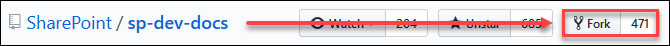
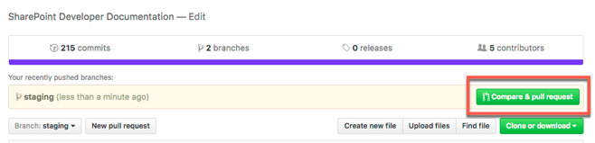

# Contribute to SharePoint developer documentation
Below instructions explain how you can prepare your environment to contribute to SharePoint Developer Documentation.

## Docs repo structure

Before you decide to contribute, it is important to understand the `sp-dev-docs` repo structure so you can decide where to add your new doc or update an existing doc.

```
sp-dev-docs
--images
--docs
```

The `docs` folder contains the key developer topics:

```
docs
--spfx
--apis
```
At this time, contributions are accepted for:

* SharePoint Framework Developer Preview
* SharePoint Webhooks

### SPFx Folder

The `spfx` folder is further classified into `basics` and `get-started`:

```
docs
--spfx
----basics
----get-started
```

`get-started` folder contains walkthroughs and tutorials on how to get started building client-side web parts.

`basics` folder contains client-side web part concept docs that are helpful in building client-side web parts. 

Any images associated with the docs should be uploaded into the `sp-dev-docs\images` folder.

### SharePoint Webhooks 

The `apis\webhooks` folder contains the documentation for SharePoint webhooks. It is further classified into webhook endpoints, for example: lists.

```
docs
--apis
----webhooks
-----lists
```

`webhooks` folder contains basic documentation around getting started and any other docs that cover webhooks in general.

`webhooks\lists` folder contains API documentation around the list subscription service.

Any images associated with the docs should be uploaded into the `sp-dev-docs\images` folder.

## Forking SharePoint Developer Docs repository

The first step is registering yourself on GitHub. Go to https://github.com/ and click on the "Sign up for GitHub" button. Once you're registered ensure you're logged on with your new account and navigate to the Office 365 Developer Patterns and Practices repository at https://github.com/sharepoint/sp-dev-docs. The right top side of the page contains a button called "Fork":



Clicking on this button will Fork the SharePoint developer documentation repository to your GitHub account. It's actually like taking a copy. Select your personal GitHub account you registered earlier as the account to for this repository.

Once the forking has been done you'll find the docs repo under your account with an URL: https://github.com/YOUR-USERNAME/YOUR-REPOSITORY

## Clone the forked repository

Now that you have forked the docs repository, to sync this forked repository to your local machine, you will need to clone the repository. You can find the clone URL in the `Clone or download` dropdown in the repo page. 


If you have any Git Desktop or any git source control installed, you can click the `Open is Desktop`, else follow the steps below:

In the Clone with HTTPs section, click  to copy the clone URL for the repository.

* Open your favorite console terminal.

* Change the current working directory to the location where you want to clone the docs repository.

* Type the following command to clone the repository:

```
git clone https://github.com/YOUR-USERNAME/YOUR-REPOSITORY
```

Press Enter and your local clone will be created.

```
git clone https://github.com/YOUR-USERNAME/YOUR-REPOSITORY
Cloning into 'sp-dev-docs'...
remote: Counting objects: 10, done.
remote: Compressing objects: 100% (8/8), done.
remove: Total 10 (delta 1), reused 10 (delta 1)
Unpacking objects: 100% (10/10), done.
```

## Switch to `staging` branch

In order to add your changes, you will need to do those in the `staging` branch.

Type the following command in the console to switch to `staging` branch:

```
git checkout staging
```

Now, you can update existing docs or add new docs to the docs repo.

### Adding new docs

Make sure you upload your doc in the right folders. For instance, web part docs should be in the following folder:

```
docs\spfx\web-parts
```
Depending on the doc's intent, you can choose to add your doc into  `basics` or `get-started` folder.

## Submit a pull request

Once you have completed adding your changes, you can submit a pull request. 

Navigate to the forked sp-dev-docs repo in your account. Make sure your current branch is `staging` branch.

Once you are in the staging branch, you should see a message to `Compare & pull request`



This will start a new pull request. Make sure you use the following [template]() to fill in your changes. Make sure you are creating this pull request against the `staging` branch.

Once you have all the information, click the `Create pull request` to submit your pull request.

## Syncing your forked repository to keep it up-to-date with the upstream repository

In order to keep your forked sp-dev-docs repo up-to-date with the parent repository, you will need to first [configure a remote that points to upstream repository](https://help.github.com/articles/configuring-a-remote-for-a-fork).

Once you have configured the upstream repository, follow the steps [here](https://help.github.com/articles/configuring-a-remote-for-a-fork) to sync your fork to keep it up-to-date with the upstream repository.
