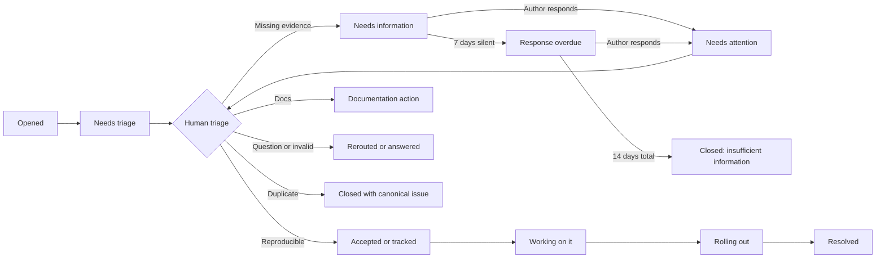
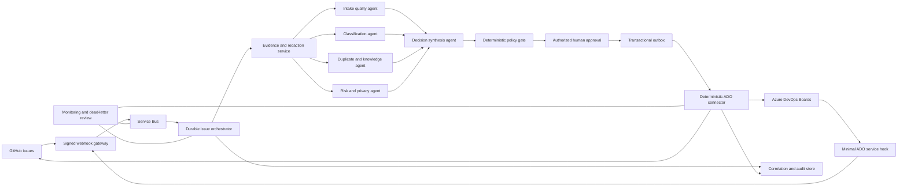

# Open issues SLT analysis

Snapshot date: 2026-08-26  
Repository: [SharePoint/sp-dev-docs](https://github.com/SharePoint/sp-dev-docs)  
Scope: all 294 issues open at the time of collection

## Executive assessment

The issue list needs an operational reset, not only a one-time cleanup. The backlog combines current product defects, old defects that have not been revalidated, support questions, documentation feedback, feature requests, and issues whose resolution labels indicate that they should already be closed.

The main leadership findings are:

1. **SPFx dominates the queue.** The normalized ownership view assigns 206 issues (70.1%) to SPFx. The intake form itself was explicitly submitted as SharePoint Framework for 189 issues (64.3%).
2. **The backlog is old and inactive.** There are 151 issues (51.4%) older than one year. There are 87 issues (29.6%) with no activity in more than one year. Median age is 376 days and median time since activity is 253 days.
3. **Assignment is not functioning as distributed ownership.** Although 284 issues are assigned, one account appears on 229 issues and the top two accounts appear on 269 assignments. This is a queue concentration risk, not evidence that the issues have active owners.
4. **Workflow state is largely absent.** Only 24 issues (8.2%) have any `status:*` label. There are 270 with no status, 113 with no `area:*` label, 48 with no type label, and 45 still marked `Needs: Triage :mag:`.
5. **The configured lifecycle automation is not producing the intended outcome.** Of 56 issues marked `Needs: Author Feedback`, 53 have been inactive for more than seven days and 50 for more than 30 days. Four answered, seven by-design, one fixed, and three rolling-in-production issues remain open. One open issue has `type:archive-old-issue`, despite the configured close action.
6. **The label model contains avoidable ambiguity.** Sixty-seven issues carry both `type:bug-suspected` and `type:bug-confirmed`. The intake templates request `Needs: Triage`, while the repository label and automation use `Needs: Triage :mag:`. The form captures a broad development model but not the granular owning area.
7. **The newest Copilot cohort is small but fast-moving.** Nine issues concern SPFx Copilot apps. All are younger than 133 days, two already have fix/work-in-progress statuses, and none are inactive for more than 180 days. This cohort should use a current-release response lane rather than enter the general backlog.

### SLT decision requested

Approve a 30-day backlog reset with one accountable issue-program owner, named engineering or content DRIs for each area, and a requirement that every retained issue has exactly one primary area, type, lifecycle status, and next action. Age alone must not be used to close confirmed defects.

Approve a separate, bounded GitHub-to-ADO pilot only after the public lifecycle is stable. The pilot requires a private integration service owner, an approved ADO project/process and field mapping, managed identity, area DRI approval gates, zero autonomous agent writes, and explicit security/privacy review.

## Method and definitions

The analysis used the GitHub issue API with `state: OPEN`, ordered by creation date. Three pages returned 100, 100, and 94 issues. Collection checks found 294 records, 294 unique issue numbers, no duplicates, and no remaining page.

Two different grouping dimensions are used:

- **Intake source** is the development model selected in the issue form. Similar free-text answers were normalized.
- **Owning area** is an operational classification. Existing `area:*` labels took precedence, followed by title/body evidence for broad or missing labels. The 13 residual exceptions were manually reviewed and assigned to an area.

Age is measured from issue creation to the snapshot date. Inactivity is measured from GitHub's `updated_at` value. Percentages are rounded. Labels and issue state can change after the snapshot.

The analysis does not determine whether a product bug is still reproducible. That requires the area DRI to validate it against a supported/current release. Comment count is used only as a demand signal, not as severity.

## Portfolio view

### Intake source

| Intake source | Issues | Share |
| --- | ---: | ---: |
| SharePoint Framework | 189 | 64.3% |
| SharePoint REST API | 29 | 9.9% |
| Declarative list formatting | 21 | 7.1% |
| SharePoint CSOM | 18 | 6.1% |
| Legacy or unparsed intake | 16 | 5.4% |
| Not applicable | 9 | 3.1% |
| Other | 5 | 1.7% |
| Site designs and scripts | 5 | 1.7% |
| SharePoint Add-ins | 2 | 0.7% |
| **Total** | **294** | **100.0%** |

### Normalized owning area

| Owning area | Issues | Share |
| --- | ---: | ---: |
| SPFx - Core, runtime, and other | 95 | 32.3% |
| APIs - CSOM and REST | 37 | 12.6% |
| SPFx - Extensions | 26 | 8.8% |
| SPFx - Lists and libraries | 22 | 7.5% |
| SPFx - Build tools and generator | 20 | 6.8% |
| SPFx - Web parts | 20 | 6.8% |
| List formatting - Columns and views | 12 | 4.1% |
| Documentation and localization | 11 | 3.7% |
| SPFx - Microsoft Teams | 9 | 3.1% |
| SPFx - Copilot apps | 9 | 3.1% |
| List formatting - Unspecified | 5 | 1.7% |
| SharePoint Embedded | 4 | 1.4% |
| Site designs and scripts | 4 | 1.4% |
| SPFx - Adaptive Card Extensions | 4 | 1.4% |
| Lists platform and UX | 3 | 1.0% |
| List formatting - Forms | 3 | 1.0% |
| Pages and content | 2 | 0.7% |
| Search | 2 | 0.7% |
| SharePoint Add-ins | 1 | 0.3% |
| Power Automate | 1 | 0.3% |
| PnP libraries | 1 | 0.3% |
| Migration APIs and tooling | 1 | 0.3% |
| SPFx - ACE mobile | 1 | 0.3% |
| Throttling | 1 | 0.3% |
| **Total** | **294** | **100.0%** |

## SPFx deep dive

The 206 normalized SPFx issues should not be treated as one queue. Almost half of them are in the broad core/runtime bucket, which indicates that the current taxonomy is still too coarse for routing.

| SPFx subarea | Total | Older than 1 year | Inactive over 180 days | Needs triage | Confirmed bugs |
| --- | ---: | ---: | ---: | ---: | ---: |
| Core, runtime, and other | 95 | 46 | 53 | 10 | 46 |
| Extensions | 26 | 13 | 12 | 3 | 15 |
| Lists and libraries | 22 | 14 | 17 | 4 | 14 |
| Build tools and generator | 20 | 4 | 8 | 7 | 12 |
| Web parts | 20 | 9 | 12 | 2 | 8 |
| Copilot apps | 9 | 0 | 0 | 0 | 1 |
| Microsoft Teams | 9 | 6 | 4 | 2 | 7 |
| Adaptive Card Extensions | 4 | 1 | 2 | 0 | 3 |
| ACE mobile | 1 | 1 | 1 | 0 | 1 |
| **SPFx total** | **206** | **94** | **109** | **28** | **107** |

### Recommended SPFx ownership lanes

1. **Core/runtime and web parts:** loading, authentication context, API permission UX, page/runtime behavior, React/runtime compatibility.
2. **Extensions and list integration:** application customizers, command sets, field/form customizers, list and library host changes.
3. **Build and developer experience:** generator, Node.js, Heft/Gulp, Sass/CSS, dependency and vulnerability handling.
4. **Host integrations:** Teams, Viva Connections/ACE, ACE mobile, and Office hosts.
5. **Copilot apps:** a separate preview/current-release lane with weekly product-team review and explicit rollout status.

The broad 95-item core bucket should be reclassified during reset into at least runtime/loading, authentication/permissions, page host, compatibility/dependencies, and developer tooling. The objective is routing, not adding labels for their own sake.

## Backlog health

### Age and activity

| Band | Created age | Last-activity age |
| --- | ---: | ---: |
| 0-30 days | 19 | 34 |
| 31-90 days | 20 | 39 |
| 91-180 days | 45 | 44 |
| 181-365 days | 59 | 90 |
| More than 365 days | 151 | 87 |
| **Total** | **294** | **294** |

The backlog is still growing: 105 currently open issues were created in 2026, compared with 125 in 2025 and 54 in 2024. These are open-cohort counts, not total annual intake, because closed issues are outside this scan.

### Type and workflow quality

The primary-type view resolves overlapping labels by preferring invalid/non-development, then confirmed bug, suspected bug, feature request, question, discussion, and untyped.

| Primary type | Issues | Share |
| --- | ---: | ---: |
| Confirmed bug | 158 | 53.7% |
| Suspected bug | 66 | 22.4% |
| Untyped | 48 | 16.3% |
| Feature request | 14 | 4.8% |
| Invalid/non-development | 4 | 1.4% |
| Discussion | 2 | 0.7% |
| Question | 2 | 0.7% |

Raw label overlaps matter operationally:

- 159 issues have `type:bug-confirmed`.
- 134 have `type:bug-suspected`.
- 67 have both labels and need normalization.
- 24 unique issues have a `status:*` label; 270 do not.
- Status labels include eight fixed-next-drop, seven by-design, four answered, three rolling-in-production, three working-on-it, two to-be-reviewed, one fixed, and one tracked. Some issues have multiple statuses.

### Assignment concentration

| Assignee | Issue assignments |
| --- | ---: |
| Ashlesha-MSFT | 229 |
| Amey-MSFT | 40 |
| Unassigned issues | 10 |
| VesaJuvonen | 8 |
| jansenbe | 6 |
| andrewconnell | 4 |
| nick-pape | 3 |
| Other named accounts | 2 |

Multiple assignees can be present on one issue, so assignments do not sum to 294. The management problem is concentration: a default assignee must not substitute for an accountable product-area DRI and a dated next action.

## Priority cohorts

### Immediate workflow resolution

Within five business days, review and resolve the state contradictions:

- Eleven unique issues labeled answered, by-design, or fixed should receive a final public explanation and normally close.
- Three rolling-in-production issues should have rollout completion checked. Close completed rollouts; otherwise add geography/tenant scope and next checkpoint.
- Eight fixed-next-drop issues need a target release/date and closure check. Two also say working-on-it and one also says rolling-in-production.
- Fifty-three `Needs: Author Feedback` issues are beyond the configured seven-day inactivity threshold. Verify the automation, apply the documented policy consistently, and preserve issues where Microsoft still owns the next action.
- One open archive-labeled issue should be checked for workflow failure.

Do not close a confirmed issue merely because it is old. Reproduce it on a supported version, document the result, and then fix, track, supersede, reroute, or close it with evidence.

### Highest engagement

These are the first issues to revalidate because they combine visible demand with unresolved status. Comment count is not severity, but silence on these issues has outsized community impact.

| Issue | Comments | Area | Current signal |
| --- | ---: | --- | --- |
| #9434 | 109 | SharePoint Embedded | PowerShell connection failure |
| #9944 | 75 | SPFx lists and libraries | Command Customizers in the new UI |
| #9918 | 52 | SPFx core/runtime | React 18 support |
| #10041 | 49 | SPFx core/runtime | API permissions disappear; marked rolling |
| #9896 | 46 | SPFx lists and libraries | Command Set load failure; marked rolling |
| #10211 | 42 | SPFx lists and libraries | Web part pages stopped working under lists |
| #10143 | 33 | SPFx core/runtime | API permission approval failure |
| #9672 | 31 | SPFx core/runtime | Admin API access principal error |
| #10070 | 26 | Documentation/localization | Rate-limit quota behavior |
| #10180 | 26 | SPFx core/runtime | PDF host load failure |

Each should receive one of four public outcomes: confirmed and linked to an engineering work item; fixed with release evidence; not reproducible with a current minimal reproduction request; or closed/rerouted with a clear reason.

### Copilot current-release lane

The nine Copilot-app issues are #10775, #10942, #10944, #10989, #10994, #10997, #11004, #11005, and #11006. Keep these in a weekly product review while the capability is changing rapidly. Publish known-issue guidance when the same host, authentication, cache, permission-policy, or rendering behavior affects multiple reports.

## Root causes in the operating model

1. **Intake is broader than ownership.** The issue form asks for SharePoint Framework but not SPFx subarea, host, supported version, or severity/impact. Manual routing is unavoidable.
2. **Automation definitions are fragmented.** Similar lifecycle logic exists in FabricBot/resource-management configuration, while label-action automation separately handles archival. Current queue state shows that intended outcomes need an end-to-end execution test.
3. **The triage label name is inconsistent.** Issue templates request `Needs: Triage`; the repository taxonomy and bot configuration use `Needs: Triage :mag:`.
4. **Status taxonomy is incomplete for normal backlog work.** Existing labels describe special outcomes, but there is no simple enforced progression such as new, validating, accepted/backlog, internally tracked, fixing, rollout, and resolved.
5. **A default assignee masks queue ownership.** Most issues appear assigned, but aging and missing statuses show that assignment alone is not an effective control.
6. **Public and internal tracking are weakly connected.** Only one issue is labeled tracked. Accepted product defects need an internal work-item reference or a privacy-safe tracking marker plus a public update cadence.

## Automation benchmark

The following repositories and official guidance were reviewed on the snapshot date. The objective was to identify reusable operating patterns, not to copy another repository's labels or automation unchanged.

| Source | Useful pattern | Recommendation for this repository |
| --- | --- | --- |
| [Microsoft 365 Agents Toolkit issue policy](https://github.com/OfficeDev/microsoft-365-agents-toolkit/blob/main/.github/policies/scheduler.yml) | A two-stage missing-information process; bug and feature-request labels are protected from automatic closure | Adopt the two-stage process and a broader protected-label list |
| [Microsoft 365 Agents Toolkit comment policy](https://github.com/OfficeDev/microsoft-365-agents-toolkit/blob/main/.github/policies/issueCommentManagement.yml) | A non-member reply returns the issue to the attention queue | Return author replies to the owning-area queue automatically |
| [Microsoft 365 Agents Toolkit intake](https://github.com/OfficeDev/microsoft-365-agents-toolkit/tree/main/.github/ISSUE_TEMPLATE) | Blank issues are disabled and questions are redirected | Disable blank issues and provide explicit support, feature, and security destinations |
| [Microsoft 365 Agents Toolkit AI triage](https://github.com/OfficeDev/microsoft-365-agents-toolkit/blob/b304dcfaaba69d34c3379a490f3f6f8e3340c390/.github/workflows/ai-triage.yml) | AI-assisted labeling and comments on new issues | Use only as advisory triage after privacy and security review; do not allow autonomous closure |
| [VS Code bug intake](https://github.com/microsoft/vscode/blob/main/.github/ISSUE_TEMPLATE/bug_report.md) | Test the current/Insiders build, isolate extensions, and use an in-product reporter to prefill diagnostics | Ask for latest supported SPFx reproduction and eventually provide a diagnostic collection command |
| [.NET Runtime bug form](https://github.com/dotnet/runtime/blob/main/.github/ISSUE_TEMPLATE/01_bug_report.yml) | Explicit regression, last-known-good, workaround, minimal reproduction, and configuration fields | Add these fields to the product-bug forms |
| [.NET Runtime cleanup policy](https://github.com/dotnet/runtime/blob/main/.github/policies/resourceManagement.yml) | Warning before closure, cancellation on any new activity, and area-label subscriber routing | Use warning/cancellation semantics and route area labels to owner teams |
| [.NET Runtime cleanup explanation](https://github.com/dotnet/runtime/blob/main/docs/issue-cleanup.md) | The cleanup policy is public and designed to trigger re-evaluation, not silently remove issues | Publish the policy and explain every automated transition |
| [Kubernetes bug form](https://github.com/kubernetes/kubernetes/blob/master/.github/ISSUE_TEMPLATE/bug-report.yaml) | Minimal and precise reproduction, exact version output, and a private security route | Require command output where practical and prominently separate security reporting |
| [TypeScript bug form](https://github.com/microsoft/TypeScript/blob/main/.github/ISSUE_TEMPLATE/bug_report.yml) | Search terms, current/nightly validation, regression range, and a small self-contained playground | Capture search terms and promote small public reproduction projects |
| [PowerToys bug form](https://github.com/microsoft/PowerToys/blob/main/.github/ISSUE_TEMPLATE/bug_report.yml) | Required product area and version plus a list of known high-volume issues before submission | Put current known issues and area selection directly in intake |
| [PowerToys AI triage](https://github.com/microsoft/PowerToys/blob/main/.github/workflows/issue-triage.md) | Bounded AI, deterministic evidence, sanitized diagnostics, verified duplicate candidates, one canonical updatable summary | If AI is piloted, copy these controls rather than allowing free-form agent writes |
| [GitHub issue-form syntax](https://docs.github.com/en/communities/using-templates-to-encourage-useful-issues-and-pull-requests/syntax-for-issue-forms) | Required structured fields, default labels, issue types, and projects | Keep YAML forms and make investigation-critical fields required |
| [GitHub Actions secure-use guidance](https://docs.github.com/en/actions/security-for-github-actions/security-guides/security-hardening-for-github-actions) | Least privilege, full-SHA action pins, CODEOWNERS, safe handling of untrusted input, and dependency monitoring | Apply these controls to every issue-management workflow |
| [`actions/stale`](https://github.com/actions/stale) | Dry-run, label exemptions, activity-based reset, operation limits, and explicit closure reason | Use only if the Microsoft policy service is not the selected lifecycle engine |

### Benchmark conclusion

No peer provides a perfect turnkey model. The strongest combined design is:

1. Native structured issue forms for input quality.
2. One deterministic policy engine for labels, timers, messages, and closure.
3. Area-owner subscriptions rather than a repository-wide default assignee.
4. Automatic closure only for narrowly eligible, human-requested missing information.
5. Human-reviewed resolution for confirmed bugs, tracked work, feature requests, regressions, security, and high-impact issues.
6. AI limited to summaries, area suggestions, missing-information suggestions, and duplicate candidates, with deterministic verification.

## Current automation audit

| Current behavior | Gap or risk | Recommended correction |
| --- | --- | --- |
| Both `.github/fabricbot.json` and `.github/policies/resourceManagement.yml` define overlapping lifecycle actions | Competing definitions can drift or race; it is unclear which deployment is authoritative | Select one engine, port all behavior, test parity, and disable the other |
| `.github/label-actions.yml` and its workflow separately close archived issues | A third engine owns one transition | Move archive behavior into the selected lifecycle engine or document it as an intentional exception |
| Blank issues are enabled | Users can bypass required quality fields and routing | Set `blank_issues_enabled: false` |
| Forms request `Needs: Triage`, while the active label is `Needs: Triage :mag:` | GitHub does not apply a default form label that does not already exist exactly | Normalize label names and add a configuration test |
| A generic new-issue comment promises triage "as soon as possible" | It creates a notification but no measurable commitment | State the target first-review window and current state |
| `Needs: Context Detail :question:` adds `Needs: Author Feedback` | The request does not identify exact missing fields or a due date | Use a structured `/needs-info` action with selected missing fields and dates |
| `type:incomplete-submission` closes immediately | The author has no repair window | Use the 7-day warning and 14-day closure sequence |
| The stale path should act after 7 and 14 days | Fifty-three current issues are already beyond the first threshold | Add a daily health assertion and alert when eligible candidates are not processed |
| Answered, by-design, fixed, and rolling statuses remain open | Resolution automation is not completing or statuses are being used inconsistently | Define idempotent close transitions and monitor contradictions daily |
| Feature messages still call the destination "SP Dev UserVoice" | The short link now resolves to the Microsoft SharePoint Feedback Portal | Keep the working short link but update all visible naming and guidance |
| Most issues receive one of two default assignees | Assignment is not indicating active product ownership | Remove default assignment and route by area to a team, project field, or subscriber list |
| The label-action workflow grants `pull-requests: write` while processing only issues | Excess token permission | Use `contents: read` and `issues: write` only |
| `dessant/label-actions@v2` is a movable major tag | A third-party tag can change | Pin the verified release to a full commit SHA and enable Dependabot for actions |
| Issue text can be processed by workflows and potentially external AI | Issue bodies are untrusted and may contain personal or secret data | Never interpolate issue text into shell; sanitize data and require review before external transmission |

## Target issue operating model

### One state machine

Use labels as the public state and a GitHub Project as the operational dashboard. An issue must have exactly one primary type, one primary area, one lifecycle status, one DRI, and one next-review date.



Automation must never infer the `Reproducible` transition. A human or trusted engineering integration must confirm a bug.

### Proposed label dimensions

Use lower-case, machine-friendly names without emoji. Renaming must be coordinated with every workflow, saved query, Project rule, and external integration.

| Dimension | Proposed labels | Rule |
| --- | --- | --- |
| Type | `type:bug`, `type:documentation`, `type:question`, `type:feature`, `type:discussion` | Exactly one after triage |
| Area | `area:spfx-core`, `area:spfx-web-parts`, `area:spfx-extensions`, `area:spfx-lists`, `area:spfx-tooling`, `area:spfx-teams`, `area:spfx-ace`, `area:spfx-copilot`, `area:api-rest`, `area:api-csom`, `area:list-formatting`, `area:embedded`, `area:docs`, `area:other` | Exactly one primary area; add a secondary host label only when it changes routing |
| Lifecycle | `status:needs-triage`, `status:needs-information`, `status:needs-attention`, `status:validating`, `status:accepted`, `status:tracked`, `status:working`, `status:rolling-out` | Exactly one open lifecycle status |
| Resolution | `resolution:answered`, `resolution:duplicate`, `resolution:fixed`, `resolution:by-design`, `resolution:invalid`, `resolution:insufficient-information`, `resolution:obsolete` | Applied when closing; retain for reporting |
| Priority | `priority:p0`, `priority:p1`, `priority:p2`, `priority:p3` | Optional; trusted maintainers only |
| Automation | `automation:response-overdue`, `automation:keep-open`, `automation:dry-run` | Operational controls, not product meaning |
| Qualifiers | `regression`, `security-review`, `has-workaround`, `preview`, `customer-impact:high` | Optional evidence and protection signals |

Do not keep both suspected and confirmed bug as permanent type labels. Use `type:bug` plus lifecycle `status:validating` or `status:accepted`. This makes type and state independent and removes the current 67-item overlap.

### Protected issues

The automatic missing-information closure must exclude any issue with one or more of these conditions:

- `status:accepted`, `status:tracked`, `status:working`, or `status:rolling-out`.
- `automation:keep-open`, `security-review`, `regression`, `priority:p0`, or `priority:p1`.
- A milestone or an active internal engineering link.
- A confirmed product defect, unless a human explicitly removes accepted status and records why the report is no longer actionable.
- An open incident, current release regression, or rollout-monitoring issue.

Age alone is never sufficient to auto-close an accepted issue. For accepted issues inactive for 180 days, open an owner revalidation task or add `status:revalidation-needed`; do not post a blame-oriented stale comment to the reporter.

## Intake quality design

### Replace generic intake with explicit routes

1. **Product or API bug:** structured form with development model and owning area.
2. **SPFx bug:** specialized form with SPFx version, Node.js version, package manager, host, component type, and latest-supported-version validation.
3. **Documentation problem:** page URL, inaccurate section, expected correction, and whether the user can submit a PR.
4. **Feature request:** contact link named "SharePoint Feedback Portal" using the existing `https://aka.ms/sp-dev-uservoice` redirect, unless leadership chooses to accept selected developer feature requests directly.
5. **Support or how-to question:** contact link to the approved support/community destination, with a clear statement that GitHub tracks reproducible developer defects and documentation work.
6. **Security vulnerability:** prominent private reporting instructions from `SECURITY.md`; never request vulnerability details in a public issue.

Disable blank issues. Keep an "Other developer issue" form only if it still requires area, impact, expected outcome, and enough context to route.

### Required bug fields

- Confirmation that the reporter searched existing issues, plus the search terms used.
- Product model and granular area: SPFx core, web part, extension type, list/library host, build tooling, Teams, ACE, Copilot app, REST, CSOM, list formatting, Embedded, or other.
- Exact current version and last version known to work; confirmation against the latest supported release where practical.
- Target environment, tenant scope, host/client, browser, OS, Node.js, and package-manager versions as applicable.
- Actual behavior and expected behavior in separate required fields.
- Minimal and precise reproduction steps.
- A small public reproduction repository or code sample when the issue depends on custom code. Do not request production packages or secrets.
- Regression status, customer impact/scope, frequency, and known workaround.
- Searchable text logs in a rendered code field. Screenshots can supplement but not replace error text.
- Confirmation that logs and samples contain no credentials, tokens, personal data, tenant identifiers, or confidential content.

Issue forms cannot dynamically translate a dropdown choice into an area label by themselves. Use stable field IDs and a small deterministic action to map exact option values to existing labels. Unknown values must remain in `status:needs-triage`, not be guessed.

### Submission-time assistance

- Show the five to ten current high-volume known issues in the form, reviewed each release.
- Link directly to searches scoped by the selected product area.
- Provide commands that collect safe version information, for example SPFx, Node.js, npm/pnpm, browser, and generator versions.
- Longer term, add a first-party `spfx doctor` or issue-report command that emits a redacted Markdown environment block. Do not upload diagnostic archives automatically.
- Auto-add new issues to the triage Project through a repository rule or trusted workflow.

## Missing-information automation

The requested 7-day warning and 14-day closure should be measured from the moment a maintainer requests specific information, not from issue creation.

| Time | Required transition | Automation behavior |
| --- | --- | --- |
| Request time | `status:needs-information` | Human selects exact missing items; automation removes `status:needs-triage`/`status:needs-attention`, records request timestamp, and posts one message |
| Day 7 without author response | Add `automation:response-overdue` | Post one warning with the exact planned closure date |
| Any author response before closure | `status:needs-attention` | Remove needs-information and overdue labels, cancel timers, notify area DRI, and upsert rather than duplicate comments |
| Day 14 without author response | Close as `not_planned` with `resolution:insufficient-information` | State that closure is about missing evidence, not a conclusion that the report is invalid |
| First 30 days after closure | Remain unlocked | A complete follow-up can be reviewed and the issue reopened by a maintainer; then normal lock policy can apply |

Only a human-applied `status:needs-information` starts this clock. AI may suggest missing fields but must not start a closure timer.

### Message templates

#### Initial intake

> Thank you for reporting this. The issue is in `status:needs-triage`. We target an initial human review within two business days and no later than five business days. Please do not add credentials, access tokens, personal data, tenant-private URLs, or confidential content. If you find an existing issue that describes the same behavior, link it here rather than opening another report.

#### Information request

> We need the following information to investigate this issue: **{exact missing items}**. Please edit the issue or reply with those details. This request was added on **{request date}**. If there is no response within 7 days, the issue will be marked response-overdue; after 14 days it may close as insufficient information. Closure does not mean the reported behavior was determined to be invalid.

#### Day-7 warning

> We still need **{exact missing items}**. If there is no response by **{closure date}**, this issue will close as insufficient information. Any response from the author cancels the closure timer and returns the issue to the owning team's attention queue.

#### Day-14 closure

> Closing as `resolution:insufficient-information` because the requested investigation details were not provided within 14 days. We have not determined that the report is invalid. If the issue still occurs, provide the requested details in a new issue or comment here during the review window so a maintainer can reassess it. Do not include secrets or private tenant data.

#### Author response

> Thank you for the update. The automated closure timer has been cancelled and the issue has returned to `status:needs-attention` for the **{area}** owner.

#### Duplicate closure

> Closing as a duplicate of **#{canonical issue}**. Please add new reproduction evidence or impact details to the canonical issue so investigation remains consolidated.

#### Fixed or rollout closure

> This was addressed in **{release/build/rollout}**. Please verify with that version or a tenant where rollout is complete. If the same behavior remains, open a new issue with current environment details and link this issue.

## Resolution and aging rules

| Cohort | Automated action | Human requirement |
| --- | --- | --- |
| Needs information | Warn at day 7; close at day 14 if eligible | Human initiates request and specifies missing evidence |
| Answered | Add `close-wait`; close after 3 days without author response | Human provides the answer first |
| Duplicate | Close immediately | Human identifies a canonical issue; automation verifies it exists and is an issue, not a PR |
| Invalid/non-development | Close with correct support route | Human confirms routing unless deterministic template evidence is sufficient |
| Fixed | Close when release/rollout evidence is present | Human or trusted release integration supplies version/build |
| Rolling out | Remind owner at 14 days and then every 14 days | Owner confirms rollout scope and completion; never auto-close solely on time |
| Accepted/tracked bug | Remind owner every 30 days if no public update | Never auto-close for inactivity |
| Old unvalidated issue | Add to an owner revalidation queue after 180 days | Human reproduces, supersedes, reroutes, or closes with evidence |
| Feature request | Route to Feedback Portal or accepted product backlog | Never close as stale while explicitly accepted or under review |

Any comment that cancels stale closure should be recorded, but only an author response should satisfy an author-information request. A community comment can add useful evidence while the issue remains waiting for the original reporter's environment details.

## Recommended automation architecture

### Select one lifecycle engine

Prefer the Microsoft GitOps PullRequestIssueManagement/resource-management policy already used by this repository, provided the owning service is supported and observable. Make `.github/policies/resourceManagement.yml` the source of truth and retire `.github/fabricbot.json` only after feature parity is demonstrated. If that service is not supportable, use GitHub Actions with a small first-party action and `actions/stale`; do not run both designs.

Suggested repository surfaces:

- `.github/ISSUE_TEMPLATE/bug-report.yml`: general product/API bug form.
- `.github/ISSUE_TEMPLATE/spfx-bug.yml`: SPFx-specific form.
- `.github/ISSUE_TEMPLATE/docs.yml`: documentation issue form.
- `.github/ISSUE_TEMPLATE/config.yml`: blank disabled; feature, support, and security routes.
- `.github/issue-management/labels.yml`: machine-readable taxonomy and exclusivity groups.
- `.github/issue-management/messages/`: versioned message templates.
- `.github/policies/resourceManagement.yml`: authoritative event and scheduled transitions.
- `.github/workflows/issue-form-validation.yml`: validate forms, labels, links, and policy fixtures on PRs.
- `.github/workflows/issue-health.yml`: daily dry-run/audit summary and manual dispatch.
- `.github/CODEOWNERS`: require issue-program owner review for issue templates, policies, and workflows.
- `.github/dependabot.yml`: maintain GitHub Action dependencies.
- `docs/issue-management.md`: public lifecycle, labels, SLAs, closure/reopen policy, and owner map.

### Deterministic automation responsibilities

1. Apply the initial triage label and add the issue to the Project.
2. Parse stable form choices and map only exact values to area labels.
3. Enforce one type and one lifecycle label by removing superseded labels in the same transition.
4. Route the area to a team/subscriber list and set Project DRI/next-review fields.
5. Run the missing-information timers and protected-label checks.
6. Upsert one marker-based automation comment instead of posting repeated comments.
7. Validate canonical duplicate links, release fields, and close reasons.
8. Produce a daily audit summary: candidate count, changed count, skipped/protected count, failures, and contradictions.
9. Open or update one internal health issue when automation fails or eligible candidates remain unprocessed.

### Security and reliability requirements

- Default `GITHUB_TOKEN` to read-only; grant only `contents: read` and `issues: write` to the job that needs them.
- Remove `pull-requests: write` from issue-only workflows.
- Pin every third-party action to a verified full commit SHA, with the release version in a comment.
- Require CODEOWNER approval for `.github/workflows/**`, `.github/policies/**`, issue templates, and message templates.
- Never place issue title/body text directly inside a generated shell command. Pass untrusted values through safe action inputs or quoted environment variables.
- Do not send issue bodies, attachments, repository tokens, or tenant data to an external AI/service without privacy, security, and data-retention approval.
- Use concurrency keyed by issue number, idempotency markers, timeouts, rate limits, and operation caps.
- Test transitions against fixture issues in a non-production repository or dry-run mode.
- Use explicit close reason `not_planned` for insufficient information, invalid, duplicate, or obsolete work; use `completed` for fixed/documentation-completed work.
- Keep auto-closed issues unlocked for a review window; lock only after 30 additional days without activity.
- Add Dependabot, dependency review, and CodeQL/default workflow scanning where available.

## AI-assisted triage policy

AI can reduce reading and duplicate-search cost, but it must not become the decision maker.

Allowed outputs:

- A concise canonical summary updated when the issue body changes.
- Suggested area and type with confidence.
- Exact missing-information suggestions.
- Up to five duplicate candidates with evidence and confidence.
- Detection of likely secrets or personal information with instructions to remove them; never repeat the sensitive value.

Disallowed outputs:

- Confirming or rejecting a bug.
- Applying priority, accepted, fixed, by-design, invalid, or security conclusions.
- Starting a closure timer or closing/locking an issue.
- Posting unsupported promises, internal work-item details, or generated product answers.

Controls:

1. Build deterministic issue evidence first and hash it.
2. Sanitize diagnostics and redact emails, IP addresses, tenant URLs, user paths, tokens, GUIDs, and identifiers before model use.
3. Restrict tools and write permissions; publish through a separate verifier that checks current evidence.
4. Validate duplicate candidates still exist, belong to this repository, are issues rather than PRs, and describe the same behavior.
5. Use one canonical marker comment that is updated, not a stream of bot comments.
6. Set confidence thresholds, rate/credit limits, and a kill switch.
7. Sample results weekly and report routing precision, duplicate precision, missing-information precision, and maintainer override rate.

Start with deterministic automation. Pilot AI only after label/state hygiene and baseline metrics are stable; otherwise it will automate an inconsistent taxonomy.

## Agentic GitHub-to-ADO architecture

### Architectural objective

Create an end-to-end process that can review every GitHub issue, assemble evidence, recommend a disposition, obtain the correct human decision, create or link an internal Azure DevOps (ADO) work item when warranted, and keep a safe public status synchronized.

The system must preserve these boundaries:

1. **GitHub is the public intake and community communication system.**
2. **ADO is the internal engineering commitment and delivery system.** Only actionable work that a team intends to investigate or deliver belongs there. Microsoft guidance explicitly recommends pushing only actionable work items into ADO and maintaining integration state in a separate data store.
3. **Agents advise; accountable humans decide.** No model can confirm a bug, assign priority, disclose internal data, create an ADO item, or close a GitHub issue by itself.
4. **Connectors execute deterministic decisions.** A narrowly scoped service, not an agent, owns ADO writes and public synchronization.
5. **Public and internal content are allowlisted separately.** Internal titles, comments, people, URLs, priorities, incident data, and work-item IDs never flow back to GitHub unless explicitly approved for public release.

Relevant first-party references:

- [Use service principals and managed identities in Azure DevOps](https://learn.microsoft.com/azure/devops/integrate/get-started/authentication/service-principal-managed-identity?view=azure-devops)
- [Create an ADO work item with the REST API](https://learn.microsoft.com/rest/api/azure/devops/wit/work-items/create?view=azure-devops-rest-7.1)
- [Azure DevOps integration best practices](https://learn.microsoft.com/azure/devops/integrate/concepts/integration-bestpractices?view=azure-devops)
- [Azure DevOps service-hook webhooks](https://learn.microsoft.com/azure/devops/service-hooks/services/webhooks?view=azure-devops)
- [Connect Azure Boards to GitHub](https://learn.microsoft.com/azure/devops/boards/github/connect-to-github?view=azure-devops)

### Recommended deployment boundary

Run the integration as an Azure-hosted internal service, not as a GitHub Actions workflow that writes directly to ADO.

- A GitHub App receives issue events and has only repository metadata plus issue read/write permissions. Add contents read only if documentation retrieval is required.
- An HTTPS ingress verifies the GitHub webhook signature and delivery ID before accepting an event.
- Azure Service Bus decouples event receipt from processing, provides duplicate detection, retry, and a dead-letter queue.
- Durable Functions, Container Apps jobs, or an equivalent orchestrator maintain workflow state.
- A user-assigned managed identity authenticates the ADO connector. Use a service principal only if the service cannot run on Azure. Do not use a personal access token in production.
- Azure DevOps grants that identity access only to the target project and work-item operations it requires. ADO uses its own permission model; Entra application permissions do not grant ADO access.
- Key Vault holds the GitHub App private key and webhook secret. The managed identity needs no ADO secret.
- Application Insights and an immutable audit sink record operations without storing raw sensitive issue content.
- Integration code, internal ADO mappings, organization/project names, and private prompts belong in a separate private service repository. This public repository contains only forms, labels, public policy, and public status conventions.

If a GitHub App cannot be approved initially, a GitHub Actions publisher can send a minimal signed event envelope to Azure using OIDC federation. It still must not hold an ADO PAT or perform ADO writes directly.

### Component model



### Specialist agents

All agents receive sanitized, structured evidence and have read-only tools. Each output must validate against a versioned JSON schema.

| Agent | Responsibility | Explicitly prohibited |
| --- | --- | --- |
| Intake quality agent | Determine which required evidence is present and name exact missing fields | Starting timers, applying labels, or deciding validity |
| Classification agent | Suggest type, area, host, affected release, and likely owner with confidence and evidence | Confirming bugs, priority, or ownership commitment |
| Duplicate and knowledge agent | Search public issues, public docs, known issues, and authorized internal summaries for related records | Revealing internal ADO data or declaring a duplicate |
| Risk and privacy agent | Detect likely secrets, personal data, security content, incident signals, or unsafe attachments | Repeating sensitive values or posting public security conclusions |
| Decision synthesis agent | Produce one concise recommendation packet with alternatives and unresolved questions | Calling GitHub/ADO write tools or choosing the final disposition |
| Public update agent | Draft an allowlisted external status message from approved structured fields | Reading arbitrary internal comments or publishing dates not approved by an owner |

An optional reproduction agent can be introduced later for small public samples. It must run untrusted code in an ephemeral, isolated sandbox with no production secrets, no internal network, restricted egress, resource/time limits, artifact scanning, and complete teardown. It is not part of the minimum viable architecture.

### Evidence packet

The evidence service creates a point-in-time packet and SHA-256 hash. Agent recommendations and human decisions are valid only for that evidence hash.

Minimum packet:

- Repository and immutable GitHub issue node ID, issue number, URL, author association, creation/update times.
- Current title, body revision, labels, lifecycle status, and sanitized relevant comments.
- Structured issue-form values and completeness result.
- Exact environment and version data, reproduction, expected/actual behavior, regression, impact, and workaround.
- Public duplicate candidates and known-issue/document matches.
- Existing correlation record and public status, if any.
- Internal duplicate candidate IDs represented only as opaque references for authorized reviewers.
- Redaction findings and a `public-safe`, `restricted-review`, or `security-route` classification.

Issue content is untrusted data, not agent instructions. The evidence wrapper must clearly delimit it, strip active markup where appropriate, reject oversized inputs, and never interpolate it into shell commands.

### Decision packet and human gate

The synthesis agent emits a recommendation, not a command. A human approver reviews this packet in the triage Project, a secured internal UI, or a maintainer command whose actor/team membership is verified through GitHub.

Required decision fields:

| Field | Purpose |
| --- | --- |
| `decisionId` | Globally unique immutable audit ID |
| `githubIssueKey` | `SharePoint/sp-dev-docs#<number>` plus immutable node ID |
| `evidenceHash` | Prevents approval against stale evidence |
| `disposition` | Request information, duplicate, docs action, reroute, accept/create, accept/link existing, feature review, security/incident route, or close |
| `humanApprover` | Verified GitHub/Entra identity and role |
| `approvedAt` | UTC approval time |
| `area` and `owner` | Accountable receiving team/DRI |
| `severity` and `priority` | Human-approved; never model-assigned |
| `adoTarget` | Allowlisted project, work-item type, and area mapping |
| `existingAdoId` | Required for link-existing decisions |
| `publicStatus` | Approved public lifecycle value |
| `publicMessage` | Approved message or template inputs only |
| `nextReviewAt` | Public and internal follow-up control |
| `expiresAt` | Forces re-review if execution is delayed or evidence changes |

Before execution, the deterministic policy gate verifies:

1. The issue and evidence hash are current.
2. The actor is authorized for the area and disposition.
3. Required fields and approvals are present.
4. Protected/security rules are satisfied.
5. ADO target values exist in an allowlist and current ADO metadata.
6. No active correlation already exists unless the decision is link/update.
7. The public message contains no internal URL, ADO ID, personal data, or restricted field.

### Decision-to-ADO matrix

| GitHub disposition | ADO action | Required approver | Public outcome |
| --- | --- | --- | --- |
| Missing information | None | Area triager | Start the 7/14-day information workflow |
| Suspected/unvalidated bug | None | Area triager | `status:validating`; keep in GitHub |
| Reproducible, actionable product bug | Create `Bug` or link existing | Engineering area DRI | `status:tracked` and next public update date |
| Current-release regression with high impact | Create/link bug; evaluate incident route | Engineering DRI; incident owner for escalation | `status:tracked` or approved incident message |
| Security vulnerability | Do not use normal public-to-ADO flow | Security response owner | Move to private security process; minimize public comment |
| Service incident | Use the approved ICM/incident process; optionally link ADO | Incident commander/service owner | Only approved service communication |
| Duplicate of public issue | Link evidence to canonical record; no new ADO item | Area triager | Close with public canonical GitHub issue |
| Duplicate of internal work | Link GitHub issue to existing ADO item | Engineering area DRI | `status:tracked`; never reveal internal duplicate details |
| Documentation defect | Usually GitHub PR/issue only; create ADO task only for committed internal work | Docs owner | Documentation action and target date |
| Support/how-to question | None | Area triager | Answer or route to support/community |
| By design/invalid/unsupported version | None | Area DRI for contested cases | Explain evidence and close |
| Feature request | None until product review accepts it; then create/link appropriate backlog item | Product manager | Feedback Portal or accepted-feature status |

ADO creation requires all of the following:

- A human has accepted the work as actionable.
- The owning engineering/product area is known.
- Evidence is sufficient for the receiving team to start investigation.
- A search found no existing public or internal canonical item, or the approver explicitly chose create-new.
- The target release is supported or a current regression exception is approved.
- The payload has passed redaction and field allowlisting.
- The decision has not expired and still matches current issue evidence.

### ADO work-item contract

ADO process templates and custom fields vary. During onboarding, the connector must query work-item type, field, relation, area, and iteration metadata and validate its mapping. Never use `bypassRules=true`.

Recommended mapping:

| ADO field/content | Source and rule |
| --- | --- |
| `System.Title` | Sanitized concise problem statement; maximum 255 characters |
| Work item type | Human-approved mapping, normally `Bug`; accepted features use the receiving team's requirement type |
| `System.AreaPath` | Deterministic area-label-to-ADO mapping; no model-generated path |
| `System.IterationPath` | Default backlog/unplanned iteration; only a product owner assigns a committed iteration |
| Description | Sanitized summary, impact, environment, expected/actual behavior, and GitHub link |
| Reproduction field | Minimal steps and public sample link; no attachments copied automatically |
| Priority/severity | Human-approved values mapped to the target process |
| Tags | `GitHub`, `sp-dev-docs`, normalized public area, and integration version |
| Custom external key | Immutable `SharePoint/sp-dev-docs#<number>` correlation key |
| Custom evidence hash | Hash of the approved evidence packet |
| External relation | Native GitHub Issue relation if the Azure Boards GitHub connection is approved; otherwise a standard hyperlink |
| History comment | Decision ID, approver, source URL, evidence hash, and connector version |

Do not copy the full comment history, reporter email, tenant identifiers, attachments, or raw logs. Link to the public issue and include only the evidence needed to act. If restricted evidence is necessary, place it in an approved internal evidence store and add an access-controlled reference.

Use the REST API's `validateOnly=true` mode before first-time mappings and in integration tests. Create and update requests use `application/json-patch+json`. Batch related field changes into one update to limit revisions and throttling.

### Idempotent creation and transactional outbox

ADO work-item creation does not provide a cross-system transaction with GitHub. Implement it as a saga:

1. Acquire a distributed lock on `SharePoint/sp-dev-docs#<number>`.
2. Insert an outbox record with unique external key, decision ID, evidence hash, and state `ADO_CREATE_PENDING`.
3. Check the mapping store and query the exact custom external key in the allowlisted project.
4. If a work item exists, link it instead of creating another.
5. Validate the JSON Patch document against current ADO metadata.
6. Create the work item once and persist its ID/revision before acknowledging the queue message.
7. Add the GitHub relation/hyperlink and public status.
8. Mark the outbox record complete only when both systems and the mapping store converge.

If the create response is lost, the retry checks the external key before another create. A database uniqueness constraint on the external key prevents concurrent workers from issuing parallel creates. Never rely on title similarity as an idempotency control.

### Correlation and audit store

Maintain a small operational store; do not use ADO as the integration database.

Suggested record:

```json
{
  "externalKey": "SharePoint/sp-dev-docs#11006",
  "githubNodeId": "opaque-node-id",
  "githubIssueNumber": 11006,
  "adoProjectKey": "allowlisted-project-alias",
  "adoWorkItemId": 123456,
  "adoRevision": 8,
  "decisionId": "uuid",
  "approvedEvidenceHash": "sha256",
  "publicStatus": "status:tracked",
  "syncState": "IN_SYNC",
  "nextReviewAt": "2026-09-25T00:00:00Z",
  "lastGitHubDeliveryId": "delivery-id",
  "lastAdoEventId": "event-id",
  "lastErrorCode": null,
  "updatedAt": "2026-08-26T00:00:00Z"
}
```

Store aliases rather than internal organization/project URLs in telemetry that may be broadly visible. Encrypt at rest, restrict access, define retention, and record all reads/writes by identity.

### Bidirectional synchronization

Synchronize a small contract, not both records wholesale.

#### GitHub to ADO

- New approved evidence summary or reproduction change.
- Public labels that affect area or supported-version context, after human validation.
- Public closure/reopen events.
- Significant author evidence summarized into one batched update.

Do not mirror every GitHub comment; that creates noise, excess ADO revisions, and privacy risk.

#### ADO to GitHub

Only these allowlisted states should produce public changes:

| Internal signal | Public mapping |
| --- | --- |
| Accepted/new internal item | `status:tracked` plus next update date |
| Active engineering investigation | `status:working` |
| Fix committed to a named release | `status:fixed-next-drop` with approved release text |
| Deployment in progress | `status:rolling-out` with approved scope/checkpoint |
| Released/verified | `resolution:fixed`, public evidence, and close |
| Removed/not doing | No automatic public closure; return to human decision with reason |

Never publish arbitrary ADO comments. Use an explicit custom `Public Update` field, a structured service-hook command, or an approved marker such as `[public]` that the connector parses into a bounded template. The engineering DRI owns the content.

ADO service hooks should send minimal payloads over HTTPS. The connector then fetches current authorized fields. Filter events by project, area, work-item type, tag, and changed fields. Verify the event, deduplicate it, and ignore changes made by the integration identity when they match the last outbound hash.

### Reconciliation and loop prevention

Webhooks are an acceleration path, not the source of truth. Run scheduled reconciliation at least daily and every few hours during the pilot.

Reconciliation checks:

- Every `status:tracked` GitHub issue has one active mapping.
- Every active mapping resolves to one GitHub issue and one ADO item.
- External correlation keys are unique.
- Public status matches the allowlisted ADO state mapping.
- Evidence and revision hashes match the last successful sync.
- Closed GitHub issues with active ADO work have an intentional disposition.
- Closed ADO items have a public resolution decision or an explicit hold.
- No item is stuck in pending/outbox/dead-letter state beyond its SLA.

Use service hooks and reporting/revision APIs for change capture. Avoid broad WIQL polling and individual get calls for reporting. Batch reads/writes, monitor `Retry-After` and `X-RateLimit-*` headers, and use exponential backoff with jitter.

Prevent loops with origin metadata, integration-actor detection, event IDs, content hashes, and a rule that a synchronized write cannot trigger the reverse write when the normalized value is unchanged.

### Human authorization model

| Decision | Minimum authority |
| --- | --- |
| Request information, answer, or public duplicate | Trained repository triager |
| Accept/link normal bug | Named engineering area DRI |
| Create feature/backlog item | Product manager for the area |
| Set P0/P1, regression exception, or committed iteration | Engineering lead/product owner |
| Security route | Security response team |
| Incident/ICM route | Service owner or incident commander |
| Publish fix/release/rollout status | Engineering DRI or release integration plus owner approval |
| Change automation policy or ADO mapping | Issue-program owner and security CODEOWNER |

Commands in public comments are not trusted merely because they look valid. Verify the actor's current organization/team membership on every decision, and reject approvals from issue authors, bots, former collaborators, or stale cached memberships.

### Failure behavior

| Failure | Required behavior |
| --- | --- |
| Agent/model unavailable | Continue deterministic intake; queue recommendation; never block manual triage |
| Agent output invalid or low confidence | Mark recommendation unavailable and require human classification |
| Prompt injection or sensitive content detected | Quarantine agent processing and route to restricted human review |
| GitHub webhook duplicated or out of order | Deduplicate by delivery ID; re-read current issue before deciding |
| ADO unavailable or throttled | Keep outbox pending; honor retry headers; exponential backoff; no duplicate create |
| ADO create succeeds but GitHub update fails | Mapping remains `PUBLIC_SYNC_PENDING`; retry only the GitHub side |
| GitHub update succeeds but mapping write fails | Reconcile from external key and integration marker before retry |
| ADO service hook fails | Scheduled reconciliation repairs drift |
| ADO item is moved/deleted | Freeze public sync and require owner decision |
| Conflicting human decisions | First valid decision locks execution; later decision requires explicit supersede record |
| Internal data appears in a proposed public message | Block publication, alert security/owner, and retain only a redacted audit event |
| Dead-letter age exceeds SLA | Open/update one operations incident with correlation IDs and candidate count |

### Observability and audit

Dashboard by area and stage:

- Events received, deduplicated, queued, retried, and dead-lettered.
- Time from issue-ready to recommendation, human decision, ADO creation, and public confirmation.
- Agent confidence, human override rate, routing precision, and duplicate precision.
- ADO creates, existing-item links, duplicate-create prevention, and orphan mappings.
- Sync lag, drift count, unresolved conflicts, and public-update SLA breaches.
- Redaction/security-route events without logging sensitive values.
- ADO and GitHub API consumption, throttling headers, and connector error rates.

Every transition audit record includes event ID, source, actor, evidence hash, decision ID, policy version, connector version, before/after state, result, and correlation key. Agent prompts/outputs follow an approved retention policy and are accessible only to authorized reviewers.

### Agentic rollout

#### Phase A: shadow recommendations

- Deploy event ingestion, evidence/redaction, mapping store, and agents with no write permissions.
- Replay a representative, sanitized set of historical issues across every major area.
- Compare recommendation, area, duplicate candidates, and ADO eligibility with human decisions.

Exit: no restricted-data leaks; at least 90% area-routing agreement; duplicate suggestions meet the precision target; all outputs are schema-valid.

#### Phase B: human decisions and simulated ADO

- Enable the secured decision UI/commands and policy gate.
- Generate `validateOnly` ADO payloads without creating work items.
- Test process-specific field mappings, authorization, expiry, concurrency, and protected paths.

Exit: 100% authorization enforcement; no invalid ADO field/path values; no decision executes against a changed evidence hash.

#### Phase C: one-area create/link pilot

- Pilot on a bounded area with an engaged DRI, such as SPFx build tooling.
- Require human approval for every create/link.
- Keep ADO-to-GitHub synchronization to `tracked` and next-review date only.

Exit after four weeks: zero duplicate ADO items, zero orphan mappings, zero internal-data disclosures, and creation precision accepted by the receiving team.

#### Phase D: bidirectional status pilot

- Enable allowlisted working/fixed/rollout public states.
- Keep close/not-doing decisions human-gated.
- Run reconciliation every few hours and review drift daily.

Exit: at least 99% mappings in sync within the agreed SLA and no automated public closure caused solely by an internal state change.

#### Phase E: expand by area

- Onboard one area at a time with explicit field/owner mapping and capacity agreement.
- Add feature, documentation-task, security, and incident routes only after their owners approve separate policies.
- Review identity permissions, prompts, mappings, and retention quarterly.

### Agentic success measures

| Measure | Target |
| --- | ---: |
| Actionable accepted issues with ADO create/link decision | 100% |
| ADO items created without authorized human decision | 0 |
| Duplicate ADO work items caused by integration | 0 |
| Orphaned GitHub/ADO mappings | 0 |
| ADO creation after approval | Under 5 minutes, excluding service outage |
| Public tracked confirmation after ADO success | Under 5 minutes |
| Bidirectional status synchronization | 99% under 30 minutes |
| Agent area recommendation agreement with humans | At least 90% before expansion |
| Duplicate recommendation precision | At least 95% before use in triage |
| Sensitive/internal data published to GitHub | 0 |
| Protected issue closed by agent/integration | 0 |
| Pending/dead-letter item beyond one business day | 0 |
| ADO updates that copy raw comment streams | 0 |

## Automation rollout plan

### Stage 0: design and audit, week 1

- Name the issue-program owner and area DRIs.
- Choose the authoritative lifecycle engine.
- Approve labels, protected conditions, messages, support routes, and SLAs.
- Correct the triage-label mismatch and update UserVoice wording to Feedback Portal.
- Build a transition matrix with positive, negative, protected, and race-condition fixtures.

Exit: all transitions have one owner, one implementation location, and an expected audit event.

### Stage 1: intake only, weeks 2-3

- Deploy new issue forms and disable blank issues.
- Auto-label and route new issues, but make no automated closures.
- Run policy schedules in dry-run/report-only mode.
- Compare suggested area against human decisions and fix form choices/rules.

Exit: at least 95% of new issues have a correct area/type suggestion, no protected issue appears in closure candidates, and no duplicate bot comments occur.

### Stage 2: warnings with manual closure, weeks 4-5

- Enable `status:needs-information` timer and day-7 warning for newly requested information.
- Keep day-14 closure manual while measuring candidate accuracy.
- Alert on candidates not processed, workflow errors, and mutually exclusive labels.

Exit: two weeks with zero false eligibility, zero lost author responses, and all automation failures surfaced within one business day.

### Stage 3: narrow automatic closure, week 6

- Enable day-14 closure only for eligible missing-information issues created or requested after the rollout start date.
- Preserve protected labels and milestones.
- Keep closed issues unlocked for 30 days and monitor reopen/re-file rate.

Exit: false-close rate below 1%, 100% of closures have an exact request/warning audit trail, and every author response cancels closure.

### Stage 4: historical backlog, weeks 7-10

- Do not point new automation at all 294 historical issues in one run.
- Apply the previously defined backlog-reset review in controlled area batches.
- Add lifecycle labels and next-review dates before any historical cleanup warnings.
- Require human disposition for confirmed, tracked, high-impact, and high-engagement issues.

Exit: all retained historical issues meet the same state and ownership contract as new issues.

### Stage 5: optional AI pilot, after week 10

- Pilot advisory summaries and duplicate candidates on one area, such as SPFx tooling.
- Do not grant lifecycle writes or closure permissions.
- Compare suggestions with human decisions for at least four weeks before expansion.

## Automation service levels and measures

| Measure | Target |
| --- | ---: |
| Initial automated acknowledgement | Under 5 minutes |
| First human review | 2 business days target; 5 business days maximum |
| Correct area/type after human triage | 100% |
| Needs-triage age | No issue over 5 business days |
| Author response returned to attention queue | Under 5 minutes |
| Missing-information warning | Day 7, plus or minus 1 day |
| Eligible insufficient-information closure | Day 14, plus or minus 1 day |
| Accepted/tracked public update | At least every 30 days |
| Rollout owner checkpoint | Every 14 days until complete |
| Automation errors surfaced | Same run; owner response within 1 business day |
| Protected issues automatically closed | 0 |
| Closures without reason and audit trail | 0 |
| Duplicate suggestion precision before automatic labeling | At least 95% |
| False automatic closure rate | Below 1%; target 0 |
| Reopen or immediate re-file after automatic closure | Below 5%, reviewed monthly |

## Recommended action plan

### Days 0-5: establish control

**Executive owner:** name one accountable issue-program owner.  
**Area owners:** name DRIs for SPFx core, SPFx extensions/lists, SPFx tooling, SPFx hosts/Copilot, APIs, list formatting, SharePoint Embedded, and docs/other.

Actions:

1. Freeze taxonomy changes for the reset and publish the required disposition fields: primary area, primary type, lifecycle status, DRI, next action, and next-review date.
2. Select one authoritative lifecycle engine and assign a CODEOWNER for its policy.
3. Fix the `Needs: Triage` label mismatch, disable blank issues, and update visible UserVoice wording to SharePoint Feedback Portal.
4. Exercise every automation path on test issues and inspect workflow logs: new intake, author feedback, stale mark, stale close, answered close, archive close, and activity-based label removal.
5. Verify protected-label exclusions and run closure policies in dry-run mode.
6. Resolve the answered/by-design/fixed cohort and inspect rolling/fixed-next-drop issues.
7. Create a GitHub Project or equivalent dashboard with saved views by DRI, area, status, age, and next-review date.

Exit criteria: automation evidence is recorded; every area has a DRI; all state-contradiction issues have a decision.

### Days 6-30: complete the backlog reset

Review every open issue, including confirmed bugs. A practical reset can be completed by four reviewers processing approximately 15 issues per day for five focused days.

Use exactly one disposition:

- **Accept and track:** current, reproducible product defect with an engineering owner/reference and public update date.
- **Needs validation:** plausible issue requiring current-version reproduction; request only the minimum missing evidence and set an expiry.
- **Documentation action:** create/link the content change, then close when merged or published.
- **Support/reroute:** not a product-development issue; provide the correct route and close.
- **Duplicate/superseded:** link the canonical issue or release evidence and close.
- **Feature backlog:** move to the approved feature channel with a durable link, or explicitly accept it into the product backlog.
- **Resolved/obsolete:** document the supported version or platform change that resolves it and close.

Process in this order:

1. 45 needs-triage issues and 48 untyped issues.
2. 53 overdue author-feedback issues.
3. 87 issues inactive for more than one year.
4. High-engagement and current-release cohorts.
5. Remaining confirmed and suspected bugs by area.

Exit criteria: all 294 issues have a primary area, type, lifecycle status, DRI, disposition, and next-review date. No issue remains in needs-triage beyond five business days.

### Days 31-60: convert retained issues into delivery queues

1. Rank accepted defects by customer impact, affected tenants/users, regression status, workaround quality, support volume, and engineering cost.
2. Commit a bounded top queue per area. Do not leave every confirmed issue implicitly at the same priority.
3. Update the highest-engagement issues publicly, even when there is no delivery date.
4. Turn repeated issues into known-issue documentation, diagnostics, or intake guidance.
5. Separate preview/current-release areas such as Copilot apps from legacy validation work.

Exit criteria: every retained product defect is either in a committed near-term queue or an explicitly reviewed backlog; no issue inactive for more than one year lacks a recent validation result.

### Days 61-90: move to steady state

1. Run a weekly cross-area triage for exceptions and a monthly SLT health review.
2. Auto-escalate issues that breach first-response, triage, author-feedback, or public-update SLAs.
3. Review taxonomy quarterly and retire labels that do not drive an action.
4. Publish a short community-facing statement describing expected response states and closure policy.

## Measures and targets

| Measure | Snapshot baseline | Target |
| --- | ---: | ---: |
| New issues with area, type, status, and DRI within 5 business days | Not enforced | 100% |
| Open issues with any lifecycle status | 24 of 294 (8.2%) | 100% after reset |
| Needs-triage issues | 45 | 0 older than 5 business days |
| Issues without an area label | 113 | 0 after reset |
| Issues without a type label | 48 | 0 after reset |
| Issues with both suspected and confirmed bug labels | 67 | 0 after reset |
| Overdue author-feedback issues | 53 beyond 7 days | 0 policy breaches |
| Issues inactive for more than 1 year | 87 | 0 without documented revalidation |
| Answered/by-design/fixed issues left open | 11 unique | 0 beyond 7 days |
| Median open-issue age | 376 days | Below 180 days by day 90 |
| Public update for accepted/tracked issues | Not enforced | At least every 30 days |
| Protected issues automatically closed | Not measured | 0 |
| Automatic closures with request and warning audit trail | Not measured | 100% |
| Automation candidate/action count reconciliation | Not measured | 100% daily |
| False automatic closure rate | Not measured | Below 1%; target 0 |
| Workflow permissions and immutable action pins | Current exceptions exist | 100% compliant |

Closure count should be reported, but it must not be the primary success measure. Better measures are decision coverage, SLA compliance, reproducibility, transparent ownership, and delivery progress.

## Risks and guardrails

- **Bulk closure can destroy trust.** Require a reason, evidence, and correct destination for every closure.
- **Old does not mean invalid.** Protect confirmed, high-impact, security, regression, and high-engagement issues from age-only automation.
- **Labels can become cosmetic.** Every required label must determine an owner, queue, automation, or report.
- **Internal references may be sensitive.** A privacy-safe tracking marker and public next-update date are sufficient when an internal ID cannot be shared.
- **A cleanup without capacity will relapse.** Reserve recurring DRI capacity and track incoming versus resolved volume by area.
- **Automation can fail silently.** Reconcile candidate and action counts daily and alert the issue-program owner on drift.
- **AI can amplify bad routing or expose data.** Keep it advisory, sanitized, bounded, verified, and removable with one kill switch.
- **Bot comments can become noise.** Upsert canonical comments and post only when the state or required author action changes.

## Complete issue index by normalized area

This index is the audit trail for the 294-issue snapshot. GitHub renders `#number` references as links within the repository.

- **SPFx - Core, runtime, and other (95):** #9089, #9201, #9416, #9454, #9463, #9481, #9626, #9633, #9655, #9672, #9801, #9847, #9895, #9918, #9925, #10005, #10041, #10073, #10120, #10127, #10129, #10130, #10137, #10143, #10159, #10176, #10180, #10231, #10237, #10243, #10247, #10269, #10276, #10282, #10284, #10289, #10295, #10304, #10307, #10310, #10312, #10342, #10345, #10353, #10370, #10373, #10380, #10388, #10394, #10402, #10410, #10453, #10489, #10505, #10512, #10532, #10535, #10536, #10562, #10571, #10572, #10618, #10652, #10656, #10705, #10706, #10707, #10730, #10736, #10758, #10765, #10769, #10777, #10778, #10795, #10797, #10805, #10821, #10822, #10823, #10840, #10848, #10871, #10874, #10876, #10905, #10933, #10934, #10936, #10966, #10968, #10970, #10986, #10988, #10992
- **APIs - CSOM and REST (37):** #9405, #9823, #9875, #9928, #9930, #9946, #9979, #10062, #10069, #10128, #10133, #10150, #10163, #10224, #10236, #10238, #10251, #10258, #10285, #10293, #10377, #10389, #10403, #10428, #10459, #10657, #10686, #10716, #10757, #10811, #10819, #10875, #10924, #10928, #10971, #10976, #10987
- **SPFx - Extensions (26):** #9842, #9893, #9898, #10106, #10186, #10190, #10194, #10214, #10234, #10347, #10352, #10374, #10376, #10421, #10598, #10607, #10642, #10691, #10747, #10749, #10750, #10808, #10818, #10870, #10996, #11000
- **SPFx - Lists and libraries (22):** #9668, #9673, #9896, #9944, #9957, #10087, #10100, #10109, #10134, #10211, #10226, #10230, #10232, #10313, #10390, #10509, #10624, #10643, #10714, #10726, #10820, #10827
- **SPFx - Build tools and generator (20):** #8725, #9385, #9608, #9914, #10466, #10545, #10557, #10558, #10559, #10603, #10648, #10671, #10831, #10832, #10833, #10834, #10854, #10872, #10932, #10947
- **SPFx - Web parts (20):** #9062, #9795, #9999, #10131, #10197, #10248, #10254, #10274, #10362, #10384, #10392, #10397, #10435, #10438, #10507, #10524, #10649, #10727, #10784, #10927
- **List formatting - Columns and views (12):** #8788, #9474, #9555, #9868, #10063, #10198, #10210, #10220, #10315, #10323, #10480, #10602
- **Documentation and localization (11):** #9685, #9764, #9802, #9870, #10070, #10139, #10317, #10405, #10630, #10651, #10724
- **SPFx - Microsoft Teams (9):** #9788, #9920, #10024, #10239, #10291, #10368, #10479, #10866, #10999
- **SPFx - Copilot apps (9):** #10775, #10942, #10944, #10989, #10994, #10997, #11004, #11005, #11006
- **List formatting - Unspecified (5):** #9670, #9757, #10114, #10171, #10892
- **SharePoint Embedded (4):** #9434, #9638, #10404, #10972
- **Site designs and scripts (4):** #9995, #10003, #10429, #10483
- **SPFx - Adaptive Card Extensions (4):** #10064, #10451, #10864, #10899
- **Lists platform and UX (3):** #9910, #10083, #10916
- **List formatting - Forms (3):** #6974, #9618, #10330
- **Pages and content (2):** #10172, #10604
- **Search (2):** #10227, #10620
- **SharePoint Add-ins (1):** #10056
- **Power Automate (1):** #10366
- **PnP libraries (1):** #9358
- **Migration APIs and tooling (1):** #10695
- **SPFx - ACE mobile (1):** #10252
- **Throttling (1):** #10213

## Proposed next leadership review

At the next SLT checkpoint, review only decisions and exceptions:

1. Named program owner and area DRIs.
2. Automation test results and corrected intake taxonomy.
3. Disposition coverage across all 294 issues.
4. Accepted top queues and capacity by area.
5. Exceptions breaching triage, author-feedback, rollout, or public-update SLAs.
6. GitHub-to-ADO pilot owner, target area, receiving ADO project/process, and managed-identity approval.
7. Agent recommendation quality, human override rate, duplicate prevention, mapping drift, and any public/internal data-boundary incidents.

The immediate objective is not to make the issue count look smaller. It is to make every open issue intentional, owned, current, and transparent.

## Immediate repository task: label automation

This is the next implementation task that can be completed entirely in `SharePoint/sp-dev-docs`. It has no dependency on ADO, an internal service, or AI. The purpose is to make GitHub intake deterministic, route issues to the right review queue, enforce valid label states, and make the 7/14-day information workflow observable.

### Scope

In scope:

- Structured issue forms and exact default labels.
- Deterministic form-value-to-area mapping.
- Mutually exclusive type and lifecycle labels.
- Author-response and needs-attention transitions.
- Missing-information warning and closure timers.
- Resolution-label actions that are explicitly initiated by maintainers.
- Daily label-health reporting and a manual dry-run mode.
- Tests, CODEOWNERS, least-privilege permissions, and immutable action references.

Out of scope:

- Determining whether a product bug is confirmed, fixed, by design, or high priority.
- Automatically choosing an ADO disposition or creating internal work.
- AI-generated lifecycle changes.
- Age-only closure of accepted, confirmed, tracked, high-impact, security, regression, or rollout issues.

### Current repository changes required

| Surface | Current state | First change |
| --- | --- | --- |
| Bug and question forms | Default label is `Needs: Triage`, which does not match the active `Needs: Triage :mag:` label | Use the exact existing label in both forms |
| Issue chooser | Blank issues are enabled | Set `blank_issues_enabled: false` and retain approved contact routes |
| Product-area capture | Broad development model only; no SPFx subarea | Add stable area and SPFx subarea dropdowns |
| New issue routing | Bot adds triage and a generic comment | Make the form/action apply type and area labels, then post one measurable acknowledgement |
| Lifecycle policy | Similar rules exist in `.github/fabricbot.json` and `.github/policies/resourceManagement.yml` | Select `.github/policies/resourceManagement.yml` as the authoritative lifecycle policy, prove parity, then disable the duplicate FabricBot rules |
| Archive action | Separate `.github/label-actions.yml` closes `type:archive-old-issue` | Port this manual transition into the lifecycle policy, then retire the separate label-action workflow |
| Workflow token | Issue-only workflow grants `pull-requests: write` | Remove the unused permission |
| Third-party action | `dessant/label-actions@v2` uses a movable tag | Retire it after migration or pin the verified release to a full commit SHA during transition |
| Health monitoring | No daily assertion that eligible transitions actually ran | Add report-only policy checks and one automation-health issue |

### Compatibility-first label plan

Do not rename every label while the backlog reset is in progress. That would break saved searches, bot rules, links, and reporting at the same time. Use two waves.

#### Wave 1: make current labels reliable

Keep and automate the exact existing labels:

- `Needs: Triage :mag:`
- `Needs: Author Feedback`
- `Needs: Attention :wave:`
- `no-recent-activity`
- Existing `area:*`, `type:*`, and `status:*` labels

Add only two operational controls if they do not already exist:

- `automation:keep-open`: explicit exemption from scheduled closure.
- `automation:policy-error`: applied only by the audit workflow when an issue requires manual repair.

Normalize the most harmful overlap immediately: when a trusted maintainer adds `type:bug-confirmed`, automation removes `type:bug-suspected`. It must never add confirmed based on issue text or an agent recommendation.

#### Wave 2: migrate to the target taxonomy

After the backlog reset and policy consolidation, migrate to the machine-friendly type, area, lifecycle, resolution, and automation labels defined earlier in this report. Use a versioned migration script with a dry-run report, explicit old-to-new map, count reconciliation, and rollback data. Do not maintain old and new lifecycle names indefinitely.

### Intake mapping rules

Use static labels on specialized forms wherever possible. For dropdown-dependent labels, use a small first-party mapper that recognizes exact headings and exact option values. Unknown or edited values remain in triage.

| Form value | Label action |
| --- | --- |
| SharePoint Framework | Add `area:spfx` pending subarea mapping |
| SPFx extension | Add `area:spfx-extensions`; remove broad `area:spfx` only after primary-area migration is enabled |
| SPFx list or library integration | Add `area:spfx-in-lists` |
| SPFx build tools or generator | Add `area:spfx-build-tools` or `area:generator` according to the selected value |
| SPFx Microsoft Teams | Add `area:spfx-msteams` |
| SPFx Adaptive Card Extension | Add `area:ACE` |
| SPFx Copilot app | Add `area:spfx-copilot-apps` |
| SharePoint REST API or CSOM | Add `area:csom/rest/api` |
| Declarative list formatting | Add `area:list-formatting`; use `area:list-formatting-form` when form formatting is selected |
| SharePoint Add-ins | Add `area:add-ins` |
| Site designs and scripts | Add `area:site-design` |
| SharePoint Embedded | Add `area:sharepoint-embedded` |
| Documentation issue | Add `area:docs` and the documentation type |
| Unknown, other, or conflicting values | Keep `Needs: Triage :mag:`; do not guess |

The form should add `type:bug-suspected` for bug submissions and the appropriate question/docs type for other specialized forms. The mapper must not infer type from prose.

### Label transition rules

| Trigger | Preconditions | Actions | Automatic closure allowed |
| --- | --- | --- | --- |
| Issue opened | Any structured form | Ensure exact triage/type labels, map exact area, add to triage Project, upsert acknowledgement | No |
| Maintainer adds `Needs: Context Detail :question:` or `Needs: Reproduce Steps` | Open issue; actor is authorized | Add `Needs: Author Feedback`, remove `Needs: Attention :wave:`, record request date, post exact request | No |
| Issue author comments | Open issue with `Needs: Author Feedback` or `no-recent-activity` | Remove both waiting labels, add `Needs: Attention :wave:`, cancel timer, notify area queue | No |
| Non-author community comment | Waiting for author evidence | Remove stale warning only when policy intentionally treats any evidence as sufficient; otherwise retain author-wait state and flag for triager | No |
| Seven days after information request | Still waiting; no author response; no protected label | Add `no-recent-activity`, post closure date | No |
| Fourteen days after information request | Still waiting; warned at least seven days earlier; no protected label | Close as insufficient information with `not_planned`; keep unlocked for review window | Yes |
| Maintainer adds `status:answered` | Answer is present | Post close-wait message; close after three inactive days | Yes |
| Maintainer adds `status:duplicate` | Canonical GitHub issue is recorded | Validate target exists, comment, close as duplicate | Yes |
| Maintainer adds `status:fixed` | Public release/build evidence is recorded | Comment with evidence and close as completed | Yes |
| Maintainer adds `status:by-design` | Maintainer explanation is present | Comment and close after short review window | Yes |
| Maintainer adds `status:rolling in production` | Owner and checkpoint are present | Schedule owner reminder; never close based only on elapsed time | No |
| Maintainer adds `type:bug-confirmed` | Authorized actor | Remove `type:bug-suspected`; add/retain protected state | No |
| Any activity on a policy-warned issue | Open or within review window | Remove warning, recalculate state idempotently, and avoid duplicate comments | No |

Protected-label evaluation must run immediately before closure, not only when the timer begins. At minimum, protect `type:bug-confirmed`, `status:tracked`, `status:working-on-it`, `status:fixed-next-drop`, `status:rolling in production`, `automation:keep-open`, security/regression/high-priority labels, milestones, and current incidents.

### Repository implementation layout

Recommended files:

```text
.github/
  ISSUE_TEMPLATE/
    bug-report.yml
    spfx-bug.yml
    docs.yml
    question.yml
    config.yml
  issue-management/
    labels.yml
    mappings.yml
    protected-labels.yml
    messages/
      acknowledgement.md
      needs-information.md
      response-overdue.md
      insufficient-information.md
  policies/
    resourceManagement.yml
  scripts/
    issue-label-mapper.mjs
    issue-policy-audit.mjs
    issue-policy-migration.mjs
    test-fixtures/
  workflows/
    issue-intake.yml
    issue-policy-validate.yml
    issue-policy-audit.yml
  CODEOWNERS
```

Responsibilities:

- `labels.yml` is the canonical label catalog with name, description, color, dimension, exclusivity group, and deprecation state.
- `mappings.yml` contains only exact issue-form-value-to-label mappings.
- `protected-labels.yml` is the independently reviewed closure exemption list.
- The resource-management policy owns state transitions, timers, comments, and closures.
- `issue-intake.yml` performs deterministic form mapping that the lifecycle engine cannot express cleanly.
- `issue-policy-validate.yml` validates YAML/JSON, referenced labels, unique mappings, message files, action pins, and transition fixtures on every PR.
- `issue-policy-audit.yml` is read-only by default and publishes daily counts for contradictions and missed transitions.

The intake and audit workflows must not both mutate the same transition. Every label action needs one owning file and one test fixture.

### Workflow controls

- Use `concurrency: issue-policy-${{ github.event.issue.number }}` for issue-event workflows.
- Set workflow-level permissions to read-only and elevate only the mutating job to `issues: write` and `contents: read`.
- Do not grant pull-request, actions, checks, packages, deployments, or id-token permissions unless a specific job requires them.
- Pin external actions to full commit SHAs and annotate the intended release version.
- Never insert an issue title, body, or comment directly into a shell script. Use GitHub API objects or quoted environment variables and bounded parsing.
- Upsert comments using hidden markers such as `<!-- sp-dev-docs-policy:needs-info:v1 -->`.
- Re-read current labels and issue state immediately before every mutation.
- Make every operation idempotent: adding an existing label, removing a missing label, or receiving a duplicate event must not create another comment or error.
- Cap operations per run, honor API rate limits, retry transient failures, and dead-letter persistent failures to the health issue.
- Support `workflow_dispatch` with `dry_run: true`, issue-number filters, and a maximum batch size.

### Policy validation fixtures

At minimum, test these cases before enabling writes:

1. New SPFx extension bug receives triage, suspected bug, and extension area exactly once.
2. Unknown/edited form value remains in triage and receives no guessed area.
3. Confirmed bug removes suspected bug and is never stale-closed.
4. Information request records one start date and posts one request comment.
5. Day-7 warning does not run early or duplicate itself.
6. Author response removes waiting/warning labels and adds attention.
7. Community response behavior matches the approved author-evidence policy.
8. Day-14 closure requires both request and warning evidence.
9. Any protected label added at day 13 blocks closure.
10. Duplicate webhook deliveries make no additional changes.
11. Answered/fixed/duplicate/by-design closures include the required evidence and close reason.
12. Rolling/tracked/working issues receive reminders but never inactivity closure.
13. Invalid label combinations are reported without destructive auto-repair during audit mode.
14. A workflow/API failure appears in the automation-health issue within one run.

### Label health audit

Run daily and on manual dispatch. Report counts and issue links for:

- Missing primary area, type, lifecycle status, DRI, or next-review date.
- More than one primary type or lifecycle label.
- Both suspected and confirmed bug labels.
- `Needs: Author Feedback` together with `Needs: Attention :wave:`.
- `no-recent-activity` without an information-request marker/date.
- Protected issues eligible in a closure query.
- Answered, fixed, duplicate, invalid, or by-design issues still open beyond their review window.
- Closed issues with active working/rolling labels.
- Needs-triage issues older than five business days.
- Missed 7-day warnings or 14-day closures.
- Labels referenced by forms/policies that do not exist in the repository.
- Existing labels absent from the canonical catalog.

Maintain one issue titled `Issue automation health` rather than opening a new issue each day. The workflow updates its body with the latest timestamp, summary, failed assertions, and run link; it closes the health issue after two consecutive clean runs.

### Repository rollout plan

#### Repo phase 1: catalog and observe

- Add the canonical label catalog, mappings, protected list, messages, fixtures, and CODEOWNERS.
- Correct form label names and disable blank issues.
- Run the mapper and policy in dry-run mode.
- Generate a baseline report without changing existing issues.

Exit: every referenced label exists; candidate counts reconcile with GitHub searches; no protected issue is a closure candidate.

#### Repo phase 2: new-issue intake

- Enable exact type/area mapping and Project intake for newly opened issues only.
- Keep lifecycle transitions human-driven.
- Compare automatic mapping with triager corrections for two weeks.

Exit: at least 95% correct area/type mapping, no duplicate comments, and all failures visible.

#### Repo phase 3: attention transitions

- Enable maintainer-started information requests and author-response cancellation.
- Enable day-7 warnings but keep closure manual.
- Measure lost-response and false-eligibility rates.

Exit: every author response returns to attention, no warning runs early, and zero protected issues are eligible.

#### Repo phase 4: narrow closure

- Enable day-14 closure only for requests started after the rollout date.
- Enable maintainer-initiated answered, duplicate, fixed, invalid, and by-design actions.
- Keep historical backlog and confirmed/tracked issues outside automatic closure.

Exit: 100% of closures have request/decision evidence and a reason; false closure remains below 1%, with a target of zero.

#### Repo phase 5: historical normalization

- Apply label migration in area-sized batches with dry-run count reconciliation.
- Require human review for confirmed, high-impact, tracked, and high-engagement issues.
- Retire duplicate FabricBot and label-action definitions only after parity and clean production runs.

Exit: every retained issue has one valid type, primary area, lifecycle state, DRI, and next-review date; one engine owns each transition.

### Definition of done for repository automation

- New issues cannot bypass structured intake without using an approved contact route.
- All form labels and policy references resolve to canonical labels.
- New issues are mapped or visibly left in triage; none are silently guessed.
- Human information requests follow the 7-day warning and 14-day closure contract.
- Protected issues cannot be auto-closed.
- Author responses cancel closure and return to an attention queue.
- Every mutation is idempotent, attributable, tested, and visible in workflow logs.
- Daily health reports reconcile policy candidates with actual transitions.
- Duplicate lifecycle engines and excess workflow permissions are removed.
- Public documentation explains labels, timers, closure reasons, and review/reopen behavior.

## Future internal task: GitHub-to-ADO synchronization

The internal ADO synchronization and agentic review architecture described above is a **future internal task**, not part of the immediate repository label-automation work. It should be tracked in the approved internal planning system and implemented in a private service repository because it requires internal project mappings, identities, work-item fields, owner data, and security boundaries that must not be committed here.

### Start gate

Do not begin production ADO synchronization until:

1. Repository label automation has run successfully for at least 30 days.
2. New-issue area/type mapping is at least 95% accurate after human review.
3. Every participating area has a named GitHub triage DRI and ADO receiving owner.
4. The target ADO organization, project, process, work-item type, fields, area paths, and public-state mapping are approved.
5. Managed identity and least-privilege ADO permissions are approved; no production PAT is used.
6. Privacy, security, retention, public/internal disclosure, and incident-routing reviews are complete.
7. Correlation-store ownership, reconciliation, dead-letter handling, and operational support are funded.

### Future internal deliverables

- Private GitHub App/webhook ingestion and Service Bus pipeline.
- Sanitized evidence and recommendation agents with no write access.
- Authorized human decision UI/gate.
- Managed-identity ADO connector with idempotent create/link/update behavior.
- GitHub/ADO correlation and immutable audit store.
- Minimal ADO service hooks and allowlisted public status synchronization.
- Scheduled bidirectional reconciliation and loop prevention.
- Dashboards, alerts, dead-letter runbook, security runbook, and quarterly access review.
- One-area shadow and create/link pilot before any broader rollout.

The first pilot should remain human-approved for every ADO create or link, publish only `status:tracked` plus a next-review date, and require zero duplicate ADO items, zero orphan mappings, and zero internal-data disclosures before bidirectional status synchronization is enabled.

Until these gates are met, GitHub labels and the repository triage Project remain the source of truth for public issue state. ADO synchronization remains an explicitly deferred internal engineering program.
