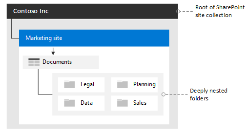
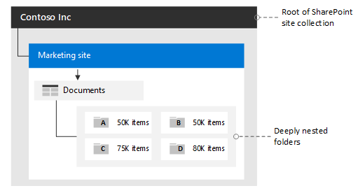

# Migration permission guidance

You need to be aware of three key numbers as you plan your migration to OneDrive or SharePoint especially when you have a hierarchy of deeply nested folders. They are: (1) the number of SharePoint unique permission scopes, (2) the number of role assignments, and (3) the total number of items in a list or library.

## Permissions: Inherited and unique

Inherited permissions are set as the default at the root site collection level and are applied to the other locations and objects within that site collection. Unique permissions are all other permissions that differ (or “break”) from what is set at the root. In SharePoint, you can set unique permissions all the way down to the item level.

Each time you break inheritance by granting access to a new user account or group at any level in a site, even on a single item, you are creating a new unique security “scope” ID. That scope is counted as a unique permission towards the total limit. A library (or list) cannot have greater than 50,000 unique security scopes.

When the number of unique security scopes exceeds the value of the list view threshold, added SQL server round trips take place that can affect performance.
When migrating, we recommend that you have less than 5,000 unique scopes per library.

## Role assignments

A role assignment is a mapping between a user, a SharePoint object (Web, list, file) and a role (Design, Full Control, Contribute, etc.). The role assignment ties together the role definition (permission level) with the specific user or group, and the scope that that permission level will be applied to (such as list, folder, item).

There is a role assignment limit of 5,000 per security scope.

## Item limits

When a library (or list) contains more than 100,000 items (files and folders or list items), you cannot break permissions inheritance on the list itself.  There is a limit of 100,000 items that can be updated or removed as a part of creating a new SharePoint security scope.

If you are migrating a structure that has more than 100,000 children (such as files, folders, lists, or other object types), you need to restructure the migration by importing security in multiple phases to avoid exceeding this limit. Any VROOM invite, REST share link, or any other permission-modifying function call will trigger an HTTP 429 throttle if the threshold is reached. Permissions will not be updated. Unlike other throttles, waiting and trying again will not resolve the situation as you have reached a hard limit of 100,000.
To learn more about the service limits in SharePoint for Microsoft 365, see [SharePoint Limits](/office365/servicedescriptions/sharepoint-online-service-description/sharepoint-online-limits#items-in-lists-and-libraries).

## Folders containing fewer than 100,000 items

If your library (or list) has fewer than 100,000 items, and you have less than 50,000 unique scopes, you can migrate using the migration API and apply unique scopes to create folders with less 100K items to break inheritance as needed.

## Folders containing more than 100,000 items

If you have a folder with more than 100,000 items, we recommend one of the following approaches. Determine how many items are in your source or root folder, including lists or other object types. Scan and determine which folder structures have greater than 100,000 items.

### Method 1: Restructure the source layout

The first option is to restructure your *source* layout.

For example, divide a single folder of 250,000 items into four folders at the root so each folder has less than 100,000 items. There is still “room to grow”, presuming users will continue to add content and make changes here.

Make sure that there are no more than 50,000 unique scopes in the structure: ideally less than 5,000.

In this example, at the source, break up the structure into four folders, A, B, C, and D, each having less than 100,000 items. Then perform the migration. See the illustration below.

>[!NOTE]
>There are other limits that must be considered during migration. See [SharePoint Limits](/office365/servicedescriptions/sharepoint-online-service-description/sharepoint-online-limits#items-in-lists-and-libraries) for details.

### Method 2: Create your destination layout to avoid exceeding limits

The alternate approach is to keep your source layout, applying unique scopes at the destination before migration.

**Example:**  Your source folder has 250,000 items within it. At your target location, create folders A, B, C, and D and apply the unique scopes and scope ID. This will break inheritance. Then proceed with your content migration.
If you do not want your end users to share items until migration is completed, use the Migration API to migrate the content & scopes, but set the scope to NULL to prevent any use.
After all the content and incremental migrations are completed, apply the proper scope.

After the incremental migration has completed, and only if you previously set the scope to NULL, you can reapply the unique scope for folders A, B, C, D separately. When you reapply the scope, evaluate your folder size starting at the lowest level of hierarchy.

## Other Sharing/Permission related considerations

The REST share link or any other permission-modifying function will not take effect if you attempt to update the permission on a file that is checked out by a user.
Finally, if a SharePoint site or OneDrive location is being actively used during migration, the existing permissions applied on that site, user or document will be enforced.

**Example:** If you attempt to modify the permission on a site that only allows access to existing users already defined on the site, and the user you are trying to add to a file or folder does not already have permissions on the site itself, the permission call (e.g. VROOM Invite) will not be able to make the modification.
