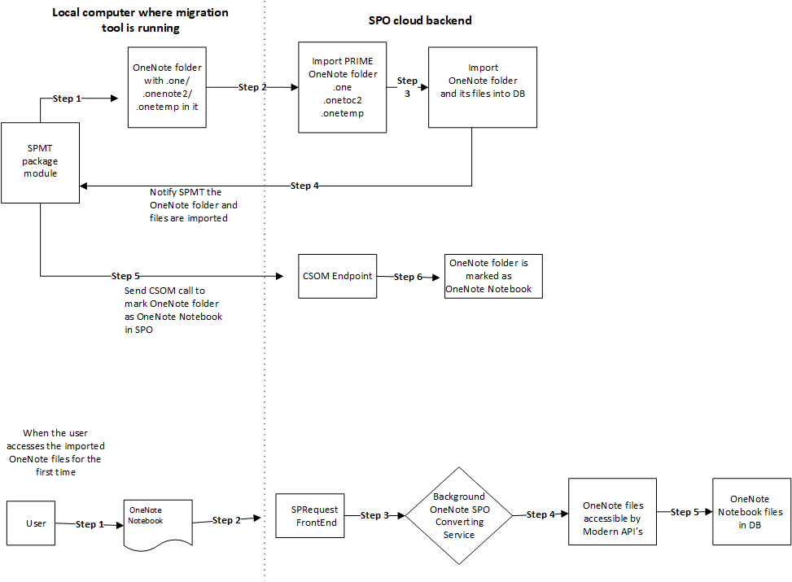

# Migrating OneNote folders

When bringing **OneNote** notebooks into SharePoint Online (SPO) from outside the service, you are required to convert the file. OneNote files need to be located within a correctly tagged NoteBook folder before the OneNote content is accessible via the modern APIs.

There is now a OneNote converting service in SPO that lets you mark the **OneNote** notebooks that are being migrated to be converted.

## Example

The following example shows SPMT using the SPO OneNote converting service, which is running in SPO background.



## Algorithm for checking whether to mark the folder as OneNote folder

For a normal folder, we use the following algorithm to determine whether it should be marked as **OneNote** folder or not.

If any of the subfolders or descendant subfolders are NOT considered a OneNote folder, then this folder is NOT considered as a OneNote folder.

If any file under this folder has an extension other than the following, it is NOT considered as a OneNote folder.

- .one
- .onetoc2
- .onetemp

If the folder does not contain one .onetoc2 file, it is NOT considered to be a **OneNote** folder.

## How to mark the OneNote folder

The CSOM will mark the `HTML_x0020_File_x0020_Type` field of the folder on SharePoint Online as `OneNote.Notebook`.

The marking must be done ONLY on the top-level OneNote folder candidate in the file hierarchy.

Sample code:

```csharp
List list = context.web.Lists.GetById({listid});
ListItem item = list.GetItemByUniqueId({itemid});
Item[“HTML_x0020_File_x0020_Type”] = “OneNote.Notebook”;
Item.SystemUpdate();
Context.ExecuteQuery();
```
