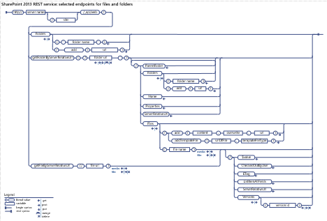

# Files and folders REST API reference
Learn about the REST API for  **File**,  **FileVersion**,  **Folder**, and related resources.
 

 **Last modified:** September 17, 2015
 

 * **Applies to:** apps for SharePoint | SharePoint Foundation 2013 | SharePoint Online | SharePoint Server 2013* 
 

## About the request examples in this article
<a name="bk_Overview"> </a>

The request examples in this article assume that you're using the cross-domain library (SP.RequestExecutor.js) to make cross-domain requests, so they use  **SP.AppContextSite** in the endpoint URI. See [Access SharePoint 2013 data from add-ins using the cross-domain library](http://msdn.microsoft.com/library/access-sharepoint-2013-data-from-add-ins-using-the-cross-domain-library%28Office.15%29.aspx) for more information.
 

 
Before you use a request example, do the following:
 

 

- Change  _<app web url>_,  _<host web url>_, and other placeholder data such as any IDs, names, or paths of SharePoint entities.
    
 
- If you're not using the cross-domain library, include an  **X-RequestDigest** header to send the form digest value in all POST requests and a **content-length** header for POST requests that send data in the request body.
    
 
- If you're not making cross-domain requests, remove  `SP.AppContextSite(@target)` and `?@target='<host web url>'` from the endpoint URI.
    
 
- If you're using OAuth, include an  **Authorization** header ( `"Authorization": "Bearer " + <access token>`) to send the OAuth access token.
    
 
- Remove the line breaks from the  **url** and **body** property values in the request examples. Line breaks are added to the examples to make them easier to read.
    
 
- If you want the server to return responses in Atom format, remove the  `"accept": "application/json; odata=verbose"` header.
    
 
See  [Additional resources](lists-and-list-items-rest-api-reference.md#bk_AdditionalResources) for links to more information about using the cross-domain library, OAuth, and the SharePoint REST service. See [How REST requests differ by environment](http://msdn.microsoft.com/library/complete-basic-operations-using-sharepoint-2013-rest-endpoints%28Office.15%29.aspx#bk_HowRequestsDiffer) and [Properties used in REST requests](http://msdn.microsoft.com/library/complete-basic-operations-using-sharepoint-2013-rest-endpoints%28Office.15%29.aspx#bk_requestElements) for information about request formats.
 

 

 **Tip**  The SharePoint Online REST service supports combining multiple requests into a single call to the service by using the OData  `$batch` query option. For details and links to code samples, see [Make batch requests with the REST APIs](http://msdn.microsoft.com/library/make-batch-requests-with-the-rest-apis%28Office.15%29.aspx). This option is not yet supported for on-premise SharePoint.
 


## Explore the SharePoint 2013 files and folders REST syntax
<a name="bk_Overview"> </a>


|||
|:-----|:-----|
| [ ](http://go.microsoft.com/fwlink/?LinkId=331057)| [Visually explore](http://go.microsoft.com/fwlink/?LinkId=331057) the SharePoint 2013 lists and list items REST syntax.Explore other SharePoint REST syntax diagrams: [Lists and list items](http://go.microsoft.com/fwlink/?LinkId=331058) | [Users and groups](http://go.microsoft.com/fwlink/?LinkId=331059)Download the combined  [PDF](http://www.microsoft.com/en-us/download/details.aspx?id=41147) of all the SharePoint REST syntax diagrams.|

## File resource
<a name="bk_File"> </a>

Represents a file in a SharePoint Web site that can be a Web Part Page, an item in a document library, or a file in a folder.
 

 
 [Endpoint URI](files-and-folders-rest-api-reference.md#bk_FileEndpoint) | [Properties](files-and-folders-rest-api-reference.md#bk_FileProperties) | [Methods](files-and-folders-rest-api-reference.md#bk_FileMethods) | [OData representation](files-and-folders-rest-api-reference.md#bk_FileOData)
 

 

### Endpoint URI
<a name="bk_FileEndpoint"> </a>

http:// _<site url>_/_api/web/getfilebyserverrelativeurl('/ _<folder name>_/ _<file name>_')
 

 

#### Supported HTTP methods

GET | PUT (media resource)
 

 
GET | DELETE | POST (File resource)
 

 

#### Request examples
<a name="bk_FileRequestExamples"> </a>

 **GET request example:** Get file contents (media resource)
 

 

```
executor.executeAsync({
  url: "<app web url>/_api/SP.AppContextSite(@target)/web
    /getfilebyserverrelativeurl('/Shared Documents/filename.docx')/$value
    ?@target='<host web url>'",
  method: "GET",
  binaryStringResponseBody: true,
  success: successHandler,
  error: errorHandler
});
```

 **GET request example:** Get file metadata
 

 


```
executor.executeAsync({
  url: "<app web url>/_api/SP.AppContextSite(@target)/web
    /getfilebyserverrelativeurl('/Shared Documents/filename.docx')
    ?@target='<host web url>'",
  method: "GET",
  headers: { "accept": "application/json; odata=verbose" },
  success: successHandler,
  error: errorHandler
});
```

 **PUT request example:** Update file contents (media resource)
 

 


```
executor.executeAsync({
  url: "<app web url>/_api/SP.AppContextSite(@target)/web
    /getfilebyserverrelativeurl('/Shared Documents/filename.txt')/$value
    ?@target='<host web url>'",
  method: "POST",
  body: "Updated contents of the file go here",
  headers: { "X-HTTP-Method":"PUT" },
  success: successHandler,
  error: errorHandler
});
```

Check out the file first to prevent other users from changing it. Then, check it back in after you've made your changes. See the  [CheckOut method](files-and-folders-rest-api-reference.md#bk_FileCheckOut) and the [CheckIn method](files-and-folders-rest-api-reference.md#bk_FileCheckIn).
 

 
 **DELETE request example:** Delete a file
 

 


```
executor.executeAsync({
  url: "<app web url>/_api/SP.AppContextSite(@target)/web
    /getfilebyserverrelativeurl('/Shared Documents/filename.docx')
    ?@target='<host web url>'",
  method: "POST",
  headers: { "X-HTTP-Method":"DELETE" },
  success: successHandler,
  error: errorHandler
});
```

Or you can use the  [Recycle method](files-and-folders-rest-api-reference.md#bk_FileRecycle) to remove the file and get the GUID of the recycled item.
 

 

 **Note**  See the  [Add method](files-and-folders-rest-api-reference.md#bk_FileCollectionAdd) for an example that shows how to create a file and add it to a folder.
 


### File properties
<a name="bk_FileProperties"> </a>

To get a property, send a  **GET** request to the property endpoint, as shown in the following example.
 

 

```
executor.executeAsync({
  url: "<app web url>/_api/SP.AppContextSite(@target)/web
    /getfilebyserverrelativeurl('/Shared Documents/filename.docx')/<property name>
    ?@target='<host web url>'",
  method: "GET",
  headers: { "accept": "application/json; odata=verbose" },
  success: successHandler,
  error: errorHandler
});
```


|**Property**|**Type**|**R/W**|** [Returned with resource](http://msdn.microsoft.com/library/complete-basic-operations-using-sharepoint-2013-rest-endpoints%28Office.15%29.aspx#NavigationProperties)**|**Description**|
|:-----|:-----|:-----|:-----|:-----|
|Author| [SP.User](users-groups-and-roles-rest-api-reference.md#bk_User)|R|No|Gets a value that specifies the user who added the file.|
|CheckedOutByUser| [SP.User](users-groups-and-roles-rest-api-reference.md#bk_User)|R|No|Gets a value that returns the user who has checked out the file.|
|CheckInComment|**String**|R|Yes|Gets a value that returns the comment used when a document is checked in to a document library.|
|CheckOutType|**Int32**|R|Yes|Gets a value that indicates how the file is checked out of a document library. Represents an  **SP.CheckOutType** value: Online = 0; Offline = 1; None = 2.The checkout state of a file is independent of its locked state.|
|ContentTag|**String**|R|Yes|Returns internal version of content, used to validate document equality for read purposes.|
|CustomizedPageStatus|**Int32**|R|Yes|Gets a value that specifies the customization status of the file. Represents an  **SP.CustomizedPageStatus** value: None = 0; Uncustomized = 1; Customized = 2.|
|ETag|**String**|R|Yes|Gets a value that specifies the ETag value.|
|Exists|**Boolean**|R|Yes|Gets a value that specifies whether the file exists.|
|Length|**Int64**|R|Yes|Gets the size of the file in bytes, excluding the size of any Web Parts that are used in the file.|
|Level|**Byte**|R|Yes|Gets a value that specifies the publishing level of the file. Represents an  **SP.FileLevel** value: Published = 1; Draft = 2; Checkout = 255.|
|ListItemAllFields| [SP.ListItem](lists-and-list-items-rest-api-reference.md#bk_ListItem)|R|No|Gets a value that specifies the list item field values for the list item corresponding to the file.|
|LockedByUser| [SP.User](users-groups-and-roles-rest-api-reference.md#bk_User)|R|No|Gets a value that returns the user that owns the current lock on the file.|
|MajorVersion|**Int32**|R|Yes|Gets a value that specifies the major version of the file.|
|MinorVersion|**Int32**|R|Yes|Gets a value that specifies the minor version of the file.|
|ModifiedBy| [SP.User](users-groups-and-roles-rest-api-reference.md#bk_User)|R|No|Gets a value that returns the user who last modified the file.|
|Name|**String**|R|Yes|Gets the name of the file including the extension.|
|ServerRelativeUrl|**String**|R|Yes|Gets the relative URL of the file based on the URL for the server.|
|TimeCreated|**DateTime**|R|Yes|Gets a value that specifies when the file was created.|
|TimeLastModified|**DateTime**|R|Yes|Gets a value that specifies when the file was last modified.|
|Title|**String**|R|Yes|Gets a value that specifies the display name of the file.|
|UiVersion|**Int32**|R|Yes|Gets a value that specifies the implementation-specific version identifier of the file.|
|UiVersionLabel|**String**|R|Yes|Gets a value that specifies the implementation-specific version identifier of the file.|
|Versions| [SP.FileVersionCollection](files-and-folders-rest-api-reference.md#bk_FileVersionCollection)|R|No|Gets a value that returns a collection of file version objects that represent the versions of the file.|

### File methods
<a name="bk_FileMethods"> </a>

 [Approve](files-and-folders-rest-api-reference.md#bk_FileApprove)
 
 [CancelUpload](files-and-folders-rest-api-reference.md#bk_FileCancelUpload)
 
 [CheckIn](files-and-folders-rest-api-reference.md#bk_FileCheckIn)
 
 [CheckOut](files-and-folders-rest-api-reference.md#bk_FileCheckOut)
 
 [ContinueUpload](files-and-folders-rest-api-reference.md#bk_FileContinueUpload)
 
 [CopyTo](files-and-folders-rest-api-reference.md#bk_FileCopyTo)
 
 [DeleteObject](files-and-folders-rest-api-reference.md#bk_FileDeleteObject)
 
 [Deny](files-and-folders-rest-api-reference.md#bk_FileDeny)
 
 [FinishUpload](files-and-folders-rest-api-reference.md#bk_FileFinishUpload)
 
 [GetLimitedWebPartManager](files-and-folders-rest-api-reference.md#bk_FileGetLimitedWebPartManager )
 
 [MoveTo](files-and-folders-rest-api-reference.md#bk_FileMoveTo)
 
 [OpenBinaryStream](files-and-folders-rest-api-reference.md#bk_FileOpenBinaryStream )
 
 [Publish](files-and-folders-rest-api-reference.md#bk_FilePublish)
 
 [Recycle](files-and-folders-rest-api-reference.md#bk_FileRecycle)
 
 [SaveBinaryStream](files-and-folders-rest-api-reference.md#bk_FileSaveBinaryStream )
 
 [StartUpload](files-and-folders-rest-api-reference.md#bk_FileStartUpload)
 
 [UndoCheckOut](files-and-folders-rest-api-reference.md#bk_FileUndoCheckOut )
 
 [Unpublish](files-and-folders-rest-api-reference.md#bk_FileUnpublish)
 

 

#### Approve
<a name="bk_FileApprove"> </a>

Approves the file submitted for content approval with the specified comment.
 

 
Only documents in lists that are enabled for content approval can be approved.
 

 

|||
|:-----|:-----|
|**Endpoint**|/approve( _comment_)|
|**Parameters**| commentType: StringThe comment for the approval. |
|**HTTP method**|POST|
|**Response**|None|

 
 **Request example**
 

 


```
executor.executeAsync({
  url: "<app web url>/_api/SP.AppContextSite(@target)/web
    /getfilebyserverrelativeurl('/Shared Documents/filename.docx')
    /approve(comment='Check-in comment for the approval.')
    ?@target='<host web url>'",
  method: "POST",
  success: successHandler,
  error: errorHandler
});
```


#### CancelUpload method
<a name="bk_FileCancelUpload"> </a>

Stops the chunk upload session without saving the uploaded data. If the file doesn't already exist in the library, the partially uploaded file will be deleted. Use this in response to user action (as in a request to cancel an upload) or an error or exception.
 

 
Use the  `uploadId` value that was passed to the [StartUpload](files-and-folders-rest-api-reference.md#bk_FileStartUpload) method that started the upload session.
 

 
This method is currently available only on Office 365.
 

 

|||
|:-----|:-----|
|**Endpoint**|/cancelupload( _uploadId_)|
|**Parameters**| uploadIDType: GUIDThe unique identifier of the upload session. |
|**HTTP method**|POST|
|**Response**|None|

 
 **Request example**
 

 


```
executor.executeAsync({
  url: "<app web url>/_api/SP.AppContextSite(@target)/web
    /getfilebyserverrelativeurl('/Shared Documents/filename.docx')
    /cancelupload(uploadId=guid'GUID')
    ?@target='<host web url>'",
  method: "POST",
  success: successHandler,
  error: errorHandler
});
```


#### CheckIn method
<a name="bk_FileCheckIn"> </a>

Checks the file in to a document library based on the check-in type.
 

 

|||
|:-----|:-----|
|**Endpoint**|/checkin( _comment_,  _checkInType_)|
|**Parameters**| commentType: StringA comment for the check-in. Its length must be <= 1023.checkInTypeType: Int32The SP.CheckinType for the file: MinorCheckIn = 0; MajorCheckIn = 1; OverwriteCheckIn = 2. |
|**HTTP method**|POST|
|**Response**|None|

 
 **Request example**
 

 


```
executor.executeAsync({
  url: "<app web url>/_api/SP.AppContextSite(@target)/web
    /getfilebyserverrelativeurl('/Shared Documents/filename.docx')
    /checkin(comment='Check-in comment.',checkintype=0)
    ?@target='<host web url>'",
  method: "POST",
  success: successHandler,
  error: errorHandler
});
```


#### CheckOut method
<a name="bk_FileCheckOut"> </a>

Checks out the file from a document library based on the check-out type.
 

 

|||
|:-----|:-----|
|**Endpoint**|/checkout|
|**Parameters**|None|
|**HTTP method**|POST|
|**Response**|None|

 
 **Request example**
 

 


```
executor.executeAsync({
  url: "<app web url>/_api/SP.AppContextSite(@target)/web
    /getfilebyserverrelativeurl('/Shared Documents/filename.docx')
    /checkout
    ?@target='<host web url>'",
  method: "POST",
  success: successHandler,
  error: errorHandler
});
```


#### ContinueUpload method
<a name="bk_FileContinueUpload"> </a>

Continues the chunk upload session with an additional fragment. The current file content is not changed.
 

 
Use the  `uploadId` value that was passed to the [StartUpload](files-and-folders-rest-api-reference.md#bk_FileStartUpload) method that started the upload session.
 

 
This method is currently available only on Office 365.
 

 

|||
|:-----|:-----|
|**Endpoint**|/continueupload( _uploadId_,  _fileOffset_)|
|**Parameters**| uploadIDType: GUIDThe unique identifier of the upload session.fileOffsetType: Int64The size of the offset into the file where the fragment starts. Send the file contents (stream) in the post body.|
|**HTTP method**|POST|
|**Response**|Type:  **Int64** The size of the total uploaded data in bytes.|

 
 **Request example**
 

 


```
executor.executeAsync({
  url: "<app web url>/_api/SP.AppContextSite(@target)/web
    /getfilebyserverrelativeurl('/Shared Documents/filename.docx')
    /continueupload(uploadId=guid'GUID',fileOffset=8388608)
    ?@target='<host web url>'",
  method: "POST",
  body: stream containing intermediate chunk of file
  success: successHandler,
  error: errorHandler
});
```


#### CopyTo method
<a name="bk_FileCopyTo"> </a>

Copies the file to the destination URL. 
 

 

|||
|:-----|:-----|
|**Endpoint**|/copyto( _strNewUrl_,  _bOverWrite_)|
|**Parameters**| strNewUrlType: StringThe absolute URL or server relative URL of the destination file path to copy to.bOverWriteType: Booleantrue to overwrite a file with the same name in the same location; otherwise false. |
|**HTTP method**|POST|
|**Response**|None|

 
 **Request example**
 

 


```
executor.executeAsync({
  url: "<app web url>/_api/SP.AppContextSite(@target)/web
    /getfilebyserverrelativeurl('/Shared Documents/filename.docx')
    /copyto(strnewurl='/foldername/filename.docx',boverwrite=false)
    ?@target='<host web url>'",
  method: "POST",
  success: successHandler,
  error: errorHandler
});
```


#### DeleteObject method
<a name="bk_FileDeleteObject"> </a>

The recommended way to delete a file is to send a  **DELETE** request to the **File** resource endpoint, as shown in [File request examples](files-and-folders-rest-api-reference.md#bk_FileRequestExamples).
 

 

#### Deny method
<a name="bk_FileDeny"> </a>

Denies approval for a file that was submitted for content approval.
 

 
Only documents in lists that are enabled for content approval can be denied.
 

 

|||
|:-----|:-----|
|**Endpoint**|/deny( _comment_)|
|**Parameters**| commentType: StringThe comment for the denial. |
|**HTTP method**|POST|
|**Response**|None|

 
 **Request example**
 

 


```
executor.executeAsync({
  url: "<app web url>/_api/SP.AppContextSite(@target)/web
    /getfilebyserverrelativeurl('/Shared Documents/filename.docx')
    /deny(comment='Check-in comment for the denial.')
    ?@target='<host web url>'",
  method: "POST",
  success: successHandler,
  error: errorHandler
});
```


#### FinishUpload method
<a name="bk_FileFinishUpload"> </a>

Uploads the last file fragment and commits the file. The current file content is changed when this method completes.
 

 
Use the  `uploadId` value that was passed to the [StartUpload](files-and-folders-rest-api-reference.md#bk_FileStartUpload) method that started the upload session.
 

 
This method is currently available only on Office 365.
 

 

|||
|:-----|:-----|
|**Endpoint**|/finishupload( _uploadId_,  _fileOffset_)|
|**Parameters**| uploadIDType: GUIDThe unique identifier of the upload session.fileOffsetType: Int64The size of the offset into the file where the fragment starts. Send the file contents (stream) in the post body.|
|**HTTP method**|POST|
|**Response**|Type:  [SP.File](files-and-folders-rest-api-reference.md#bk_File) The newly uploaded file.|

 
 **Request example**
 

 


```
executor.executeAsync({
  url: "<app web url>/_api/SP.AppContextSite(@target)/web
    /getfilebyserverrelativeurl('/Shared Documents/filename.docx')
    /finishupload(uploadId=guid'GUID',fileOffset=125829120)
    ?@target='<host web url>'",
  method: "POST",
  body: stream containing final chunk of file
  success: successHandler,
  error: errorHandler
});
```


#### GetLimitedWebPartManager method
<a name="bk_FileGetLimitedWebPartManager"> </a>

Specifies the control set used to access, modify, or add Web Parts associated with this Web Part Page and view.
 

 
An exception is thrown if the file is not an ASPX page.
 

 

|||
|:-----|:-----|
|**Endpoint**|/getlimitedwebpartmanager( _scope_)|
|**Parameters**| scopeType: Int32The SP.WebParts.PersonalizationScope view on the Web Parts page. User = 0; Shared = 1. |
|**HTTP method**|GET|
|**Response**|Type:  **SP.WebParts.LimitedWebPartManager** The associated control set used to access, modify, or add Web Parts.|

 
 **Request example**
 

 


```
executor.executeAsync({
  url: "<app web url>/_api/SP.AppContextSite(@target)/web
    /getfilebyserverrelativeurl('/Shared Documents/fileName.aspx')
    /getlimitedwebpartmanager(scope=0)
    ?@target='<host web url>'",
  method: "GET",
  headers: { "accept": "application/json; odata=verbose" },
  success: successHandler,
  error: errorHandler
});
```


#### MoveTo method
<a name="bk_FileMoveTo"> </a>

Moves the file to the specified destination URL.
 

 

|||
|:-----|:-----|
|**Endpoint**|/moveto( _newUrl_,  _flags_)|
|**Parameters**| newUrlType: StringThe absolute URL or server relative URL of the destination file path to move to.flagsType: Int32The bitwise SP.MoveOperations value for how to move the file. Overwrite = 1; AllowBrokenThickets (move even if supporting files are separated from the file) = 8. |
|**HTTP method**|POST|
|**Response**|None|

 
 **Request example**
 

 


```
executor.executeAsync({
  url: "<app web url>/_api/SP.AppContextSite(@target)/web
    /getfilebyserverrelativeurl('/Shared Documents/filename.docx')
    /moveto(newurl='/Other Folder/filename.docx',flags=1)
    ?@target='<host web url>'",
  method: "POST",
  success: successHandler,
  error: errorHandler
});
```


#### OpenBinaryStream method
<a name="bk_FileOpenBinaryStream"> </a>

Opens the file as a stream.
 

 

|||
|:-----|:-----|
|**Endpoint**|/openbinarystream|
|**Parameters**|None|
|**HTTP method**|GET|
|**Response**|Type:  **Stream** The specified file stream.|

 
 **Request example**
 

 


```
executor.executeAsync({
  url: "<app web url>/_api/SP.AppContextSite(@target)/web
    /getfilebyserverrelativeurl('/Shared Documents/filename.docx')
    /openbinarystream
    ?@target='<host web url>'",
  method: "GET",
  binaryStringResponseBody: true,
  success: successHandler,
  error: errorHandler
});
```


 **Note**  Or you can use  **$value** from the file resource to open a file. Example: `…/getfilebyserverrelativeurl('/Shared Documents/filename.docx')/$value`.
 


#### Publish method
<a name="bk_FilePublish"> </a>

Submits the file for content approval with the specified comment.
 

 

|||
|:-----|:-----|
|**Endpoint**|/publish( _comment_)|
|**Parameters**| commentType: StringThe comment for the published file. Its length must be <= 1023. |
|**HTTP method**|POST|
|**Response**|None|

 
 **Request example**
 

 


```
executor.executeAsync({
  url: "<app web url>/_api/SP.AppContextSite(@target)/web
    /getfilebyserverrelativeurl('/Shared Documents/filename.docx')
    /publish(comment='Check-in comment for the publish operation.')
    ?@target='<host web url>'",
  method: "POST",
  success: successHandler,
  error: errorHandler
});
```


#### Recycle method
<a name="bk_FileRecycle"> </a>

Moves the file to the Recycle Bin and returns the identifier of the new Recycle Bin item.
 

 

|||
|:-----|:-----|
|**Endpoint**|/recycle|
|**Parameters**|None|
|**HTTP method**|POST|
|**Response**|Type:  **GUID** The GUID of the recycled file.|

 
 **Request example**
 

 


```
executor.executeAsync({
  url: "<app web url>/_api/SP.AppContextSite(@target)/web
    /getfilebyserverrelativeurl('/Shared Documents/filename.docx')
    /recycle
    ?@target='<host web url>'",
  method: "POST",
  headers: { "accept": "application/json; odata=verbose" },
  success: successHandler,
  error: errorHandler
});
```


#### SaveBinaryStream method
<a name="bk_FileSaveBinaryStream"> </a>


 

 

|||
|:-----|:-----|
|**Endpoint**|/savebinary|
|**Parameters**|Send the file contents (stream) in the post body.|
|**HTTP method**|POST|
|**Response**|None|

 
 **Request example**
 

 


```
executor.executeAsync({
  url: "<app web url>/_api/SP.AppContextSite(@target)/web
    /getfilebyserverrelativeurl('/Shared Documents/filename.docx')
    /savebinarystream
    ?@target='<host web url>'",
  method: "POST",
  body: "This is the new content.",
  success: successHandler,
  error: errorHandler
});
```


#### StartUpload method
<a name="bk_FileStartUpload"> </a>

Starts a new chunk upload session and uploads the first fragment. The current file content is not changed when this method completes. The method is idempotent (and therefore does not change the result) as long as you use the same values for  **uploadId** and **stream**. The upload session ends either when you use the  [CancelUpload](files-and-folders-rest-api-reference.md#bk_FileCancelUpload) method or when you successfully complete the upload session by passing the rest of the file contents through the [ContinueUpload](files-and-folders-rest-api-reference.md#bk_FileContinueUpload) and [FinishUpload](files-and-folders-rest-api-reference.md#bk_FileFinishUpload) methods.
 

 
For example, you can pass a 35 MB file by dividing it into three 10 MB streams and one 5 MB stream and uploading them this way (using the resulting offset values of 10, 20 and 30 MB):
 

 
startUpload(GUID, stream1)
 
continueUpload(GUID, 10 MB, stream2) 
 
continueUpload(GUID, 20 MB, stream3) 
 
finishUpload(GUID, 30 MB, stream4)
 

 
The StartUpload and  [ContinueUpload](files-and-folders-rest-api-reference.md#bk_FileContinueUpload) methods return the size of the running total of uploaded data in bytes, so you can pass those return values to subsequent uses of [ContinueUpload](files-and-folders-rest-api-reference.md#bk_FileContinueUpload) and [FinishUpload](files-and-folders-rest-api-reference.md#bk_FileFinishUpload).
 

 
This method is currently available only on Office 365.
 

 

|||
|:-----|:-----|
|**Endpoint**|/startupload( _uploadId_)|
|**Parameters**| uploadIDType: GUIDThe unique identifier of the upload session. Send the file contents (stream) in the post body.|
|**HTTP method**|POST|
|**Response**|Type:  **Int64** The size of the uploaded data in bytes.|

 
 **Request example**
 

 


```
executor.executeAsync({
  url: "<app web url>/_api/SP.AppContextSite(@target)/web
    /getfilebyserverrelativeurl('/Shared Documents/filename.docx')
    /startupload(uploadId=guid'GUID')
    ?@target='<host web url>'",
  method: "POST",
  body: stream containing first chunk of file
  success: successHandler,
  error: errorHandler
});
```


#### UndoCheckOut method
<a name="bk_FileUndoCheckOut"> </a>

Reverts an existing checkout for the file.
 

 

|||
|:-----|:-----|
|**Endpoint**|/undocheckout|
|**Parameters**|None|
|**HTTP method**|POST|
|**Response**|None|

 
 **Request example**
 

 


```
executor.executeAsync({
  url: "<app web url>/_api/SP.AppContextSite(@target)/web
    /getfilebyserverrelativeurl('/Shared Documents/filename.docx')
    /undocheckout
    ?@target='<host web url>'",
  method: "POST",
  success: successHandler,
  error: errorHandler
});
```


#### Unpublish method
<a name="bk_FileUnpublish"> </a>

Removes the file from content approval or unpublish a major version.
 

 

|||
|:-----|:-----|
|**Endpoint**|/unpublish|
|**Parameters**| commentType: StringThe comment for the unpublish operation. Its length must be <= 1023. |
|**HTTP method**|POST|
|**Response**|None|

 
 **Request example**
 

 


```
executor.executeAsync({
  url: "<app web url>/_api/SP.AppContextSite(@target)/web
    /getfilebyserverrelativeurl('/Shared Documents/filename.docx')
    /unpublish(comment='Check-in comment for the unpublish operation.')
    ?@target='<host web url>'",
  method: "POST",
  success: successHandler,
  error: errorHandler
});
```


### OData representation
<a name="bk_FileOData"> </a>

The following example represents a  [File](files-and-folders-rest-api-reference.md#bk_File) resource in JSON format.
 

 

```
{"d":{
  "__metadata":{,
    "id":"http://<site url>/_api/Web/GetFileByServerRelativeUrl('/Shared Documents/folderName/fileName.docx')",
    "uri":"http://<site url>/_api/Web/GetFileByServerRelativeUrl('/Shared%20Documents/folderName/fileName.docx')",
    "type":"SP.File"
  },
  "Author":{"__deferred":{"uri":"http://<site url>/_api/Web/GetFileByServerRelativeUrl('/Shared%20Documents/folderName/fileName.docx')/Author"}},
  "CheckedOutByUser":{"__deferred":{"uri":"http://<site url>/_api/Web/GetFileByServerRelativeUrl('/Shared%20Documents/folderName/fileName.docx')/CheckedOutByUser"}},
  "ListItemAllFields":{"__deferred":{"uri":"http://<site url>/_api/Web/GetFileByServerRelativeUrl('/Shared%20Documents/folderName/fileName.docx')/ListItemAllFields"}},
  "LockedByUser":{"__deferred":{"uri":"http://<site url>/_api/Web/GetFileByServerRelativeUrl('/Shared%20Documents/folderName/fileName.docx')/LockedByUser"}},
  "ModifiedBy":{"__deferred":{"uri":"http://<site url>/_api/Web/GetFileByServerRelativeUrl('/Shared%20Documents/folderName/fileName.docx')/ModifiedBy"}},
  "Versions":{"__deferred":{"uri":"http://<site url>/_api/Web/GetFileByServerRelativeUrl('/Shared%20Documents/folderName/fileName.docx')/Versions"}},
  "CheckInComment":"Revisions to the file.",
  "CheckOutType":2,
  "ContentTag":"{2FBB0C3C-4059-41A2-A5CF-3E076EA0A94C},2,3",
  "CustomizedPageStatus":0,
  "ETag":"\"{2FBB0C3C-4059-41A2-A5CF-3E076EA0A94C},2\"",
  "Exists":true,
  "Length":"20609",
  "Level":1,
  "MajorVersion":1,
  "MinorVersion":0,
  "Name":"fileName.docx",
  "ServerRelativeUrl":"/Shared Documents/folderName/fileName.docx",
  "TimeCreated":"2013-05-16T21:01:23Z",
  "TimeLastModified":"2013-05-18T04:57:32Z",
  "Title":"",
  "UIVersion":512,
  "UIVersionLabel":"1.0"
}}
```


## FileCollection resource
<a name="bk_FileCollection"> </a>

Represents a collection of  [File](files-and-folders-rest-api-reference.md#bk_File) resources.
 

 
 [Endpoint URI](files-and-folders-rest-api-reference.md#bk_FileCollectionEndpoint) | [Methods](files-and-folders-rest-api-reference.md#bk_FileCollectionMethods) | [OData representation](files-and-folders-rest-api-reference.md#bk_FileCollectionOData)
 

 

### Endpoint URI
<a name="bk_FileCollectionEndpoint"> </a>

http:// _<site url>_/_api/web/getfolderbyserverrelativeurl('/ _<folder name>_')/files
 

 

#### Supported HTTP methods

GET | POST
 

 

#### Request examples
<a name="bk_FileCollectionRequestExamples"> </a>

 **GET request example:** Get the metadata of all the files in a folder
 

 

```
executor.executeAsync({
  url: "<app web url>/_api/SP.AppContextSite(@target)/web
    /getfolderbyserverrelativeurl('/Shared Documents/Folder A')/files
    ?@target='<host web url>'",
  method: "GET",
  headers: { "accept": "application/json; odata=verbose" },
  success: successHandler,
  error: errorHandler
});
```

 **GET request example:** Get file contents (media resource) by file name
 

 


```
executor.executeAsync({
  url: "<app web url>/_api/SP.AppContextSite(@target)/web
    /getfolderbyserverrelativeurl('/Shared Documents/Folder A')/files('filename.docx')/$value
    ?@target='<host web url>'",
  method: "GET",
  binaryStringResponseBody: true,
  success: successHandler,
  error: errorHandler
});
```

 **GET request example:** Get file metadata
 

 


```
executor.executeAsync({
  url: "<app web url>/_api/SP.AppContextSite(@target)/web
    /getfolderbyserverrelativeurl('/Shared Documents/Folder A')/files('filename.docx')
    ?@target='<host web url>'",
  method: "GET",
  headers: { "accept": "application/json; odata=verbose" },
  success: successHandler,
  error: errorHandler
};
```

See  [File request examples](files-and-folders-rest-api-reference.md#bk_FileRequestExamples) for examples of how to retrieve a file by using the **GetFileByServerRelativeUrl** endpoint and how to update and delete a file. To create a file, see the [Add method](files-and-folders-rest-api-reference.md#bk_FileCollectionAdd).
 

 

### FileCollection methods
<a name="bk_FileCollectionMethods"> </a>

 [Add](files-and-folders-rest-api-reference.md#bk_FileCollectionAdd)
 
 [AddTemplateFile](files-and-folders-rest-api-reference.md#bk_FileCollectionAddTemplateFile)
 
 [GetByUrl](files-and-folders-rest-api-reference.md#bk_FileCollectionGetByUrl)
 

 

#### Add method
<a name="bk_FileCollectionAdd"> </a>


 

 

|||
|:-----|:-----|
|**Endpoint**|/add( _content_,  _overwrite_,  _url_)|
|**Parameters**| contentType: StreamThe contents of the file. Pass the content parameter in the request body. The maximum size of a binary file that you can add by using the REST API is 2 GB.overwriteType: Booleantrue to overwrite the file if it already exists; otherwise false.urlType: StringThe folder-relative URL of the file. |
|**HTTP method**|POST|
|**Response**|Type:  [SP.File](files-and-folders-rest-api-reference.md#bk_File) The new file.|

 
 **Request example**
 

 


```
executor.executeAsync({
  url: "<app web url>/_api/SP.AppContextSite(@target)/web
    /getfolderbyserverrelativeurl('/Shared Documents/Folder A')/files
    /add(overwrite=true,url='filename.txt')
    ?@target='<host web url>'",
  method: "POST",
  body: "Contents of the file go here",
  headers: { "accept": "application/json; odata=verbose" },
  success: successHandler,
  error: errorHandler
});
```

The following example shows how to upload a binary file by using the cross-domain library, which requires converting the file stream to a string. For a jQuery example, see  [Upload a file by using the REST API and jQuery](http://msdn.microsoft.com/library/upload-a-file-by-using-the-rest-api-and-jquery%28Office.15%29.aspx).
 

 


```
function addFile(arrayBuffer) { 
    var executor = new SP.RequestExecutor(appWebUrl);

    // Construct the endpoint.
    // The GetList method is available for SharePoint Online only. 
    var fileCollectionEndpoint = String.format(
         "{0}/_api/sp.appcontextsite(@target)/web/getlist('{1}')/" +
         "rootfolder/files/add(overwrite=true, url='{2}')?@target='{3}'",
         appWebUrl, listName, fileName, hostWebUrl);

    var fileData = '';
    var byteArray = new Uint8Array(arrayBuffer);
    for (var i = 0; i < byteArray.byteLength; i++) {
        fileData += String.fromCharCode(byteArray[i]);
    }

    // Send the request.
    executor.executeAsync({
        url: fileCollectionEndpoint,
        method: "POST",
        body: fileData,
        binaryStringRequestBody: true,
        headers: {"accept":"application/json;odata=verbose"},
        success: function (data) {
            alert('File upload succeeded.');
        },
        error: function (err) {
            alert('Error: ' + err.responseText);
        }
    });
}
```


#### AddTemplateFile method
<a name="bk_FileCollectionAddTemplateFile"> </a>

Adds a ghosted file to an existing list or document library.
 

 

|||
|:-----|:-----|
|**Endpoint**|/addTemplateFile( _urlOfFile_, _templateFileType_)|
|**Parameters**| urlOfFileType: StringThe server-relative URL where you want to save the file.templateFileTypeType: Int32The SP.TemplateFileType to use to create the file: StandardPage = 0; WikiPage = 1; FormPage = 2. |
|**HTTP method**|POST|
|**Response**|Type:  [SP.File](files-and-folders-rest-api-reference.md#bk_File) The template file that was added.|

 
 **Request example**
 

 


```
executor.executeAsync({
  url: "<app web url>/_api/SP.AppContextSite(@target)/web
    /getfolderbyserverrelativeurl('/Shared Documents')/files
    /addtemplatefile(urloffile='/Shared Documents/newwikipage.aspx',templatefiletype=1)
    ?@target='<host web url>'",
  method: "POST",
  headers: { "accept": "application/json; odata=verbose" },
  success: successHandler,
  error: errorHandler
});
```


#### GetByUrl method
<a name="bk_FileCollectionGetByUrl"> </a>

Get the file at the specified URL.
 

 
The  **GetFileByServerRelativeUrl** endpoint is recommended way to get a file. See [SP.File request examples](files-and-folders-rest-api-reference.md#bk_FileRequestExamples).
 

 

|||
|:-----|:-----|
|**Endpoint**|/getbyurl(' _<name or server-relative url of file>_')|
|**Parameters**|None|
|**HTTP method**|GET|
|**Response**|Type:  [SP.File](files-and-folders-rest-api-reference.md#bk_File) The file at the specified URL.|

 
 **Request examples**
 

 
 **Get file contents** (media resource)
 

 


```
executor.executeAsync({
  url: "<app web url>/_api/SP.AppContextSite(@target)/web
    /getfolderbyserverrelativeurl('/Shared Documents/foldername')/files
    /getbyurl('filename.docx')/$value
    ?@target='<host web url>'",
  method: "GET",
  binaryStringResponseBody: true,
  success: successHandler,
  error: errorHandler
});
```

 **Get a file's metadata** (File resource)
 

 


```
executor.executeAsync({
  url: "<app web url>/_api/SP.AppContextSite(@target)/web
    /getfolderbyserverrelativeurl('/Shared Documents/foldername')/files
    /getbyurl('filename.docx')
    ?@target='<host web url>'",
  method: "GET",
  headers: { "accept": "application/json; odata=verbose" },
  success: successHandler,
  error: errorHandler
});
```

See  [File request examples](files-and-folders-rest-api-reference.md#bk_FileRequestExamples) and [FileCollection request examples](files-and-folders-rest-api-reference.md#bk_FileCollectionRequestExamples) to see other ways to get a file.
 

 

### OData representation
<a name="bk_FileCollectionOData"> </a>

The following example represents a  [FileCollection](files-and-folders-rest-api-reference.md#bk_FileCollection) resource in JSON format.
 

 

```
{"d":{
  "results":[{
    "__metadata":{
      "id":"http://<site url>/_api/Web/GetFileByServerRelativeUrl('/Shared Documents/folderName/fileName1.docx')",
      "uri":"http://<site url>/_api/Web/GetFileByServerRelativeUrl('/Shared%20Documents/folderName/fileName1.docx')",
      "type":"SP.File"
    },
    "Author":{"__deferred":{"uri":"http://<site url>/_api/Web/GetFileByServerRelativeUrl('/Shared%20Documents/folderName/fileName1.docx')/Author"}},
    "CheckedOutByUser":{"__deferred":{"uri":"http://<site url>/_api/Web/GetFileByServerRelativeUrl('/Shared%20Documents/folderName/fileName1.docx')/CheckedOutByUser"}},
    "ListItemAllFields":{"__deferred":{"uri":"http://<site url>/_api/Web/GetFileByServerRelativeUrl('/Shared%20Documents/folderName/fileName1.docx')/ListItemAllFields"}},
    "LockedByUser":{"__deferred":{"uri":"http://<site url>/_api/Web/GetFileByServerRelativeUrl('/Shared%20Documents/folderName/fileName1.docx')/LockedByUser"}},
    "ModifiedBy":{"__deferred":{"uri":"http://<site url>/_api/Web/GetFileByServerRelativeUrl('/Shared%20Documents/folderName/fileName1.docx')/ModifiedBy"}},
    "Versions":{"__deferred":{"uri":"http://<site url>/_api/Web/GetFileByServerRelativeUrl('/Shared%20Documents/folderName/fileName1.docx')/Versions"}},
    "CheckInComment":"",
    "CheckOutType":2,
    "ContentTag":"{2FBB0C3C-4059-41A2-A5CF-3E076EA0A94C},4,7",
    "CustomizedPageStatus":0,
    "ETag":"\"{2FBB0C3C-4059-41A2-A5CF-3E076EA0A94C},4\"",
    "Exists":true,
    "Length":"20609",
    "Level":1,
    "MajorVersion":1,
    "MinorVersion":0,
    "Name":"fileName1.docx",
    "ServerRelativeUrl":"/Shared Documents/folderName/fileName1.docx",
    "TimeCreated":"2013-05-16T21:01:23Z",
    "TimeLastModified":"2013-06-09T02:38:14Z",
    "Title":"Title of fileName1",
    "UIVersion":512,
    "UIVersionLabel":"1.0"
    },{
    "__metadata":{
      "id":"http://<site url>/_api/Web/GetFileByServerRelativeUrl('/Shared Documents/folderName/fileName2.docx')",
      "uri":"http://<site url>/_api/Web/GetFileByServerRelativeUrl('/Shared%20Documents/folderName/fileName2.docx')",
      "type":"SP.File"
    },
    "Author":{"__deferred":{"uri":"http://<site url>/_api/Web/GetFileByServerRelativeUrl('/Shared%20Documents/folderName/fileName2.docx')/Author"}},
    "CheckedOutByUser":{"__deferred":{"uri":"http://<site url>/_api/Web/GetFileByServerRelativeUrl('/Shared%20Documents/folderName/fileName2.docx')/CheckedOutByUser"}},
    "ListItemAllFields":{"__deferred":{"uri":"http://<site url>/_api/Web/GetFileByServerRelativeUrl('/Shared%20Documents/folderName/fileName2.docx')/ListItemAllFields"}},
    "LockedByUser":{"__deferred":{"uri":"http://<site url>/_api/Web/GetFileByServerRelativeUrl('/Shared%20Documents/folderName/fileName2.docx')/LockedByUser"}},
    "ModifiedBy":{"__deferred":{"uri":"http://<site url>/_api/Web/GetFileByServerRelativeUrl('/Shared%20Documents/folderName/fileName2.docx')/ModifiedBy"}},
    "Versions":{"__deferred":{"uri":"http://<site url>/_api/Web/GetFileByServerRelativeUrl('/Shared%20Documents/folderName/fileName2.docx')/Versions"}},
    "CheckInComment":"",
    "CheckOutType":2,
    "ContentTag":"{E654B970-C4BF-4DC5-9719-B5B01CAD6FD9},4,9",
    "CustomizedPageStatus":0,
    "ETag":"\"{E654B970-C4BF-4DC5-9719-B5B01CAD6FD9},4\"",
    "Exists":true,
    "Length":"12263",
    "Level":1,
    "MajorVersion":1,
    "MinorVersion":0,
    "Name":"fileName2.docx",
    "ServerRelativeUrl":"/Shared Documents/folderName/fileName2.docx",
    "TimeCreated":"2013-05-18T05:01:51Z",
    "TimeLastModified":"2013-06-09T02:38:59Z",
    "Title":"Title of fileName2",
    "UIVersion":512,
    "UIVersionLabel":"1.0"
  }]}}
```


## FileVersion resource
<a name="bk_FileVersion"> </a>

Represents a version of an  [File](files-and-folders-rest-api-reference.md#bk_File) resource.
 

 
 [Endpoint URI](files-and-folders-rest-api-reference.md#bk_FileVersionEndpoint) | [Properties](files-and-folders-rest-api-reference.md#bk_FileVersionProperties) | [Methods](files-and-folders-rest-api-reference.md#bk_FileVersionMethods) | [OData representation](files-and-folders-rest-api-reference.md#bk_FileVersionOData)
 

 

### Endpoint URI
<a name="bk_FileVersionEndpoint"> </a>

http:// _<site url>_/_api/web/getfilebyserverrelativeurl('/ _<folder name>_/ _<file name>_')/versions( _<version id>_)
 

 

#### Supported HTTP methods

GET | POST | DELETE
 

 

#### Request examples
<a name="bk_FileVersionRequestExamples"> </a>

 **GET request example:** Get the metadata for a file version
 

 

```
executor.executeAsync({
  url: "<app web url>/_api/SP.AppContextSite(@target)/web
    /getfilebyserverrelativeurl('/Shared Documents/filename.docx')/versions(512)
    ?@target='<host web url>'",
  method: "GET",
  headers: { "accept": "application/json; odata=verbose" },
  success: successHandler,
  error: errorHandler
});
```

 **DELETE request example:** Delete a specific version of a file
 

 


```
executor.executeAsync({
  url: "<app web url>/_api/SP.AppContextSite(@target)/web
    /getfilebyserverrelativeurl('/Shared Documents/filename.docx')/versions(513)
    ?@target='<host web url>'",
  method: "POST",
  headers: { "X-HTTP-Method":"DELETE" },
  success: successHandler,
  error: errorHandler
});
```


### FileVersion properties
<a name="bk_FileVersionProperties"> </a>

To get a property, send a  **GET** request to the property endpoint, as shown in the following example.
 

 

```
executor.executeAsync({
  url: "<app web url>/_api/SP.AppContextSite(@target)/web
    /getfilebyserverrelativeurl('/Shared Documents/filename.docx')
    /versions(512)/<property name>
    ?@target='<host web url>'",
  method: "GET",
  headers: { "accept": "application/json; odata=verbose" },
  success: successHandler,
  error: errorHandler
});
```


|**Property**|**Type**|**R/W**|** [Returned with resource](http://msdn.microsoft.com/library/complete-basic-operations-using-sharepoint-2013-rest-endpoints%28Office.15%29.aspx#NavigationProperties)**|**Description**|
|:-----|:-----|:-----|:-----|:-----|
|CheckInComment|**String**|R|Yes|Gets a value that specifies the check-in comment.|
|Created|**DateTime**|R|Yes|Gets a value that specifies the creation date and time for the file version.|
|CreatedBy| [SP.User](users-groups-and-roles-rest-api-reference.md#bk_User)|R|No|Gets a value that specifies the user that represents the creator of the file version.|
|ID|**Int32**|R|Yes|Gets the internal identifier for the file version.|
|IsCurrentVersion|**Boolean**|R|Yes|Gets a value that specifies whether the file version is the current version.|
|Size|**Int32**|R|Yes||
|Url|**String**|R|Yes|Gets a value that specifies the relative URL of the file version based on the URL for the site or subsite.|
|VersionLabel|**String**|R|Yes|Gets a value that specifies the implementation specific identifier of the file. Uses the  _majorVersionNumber_. _minorVersionNumber_ format, for example: 1.2.|

### FileVersion methods
<a name="bk_FileVersionMethods"> </a>

 [DeleteObject](files-and-folders-rest-api-reference.md#bk_FileVersionDeleteObject)
 

 

#### DeleteObject method

The recommended way to delete a file version is to send a  **DELETE** request to the **FileVersion** resource endpoint, as shown in [FileVersion request examples](files-and-folders-rest-api-reference.md#bk_FileVersionRequestExamples).
 

 

### OData representation
<a name="bk_FileVersionOData"> </a>

The following example represents a  [FileVersion](files-and-folders-rest-api-reference.md#bk_FileVersion) resource in JSON format.
 

 

```
{"d":{
  "__metadata":{,
    "id":"http://<site url>/_api/web/getfilebyserverrelativeurl('/Shared Documents/folderName/fileName1.docx')/versions(512)",
    "uri":"http://<site url>/_api/web/getfilebyserverrelativeurl('/Shared%20Documents/folderName/fileName1.docx')/versions(512)",
    "type":"SP.FileVersion"
  },
  "CreatedBy":{"__deferred":{"uri":"http://<site url>/_api/web/getfilebyserverrelativeurl('/Shared%20Documents/folderName/fileName1.docx')/versions(512)/CreatedBy"}},
  "CheckInComment":"Revisions to the file.",
  "Created":"2013-06-10T04:02:53Z",
  "ID":512,
  "IsCurrentVersion":true,
  "Size":20609,
  "Url":"_vti_history/512/Shared Documents/folderName/fileName1.docx",
  "VersionLabel":"1.0"
}}
```


## FileVersionCollection resource
<a name="bk_FileVersionCollection"> </a>

Represents a collection of  [FileVersion](files-and-folders-rest-api-reference.md#bk_FileVersion) resources.
 

 
 [Endpoint URI](files-and-folders-rest-api-reference.md#bk_FileVersionCollectionEndpoint) | [Methods](files-and-folders-rest-api-reference.md#bk_FileVersionCollectionMethods) | [OData representation](files-and-folders-rest-api-reference.md#bk_FileVersionCollectionOData)
 

 

### Endpoint URI
<a name="bk_FileVersionCollectionEndpoint"> </a>

http:// _<site url>_/_api/web/getfilebyserverrelativeurl('/ _<folder name>_/ _<file name>_')/versions
 

 

#### HTTP methods

This resource supports the following HTTP methods:
 

 
GET | POST
 

 

#### Request example

 **GET request example:** Get the metadata for all versions of a file
 

 

```
executor.executeAsync({
  url: "<app web url>/_api/SP.AppContextSite(@target)/web
    /getfilebyserverrelativeurl('/Shared Documents/filename.docx')/versions
    ?@target='<host web url>'",
  method: "GET",
  headers: { "accept": "application/json; odata=verbose" },
  success: successHandler,
  error: errorHandler
});
```

 **GET request example:** Get the metadata for a file version
 

 


```
executor.executeAsync({
  url: "<app web url>/_api/SP.AppContextSite(@target)/web
    /getfilebyserverrelativeurl('/Shared Documents/filename.docx')/versions(512)
    ?@target='<host web url>'",
  method: "GET",
  headers: { "accept": "application/json; odata=verbose" },
  success: successHandler,
  error: errorHandler
});
```


### FileVersionCollection methods
<a name="bk_FileVersionCollectionMethods"> </a>

 [DeleteAll](files-and-folders-rest-api-reference.md#bk_FileVersionCollectionDeleteAll)
 
 [DeleteById](files-and-folders-rest-api-reference.md#bk_FileVersionCollectionDeleteById)
 
 [DeleteByLabel](files-and-folders-rest-api-reference.md#bk_FileVersionCollectionDeleteByLabel)
 
 [GetById](files-and-folders-rest-api-reference.md#bk_FileVersionCollectionGetById)
 
 [RestoreByLabel](files-and-folders-rest-api-reference.md#bk_FileVersionCollectionRestoreByLabel)
 

 

#### DeleteAll method
<a name="bk_FileVersionCollectionDeleteAll"> </a>

Deletes all the file version objects in the collection.
 

 

|||
|:-----|:-----|
|**Endpoint**|/deleteall|
|**Parameters**|None|
|**HTTP method**|POST|
|**Response**|None|

 
 **Request example**
 

 


```
executor.executeAsync({
  url: "<app web url>/_api/SP.AppContextSite(@target)/web
    /getfilebyserverrelativeurl('/Shared Documents/filename.docx')/versions
    /deleteall
    ?@target='<host web url>'",
  method: "POST",
  success: successHandler,
  error: errorHandler
});
```


#### DeleteById method
<a name="bk_FileVersionCollectionDeleteById"> </a>

Deletes the specified version of the file.
 

 

|||
|:-----|:-----|
|**Endpoint**|/deletebyid( _vid_)|
|**Parameters**| vidType: Int32The ID of the file version to delete. |
|**HTTP method**|POST|
|**Response**|None|

 
 **Request example**
 

 


```
executor.executeAsync({
  url: "<app web url>/_api/SP.AppContextSite(@target)/web
    /getfilebyserverrelativeurl('/Shared Documents/filename.docx')/versions
    /deletebyid(vid=3)
    ?@target='<host web url>'",
  method: "POST",
  success: successHandler,
  error: errorHandler
});
```


#### DeleteByLabel method
<a name="bk_FileVersionCollectionDeleteByLabel"> </a>

Deletes the file version object with the specified version label.
 

 

|||
|:-----|:-----|
|**Endpoint**|/deletebylabel( _versionlabel_)|
|**Parameters**| versionlabelType: StringThe SP.FileVersion.VersionLabel property of the file version to delete. |
|**HTTP method**|POST|
|**Response**|None|

 
 **Request example**
 

 


```
executor.executeAsync({
  url: "<app web url>/_api/SP.AppContextSite(@target)/web
    /getfilebyserverrelativeurl('/Shared Documents/filename.docx')/versions
    /deletebylabel(versionlabel='1.2')
    ?@target='<host web url>'",
  method: "POST",
  success: successHandler,
  error: errorHandler
});
```


#### GetById method
<a name="bk_FileVersionCollectionGetById"> </a>


 

 

|||
|:-----|:-----|
|**Endpoint**|/getbyid( _versionid_)|
|**Parameters**| versionidType: Int32The ID of the file version to get. |
|**HTTP method**|GET|
|**Response**|Type:  [SP.FileVersion](files-and-folders-rest-api-reference.md#bk_FileVersion) The specified file version.|

 
 **Request example**
 

 


```
executor.executeAsync({
  url: "<app web url>/_api/SP.AppContextSite(@target)/web
    /getfilebyserverrelativeurl('/Shared Documents/filename.docx')/versions
    /getbyid(512)
    ?@target='<host web url>'",
  method: "GET",
  headers: { "accept": "application/json; odata=verbose" },
  success: successHandler,
  error: errorHandler
});
```

Or you can pass the version ID directly to the collection ( `…/versions(512)`). See  [FileVersionCollection request examples](files-and-folders-rest-api-reference.md#bk_FileVersionCollectionRequestExamples).
 

 

#### RestoreByLabel method
<a name="bk_FileVersionCollectionRestoreByLabel"> </a>

Creates a new file version from the file specified by the version label.
 

 

|||
|:-----|:-----|
|**Endpoint**|/restorebylabel( _versionlabel_)|
|**Parameters**| versionlabelType: StringThe SP.FileVersion.VersionLabel property of the file version to restore. |
|**HTTP method**|POST|
|**Response**|None|

 
 **Request example**
 

 


```
executor.executeAsync({
  url: "<app web url>/_api/SP.AppContextSite(@target)/web
    /getfilebyserverrelativeurl('/Shared Documents/filename.docx')/versions
    /restorebylabel(versionlabel='1.2')
    ?@target='<host web url>'",
  method: "POST",
  success: successHandler,
  error: errorHandler
});
```


### OData representation
<a name="bk_FileVersionCollectionOData"> </a>

The following example represents a  [FileVersionCollection](files-and-folders-rest-api-reference.md#bk_FileVersionCollection) resource in JSON format.
 

 

```
{"d":{
  "results":[{
    "__metadata":{
      "id":"http://<site url>/_api/SP.FileVersiona6a6bb00-2b96-41e6-a901-46df015183b9",
      "uri":"http://<site url>/_api/SP.FileVersiona6a6bb00-2b96-41e6-a901-46df015183b9",
      "type":"SP.FileVersion"
    },
    "CreatedBy":{"__deferred":{"uri":"http://<site url>/_api/SP.FileVersiona6a6bb00-2b96-41e6-a901-46df015183b9/CreatedBy"}},
    "CheckInComment":"",
    "Created":"2013-06-10T04:02:53Z",
    "ID":512,
    "IsCurrentVersion":true,
    "Size":20609,
    "Url":"_vti_history/512/Shared Documents/folderName/fileName1.docx",
    "VersionLabel":"1.0"
    },{
    "__metadata":{
      "id":"http://<site url>/_api/SP.FileVersion6accd876-7579-47b6-9779-19a24f6ab8a1",
      "uri":"http://<site url>/_api/SP.FileVersion6accd876-7579-47b6-9779-19a24f6ab8a1",
      "type":"SP.FileVersion"
    },
    "CreatedBy":{"__deferred":{"uri":"http://<site url>/_api/SP.FileVersion6accd876-7579-47b6-9779-19a24f6ab8a1/CreatedBy"}},
    "CheckInComment":"Revisions to the file.",
    "Created":"2013-06-11T17:42:41Z",
    "ID":513,
    "IsCurrentVersion":false,
    "Size":17973,
    "Url":"_vti_history/513/Shared Documents/folderName/fileName1.docx",
    "VersionLabel":"1.1"
  }]}}
```


## Folder resource
<a name="bk_Folder"> </a>

Represents a folder on a SharePoint Web site.
 

 
 [Endpoint URI](files-and-folders-rest-api-reference.md#bk_FolderEndpoint) | [Properties](files-and-folders-rest-api-reference.md#bk_FolderProperties) | [Methods](files-and-folders-rest-api-reference.md#bk_FolderMethods) | [OData representation](files-and-folders-rest-api-reference.md#bk_FolderOData)
 

 

### Endpoint URI
<a name="bk_FolderEndpoint"> </a>

http:// _<site url>_/_api/web/getfolderbyserverrelativeurl('/ _<folder name>_')
 

 

#### Supported HTTP methods

GET | POST | DELETE | MERGE | PUT
 

 

#### Request examples
<a name="bk_FolderRequestExamples"> </a>

 **GET request example:** Get a folder
 

 

```
executor.executeAsync({
  url: "<app web url>/_api/SP.AppContextSite(@target)/web
    /getfolderbyserverrelativeurl('/Shared Documents/Folder A')
    ?@target='<host web url>'",
  method: "GET",
  headers: { "accept": "application/json; odata=verbose" },
  success: successHandler,
  error: errorHandler
});
```

 **MERGE request example:** Change a folder
 

 


```
executor.executeAsync({
  url: "<app web url>/_api/SP.AppContextSite(@target)/web
    /getfolderbyserverrelativeurl('/Shared Documents/Folder A')
    ?@target='<host web url>'",
  method: "POST",
  body: "{ '__metadata':{ 'type': 'SP.Folder' }, 'WelcomePage':'Folder B/WelcomePage.aspx' }",
  headers: {
    "content-type": "application/json; odata=verbose",
    "X-HTTP-Method": "MERGE"
  },
  success: successHandler,
  error: errorHandler
});
```

 **DELETE request example:** Delete a folder
 

 


```
executor.executeAsync({
  url: "<app web url>/_api/SP.AppContextSite(@target)/web
    /getfolderbyserverrelativeurl('/Shared Documents/Folder A')
    ?@target='<host web url>'",
  method: "POST",
  headers: { "X-HTTP-Method":"DELETE" },
  success: successHandler,
  error: errorHandler
});
```

See  [FolderCollection request examples](files-and-folders-rest-api-reference.md#bk_FolderCollectionRequestExamples) for an example of how to create a folder.
 

 

### Folder properties
<a name="bk_FolderProperties"> </a>

To get a property, send a  **GET** request to the property endpoint, as shown in the following example.
 

 

```
executor.executeAsync({
  url: "<app web url>/_api/SP.AppContextSite(@target)/web
    /getfolderbyserverrelativeurl('/Shared Documents/Folder A')/<property name>
    ?@target='<host web url>'",
  method: "GET",
  headers: { "accept": "application/json; odata=verbose" },
  success: successHandler,
  error: errorHandler
});
```

To set a writeable property, get the resource, set the property value in the body, and then use the  **MERGE** method on the resource to merge your changes or use the **PUT** method to replace the resource. See [Folder request examples](files-and-folders-rest-api-reference.md#bk_FolderRequestExamples) for an example.
 

 


|**Property**|**Type**|**R/W**|** [Returned with resource](http://msdn.microsoft.com/library/complete-basic-operations-using-sharepoint-2013-rest-endpoints%28Office.15%29.aspx#NavigationProperties)**|**Description**|
|:-----|:-----|:-----|:-----|:-----|
|ContentTypeOrder|Collection( [SP.ContentTypeId](complex-types-in-the-sp-namespace.md#bk_ContentTypeId))|R|Yes|Specifies the sequence in which content types are displayed.|
|Files| [SP.FileCollection](files-and-folders-rest-api-reference.md#bk_FileCollection)|R|No|Gets the collection of all files contained in the list folder. You can add a file to a folder by using the  [Add method](files-and-folders-rest-api-reference.md#bk_FileCollectionAdd) on the folder's [FileCollection](files-and-folders-rest-api-reference.md#bk_FileCollection) resource.|
|Folders| [SP.FolderCollection](files-and-folders-rest-api-reference.md#bk_FolderCollection)|R|No|Gets the collection of list folders contained in the list folder.|
|ItemCount|**Int32**|R|Yes|Gets a value that specifies the count of items in the list folder.|
|ListItemAllFields| [SP.ListItem](lists-and-list-items-rest-api-reference.md#bk_ListItem)|R|No|Specifies the list item field (2) values for the list item corresponding to the file.|
|Name|**String**|R|Yes|Gets the name of the folder.|
|ParentFolder| [SP.Folder](files-and-folders-rest-api-reference.md#bk_Folder)|R|No|Gets the parent list folder of the folder.|
|Properties|**SP.PropertyValues**|R|No|Gets the collection of all files contained in the folder.|
|ServerRelativeUrl|**String**|R|Yes|Gets the server-relative URL of the list folder.|
|UniqueContentTypeOrder|Collection( [SP.ContentTypeId](complex-types-in-the-sp-namespace.md#bk_ContentTypeId))|RW|Yes|Gets or sets a value that specifies the content type order.|
|WelcomePage|**String**|RW|Yes|Gets or sets a value that specifies folder-relative URL for the list folder welcome page.|

### Folder methods
<a name="bk_FolderMethods"> </a>

 [DeleteObject](files-and-folders-rest-api-reference.md#bk_FolderDeleteObject)
 
 [Recycle](files-and-folders-rest-api-reference.md#bk_FolderRecycle)
 

 

#### DeleteObject method
<a name="bk_FolderDeleteObject"> </a>

The recommended way to delete a folder is to send a  **DELETE** request to the **Folder** resource endpoint, as shown in [Folder request examples](files-and-folders-rest-api-reference.md#bk_FolderRequestExamples).
 

 

#### Recycle method
<a name="bk_FolderRecycle"> </a>

Moves the list folder to the Recycle Bin and returns the identifier of the new Recycle Bin item.
 

 

|||
|:-----|:-----|
|**Endpoint**|/recycle|
|**HTTP method**|POST|
|**Parameters**|None|
|**Response**|Type:  **GUID** The ID of the recycle operation.|

 
 **Request example**
 

 


```
executor.executeAsync({
  url: "<app web url>/_api/SP.AppContextSite(@target)/web
    /getfolderbyserverrelativeurl('/Shared Documents/Folder A')
    /recycle
    ?@target='<host web url>'",
  method: "POST",
  headers: { "accept": "application/json; odata=verbose" },
  success: successHandler,
  error: errorHandler
});
```


### OData representation
<a name="bk_FolderOData"> </a>

The following example represents a  [Folder](files-and-folders-rest-api-reference.md#bk_Folder) resource in JSON format.
 

 

```
{"d":{
  "__metadata":{,
    "id":"http://<site url>/_api/Web/GetFolderByServerRelativeUrl('/Shared Documents/Folder A')",
    "uri":"http://<site url>/_api/Web/GetFolderByServerRelativeUrl('/Shared%20Documents/Folder%20A')",
    "type":"SP.Folder"
  },
  "Files":{"__deferred":{"uri":"http://<site url>/_api/Web/GetFolderByServerRelativeUrl('/Shared%20Documents/Folder%20A')/Files"}},
  "ListItemAllFields":{"__deferred":{"uri":"http://<site url>/_api/Web/GetFolderByServerRelativeUrl('/Shared%20Documents/Folder%20A')/ListItemAllFields"}},
  "ParentFolder":{"__deferred":{"uri":"http://<site url>/_api/Web/GetFolderByServerRelativeUrl('/Shared%20Documents/Folder%20A')/ParentFolder"}},
  "Properties":{"__deferred":{"uri":"http://<site url>/_api/Web/GetFolderByServerRelativeUrl('/Shared%20Documents/Folder%20A')/Properties"}},
  "Folders":{"__deferred":{"uri":"http://<site url>/_api/Web/GetFolderByServerRelativeUrl('/Shared%20Documents/Folder%20A')/Folders"}},
  "ItemCount":7,
  "Name":"Folder A",
  "ServerRelativeUrl":"/Shared Documents/Folder A",
  "WelcomePage":""
}}
```


## FolderCollection resource
<a name="bk_FolderCollection"> </a>

Represents a collection of  [Folder](files-and-folders-rest-api-reference.md#bk_Folder) resources.
 

 
 [Endpoint URI](files-and-folders-rest-api-reference.md#bk_FolderCollectionEndpoint) | [Methods](files-and-folders-rest-api-reference.md#bk_FolderCollectionMethods) | [OData representation](files-and-folders-rest-api-reference.md#bk_FolderCollectionOData)
 

 

### Endpoint URI
<a name="bk_FolderCollectionEndpoint"> </a>

http:// _<site url>_/_api/web/folders (top-level folders at the root site)
 
http:// _<site url>_/_api/web/getfolderbyserverrelativeurl('/ _<folder name>_')/folders
 

 

#### Supported HTTP methods

GET | POST
 

 

#### Request examples
<a name="bk_FolderCollectionRequestExamples"> </a>

 **GET request example:** Get the folders at the root site
 

 

```
executor.executeAsync({
  url: "<app web url>/_api/SP.AppContextSite(@target)/web/folders
    ?@target='<host web url>'",
  method: "GET",
  headers: { "accept": "application/json; odata=verbose" },
  success: successHandler,
  error: errorHandler
});
```

 **GET request example:** Get the folders in a document library
 

 


```
executor.executeAsync({
  url: "<app web url>/_api/SP.AppContextSite(@target)/web
    /getfolderbyserverrelativeurl('/Shared Documents')/folders
    ?@target='<host web url>'",
  method: "GET",
  headers: { "accept": "application/json; odata=verbose" },
  success: successHandler,
  error: errorHandler
});
```

 **GET request example:** Get a folder by name
 

 


```
executor.executeAsync({
  url: "<app web url>/_api/SP.AppContextSite(@target)/web
    /getfolderbyserverrelativeurl('/Shared Documents/Folder A')/folders('Folder B')
    ?@target='<host web url>'",
  method: "GET",
  headers: { "accept": "application/json; odata=verbose" },
  success: successHandler,
  error: errorHandler
});
```

 **POST request example:** Create a folder (or you can use the [Add method](files-and-folders-rest-api-reference.md#bk_FolderCollectionAdd))
 

 


```
executor.executeAsync({
  url: "<app web url>/_api/SP.AppContextSite(@target)/web
    /getfolderbyserverrelativeurl('/Shared Documents/Folder A')/folders
    ?@target='<host web url>'",
  method: "POST",
  body: "{ '__metadata':{ 'type': 'SP.Folder' }, 'ServerRelativeUrl':'Folder B' }",
  headers: {
    "accept": "application/json; odata=verbose",
    "content-type": "application/json; odata=verbose"
  },
  success: successHandler,
  error: errorHandler
});
```

See  [Folder request examples](files-and-folders-rest-api-reference.md#bk_FolderRequestExamples) for examples of how to update and delete a folder.
 

 

### FolderCollection methods
<a name="bk_FolderCollectionMethods"> </a>

 [Add](files-and-folders-rest-api-reference.md#bk_FolderCollectionAdd)
 
 [GetByUrl](files-and-folders-rest-api-reference.md#bk_FolderCollectionGetByUrl)
 

 

#### Add method
<a name="bk_FolderCollectionAdd"> </a>

Adds the folder that is located at the specified URL to the collection.
 

 

|||
|:-----|:-----|
|**Endpoint**|/add( _url_)|
|**Parameters**| urlType: StringThe path where you want to add the folder (including the name of the new folder) as a fully-qualified URL, server-relative URL, or site-relative URL. |
|**HTTP method**|**POST**|
|**Response**|Type:  [SP.Folder](files-and-folders-rest-api-reference.md#bk_Folder) The newly added folder.|

 
 **Request example**
 

 


```
executor.executeAsync({
  url: "<app web url>/_api/SP.AppContextSite(@target)/web/folders
    /add('/Shared Documents/Folder A/Folder B')
    ?@target='<host web url>'",
  method: "POST",
  headers: { "accept": "application/json; odata=verbose" },
  success: successHandler,
  error: errorHandler
});
```


#### GetByUrl method
<a name="bk_FolderCollectionGetByUrl"> </a>


 

 

|||
|:-----|:-----|
|**Endpoint**|/getbyurl(' _<server-relative folder url>_')|
|**Parameters**|Type:  **String** The server-relative URL of the folder.|
|**HTTP method**|GET|
|**Response**|Type:  [SP.Folder](files-and-folders-rest-api-reference.md#bk_Folder) The specified folder.|

 
 **Request example**
 

 


```
executor.executeAsync({
  url: "<app web url>/_api/SP.AppContextSite(@target)/web/folders
    /getbyurl('Folder B')
    ?@target='<host web url>'",
  method: "GET",
  headers: { "accept": "application/json; odata=verbose" },
  success: successHandler,
  error: errorHandler
});
```

You can also pass a folder name directly to a folder collection. Example:  `…/folders('Folder B')`. See  [FolderCollection request examples](files-and-folders-rest-api-reference.md#bk_FolderCollectionRequestExamples).
 

 

### OData representation
<a name="bk_FolderCollectionOData"> </a>

The following example represents a  [FolderCollection](files-and-folders-rest-api-reference.md#bk_FolderCollection) resource in JSON format.
 

 

```
{"d":{
  "results":[{
    "__metadata":{
      "id":"http://<site url>/_api/Web/GetFolderByServerRelativeUrl('/Shared Documents/Forms')",
      "uri":"http://<site url>/_api/Web/GetFolderByServerRelativeUrl('/Shared%20Documents/Forms')",
      "type":"SP.Folder"
    },
    "Files":{"__deferred":{"uri":"http://<site url>/_api/Web/GetFolderByServerRelativeUrl('/Shared%20Documents/Forms')/Files"}},
    "ListItemAllFields":{"__deferred":{"uri":"http://<site url>/_api/Web/GetFolderByServerRelativeUrl('/Shared%20Documents/Forms')/ListItemAllFields"}},
    "ParentFolder":{"__deferred":{"uri":"http://<site url>/_api/Web/GetFolderByServerRelativeUrl('/Shared%20Documents/Forms')/ParentFolder"}},
    "Properties":{"__deferred":{"uri":"http://<site url>/_api/Web/GetFolderByServerRelativeUrl('/Shared%20Documents/Forms')/Properties"}},
    "Folders":{"__deferred":{"uri":"http://<site url>/_api/Web/GetFolderByServerRelativeUrl('/Shared%20Documents/Forms')/Folders"}},
    "ItemCount":0,
    "Name":"Forms",
    "ServerRelativeUrl":"/Shared Documents/Forms",
    "WelcomePage":""
    },{
    "__metadata":{
      "id":"http://<site url>/_api/Web/GetFolderByServerRelativeUrl('/Shared Documents/folderName')",
      "uri":"http://<site url>/_api/Web/GetFolderByServerRelativeUrl('/Shared%20Documents/folderName')",
      "type":"SP.Folder"
    },
    "Files":{"__deferred":{"uri":"http://<site url>/_api/Web/GetFolderByServerRelativeUrl('/Shared%20Documents/folderName')/Files"}},
    "ListItemAllFields":{"__deferred":{"uri":"http://<site url>/_api/Web/GetFolderByServerRelativeUrl('/Shared%20Documents/folderName')/ListItemAllFields"}},
    "ParentFolder":{"__deferred":{"uri":"http://<site url>/_api/Web/GetFolderByServerRelativeUrl('/Shared%20Documents/folderName')/ParentFolder"}},
    "Properties":{"__deferred":{"uri":"http://<site url>/_api/Web/GetFolderByServerRelativeUrl('/Shared%20Documents/folderName')/Properties"}},
    "Folders":{"__deferred":{"uri":"http://<site url>/_api/Web/GetFolderByServerRelativeUrl('/Shared%20Documents/folderName')/Folders"}},
    "ItemCount":4,
    "Name":"folderName",
    "ServerRelativeUrl":"/Shared Documents/folderName",
    "WelcomePage":""
  }]}}
```


## Additional resources
<a name="bk_AddResources"> </a>


-  [Working with folders and files with REST](http://msdn.microsoft.com/library/working-with-folders-and-files-with-rest%28Office.15%29.aspx)
    
 
-  [Complete basic operations using SharePoint 2013 REST endpoints](http://msdn.microsoft.com/library/complete-basic-operations-using-sharepoint-2013-rest-endpoints%28Office.15%29.aspx)
    
 
-  [Access SharePoint 2013 data from add-ins using the cross-domain library](http://msdn.microsoft.com/library/access-sharepoint-2013-data-from-add-ins-using-the-cross-domain-library%28Office.15%29.aspx)
    
 
-  [OAuth authentication and authorization flow for cloud-hosted apps](http://msdn.microsoft.com/library/context-token-oauth-flow-for-sharepoint-add-ins%28Office.15%29.aspx)
    
 
-  [Use OData query operations in SharePoint REST requests](http://msdn.microsoft.com/library/use-odata-query-operations-in-sharepoint-rest-requests%28Office.15%29.aspx)
    
 
-  [REST API reference and samples](rest-api-reference-and-samples.md)
    
 
-  [Get to know the SharePoint 2013 REST service](http://msdn.microsoft.com/library/get-to-know-the-sharepoint-2013-rest-service%28Office.15%29.aspx)
    
 
