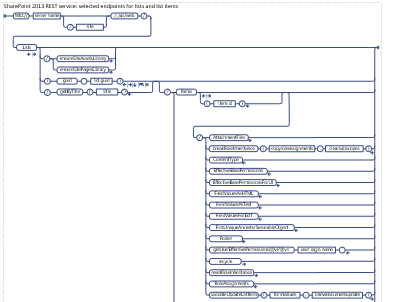

# Lists and list items REST API reference
Learn about lists, list items, views, and other list-related resources and endpoints in the REST API.
 

 **Last modified:** September 17, 2015
 

 * **Applies to:** apps for SharePoint | SharePoint Foundation 2013 | SharePoint Online | SharePoint Server 2013* 
 

## About the request examples in this article
<a name="bk_Overview"> </a>

The request examples in this article assume that you're using the cross-domain library (SP.RequestExecutor.js) to make cross-domain requests, so they use  **SP.AppContextSite** in the endpoint URI. See [Access SharePoint 2013 data from add-ins using the cross-domain library](http://msdn.microsoft.com/library/access-sharepoint-2013-data-from-add-ins-using-the-cross-domain-library%28Office.15%29.aspx) for more information.
 

 
Before you use a request example, do the following:
 

 

- Change  _<app web url>_,  _<host web url>_, and other placeholder data such as any IDs, names, or paths of SharePoint entities.
    
 
- If you're not using the cross-domain library, include an  **X-RequestDigest** header to send the form digest value in all POST requests and a **content-length** header for POST requests that send data in the request body.
    
 
- If you're not making cross-domain requests, remove  `SP.AppContextSite(@target)` and `?@target='<host web url>'` from the endpoint URI.
    
 
- If you're using OAuth, include an  **Authorization** header ( `"Authorization": "Bearer " + <access token>`) to send the OAuth access token.
    
 
- Remove the line breaks from the  **url** and **body** property values in the request examples. Line breaks are added to the examples to make them easier to read.
    
 
- If you want the server to return responses in Atom format, remove the  `"accept": "application/json; odata=verbose"` header.
    
 
See  [Additional resources](lists-and-list-items-rest-api-reference.md#bk_AdditionalResources) for links to more information about using the cross-domain library, OAuth, and the SharePoint REST service. See [How REST requests differ by environment](http://msdn.microsoft.com/library/complete-basic-operations-using-sharepoint-2013-rest-endpoints%28Office.15%29.aspx#bk_HowRequestsDiffer) and [Properties used in REST requests](http://msdn.microsoft.com/library/complete-basic-operations-using-sharepoint-2013-rest-endpoints%28Office.15%29.aspx#bk_requestElements) for information about request formats.
 

 

 **Tip**  The SharePoint Online REST service supports combining multiple requests into a single call to the service by using the OData  `$batch` query option. For details and links to code samples, see [Make batch requests with the REST APIs](http://msdn.microsoft.com/library/make-batch-requests-with-the-rest-apis%28Office.15%29.aspx). This option is not yet supported for on-premise SharePoint.
 


## Explore the SharePoint 2013 lists and list items REST syntax
<a name="bk_Overview"> </a>


|||
|:-----|:-----|
| [ ](http://go.microsoft.com/fwlink/?LinkId=331058)| [Visually explore](http://go.microsoft.com/fwlink/?LinkId=331058) the SharePoint 2013 lists and list items REST syntax.Explore other SharePoint REST syntax diagrams: [Files and folders](http://go.microsoft.com/fwlink/?LinkId=331057) | [Users and groups](http://go.microsoft.com/fwlink/?LinkId=331059)Download the combined  [PDF](http://www.microsoft.com/en-us/download/details.aspx?id=41147) of all the SharePoint REST syntax diagrams.|

 **Note**  The OData $skip query option does not work when querying items of a particular list. It does work when querying the lists endpoint.
 


## List resource
<a name="bk_List"> </a>

Represents a SharePoint list. A list is a type of  **SP.SecurableObject**.
 

 
 [Endpoint URI](lists-and-list-items-rest-api-reference.md#bk_ListEndpoint) | [Properties](lists-and-list-items-rest-api-reference.md#bk_ListProperties) | [Methods](lists-and-list-items-rest-api-reference.md#bk_ListMethods) | [OData representation](lists-and-list-items-rest-api-reference.md#bk_ListOData)
 

 

### Endpoint URI
<a name="bk_ListEndpoint"> </a>

http:// _<site url>_/web/lists(guid' _<list id>_')
 

 

#### Supported HTTP methods

GET | POST | DELETE | MERGE | PUT
 

 

#### Request examples
<a name="bk_ListRequestExamples"> </a>

 **GET request example:** Get a list
 

 

```
executor.executeAsync({
  url: "<app web url>/_api/SP.AppContextSite(@target)/web
    /lists(guid'51925dd7-2108-481a-b1ef-4bfa4e69d48b')
    ?@target='<host web url>'",
  method: "GET",
  headers: { "accept": "application/json; odata=verbose" },
  success: successHandler,
  error: errorHandler
});
```

Or, you can use the  [GetByTitle](lists-and-list-items-rest-api-reference.md#bk_ListCollectionGetByTitle) method from the [ListCollection](lists-and-list-items-rest-api-reference.md#bk_ListCollection) resource to get a list by its title. Example: `…/web/lists/getbytitle('Access Requests')`.
 

 
 **POST request example:** Create a list
 

 


```
executor.executeAsync({
  url: "<app web url>/_api/SP.AppContextSite(@target)/web/lists
    ?@target='<host web url>'",
  method: "POST",
  body: "{ '__metadata': { 'type': 'SP.List' }, 'AllowContentTypes': true, 'BaseTemplate': 100,
    'ContentTypesEnabled': true, 'Description': 'My list description', 'Title': 'Test title' }",
  headers: { "content-type": "application/json;odata=verbose" },
  success: successHandler,
  error: errorHandler
});
```

 **MERGE request example:** Change a list
 

 


```
executor.executeAsync({
  url: "<app web url>/_api/SP.AppContextSite(@target)/web
    /lists(guid'51925dd7-2108-481a-b1ef-4bfa4e69d48b')
    ?@target='<host web url>'",
  method: "POST",
  body: "{ '__metadata': { 'type': 'SP.List' }, 'AllowContentTypes': true, 'BaseTemplate': 100,
    'ContentTypesEnabled': true, 'Description': 'My list description', 'Title': 'Test title' }",
  headers: { 
    "IF-MATCH": "*",
    "X-HTTP-Method": "MERGE",
    "content-type": "application/json;odata=verbose"
  },
  success: successHandler,
  error: errorHandler
});
```

 **DELETE request example:** Delete a list
 

 


```
executor.executeAsync({
  url: "<app web url>/_api/SP.AppContextSite(@target)/web
    /lists(guid'51925dd7-2108-481a-b1ef-4bfa4e69d48b')
    ?@target='<host web url>'",
  method: "POST",
  headers: { 
    "IF-MATCH": "*",
    "X-HTTP-Method": "DELETE"
  },
  success: successHandler,
  error: errorHandler
});
```

If you want to recycle a list and get the GUID of the recycle bin item, use the list's  [Recycle](lists-and-list-items-rest-api-reference.md#bk_ListRecycle) method to remove the file.
 

 

### List properties
<a name="bk_ListProperties"> </a>

To get a property, send a GET request to the property endpoint, as shown in the following example.
 

 

```
executor.executeAsync({
  url: "<app web url>/_api/SP.AppContextSite(@target)/web
    /lists(guid'51925dd7-2108-481a-b1ef-4bfa4e69d48b')/<property name>
    ?@target='<host web url>'",
  method: "GET",
  headers: { "accept": "application/json; odata=verbose" },
  success: successHandler,
  error: errorHandler
});
```


|**Property**|**Type**|**R/W**|** [Returned with resource](http://msdn.microsoft.com/library/complete-basic-operations-using-sharepoint-2013-rest-endpoints%28Office.15%29.aspx#NavigationProperties)**|**Description**|
|:-----|:-----|:-----|:-----|:-----|
|AllowContentTypes|**Boolean**|R|Yes|Gets a value that specifies whether the list supports content types.|
|BaseTemplate|**Int32**|R|Yes|Gets the list definition type on which the list is based. Represents a  **ListTemplateType** value. See **ListTemplateType** in the .NET client object model reference for template type values.|
|BaseType|**Int32**|R|Yes|Gets the base type for the list. Represents an  **SP.BaseType** value: Generic List = 0; Document Library = 1; Discussion Board = 3; Survey = 4; Issue = 5.|
|BrowserFileHandling|**Int32**|R|No|Gets a value that specifies the override of the web application's  **BrowserFileHandling** property at the list level. Represents an **SP.BrowserFileHandling** value: Permissive = 0; Strict = 1.|
|ContentTypes|**SP.ContentTypeCollection**|R|No|Gets the content types that are associated with the list.|
|ContentTypesEnabled|**Boolean**|RW|Yes|Gets or sets a value that specifies whether content types are enabled for the list.|
|Created|**DateTime**|R|Yes|Gets a value that specifies when the list was created.|
|DataSource| [SP.ListDataSource](complex-types-in-the-sp-namespace.md#bk_ListDataSource)|R|No|Gets the data source associated with the list, or  **null** if the list is not a virtual list. Returns **null** if the **HasExternalDataSource** property is **false**.|
|DefaultContentApprovalWorkflowId|**GUID**|RW|Yes|Gets or sets a value that specifies the default workflow identifier for content approval on the list. Returns an empty GUID if there is no default content approval workflow.|
|DefaultDisplayFormUrl|**String**|RW|No|Gets or sets a value that specifies the location of the default display form for the list. Clients specify a server-relative URL, and the server returns a site-relative URL|
|DefaultEditFormUrl|**String**|RW|No|Gets or sets a value that specifies the URL of the edit form to use for list items in the list. Clients specify a server-relative URL, and the server returns a site-relative URL.|
|DefaultNewFormUrl|**String**|RW|No|Gets or sets a value that specifies the location of the default new form for the list. Clients specify a server-relative URL, and the server returns a site-relative URL.|
|DefaultView| [SP.View](lists-and-list-items-rest-api-reference.md#bk_View)|R|No||
|DefaultViewUrl|**String**|R|No|Gets the URL of the default view for the list.|
|Description|**String**|RW|Yes|Gets or sets a value that specifies the description of the list.|
|Direction|**String**|RW|Yes|Gets or sets a value that specifies the reading order of the list. Returns "NONE", "LTR", or "RTL".|
|DocumentTemplateUrl|**String**|RW|Yes|Gets or sets a value that specifies the server-relative URL of the document template for the list. Returns a server-relative URL if the base type is  **DocumentLibrary**, otherwise returns  **null**.|
|DraftVersionVisibility|**Int32**|RW|Yes|Gets or sets a value that specifies the minimum permission required to view minor versions and drafts within the list. Represents an  **SP.DraftVisibilityType** value: Reader = 0; Author = 1; Approver = 2.|
|EffectiveBasePermissions| [SP.BasePermissions](complex-types-in-the-sp-namespace.md#bk_BasePermissions)|R|No|Gets a value that specifies the effective permissions on the list that are assigned to the current user.|
|EffectiveBasePermissionsForUI| [SP.BasePermissions](complex-types-in-the-sp-namespace.md#bk_BasePermissions)|R|No||
|EnableAttachments|**Boolean**|RW|Yes|Gets or sets a value that specifies whether list item attachments are enabled for the list.|
|EnableFolderCreation|**Boolean**|RW|Yes|Gets or sets a value that specifies whether new list folders can be added to the list.|
|EnableMinorVersions|**Boolean**|RW|Yes|Gets or sets a value that specifies whether minor versions are enabled for the list.|
|EnableModeration|**Boolean**|RW|Yes|Gets or sets a value that specifies whether content approval is enabled for the list.|
|EnableVersioning|**Boolean**|RW|Yes|Gets or sets a value that specifies whether historical versions of list items and documents can be created in the list.|
|EntityTypeName|**String**|R|Yes||
|EventReceivers|**SP.EventReceiverDefinitionCollection**|R|No||
|Fields| [SP.FieldCollection](fields-rest-api-reference.md#bk_FieldCollection)|R|No|Gets a value that specifies the collection of all fields in the list.|
|FirstUniqueAncestorSecurableObject|**SP.SecurableObject**|R|No|Gets the object where role assignments for this object are defined. If role assignments are defined directly on the current object, the current object is returned.|
|ForceCheckout|**Boolean**|RW|Yes|Gets or sets a value that indicates whether forced checkout is enabled for the document library.|
|Forms|**SP.FormCollection**|R|No|Gets a value that specifies the collection of all list forms in the list.|
|HasExternalDataSource|**Boolean**|R|Yes|Gets a value that specifies whether the list is an external list.|
|HasUniqueRoleAssignments|**Boolean**|R|No|Gets a value that specifies whether the role assignments are uniquely defined for this securable object or inherited from a parent securable object.|
|Hidden|**Boolean**|RW|Yes|Gets or sets a Boolean value that specifies whether the list is hidden. If  **true**, the server sets the  **OnQuickLaunch** property to **false**.|
|Id|**GUID**|R|Yes|Gets the GUID that identifies the list in the database.|
|ImageUrl|**String**|R|Yes|Gets a value that specifies the URI for the icon of the list.|
|InformationRightsManagementSettings|**SP.InformationRightsManagementSettings**|R|No||
|IrmEnabled|**Boolean**|RW|Yes||
|IrmExpire|**Boolean**|RW|Yes||
|IrmReject|**Boolean**|RW|Yes||
|IsApplicationList|**Boolean**|RW|Yes|Gets or sets a value that specifies a flag that a client application can use to determine whether to display the list.|
|IsCatalog|**Boolean**|R|Yes|Gets a value that specifies whether the list is a gallery.|
|IsPrivate|**Boolean**|R|Yes||
|IsSiteAssetsLibrary|**Boolean**|R|No|Gets a value that indicates whether the list is designated as a default asset location for images or other files which the users upload to their wiki pages.|
|ItemCount|**Int32**|R|Yes|Gets a value that specifies the number of list items in the list.|
|Items| [SP.ListItemCollection](lists-and-list-items-rest-api-reference.md#bk_ListItemOData)|R|No|Gets all the items in the list.You can use  [OData query operations](http://msdn.microsoft.com/library/use-odata-query-operations-in-sharepoint-rest-requests%28Office.15%29.aspx) to filter items (example: `…/lists(guid'51925dd7-2108-481a-b1ef-4bfa4e69d48b')/items?$filter=Status eq 'not started'&amp;$select=Title&amp;$top=5`).|
|LastItemDeletedDate|**DateTime**|R|Yes|Gets a value that specifies the last time a list item was deleted from the list.|
|LastItemModifiedDate|**DateTime**|RW|Yes|Gets a value that specifies the last time a list item, field, or property of the list was modified.|
|ListItemEntityTypeFullName|**String**|R|Yes||
|MultipleDataList|**Boolean**|RW|Yes|Gets or sets a value that indicates whether the list in a Meeting Workspace site contains data for multiple meeting instances within the site.|
|NoCrawl|**Boolean**|RW|Yes|Gets or sets a value that specifies that the crawler must not crawl the list.|
|OnQuickLaunch|**Boolean**|RW|No|Gets or sets a value that specifies whether the list appears on the Quick Launch of the site. If  **true**, the server sets the  **Hidden** property to **false**.|
|ParentWeb| [SP.Web](webs-rest-api-reference.md#bk_Web)|R|No|Gets a value that specifies the site that contains the list.|
|ParentWebUrl|**String**|R|Yes|Gets a value that specifies the server-relative URL of the site that contains the list.|
|RoleAssignments| [SP.RoleAssignmentCollection](users-groups-and-roles-rest-api-reference.md#bk_RoleAssignmentCollection)|R|No|Gets the role assignments for the securable object.|
|RootFolder| [SP.Folder](files-and-folders-rest-api-reference.md#bk_Folder)|R|No|Gets the root folder that contains the files in the list and any related files.|
|SchemaXml|**String**|R|No|Gets a value that specifies the list schema of the list.|
|ServerTemplateCanCreateFolders|**Boolean**|R|Yes|Gets a value that indicates whether folders can be created within the list.|
|TemplateFeatureId|**GUID**|R|Yes|Gets a value that specifies the feature identifier of the feature that contains the list schema for the list. Returns an empty GUID if the list schema is not contained within a feature.|
|Title|**String**|RW|Yes|Gets or sets the displayed title for the list. Its length must be <= 255 characters.|
|UserCustomActions| [SP.UserCustomActionCollection](users-groups-and-roles-rest-api-reference.md#bk_UserCustomActionCollection)|R|No|Gets a value that specifies the collection of all user custom actions for the list.|
|ValidationFormula|**String**|RW|No|Gets or sets a value that specifies the data validation criteria for a list item. Its length must be <= 1023.|
|ValidationMessage|**String**|RW|No|Gets or sets a value that specifies the error message returned when data validation fails for a list item. Its length must be <= 1023.|
|Views| [SP.ViewCollection](lists-and-list-items-rest-api-reference.md#bk_ViewCollection)|R|No|Gets a value that specifies the collection of all public views on the list and personal views of the current user on the list.|
|WorkflowAssociations|**SP.Workflow.WorkflowAssociationCollection**|R|No|Gets a value that specifies the collection of all workflow associations for the list.|

### List methods
<a name="bk_ListMethods"> </a>

 [AddItem](lists-and-list-items-rest-api-reference.md#bk_ListAddItem)
 
 [BreakRoleInheritance](lists-and-list-items-rest-api-reference.md#bk_ListBreakRoleInheritance)
 
 [DeleteObject](lists-and-list-items-rest-api-reference.md#bk_ListDeleteObject)
 
 [GetChanges](lists-and-list-items-rest-api-reference.md#bk_ListGetChanges)
 
 [GetItemById](lists-and-list-items-rest-api-reference.md#bk_ListGetItemById)
 
 [GetItems](lists-and-list-items-rest-api-reference.md#bk_ListGetItems)
 
 [GetListItemChangesSinceToken](lists-and-list-items-rest-api-reference.md#bk_ListGetListItemChangesSinceToken)
 
 [GetRelatedFields](lists-and-list-items-rest-api-reference.md#bk_ListGetRelatedFields)
 
 [GetUserEffectivePermissions](lists-and-list-items-rest-api-reference.md#bk_ListGetUserEffectivePermissions)
 
 [GetView](lists-and-list-items-rest-api-reference.md#bk_ListGetView)
 
 [Recycle](lists-and-list-items-rest-api-reference.md#bk_ListRecycle)
 
 [RenderListData](lists-and-list-items-rest-api-reference.md#bk_ListRenderListData)
 
 [RenderListFormData](lists-and-list-items-rest-api-reference.md#bk_ListRenderListFormData)
 
 [ReserveListItemId](lists-and-list-items-rest-api-reference.md#bk_ListReserveListItemId)
 
 [ResetRoleInheritance](lists-and-list-items-rest-api-reference.md#bk_ListResetRoleInheritance)
 

 

#### AddItem method
<a name="bk_ListAddItem"> </a>

The recommended way to add a list item is to send a  **POST** request to the **ListItemCollection** resource endpoint, as shown in [ListItemCollection request examples](lists-and-list-items-rest-api-reference.md#bk_ListItemCollectionRequestExamples).
 

 

#### BreakRoleInheritance method
<a name="bk_ListBreakRoleInheritance"> </a>

Creates unique role assignments for the securable object.
 

 

|||
|:-----|:-----|
|**Endpoint**|/breakroleinheritance( _copyroleassignments_,  _clearsubscopes_)|
|**Parameters**| copyroleassignmentsType: Booleantrue to copy the role assignments from the parent securable object; false to remove the inherited role assignments except one that contains the current user.clearsubscopesType: Boolean Optional. true to make all child securable objects inherit role assignments from the current object; false (default) to leave role assignments unchanged for child securable objects that do not inherit role assignments from their parent object. |
|**HTTP method**|POST|
|**Response**|None|

 
 **Request example**
 

 


```
executor.executeAsync({
  url: "<app web url>/_api/SP.AppContextSite(@target)/web/lists(guid'a290086b-2d43-4151-add4-893474a930a9')
    /breakroleinheritance(copyroleassignments=false, clearsubscopes=true)
    ?@target='<host web url>'",
  method: "POST",
  success: successHandler,
  error: errorHandler
});
```


#### DeleteObject method
<a name="bk_ListDeleteObject"> </a>

The recommended way to delete a list is to send a  **DELETE** request to the **List** resource endpoint, as shown in [List request examples](lists-and-list-items-rest-api-reference.md#bk_ListRequestExamples).
 

 

#### GetChanges method
<a name="bk_ListGetChanges"> </a>

Returns the collection of changes from the change log that have occurred within the list, based on the specified query.
 

 

|||
|:-----|:-----|
|**Endpoint**|/getchanges|
|**Parameters**| queryType: SP.ChangeQueryThe change query. Pass this parameter in the request body, as shown in the request example. |
|**HTTP method**|POST|
|**Response**|Type:  **SP.ChangeCollection** The changes to the list that match the criteria of the specified change query.|

 
 **Request example**
 

 


```
var metadata = "{ 'query' : { '__metadata': { 'type': 'SP.ChangeQuery' },
    'Add': 'True', 'Item': 'True' }}";

executor.executeAsync({
  url: "<app web url>/_api/SP.AppContextSite(@target)/web/lists(guid'51925dd7-2108-481a-b1ef-4bfa4e69d48b')
    /getchanges
    ?@target='<host web url>'",
  method: "POST",
  body: metadata,
  headers: {
    "accept": "application/json; odata=verbose",
    "content-type": "application/json; odata=verbose"
  },
  success: successHandler,
  error: errorHandler
});
```


 
 **Response example**
 

 


```
{"d":
  {"results":[{
    "__metadata":{
      "id":"https://<site url>/_api/SP.ChangeItema7e7c6e9-2c41-47c3-aae9-2b4a63b7a087",
      "uri":"https://<site url>/_api/SP.ChangeItem",
      "type":"SP.ChangeItem"
    },
    "ChangeToken":{"__metadata":{"type":"SP.ChangeToken"}, "StringValue":"1;3;482e418a-0900-414b-8902-02248c2e44e8;634955266749500000;5749111"},
    "ChangeType":1,
    "SiteId":"ce11bfbb-cf9d-4b2b-a642-8673bd48cceb",
    "Time":"2013-02-03T22:17:54Z",
    "ItemId":1,
    "ListId":"482e418a-0900-414b-8902-02248c2e44e8",
    "WebId":"a975b994-fc67-4203-a519-b160175ca967"
  }]
}}
```


#### GetItemById method
<a name="bk_ListGetItemById"> </a>

Returns the list item with the specified list item identifier.
 

 

|||
|:-----|:-----|
|**Endpoint**|/getitembyid( _<item id>_)|
|**Parameters**|Type:  **Int32** The ID of the list item.|
|**HTTP method**|GET|
|**Response**|Type:  [SP.ListItem](lists-and-list-items-rest-api-reference.md#bk_ListItem) The list item with the specified ID.|

 
 **Request example**
 

 


```
executor.executeAsync({
  url: "<app web url>/_api/SP.AppContextSite(@target)/web/lists(guid'a290086b-2d43-4151-add4-893474a930a9')
    /getitembyid(2)
    ?@target='<host web url>'",
  method: "GET",
  headers: { "accept": "application/json; odata=verbose" },
  success: successHandler,
  error: errorHandler
});
```

Or, you can pass the list item ID to the  [ListItemCollection](lists-and-list-items-rest-api-reference.md#bk_ListItemCollection) resource. Example: `…/web/lists(guid'51925dd7-2108-481a-b1ef-4bfa4e69d48b')/items(2)`.
 

 

#### GetItems method
<a name="bk_ListGetItems"> </a>

Returns a collection of items from the list based on the specified query.
 

 

|||
|:-----|:-----|
|**Endpoint**|/getitems|
|**Parameters**| queryType: SP.CamlQueryThe filter query. Pass this parameter in the request body, as shown in the request example. |
|**HTTP method**|POST|
|**Response**|Type:  [SP.ListItemCollection](lists-and-list-items-rest-api-reference.md#bk_ListItemCollection) The list items that match the specified query.|

 
 **Request example**
 

 


```
executor.executeAsync({
  url: "<app web url>/_api/SP.AppContextSite(@target)/web/lists(guid'47f89cf2-359d-4792-9dc4-8da877a5050a')
    /getitems
    ?@target='<host web url>'",
  method: "POST",
  body: "{ 'query' : {'__metadata': { 'type': 'SP.CamlQuery' }, "ViewXml": "<View><Query><Where><Contains><FieldRef Name='Status'/><Value Type='CHOICE'>in progress</Value></Contains></Where></Query></View>" } }",
  headers: {
    "accept": "application/json; odata=verbose",
    "content-type": "application/json; odata=verbose"
  },
  success: successHandler,
  error: errorHandler
});
```


#### GetListItemChangesSinceToken method
<a name="bk_ListGetListItemChangesSinceToken"> </a>


 

 

|||
|:-----|:-----|
|**Endpoint**|/getlistitemchangessincetoken|
|**Parameters**| queryType: SP.ChangeLogItemQueryThe query that contains the change token. Pass this parameter in the request body, as shown in the request example. |
|**HTTP method**|POST|
|**Response**|Type:  **GetListItemChangesSinceTokenResult** A  **Stream** that contains an XML representation of the changes to the list items that have happened after the specified change.|

 
 **Request example**
 

 


```
var metadata = "{ 'query': { '__metadata': { 'type': 'SP.ChangeLogItemQuery' },
    'ChangeToken': '1;3;79cc20e6-adda-438e-8a96-792041b33168;635103901830230000;33050019' }}";

executor.executeAsync({
  url: "<app web url>/_api/SP.AppContextSite(@target)/web/lists(guid'51925dd7-2108-481a-b1ef-4bfa4e69d48b')
    /getlistitemchangessincetoken
    ?@target='<host web url>'",
  method: "POST",
  body: metadata,
  headers: { "content-type": "application/json; odata=verbose" },
  success: successHandler,
  error: errorHandler
});
```

See  [Synchronize SharePoint items using the REST service](http://msdn.microsoft.com/library/synchronize-sharepoint-items-using-the-rest-service%28Office.15%29.aspx) for an example of how to specify a filtered query.
 

 

 
 **Response example**
 

 


```XML
<?xml version="1.0" encoding="utf-8" ?>
<GetListItemChangesSinceTokenResult>
  <listitems MinTimeBetweenSyncs='0' RecommendedTimeBetweenSyncs='180' MaxBulkDocumentSyncSize='500' MaxRecommendedEmbeddedFileSize='500' EffectivePermMask='FullMask' xmlns:s='uuid:BDC6E3F0-6DA3-11d1-A2A3-00AA00C14882' xmlns:dt='uuid:C2F41010-65B3-11d1-A29F-00AA00C14882' xmlns:rs='urn:schemas-microsoft-com:rowset' xmlns:z='#RowsetSchema'>
    <Changes LastChangeToken="1;3;79cc20e6-adda-438e-8a96-792041b33168;635110802324330000;33811711">
    <List DocTemplateUrl="" DefaultViewUrl="/Lists/TestList/AllItems.aspx" MobileDefaultViewUrl="" ID="{79CC20E6-ADDA-438E-8A96-792041B33168}" Title="TestList" Description="" ImageUrl="/_layouts/15/images/itgen.png?rev=26" Name="{79CC20E6-ADDA-438E-8A96-792041B33168}" BaseType="0" FeatureId="00bfea71-de22-43b2-a848-c05709900100" ServerTemplate="100" Created="20130725 22:22:35" Modified="20130802 22:43:52" LastDeleted="20130725 22:22:35" Version="4" Direction="none" ThumbnailSize="" WebImageWidth="" WebImageHeight="" Flags="545263616" ItemCount="2" AnonymousPermMask="0" RootFolder="/Lists/TestList" ReadSecurity="1" WriteSecurity="1" Author="11" EventSinkAssembly="" EventSinkClass="" EventSinkData="" EmailAlias="" WebFullUrl="/" WebId="a975b994-fc67-4203-a519-b160175ca967" SendToLocation="" ScopeId="ad9949be-be16-4946-b5de-66c912eda54a" MajorVersionLimit="0" MajorWithMinorVersionsLimit="0" WorkFlowId="" HasUniqueScopes="False" NoThrottleListOperations="False" HasRelatedLists="" Followable="False" AllowDeletion="True" AllowMultiResponses="False" EnableAttachments="True" EnableModeration="False" EnableVersioning="False" HasExternalDataSource="False" Hidden="False" MultipleDataList="False" Ordered="False" ShowUser="True" EnablePeopleSelector="False" EnableResourceSelector="False" EnableMinorVersion="False" RequireCheckout="False" ThrottleListOperations="False" ExcludeFromOfflineClient="False" CanOpenFileAsync="True" EnableFolderCreation="False" IrmEnabled="False" IsApplicationList="False" PreserveEmptyValues="False" StrictTypeCoercion="False" EnforceDataValidation="False" MaxItemsPerThrottledOperation="5000">
      <Fields>
        <Field ID="{03e45e84-1992-4d42-9116-26f756012634}" RowOrdinal="0" Type="ContentTypeId" Sealed="TRUE" ReadOnly="TRUE" Hidden="TRUE" DisplayName="Content Type ID" Name="ContentTypeId" DisplaceOnUpgrade="TRUE" SourceID="http://schemas.microsoft.com/sharepoint/v3" StaticName="ContentTypeId" ColName="tp_ContentTypeId" FromBaseType="TRUE"/>
        <Field ID="{fa564e0f-0c70-4ab9-b863-0177e6ddd247}" Type="Text" Name="Title" DisplayName="Title" Required="TRUE" SourceID="http://schemas.microsoft.com/sharepoint/v3" StaticName="Title" FromBaseType="TRUE" ColName="nvarchar1"/>
        <Field ID="{34ad21eb-75bd-4544-8c73-0e08330291fe}" ReadOnly="TRUE" Type="Note" Name="_ModerationComments" DisplayName="Approver Comments" Hidden="TRUE" CanToggleHidden="TRUE" Filterable="FALSE" Sortable="FALSE" SourceID="http://schemas.microsoft.com/sharepoint/v3" StaticName="_ModerationComments" FromBaseType="TRUE" ColName="ntext1"/>
        <Field ID="{39360f11-34cf-4356-9945-25c44e68dade}" ReadOnly="TRUE" Hidden="TRUE" Type="Text" Name="File_x0020_Type" DisplaceOnUpgrade="TRUE" DisplayName="File Type" SourceID="http://schemas.microsoft.com/sharepoint/v3" StaticName="File_x0020_Type" FromBaseType="TRUE" ColName="nvarchar2"/>
        <Field ID="{fc2e188e-ba91-48c9-9dd3-16431afddd50}" Name="WorkAddress" SourceID="http://schemas.microsoft.com/sharepoint/v3" StaticName="WorkAddress" Group="Core Contact and Calendar Columns" DisplayName="Address" Type="Note" NumLines="2" Sortable="FALSE" ColName="ntext2" RowOrdinal="0"/>
        <Field ID="{fce16b4c-fe53-4793-aaab-b4892e736d15}" Name="EMail" SourceID="http://schemas.microsoft.com/sharepoint/v3" StaticName="EMail" Group="Core Contact and Calendar Columns" DisplayName="E-Mail" ReadOnly="FALSE" Type="Text" FromBaseType="TRUE" AllowDeletion="TRUE" ColName="nvarchar3" RowOrdinal="0"/>
        <Field Type="Lookup" DisplayName="anewishlisttitle" Required="FALSE" EnforceUniqueValues="FALSE" List="{482e418a-0900-414b-8902-02248c2e44e8}" ShowField="Title" UnlimitedLengthInDocumentLibrary="FALSE" RelationshipDeleteBehavior="None" ID="{9919f3f8-88fb-43fc-b4cb-658b1db1bfe3}" SourceID="{79cc20e6-adda-438e-8a96-792041b33168}" StaticName="anewishlisttitle" Name="anewishlisttitle" ColName="int1" RowOrdinal="0"/>
        <Field Type="Lookup" DisplayName="Books title" Required="FALSE" EnforceUniqueValues="FALSE" List="{90146606-81fd-410d-9fdd-d03b6349fbcd}" ShowField="Title" UnlimitedLengthInDocumentLibrary="FALSE" RelationshipDeleteBehavior="None" ID="{879a1cba-91b6-4c0a-99fb-29f877aae3ea}" SourceID="{79cc20e6-adda-438e-8a96-792041b33168}" StaticName="Books_x0020_title" Name="Books_x0020_title" ColName="int2" RowOrdinal="0"/>
        <Field ID="{1d22ea11-1e32-424e-89ab-9fedbadb6ce1}" ColName="tp_ID" RowOrdinal="0" ReadOnly="TRUE" Type="Counter" Name="ID" PrimaryKey="TRUE" DisplayName="ID" SourceID="http://schemas.microsoft.com/sharepoint/v3" StaticName="ID" FromBaseType="TRUE"/>
        <Field ID="{c042a256-787d-4a6f-8a8a-cf6ab767f12d}" Type="Computed" DisplayName="Content Type" Name="ContentType" DisplaceOnUpgrade="TRUE" RenderXMLUsingPattern="TRUE" Sortable="FALSE" SourceID="http://schemas.microsoft.com/sharepoint/v3" StaticName="ContentType" Group="_Hidden" PITarget="MicrosoftWindowsSharePointServices" PIAttribute="ContentTypeID" FromBaseType="TRUE">
          <FieldRefs>
            <FieldRef Name="ContentTypeId"/>
          </FieldRefs>
          <DisplayPattern>
            <MapToContentType>
              <Column Name="ContentTypeId"/>
            </MapToContentType>
          </DisplayPattern>
        </Field>
        <…>
      </Fields>
      <RegionalSettings>
        <Language>1033</Language>
        <Locale>1033</Locale>
        <AdvanceHijri>0</AdvanceHijri>
        <CalendarType>1</CalendarType>
        <Time24>False</Time24>
        <TimeZone>480</TimeZone>
        <SortOrder>2070</SortOrder>
        <Presence>True</Presence>
      </RegionalSettings>
      <ServerSettings>
        <ServerVersion>16.0.1810.1236</ServerVersion>
        <RecycleBinEnabled>True</RecycleBinEnabled>
        <ServerRelativeUrl>/</ServerRelativeUrl>
       </ServerSettings>
      </List>
    </Changes>
    <rs:data ItemCount="1">
      <z:row ows_ContentTypeId='0x0100C8CFB1DE383F1B49A44ABD2EB9AC7322' ows_Title='<item title>' ows_ID='2' ows_ContentType='Item' ows_Modified='2013-07-25T23:21:50Z' ows_Created='2013-07-25T23:21:50Z' ows_Author='<author>' ows_Editor='<editor>' ows_owshiddenversion='1' ows_WorkflowVersion='1' ows__UIVersion='512' ows__UIVersionString='1.0' ows_Attachments='0' ows__ModerationStatus='0' ows_LinkTitleNoMenu='<item title>' ows_LinkTitle='<item title>' ows_LinkTitle2='<item title>' ows_SelectTitle='2' ows_Order='200.000000000000' ows_GUID='{D38981C3-2735-4FDF-9B41-91F3ADA8F3F0}' ows_FileRef='2;#Lists/TestList/2_.000' ows_FileDirRef='2;#Lists/TestList' ows_Last_x0020_Modified='2;#2013-07-25T23:21:50Z' ows_Created_x0020_Date='2;#2013-07-25T23:21:50Z' ows_FSObjType='2;#0' ows_SortBehavior='2;#0' ows_PermMask='0x7fffffffffffffff' ows_FileLeafRef='2;#2_.000' ows_UniqueId='2;#{4D719C3B-B8AB-46A0-A080-402DF6EE31C1}' ows_ProgId='2;#' ows_ScopeId='2;#{AD9949BE-BE16-4946-B5DE-66C912EDA54A}' ows__EditMenuTableStart='2_.000' ows__EditMenuTableStart2='2' ows__EditMenuTableEnd='2' ows_LinkFilenameNoMenu='2_.000' ows_LinkFilename='2_.000' ows_LinkFilename2='2_.000' ows_ServerUrl='/Lists/TestList/2_.000' ows_EncodedAbsUrl='https://<site url>.sharepoint.com/Lists/TestList/2_.000' ows_BaseName='2_' ows_MetaInfo='2;#' ows__Level='1' ows__IsCurrentVersion='1' ows_ItemChildCount='2;#0' ows_FolderChildCount='2;#0' ows_ServerRedirected='0' />
    </rs:data>
  </listitems>
</GetListItemChangesSinceTokenResult>
```


#### GetRelatedFields method
<a name="bk_ListGetRelatedFields"> </a>

Returns a collection of lookup fields that use this list as a data source and that have  **FieldLookup.IsRelationship** set to **true**.
 

 

|||
|:-----|:-----|
|**Endpoint**|/getrelatedfields|
|**Parameters**|None|
|**HTTP method**|GET|
|**Response**|Type:  **SP.RelatedFieldCollection** A collection of  **SP.RelatedField** objects with information about the relationship between a field in a list and a lookup field in another list.|

 
 **Request example**
 

 


```
executor.executeAsync({
  url: "<app web url>/_api/SP.AppContextSite(@target)/web/lists(guid'51925dd7-2108-481a-b1ef-4bfa4e69d48b')
    /getrelatedfields
    ?@target='<host web url>'",
  method: "GET",
  headers: { "accept": "application/json; odata=verbose" },
  success: successHandler,
  error: errorHandler
});
```


#### GetUserEffectivePermissions method
<a name="bk_ListGetUserEffectivePermissions"> </a>


 

 

|||
|:-----|:-----|
|**Endpoint**|/getusereffectivepermissions(@user)?@user=' _<user login name>_'|
|**Parameters**|Type:  **String** The login name of the user to get permissions for, passed as an alias in the query string. For example:  SharePoint Online or on-premises using forms: …/getusereffectivepermissions(@v)?@v='i%3A0%23.f%7Cmembership%7C _user_%40 _domain_.onmicrosoft.com'  On-premises using Windows claims: …/getusereffectivepermissions(@v)?@v='i%3A0%23.w%7C _domain_\ _user_'  On-premises using SAML claims: …/getusereffectivepermissions(@v)?@v='i%3A05%3At%7Cadfs+with+roles%7C _user_%40 _domain_.com'|
|**HTTP method**|GET|
|**Response**|Type:  [SP.BasePermissions](complex-types-in-the-sp-namespace.md#bk_BasePermissions) The set of permissions for the specified user:  **Int64** values for high- and low-order parts of the permissions.|

 
 **Request example**
 

 


```
executor.executeAsync({
  url: "<app web url>/_api/SP.AppContextSite(@target)/web/lists(guid'51925dd7-2108-481a-b1ef-4bfa4e69d48b')
    /getusereffectivepermissions(@user)?@user='i%3A0%23.f%7Cmembership%7Cuser%40domain.onmicrosoft.com'
    &amp;@target='<host web url>'",
  method: "GET",
  headers: { "accept": "application/json; odata=verbose" },
  success: successHandler,
  error: errorHandler
});
```


#### GetView method
<a name="bk_ListGetView"> </a>

Returns the list view with the specified view identifier.
 

 

|||
|:-----|:-----|
|**Endpoint**|/getview(' _<view id>_')|
|**Parameters**|Type:  **String** The unique identifier for the list view.|
|**HTTP method**|GET|
|**Response**|Type:  [SP.View](lists-and-list-items-rest-api-reference.md#bk_View) The specified list view.|

 
 **Request example**
 

 


```
executor.executeAsync({
  url: "<app web url>/_api/SP.AppContextSite(@target)/web/lists(guid'51925dd7-2108-481a-b1ef-4bfa4e69d48b')
    /getview('4814949d-3e17-444c-a1a3-cb69bc77e95f')
    ?@target='<host web url>'",
  method: "GET",
  headers: { "accept": "application/json; odata=verbose" },
  success: successHandler,
  error: errorHandler
});
```

Or you can just specify the view ID on the  [ViewCollection](lists-and-list-items-rest-api-reference.md#bk_ViewCollection) resource. Example: `…/_api/web/lists(guid'51925dd7-2108-481a-b1ef-4bfa4e69d48b')/views('4814949d-3e17-444c-a1a3-cb69bc77e95f')`
 

 

#### Recycle method
<a name="bk_ListRecycle"> </a>

Moves the list to the Recycle Bin and returns the identifier of the new Recycle Bin item.
 

 

|||
|:-----|:-----|
|**Endpoint**|/recycle|
|**Parameters**|None|
|**HTTP method**|POST|
|**Response**|Type:  **GUID** The GUID of the recycled list.|

 
 **Request example**
 

 


```
executor.executeAsync({
  url: "<app web url>/_api/SP.AppContextSite(@target)/web/lists(guid'51925dd7-2108-481a-b1ef-4bfa4e69d48b')
    /recycle
    ?@target='<host web url>'",
  method: "POST",
  headers: { "accept": "application/json; odata=verbose" },
  success: successHandler,
  error: errorHandler
});
```


#### RenderListData method
<a name="bk_ListRenderListData"> </a>


 

 

|||
|:-----|:-----|
|**Endpoint**|/renderlistdata(' _<view xml>_')|
|**Parameters**|Type:  **String** A CAML query that defines the items and fields that you want returned.|
|**HTTP method**|POST|
|**Response**|Type:  **String** The requested list data in the view defined by the specified XML.|

 
 **Request example**
 

 


```
executor.executeAsync({
  url: "<app web url>/_api/SP.AppContextSite(@target)/web/lists(guid'51925dd7-2108-481a-b1ef-4bfa4e69d48b')
    /renderlistdata(@viewXml)?@viewXml='<View><RowLimit>10</RowLimit></View>'
    &amp;@target='<host web url>'",
  method: "POST",
  headers: { "accept": "application/json; odata=verbose" },
  success: successHandler,
  error: errorHandler
});
```


#### RenderListFormData method
<a name="bk_ListRenderListFormData"> </a>


 

 

|||
|:-----|:-----|
|**Endpoint**|/renderlistformdata( _itemid_,  _formid_,  _mode_)|
|**Parameters**| itemidType: Int32The identifier of the list item to be rendered.formidType: StringThe identifier of the form.modeType: Int32The SP.ControlMode of the control used to display the item: 1 = Display; 2 = Edit; 3 = New. |
|**HTTP method**|POST|
|**Response**|Type:  **String** The field values and field schema attributes for a list item.|

 
 **Request example**
 

 


```
executor.executeAsync({
  url: "<app web url>/_api/SP.AppContextSite(@target)/web/lists(guid'51925dd7-2108-481a-b1ef-4bfa4e69d48b')
    /renderlistformdata(itemid=4, formid='e8b2f6e3-1081-4b18-833b-475f76473cde', mode=2)
    ?@target='<host web url>'",
  method: "POST",
  headers: { "accept": "application/json; odata=verbose" },
  success: successHandler,
  error: errorHandler
});
```


#### ReserveListItemId method
<a name="bk_ListReserveListItemId"> </a>


 

 
Reserves a list item ID for idempotent list item creation.
 

 

|||
|:-----|:-----|
|**Endpoint**|/reservelistitemid|
|**Parameters**|None|
|**HTTP method**|POST|
|**Response**|Type:  **Int32** The list item identifier to be reserved.|

 
 **Request example**
 

 


```
executor.executeAsync({
  url: "<app web url>/_api/SP.AppContextSite(@target)/web/lists(guid'51925dd7-2108-481a-b1ef-4bfa4e69d48b')
    /reservelistitemid
    ?@target='<host web url>'",
  method: "POST",
  headers: { "accept": "application/json; odata=verbose" },
  success: successHandler,
  error: errorHandler
});
```


#### ResetRoleInheritance method
<a name="bk_ListResetRoleInheritance"> </a>

Resets the role inheritance for the securable object and inherits role assignments from the parent securable object.
 

 

|||
|:-----|:-----|
|**Endpoint**|/resetroleinheritance|
|**Parameters**|None|
|**HTTP method**|POST|
|**Response**|None|

 
 **Request example**
 

 


```
executor.executeAsync({
  url: "<app web url>/_api/SP.AppContextSite(@target)/web
    /lists(guid'a290086b-2d43-4151-add4-893474a930a9')/items(2)
    /resetroleinheritance
    ?@target='<host web url>'",
  method: "POST",
  success: successHandler,
  error: errorHandler
});
```


### OData representation
<a name="bk_ListOData"> </a>

The following example represents a  [List](lists-and-list-items-rest-api-reference.md#bk_List) resource in JSON format.
 

 

```
{"d":{
  "__metadata":{
    "id":"http://<site url>/_api/Web/Lists(guid'8ade7551-f53c-48c5-9d2b-e89f6528cf47')",
    "uri":"http://<site url>/_api/Web/Lists(guid'8ade7551-f53c-48c5-9d2b-e89f6528cf47')",
    "etag":"\"0\"",
    "type":"SP.List"
  },
  "FirstUniqueAncestorSecurableObject":{"__deferred":{"uri":"http://<site url>/_api/Web/Lists(guid'8ade7551-f53c-48c5-9d2b-e89f6528cf47')/FirstUniqueAncestorSecurableObject"}},
  "RoleAssignments":{"__deferred":{"uri":"http://<site url>/_api/Web/Lists(guid'8ade7551-f53c-48c5-9d2b-e89f6528cf47')/RoleAssignments"}},
  "ContentTypes":{"__deferred":{"uri":"http://<site url>/_api/Web/Lists(guid'8ade7551-f53c-48c5-9d2b-e89f6528cf47')/ContentTypes"}},
  "DefaultView":{"__deferred":{"uri":"http://<site url>/_api/Web/Lists(guid'8ade7551-f53c-48c5-9d2b-e89f6528cf47')/DefaultView"}},
  "EventReceivers":{"__deferred":{"uri":"http://<site url>/_api/Web/Lists(guid'8ade7551-f53c-48c5-9d2b-e89f6528cf47')/EventReceivers"}},
  "Fields":{"__deferred":{"uri":"http://<site url>/_api/Web/Lists(guid'8ade7551-f53c-48c5-9d2b-e89f6528cf47')/Fields"}},
  "Forms":{"__deferred":{"uri":"http://<site url>/_api/Web/Lists(guid'8ade7551-f53c-48c5-9d2b-e89f6528cf47')/Forms"}},
  "InformationRightsManagementSettings":{"__deferred":{"uri":"http://<site url>/_api/Web/Lists(guid'8ade7551-f53c-48c5-9d2b-e89f6528cf47')/InformationRightsManagementSettings"}},
  "AllowContentTypes":true, 
  "BaseTemplate":100, 
  "BaseType":0, 
  "ContentTypesEnabled":false, 
  "Created":"2013-02-02T21:11:56Z",
  "DefaultContentApprovalWorkflowId":"00000000-0000-0000-0000-000000000000",
  "Description":"",
  "Direction":"none",
  "DocumentTemplateUrl":null, 
  "DraftVersionVisibility":0, 
  "EnableAttachments":true, 
  "EnableFolderCreation":false, 
  "EnableMinorVersions":false, 
  "EnableModeration":false, 
  "EnableVersioning":false,
  "EntityTypeName":"ANewList",
  "ForceCheckout":false, 
  "HasExternalDataSource":false, 
  "Hidden":false, 
  "Id":"8ade7551-f53c-48c5-9d2b-e89f6528cf47",
  "ImageUrl":"/_layouts/15/images/itgen.png?rev=23",
  "IrmEnabled":false, 
  "IrmExpire":false, 
  "IrmReject":false, 
  "IsApplicationList":false, 
  "IsCatalog":false, 
  "IsPrivate":false, 
  "ItemCount":1, 
  "LastItemDeletedDate":"2013-02-02T21:11:56Z",
  "LastItemModifiedDate":"2013-02-03T22:17:55Z",
  "ListItemEntityTypeFullName":"SP.Data.ANewListItem",
  "MultipleDataList":false, 
  "NoCrawl":false, 
  "ParentWebUrl":"/",
  "ServerTemplateCanCreateFolders":true, 
  "TemplateFeatureId":"00bfea71-de22-43b2-a848-c05709900100",
  "Title":"ANewList"
}}
```


## ListCollection resource
<a name="bk_ListCollection"> </a>

Represents a collection of lists.
 

 
 [Endpoint URI](lists-and-list-items-rest-api-reference.md#bk_ListCollectionEndpoint) | [Methods](lists-and-list-items-rest-api-reference.md#bk_ListCollectionMethods) | [OData representation](lists-and-list-items-rest-api-reference.md#bk_ListCollectionOData)
 

 

### Endpoint URI
<a name="bk_ListCollectionEndpoint"> </a>

http:// _<site url>_/web/lists
 

 

#### Supported HTTP methods

GET | POST
 

 

#### Request examples
<a name="bk_ListCollectionRequestExamples"> </a>

 **GET request example:** Get the lists at the root site
 

 

```
executor.executeAsync({
  url: "<app web url>/_api/SP.AppContextSite(@target)/web/lists
    ?@target='<host web url>'",
  method: "GET",
  headers: { "accept": "application/json; odata=verbose" },
  success: successHandler,
  error: errorHandler
});
```

 **GET request example:** Get a list by title
 

 


```
executor.executeAsync({
  url: "<app web url>/_api/SP.AppContextSite(@target)/web
    /lists/getbytitle('Access Requests')
    ?@target='<host web url>'",
  method: "GET",
  headers: { "accept": "application/json; odata=verbose" },
  success: successHandler,
  error: errorHandler
});
```

 **GET request example:** Get a list by ID
 

 


```
executor.executeAsync({
  url: "<app web url>/_api/SP.AppContextSite(@target)/web
    /lists(guid'51925dd7-2108-481a-b1ef-4bfa4e69d48b')
    ?@target='<host web url>'",
  method: "GET",
  headers: { "accept": "application/json; odata=verbose" },
  success: successHandler,
  error: errorHandler
});
```

 **POST request example:** Create a list
 

 


```
executor.executeAsync({
  url: "<app web url>/_api/SP.AppContextSite(@target)/web/lists
    ?@target='<host web url>'",
  method: "POST",
  body: "{ '__metadata': { 'type': 'SP.List' }, 'AllowContentTypes': true, 'BaseTemplate': 100,
    'ContentTypesEnabled': true, 'Description': 'My list description', 'Title': 'Test title' }",
  headers: { "content-type": "application/json;odata=verbose" },
  success: successHandler,
  error: errorHandler
});
```


### ListCollection methods
<a name="bk_ListCollectionMethods"> </a>

 [EnsureSiteAssetsLibrary](lists-and-list-items-rest-api-reference.md#bk_ListCollectionEnsureSiteAssetsLibrary)
 
 [EnsureSitePagesLibrary](lists-and-list-items-rest-api-reference.md#bk_ListCollectionEnsureSitePagesLibrary)
 
 [GetById](lists-and-list-items-rest-api-reference.md#bk_ListCollectionGetById)
 
 [GetByTitle](lists-and-list-items-rest-api-reference.md#bk_ListCollectionGetByTitle)
 

 

 

#### EnsureSiteAssetsLibrary method
<a name="bk_ListCollectionEnsureSiteAssetsLibrary"> </a>

Gets a list that is the default asset location for images or other files, which the users upload to their wiki pages.
 

 

|||
|:-----|:-----|
|**Endpoint**|/ensuresiteassetslibrary|
|**Parameters**|None|
|**HTTP method**|POST|
|**Response**|Type:  [SP.List](lists-and-list-items-rest-api-reference.md#bk_List) The list that is the default location for wiki page assets.|

 
 **Request example**
 

 


```
executor.executeAsync({
  url: "<app web url>/_api/SP.AppContextSite(@target)/web/lists
    /ensuresiteassetslibrary
    ?@target='<host web url>'",
  method: "POST",
  headers: { "accept": "application/json; odata=verbose" },
  success: successHandler,
  error: errorHandler
});
```


#### EnsureSitePagesLibrary method
<a name="bk_ListCollectionEnsureSitePagesLibrary"> </a>

Gets a list that is the default location for wiki pages.
 

 

|||
|:-----|:-----|
|**Endpoint**|/ensuresitepageslibrary|
|**Parameters**|None|
|**HTTP method**|POST|
|**Response**|Type:  [SP.List](lists-and-list-items-rest-api-reference.md#bk_List) The list that is the default location for wiki pages.|

 
 **Request example**
 

 


```
executor.executeAsync({
  url: "<app web url>/_api/SP.AppContextSite(@target)/web/lists
    /ensuresitepageslibrary
    ?@target='<host web url>'",
  method: "POST",
  headers: { "accept": "application/json; odata=verbose" },
  success: successHandler,
  error: errorHandler
});
```


#### GetById method
<a name="bk_ListCollectionGetById"> </a>

Returns the list with the specified list identifier.
 

 

|||
|:-----|:-----|
|**Endpoint**|/getbyid|
|**Parameters**|Type:  **String** The list identifier.|
|**HTTP method**|GET|
|**Response**|Type:  [SP.List](lists-and-list-items-rest-api-reference.md#bk_List) The list with the specified identifier.|

 
 **Request example**
 

 


```
executor.executeAsync({
  url: "<app web url>/_api/SP.AppContextSite(@target)/web/lists
    /getbyid('51925dd7-2108-481a-b1ef-4bfa4e69d48b')
    ?@target='<host web url>'",
  method: "GET",
  headers: { "accept": "application/json; odata=verbose" },
  success: successHandler,
  error: errorHandler
});
```

Or, you can just pass the list ID to the  [ListCollection](lists-and-list-items-rest-api-reference.md#bk_ListCollection) resource. Example: `…/web/lists(guid'51925dd7-2108-481a-b1ef-4bfa4e69d48b')`.
 

 

#### GetByTitle method
<a name="bk_ListCollectionGetByTitle"> </a>

Returns the list with the specified title from the collection.
 

 

|||
|:-----|:-----|
|**Endpoint**|/getbytitle|
|**Parameters**|Type:  **String** The list title.|
|**HTTP method**|GET|
|**Response**|Type:  [SP.List](lists-and-list-items-rest-api-reference.md#bk_List) The list with the specified title.|

 
 **Request example**
 

 


```
executor.executeAsync({
  url: "<app web url>/_api/SP.AppContextSite(@target)/web/lists
    /getbytitle('Access Requests')
    ?@target='<host web url>'",
  method: "GET",
  headers: { "accept": "application/json; odata=verbose" },
  success: successHandler,
  error: errorHandler
});
```


### OData representation
<a name="bk_ListCollectionOData"> </a>

The following example represents an  [ListCollection](lists-and-list-items-rest-api-reference.md#bk_ListCollection) resource in JSON format.
 

 

```
{"d":{
  "results":[{
    "__metadata":{"id":"https://<site url>/_api/Web/Lists(guid'51925dd7-2108-481a-b1ef-4bfa4e69d48b')",
    "uri":"https://<site url>/_api/Web/Lists(guid'51925dd7-2108-481a-b1ef-
4bfa4e69d48b')",
    "etag":"\"6\"",
    "type":"SP.List"
  },
  "FirstUniqueAncestorSecurableObject":{"__deferred":{"uri":"https://<site url>/_api/Web/Lists(guid'51925dd7-2108-481a-b1ef-4bfa4e69d48b')/FirstUniqueAncestorSecurableObject"}},
  "RoleAssignments":{"__deferred":{"uri":"https://<site url>/_api/Web/Lists(guid'51925dd7-2108-481a-b1ef-4bfa4e69d48b')/RoleAssignments"}},
  "ContentTypes":{"__deferred":{"uri":"https://<site url>/_api/Web/Lists(guid'51925dd7-2108-481a-b1ef-4bfa4e69d48b')/ContentTypes"}},
  "DefaultView":{"__deferred":{"uri":"https://<site url>/_api/Web/Lists(guid'51925dd7-2108-481a-b1ef-4bfa4e69d48b')/DefaultView"}},
  "EventReceivers":{"__deferred":{"uri":"https://<site url>/_api/Web/Lists(guid'51925dd7-2108-481a-b1ef-4bfa4e69d48b')/EventReceivers"}},
  "Fields":{"__deferred":{"uri":"https://<site url>/_api/Web/Lists(guid'51925dd7-2108-481a-b1ef-4bfa4e69d48b')/Fields"}},
  "Forms":{"__deferred":{"uri":"https://<site url>/_api/Web/Lists(guid'51925dd7-2108-481a-b1ef-4bfa4e69d48b')/Forms"}},
  "InformationRightsManagementSettings":{"__deferred":{"uri":"https://<site url>/_api/Web/Lists(guid'51925dd7-2108-481a-b1ef-4bfa4e69d48b')/InformationRightsManagementSettings"}},
  "Items":{"__deferred":{"uri":"https://<site url>/_api/Web/Lists(guid'51925dd7-2108-481a-b1ef-4bfa4e69d48b')/Items"}},
  "ParentWeb":{"__deferred":{"uri":"https://<site url>/_api/Web/Lists(guid'51925dd7-2108-481a-b1ef-4bfa4e69d48b')/ParentWeb"}},
  "RootFolder":{"__deferred":{"uri":"https://<site url>/_api/Web/Lists(guid'51925dd7-2108-481a-b1ef-4bfa4e69d48b')/RootFolder"}},
  "UserCustomActions":{"__deferred":{"uri":"https://<site url>/_api/Web/Lists(guid'51925dd7-2108-481a-b1ef-4bfa4e69d48b')/UserCustomActions"}},
  "Views":{"__deferred":{"uri":"https://<site url>/_api/Web/Lists(guid'51925dd7-2108-481a-b1ef-4bfa4e69d48b')/Views"}},
  "WorkflowAssociations":{"__deferred":{"uri":"https://<site url>/_api/Web/Lists(guid'51925dd7-2108-481a-b1ef-4bfa4e69d48b')/WorkflowAssociations"}},
  "AllowContentTypes":true,
  "BaseTemplate":160,"BaseType":0,
  "ContentTypesEnabled":true,
  "Created":"2013-06-10T17:14:49Z",
  "DefaultContentApprovalWorkflowId":"00000000-0000-0000-0000-000000000000",
  "Description":"Use this list to track access requests to a site or uniquely permissioned items in the site.",
  "Direction":"none",
  "DocumentTemplateUrl":null,
  "DraftVersionVisibility":0,
  "EnableAttachments":false,
  "EnableFolderCreation":false,
  "EnableMinorVersions":false,
  "EnableModeration":false,
  "EnableVersioning":true,
  "EntityTypeName":"Access_x0020_Requests",
  "ForceCheckout":false,
  "HasExternalDataSource":false,
  "Hidden":true,
  "Id":"51925dd7-2108-481a-b1ef-4bfa4e69d48b",
  "ImageUrl":"/_layouts/15/images/itgen.gif?rev=26",
  "IrmEnabled":false,
  "IrmExpire":false,
  "IrmReject":false,
  "IsApplicationList":false,
  "IsCatalog":false,
  "IsPrivate":false,
  "ItemCount":3,
  "LastItemDeletedDate":"2013-06-10T17:14:49Z",
  "LastItemModifiedDate":"2013-06-10T17:20:48Z",
  "ListItemEntityTypeFullName":"SP.Data.Access_x0020_RequestsItem",
  "MultipleDataList":false,
  "NoCrawl":true,
  "ParentWebUrl":"/",
  "ServerTemplateCanCreateFolders":true,
  "TemplateFeatureId":"a0f12ee4-9b60-4ba4-81f6-75724f4ca973",
  "Title":"Access Requests"},
  {
    "__metadata":{
      "id":"https://<site url>/_api/Web/Lists(guid'482e418a-0900-414b-8902-02248c2e44e8')",
      "uri":"https://<site url>/_api/Web/Lists(guid'482e418a-0900-414b-8902-
02248c2e44e8')",
      "etag":"\"1\"",
      "type":"SP.List"
    },
    "FirstUniqueAncestorSecurableObject":{"__deferred":{"uri":"https://<site url>/_api/Web/Lists(guid'482e418a-0900-414b-8902- 
02248c2e44e8')/FirstUniqueAncestorSecurableObject"}},
    "RoleAssignments":{"__deferred":{"uri":"https://<site url>/_api/Web/Lists(guid'482e418a-0900-414b-8902-02248c2e44e8')/RoleAssignments"}},
    "ContentTypes":{"__deferred":{"uri":"https://<site url>/_api/Web/Lists(guid'482e418a-0900-414b-8902-02248c2e44e8')/ContentTypes"}},
    "DefaultView":{"__deferred":{"uri":"https://<site url>/_api/Web/Lists(guid'482e418a-0900-414b-8902-02248c2e44e8')/DefaultView"}},
    "EventReceivers":{"__deferred":{"uri":"https://<site url>/_api/Web/Lists(guid'482e418a-0900-414b-8902-02248c2e44e8')/EventReceivers"}},
    "Fields":{"__deferred":{"uri":"https://<site url>/_api/Web/Lists(guid'482e418a-0900-414b-8902-02248c2e44e8')/Fields"}},
    "Forms":{"__deferred":{"uri":"https://<site url>/_api/Web/Lists(guid'482e418a-0900-414b-8902-02248c2e44e8')/Forms"}},
    "InformationRightsManagementSettings":{"__deferred":{"uri":"https://<site url>/_api/Web/Lists(guid'482e418a-0900-414b-8902-02248c2e44e8')/InformationRightsManagementSettings"}},
    "Items":{"__deferred":{"uri":"https://<site url>/_api/Web/Lists(guid'482e418a-0900-414b-8902-02248c2e44e8')/Items"}},
    "ParentWeb":{"__deferred":{"uri":"https://<site url>/_api/Web/Lists(guid'482e418a-0900-414b-8902-02248c2e44e8')/ParentWeb"}},
    "RootFolder":{"__deferred":{"uri":"https://<site url>/_api/Web/Lists(guid'482e418a-0900-414b-8902-02248c2e44e8')/RootFolder"}},
    "UserCustomActions":{"__deferred":{"uri":"https://<site url>/_api/Web/Lists(guid'482e418a-0900-414b-8902-02248c2e44e8')/UserCustomActions"}},
    "Views":{"__deferred":{"uri":"https://<site url>/_api/Web/Lists(guid'482e418a-0900-414b-8902-02248c2e44e8')/Views"}},
    "WorkflowAssociations":{"__deferred":{"uri":"https://<site url>/_api/Web/Lists(guid'482e418a-0900-414b-8902-02248c2e44e8')/WorkflowAssociations"}},
    "AllowContentTypes":true,
    "BaseTemplate":100,
    "BaseType":0,
    "ContentTypesEnabled":false,
    "Created":"2013-02-02T21:11:56Z",
    "DefaultContentApprovalWorkflowId":"00000000-0000-0000-0000-000000000000",
    "Description":"",
    "Direction":"none",
    "DocumentTemplateUrl":null,
    "DraftVersionVisibility":0,
    "EnableAttachments":true,
    "EnableFolderCreation":false,
    "EnableMinorVersions":false,
    "EnableModeration":false,
    "EnableVersioning":false,
    "EntityTypeName":"AList",
    "ForceCheckout":false,
    "HasExternalDataSource":false,
    "Hidden":false,
    "Id":"482e418a-0900-414b-8902-02248c2e44e8",
    "ImageUrl":"/_layouts/15/images/itgen.png?rev=23",
    "IrmEnabled":false,
    "IrmExpire":false,
    "IrmReject":false,
    "IsApplicationList":false,
    "IsCatalog":false,
    "IsPrivate":false,
    "ItemCount":3,
    "LastItemDeletedDate":"2013-02-02T21:11:56Z",
    "LastItemModifiedDate":"2013-06-26T22:31:03Z",
    "ListItemEntityTypeFullName":"SP.Data.AListListItem",
    "MultipleDataList":false,
    "NoCrawl":false,
    "ParentWebUrl":"/",
    "ServerTemplateCanCreateFolders":true,
    "TemplateFeatureId":"00bfea71-de22-43b2-a848-c05709900100",
    "Title":"AList"
  }]
}}
```


## ListItem resource
<a name="bk_ListItem"> </a>

Represents an item or row in a list. A list item is a type of  **SP.SecurableObject**.
 

 
 [Endpoint URI](lists-and-list-items-rest-api-reference.md#bk_ListItemEndpoint) | [Properties](lists-and-list-items-rest-api-reference.md#bk_ListItemProperties) | [Methods](lists-and-list-items-rest-api-reference.md#bk_ListItemMethods) | [OData representation](lists-and-list-items-rest-api-reference.md#bk_ListItemOData)
 

 

 **Note**  The OData $skip query option does not work with this endpoint.
 


### Endpoint URI
<a name="bk_ListItemEndpoint"> </a>

http:// _<site url>_/web/lists(guid' _<list id>_')/items( _<item id>_)
 
http:// _<site url>_/web/lists/getbytitle(' _<list title>_')/items( _<item id>_)
 

 

#### Supported HTTP methods

GET | POST | DELETE | MERGE
 

 

#### Request examples
<a name="bk_ListItemRequestExamples"> </a>

 **GET request example:** Get a list item
 

 

```
executor.executeAsync({
  url: "<app web url>/_api/SP.AppContextSite(@target)/web
    /lists(guid'a290086b-2d43-4151-add4-893474a930a9')/items(2)
    ?@target='<host web url>'",
  method: "GET",
  headers: { "accept": "application/json; odata=verbose" },
  success: successHandler,
  error: errorHandler
});
```

 **POST request example:** Create a list item
 

 


```
executor.executeAsync({
  url: "<app web url>/_api/SP.AppContextSite(@target)/web
    /lists(guid'a290086b-2d43-4151-add4-893474a930a9')/items
    ?@target='<host web url>'",
  method: "POST",
  body: "{ '__metadata': { 'type': 'SP.Data.Team_x0020_tasksListItem' },
    'Title': 'Teams incorporate feedback', 'AssignedToId': {"results":[1]},
    'StartDate':'2014-01-29T08:00:00Z', 'DueDate':'2014-01-31T08:00:00Z',
    'PredecessorsId': {"results":[4]}}",
  headers: { 
    "accept": "application/json;odata=verbose",
    "content-type": "application/json;odata=verbose"
  },
  success: successHandler,
  error: errorHandler
});
```


 **Note**  To create or change a list item, you must know the  **ListItemEntityTypeFullName** property of the list and pass that as the value of **type** in the HTTP request body.
 

See  [ListItemCollection request examples](lists-and-list-items-rest-api-reference.md#bk_ListItemCollectionRequestExamples) for an example that shows how to create a list item.
 

 
 **MERGE request example:** Change a list item
 

 


```
executor.executeAsync({
  url: "<app web url>/_api/SP.AppContextSite(@target)/web
    /lists(guid'a290086b-2d43-4151-add4-893474a930a9')/items(2)
    ?@target='<host web url>'",
  method: "POST",
  body: "{ '__metadata': { 'type': 'SP.Data.Team_x0020_tasksListItem' },
    'Priority': '(1) High', 'Status': 'In Progress', 'PercentComplete': 0.3 }",
  headers: { 
    "IF-MATCH": "*",
    "content-type": "application/json;odata=verbose",
    "X-HTTP-Method": "MERGE"
  },
  success: successHandler,
  error: errorHandler
});
```


 **Note**  To create or change a list item, you must know the  **ListItemEntityTypeFullName** property of the list and pass that as the value of **type** in the HTTP request body.
 

 **DELETE request example:** Delete a list item
 

 


```
executor.executeAsync({
  url: "<app web url>/_api/SP.AppContextSite(@target)/web
    /lists(guid'a290086b-2d43-4151-add4-893474a930a9')/items(2)
    ?@target='<host web url>'",
  method: "POST",
  headers: { 
    "IF-MATCH": "*",
    "X-HTTP-Method": "DELETE"
  },
  success: successHandler,
  error: errorHandler
});
```

If you want to get the GUID of the recycle operation, use the item's  [Recycle method](lists-and-list-items-rest-api-reference.md#bk_ListItemRecycle).
 

 

### ListItem properties
<a name="bk_ListItemProperties"> </a>


|**Property**|**Type**|**R/W**|** [Returned with resource](http://msdn.microsoft.com/library/complete-basic-operations-using-sharepoint-2013-rest-endpoints%28Office.15%29.aspx#NavigationProperties)**|**Description**|
|:-----|:-----|:-----|:-----|:-----|
|AttachmentFiles|**SP.AttachmentCollection**|R|No|Specifies the collection of attachments that are associated with the list item.|
|ContentType|**SP.ContentType**|R|No|Gets a value that specifies the content type of the list item.|
|DisplayName|**String**|R|Yes (displayed as the "Title" value)|Gets a value that specifies the display name of the list item.|
|EffectiveBasePermissions| [SP.BasePermissions](complex-types-in-the-sp-namespace.md#bk_BasePermissions)|R|Yes|Gets a value that specifies the effective permissions on the list item that are assigned to the current user.|
|EffectiveBasePermissionsForUI| [SP.BasePermissions](complex-types-in-the-sp-namespace.md#bk_BasePermissions)|R|Yes|Gets the effective base permissions for the current user, as they should be displayed in UI.|
|FieldValuesAsHtml|**SP.FieldStringValues**|R|No|Gets the values for the list item as HTML.|
|FieldValuesAsText|**SP.FieldStringValues**|R|No|Gets the list item's field values as a collection of string values.|
|FieldValuesForEdit|**SP.FieldStringValues**|R|No|Gets the formatted values to be displayed in an edit form.|
|File| [SP.File](files-and-folders-rest-api-reference.md#bk_File)|R|No|Gets the file that is represented by the item from a document library.|
|FileSystemObjectType|**Int32**|R|Yes|Gets a value that specifies whether the list item is a file or a list folder. Represents an  **SP.FileSystemObjectType** value: Invalid = -1; File = 0; Folder = 1; Web = 2.|
|FirstUniqueAncestorSecurableObject|**SP.SecurableObject**|R|No|Gets the object where role assignments for this object are defined. If role assignments are defined directly on the current object, the current object is returned.|
|Folder| [SP.Folder](files-and-folders-rest-api-reference.md#bk_Folder)|R|No|Gets a folder object that is associated with a folder item.|
|HasUniqueRoleAssignments|**Boolean**|R|No|Gets a value that specifies whether the role assignments are uniquely defined for this securable object or inherited from a parent securable object.|
|Id|**Int32**|R|Yes|Gets a value that specifies the list item identifier.|
|ParentList| [SP.List](lists-and-list-items-rest-api-reference.md#bk_List)|R|No|Gets the parent list that contains the list item.|
|RoleAssignments| [SP.RoleAssignmentCollection](users-groups-and-roles-rest-api-reference.md#bk_RoleAssignmentCollection)|R|No|Gets the role assignments for the securable object.|

### ListItem methods
<a name="bk_ListItemMethods"> </a>

 [BreakRoleInheritance](lists-and-list-items-rest-api-reference.md#bk_ListItemBreakRoleInheritance)
 
 [DeleteObject](lists-and-list-items-rest-api-reference.md#bk_ListItemDeleteObject)
 
 [GetUserEffectivePermissions](lists-and-list-items-rest-api-reference.md#bk_ListItemGetUserEffectivePermissions)
 
 [Recycle](lists-and-list-items-rest-api-reference.md#bk_ListItemRecycle)
 
 [ResetRoleInheritance](lists-and-list-items-rest-api-reference.md#bk_ListItemResetRoleInheritance)
 
 [ValidateUpdateListItem](lists-and-list-items-rest-api-reference.md#bk_ListItemValidateUpdateListItem)
 

 

#### BreakRoleInheritance method
<a name="bk_ListItemBreakRoleInheritance"> </a>

Creates unique role assignments for the securable object.
 

 

|||
|:-----|:-----|
|**Endpoint**|/breakroleinheritance( _copyroleassignments_,  _clearsubscopes_)|
|**Parameters**| copyroleassignmentsType: Booleantrue to copy the role assignments from the parent securable object; false to remove the inherited role assignments except one that contains the current user.clearsubscopesType: Booleantrue to make all child securable objects inherit role assignments from the current object; false to leave role assignments unchanged for child securable objects that do not inherit role assignments from their parent object. |
|**HTTP method**|POST|
|**Response**|None|

 
 **Request example**
 

 


```
executor.executeAsync({
  url: "<app web url>/_api/SP.AppContextSite(@target)/web
    /lists(guid'a290086b-2d43-4151-add4-893474a930a9')/items(2)
    /breakroleinheritance(copyroleassignments=true, clearsubscopes=false)
    ?@target='<host web url>'",
  method: "POST",
  success: successHandler,par
  error: errorHandler
});
```


#### DeleteObject method
<a name="bk_ListItemDeleteObject"> </a>

The recommended way to delete a list item is to send a  **DELETE** request to the **ListItem** resource endpoint, as shown in [ListItem request examples](lists-and-list-items-rest-api-reference.md#bk_ListItemRequestExamples).
 

 

#### GetUserEffectivePermissions method
<a name="bk_ListItemGetUserEffectivePermissions"> </a>

Gets the effective permissions that a specified user has on the list item.
 

 

|||
|:-----|:-----|
|**Endpoint**|/getusereffectivepermissions(@v)?@v=' _<user login name>_'|
|**Parameters**|Type:  **String** The login name of the user to get permissions for. For example:  SharePoint Online: …/getusereffectivepermissions(@v)?@v='i%3A0%23.f%7Cmembership%7C _<user>_%40 _<domain>_.onmicrosoft.com'  On-premises using claims: …/getusereffectivepermissions(@v)?@v='i%3A0%23.w%7C _<domain\user>_'  On-premises using forms: …/getusereffectivepermissions(@v)?@v=' _<domain\user>_'|
|**HTTP method**|GET|
|**Response**|Type:  [SP.BasePermissions](complex-types-in-the-sp-namespace.md#bk_BasePermissions) The base permissions for the list item for the specified user:  **Int64** values for high- and low-order parts of the permissions.|

 
 **Request example**
 

 


```
executor.executeAsync({
  url: "<app web url>/_api/SP.AppContextSite(@target)/web
    /lists(guid'a290086b-2d43-4151-add4-893474a930a9')/items(2)
    /getusereffectivepermissions(@v)?@v='i%3A0%23.f%7Cmembership%7Cuser%40domain.onmicrosoft.com'
    &amp;@target='<host web url>'",
  method: "GET",
  headers: { "accept": "application/json; odata=verbose" },
  success: successHandler,
  error: errorHandler
});
```


#### Recycle method
<a name="bk_ListItemRecycle"> </a>

Moves the list item to the Recycle Bin and returns the identifier of the new Recycle Bin item.
 

 

|||
|:-----|:-----|
|**Endpoint**|/recycle|
|**Parameters**|None|
|**HTTP method**|POST|
|**Response**|Type:  **GUID** The GUID of the recycled list item.|

 
 **Request example**
 

 


```
executor.executeAsync({
  url: "<app web url>/_api/SP.AppContextSite(@target)/web
    /lists(guid'a290086b-2d43-4151-add4-893474a930a9')/items(2)
    /recycle
    ?@target='<host web url>'",
  method: "POST",
  headers: { "accept": "application/json; odata=verbose" },
  success: successHandler,
  error: errorHandler
});
```


#### ResetRoleInheritance method
<a name="bk_ListItemResetRoleInheritance"> </a>

Resets the role inheritance for the securable object and inherits role assignments from the parent securable object.
 

 

|||
|:-----|:-----|
|**Endpoint**|/resetroleinheritance|
|**Parameters**|None|
|**HTTP method**|POST|
|**Response**|None|

 
 **Request example**
 

 


```
executor.executeAsync({
  url: "<app web url>/_api/SP.AppContextSite(@target)/web
    /lists(guid'a290086b-2d43-4151-add4-893474a930a9')/items(2)
    /resetroleinheritance
    ?@target='<host web url>'",
  method: "POST",
  success: successHandler,
  error: errorHandler
});
```


#### ValidateUpdateListItem method
<a name="bk_ListItemValidateUpdateListItem"> </a>

Validates and sets the values of the specified collection of fields for the list item.
 

 

|||
|:-----|:-----|
|**Endpoint**|/validateupdatelistitem|
|**Parameters**| formValuesType: SP.ListItemFormUpdateValue[]The fields to change and their new values. Pass this parameter in the request body, as shown in the request example.bNewDocumentUpdateType: Booleantrue if the list item is a document being updated after upload; otherwise false. Pass this parameter in the request body, as shown in the request example, or in the URI path. |
|**HTTP method**|POST|
|**Response**|Type:  **SP.ListItemFormUpdateValue**[] An array of objects that represent the changed fields and values.|

 
 **Request example**
 

 


```
executor.executeAsync({
  url: "<app web url>/_api/SP.AppContextSite(@target)/web
    /lists(guid'a290086b-2d43-4151-add4-893474a930a9')/items(2)
    /validateupdatelistitem
    ?@target='<host web url>'",
  method: "POST",
  body: "{ 'formValues':[{'FieldName':'Status', 'FieldValue':'Deferred'},
    {'FieldName':'StartDate', 'FieldValue':'12/31/2014'}], 'bNewDocumentUpdate': false }",
  headers: {
    "accept": "application/json; odata=verbose",
    "content-type": "application/json;odata=verbose"
  },
  success: successHandler,
  error: errorHandler
});
```


 
 **Response example**
 

 


```
{"d":{
  "ValidateUpdateListItem":{"results":[
    {
      "__metadata":{"type":"SP.ListItemFormUpdateValue"},
      "ErrorMessage":null,
      "FieldName":"Status",
      "FieldValue":"Deferred",
      "HasException":false
    },{
      "__metadata":{"type":"SP.ListItemFormUpdateValue"},
      "ErrorMessage":null,
      "FieldName":"StartDate",
      "FieldValue":"12/31/2014",
      "HasException":false
    }
  ]}
}}
```


### OData representation
<a name="bk_ListItemOData"> </a>

The following example represents an  [ListItem](lists-and-list-items-rest-api-reference.md#bk_ListItem) resource in JSON format. The resource also returns its field values.
 

 

```
{"d":{
  "__metadata":{,
    "id":"2bbdaee6-1172-4e36-9f90-ce35ec9b6207",
    "uri":"http://<site url>/_api/Web/Lists(guid'a290086b-2d43-4151-add4-893474a930a9')/Items(2)",
    "etag":"\"1\"",
    "type":"SP.Data.Team_x0020_tasksListItem"
  },
  "FirstUniqueAncestorSecurableObject":{"__deferred":{"uri":"http://<site url>/_api/Web/Lists(guid'a290086b-2d43-4151-add4-893474a930a9')/Items(2)/FirstUniqueAncestorSecurableObject"}},
  "RoleAssignments":{"__deferred":{"uri":"http://<site url>/_api/Web/Lists(guid'a290086b-2d43-4151-add4-893474a930a9')/Items(2)/RoleAssignments"}},
  "AttachmentFiles":{"__deferred":{"uri":"http://<site url>/_api/Web/Lists(guid'a290086b-2d43-4151-add4-893474a930a9')/Items(2)/AttachmentFiles"}},
  "ContentType":{"__deferred":{"uri":"http://<site url>/_api/Web/Lists(guid'a290086b-2d43-4151-add4-893474a930a9')/Items(2)/ContentType"}},
  "FieldValuesAsHtml":{"__deferred":{"uri":"http://<site url>/_api/Web/Lists(guid'a290086b-2d43-4151-add4-893474a930a9')/Items(2)/FieldValuesAsHtml"}},
  "FieldValuesAsText":{"__deferred":{"uri":"http://<site url>/_api/Web/Lists(guid'a290086b-2d43-4151-add4-893474a930a9')/Items(2)/FieldValuesAsText"}},
  "FieldValuesForEdit":{"__deferred":{"uri":"http://<site url>/_api/Web/Lists(guid'a290086b-2d43-4151-add4-893474a930a9')/Items(2)/FieldValuesForEdit"}},
  "File":{"__deferred":{"uri":"http://<site url>/_api/Web/Lists(guid'a290086b-2d43-4151-add4-893474a930a9')/Items(2)/File"}},
  "Folder":{"__deferred":{"uri":"http://<site url>/_api/Web/Lists(guid'a290086b-2d43-4151-add4-893474a930a9')/Items(2)/Folder"}},
  "ParentList":{"__deferred":{"uri":"http://<site url>/_api/Web/Lists(guid'a290086b-2d43-4151-add4-893474a930a9')/Items(2)/ParentList"}},
  "FileSystemObjectType":0,
  "Id":2,
  "ID":2,
  "ContentTypeId":"0x0108004F8963A897E4E64A83E990C1B6B65770",
  "Title":"Assign teams",
  "Modified":"2013-09-03T17:50:30Z",
  "Created":"2013-09-03T17:50:30Z",
  "AuthorId":1073741823,
  "EditorId":1073741823,
  "OData__UIVersionString":"1.0",
  "Attachments":false,
  "GUID":"ce6e516e-2da4-4a3e-9325-daf7d7f61490",
  "PredecessorsId":{"results":[1]},
  "Priority":"(2) Normal",
  "Status":"Not Started",
  "PercentComplete":0,
  "AssignedToId":{"results":[1]},
  "Body":null,
  "StartDate":"2014-01-02T08:00:00Z",
  "DueDate":"2014-01-02T08:00:00Z",
  "Checkmark":"0",
  "RelatedItems":null
}}
```


## ListItemCollection resource
<a name="bk_ListItemCollection"> </a>

Represents a collection of  [ListItem](lists-and-list-items-rest-api-reference.md#bk_ListItem) resources.
 

 
 [Endpoint URI](lists-and-list-items-rest-api-reference.md#bk_ListItemCollectionEndpoint) | [Methods](lists-and-list-items-rest-api-reference.md#bk_ListItemCollectionMethods) | [OData representation](lists-and-list-items-rest-api-reference.md#bk_ListItemCollectionOData)
 

 

### Endpoint URI
<a name="bk_ListItemCollectionEndpoint"> </a>

http:// _<site url>_/web/lists(guid' _<list id>_')/items
 
http:// _<site url>_/web/lists/getbytitle(' _<list title>_')/items
 

 

#### Supported HTTP methods

GET | POST
 

 

#### Request examples
<a name="bk_ListItemCollectionRequestExamples"> </a>

 **GET request example:** Get all list items
 

 

```
executor.executeAsync({
  url: "<app web url>/_api/SP.AppContextSite(@target)/web
    /lists(guid'a290086b-2d43-4151-add4-893474a930a9')/items
    ?@target='<host web url>'",
  method: "GET",
  headers: { "accept": "application/json; odata=verbose" },
  success: successHandler,
  error: errorHandler
});
```

 **GET request example:** Get a list item
 

 


```
executor.executeAsync({
  url: "<app web url>/_api/SP.AppContextSite(@target)/web
    /lists(guid'a290086b-2d43-4151-add4-893474a930a9')/items(2)
    ?@target='<host web url>'",
  method: "GET",
  headers: { "accept": "application/json; odata=verbose" },
  success: successHandler,
  error: errorHandler
});
```

You can use  [OData query operations](http://msdn.microsoft.com/library/use-odata-query-operations-in-sharepoint-rest-requests%28Office.15%29.aspx) to filter for particular items (example: `…/lists(guid'51925dd7-2108-481a-b1ef-4bfa4e69d48b')/items?$filter=Status eq 'not started'&amp;$select=Title&amp;$top=5`).
 

 
 **POST request example:** Create a list item
 

 


```
executor.executeAsync({
  url: "<app web url>/_api/SP.AppContextSite(@target)/web
    /lists(guid'a290086b-2d43-4151-add4-893474a930a9')/items
    ?@target='<host web url>'",
  method: "POST",
  body: "{ '__metadata': { 'type': 'SP.Data.Team_x0020_tasksListItem' },
    'Title': 'Teams incorporate feedback', 'AssignedToId': {"results":[1]},
    'StartDate':'2014-01-29T08:00:00Z', 'DueDate':'2014-01-31T08:00:00Z',
    'PredecessorsId': {"results":[4]} }",
  headers: { 
    "accept": "application/json;odata=verbose",
    "content-type": "application/json;odata=verbose"
  },
  success: successHandler,
  error: errorHandler
});
```


 **Note**  To create or change a list item, you must know the  **ListItemEntityTypeFullName** property of the list and pass that as the value of **type** in the HTTP request body.
 

See  [ListItem request examples](lists-and-list-items-rest-api-reference.md#bk_ListItemRequestExamples) for examples that show how to change or delete a list item.
 

 

### ListItemCollection methods
<a name="bk_ListItemCollectionMethods"> </a>

 [GetById](lists-and-list-items-rest-api-reference.md#bk_ListItemCollectionGetById)
 

 

#### GetById method
<a name="bk_ListItemCollectionGetById"> </a>

Returns the list item with the specified list item identifier.
 

 

|||
|:-----|:-----|
|**Endpoint**|/getbyid( _<item id>_)|
|**Parameters**|Type:  **Int32** The ID of the list item.|
|**HTTP method**|GET|
|**Response**|Type:  [SP.ListItem](lists-and-list-items-rest-api-reference.md#bk_ListItem) The list item with the specified ID.|

 
 **Request example**
 

 


```
executor.executeAsync({
  url: "<app web url>/_api/SP.AppContextSite(@target)/web
    /lists(guid'a290086b-2d43-4151-add4-893474a930a9')/items
    /getbyid(2)
    ?@target='<host web url>'",
  method: "GET",
  headers: { "accept": "application/json; odata=verbose" },
  success: successHandler,
  error: errorHandler
});
```

Or you can just specify the list item ID on the  [ListItemCollection](lists-and-list-items-rest-api-reference.md#bk_ListItemCollection) resource. Example: `…/_api/web/lists(guid'a290086b-2d43-4151-add4-893474a930a9')/items(2)`
 

 

### OData representation
<a name="bk_ListItemCollectionOData"> </a>

The following example represents an  [ListItemCollection](lists-and-list-items-rest-api-reference.md#bk_ListItemCollection) resource in JSON format, which returns a collection of [ListItem](lists-and-list-items-rest-api-reference.md#bk_ListItem) resources.
 

 

```
{"d":{
  "results":[{
    "__metadata":{
      "id":"dd9ab60c-4653-4654-85de-1d090f0d416f",
      "uri":"http://<site url>/_api/Web/Lists(guid'a290086b-2d43-4151-add4-893474a930a9')/Items(1)",
      "etag":"\"1\"",
      "type":"SP.Data.Team_x0020_tasksListItem"
    },
    "FirstUniqueAncestorSecurableObject":{"__deferred":{"uri":"http://<site url>/_api/Web/Lists(guid'a290086b-2d43-4151-add4-893474a930a9')/Items(1)/FirstUniqueAncestorSecurableObject"}},
    "RoleAssignments":{"__deferred":{"uri":"http://<site url>/_api/Web/Lists(guid'a290086b-2d43-4151-add4-893474a930a9')/Items(1)/RoleAssignments"}},
    "AttachmentFiles":{"__deferred":{"uri":"http://<site url>/_api/Web/Lists(guid'a290086b-2d43-4151-add4-893474a930a9')/Items(1)/AttachmentFiles"}},
    "ContentType":{"__deferred":{"uri":"http://<site url>/_api/Web/Lists(guid'a290086b-2d43-4151-add4-893474a930a9')/Items(1)/ContentType"}},
    "FieldValuesAsHtml":{"__deferred":{"uri":"http://<site url>/_api/Web/Lists(guid'a290086b-2d43-4151-add4-893474a930a9')/Items(1)/FieldValuesAsHtml"}},
    "FieldValuesAsText":{"__deferred":{"uri":"http://<site url>/_api/Web/Lists(guid'a290086b-2d43-4151-add4-893474a930a9')/Items(1)/FieldValuesAsText"}},
    "FieldValuesForEdit":{"__deferred":{"uri":"http://<site url>/_api/Web/Lists(guid'a290086b-2d43-4151-add4-893474a930a9')/Items(1)/FieldValuesForEdit"}},
    "File":{"__deferred":{"uri":"http://<site url>/_api/Web/Lists(guid'a290086b-2d43-4151-add4-893474a930a9')/Items(1)/File"}},
    "Folder":{"__deferred":{"uri":"http://<site url>/_api/Web/Lists(guid'a290086b-2d43-4151-add4-893474a930a9')/Items(1)/Folder"}},
    "ParentList":{"__deferred":{"uri":"http://<site url>/_api/Web/Lists(guid'a290086b-2d43-4151-add4-893474a930a9')/Items(1)/ParentList"}},
    "FileSystemObjectType":0,
    "Id":1,
    "ID":1,
    "ContentTypeId":"0x0108004F8963A897E4E64A83E990C1B6B65770",
    "Title":"Triage requests",
    "Modified":"2013-09-03T17:49:26Z",
    "Created":"2013-09-03T17:49:26Z",
    "AuthorId":1073741823,
    "EditorId":1073741823,
    "OData__UIVersionString":"1.0",
    "Attachments":false,
    "GUID":"e132ef1b-698e-4d21-ba1b-29fa5c38fe8e",
    "PredecessorsId":{"results":[]},
    "Priority":"(2) Normal",
    "Status":"Not Started",
    "PercentComplete":0,
    "AssignedToId":{"results":[1,21]},
    "Body":null,
    "StartDate":"2014-01-01T08:00:00Z",
    "DueDate":"2014-01-02T08:00:00Z",
    "Checkmark":"0",
    "RelatedItems":null
    },{
    "__metadata":{
      "id":"687e63a4-ed44-4bf2-881f-c83e5d3fd020",
      "uri":"http://<site url>/_api/Web/Lists(guid'a290086b-2d43-4151-add4-893474a930a9')/Items(2)",
      "etag":"\"5\"",
      "type":"SP.Data.Team_x0020_tasksListItem"
    },
    "FirstUniqueAncestorSecurableObject":{"__deferred":{"uri":"http://<site url>/_api/Web/Lists(guid'a290086b-2d43-4151-add4-893474a930a9')/Items(2)/FirstUniqueAncestorSecurableObject"}},
    "RoleAssignments":{"__deferred":{"uri":"http://<site url>/_api/Web/Lists(guid'a290086b-2d43-4151-add4-893474a930a9')/Items(2)/RoleAssignments"}},
    "AttachmentFiles":{"__deferred":{"uri":"http://<site url>/_api/Web/Lists(guid'a290086b-2d43-4151-add4-893474a930a9')/Items(2)/AttachmentFiles"}},
    "ContentType":{"__deferred":{"uri":"http://<site url>/_api/Web/Lists(guid'a290086b-2d43-4151-add4-893474a930a9')/Items(2)/ContentType"}},
    "FieldValuesAsHtml":{"__deferred":{"uri":"http://<site url>/_api/Web/Lists(guid'a290086b-2d43-4151-add4-893474a930a9')/Items(2)/FieldValuesAsHtml"}},
    "FieldValuesAsText":{"__deferred":{"uri":"http://<site url>/_api/Web/Lists(guid'a290086b-2d43-4151-add4-893474a930a9')/Items(2)/FieldValuesAsText"}},
    "FieldValuesForEdit":{"__deferred":{"uri":"http://<site url>/_api/Web/Lists(guid'a290086b-2d43-4151-add4-893474a930a9')/Items(2)/FieldValuesForEdit"}},
    "File":{"__deferred":{"uri":"http://<site url>/_api/Web/Lists(guid'a290086b-2d43-4151-add4-893474a930a9')/Items(2)/File"}},
    "Folder":{"__deferred":{"uri":"http://<site url>/_api/Web/Lists(guid'a290086b-2d43-4151-add4-893474a930a9')/Items(2)/Folder"}},
    "ParentList":{"__deferred":{"uri":"http://<site url>/_api/Web/Lists(guid'a290086b-2d43-4151-add4-893474a930a9')/Items(2)/ParentList"}},
    "FileSystemObjectType":0,
    "Id":2,
    "ID":2,
    "ContentTypeId":"0x0108004F8963A897E4E64A83E990C1B6B65770",
    "Title":"Assign teams",
    "Modified":"2013-09-03T19:24:51Z",
    "Created":"2013-09-03T17:50:30Z",
    "AuthorId":1073741823,
    "EditorId":1073741823,
    "OData__UIVersionString":"1.0",
    "Attachments":false,
    "GUID":"ce6e516e-2da4-4a3e-9325-daf7d7f61490",
    "PredecessorsId":{"results":[1]},
    "Priority":"(1) High",
    "Status":"In Progress",
    "PercentComplete":0.3,
    "AssignedToId":{"results":[1]},
    "Body":null,
    "StartDate":"2014-01-02T08:00:00Z",
    "DueDate":"2014-01-02T08:00:00Z",
    "Checkmark":"0",
    "RelatedItems":null
    },{
    …
  }]
}}
```


## View resource
<a name="bk_View"> </a>

Specifies a list view.
 

 
 [Endpoint URI](lists-and-list-items-rest-api-reference.md#bk_ViewEndpoint) | [Properties](lists-and-list-items-rest-api-reference.md#bk_ViewProperties) | [Methods](lists-and-list-items-rest-api-reference.md#bk_ViewMethods) | [OData representation](lists-and-list-items-rest-api-reference.md#bk_ViewOData)
 

 

### Endpoint URI
<a name="bk_ViewEndpoint"> </a>

http:// _<site url>_/_api/web/lists(guid' _<list id>_')/views(' _<view id>_')
 

 

#### Supported HTTP methods

GET | POST | DELETE | MERGE | PUT
 

 

#### Request examples
<a name="bk_ViewRequestExamples"> </a>

 **GET request example:** Get a view
 

 

```
executor.executeAsync({
  url: "<app web url>/_api/SP.AppContextSite(@target)/web
    /lists(guid'da58632f-faf0-4a78-8219-99c307747741')
    /views('0dc42244-4bae-4da9-b074-8b8e9d8e50bc')
    ?@target='<host web url>'",
  method: "GET",
  headers: { "accept": "application/json; odata=verbose" },
  success: successHandler,
  error: errorHandler
});
```

Or, you can use the  [GetByTitle](lists-and-list-items-rest-api-reference.md#bk_ViewCollectionGetByTitle) method from the [ViewCollection](lists-and-list-items-rest-api-reference.md#bk_ViewCollection) resource to get a view by its (case-sensitive) title. Example: `…/web/lists(guid'da58632f-faf0-4a78-8219-99c307747741')/views/getbytitle('By Status')`.
 

 
 **MERGE request example:** Change a view
 

 


```
executor.executeAsync({
  url: "<app web url>/_api/SP.AppContextSite(@target)/web
    /lists(guid'da58632f-faf0-4a78-8219-99c307747741')
    /views('0dc42244-4bae-4da9-b074-8b8e9d8e50bc')
    ?@target='<host web url>'",
  method: "POST",
  body: "{ '__metadata': { 'type': 'SP.View' }, 'Title': 'New Mobile Default View',
    'MobileDefaultView': true, 'RowLimit': 5 }",
  headers: { 
    "content-type": "application/json;odata=verbose",
    "X-HTTP-Method": "MERGE"
  },
  success: successHandler,
  error: errorHandler
});
```

 **DELETE request example:** Delete a view
 

 


```
executor.executeAsync({
  url: "<app web url>/_api/SP.AppContextSite(@target)/web
    /lists(guid'da58632f-faf0-4a78-8219-99c307747741')
    /views('0dc42244-4bae-4da9-b074-8b8e9d8e50bc')
    ?@target='<host web url>'",
  method: "POST",
  headers: { "X-HTTP-Method": "DELETE" },
  success: successHandler,
  error: errorHandler
});
```

To create a view, see  [ViewCollection request examples](lists-and-list-items-rest-api-reference.md#bk_ViewCollectionRequestExamples).
 

 

### View properties
<a name="bk_ViewProperties"> </a>

To get a property, send a GET request to the property endpoint, as shown in the following example.
 

 

```
executor.executeAsync({
  url: "<app web url>/_api/SP.AppContextSite(@target)/web
    /lists(guid'da58632f-faf0-4a78-8219-99c307747741')
    /views('0dc42244-4bae-4da9-b074-8b8e9d8e50bc')/<property name>
    ?@target='<host web url>'",
  method: "GET",
  headers: { "accept": "application/json; odata=verbose" },
  success: successHandler,
  error: errorHandler
});
```


|**Property**|**Type**|**R/W**|** [Returned with resource](http://msdn.microsoft.com/library/complete-basic-operations-using-sharepoint-2013-rest-endpoints%28Office.15%29.aspx#NavigationProperties)**|**Description**|
|:-----|:-----|:-----|:-----|:-----|
|Aggregations|**String**|RW|Yes|Gets or sets a value that specifies fields and functions that define totals shown in a list view. If not null, the XML must conform to  [FieldRefDefinitionAggregation](http://msdn.microsoft.com/en-us/library/dd773761%28v=office.12%29.aspx), as specified in [MS-WSSCAML]. |
|AggregationsStatus|**String**|RW|Yes|Gets or sets a value that specifies whether totals are shown in the list view.|
|BaseViewId|**String**|R|Yes|Gets a value that specifies the base view identifier of the list view.|
|ContentTypeId| [SP.ContentTypeId](complex-types-in-the-sp-namespace.md#bk_ContentTypeId)|RW|Yes|Gets or sets the identifier of the content type with which the view is associated so that the view is available only on folders of this content type.|
|DefaultView|**Boolean**|RW|Yes|Gets or sets a value that specifies whether the list view is the default list view.|
|DefaultViewForContentType|**Boolean**|RW|Yes|Gets or sets a value that specifies whether the list view is the default list view for the content type specified by  **contentTypeId**.|
|EditorModified|**Boolean**|RW|Yes|Gets or sets a value that specifies whether the list view was modified in an editor.|
|Formats|**String**|RW|Yes|Gets or sets a value that specifies the column and row formatting for the list view. If not null, the XML must conform to  [ViewFormatDefinitions](http://msdn.microsoft.com/en-us/library/dd920459%28v=office.12%29.aspx), as specified in [MS-WSSCAML]. |
|Hidden|**Boolean**|RW|Yes|Gets or sets a value that specifies whether the list view is hidden.|
|HtmlSchemaXml|**String**|R|Yes|Gets a value that specifies the XML document that represents the list view.|
|Id|**GUID**|R|Yes|Gets a value that specifies the view identifier of the list view.|
|ImageUrl|**String**|R|Yes|Gets a value that specifies the URI (Uniform Resource Identifier) of the image for the list view.|
|IncludeRootFolder|**Boolean**|RW|Yes|Gets or sets a value that specifies whether the current folder is displayed in the list view.|
|JsLink|**String**|RW|Yes|Gets or sets the name of the JavaScript file used for the view.|
|ListViewXml|**String**|RW|Yes|Gets or sets a string that represents the view XML.|
|Method|**String**|RW|Yes|Gets or sets a value that specifies the view method for the list view. If not null, the XML must conform to  [Method](http://msdn.microsoft.com/en-us/library/dd962832%28v=office.12%29.aspx), as specified in [MS-WSSCAP]. |
|MobileDefaultView|**Boolean**|RW|Yes|Gets or sets a value that specifies whether the list view is the default mobile list view.|
|MobileView|**Boolean**|RW|Yes|Gets or sets a value that specifies whether the list view is a mobile list view.|
|ModerationType|**String**|R|Yes|Gets a value that specifies the content approval type for the list view.|
|OrderedView|**Boolean**|R|Yes|Gets a value that specifies whether list items can be reordered in the list view.|
|Paged|**Boolean**|RW|Yes|Gets or sets a value that specifies whether the list view is a paged view.|
|PersonalView|**Boolean**|R|Yes|Gets a value that specifies whether the list view is a personal view.|
|ReadOnlyView|**Boolean**|R|Yes|Gets a value that specifies whether the list view is read-only.|
|RequiresClientIntegration|**Boolean**|R|Yes|Gets a value that specifies whether the list view requires client integration rights.|
|RowLimit|**Int32**|RW|Yes|Gets or sets a value that specifies the maximum number of list items to display in a visual page of the list view.|
|Scope|**Int32**|RW|Yes|Gets or sets a value that specifies the scope for the list view. Represents a  **ViewScope** value. **DefaultValue** = 0, **Recursive** = 1, **RecursiveAll** = 2, **FilesOnly** = 3.|
|ServerRelativeUrl|**String**|R|Yes|Gets a value that specifies the server-relative URL of the list view page.|
|StyleId|**String**|R|Yes|Gets a value that specifies the identifier of the view style for the list view.|
|Threaded|**Boolean**|R|Yes|Gets a value that specifies whether the list view is a threaded view.|
|Title|**String**|RW|Yes|Gets or sets a value that specifies the display name of the list view.|
|Toolbar|**String**|RW|Yes|Gets or sets a value that specifies the toolbar for the list view.|
|ToolbarTemplateName|**String**|R|Yes|Gets a value that specifies the name of the template for the toolbar that is used in the list view.|
|ViewData|**String**|RW|Yes|Gets or sets a value that specifies the view data for the list view. If not null, the XML must conform to  [FieldRefDefinitionViewData](http://msdn.microsoft.com/en-us/library/dd924574%28v=office.12%29.aspx), as specified in [MS-WSSCAML]. |
|ViewFields| [SP.ViewFieldCollection](lists-and-list-items-rest-api-reference.md#bk_ViewFieldCollection)|R|No|Gets a value that specifies the collection of fields in the list view.|
|ViewJoins|**String**|RW|Yes|Gets or sets a value that specifies the joins that are used in the list view. If not null, the XML must conform to  [ListJoinsDefinition](http://msdn.microsoft.com/en-us/library/dd962012%28v=office.12%29.aspx), as specified in [MS-WSSCAML].|
|ViewProjectedFields|**String**|RW|Yes|Gets or sets a value that specifies the projected fields that will be used by the list view. If not null, the XML must conform to  [ProjectedFieldsDefinitionType](http://msdn.microsoft.com/en-us/library/dd929268%28v=office.12%29.aspx), as specified in [MS-WSSCAML].|
|ViewQuery|**String**|RW|Yes|Gets or sets a value that specifies the query that is used by the list view. If not null, the XML must conform to  [CamlQueryRoot](http://msdn.microsoft.com/en-us/library/dd945482%28v=office.12%29.aspx), as specified in [MS-WSSCAML].|
|ViewType|**String**|R|Yes|Gets a value that specifies the type of the list view. Can be HTML, GRID, CALENDAR, RECURRENCE, CHART, or GANTT.|

### View methods
<a name="bk_ViewMethods"> </a>

 [DeleteObject](lists-and-list-items-rest-api-reference.md#bk_ViewDeleteObject)
 
 [RenderAsHtml](lists-and-list-items-rest-api-reference.md#bk_ViewRenderAsHtml)
 

 

#### DeleteObject method
<a name="bk_ViewDeleteObject"> </a>

The recommended way to delete a view is to send a  **DELETE** request to the **View** resource endpoint, as shown in [View request examples](lists-and-list-items-rest-api-reference.md#bk_ViewRequestExamples).
 

 

#### RenderAsHtml method
<a name="bk_ViewRenderAsHtml"> </a>

Returns the list view as HTML.
 

 

|||
|:-----|:-----|
|**Endpoint**|/renderashtml|
|**Parameters**|None|
|**HTTP method**|GET|
|**Response**|Type:  **String** The list view rendered in HTML format.|

 
 **Request example**
 

 


```
executor.executeAsync({
  url: "<app web url>/_api/SP.AppContextSite(@target)/web
    /lists(guid'da58632f-faf0-4a78-8219-99c307747741')
    /views('0dc42244-4bae-4da9-b074-8b8e9d8e50bc')
    /renderashtml
    ?@target='<host web url>'",
  method: "GET",
  headers: { "accept": "application/json; odata=verbose" },
  success: successHandler,
  error: errorHandler
});
```


### OData representation
<a name="bk_ViewOData"> </a>

The following example represents a  [View](lists-and-list-items-rest-api-reference.md#bk_View) resource in JSON format.
 

 

```
{"d":{
  "__metadata":{,
    "id":"https://<site url>/_api/Web/Lists(guid'da58632f-faf0-4a78-8219-99c307747741')/Views(guid'0dc42244-4bae-4da9-b074-8b8e9d8e50bc')",
    "uri":"https://<site url>/_api/Web/Lists(guid'da58632f-faf0-4a78-8219-99c307747741')/Views(guid'0dc42244-4bae-4da9-b074-8b8e9d8e50bc')",
    "type":"SP.View"
  },
  "ViewFields":{"__deferred":{"uri":"https://<site url>/_api/Web/Lists(guid'da58632f-faf0-4a78-8219-99c307747741')/Views(guid'0dc42244-4bae-4da9-b074-8b8e9d8e50bc')/ViewFields"}},
  "Aggregations":null,
  "AggregationsStatus":null,
  "BaseViewId":"2",
  "ContentTypeId":{"__metadata":{"type":"SP.ContentTypeId"}, "StringValue":"0x"},
  "DefaultView":false,
  "DefaultViewForContentType":false,
  "EditorModified":false,
  "Formats":null,
  "Hidden":false,
  "HtmlSchemaXml":"<View Name=\"{0DC42244-4BAE-4DA9-B074-8B8E9D8E50BC}\" MobileView=\"TRUE\" Type=\"HTML\" DisplayName=\"Late Tasks\" Url=\"/Lists/Backlog items/late.aspx\" Level=\"1\" BaseViewID=\"2\" ContentTypeID=\"0x\" ImageUrl=\"/_layouts/15/images/issuelst.png?rev=31\"><JSLink>hierarchytaskslist.js</JSLink><XslLink Default=\"TRUE\">main.xsl</XslLink><RowLimit Paged=\"TRUE\">100</RowLimit><Toolbar Type=\"Standard\" /><ViewFields><FieldRef Name=\"Checkmark\" /><FieldRef Name=\"LinkTitle\" /><FieldRef Name=\"DueDate\" /><FieldRef Name=\"AssignedTo\" /></ViewFields><ViewData><FieldRef Name=\"PercentComplete\" Type=\"StrikeThroughPercentComplete\" /><FieldRef Name=\"DueDate\" Type=\"TimelineDueDate\" /></ViewData><Query><Where><And><Or><IsNull><FieldRef Name=\"PercentComplete\" /></IsNull><Neq><FieldRef Name=\"PercentComplete\" /><Value Type=\"Number\">1</Value></Neq></Or><Lt><FieldRef Name=\"DueDate\" /><Value Type=\"DateTime\"><Today /></Value></Lt></And></Where><OrderBy><FieldRef Name=\"DueDate\" /><FieldRef Name=\"Priority\" /></OrderBy></Query></View>",
  "Id":"0dc42244-4bae-4da9-b074-8b8e9d8e50bc",
  "ImageUrl":"/_layouts/15/images/issuelst.png?rev=31",
  "IncludeRootFolder":false,
  "ViewJoins":null,
  "JSLink":"hierarchytaskslist.js",
  "ListViewXml":"<View Name=\"{0DC42244-4BAE-4DA9-B074-8B8E9D8E50BC}\" MobileView=\"TRUE\" Type=\"HTML\" DisplayName=\"Late Tasks\" Url=\"/Lists/Backlog items/late.aspx\" Level=\"1\" BaseViewID=\"2\" ContentTypeID=\"0x\" ImageUrl=\"/_layouts/15/images/issuelst.png?rev=31\" ><Query><Where><And><Or><IsNull><FieldRef Name=\"PercentComplete\" /></IsNull><Neq><FieldRef Name=\"PercentComplete\" /><Value Type=\"Number\">1</Value></Neq></Or><Lt><FieldRef Name=\"DueDate\" /><Value Type=\"DateTime\"><Today /></Value></Lt></And></Where><OrderBy><FieldRef Name=\"DueDate\" /><FieldRef Name=\"Priority\" /></OrderBy></Query><ViewFields><FieldRef Name=\"Checkmark\" /><FieldRef Name=\"LinkTitle\" /><FieldRef Name=\"DueDate\" /><FieldRef Name=\"AssignedTo\" /></ViewFields><RowLimit Paged=\"TRUE\">100</RowLimit><JSLink>hierarchytaskslist.js</JSLink><XslLink Default=\"TRUE\">main.xsl</XslLink><Toolbar Type=\"Standard\"/></View>",
  "Method":null,
  "MobileDefaultView":false,
  "MobileView":true,
  "ModerationType":null,
  "OrderedView":false,
  "Paged":true,
  "PersonalView":false,
  "ViewProjectedFields":null,
  "ViewQuery":"<Where><And><Or><IsNull><FieldRef Name=\"PercentComplete\" /></IsNull><Neq><FieldRef Name=\"PercentComplete\" /><Value Type=\"Number\">1</Value></Neq></Or><Lt><FieldRef Name=\"DueDate\" /><Value Type=\"DateTime\"><Today /></Value></Lt></And></Where><OrderBy><FieldRef Name=\"DueDate\" /><FieldRef Name=\"Priority\" /></OrderBy>",
  "ReadOnlyView":false,
  "RequiresClientIntegration":false,
  "RowLimit":100,
  "Scope":0,
  "ServerRelativeUrl":"/Lists/Backlog items/late.aspx",
  "StyleId":null,
  "Threaded":false,
  "Title":"Late Tasks",
  "Toolbar":"",
  "ToolbarTemplateName":null,
  "ViewType":"HTML",
  "ViewData":"<FieldRef Name=\"PercentComplete\" Type=\"StrikeThroughPercentComplete\" /><FieldRef Name=\"DueDate\" Type=\"TimelineDueDate\" />"
}}
```


## ViewCollection resource
<a name="bk_ViewCollection"> </a>

Represents a collection of  [View](lists-and-list-items-rest-api-reference.md#bk_View) resources.
 

 
 [Endpoint URI](lists-and-list-items-rest-api-reference.md#bk_ViewCollectionEndpoint) | [Methods](lists-and-list-items-rest-api-reference.md#bk_ViewCollectionMethods) | [OData representation](lists-and-list-items-rest-api-reference.md#bk_ViewCollectionOData)
 

 

### Endpoint URI
<a name="bk_ViewCollectionEndpoint"> </a>

http:// _<site url>_/_api/web/lists(guid' _<list id>_')/views
 

 

#### Supported HTTP methods

GET | POST
 

 

#### Request examples
<a name="bk_ViewCollectionRequestExamples"> </a>

 **GET request example:** Get all views for a list
 

 

```
executor.executeAsync({
  url: "<app web url>/_api/SP.AppContextSite(@target)/web
    /lists(guid'da58632f-faf0-4a78-8219-99c307747741')/views
    ?@target='<host web url>'",
  method: "GET",
  headers: { "accept": "application/json; odata=verbose" },
  success: successHandler,
  error: errorHandler
});
```

 **GET request example:** Get a specific view
 

 


```
executor.executeAsync({
  url: "<app web url>/_api/SP.AppContextSite(@target)/web
    /lists(guid'da58632f-faf0-4a78-8219-99c307747741')
    /views('0dc42244-4bae-4da9-b074-8b8e9d8e50bc')
    ?@target='<host web url>'",
  method: "GET",
  headers: { "accept": "application/json; odata=verbose" },
  success: successHandler,
  error: errorHandler
});
```

Or, you can use the  [GetByTitle](lists-and-list-items-rest-api-reference.md#bk_ViewCollectionGetByTitle) method from the [ViewCollection](lists-and-list-items-rest-api-reference.md#bk_ViewCollection) resource to get a view by its (case-sensitive) title. Example: `…/web/lists(guid'da58632f-faf0-4a78-8219-99c307747741')/views/getbytitle('By Status')`.
 

 
 **POST request example:** Create a view
 

 


```
executor.executeAsync({
  url: "<app web url>/_api/SP.AppContextSite(@target)/web
    /lists(guid'da58632f-faf0-4a78-8219-99c307747741')/views
    ?@target='<host web url>'",
  method: "POST",
  body: "{ '__metadata': { 'type': 'SP.View' }, 'Title': 'By Status',
    'PersonalView': false }",
  headers: { 
    "accept": "application/json;odata=verbose",
    "content-type": "application/json;odata=verbose"
  },
  success: successHandler,
  error: errorHandler
});
```

When you create a view, the server returns the view. To add, remove, or change the order of view fields for the new view, use the  [ViewFieldCollection methods](lists-and-list-items-rest-api-reference.md#bk_ViewFieldCollectionMethods).
 

 

### ViewCollection methods
<a name="bk_ViewCollectionMethods"> </a>

 [GetById](lists-and-list-items-rest-api-reference.md#bk_ViewCollectionGetById)
 
 [GetByTitle](lists-and-list-items-rest-api-reference.md#bk_ViewCollectionGetByTitle)
 

 

#### GetById method
<a name="bk_ViewCollectionGetById"> </a>

Gets the list view with the specified ID.
 

 

|||
|:-----|:-----|
|**Endpoint**|/getbyid(' _<view id>_')|
|**Parameters**|Type:  **String** The ID of the view.|
|**HTTP method**|GET|
|**Response**|Type:  [SP.View](lists-and-list-items-rest-api-reference.md#bk_View) The specified view.|

 
 **Request example**
 

 


```
executor.executeAsync({
  url: "<app web url>/_api/SP.AppContextSite(@target)/web
    /lists(guid'da58632f-faf0-4a78-8219-99c307747741')/views
    /getbyid('0dc42244-4bae-4da9-b074-8b8e9d8e50bc')
    ?@target='<host web url>'",
  method: "GET",
  headers: { "accept": "application/json; odata=verbose" },
  success: successHandler,
  error: errorHandler
});
```

Or, you can just pass the view ID to the  [ViewCollection](lists-and-list-items-rest-api-reference.md#bk_ViewCollection) resource. Example: `…/web/lists(guid'51925dd7-2108-481a-b1ef-4bfa4e69d48b')/views('0dc42244-4bae-4da9-b074-8b8e9d8e50bc')`.
 

 

#### GetByTitle method
<a name="bk_ViewCollectionGetByTitle"> </a>

Gets the list view with the specified title.
 

 

|||
|:-----|:-----|
|**Endpoint**|/getbytitle(' _<view title>_')|
|**Parameters**|Type:  **String** The case-sensitive title of the view.|
|**HTTP method**|GET|
|**Response**|Type:  [SP.View](lists-and-list-items-rest-api-reference.md#bk_View) The specified view.|

 
 **Request example**
 

 


```
executor.executeAsync({
  url: "<app web url>/_api/SP.AppContextSite(@target)/web
    /lists(guid'da58632f-faf0-4a78-8219-99c307747741')/views
    /getbytitle('By Status')
    ?@target='<host web url>'",
  method: "GET",
  headers: { "accept": "application/json; odata=verbose" },
  success: successHandler,
  error: errorHandler
});
```


### OData representation
<a name="bk_ViewCollectionOData"> </a>

The following example represents a  [ViewCollection](lists-and-list-items-rest-api-reference.md#bk_ViewCollection) resource in JSON format.
 

 

```
{"d":{
  "results":[{
    "__metadata":{
      "id":"https://<site url>/_api/Web/Lists(guid'da58632f-faf0-4a78-8219-99c307747741')/Views(guid'0dc42244-4bae-4da9-b074-8b8e9d8e50bc')",
      "uri":"https://<site url>/_api/Web/Lists(guid'da58632f-faf0-4a78-8219-99c307747741')/Views(guid'0dc42244-4bae-4da9-b074-8b8e9d8e50bc')",
      "type":"SP.View"
    },
    "ViewFields":{"__deferred":{"uri":"https://<site url>/_api/Web/Lists(guid'da58632f-faf0-4a78-8219-99c307747741')/Views(guid'0dc42244-4bae-4da9-b074-8b8e9d8e50bc')/ViewFields"}},
    "Aggregations":null,
    "AggregationsStatus":null,
    "BaseViewId":"1",
    "ContentTypeId":{"__metadata":{"type":"SP.ContentTypeId"},"StringValue":"0x"},
    "DefaultView":true,
    "DefaultViewForContentType":false,
    "EditorModified":false,
    "Formats":null,
    "Hidden":false,
    "HtmlSchemaXml":"<View Name=\"{9824C4FF-14FD-4F24-B481-FA33D90F2D85}\" DefaultView=\"TRUE\" MobileView=\"TRUE\" MobileDefaultView=\"TRUE\" Type=\"HTML\" DisplayName=\"All Tasks\" Url=\"/Lists/Backlog items/AllItems.aspx\" Level=\"1\" BaseViewID=\"1\" ContentTypeID=\"0x\" ImageUrl=\"/_layouts/15/images/issuelst.png?rev=31\"><Toolbar Type=\"Standard\" /><ViewFields><FieldRef Name=\"Checkmark\" /><FieldRef Name=\"LinkTitle\" /><FieldRef Name=\"DueDate\" /><FieldRef Name=\"AssignedTo\" /><FieldRef Name=\"Status0\" /></ViewFields><JSLink>hierarchytaskslist.js</JSLink><XslLink Default=\"TRUE\">main.xsl</XslLink><RowLimit Paged=\"TRUE\">100</RowLimit><ViewData><FieldRef Name=\"PercentComplete\" Type=\"StrikeThroughPercentComplete\" /><FieldRef Name=\"DueDate\" Type=\"TimelineDueDate\" /></ViewData></View>"
    "Id":"9824c4ff-14fd-4f24-b481-fa33d90f2d85",
    "ImageUrl":"/_layouts/15/images/issuelst.png?rev=31",
    "IncludeRootFolder":false,
    "ViewJoins":null,
    "JSLink":"hierarchytaskslist.js",
    "ListViewXml":"<View Name=\"{9824C4FF-14FD-4F24-B481-FA33D90F2D85}\" DefaultView=\"TRUE\" MobileView=\"TRUE\" MobileDefaultView=\"TRUE\" Type=\"HTML\" DisplayName=\"All Tasks\" Url=\"/Lists/Backlog items/AllItems.aspx\" Level=\"1\" BaseViewID=\"1\" ContentTypeID=\"0x\" ImageUrl=\"/_layouts/15/images/issuelst.png?rev=31\" ><ViewFields><FieldRef Name=\"Checkmark\" /><FieldRef Name=\"LinkTitle\" /><FieldRef Name=\"DueDate\" /><FieldRef Name=\"AssignedTo\" /><FieldRef Name=\"Status0\" /></ViewFields><RowLimit Paged=\"TRUE\">100</RowLimit><JSLink>hierarchytaskslist.js</JSLink><XslLink Default=\"TRUE\">main.xsl</XslLink><Toolbar Type=\"Standard\"/></View>",
    "Method":null,
    "MobileDefaultView":true,
    "MobileView":true,
    "ModerationType":null,
    "OrderedView":false,
    "Paged":true,
    "PersonalView":false,
    "ViewProjectedFields":null,
    "ViewQuery":null
    "ReadOnlyView":false,
    "RequiresClientIntegration":false,
    "RowLimit":100,
    "Scope":0,
    "ServerRelativeUrl":"/Lists/Backlog items/AllItems.aspx",
    "StyleId":null,
    "Threaded":false,
    "Title":"All Tasks",
    "Toolbar":"",
    "ToolbarTemplateName":null,
    "ViewType":"HTML",
    "ViewData":"<FieldRef Name=\"PercentComplete\" Type=\"StrikeThroughPercentComplete\" /><FieldRef Name=\"DueDate\" Type=\"TimelineDueDate\" />"}}"
  },{
    "__metadata":{
      "id":"https://<site url>/_api/Web/Lists(guid'da58632f-faf0-4a78-8219-99c307747741')/Views(guid'0dc42244-4bae-4da9-b074-8b8e9d8e50bc')",
      "uri":"https://<site url>/_api/Web/Lists(guid'da58632f-faf0-4a78-8219-99c307747741')/Views(guid'0dc42244-4bae-4da9-b074-8b8e9d8e50bc')",
      "type":"SP.View"
    },
    "ViewFields":{"__deferred":{"uri":"https://<site url>/_api/Web/Lists(guid'da58632f-faf0-4a78-8219-99c307747741')/Views(guid'0dc42244-4bae-4da9-b074-8b8e9d8e50bc')/ViewFields"}},
    "Aggregations":null,
    "AggregationsStatus":null,
    "BaseViewId":"2",
    "ContentTypeId":{"__metadata":{"type":"SP.ContentTypeId"},"StringValue":"0x"},
    "DefaultView":false,
    "DefaultViewForContentType":false,
    "EditorModified":false,
    "Formats":null,
    "Hidden":false,
    "HtmlSchemaXml":"<View Name=\"{0DC42244-4BAE-4DA9-B074-8B8E9D8E50BC}\" MobileView=\"TRUE\" Type=\"HTML\" DisplayName=\"Late Tasks\" Url=\"/Lists/Backlog items/late.aspx\" Level=\"1\" BaseViewID=\"2\" ContentTypeID=\"0x\" ImageUrl=\"/_layouts/15/images/issuelst.png?rev=31\"><JSLink>hierarchytaskslist.js</JSLink><XslLink Default=\"TRUE\">main.xsl</XslLink><RowLimit Paged=\"TRUE\">100</RowLimit><Toolbar Type=\"Standard\" /><ViewFields><FieldRef Name=\"Checkmark\" /><FieldRef Name=\"LinkTitle\" /><FieldRef Name=\"DueDate\" /><FieldRef Name=\"AssignedTo\" /></ViewFields><ViewData><FieldRef Name=\"PercentComplete\" Type=\"StrikeThroughPercentComplete\" /><FieldRef Name=\"DueDate\" Type=\"TimelineDueDate\" /></ViewData><Query><Where><And><Or><IsNull><FieldRef Name=\"PercentComplete\" /></IsNull><Neq><FieldRef Name=\"PercentComplete\" /><Value Type=\"Number\">1</Value></Neq></Or><Lt><FieldRef Name=\"DueDate\" /><Value Type=\"DateTime\"><Today /></Value></Lt></And></Where><OrderBy><FieldRef Name=\"DueDate\" /><FieldRef Name=\"Priority\" /></OrderBy></Query></View>",
    "Id":"0dc42244-4bae-4da9-b074-8b8e9d8e50bc",
    "ImageUrl":"/_layouts/15/images/issuelst.png?rev=31",
    "IncludeRootFolder":false,
    "ViewJoins":null,
    "JSLink":"hierarchytaskslist.js",
    "ListViewXml":"<View Name=\"{0DC42244-4BAE-4DA9-B074-8B8E9D8E50BC}\" MobileView=\"TRUE\" Type=\"HTML\" DisplayName=\"Late Tasks\" Url=\"/Lists/Backlog items/late.aspx\" Level=\"1\" BaseViewID=\"2\" ContentTypeID=\"0x\" ImageUrl=\"/_layouts/15/images/issuelst.png?rev=31\" ><Query><Where><And><Or><IsNull><FieldRef Name=\"PercentComplete\" /></IsNull><Neq><FieldRef Name=\"PercentComplete\" /><Value Type=\"Number\">1</Value></Neq></Or><Lt><FieldRef Name=\"DueDate\" /><Value Type=\"DateTime\"><Today /></Value></Lt></And></Where><OrderBy><FieldRef Name=\"DueDate\" /><FieldRef Name=\"Priority\" /></OrderBy></Query><ViewFields><FieldRef Name=\"Checkmark\" /><FieldRef Name=\"LinkTitle\" /><FieldRef Name=\"DueDate\" /><FieldRef Name=\"AssignedTo\" /></ViewFields><RowLimit Paged=\"TRUE\">100</RowLimit><JSLink>hierarchytaskslist.js</JSLink><XslLink Default=\"TRUE\">main.xsl</XslLink><Toolbar Type=\"Standard\"/></View>",
    "Method":null,
    "MobileDefaultView":false,
    "MobileView":true,
    "ModerationType":null,
    "OrderedView":false,
    "Paged":true,
    "PersonalView":false,
    "ViewProjectedFields":null,
    "ViewQuery":"<Where><And><Or><IsNull><FieldRef Name=\"PercentComplete\" /></IsNull><Neq><FieldRef Name=\"PercentComplete\" /><Value Type=\"Number\">1</Value></Neq></Or><Lt><FieldRef Name=\"DueDate\" /><Value Type=\"DateTime\"><Today /></Value></Lt></And></Where><OrderBy><FieldRef Name=\"DueDate\" /><FieldRef Name=\"Priority\" /></OrderBy>",
    "ReadOnlyView":false,
    "RequiresClientIntegration":false,
    "RowLimit":100,
    "Scope":0,
    "ServerRelativeUrl":"/Lists/Backlog items/late.aspx",
    "StyleId":null,
    "Threaded":false,
    "Title":"Late Tasks",
    "Toolbar":"",
    "ToolbarTemplateName":null,
    "ViewType":"HTML",
    "ViewData":"<FieldRef Name=\"PercentComplete\" Type=\"StrikeThroughPercentComplete\" /><FieldRef Name=\"DueDate\" Type=\"TimelineDueDate\" />"
  },{
    …
  }]
}}
```


## ViewFieldCollection resource
<a name="bk_ViewFieldCollection"> </a>

Represents a collection of fields in a list view.
 

 
 [Endpoint URI](lists-and-list-items-rest-api-reference.md#bk_ViewFieldCollectionEndpoint) | [Properties](lists-and-list-items-rest-api-reference.md#bk_ViewFieldCollectionProperties) | [Methods](lists-and-list-items-rest-api-reference.md#bk_ViewFieldCollectionMethods) | [OData representation](lists-and-list-items-rest-api-reference.md#bk_ViewFieldCollectionOData)
 

 

### Endpoint URI
<a name="bk_ViewFieldCollectionEndpoint"> </a>

http:// _<site url>_/_api/web/lists(guid' _<list id>_')/views(' _<view id>_')/viewfields
 

 

#### Supported HTTP methods

GET | POST
 

 

#### Request examples
<a name="bk_ViewFieldCollectionRequestExamples"> </a>

 **GET request example:** Get all the fields in a view
 

 

```
executor.executeAsync({
  url: "<app web url>/_api/SP.AppContextSite(@target)/web
    /lists(guid'da58632f-faf0-4a78-8219-99c307747741')
    /views('d82d3e67-f317-413c-8f27-590317a40f20')/viewfields
    ?@target='<host web url>'",
  method: "GET",
  headers: { "accept": "application/json; odata=verbose" },
  success: successHandler,
  error: errorHandler
});
```


### ViewFieldCollection properties
<a name="bk_ViewFieldCollectionProperties"> </a>

To get a property, send a GET request to the property endpoint, as shown in the following example.
 

 

```
executor.executeAsync({
  url: "<app web url>/_api/SP.AppContextSite(@target)/web
    /lists(guid'da58632f-faf0-4a78-8219-99c307747741')
    /views('d82d3e67-f317-413c-8f27-590317a40f20')/viewfields/schemaxml
    ?@target='<host web url>'",
  method: "GET",
  headers: { "accept": "application/json; odata=verbose" },
  success: successHandler,
  error: errorHandler
});
```


|**Property**|**Type**|**R/W**|** [Returned with resource](http://msdn.microsoft.com/library/complete-basic-operations-using-sharepoint-2013-rest-endpoints%28Office.15%29.aspx#NavigationProperties)**|**Description**|
|:-----|:-----|:-----|:-----|:-----|
|SchemaXml|**String**|R|Yes|Gets a value that specifies the XML schema that represents the collection.|
|Items|**Collection(String)**|R|Yes|Specifies the XML schema of the collection of fields. The  **Items** property is returned with the resource, but it doesn't have a URI-addressable endpoint.|

### ViewFieldCollection methods
<a name="bk_ViewFieldCollectionMethods"> </a>

 [AddViewField](lists-and-list-items-rest-api-reference.md#bk_ViewFieldCollectionAddViewField)
 
 [MoveViewFieldTo](lists-and-list-items-rest-api-reference.md#bk_ViewFieldCollectionMoveViewFieldTo)
 
 [RemoveAllViewFields](lists-and-list-items-rest-api-reference.md#bk_ViewFieldCollectionRemoveAllViewFields)
 
 [RemoveViewField](lists-and-list-items-rest-api-reference.md#bk_ViewFieldCollectionRemoveViewField)
 

 

#### AddViewField method
<a name="bk_ViewFieldCollectionAddViewField"> </a>

Adds the field with the specified field internal name or display name to the collection.
 

 

|||
|:-----|:-----|
|**Endpoint**|/addviewfield(' _<field name>_')|
|**Parameters**|Type:  **String** The case-sensitive internal name or display name of the field to add.|
|**HTTP method**|POST|
|**Response**|None|

 
 **Request example**
 

 


```
executor.executeAsync({
  url: "<app web url>/_api/SP.AppContextSite(@target)/web
    /lists(guid'da58632f-faf0-4a78-8219-99c307747741')
    /views('d82d3e67-f317-413c-8f27-590317a40f20')/viewfields
    /addviewfield('AssignedTo')
    ?@target='<host web url>'",
  method: "POST",
  success: successHandler,
  error: errorHandler
});
```


#### MoveViewFieldTo method
<a name="bk_ViewFieldCollectionMoveViewFieldTo"> </a>

Moves the field with the specified field internal name to the specified position in the collection.
 

 

|||
|:-----|:-----|
|**Endpoint**|/moveviewfieldto|
|**Parameters**| fieldType: StringThe case-sensitive internal name of the field to move. Send this parameter and the index parameter in the request body, as shown in the example.indexType: Int32The zero-based index of the new position for the field. Send this parameter and the field parameter in the request body, as shown in the example. |
|**HTTP method**|POST|
|**Response**|None|

 
 **Request example**
 

 


```
executor.executeAsync({
  url: "<app web url>/_api/SP.AppContextSite(@target)/web
    /lists(guid'da58632f-faf0-4a78-8219-99c307747741')
    /views('d82d3e67-f317-413c-8f27-590317a40f20')/viewfields
    /moveviewfieldto
    ?@target='<host web url>'",
  method: "POST",
  body: "{ 'field': 'DueDate', 'index': 0 }",
  headers: { "content-type": "application/json;odata=verbose" },
  success: successHandler,
  error: errorHandler
});
```


#### RemoveAllViewFields method
<a name="bk_ViewFieldCollectionRemoveAllViewFields"> </a>

Removes all the fields from the collection.
 

 

|||
|:-----|:-----|
|**Endpoint**|/removeallviewfields|
|**Parameters**|None|
|**HTTP method**|POST|
|**Response**|None|

 
 **Request example**
 

 


```
executor.executeAsync({
  url: "<app web url>/_api/SP.AppContextSite(@target)/web
    /lists(guid'da58632f-faf0-4a78-8219-99c307747741')
    /views('d82d3e67-f317-413c-8f27-590317a40f20')/viewfields
    /removeallviewfields
    ?@target='<host web url>'",
  method: "POST",
  success: successHandler,
  error: errorHandler
});
```


#### RemoveViewField method
<a name="bk_ViewFieldCollectionRemoveViewField"> </a>

Removes the field with the specified field internal name from the collection.
 

 

|||
|:-----|:-----|
|**Endpoint**|/removeviewfield(' _<field name>_')|
|**Parameters**|Type:  **String** The case-sensitive internal name of the field to remove from the view.|
|**HTTP method**|POST|
|**Response**|None|

 
 **Request example**
 

 


```
executor.executeAsync({
  url: "<app web url>/_api/SP.AppContextSite(@target)/web
    /lists(guid'da58632f-faf0-4a78-8219-99c307747741')
    /views('d82d3e67-f317-413c-8f27-590317a40f20')/viewfields
    /removeviewfield('AssignedTo')
    ?@target='<host web url>'",
  method: "POST",
  success: successHandler,
  error: errorHandler
});
```


### OData representation
<a name="bk_ViewFieldCollectionOData"> </a>

The following example represents a  [ViewFieldCollection](lists-and-list-items-rest-api-reference.md#bk_ViewFieldCollection) resource in JSON format.
 

 

```
{"d":{
  "__metadata":{
    "id":"https://<site url>/_api/SP.AppContextSite(@target)/web/lists(guid'da58632f-faf0-4a78-8219-99c307747741')/views('d82d3e67-f317-413c-8f27-590317a40f20')/viewfields",
    "uri":"https://<site url>/_api/SP.AppContextSite(@target)/web/lists(guid'da58632f-faf0-4a78-8219-99c307747741')/views('d82d3e67-f317-413c-8f27-590317a40f20')/viewfields",
    "type":"SP.ViewFieldCollection"
  },
  "SchemaXml":"<FieldRef Name=\"Checkmark\" /><FieldRef Name=\"Status\" /><FieldRef Name=\"LinkTitle\" /><FieldRef Name=\"DueDate\" />",
  "Items":{"results":["Checkmark", "Status", "LinkTitle", "DueDate"]}
}}
```


## Additional resources
<a name="bk_AdditionalResources"> </a>


-  [Working with lists and list items with REST](http://msdn.microsoft.com/library/working-with-lists-and-list-items-with-rest%28Office.15%29.aspx)
    
 
-  [Complete basic operations using SharePoint 2013 REST endpoints](http://msdn.microsoft.com/library/complete-basic-operations-using-sharepoint-2013-rest-endpoints%28Office.15%29.aspx)
    
 
-  [Access SharePoint 2013 data from add-ins using the cross-domain library](http://msdn.microsoft.com/library/access-sharepoint-2013-data-from-add-ins-using-the-cross-domain-library%28Office.15%29.aspx)
    
 
-  [OAuth authentication and authorization flow for cloud-hosted apps](http://msdn.microsoft.com/library/context-token-oauth-flow-for-sharepoint-add-ins%28Office.15%29.aspx)
    
 
-  [Use OData query operations in SharePoint REST requests](http://msdn.microsoft.com/library/use-odata-query-operations-in-sharepoint-rest-requests%28Office.15%29.aspx)
    
 
-  [Set custom permissions on a list by using the REST interface](http://msdn.microsoft.com/library/set-custom-permissions-on-a-list-by-using-the-rest-interface%28Office.15%29.aspx)
    
 
-  [REST API reference and samples](rest-api-reference-and-samples.md)
    
 
-  [Get to know the SharePoint 2013 REST service](http://msdn.microsoft.com/library/get-to-know-the-sharepoint-2013-rest-service%28Office.15%29.aspx)
    
 
