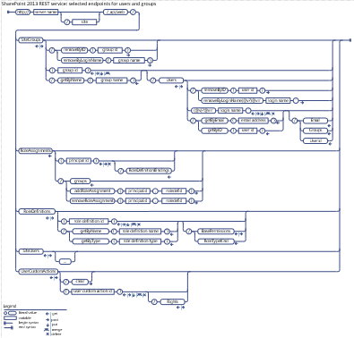

# Users, groups, and roles REST API reference
Learn about the REST API for the  **User**,  **Group**,  **RoleAssigment**,  **RoleDefinition**,  **UserCustomAction** and related resources.
 

 **Last modified:** September 17, 2015
 

 * **Applies to:** apps for SharePoint | SharePoint Foundation 2013 | SharePoint Online | SharePoint Server 2013* 
 

## About the request examples in this article
<a name="bk_AboutExamples"> </a>

The request examples in this article assume that you're using the cross-domain library (SP.RequestExecutor.js) to make cross-domain requests, so they use  **SP.AppContextSite** in the endpoint URI. See [Access SharePoint 2013 data from add-ins using the cross-domain library](http://msdn.microsoft.com/library/access-sharepoint-2013-data-from-add-ins-using-the-cross-domain-library%28Office.15%29.aspx) for more information.
 

 
Before you use a request example, do the following:
 

 

- Change  _<app web url>_,  _<host web url>_, and other placeholder data such as any IDs, names, or paths of SharePoint entities.
    
 
- If you're not using the cross-domain library, include an  **X-RequestDigest** header to send the form digest value in all POST requests and a **content-length** header for POST requests that send data in the request body.
    
 
- If you're not making cross-domain requests, remove  `SP.AppContextSite(@target)` and `?@target='<host web url>'` from the endpoint URI.
    
 
- If you're using OAuth, include an  **Authorization** header ( `"Authorization": "Bearer " + <access token>`) to send the OAuth access token.
    
 
- Remove the line breaks from the  **url** and **body** property values in the request examples. Line breaks are added to the examples to make them easier to read.
    
 
- If you want the server to return responses in Atom format, remove the  `"accept": "application/json; odata=verbose"` header.
    
 
See  [Additional resources](lists-and-list-items-rest-api-reference.md#bk_AdditionalResources) for links to more information about using the cross-domain library, OAuth, and the SharePoint REST service. See [How REST requests differ by environment](http://msdn.microsoft.com/library/complete-basic-operations-using-sharepoint-2013-rest-endpoints%28Office.15%29.aspx#bk_HowRequestsDiffer) and [Properties used in REST requests](http://msdn.microsoft.com/library/complete-basic-operations-using-sharepoint-2013-rest-endpoints%28Office.15%29.aspx#bk_requestElements) for information about request formats.
 

 

 **Tip**  The SharePoint Online REST service supports combining multiple requests into a single call to the service by using the OData  `$batch` query option. For details and links to code samples, see [Make batch requests with the REST APIs](http://msdn.microsoft.com/library/make-batch-requests-with-the-rest-apis%28Office.15%29.aspx). This option is not yet supported for on-premise SharePoint.
 


## Explore the SharePoint 2013 users and groups REST syntax
<a name="bk_AboutExamples"> </a>


|||
|:-----|:-----|
| [ ](http://go.microsoft.com/fwlink/?LinkId=331059)| [Visually explore](http://go.microsoft.com/fwlink/?LinkId=331059) the SharePoint 2013 users and groups REST syntax.Explore other SharePoint REST syntax diagrams: [Files and folders](http://go.microsoft.com/fwlink/?LinkId=331057) | [Lists and list items](http://go.microsoft.com/fwlink/?LinkId=331058)Download the combined  [PDF](http://www.microsoft.com/en-us/download/details.aspx?id=41147) of all the SharePoint REST syntax diagrams.|

## Group resource
<a name="bk_Group"> </a>

Represents a collection of users in a SharePoint site. A group is a type of  **SP.Principal**.
 

 
 [Endpoint URI](users-groups-and-roles-rest-api-reference.md#bk_GroupEndpoint) | [Properties](users-groups-and-roles-rest-api-reference.md#bk_GroupProperties) | [OData representation](users-groups-and-roles-rest-api-reference.md#bk_GroupOData)
 

 

### Endpoint URI
<a name="bk_GroupEndpoint"> </a>

http:// _<site url>_/_api/web/sitegroups( _<group id>_)
 

 

#### Supported HTTP methods

GET | POST | MERGE | PUT
 

 

#### Request examples
<a name="bk_GroupRequestExamples"> </a>

 **GET request example:** Get a group
 

 

```
executor.executeAsync({
  url: "<app web url>/_api/SP.AppContextSite(@target)/web
    /sitegroups(5)
    ?@target='<host web url>'",
  method: "GET",
  headers: { "accept": "application/json; odata=verbose" },
  success: successHandler,
  error: errorHandler
});
```

You can also get a group by  **LoginName**. See the  [GetByName method](users-groups-and-roles-rest-api-reference.md#bk_GroupCollectionGetByName).
 

 
 **MERGE request example:** Change a group
 

 


```
executor.executeAsync({
  url: "<app web url>/_api/SP.AppContextSite(@target)/web
    /sitegroups(5)
    ?@target='<host web url>'",
  method: "POST",
  body: "{ '__metadata':{ 'type': 'SP.Group' }, 'Description':'New description of the group' }",
  headers: {
    "content-type": "application/json; odata=verbose",
    "X-HTTP-Method": "MERGE"
  },
  success: successHandler,
  error: errorHandler
});
```

To add a user to a group, add the user to the group's user collection, as shown in the  [UserCollection request examples](users-groups-and-roles-rest-api-reference.md#bk_UserCollectionRequestExamples). To remove a user from a group, use the  [RemoveById method](users-groups-and-roles-rest-api-reference.md#bk_UserCollectionRemoveById) or [RemoveByLoginName method](users-groups-and-roles-rest-api-reference.md#bk_UserCollectionRemoveByLoginName) from the [UserCollection](users-groups-and-roles-rest-api-reference.md#bk_UserCollection) resource.
 

 
 **PUT request example:** Replace a group
 

 


```
executor.executeAsync({
  url: "<app web url>/_api/SP.AppContextSite(@target)/web
    /sitegroups(30)
    ?@target='<host web url>'",
  method: "POST",
  body: "{ '__metadata':{ 'type': 'SP.Group' }, 'Title':'Training',
    'Description':'Description of new group', 'AllowMembersEditMembership':'false',
    'AllowRequestToJoinLeave':'false', 'AutoAcceptRequestToJoinLeave':'false',
    'OnlyAllowMembersViewMembership':'true', 'RequestToJoinLeaveEmailSetting':'true' }",
  headers: {
    "content-type": "application/json; odata=verbose",
    "X-HTTP-Method": "PUT"
  },
  success: successHandler,
  error: errorHandler
});
```

Use the  [RemoveById method](users-groups-and-roles-rest-api-reference.md#bk_GroupCollectionRemoveById) or the [RemoveByLoginName method](users-groups-and-roles-rest-api-reference.md#bk_GroupCollectionRemoveByLoginName) to delete a group. To create a group, send a POST request to the [GroupCollection](users-groups-and-roles-rest-api-reference.md#bk_GroupCollection) resource. See [GroupCollection request examples](users-groups-and-roles-rest-api-reference.md#bk_GroupCollectionRequestExamples) for an example.
 

 

### Group properties
<a name="bk_GroupProperties"> </a>

To get a property, send a  **GET** request to the property endpoint, as shown in the following example.
 

 

```
executor.executeAsync({
  url: "<app web url>/_api/SP.AppContextSite(@target)/web
    /sitegroups(5)/<property name>
    ?@target='<host web url>'",
  method: "GET",
  headers: { "accept": "application/json; odata=verbose" },
  success: successHandler,
  error: errorHandler
});
```


|**Property**|**Type**|**R/W**|** [Returned with resource](http://msdn.microsoft.com/library/complete-basic-operations-using-sharepoint-2013-rest-endpoints%28Office.15%29.aspx#NavigationProperties)**|**Description**|
|:-----|:-----|:-----|:-----|:-----|
|AllowMembersEditMembership|**Boolean**|RW|Yes|Gets or sets a value that indicates whether the group members can edit membership in the group.|
|AllowRequestToJoinLeave|**Boolean**|RW|Yes|Gets or sets a value that indicates whether to allow users to request membership in the group and request to leave the group.|
|AutoAcceptRequestToJoinLeave|**Boolean**|RW|No|Gets or sets a value that indicates whether the request to join or leave the group can be accepted automatically.|
|CanCurrentUserEditMembership|**Boolean**|R|No|Gets a value that indicates whether the current user can edit the membership of the group.|
|CanCurrentUserManageGroup|**Boolean**|R|No|Gets a value that indicates whether the current user can manage the group.|
|CanCurrentUserViewMembership|**Boolean**|R|No|Gets a value that indicates whether the current user can view the membership of the group.|
|Description|**String**|RW|Yes|Gets or sets the description of the group.|
|Id|**Int32**|R|Yes|Gets a value that specifies the member identifier for the user or group.|
|IsHiddenInUI|**Boolean**|R|Yes|Gets a value that indicates whether this member should be hidden in the UI.|
|LoginName|**String**|R|Yes|Gets the name of the group.|
|OnlyAllowMembersViewMembership|**Boolean**|RW|Yes|Gets or sets a value that indicates whether only group members are allowed to view the membership of the group.|
|Owner|**SP.Principal**|RW|No|Gets or sets the owner of the group which can be a user or another group assigned permissions to control security.|
|OwnerTitle|**String**|R|Yes|Gets the name for the owner of this group.|
|RequestToJoinLeaveEmailSetting|**String**|RW|Yes|Gets or sets the email address to which the requests of the membership are sent.|
|PrincipalType|**Int32**|R|Yes|Gets a value containing the type of the principal. Represents a bitwise  **SP.PrincipalType** value: None = 0; User = 1; DistributionList = 2; SecurityGroup = 4; SharePointGroup = 8; All = 15.|
|Title|**String**|RW|Yes|Gets or sets a value that specifies the name of the principal.|
|Users| [SP.UserCollection](users-groups-and-roles-rest-api-reference.md#bk_UserCollection)|R|No|Gets a collection of user objects that represents all of the users in the group.|

### OData representation
<a name="bk_GroupOData"> </a>

The following example represents a  [Group](users-groups-and-roles-rest-api-reference.md#bk_Group) resource in JSON format.
 

 

```
{"d":{
  "__metadata":{,
    "id":"https://<site url>/_api/Web/SiteGroups/GetById(5)",
    "uri":"https://<site url>/_api/Web/SiteGroups/GetById(5)",
   "type":"SP.Group"
  },
  "Owner":{"__deferred":{"uri":"https://<site url>/_api/Web/SiteGroups/GetById(5)/Owner"}},
  "Users":{"__deferred":{"uri":"https://<site url>/_api/Web/SiteGroups/GetById(5)/Users"}},
  "Id":5,
  "IsHiddenInUI":false,
  "LoginName":"Members",
  "Title":"Members",
  "PrincipalType":8,
  "AllowMembersEditMembership":false,
  "AllowRequestToJoinLeave":false,
  "AutoAcceptRequestToJoinLeave":false,
  "Description":"Use this group to grant people contribute permissions to the SharePoint site: ",
  "OnlyAllowMembersViewMembership":false,
  "OwnerTitle":"Owners",
  "RequestToJoinLeaveEmailSetting":""
}}
```


## GroupCollection resource
<a name="bk_GroupCollection"> </a>

Represents a collection of  [Group](users-groups-and-roles-rest-api-reference.md#bk_Group) resources.
 

 
 [Endpoint URI](users-groups-and-roles-rest-api-reference.md#bk_GroupCollectionEndpoint) | [Methods](users-groups-and-roles-rest-api-reference.md#bk_GroupCollectionMethods) | [OData representation](users-groups-and-roles-rest-api-reference.md#bk_GroupCollectionOData)
 

 

### Endpoint URI
<a name="bk_GroupCollectionEndpoint"> </a>

http:// _<site url>_/_api/web/sitegroups
 

 

#### Supported HTTP methods

GET | POST
 

 

#### Request examples
<a name="bk_GroupCollectionRequestExamples"> </a>

 **GET request example:** Get the groups at the root site
 

 

```
executor.executeAsync({
  url: "<app web url>/_api/SP.AppContextSite(@target)/web
    /sitegroups
    ?@target='<host web url>'",
  method: "GET",
  headers: { "accept": "application/json; odata=verbose" },
  success: successHandler,
  error: errorHandler
});
```

 **GET request example:** Get a group
 

 


```
executor.executeAsync({
  url: "<app web url>/_api/SP.AppContextSite(@target)/web
    /sitegroups(5)
    ?@target='<host web url>'",
  method: "GET",
  headers: { "accept": "application/json; odata=verbose" },
  success: successHandler,
  error: errorHandler
});
```

You can also get a group by  **LoginName**. See the  [GetByName method](users-groups-and-roles-rest-api-reference.md#bk_GroupCollectionGetByName).
 

 
 **POST request example:** Create a group
 

 


```
executor.executeAsync({
  url: "<app web url>/_api/SP.AppContextSite(@target)/web
    /sitegroups
    ?@target='<host web url>'",
  method: "POST",
  body: "{ '__metadata':{ 'type': 'SP.Group' }, 'Title':'New Group' }",
  headers: { "content-type": "application/json; odata=verbose" },
  success: successHandler,
  error: errorHandler
});
```

See  [Group request examples](users-groups-and-roles-rest-api-reference.md#bk_GroupRequestExamples) for examples of how to change a group.
 

 

### GroupCollection methods
<a name="bk_GroupCollectionMethods"> </a>

 [GetById](users-groups-and-roles-rest-api-reference.md#bk_GroupCollectionGetById)
 
 [GetByName](users-groups-and-roles-rest-api-reference.md#bk_GroupCollectionGetByName)
 
 [RemoveById](users-groups-and-roles-rest-api-reference.md#bk_GroupCollectionRemoveById)
 
 [RemoveByLoginName](users-groups-and-roles-rest-api-reference.md#bk_GroupCollectionRemoveByLoginName)
 

 

#### GetById method
<a name="bk_GroupCollectionGetById"> </a>

Returns a group from the collection based on the member ID of the group.
 

 

|||
|:-----|:-----|
|**Endpoint**|/getbyid( _<group id>_)|
|**HTTP method**|GET|
|**Parameters**|Type:  **Int32** The ID of the group to get.|
|**Response**|Type:  [SP.Group](users-groups-and-roles-rest-api-reference.md#bk_Group) The specified group.|

 
 **Request example**
 

 


```
executor.executeAsync({
  url: "<app web url>/_api/SP.AppContextSite(@target)/web/sitegroups
    /getbyid(5)
    ?@target='<host web url>'",
  method: "GET",
  headers: { "accept": "application/json; odata=verbose" },
  success: successHandler,
  error: errorHandler
});
```

Or you can just specify the group ID on the  **GroupCollection** resource. Example: `…/_api/web/sitegroups(5)`
 

 

#### GetByName method
<a name="bk_GroupCollectionGetByName"> </a>

Returns a cross-site group from the collection based on the name of the group.
 

 

|||
|:-----|:-----|
|**Endpoint**|/getbyname(' _<group name>_')|
|**HTTP method**|GET|
|**Parameters**|Type:  **String** The name of the group. The group name is specified in its  **LoginName** property.|
|**Response**|Type:  [SP.Group](users-groups-and-roles-rest-api-reference.md#bk_Group) The specified group.|

 
 **Request example**
 

 


```
executor.executeAsync({
  url: "<app web url>/_api/SP.AppContextSite(@target)/web/sitegroups
    /getbyname('content site owners')
    ?@target='<host web url>'",
  method: "GET",
  headers: { "accept": "application/json; odata=verbose" },
  success: successHandler,
  error: errorHandler
});
```


#### RemoveById method
<a name="bk_GroupCollectionRemoveById"> </a>

Removes the group with the specified member ID from the collection.
 

 

|||
|:-----|:-----|
|**Endpoint**|/removebyid( _<group id>_)|
|**HTTP method**|POST|
|**Parameters**|Type:  **Int32** The ID of the group to remove.|
|**Response**|None|

 
 **Request example**
 

 


```
executor.executeAsync({
  url: "<app web url>/_api/SP.AppContextSite(@target)/web/sitegroups
    /removebyid(17)
    ?@target='<host web url>'",
  method: "POST",
  success: successHandler,
  error: errorHandler
});
```


#### RemoveByLoginName method
<a name="bk_GroupCollectionRemoveByLoginName"> </a>

Removes the cross-site group with the specified name from the collection.
 

 

|||
|:-----|:-----|
|**Endpoint**|/removebyloginname(' _<group name>_')|
|**HTTP method**|POST|
|**Parameters**|Type:  **String** The name of the group to remove. The group name is specified in its  **LoginName** property.|
|**Response**|None|

 
 **Request example**
 

 


```
executor.executeAsync({
  url: "<app web url>/_api/SP.AppContextSite(@target)/web/sitegroups
    /removebyloginname('training')
    ?@target='<host web url>'",
  method: "POST",
  success: successHandler,
  error: errorHandler
});
```


### OData representation
<a name="bk_GroupCollectionOData"> </a>

The following example represents a  [GroupCollection](users-groups-and-roles-rest-api-reference.md#bk_GroupCollection) resource in JSON format.
 

 

```
{"d":{
  "results":[{
    "__metadata":{
      "id":"https://<site url>/_api/Web/SiteGroups/GetById(7)",
      "uri":"https://<site url>/_api/Web/SiteGroups/GetById(7)",
      "type":"SP.Group"
    },
    "Owner":{"__deferred":{"uri":"https://<site url>/_api/Web/SiteGroups/GetById(7)/Owner"}},
    "Users":{"__deferred":{"uri":"https://<site url>/_api/Web/SiteGroups/GetById(7)/Users"}},
    "Id":7,
    "IsHiddenInUI":false,
    "LoginName":"Excel Services Viewers",
    "Title":"Excel Services Viewers",
    "PrincipalType":8,
    "AllowMembersEditMembership":false,
    "AllowRequestToJoinLeave":false,
    "AutoAcceptRequestToJoinLeave":false,
    "Description":"Members of this group can view pages, list items, and documents. If the document has a server rendering available, they can only view the document using the server rendering.",
    "OnlyAllowMembersViewMembership":true,
    "OwnerTitle":"Owners",
    "RequestToJoinLeaveEmailSetting":null
    },{
    "__metadata":{
      "id":"https://<site url>/_api/Web/SiteGroups/GetById(5)",
      "uri":"https://<site url>/_api/Web/SiteGroups/GetById(5)",
      "type":"SP.Group"
    },
    "Owner":{"__deferred":{"uri":"https://<site url>/_api/Web/SiteGroups/GetById(5)/Owner"}},
    "Users":{"__deferred":{"uri":"https://<site url>/_api/Web/SiteGroups/GetById(5)/Users"}},
    "Id":5,
    "IsHiddenInUI":false,
    "LoginName":"Members",
    "Title":"Members",
    "PrincipalType":8,
    "AllowMembersEditMembership":false,
    "AllowRequestToJoinLeave":false,
    "AutoAcceptRequestToJoinLeave":false,
    "Description":"Use this group to grant people contribute permissions to the SharePoint site: ",
    "OnlyAllowMembersViewMembership":false,
    "OwnerTitle":"Owners",
    "RequestToJoinLeaveEmailSetting":""
    },
    ...
  }]
}}
```


## RoleAssignment resource
<a name="bk_RoleAssignment"> </a>

Defines the securable object role assignments for a user or group on the Web site, list, or list item.
 

 
 [Endpoint URI](users-groups-and-roles-rest-api-reference.md#bk_RoleAssignmentEndpoint) | [Properties](users-groups-and-roles-rest-api-reference.md#bk_RoleAssignmentProperties) | [Methods](users-groups-and-roles-rest-api-reference.md#bk_RoleAssignmentMethods) | [OData representation](users-groups-and-roles-rest-api-reference.md#bk_RoleAssignmentOData)
 

 

### Endpoint URI
<a name="bk_RoleAssignmentEndpoint"> </a>

http:// _<site url>_/_api/web/roleassignments( _<principal id>_)
 

 

#### Supported HTTP methods

GET | POST | DELETE
 

 

#### Request examples
<a name="bk_RoleAssignmentRequestExamples"> </a>

 **GET request example:** Get a role assignment
 

 

```
executor.executeAsync({
  url: "<app web url>/_api/SP.AppContextSite(@target)/web/roleassignments(3)
    ?@target='<host web url>'",
  method: "GET",
  headers: { "accept": "application/json; odata=verbose" },
  success: successHandler,
  error: errorHandler
});
```

 **DELETE request example:** Delete a role assignment
 

 


```
executor.executeAsync({
  url: "<app web url>/_api/SP.AppContextSite(@target)/web/roleassignments(3)
    ?@target='<host web url>'",
  method: "POST",
  headers: { "X-HTTP-Method": "DELETE" },
  success: successHandler,
  error: errorHandler
});
```

Or you can use the  [RemoveRoleAssignment method](users-groups-and-roles-rest-api-reference.md#bk_RoleAssignmentCollectionRemoveRoleAssignment) to remove a role assignment. To create a role assignment, use the [AddRoleAssignment method](users-groups-and-roles-rest-api-reference.md#bk_RoleAssignmentCollectionAddRoleAssignment).
 

 

### RoleAssignment properties
<a name="bk_RoleAssignmentProperties"> </a>

To get a property, send a  **GET** request to the property endpoint, as shown in the following example.
 

 

```
executor.executeAsync({
  url: "<app web url>/_api/SP.AppContextSite(@target)/web
    /roleassignments(3)/<property name>
    ?@target='<host web url>'",
  method: "GET",
  headers: { "accept": "application/json; odata=verbose" },
  success: successHandler,
  error: errorHandler
});
```


|**Property**|**Type**|**R/W**|** [Returned with resource](http://msdn.microsoft.com/library/complete-basic-operations-using-sharepoint-2013-rest-endpoints%28Office.15%29.aspx#NavigationProperties)**|**Description**|
|:-----|:-----|:-----|:-----|:-----|
|Member|**SP.Principal**|R|No|Gets the user or group that corresponds to the Role Assignment.|
|PrincipalId|**Int32**|R|Yes|The unique identifier of the role assignment.|
|RoleDefinitionBindings| [SP.RoleDefinitionCollection](users-groups-and-roles-rest-api-reference.md#bk_RoleDefinitionBindingCollection)|R|No|Gets the collection of role definition bindings for the role assignment.|

### RoleAssignment methods
<a name="bk_RoleAssignmentMethods"> </a>

 [DeleteObject](users-groups-and-roles-rest-api-reference.md#bk_RoleAssignmentDeleteObject)
 

 

#### DeleteObject method
<a name="bk_RoleAssignmentDeleteObject"> </a>

The recommended way to delete a role assignment is to use the  [RemoveRoleAssignment method](users-groups-and-roles-rest-api-reference.md#bk_RoleAssignmentCollectionRemoveRoleAssignment) or to send a **DELETE** request to the **RoleAssignment** resource endpoint, as shown in [RoleAssignment request examples](users-groups-and-roles-rest-api-reference.md#bk_RoleAssignmentRequestExamples).
 

 

### OData representation
<a name="bk_RoleAssignmentOData"> </a>

The following example represents a  [RoleAssignment](users-groups-and-roles-rest-api-reference.md#bk_RoleAssignment) resource in JSON format.
 

 

```
{"d":{
  "__metadata":{,
    "id":"https://<site url>/_api/Web/RoleAssignments/GetByPrincipalId(3)",
    "uri":"https://<site url>/_api/Web/RoleAssignments/GetByPrincipalId(3)",
    "type":"SP.RoleAssignment"
  },
  "Member":{"__deferred":{"uri":"https://<site url>/_api/Web/RoleAssignments/GetByPrincipalId(3)/Member"}},
  "RoleDefinitionBindings":{"__deferred":{"uri":"https://<site url>/_api/Web/RoleAssignments/GetByPrincipalId(3)/RoleDefinitionBindings"}},
  "PrincipalId":3
}}
```


## RoleAssignmentCollection resource
<a name="bk_RoleAssignmentCollection"> </a>

Represents a collection of  [RoleAssignment](users-groups-and-roles-rest-api-reference.md#bk_RoleAssignment) resources.
 

 
 [Endpoint URI](users-groups-and-roles-rest-api-reference.md#bk_RoleAssignmentCollectionEndpoint) | [Properties](users-groups-and-roles-rest-api-reference.md#bk_RoleAssignmentCollectionProperties) | [Methods](users-groups-and-roles-rest-api-reference.md#bk_RoleAssignmentCollectionMethods) | [OData representation](users-groups-and-roles-rest-api-reference.md#bk_RoleAssignmentCollectionOData)
 

 

### Endpoint URI
<a name="bk_RoleAssignmentCollectionEndpoint"> </a>

http:// _<site url>_/_api/web/roleassignments
 

 

#### Supported HTTP methods

GET | POST
 

 

#### Request examples
<a name="bk_RoleAssignmentCollectionRequestExamples"> </a>

 **GET request example:** Get a role assignment
 

 

```
executor.executeAsync({
  url: "<app web url>/_api/SP.AppContextSite(@target)/web/roleassignments(3)
    ?@target='<host web url>'",
  method: "GET",
  headers: { "accept": "application/json; odata=verbose" },
  success: successHandler,
  error: errorHandler
});
```

Use the  [AddRoleAssignment method](users-groups-and-roles-rest-api-reference.md#bk_RoleAssignmentCollectionAddRoleAssignment) to create a role assignment. To delete a role assignment, use the [RemoveRoleAssignment method](users-groups-and-roles-rest-api-reference.md#bk_RoleAssignmentCollectionRemoveRoleAssignment) or send a **DELETE** request to the **RoleAssignment** resource endpoint, as shown in [RoleAssignment request examples](files-and-folders-rest-api-reference.md#bk_RoleDefinitionRequestExamples).
 

 

### RoleAssignmentCollection properties
<a name="bk_RoleAssignmentCollectionProperties"> </a>

To get a property, send a  **GET** request to the property endpoint, as shown in the following example.
 

 

```
executor.executeAsync({
  url: "<app web url>/_api/SP.AppContextSite(@target)/web/roleassignments(3)/groups
    ?@target='<host web url>'",
  method: "GET",
  headers: { "accept": "application/json; odata=verbose" },
  success: successHandler,
  error: errorHandler
});
```


|**Property**|**Type**|**R/W**|** [Returned with resource](http://msdn.microsoft.com/library/complete-basic-operations-using-sharepoint-2013-rest-endpoints%28Office.15%29.aspx#NavigationProperties)**|**Description**|
|:-----|:-----|:-----|:-----|:-----|
|Groups| [SP.GroupCollection](users-groups-and-roles-rest-api-reference.md#bk_GroupCollection)|R|No|Gets the groups that directly belong to the access control list (ACL) for this securable object.|

### RoleAssignmentCollection methods
<a name="bk_RoleAssignmentCollectionMethods"> </a>

 [AddRoleAssignment](users-groups-and-roles-rest-api-reference.md#bk_RoleAssignmentCollectionAddRoleAssignment)
 
 [GetByPrincipalId](users-groups-and-roles-rest-api-reference.md#bk_RoleAssignmentCollectionGetByPrincipalId)
 
 [RemoveRoleAssignment](users-groups-and-roles-rest-api-reference.md#bk_RoleAssignmentCollectionRemoveRoleAssignment)
 

 

#### AddRoleAssignment method
<a name="bk_RoleAssignmentCollectionAddRoleAssignment"> </a>

Adds a new role assignment with the specified principal and role definitions to the collection.
 

 

|||
|:-----|:-----|
|**Endpoint**|/addroleassignment( _principalid_,  _roledefid_)|
|**Parameters**| principalidType: Int32The ID of the user or group to assign permissions to.roledefidType: Int32The ID of the role definition that defines the permissions to assign.See RoleDefinitionCollection request examples for an example of how to create a role definition. |
|**HTTP method**|POST|
|**Response**|None|

 
 **Request example**
 

 


```
executor.executeAsync({
  url: "<app web url>/_api/SP.AppContextSite(@target)/web/roleassignments
    /addroleassignment(principalid=21, roledefid=1073741827)
    ?@target='<host web url>'",
  method: "POST",
  success: successHandler,
  error: errorHandler
});
```

To use this method on an object that inherits permissions, you first have to call the  **BreakRoleInheritance** method on the object. See [Set custom permissions on a list by using the REST interface](http://msdn.microsoft.com/library/set-custom-permissions-on-a-list-by-using-the-rest-interface%28Office.15%29.aspx).
 

 

#### GetByPrincipalId method
<a name="bk_RoleAssignmentCollectionGetByPrincipalId"> </a>

Gets the role assignment associated with the specified principal ID from the collection.
 

 

|||
|:-----|:-----|
|**Endpoint**|/getbyprincipalid( _<prinicipal id>_)|
|**Parameters**|Type:  **Int32** The  **PrincipalId** of the role assignment to get.|
|**HTTP method**|GET|
|**Response**|Type:  [SP.RoleAssignment](users-groups-and-roles-rest-api-reference.md#bk_RoleAssignment) The specified role assignment.|

 
 **Request example**
 

 


```
executor.executeAsync({
  url: "<app web url>/_api/SP.AppContextSite(@target)/web/roleassignments
    /getbyprincipalid(3)
    ?@target='<host web url>'",
  method: "GET",
  headers: { "accept": "application/json; odata=verbose" },
  success: successHandler,
  error: errorHandler
});
```

Or you can just specify the principal ID of the role assignment on the  [RoleAssignmentCollection](users-groups-and-roles-rest-api-reference.md#bk_RoleAssignmentCollection) resource. Example: `…/_api/web/roleassignments(3)`
 

 

#### RemoveRoleAssignment method
<a name="bk_RoleAssignmentCollectionRemoveRoleAssignment"> </a>

Removes the role assignment with the specified principal and role definition from the collection.
 

 

|||
|:-----|:-----|
|**Endpoint**|/removeroleassignment( _principalid_,  _roledefid_)|
|**Parameters**| principalidType: Int32The ID of the user or group in the role assignment.roledefidType: Int32The ID of the role definition in the role assignment. |
|**HTTP method**|POST|
|**Response**|None|

 
 **Request example**
 

 


```
executor.executeAsync({
  url: "<app web url>/_api/SP.AppContextSite(@target)/web/roleassignments
    /removeroleassignment(principalid=21, roledefid=1073741827)
    ?@target='<host web url>'",
  method: "POST",
  headers: { "accept": "application/json; odata=verbose" },
  success: successHandler,
  error: errorHandler
});
```


### OData representation
<a name="bk_RoleAssignmentCollectionOData"> </a>

The following example represents a  [RoleAssignmentCollection](users-groups-and-roles-rest-api-reference.md#bk_RoleAssignmentCollection) resource in JSON format.
 

 

```
{"d":{
  "results":[{
    "__metadata":{
      "id":"http://<site url>/_api/Web/RoleAssignments/GetByPrincipalId(1)",
      "uri":"http://<site url>/_api/Web/RoleAssignments/GetByPrincipalId(1)",
      "type":"SP.RoleAssignment"
    },
    "Member":{"__deferred":{"uri":"http://<site url>/_api/Web/RoleAssignments/GetByPrincipalId(1)/Member"}},
    "RoleDefinitionBindings":{"__deferred":{"uri":"http://<site url>/_api/Web/RoleAssignments/GetByPrincipalId(1)/RoleDefinitionBindings"}},
    "PrincipalId":1
    },{
    "__metadata":{
      "id":"http://<site url>/_api/Web/RoleAssignments/GetByPrincipalId(3)",
      "uri":"http://<site url>/_api/Web/RoleAssignments/GetByPrincipalId(3)",
      "type":"SP.RoleAssignment"
    },
    "Member":{"__deferred":{"uri":"http://<site url>/_api/Web/RoleAssignments/GetByPrincipalId(3)/Member"}},
    "RoleDefinitionBindings":{"__deferred":{"uri":"http://<site url>/_api/Web/RoleAssignments/GetByPrincipalId(3)/RoleDefinitionBindings"}},
    "PrincipalId":3
    },{
    ...
  }]
}}
```


## RoleDefinition resource
<a name="bk_RoleDefinition"> </a>

Defines a single role definition, including a name, description, and set of rights.
 

 
 [Endpoint URI](users-groups-and-roles-rest-api-reference.md#bk_RoleDefinitionEndpoint) | [Properties](users-groups-and-roles-rest-api-reference.md#bk_RoleDefinitionProperties) | [Methods](users-groups-and-roles-rest-api-reference.md#bk_RoleDefinitionMethods) | [OData representation](users-groups-and-roles-rest-api-reference.md#bk_RoleDefinitionOData)
 

 

### Endpoint URI
<a name="bk_RoleDefinitionEndpoint"> </a>

http:// _<site url>_/_api/web/roledefinitions( _<role definition id>_)
 

 

#### Supported HTTP methods

GET | POST | DELETE | MERGE | PUT
 

 

#### Request examples
<a name="bk_RoleDefinitionRequestExamples"> </a>

 **GET request example:** Get a role definition
 

 

```
executor.executeAsync({
  url: "<app web url>/_api/SP.AppContextSite(@target)/web/roledefinitions(1073741829)
    ?@target='<host web url>'",
  method: "GET",
  headers: { "accept": "application/json; odata=verbose" },
  success: successHandler,
  error: errorHandler
});
```

 **MERGE request example:** Change a role definition
 

 


```
executor.executeAsync({
  url: "<app web url>/_api/SP.AppContextSite(@target)/web/roledefinitions(1073741928)
    ?@target='<host web url>'",
  method: "POST",
  body: "{ '__metadata': { 'type': 'SP.RoleDefinition' }, 'BasePermissions':
    { '__metadata': { 'type': 'SP.BasePermissions' }, 'High': '48' } }",
  headers: {
    "content-type": "application/json; odata=verbose",
    "X-HTTP-Method": "MERGE"
  },
  success: successHandler,
  error: errorHandler
});
```

 **PUT request example:** Replace a role definition
 

 


```
executor.executeAsync({
  url: "<app web url>/_api/SP.AppContextSite(@target)/web/roledefinitions(1073741928)
    ?@target='<host web url>'",
  method: "POST",
  body: "{ '__metadata': { 'type': 'SP.RoleDefinition' }, 'BasePermissions':
    { '__metadata': { 'type': 'SP.BasePermissions' }, 'High': '48' }, 
   'Description': 'New description', 'Name': 'New name', 'Order': 170 }",
  headers: {
    "content-type": "application/json; odata=verbose",
    "X-HTTP-Method": "PUT"
  },
  success: successHandler,
  error: errorHandler
});
```

 **DELETE request example:** Delete a role definition
 

 


```
executor.executeAsync({
  url: "<app web url>/_api/SP.AppContextSite(@target)/web/roledefinitions(1073741928)
    ?@target='<host web url>'",
  method: "POST",
  headers: { "X-HTTP-Method": "DELETE" },
  success: successHandler,
  error: errorHandler
});
```

See  [RoleDefinitionCollection request examples](users-groups-and-roles-rest-api-reference.md#bk_RoleDefinitionCollectionRequestExamples) for an example that shows how to create a role definition.
 

 

### RoleDefinition properties
<a name="bk_RoleDefinitionProperties"> </a>

To get a property, send a  **GET** request to the property endpoint, as shown in the following example.
 

 

```
executor.executeAsync({
  url: "<app web url>/_api/SP.AppContextSite(@target)/web
    /roledefinitions(1073741829)/<property name>
    ?@target='<host web url>'",
  method: "GET",
  headers: { "accept": "application/json; odata=verbose" },
  success: successHandler,
  error: errorHandler
});
```


|**Property**|**Type**|**R/W**|** [Returned with resource](http://msdn.microsoft.com/library/complete-basic-operations-using-sharepoint-2013-rest-endpoints%28Office.15%29.aspx#NavigationProperties)**|**Description**|
|:-----|:-----|:-----|:-----|:-----|
|BasePermissions| [SP.BasePermissions](users-groups-and-roles-rest-api-reference.md#bk_BasePermissions)|RW|Yes|Gets or sets a value that specifies the base permissions for the role definition.|
|Description|**String**|RW|Yes|Gets or sets a value that specifies the description of the role definition.|
|Hidden|**Boolean**|R|Yes|Gets a value that specifies whether the role definition is displayed.|
|Id|**Int32**|R|Yes|Gets a value that specifies the Id of the role definition.|
|Name|**String**|RW|Yes|Gets or sets a value that specifies the role definition name.|
|Order|**Int32**|RW|Yes|Gets or sets a value that specifies the order position of the object in the site collection Permission Levels page.|
|RoleTypeKind|**Int32**|R|Yes|Gets a value that specifies the type of the role definition. Represents an  **SP.RoleType** value. See **RoleType** in the .NET client object model reference for a list of role type values.|

### RoleDefinition methods
<a name="bk_RoleDefinitionMethods"> </a>

 [DeleteObject](users-groups-and-roles-rest-api-reference.md#bk_RoleDefinitionDeleteObject)
 

 

#### DeleteObject method
<a name="bk_RoleDefinitionDeleteObject"> </a>

The recommended way to delete a role definition is to send a  **DELETE** request to the **RoleDefinition** resource endpoint, as shown in [RoleDefinition request examples](users-groups-and-roles-rest-api-reference.md#bk_RoleDefinitionRequestExamples).
 

 

### OData representation
<a name="bk_RoleDefinitionOData"> </a>

The following example represents a  [RoleDefinition](users-groups-and-roles-rest-api-reference.md#bk_RoleDefinition) resource in JSON format.
 

 

```
{"d":{
  "__metadata":{,
    "id":"https://<site url>/_api/Web/RoleDefinitions(1073741829)",
    "uri":"https://<site url>/_api/Web/RoleDefinitions(1073741829)",
    "type":"SP.RoleDefinition"
  },
  "BasePermissions":{"__metadata":{"type":"SP.BasePermissions"}, "High":"2147483647", "Low":"4294967295"},
  "Description":"Has full control.",
  "Hidden":false,
  "Id":1073741829,
  "Name":"Full Control",
  "Order":1,
  "RoleTypeKind":5
}}
```


## RoleDefinitionCollection resource
<a name="bk_RoleDefinitionCollection"> </a>

Represents the collection of  [RoleDefinition](users-groups-and-roles-rest-api-reference.md#bk_RoleDefinition) resources.
 

 
 [Endpoint URI](users-groups-and-roles-rest-api-reference.md#bk_RoleDefinitionCollectionEndpoint) | [Methods](users-groups-and-roles-rest-api-reference.md#bk_RoleDefinitionCollectionMethods) | [OData representation](users-groups-and-roles-rest-api-reference.md#bk_RoleDefinitionCollectionOData)
 

 

### Endpoint URI
<a name="bk_RoleDefinitionCollectionEndpoint"> </a>

http:// _<site url>_/_api/web/roledefinitions
 

 

#### Supported HTTP methods

GET | POST
 

 

#### Request examples
<a name="bk_RoleDefinitionCollectionRequestExamples"> </a>

 **GET request example:** Get a role definition
 

 

```
executor.executeAsync({
  url: "<app web url>/_api/SP.AppContextSite(@target)/web/roledefinitions(1073741829)
    ?@target='<host web url>'",
  method: "GET",
  headers: { "accept": "application/json; odata=verbose" },
  success: successHandler,
  error: errorHandler
});
```

 **POST request example:** Create a role definition
 

 


```
executor.executeAsync({
  url: "<app web url>/_api/SP.AppContextSite(@target)/web/roledefinitions
    ?@target='<host web url>'",
  method: "POST",
  body: "{ '__metadata': { 'type': 'SP.RoleDefinition' }, 'BasePermissions': 
    { '__metadata': { 'type': 'SP.BasePermissions' }, 'High': '176' , 'Low': '138612801' }, 
    'Description': 'New description', 'Name': 'New role', 'Order': 180 }",
  headers: {
    "accept": "application/json; odata=verbose",
    "content-type": "application/json; odata=verbose"
  },
  success: successHandler,
  error: errorHandler
});
```

See  [RoleDefinition request examples](users-groups-and-roles-rest-api-reference.md#bk_RoleDefinitionRequestExamples) for examples of how to change or delete a role definition.
 

 

### RoleDefinitionCollection methods
<a name="bk_RoleDefinitionCollectionMethods"> </a>

 [GetById](users-groups-and-roles-rest-api-reference.md#bk_RoleDefinitionCollectionGetById)
 
 [GetByName](users-groups-and-roles-rest-api-reference.md#bk_RoleDefinitionCollectionGetByName)
 
 [GetByType](users-groups-and-roles-rest-api-reference.md#bk_RoleDefinitionCollectionGetByType)
 

 

#### GetById method
<a name="bk_RoleDefinitionCollectionGetById"> </a>

Gets the role definition with the specified ID from the collection.
 

 

|||
|:-----|:-----|
|**Endpoint**|/getbyid( _<role definition id>_)|
|**Parameters**|Type:  **Int32** The ID of the role definition.|
|**HTTP method**|GET|
|**Response**|Type:  [SP.RoleDefinition](users-groups-and-roles-rest-api-reference.md#bk_RoleDefinitionOData) The specified role definition.|

 
 **Request example**
 

 


```
executor.executeAsync({
  url: "<app web url>/_api/SP.AppContextSite(@target)/web/roledefinitions
    /getbyid(1073741829)
    ?@target='<host web url>'",
  method: "GET",
  headers: { "accept": "application/json; odata=verbose" },
  success: successHandler,
  error: errorHandler
});
```

Or you can just specify the role definition ID on the  **RoleDefinitionCollection** resource. Example: `…/_api/web/roledefinitions(1073741829)`
 

 

#### GetByName method
<a name="bk_RoleDefinitionCollectionGetByName"> </a>

Gets the role definition with the specified name.
 

 

|||
|:-----|:-----|
|**Endpoint**|/getbyname(' _<role definition name>_')|
|**Parameters**|Type:  **String** The name of the role definition.|
|**HTTP method**|GET|
|**Response**|Type:  [SP.RoleDefinition](users-groups-and-roles-rest-api-reference.md#bk_RoleDefinition) The specified role definition.|

 
 **Request example**
 

 


```
executor.executeAsync({
  url: "<app web url>/_api/SP.AppContextSite(@target)/web/roledefinitions
    /getbyname('contribute')
    ?@target='<host web url>'",
  method: "GET",
  headers: { "accept": "application/json; odata=verbose" },
  success: successHandler,
  error: errorHandler
});
```


#### GetByType method
<a name="bk_RoleDefinitionCollectionGetByType"> </a>

Gets the role definition with the specified role type.
 

 

|||
|:-----|:-----|
|**Endpoint**|/getbytype( _<role definition type>_)|
|**Parameters**|Type:  **Int32** The  **RoleTypeKind** of the role definition. See **RoleType** in the .NET client object model reference for a list of role type values.|
|**HTTP method**|GET|
|**Response**|Type:  [SP.RoleDefinition](users-groups-and-roles-rest-api-reference.md#bk_RoleDefinition) The specified role definition.|

 
 **Request example**
 

 


```
executor.executeAsync({
  url: "<app web url>/_api/SP.AppContextSite(@target)/web/roledefinitions
    /getbytype(5)
    ?@target='<host web url>'",
  method: "GET",
  headers: { "accept": "application/json; odata=verbose" },
  success: successHandler,
  error: errorHandler
});
```


### OData representation
<a name="bk_RoleDefinitionCollectionOData"> </a>

The following example represents a  [RoleDefinitionCollection](users-groups-and-roles-rest-api-reference.md#bk_RoleDefinitionCollection) resource in JSON format.
 

 

```
{"d":{
  "results":[{
    "__metadata":{
      "id":"https://<site url>/_api/Web/RoleDefinitions(1073741829)",
      "uri":"https://<site url>/_api/Web/RoleDefinitions(1073741829)",
      "type":"SP.RoleDefinition"
    },{
    "__metadata":{
      "type":"SP.BasePermissions"},
      "High":"2147483647",
      "Low":"4294967295"
    },
    "Description":"Has full control.",
    "Hidden":false,
    "Id":1073741829,
    "Name":"Full Control",
    "Order":1,
    "RoleTypeKind":5
    },{
    ...
  }]
}}
```


## RoleDefinitionBindingCollection resource
<a name="bk_RoleDefinitionBindingCollection"> </a>

Defines the role definitions that are bound to a role assignment object.
 

 
 [Endpoint URI](users-groups-and-roles-rest-api-reference.md#bk_RoleDefinitionBindingCollectionEndpoint) | [OData representation](users-groups-and-roles-rest-api-reference.md#bk_RoleDefinitionBindingCollectionOData)
 

 

### Endpoint URI
<a name="bk_RoleDefinitionBindingCollectionEndpoint"> </a>

http:// _<site url>_/_api/web/roleassignments( _<role assignment id>_)/roledefinitionbindings
 

 

#### Supported HTTP methods

GET
 

 

#### Request examples
<a name="bk_RoleDefinitionBindingCollectionRequestExamples"> </a>

 **GET request example:** Get the role definition bindings for a role assignment
 

 

```
executor.executeAsync({
  url: "<app web url>/_api/SP.AppContextSite(@target)/web/roleassignments(7)
    /roledefinitionbindings
    ?@target='<host web url>'",
  method: "GET",
  headers: { "accept": "application/json; odata=verbose" },
  success: successHandler,
  error: errorHandler});
```

To create a role assignment, which binds a principal (user or group) to a role definition, use the  [AddRoleAssignment method](users-groups-and-roles-rest-api-reference.md#bk_RoleAssignmentCollectionAddRoleAssignment). To delete a role assignment, use the  [RemoveRoleAssignment method](users-groups-and-roles-rest-api-reference.md#bk_RoleAssignmentCollectionRemoveRoleAssignment) or send a **DELETE** request to the [RoleAssignment](users-groups-and-roles-rest-api-reference.md#bk_RoleAssignment) resource endpoint, as shown in [RoleAssignment request examples](users-groups-and-roles-rest-api-reference.md#bk_RoleAssignmentRequestExamples).
 

 

### OData representation
<a name="bk_RoleDefinitionBindingCollectionOData"> </a>

The following example represents a  [RoleDefinitionBindingCollection](users-groups-and-roles-rest-api-reference.md#bk_RoleDefinitionBindingCollection) resource in JSON format.
 

 

```
{"d":{
  "results":[{
    "__metadata":{
      "id":"http://<site url>/_api/Web/RoleDefinitions(1073741829)",
      "uri":"http://<site url>/_api/Web/RoleDefinitions(1073741829)",
      "type":"SP.RoleDefinition"
    },{
    "__metadata":{
      "type":"SP.BasePermissions"},
      "High":"2147483647",
      "Low":"4294967295"
    },
    "Description":"Has full control.",
    "Hidden":false,
    "Id":1073741829,
    "Name":"Full Control",
    "Order":1,
    "RoleTypeKind":5
    },{
    "__metadata":{
      "id":"http://<site url>/_api/Web/RoleDefinitions(1073741827)",
      "uri":"http://<site url>/_api/Web/RoleDefinitions(1073741827)",
      "type":"SP.RoleDefinition"
    },{
    "__metadata":{
      "type":"SP.BasePermissions"},
      "High":"432",
      "Low":"1011028719"
    },
    "Description":"Can view, add, update, and delete list items and documents.",
    "Hidden":false,
    "Id":1073741827,
    "Name":"Contribute",
    "Order":64,
    "RoleTypeKind":3
  }]
}}
```


## User resource
<a name="bk_User"> </a>

Represents a user in Microsoft SharePoint Foundation. A user is a type of  **SP.Principal**.
 

 
 [Endpoint URI](users-groups-and-roles-rest-api-reference.md#bk_UserEndpoint) | [Properties](users-groups-and-roles-rest-api-reference.md#bk_UserProperties) | [OData representation](users-groups-and-roles-rest-api-reference.md#bk_UserOData)
 

 

### Endpoint URI
<a name="bk_UserEndpoint"> </a>

http:// _<site url>_/_api/web/sitegroups( _<group id>_)/users(@v)?@v=' _<login name>_'
 
http:// _<site url>_/_api/web/siteusers(@v)?@v=' _<login name>_'
 

 
The format of the login name for users depends on your SharePoint environment, as described in Table 1:
 

 

**Table 1. Login name formats**


|**SharePoint environment**|**Example login name format**|**How to pass the login name by using an alias in the query string**|
|:-----|:-----|:-----|
|SharePoint Online, or SharePoint 2013 on-premises using forms|i:0#.f|membership| _user_@ _domain_.com|…/users(@v)?@v='i%3A0%23.f%7Cmembership%7C _user_%40 _domain_.onmicrosoft.com'|
|SharePoint 2013 on-premises using Windows claims|i:0#.w| _domain_\ _user_|…/users(@v)?@v='i%3A0%23.w%7C _domain_\ _user_'|
|SharePoint 2013 on-premises using SAML claims|i:05:t|adfs with roles| _user_@ _domain_.com|…/users(@v)?@v='i%3A05%3At%7Cadfs+with+roles%7C _user_%40 _domain_.com'|

 **Note**  The format of the login name in the Security Assertion Markup Language (SAML)-based claims authentication example assumes that the  [identity claim](http://technet.microsoft.com/en-us/library/cc262350.aspx#plansaml) is configured to use email address or user principal name. SAML claims authentication cannot be used in SharePoint-hosted apps.
 


#### Supported HTTP methods

GET | POST | DELETE | MERGE | PUT
 

 

#### Request examples
<a name="bk_UserRequestExamples"> </a>

 **GET request example:** Get a user from a site by login name
 

 

```
executor.executeAsync({
  url: "<app web url>/_api/SP.AppContextSite(@target)/web/siteusers(@v)
    ?@v='i%3A0%23.f%7Cmembership%7Cuser%40domain.onmicrosoft.com'
    &amp;@target='<host web url>'",
  method: "GET",
  headers: { "accept": "application/json; odata=verbose" },
  success: successHandler,
  error: errorHandler
});
```

 **GET request example:** Get a user from a site by id
 

 


```
executor.executeAsync({
  url: "<app web url>/_api/SP.AppContextSite(@target)/web/getuserbyid(16)
    ?@target='<host web url>'",
  method: "GET",
  headers: { "accept": "application/json; odata=verbose" },
  success: successHandler,
  error: errorHandler
});
```

 **GET request example:** Get a user from a group by login name
 

 


```
executor.executeAsync({
  url: "<app web url>/_api/SP.AppContextSite(@target)/web/sitegroups(7)
    /users(@v)?@v='i%3A0%23.f%7Cmembership%7Cuser%40domain.onmicrosoft.com'
    &amp;@target='<host web url>'",
  method: "GET",
  headers: { "accept": "application/json; odata=verbose" },
  success: successHandler,
  error: errorHandler
});
```

You can also get a user from a group by email address or by ID. See the  [GetByEmail method](users-groups-and-roles-rest-api-reference.md#bk_UserCollectionGetByEmail) and the [GetById method](users-groups-and-roles-rest-api-reference.md#bk_UserCollectionGetById).
 

 
 **MERGE request example:** Change a user
 

 


```
executor.executeAsync({
  url: "<app web url>/_api/SP.AppContextSite(@target)/web/sitegroups(7)
    /users(@v)?@v='i%3A0%23.f%7Cmembership%7Cuser%40domain.onmicrosoft.com'
    &amp;@target='<host web url>'",
  method: "POST",
  body: "{ '__metadata':{ 'type': 'SP.User' }, 'Title':'New display name' }",
  headers: {
    "content-type": "application/json; odata=verbose",
    "X-HTTP-Method": "MERGE"
  },
  success: successHandler,
  error: errorHandler
});
```

 **PUT request example:** Replace a user
 

 


```
executor.executeAsync({
  url: "<app web url>/_api/SP.AppContextSite(@target)/web/sitegroups(7)
    /users(@v)?@v='i%3A0%23.f%7Cmembership%7Cuser%40domain.onmicrosoft.com'
    &amp;@target='<host web url>'",
  method: "POST",
  body: "{ '__metadata': { 'type': 'SP.User' }, 'Email':'user2@domain.com', 'IsSiteAdmin':false, 'Title':'User 2' }",
  headers: {
    "content-type": "application/json; odata=verbose",
    "X-HTTP-Method": "PUT"
  },
  success: successHandler,
  error: errorHandler});
```

See  [UserCollection request examples](users-groups-and-roles-rest-api-reference.md#bk_UserCollectionRequestExamples) for an example of how to add a user to a group.
 

 
 **DELETE request example:** Remove a user from a group
 

 


```
executor.executeAsync({
  url: "<app web url>/_api/SP.AppContextSite(@target)/web/sitegroups(7)
    /users/getbyid(18)
    &amp;@target='<host web url>'",
  method: "POST",
  headers: { "X-HTTP-Method": "DELETE" },
  success: successHandler,
  error: errorHandler
});
```

To remove a user by using the  **DELETE** method on the **User** resource, you have to get the user from the user collection by using the [GetById method](users-groups-and-roles-rest-api-reference.md#bk_UserCollectionGetById) or [GetByEmail method](users-groups-and-roles-rest-api-reference.md#bk_UserCollectionGetByEmail). Or, you can just use the  [RemoveById method](users-groups-and-roles-rest-api-reference.md#bk_UserCollectionRemoveById) or [RemoveByLoginName method](users-groups-and-roles-rest-api-reference.md#bk_UserCollectionRemoveByLoginName) from the [UserCollection](users-groups-and-roles-rest-api-reference.md#bk_UserCollection) resource.
 

 

### User properties
<a name="bk_UserProperties"> </a>

To get a property, send a  **GET** request to the property endpoint, as shown in the following example.
 

 

```
executor.executeAsync({
  url: "<app web url>/_api/SP.AppContextSite(@target)/web/sitegroups(7)
    /users(@v)/<property name>?@v='i%3A0%23.f%7Cmembership%7Cuser%40domain.onmicrosoft.com'
    &amp;@target='<host web url>'",
  method: "GET",
  headers: { "accept": "application/json; odata=verbose" },
  success: successHandler,
  error: errorHandler
});
```


|**Property**|**Type**|**R/W**|** [Returned with resource](http://msdn.microsoft.com/library/complete-basic-operations-using-sharepoint-2013-rest-endpoints%28Office.15%29.aspx#NavigationProperties)**|**Description**|
|:-----|:-----|:-----|:-----|:-----|
|Email|**String**|RW|Yes|**This property is not available in SharePoint Online.** Gets or sets the email address of the user.|
|Groups| [SP.GroupCollection](users-groups-and-roles-rest-api-reference.md#bk_GroupCollection)|R|No|Gets the collection of groups of which the user is a member.|
|Id|**Int32**|R|Yes|Gets a value that specifies the member identifier for the user or group.|
|IsHiddenInUI|**Boolean**|R|Yes|Gets a value that indicates whether this member should be hidden in the UI.|
|IsSiteAdmin|**Boolean**|RW|Yes|Gets or sets a Boolean value that specifies whether the user is a site collection administrator.|
|LoginName|**String**|R|Yes|Gets the login name of the user.|
|PrincipalType|**Int32**|R|Yes|Gets a value containing the type of the principal. Represents a bitwise  **SP.PrincipalType** value: None = 0; User = 1; DistributionList = 2; SecurityGroup = 4; SharePointGroup = 8; All = 15.|
|Title|**String**|RW|Yes|Gets or sets a value that specifies the name of the principal.|
|UserId| [SP.UserIdInfo](users-groups-and-roles-rest-api-reference.md#bk_UserIdInfo)|R|Yes|Gets the information of the user that contains the user's name identifier and the issuer of the user's name identifier.|

### OData representation
<a name="bk_UserOData"> </a>

The following example represents a  [User](users-groups-and-roles-rest-api-reference.md#bk_User) resource in JSON format.
 

 

```
{"d":{
  "__metadata":{,
    "id":"http://<site url>/_api/Web/GetUserById(16)",
    "uri":"http://<site url>/_api/Web/GetUserById(16)",
    "type":"SP.User"
  },
  "Groups":{"__deferred":{"uri":"http://<site url>/_api/Web/GetUserById(16)/Groups"}},
  "Id":16,
  "IsHiddenInUI":false,
  "LoginName":"i:0#.w|domain\\user",
  "Title":"User Display Name",
  "PrincipalType":1,
  "Email":"user@company.com",
  "IsSiteAdmin":false,
  "UserId":{"__metadata":{"type":"SP.UserIdInfo"}, "NameId":"s-0-0-00-000000-0000000000-0000000000-000000", "NameIdIssuer":"issuer id" }
}}
```


## UserCollection resource
<a name="bk_UserCollection"> </a>

Represents a collection of  [User](users-groups-and-roles-rest-api-reference.md#bk_User) resources.
 

 
 [Endpoint URI](users-groups-and-roles-rest-api-reference.md#bk_UserCollectionEndpoint) | [Methods](users-groups-and-roles-rest-api-reference.md#bk_UserCollectionMethods) | [OData representation](users-groups-and-roles-rest-api-reference.md#bk_UserCollectionOData)
 

 

### Endpoint URI
<a name="bk_UserCollectionEndpoint"> </a>

http:// _<site url>_/_api/web/siteusers
 
http:// _<site url>_/_api/web/sitegroups( _<group id>_)/users
 

 

#### Supported HTTP methods

GET | POST
 

 

#### Request examples
<a name="bk_UserCollectionRequestExamples"> </a>

 **GET request example:** Get a user by login name
 

 

```
executor.executeAsync({
  url: "<app web url>/_api/SP.AppContextSite(@target)/web/siteusers(@v)
    ?@v='i%3A0%23.f%7Cmembership%7Cuser%40domain.onmicrosoft.com'
    &amp;@target='<host web url>'",
  method: "GET",
  headers: { "accept": "application/json; odata=verbose" },
  success: successHandler,
  error: errorHandler
});
```

 **GET request example:** Get the users in a group
 

 


```
executor.executeAsync({
  url: "<app web url>/_api/SP.AppContextSite(@target)/web
    /sitegroups(7)/users
    ?@target='<host web url>'",
  method: "GET",
  headers: { "accept": "application/json; odata=verbose" },
  success: successHandler,
  error: errorHandler
});
```

 **POST request example:** Add a user to a group
 

 


```
executor.executeAsync({
  url: "<app web url>/_api/SP.AppContextSite(@target)/web
    /sitegroups(7)/users
    ?@target='<host web url>'",
  method: "POST",
  body: "{ '__metadata': { 'type': 'SP.User' }, 'LoginName':'i:0#.w|domain\\user' }",
  headers: {
    "accept": "application/json; odata=verbose",
    "content-type": "application/json; odata=verbose"
  },
  success: successHandler,
  error: errorHandler
});
```


### UserCollection methods
<a name="bk_UserCollectionMethods"> </a>

 [GetByEmail](users-groups-and-roles-rest-api-reference.md#bk_UserCollectionGetByEmail)
 
 [GetById](users-groups-and-roles-rest-api-reference.md#bk_UserCollectionGetById)
 
 [GetByLoginName](users-groups-and-roles-rest-api-reference.md#bk_UserCollectionGetByLoginName )
 
 [RemoveById](users-groups-and-roles-rest-api-reference.md#bk_UserCollectionRemoveById)
 
 [RemoveByLoginName](users-groups-and-roles-rest-api-reference.md#bk_UserCollectionRemoveByLoginName)
 

 

#### GetByEmail method
<a name="bk_UserCollectionGetByEmail"> </a>

Gets the user with the specified email address.
 

 

|||
|:-----|:-----|
|**Endpoint**|/getbyemail(' _<email address>_')|
|**Parameters**|Type:  **String** The email of the user to get.|
|**HTTP method**|GET|
|**Response**|Type:  [SP.User](users-groups-and-roles-rest-api-reference.md#bk_User) The specified user.|

 
 **Request example**
 

 


```
executor.executeAsync({
  url: "<app web url>/_api/SP.AppContextSite(@target)/web/sitegroups(7)/users
    /getbyemail('user@domain.com'),
    ?@target='<host web url>'",
  method: "GET",
  headers: { "accept": "application/json; odata=verbose" },
  success: successHandler,
  error: errorHandler
});
```


#### GetById method
<a name="bk_UserCollectionGetById"> </a>

Gets the user with the specified member identifier (ID).
 

 

|||
|:-----|:-----|
|**Endpoint**|/getbyid( _<user id>_)|
|**Parameters**|Type:  **Int32** The ID of the user to get.|
|**HTTP method**|GET|
|**Response**|Type:  [SP.User](users-groups-and-roles-rest-api-reference.md#bk_UserOData) The specified user.|

 
 **Request example**
 

 


```
executor.executeAsync({
  url: "<app web url>/_api/SP.AppContextSite(@target)/web/sitegroups(7)/users
    /getbyid(23)
    ?@target='<host web url>'",
  method: "GET",
  headers: { "accept": "application/json; odata=verbose" },
  success: successHandler,
  error: errorHandler
});
```


#### GetByLoginName method
<a name="bk_UserCollectionGetByLoginName"> </a>

Gets the user with the specified login name.
 

 

|||
|:-----|:-----|
|**Endpoint**|/getbyloginname(@v)?@v=' _<login name>_'|
|**Parameters**|Type:  **String** The login name of the user to get, passed as an alias in the query string. For example:  SharePoint Online or on-premises using forms: …/getbyloginname(@v)?@v='i%3A0%23.f%7Cmembership%7C _user_%40 _domain_.onmicrosoft.com'  On-premises using Windows claims: …/getbyloginname(@v)?@v='i%3A0%23.w%7C _domain_\ _user_'  On-premises using SAML claims: …/getbyloginname(@v)?@v='i%3A05%3At%7Cadfs+with+roles%7C _user_%40 _domain_.com'|
|**HTTP method**|GET|
|**Response**|Type:  [SP.User](users-groups-and-roles-rest-api-reference.md#bk_User) The specified user.|

 
 **Request example**
 

 


```
executor.executeAsync({
  url: "<app web url>/_api/SP.AppContextSite(@target)/web/sitegroups(7)/users
    /getbyloginname(@v)?@v='i%3A0%23.f%7Cmembership%7Cuser%40domain.onmicrosoft.com'
    &amp;@target='<host web url>'",
  method: "GET",
  headers: { "accept": "application/json; odata=verbose" },
  success: successHandler,
  error: errorHandler
});
```

Or you can just specify the login name on the  **UserCollection** resource. Example: `…/_api/web/siteusers(@v)?@v='i%3A0%23.f%7Cmembership%7Cuser%40domain.onmicrosoft.com'`
 

 

#### RemoveById method
<a name="bk_UserCollectionRemoveById"> </a>

 Removes the user with the specified ID.
 

 

|||
|:-----|:-----|
|**Endpoint**|/removebyid( _<user id>_)|
|**Parameters**|Type:  **Int32** The ID of the user to remove.|
|**HTTP method**|POST|
|**Response**|None|

 
 **Request example**
 

 


```
executor.executeAsync({
  url: "<app web url>/_api/SP.AppContextSite(@target)/web/sitegroups(7)/users
    /removebyid(24)
    ?@target='<host web url>'",
  method: "POST",
  success: successHandler,
  error: errorHandler
});
```


#### RemoveByLoginName method
<a name="bk_UserCollectionRemoveByLoginName"> </a>

Removes the user with the specified login name.
 

 

|||
|:-----|:-----|
|**Endpoint**|/removebyloginname(@v)?@v=' _<login name>_'|
|**Parameters**|Type:  **String** The login name of the user to remove, passed as an alias in the query string. For example:  SharePoint Online or on-premises using forms: …/removebyloginname(@v)?@v='i%3A0%23.f%7Cmembership%7C _user_%40 _domain_.onmicrosoft.com'  On-premises using Windows claims: …/removebyloginname(@v)?@v='i%3A0%23.w%7C _domain_\ _user_'  On-premises using SAML claims: …/removebyloginname(@v)?@v='i%3A05%3At%7Cadfs+with+roles%7C _user_%40 _domain_.com'|
|**HTTP method**|POST|
|**Response**|None|

 
 **Request example**
 

 


```
executor.executeAsync({
  url: "<app web url>/_api/SP.AppContextSite(@target)/web/sitegroups(7)/users
    /removebyloginname(@v)?@v='i%3A0%23.f%7Cmembership%7Cuser%40domain.onmicrosoft.com'
    &amp;@target='<host web url>'",
  method: "POST",
  success: successHandler,
  error: errorHandler
});
```


### OData representation
<a name="bk_UserCollectionOData"> </a>

The following example represents a  [UserCollection](users-groups-and-roles-rest-api-reference.md#bk_UserCollection) resource in JSON format.
 

 

```
{"d":{
  "results":[{
    "__metadata":{
      "id":"http://<site url>/_api/Web/GetUserById(16)",
      "uri":"http://<site url>/_api/Web/GetUserById(16)",
      "type":"SP.User"
    },
    "Groups":{"__deferred":{"uri":"http://<site url>/_api/Web/GetUserById(16)/Groups"}},
    "Id":16,
    "IsHiddenInUI":false,
    "LoginName":"i:0#.w|domain\\user1",
    "Title":" User1 Display Name ",
    "PrincipalType":1,
    "Email":"user1@company.com",
    "IsSiteAdmin":false,{
    "__metadata":{
      "type":"SP.UserIdInfo"},
      "NameId":"s-0-0-00-000000-0000000000-0000000000-000000",
      "NameIdIssuer":"issuer id"
    }},{
    "__metadata":{
      "id":"http://<site url>/_api/Web/GetUserById(21)",
      "uri":"http://<site url>/_api/Web/GetUserById(21)",
      "type":"SP.User"},
    "Groups":{"__deferred":{"uri":"http://<site url>/_api/Web/GetUserById(21)/Groups"}},
    "Id":21,
    "IsHiddenInUI":false,
    "LoginName":"i:0#.w|domain\\user2",
    "Title":" User2 Display Name ",
    "PrincipalType":1,
    "Email":"user2@company.com",
    "IsSiteAdmin":false,{
    "__metadata":{
      "type":"SP.UserIdInfo"},
      "NameId":"s-0-0-00-000000-0000000000-0000000000-000001",
      "NameIdIssuer":"issuer id"
    }
  }]
}}
```


## UserCustomAction resource
<a name="bk_UserCustomAction"> </a>

Represents a custom action associated with a SharePoint list, Web site, or subsite.
 

 
 [Endpoint URI](users-groups-and-roles-rest-api-reference.md#bk_UserCustomActionEndpoint) | [Properties](users-groups-and-roles-rest-api-reference.md#bk_UserCustomActionProperties) | [Methods](users-groups-and-roles-rest-api-reference.md#bk_UserCustomActionMethods) | [OData representation](users-groups-and-roles-rest-api-reference.md#bk_UserCustomActionOData)
 

 

### Endpoint URI
<a name="bk_UserCustomActionEndpoint"> </a>

http:// _<site url>_/_api/web/usercustomactions(' _<user custom action id>_')
 

 

#### Supported HTTP methods

GET | POST | DELETE | MERGE | PUT
 

 

#### Request examples
<a name="bk_UserCustomActionRequestExamples"> </a>

 **GET request example:** Get a custom action
 

 

```
executor.executeAsync({
  url: "<app web url>/_api/SP.AppContextSite(@target)/web
    /usercustomactions('83393b01-0b73-4af5-9f0e-9ab0750a4ec4')
    ?@target='<host web url>'",
  method: "GET",
  headers: { "accept": "application/json; odata=verbose" },
  success: successHandler,
  error: errorHandler
});
```

 **MERGE request example:** Change a custom action
 

 


```
executor.executeAsync({
  url: "<app web url>/_api/SP.AppContextSite(@target)/web
    /usercustomactions('83393b01-0b73-4af5-9f0e-9ab0750a4ec4')
    ?@target='<host web url>'",
  method: "POST",
  body: "{ '__metadata':{ 'type': 'SP.UserCustomAction' }, 'Title':'New title' }",
  headers: {
    "content-type": "application/json; odata=verbose",
    "X-HTTP-Method": "MERGE"
  },
  success: successHandler,
  error: errorHandler
});
```

 **DELETE request example:** Delete a custom action
 

 


```
executor.executeAsync({
  url: "<app web url>/_api/SP.AppContextSite(@target)/web
    /usercustomactions('83393b01-0b73-4af5-9f0e-9ab0750a4ec4')
    ?@target='<host web url>'",
  method: "POST",
  headers: { "X-HTTP-Method": "DELETE" },
  success: successHandler,
  error: errorHandler
});
```

See  [UserCustomActionCollection request examples](users-groups-and-roles-rest-api-reference.md#bk_UserCustomActionCollectionRequestExamples) for an example that shows how to create a custom action.
 

 

### UserCustomAction properties
<a name="bk_UserCustomActionProperties"> </a>

To get a property, send a  **GET** request to the property endpoint, as shown in the following example.
 

 

```
executor.executeAsync({
  url: "<app web url>/_api/SP.AppContextSite(@target)/web
    /usercustomactions('83393b01-0b73-4af5-9f0e-9ab0750a4ec4')/<property name>
    ?@target='<host web url>'",
  method: "GET",
  headers: { "accept": "application/json; odata=verbose" },
  success: successHandler,
  error: errorHandler
});
```


|**Property**|**Type**|**R/W**|** [Returned with resource](http://msdn.microsoft.com/library/complete-basic-operations-using-sharepoint-2013-rest-endpoints%28Office.15%29.aspx#NavigationProperties)**|**Description**|
|:-----|:-----|:-----|:-----|:-----|
|CommandUIExtension|**String**|RW|Yes|Gets or sets a value that specifies an implementation specific XML fragment that determines user interface properties of the custom action.|
|Description|**String**|RW|Yes|Gets or sets the description of the custom action.|
|Group|**String**|RW|Yes|Gets or sets a value that specifies an implementation-specific value that determines the position of the custom action in the page.|
|Id|**GUID**|R|Yes|Gets a value that specifies the identifier of the custom action.|
|ImageUrl|**String**|RW|Yes|Gets or sets the URL of the image associated with the custom action.|
|Location|**String**|RW|Yes|Gets or sets the location of the custom action.|
|Name|**String**|RW|Yes|Gets or sets the name of the custom action.|
|RegistrationId|**String**|RW|Yes|Gets or sets the value that specifies the identifier of the object associated with the custom action.|
|RegistrationType|**Int32**|RW|Yes|Gets or sets the value that specifies the type of object associated with the custom action. Represents an  **SP.UserCustomActionRegistrationType** value: None = 0; List = 1; ContentType = 2; ProgId = 3; FileType = 4.|
|Rights| [SP.BasePermissions](users-groups-and-roles-rest-api-reference.md#bk_BasePermissions)|RW|Yes|Gets or sets the value that specifies the permissions needed for the custom action.|
|Scope|**Boolean**|R|Yes|Gets a value that specifies the scope of the custom action.|
|ScriptBlock|**String**|RW|Yes|Gets or sets the value that specifies the ECMAScript to be executed when the custom action is performed.|
|ScriptSrc|**String**|RW|Yes|Gets or sets a value that specifies the URI of a file which contains the ECMAScript to execute on the page.|
|Sequence|**Int32**|RW|Yes|Gets or sets the value that specifies an implementation-specific value that determines the order of the custom action that appears on the page.|
|Title|**String**|RW|Yes|Gets or sets the display title of the custom action.|
|Url|**String**|RW|Yes|Gets or sets the URL, URI, or ECMAScript (JScript, JavaScript) function associated with the action.|
|VersionOfUserCustomAction|**String**|R|Yes|Gets a value that specifies an implementation specific version identifier.|

### UserCustomAction methods
<a name="bk_UserCustomActionMethods"> </a>

 [DeleteObject](files-and-folders-rest-api-reference.md#bk_UserCustomActionDeleteObject)
 

 

#### DeleteObject method
<a name="bk_UserCustomActionDeleteObject"> </a>

The recommended way to delete a file is to send a  **DELETE** request to the **UserCustomAction** resource endpoint, as shown in [UserCustomAction request examples](files-and-folders-rest-api-reference.md#bk_UserCustomActionRequestExamples).
 

 

### OData representation
<a name="bk_UserCustomActionOData"> </a>

The following example represents a  [UserCustomAction](users-groups-and-roles-rest-api-reference.md#bk_UserCustomAction) resource in JSON format.
 

 

```
{"d":{
  "__metadata":{,
    "id":"http://<site url>/_api/Web/UserCustomActions(guid'98bffbf9-c911-4c59-a807-cac99647f889')",
    "uri":"http://<site url>/_api/Web/UserCustomActions(guid'98bffbf9-c911-4c59-a807-cac99647f889')",
    "type":"SP.UserCustomAction"
  },
  "CommandUIExtension":null,
  "Description":"Opens the Shared Documents page",
  "Group":"SiteActions",
  "Id":"98bffbf9-c911-4c59-a807-cac99647f889",
  "ImageUrl":null,
  "Location":"Microsoft.SharePoint.StandardMenu",
  "Name":null,
  "RegistrationId":null,
  "RegistrationType":0,
  "Rights":{"__metadata":{"type":"SP.BasePermissions"}, "High":"0", "Low":"0"},
  "Scope":3,
  "ScriptBlock":null,
  "ScriptSrc":null,
  "Sequence":101,
  "Title":"Open Shared Docs",
  "Url":"http://<site url>/Shared%20Documents/Forms/AllItems.aspx",
  "VersionOfUserCustomAction":"15.0.1.0"
}}
```


## UserCustomActionCollection resource
<a name="bk_UserCustomActionCollection"> </a>

Represents a collection of  [UserCustomAction](users-groups-and-roles-rest-api-reference.md#bk_UserCustomAction) resources.
 

 
 [Endpoint URI](users-groups-and-roles-rest-api-reference.md#bk_UserCustomActionCollectionEndpoint) | [Methods](users-groups-and-roles-rest-api-reference.md#bk_UserCustomActionCollectionMethods) | [OData representation](users-groups-and-roles-rest-api-reference.md#bk_UserCustomActionCollectionOData)
 

 

### Endpoint URI
<a name="bk_UserCustomActionCollectionEndpoint"> </a>

http:// _<site url>_/_api/web/usercustomactions
 

 

#### Supported HTTP methods

GET | POST
 

 

#### Request examples
<a name="bk_UserCustomActionCollectionRequestExamples"> </a>

 **GET request example:** Get all custom actions on a site
 

 

```
executor.executeAsync({
  url: "<app web url>/_api/SP.AppContextSite(@target)/web/usercustomactions
    ?@target='<host web url>'",
  method: "GET",
  headers: { "accept": "application/json; odata=verbose" },
  success: successHandler,
  error: errorHandler
});
```

 **GET request example:** Get a custom action
 

 


```
executor.executeAsync({
  url: "<app web url>/_api/SP.AppContextSite(@target)/web/usercustomactions('83393b01-0b73-4af5-9f0e-9ab0750a4ec4')
    ?@target='<host web url>'",
  method: "GET",
  headers: { "accept": "application/json; odata=verbose" },
  success: successHandler,
  error: errorHandler
});
```

 **POST request example:** Create a custom action
 

 


```
executor.executeAsync({
  url: "<app web url>/_api/SP.AppContextSite(@target)/web/usercustomactions
    ?@target='<host web url>'",
  method: "POST",
  body: "{ '__metadata': { 'type': 'SP.UserCustomAction' }, 'Location':'Microsoft.SharePoint.StandardMenu',
    'Group':'SiteActions', 'Sequence':'101', 'Title':'Open Shared Docs',
    'Description':'Opens the Shared Documents page', 'Url':'~site/Shared%20Documents/Forms/AllItems.aspx' }",
  headers: {
    "accept": "application/json; odata=verbose",
    "content-type": "application/json; odata=verbose"
  },
  success: successHandler,
  error: errorHandler
});
```

See  [UserCustomAction request examples](users-groups-and-roles-rest-api-reference.md#bk_UserCustomActionRequestExamples) for examples of how to change or delete a custom action.
 

 

### UserCustomActionCollection methods
<a name="bk_UserCustomActionCollectionMethods"> </a>

 [Clear](users-groups-and-roles-rest-api-reference.md#bk_UserCustomActionCollectionClear)
 
 [GetById](users-groups-and-roles-rest-api-reference.md#bk_UserCustomActionCollectionGetById)
 

 

#### Clear method
<a name="bk_UserCustomActionCollectionClear"> </a>

Deletes all custom actions in the collection.
 

 

|||
|:-----|:-----|
|**Endpoint**|/clear|
|**Parameters**|None|
|**HTTP method**|POST|
|**Response**|None|

 
 **Request example**
 

 


```
executor.executeAsync({
  url: "<app web url>/_api/SP.AppContextSite(@target)/web/usercustomactions
    /clear
    ?@target='<host web url>'",
  method: "POST",
  success: successHandler,
  error: errorHandler
});
```


#### GetById method
<a name="bk_UserCustomActionCollectionGetById"> </a>

Returns the custom action with the specified identifier.
 

 

|||
|:-----|:-----|
|**Endpoint**|/getbyid( _<user custom action id>_)|
|**Parameters**|Type:  **Guid** The ID of the user custom action to get.|
|**HTTP method**|GET|
|**Response**|Type:  [SP.UserCustomAction](users-groups-and-roles-rest-api-reference.md#bk_UserCustomAction) The specified user custom action.|

 
 **Request example**
 

 


```
executor.executeAsync({
  url: "<app web url>/_api/SP.AppContextSite(@target)/web/usercustomactions
    /getbyid('83393b01-0b73-4af5-9f0e-9ab0750a4ec4')
    ?@target='<host web url>'",
  method: "GET",
  headers: { "accept": "application/json; odata=verbose" },
  success: successHandler,
  error: errorHandler
});
```

Or you can just specify the action ID on the  **UserCustomActionCollection** resource. Example: `…/_api/web/usercustomactions('83393b01-0b73-4af5-9f0e-9ab0750a4ec4')`
 

 

### OData representation
<a name="bk_UserCustomActionCollectionOData"> </a>

The following example represents a  [UserCustomActionCollection](users-groups-and-roles-rest-api-reference.md#bk_UserCustomActionCollection) resource in JSON format.
 

 

```
{"d":{
  "results":[{
    "__metadata":{
      "id":"http://<site url>/_api/Web/UserCustomActions(guid'c38d9d91-c5e8-4fbd-9040-52b03024d2a3')",
      "uri":"http://<site url>/_api/Web/UserCustomActions(guid'c38d9d91-c5e8-4fbd-9040-52b03024d2a3')",
      "type":"SP.UserCustomAction"
    },
    "CommandUIExtension":null,
    "Description":"Opens the Site Contents page",
    "Group":"SiteActions",
    "Id":"c38d9d91-c5e8-4fbd-9040-52b03024d2a3",
    "ImageUrl":null,
    "Location":"Microsoft.SharePoint.StandardMenu",
    "Name":"{c38d9d91-c5e8-4fbd-9040-52b03024d2a3}",
    "RegistrationId":null,
    "RegistrationType":0,{
    "__metadata":{ "type":"SP.BasePermissions"}, "High":"0", "Low":"0" },
    "Scope":3,
    "ScriptBlock":null,
    "ScriptSrc":null,
    "Sequence":102,
    "Title":"Open Site Contents",
    "Url":"~site/_layouts/15/viewlsts.aspx",
    "VersionOfUserCustomAction":"15.0.1.0"},{
    "__metadata":{
      "id":"http://<site url>/_api/Web/UserCustomActions(guid'98bffbf9-c911-4c59-a807-cac99647f889')",
      "uri":"http://<site url>/_api/Web/UserCustomActions(guid'98bffbf9-c911-4c59-a807-cac99647f889')",
      "type":"SP.UserCustomAction"},
    "CommandUIExtension":null,
    "Description":"Opens the Shared Documents page",
    "Group":"SiteActions",
    "Id":"98bffbf9-c911-4c59-a807-cac99647f889",
    "ImageUrl":null,
    "Location":"Microsoft.SharePoint.StandardMenu",
    "Name":"{98bffbf9-c911-4c59-a807-cac99647f889}",
    "RegistrationId":null,
    "RegistrationType":0,{
    "__metadata":{ "type":"SP.BasePermissions"}, "High":"0", "Low":"0" },
    "Scope":3,
    "ScriptBlock":null,
    "ScriptSrc":null,
    "Sequence":101,
    "Title":"Open Shared Docs",
    "Url":"http://<site url>/Shared%20Documents/Forms/AllItems.aspx",
    "VersionOfUserCustomAction":"15.0.1.0"
  }]
}}
```


## Additional resources
<a name="bk_addresources"> </a>


-  [Working with folders and files with REST](http://msdn.microsoft.com/library/working-with-folders-and-files-with-rest%28Office.15%29.aspx)
    
 
-  [Complete basic operations using SharePoint 2013 REST endpoints](http://msdn.microsoft.com/library/complete-basic-operations-using-sharepoint-2013-rest-endpoints%28Office.15%29.aspx)
    
 
-  [Access SharePoint 2013 data from add-ins using the cross-domain library](http://msdn.microsoft.com/library/access-sharepoint-2013-data-from-add-ins-using-the-cross-domain-library%28Office.15%29.aspx)
    
 
-  [OAuth authentication and authorization flow for cloud-hosted apps](http://msdn.microsoft.com/library/context-token-oauth-flow-for-sharepoint-add-ins%28Office.15%29.aspx)
    
 
-  [Use OData query operations in SharePoint REST requests](http://msdn.microsoft.com/library/use-odata-query-operations-in-sharepoint-rest-requests%28Office.15%29.aspx)
    
 
-  [REST API reference and samples](rest-api-reference-and-samples.md)
    
 
-  [Get to know the SharePoint 2013 REST service](http://msdn.microsoft.com/library/get-to-know-the-sharepoint-2013-rest-service%28Office.15%29.aspx)
    
 
