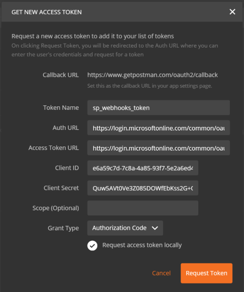
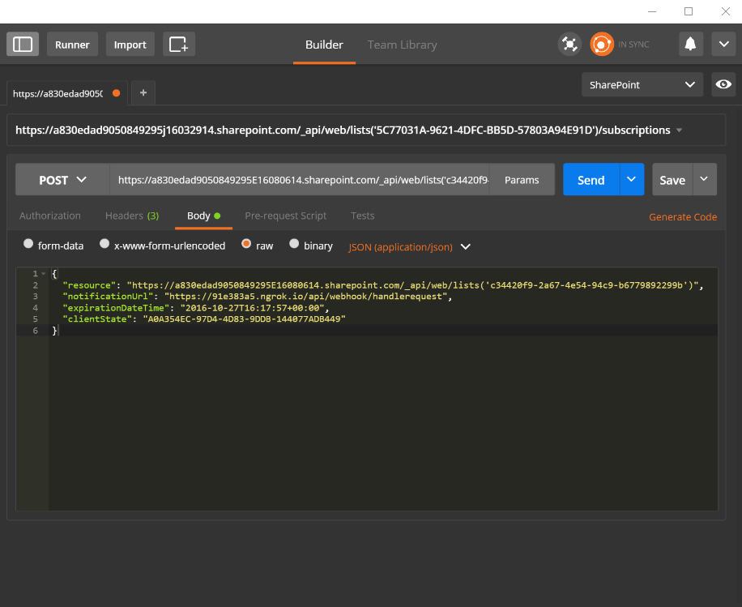

# Get started with SharePoint webhooks

This article describes how to build an application that adds and handles SharePoint webhook requests. You will learn how to use [Postman client](https://www.getpostman.com/) to construct and execute SharePoint webhook requests quickly while interacting with a simple ASP.NET Web API as the webhook receiver.

In this article, you will use plain HTTP requests, which is useful for helping you to understand how webhooks work.  

## Prerequisites

To complete the step-by-step instructions in this article, download and install the following tools:

* [Google Chrome Browser](http://google.com/chrome)
* [Postman](https://www.getpostman.com/)
* [Visual Studio Community Edition](https://go.microsoft.com/fwlink/?LinkId=691978&clcid=0x409)
* [ngrok](https://ngrok.com/) - See [Download and Installation](https://ngrok.com/download) to install ngrok.
* An Office 365 Subscription with SharePoint Online. If you are new to Office 365, you can also [sign up for an Office 365 developer account](http://dev.office.com/devprogram).

## Step 1: Register a Microsoft Azure Active Directory (AD) application for Postman client

In order for the Postman client to communicate with SharePoint, you will need to register an Azure AD app in your Azure AD tenant associated with your Office 365 tenant. 

Ensure that you register the application as a "Web Application".

To access SharePoint Online, it's important to grant the Azure AD app permissions to the **Office 365 SharePoint Online** application and select the **read and write items and lists in all site collections** permission.

> For more information about adding an Azure AD application and granting permissions to applications, see [Adding an application](https://azure.microsoft.com/en-us/documentation/articles/active-directory-integrating-applications/#adding-an-application). 

Enter the following endpoint as the Reply (Redirect) URL for the app. This is the endpoint to which Azure AD will send the authentication response; including the access token if authentication was successful.

```html
https://www.getpostman.com/oauth2/callback
```

Also generate a "Key", which will be the client secret.

The following properties are required in later steps, so copy them to a safe place:

* Client Id
* Client Secret 

## Step 2: Build a webhook receiver

For this project, use the Visual Studio Web API project to build the webhook receiver.

### Create a new ASP.NET Web API project

* Open Visual Studio.
* Choose **File > New > Project**.
* In the **Templates** pane, select **Installed Templates** and expand the **Visual C#** node. 
* Under **Visual C#**, select **Web**. In the list of project templates, select **ASP.NET Web Application**. 
* Name the project **SPWebhooksReceiver** and choose **OK**.
* In the **New ASP.NET Project** dialog, select the **Web API** template from the **ASP.NET 4.5.\*** group. 
* Change the authentication to **No Authentication** by choosing the **Change Authentication** button.
* Choose **OK** to create the Web API project.

> **Note:** You can uncheck the **Host in the cloud** option because this project will not be deployed to the cloud.

Visual Studio will create your project.

### Webhook receiver

#### Install Nuget packages

Use ASP.NET Web API Tracing to log the requests coming from SharePoint. The following steps will install the tracing package:

* Go to the **Solution Explorer** in Visual Studio.
* Open the context menu (right-click) for the project and choose **Manage Nuget Packages...**.
* In the search box, enter **Microsoft.AspNet.WebApi.Tracing**. 
* In the search results, select the **Microsoft.AspNet.WebApi.Tracing** package and choose **Install** to install the package.

#### SPWebhookNotification model

Each notification generated by the service is serialized into a **webhookNotifiation** instance. You need to build a simple model that represents this notification instance.

* Go to **Solution Explorer** in Visual Studio.
* Open the context menu (right-click) for the **Models** folder and choose **Add->Class**.
* Enter **SPWebhookNotification** as the class name and choose **Add** to add the class to your project.
* Add the following code to the body of the **SPWebhookNotification** class:

	```cs
	public string SubscriptionId { get; set; }

	public string ClientState { get; set; }

	public string ExpirationDateTime { get; set; }

	public string Resource { get; set; }

	public string TenantId { get; set; }

	public string SiteUrl { get; set; }

	public string WebId { get; set; }
	```

#### SPWebhookContent model

Because multiple notifications can be submitted to your webhook receiver in a single request, they are combined together in an object with a single array value. Build a simple model that represents the array.

* Go to **Solution Explorer** in Visual Studio.
* Open the context menu (right-click) for the **Models** folder and choose **Add->Class**.
* Enter **SPWebhookContent** as the class name and choose **Add** to add the class to your project.
* Add the following code to the body of the **SPWebhookContent** class:

	```cs
	 public List<SPWebhookNotification> Value { get; set; }
	```

#### SharePoint webhook client state

Webhooks provide the ability to use an optional string value that is passed back in the notification message for your subscription. This can be used to verify that the request is indeed coming from the source you trust, which in this case is SharePoint. 

Add a client state value with which the application can verify the incoming requests.

* Go to **Solution Explorer** in Visual Studio.
* Open the **web.config** file and add the following key as the client state to the `<appSettings>` section:

	```xml
	<add key="webhookclientstate" value="A0A354EC-97D4-4D83-9DDB-144077ADB449"/>
	```

#### Enable tracing

In the **web.config** file, enable tracing by adding the following key inside the `<system.web>` element in the `<configuration>` section:

```xml
<trace enabled="true"/>
```

A trace writer is required, so you must add a trace writer to the controller configuration (in this case use the one from **System.Diagnostics**).

* Go to **Solution Explorer** in Visual Studio.
* Open **WebApiConfig.cs** in the **App_Start** folder.
* Add the following line inside the **Register** method:

	```cs
	config.EnableSystemDiagnosticsTracing();
	```

#### SharePoint webhook controller

Now build the webhook receiver controller that will handle the incoming requests from SharePoint and take action accordingly.

* Go to **Solution Explorer** in Visual Studio.
* Open the context menu (right-click) for the **Controllers** folder and choose **Add->Controller**.
* In the **Add Scaffold** dialog, select **Web API 2 Controller - Empty**.
* Choose **Add**.
* Name the controller **SPWebhookController** and choose **Add** to add the API controller to your project.
* Replace the `using` statements with the following code:

	```cs
	using Newtonsoft.Json;
	using SPWebhooksReceiver.Models;
	using System.Collections.Generic;
	using System.Configuration;
	using System.Linq;
	using System.Net;
	using System.Net.Http;
	using System.Threading.Tasks;
	using System.Web;
	using System.Web.Http;
	using System.Web.Http.Tracing;
	```

* Replace the code in the **SPWebhookController** class with the following code:

	```cs
	[HttpPost]
	public HttpResponseMessage HandleRequest()
	{
	    HttpResponseMessage httpResponse = new HttpResponseMessage(HttpStatusCode.BadRequest);
	    var traceWriter = Configuration.Services.GetTraceWriter();
	    string validationToken = string.Empty;
	    IEnumerable<string> clientStateHeader = new List<string>();
	    string webhookClientState = ConfigurationManager.AppSettings["webhookclientstate"].ToString();

	    if (Request.Headers.TryGetValues("ClientState", out clientStateHeader))
	    {
	        string clientStateHeaderValue = clientStateHeader.FirstOrDefault() ?? string.Empty;

	        if (!string.IsNullOrEmpty(clientStateHeaderValue) && clientStateHeaderValue.Equals(webhookClientState))
	        {
	            traceWriter.Trace(Request, "SPWebhooks", 
	                TraceLevel.Info, 
	                string.Format("Received client state: {0}", clientStateHeaderValue));

	            var queryStringParams = HttpUtility.ParseQueryString(Request.RequestUri.Query);

	            if (queryStringParams.AllKeys.Contains("validationtoken"))
	            {
	                httpResponse = new HttpResponseMessage(HttpStatusCode.OK);
	                validationToken = queryStringParams.GetValues("validationtoken")[0].ToString();
	                httpResponse.Content = new StringContent(validationToken);

	                traceWriter.Trace(Request, "SPWebhooks", 
	                    TraceLevel.Info, 
	                    string.Format("Received validation token: {0}", validationToken));                        
	                return httpResponse;
	            }
	            else
	            {
	                var requestContent = Request.Content.ReadAsStringAsync().Result;

	                if (!string.IsNullOrEmpty(requestContent))
	                {
	                    SPWebhookNotification notification = null;

	                    try
	                    {
	                        var objNotification = JsonConvert.DeserializeObject<SPWebhookContent>(requestContent);
	                        notification = objNotification.Value[0];
	                    }
	                    catch (JsonException ex)
	                    {
	                        traceWriter.Trace(Request, "SPWebhooks", 
	                            TraceLevel.Error, 
	                            string.Format("JSON deserialization error: {0}", ex.InnerException));
	                        return httpResponse;
	                    }

	                    if (notification != null)
	                    {
	                        Task.Factory.StartNew(() =>
	                        {
	                             //handle the notification here
	                             //you can send this to an Azure queue to be processed later
	                            //for this sample, we just log to the trace

	                            traceWriter.Trace(Request, "SPWebhook Notification", 
	                                TraceLevel.Info, string.Format("Resource: {0}", notification.Resource));
	                            traceWriter.Trace(Request, "SPWebhook Notification", 
	                                TraceLevel.Info, string.Format("SubscriptionId: {0}", notification.SubscriptionId));
	                            traceWriter.Trace(Request, "SPWebhook Notification", 
	                                TraceLevel.Info, string.Format("TenantId: {0}", notification.TenantId));
	                            traceWriter.Trace(Request, "SPWebhook Notification", 
	                                TraceLevel.Info, string.Format("SiteUrl: {0}", notification.SiteUrl));
	                            traceWriter.Trace(Request, "SPWebhook Notification", 
	                                TraceLevel.Info, string.Format("WebId: {0}", notification.WebId));
	                            traceWriter.Trace(Request, "SPWebhook Notification", 
	                                TraceLevel.Info, string.Format("ExpirationDateTime: {0}", notification.ExpirationDateTime));

	                        });

	                        httpResponse = new HttpResponseMessage(HttpStatusCode.OK);
	                    }
	                }
	            }
	        }
	        else
	        {
	            httpResponse = new HttpResponseMessage(HttpStatusCode.Forbidden);
	        }
	    }

	    return httpResponse;
	}
	```

* Save the file.

## Step 3: Debug the webhook receiver

* Choose **F5** to debug the webhook receiver.
* When you have the browser open, copy the port number from the address bar. For example: **http://localhost:<_port-number_>**.

## Step 4: Run ngrok proxy

* Open a console terminal.
* Go to the extracted ngrok folder.
* Enter the following with the port number URL from the previous step to start ngrok:

	```
	./ngrok http port-number --host-header=localhost:port-number
	```

* You should see ngrok running.
* Copy the **Forwarding** HTTPS address. You will use this address as the service proxy for SharePoint to send requests. 

## Step 5: Add webhook subscription using Postman

### Get new access token

Postman makes it really simple to work with APIs. The first step is to configure Postman to authenticate with Azure AD so you can send API requests to SharePoint. You will use the Azure AD app that you registered in Step 1.

* Open Postman.
* You will be presented with a **Sidebar** and **Request Editor**.
* Choose the **Authorization** tab in the **Request Editor**.
* Choose **OAuth 2.0** in the **Type** dropdown list.
* Choose the **Get New Access Token** button.
* In the dialog window, enter the following: 
    * Auth URL: 
       * **https://login.microsoftonline.com/common/oauth2/authorize?resource=https%3A%2F%2F<_your-sharepoint-tenant-url-without-https_>**
       * Replace _your-sharepoint-tenant-url-without-https_ with your tenant url without the **https** prefix.
    * Access Token URL:
        * **https://login.microsoftonline.com/common/oauth2/token**
    * Client Id: 
        * Client Id of the app you registered previously in Step one.
    * Client Secret: 
        * Client Secret of the app you registered previously in Step one.
    * Token name:
        * sp_webhooks_token
    * Grant type:
        * Authorization Code
* Choose the **Request Token** to sign in, consent, and get the token for the session.
* When the token is successfully retrieved, you should see **access\_token** variable added to the **Authorization** tab
* Select the option to **Add token to header**.
* Double-click the **access\_token** variable to add the token to the header for the request.



### Get Documents list Id

You need to manage webhooks for the default document library, which is provisioned in your default site collection under the name **Documents**. Get the Id of this list by issuing a **GET** request:

* Enter the following request URL:

	```
	https://site-collection/_api/web/lists/getbytitle('Documents')?$select=Title,Id
	```

> Replace _site-collection_ with your site collection.
	
Postman will execute your request and if successful, you should see the result.

Copy the **Id** from the results. Later you will use the **Id** to make webhook requests.   

### Add webhook subscription

Now that you have the required information, construct the query and the request to add a webhook subscription. Use the request editor for the following steps:

* Change the request to **POST** from **GET**.
* Enter the following as the request URL:

	```
	https://site-collection/_api/web/lists('list-id')/subscriptions
	```

> Replace _site-collection_ with your site collection.

* Go to the **Headers** tab.
* Make sure you still have the **Authorization** header. If not, you will need to request a new access token.
* Add the following header **key -> value** pairs:
	* Accept -> application/json;odata=nometadata
	* Content-Type -> application/json

* Go to the **Body** tab and select **raw** format.
* Paste the following JSON as the body:

	```json
	{
	  "resource": "https://site-collection/_api/web/lists('list-id')",
	  "notificationUrl": "https://ngrok-forwarding-address/api/spwebhook/handlerequest",
	  "expirationDateTime": "2016-10-27T16:17:57+00:00",
	  "clientState": "A0A354EC-97D4-4D83-9DDB-144077ADB449"
	}
	```

	

> Make sure the **expirationDateTime** is at most 6 months from today. 

* Make sure you are debugging the webhook receiver as in Step 4.
* Choose **Send** to execute the request.
* If the request is successful, you should see the response from SharePoint that provides the subscription details. The following example shows a response for a newly created subscription:

	```json
	{
	  "clientState": "A0A354EC-97D4-4D83-9DDB-144077ADB449",
	  "expirationDateTime": "2016-10-27T16:17:57Z",
	  "id": "32b95d9-4d20-4a17-bfa3-2957cb38ead8",
	  "notificationUrl": "https://85557d4b.ngrok.io/api/spwebhook/handlerequest",
	  "resource": "c34420f9-2ad7-4e54-94c9-b67798d2299b"
	}
	```

* Copy the subscription **id**. You will need it for the next set of requests.
* Go to the webhook receiver project in Visual Studio and examine the **Output** window. You should see the trace logs that look similar to the following trace, along with other messages:

	```
	iisexpress.exe Information: 0 : Message='Received client state: A0A354EC-97D4-4D83-9DDB-144077ADB449'
	iisexpress.exe Information: 0 : Message='Received validation token: daf2803c-43cf-44c7-8dff-7066eaa40f13'
	```

The trace indicates that the webhook received initially received a validation request. If you look at the code, you'll see that it returns the validation token immediately so that SharePoint can validate the request:

```cs
if (queryStringParams.AllKeys.Contains("validationtoken"))
{
    httpResponse = new HttpResponseMessage(HttpStatusCode.OK);
    validationToken = queryStringParams.GetValues("validationtoken")[0].ToString();
    httpResponse.Content = new StringContent(validationToken);

    traceWriter.Trace(Request, "SPWebhooks", 
        TraceLevel.Info, 
        string.Format("Received validation token: {0}", validationToken));                        
    return httpResponse;
}
```

## Step 6: Get subscription details

Now you'll run queries in Postman to get the subscription details.

* Open the Postman client.
* Change the request to **GET** from **POST**.
* Enter the following as the request:

	```
	https://site-collection/_api/web/lists('list-id')/subscriptions
	```

> Replace _site-collection_ with your site collection.

* Choose **Send** to execute the request.

If successful, you should see SharePoint return the subscriptions for this list resource. Because we just added one, you should at least see one subscription returned. The following example shows a response with one subscription:

	```json
	{
	  "value": [
	    {
	      "clientState": "A0A354EC-97D4-4D83-9DDB-144077ADB449",
	      "expirationDateTime": "2016-10-27T16:17:57Z",
	      "id": "32b95add-4d20-4a17-bfa3-2957cb38ead8",
	      "notificationUrl": "https://85557d4b.ngrok.io/api/spwebhook/handlerequest",
	      "resource": "c34420f9-2a67-4e54-94c9-b67798229f9b"
	    }
	  ]
	}
	```

You can run the following query to get details of the specific subscription:

	```
	https://site-collection/_api/web/lists('list-id')/subscriptions('subscription-id')
	```

> Replace subscription-id with your subscription id 

## Step 7: Test webhook notification

Now add a file to the Documents library and test if you get a notification from SharePoint in the webhook receiver.

* Go to Visual Studio.
* In the **SPWebhookController** place a breakpoint on the following line of code:

	```cs
	var requestContent = Request.Content.ReadAsStringAsync().Result;
	```

* Go to the **Documents** library. It will be named **Shared Documents** library in your default site collection.
* Add a new file.
* Go to Visual Studio and wait for the breakpoint to be hit.
   * In preview, the wait time may vary from a few seconds up to five minutes. When the breakpoint is hit, the webhook receiver has just received a notification from SharePoint.
* Choose **F5** to continue.
* To see the notification data, look in the **Output** window for the following entries, since you added the notification data into the trace log:

	```
	iisexpress.exe Information: 0 : Message='Resource: c34420f9-2a67-4e54-94c9-b6770892299b'
	iisexpress.exe Information: 0 : Message='SubscriptionId: 32b95ad9-4d20-4a17-bfa3-2957cb38ead8'
	iisexpress.exe Information: 0 : Message='TenantId: 7a17cb7d-6898-423f-8839-45f363076f06'
	iisexpress.exe Information: 0 : Message='SiteUrl: /'
	iisexpress.exe Information: 0 : Message='WebId: 62b80e0b-f889-4974-a519-cc138413be40'
	iisexpress.exe Information: 0 : Message='ExpirationDateTime: 2016-10-27T16:17:57.0000000Z'
	```

This project just writes the information to the trace log. However, in your receiver, you will send this information into a table or a queue that can process the received data to get information from SharePoint. 

With this data, you can construct the URL and use the [GetChanges](https://msdn.microsoft.com/EN-US/library/office/dn531433.aspx#bk_ListGetChanges) API to get the latest changes.

## Next steps

In this article, you used Postman client and a simple web API to subscribe and receive webhook notifications from SharePoint.

Next, take a look at [SharePoint webhooks sample reference implementation](./webhooks-reference-implementation), which shows an end-to-end sample that uses Azure Storage Queues to process the information, get changes from SharePoint, and push those changes back into a SharePoint list.
