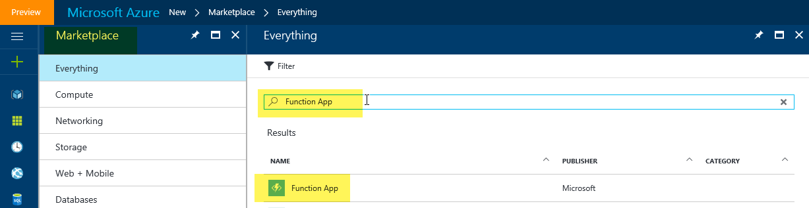
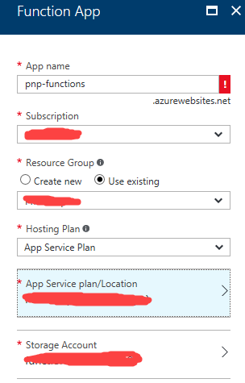
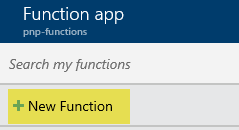
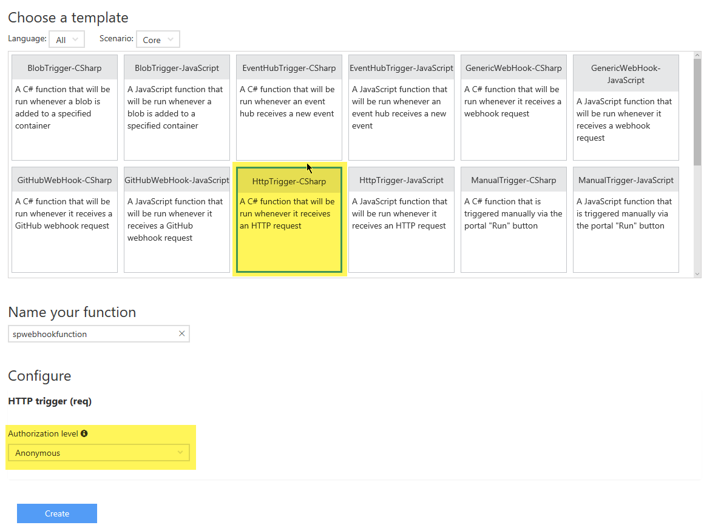
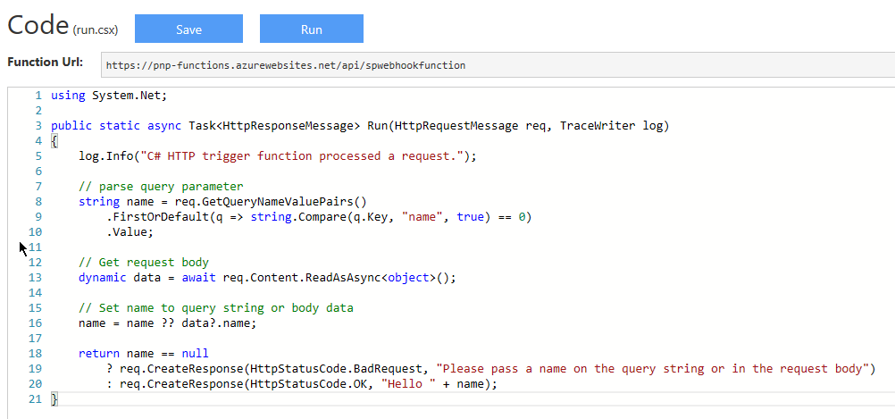
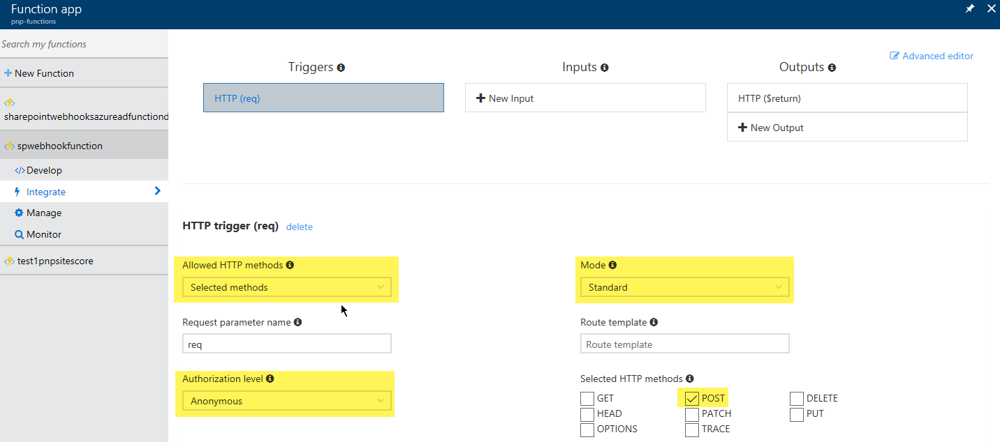
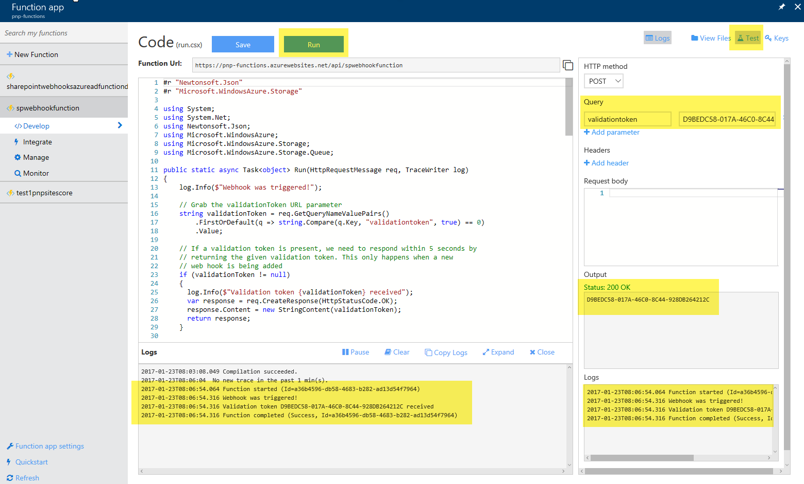
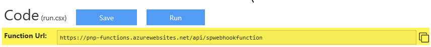
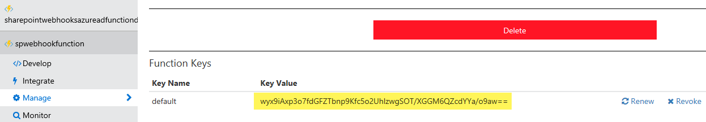

# Using Azure Functions with SharePoint webhooks

[Azure Functions](https://docs.microsoft.com/en-us/azure/azure-functions/functions-overview) offers an easy way to host your SharePoint webhooks: you can simply add your webhook C# or JavaScript code via the browser, and Azure takes care of the hosting and scaling of your function. This guide shows how to set up and use Azure Functions for your webhooks.

## Create an Azure Function App

The first step you need to do is create an Azure Function App, which is a special kind of Azure Web App focused on hosting Azure Functions. 

1. Navigate to [https://portal.azure.com](https://portal.azure.com), select **New**, and then search for **Function App**.

    

2. Select **Function App**, and then complete the information needed to create the Function App:

    

## Create an Azure Function

1. Now that the app to host the functions is ready, you can continue with creating your first Azure Function by selecting the **New Function** link.

    

    This offers you to start your function from a template; in the case of SharePoint webhooks, we need an HTTP triggered function, and because we are writing C# code in our sample, this means we're using the **HttpTrigger-CSharp** function template. Given that SharePoint webhook services need to be anonymously callable, it's important to switch the **Authorization level** to **Anonymous**.

    

    > [!NOTE]
    > - Using the **GenericWebHook** template does not yet work for SharePoint webhooks, but the SharePoint product team is aware of this problem and will address it.
    > - If you get "Failed to validate the notification URL" errors when using your Azure function-based webhook, you might be able to resolve this by setting the Authorization level to **Function** and defining your function for anonymous access.
    > - Java language functions cannot currently validate the webhook callback due to lack of asynchronous support. This should be added by Azure Functions v2 general avalibility as seen [here](https://github.com/Azure/azure-functions-java-worker/issues/83)

    <br/>

    The result is a "default" Azure Function written in C#.

    

2. In our case, we want this Azure Function to behave as a SharePoint webhook service, so we need to implement the following in C#:
    - Return the validationtoken if specified as a URL parameter to the call. This is needed as described at [Create a new subscription](./lists/create-subscription.md), and SharePoint expects the reply to happen within 5 seconds. 
    - Process the JSON webhook notification. In the following sample, we've opted to store the JSON in a storage queue so that an Azure Web Job can pick it up and process it asynchronously. Depending on your needs, you could also process the notification directly in your webhook service, but keep in mind that all webhook service calls need to complete in 5 seconds; hence, using an asynchronous model is recommended.

3. You can achieve this by replacing the default code with the following code (please enter your storage account connection string and update the queue name if you're using a different one):

```cs
#r "Newtonsoft.Json"
#r "Microsoft.WindowsAzure.Storage"

using System;
using System.Net;
using Newtonsoft.Json;
using Microsoft.WindowsAzure;
using Microsoft.WindowsAzure.Storage;
using Microsoft.WindowsAzure.Storage.Queue;

public static async Task<object> Run(HttpRequestMessage req, TraceWriter log)
{
    log.Info($"Webhook was triggered!");

    // Grab the validationToken URL parameter
    string validationToken = req.GetQueryNameValuePairs()
        .FirstOrDefault(q => string.Compare(q.Key, "validationtoken", true) == 0)
        .Value;
    
    // If a validation token is present, we need to respond within 5 seconds by  
    // returning the given validation token. This only happens when a new 
    // web hook is being added
    if (validationToken != null)
    {
      log.Info($"Validation token {validationToken} received");
      var response = req.CreateResponse(HttpStatusCode.OK);
      response.Content = new StringContent(validationToken);
      return response;
    }

    log.Info($"SharePoint triggered our webhook...great :-)");
    var content = await req.Content.ReadAsStringAsync();
    log.Info($"Received following payload: {content}");

    var notifications = JsonConvert.DeserializeObject<ResponseModel<NotificationModel>>(content).Value;
    log.Info($"Found {notifications.Count} notifications");

    if (notifications.Count > 0)
    {
        log.Info($"Processing notifications...");
        foreach(var notification in notifications)
        {
            CloudStorageAccount storageAccount = CloudStorageAccount.Parse("<YOUR STORAGE ACCOUNT>");
            // Get queue... create if does not exist.
            CloudQueueClient queueClient = storageAccount.CreateCloudQueueClient();
            CloudQueue queue = queueClient.GetQueueReference("sharepointlistwebhookeventazuread");
            queue.CreateIfNotExists();

            // add message to the queue
            string message = JsonConvert.SerializeObject(notification);
            log.Info($"Before adding a message to the queue. Message content: {message}");
            queue.AddMessage(new CloudQueueMessage(message));
            log.Info($"Message added :-)");
        }
    }

    // if we get here we assume the request was well received
    return new HttpResponseMessage(HttpStatusCode.OK);
}


// supporting classes
public class ResponseModel<T>
{
    [JsonProperty(PropertyName = "value")]
    public List<T> Value { get; set; }
}

public class NotificationModel
{
    [JsonProperty(PropertyName = "subscriptionId")]
    public string SubscriptionId { get; set; }

    [JsonProperty(PropertyName = "clientState")]
    public string ClientState { get; set; }

    [JsonProperty(PropertyName = "expirationDateTime")]
    public DateTime ExpirationDateTime { get; set; }

    [JsonProperty(PropertyName = "resource")]
    public string Resource { get; set; }

    [JsonProperty(PropertyName = "tenantId")]
    public string TenantId { get; set; }

    [JsonProperty(PropertyName = "siteUrl")]
    public string SiteUrl { get; set; }

    [JsonProperty(PropertyName = "webId")]
    public string WebId { get; set; }
}

public class SubscriptionModel
{
    [JsonProperty(NullValueHandling = NullValueHandling.Ignore)]
    public string Id { get; set; }

    [JsonProperty(PropertyName = "clientState", NullValueHandling = NullValueHandling.Ignore)]
    public string ClientState { get; set; }

    [JsonProperty(PropertyName = "expirationDateTime")]
    public DateTime ExpirationDateTime { get; set; }

    [JsonProperty(PropertyName = "notificationUrl")]
    public string NotificationUrl {get;set;}

    [JsonProperty(PropertyName = "resource", NullValueHandling = NullValueHandling.Ignore)]
    public string Resource { get; set; }
}
```

## Configure your Azure Function

Because we've chosen the correct template to start from, our configuration is almost complete. The only thing you still need to do is to switch the **Allowed HTTP methods** to **Selected methods**, and then only allow the **POST** HTTP method. Also cross-check that **Mode** is equal to **Standard**, and **Authorization level** is set to **Anonymous**.



## Test your Azure Function
You're now all set for your first Azure Function test.

1. Navigate to the **Develop** screen. 

2. Select the **Test** icon to open the test pane on the right, and add a URL parameter "validationtoken" with a random string as value. 

3. Using this setup, we're mimicking the behavior of SharePoint by calling your web hook service when validating a new webhook addition. Select **Run** to test...if everything goes well, you'll see in the logs section that your service was called and that it returned the passed value with an HTTP 200 response.



## Grab the webhook URL to use in your implementation

We'll need to let SharePoint know what webhook URL we're using. To do so, let's start by copying the Azure Function URL.



<br/>

To avoid unathorized usage of your Azure Function, the caller needs to specify a code when calling your function. This code can be retrieved via the **Manage** screen.



<br/>

So in our case the webhook URL to use is the following:

```https://pnp-functions.azurewebsites.net/api/spwebhookfunction?code=wyx9iAxp3o7fdGFZTbnp9Kfc5o2UhlzwgSOT/XGGM6QZcdYYa/o9aw==
```

## See also

- [Overview of SharePoint webhooks](overview-sharepoint-webhooks.md)


