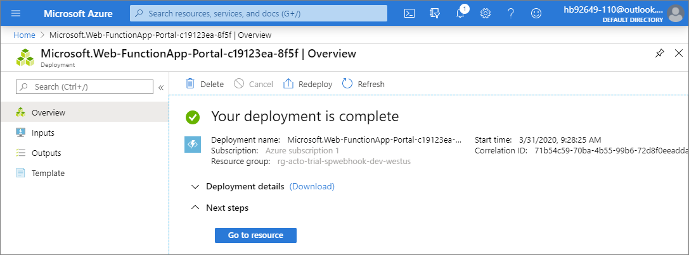
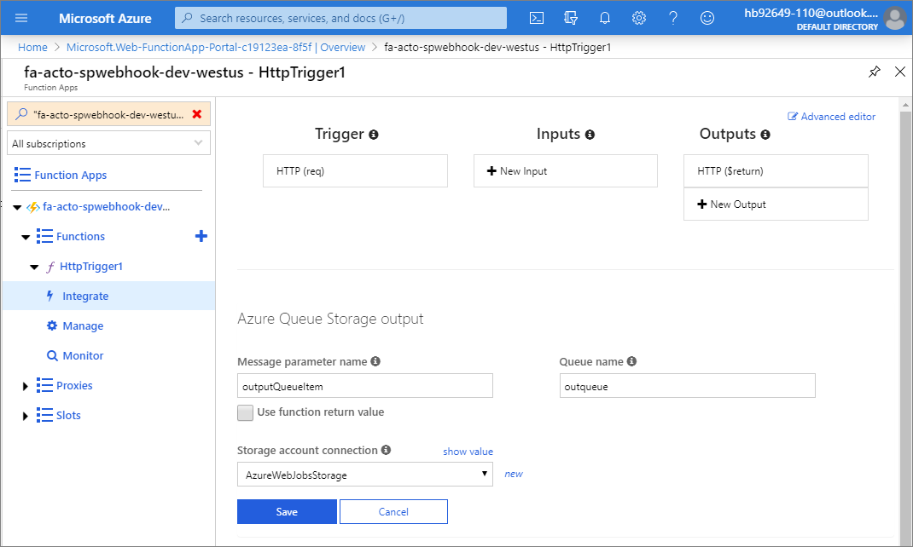

# Using Azure Functions with SharePoint webhooks

[Azure Functions](/azure/azure-functions/functions-overview) offers an easy way to host your SharePoint webhooks: you can add your webhook C# or JavaScript code via the browser, and Azure takes care of the hosting and scaling of your function. This guide shows how to set up and use Azure Functions for your webhooks.

## Create an Azure Function App

The first step you need to do is to create an Azure Function App, which is a special Azure Web App focused on hosting Azure Functions.

1. Navigate to [https://portal.azure.com](https://portal.azure.com), search for **function app**.  Select **Function App** from the search results.

    

1. Click the **Add** option.

    

1. Complete the information needed to create the Function App, then click **Review + create**.

    

1. Click **Create**

    

1. When the deployment is completed click **Go to resource**.

    

## Create an Azure Function

Now that the app to host the functions is ready, you can continue with creating your first Azure Function by clicking the **New function** link.


This offers you to start your function from a template; for SharePoint webhooks, we need an HTTP triggered function, and because we're writing C# code in our sample, this means we're using the **HttpTrigger-CSharp** function template.

1. Select the **In-portal** development environment option then click **Continue**.

    

1. Select **Webhook + API** trigger type then click **Create**.

    

    The result is a "default" Azure Function written in C#.

    

In our case, we want this Azure Function to behave as a SharePoint webhook service, so we need to implement the following in C#:

- Return the **validationtoken** if specified as a URL parameter to the call. This is needed as described at [Create a new subscription](./lists/create-subscription.md), and SharePoint expects the reply to happen within 5 seconds.
- Process the JSON webhook notification. In the following sample, we've opted to store the JSON in a storage queue so that an Azure Web Job can pick it up and process it asynchronously.
- Depending on your needs, you could also process the notification directly in your webhook service, but keep in mind that all webhook service calls need to complete in 5 seconds; so using an asynchronous model is recommended.

You can achieve this by replacing the default code with the following code:

```csharp
#r "Newtonsoft.Json"

using System.Net;
using Microsoft.AspNetCore.Mvc;
using Microsoft.Extensions.Primitives;
using Newtonsoft.Json;

public static async Task<IActionResult> Run(HttpRequest req,
  ICollector<string> outputQueueItem, ILogger log)
{
  log.LogInformation($"Webhook was triggered!");

  // Grab the validationToken URL parameter
  string validationToken = req.Query["validationtoken"];

  // If a validation token is present, we need to respond within 5 seconds by
  // returning the given validation token. This only happens when a new
  // webhook is being added
  if (validationToken != null)
  {
    log.LogInformation($"Validation token {validationToken} received");
    return (ActionResult)new OkObjectResult(validationToken);
  }

  log.LogInformation($"SharePoint triggered our webhook...great :-)");
  var content = await new StreamReader(req.Body).ReadToEndAsync();
  log.LogInformation($"Received following payload: {content}");

  var notifications = JsonConvert.DeserializeObject<ResponseModel<NotificationModel>>(content).Value;
  log.LogInformation($"Found {notifications.Count} notifications");

  if (notifications.Count > 0)
  {
    log.LogInformation($"Processing notifications...");
    foreach(var notification in notifications)
    {
      // add message to the queue
      string message = JsonConvert.SerializeObject(notification);
      log.LogInformation($"Before adding a message to the queue. Message content: {message}");
      outputQueueItem.Add(message);
      log.LogInformation($"Message added :-)");
    }
  }

  // if we get here we assume the request was well received
  return (ActionResult)new OkObjectResult($"Added to queue");
}

// supporting classes
public class ResponseModel<T>
{
  [JsonProperty(PropertyName = "value")]
  public List<T> Value { get; set; }
}

public class NotificationModel
{
  [JsonProperty(PropertyName = "subscriptionId")]
  public string SubscriptionId { get; set; }

  [JsonProperty(PropertyName = "clientState")]
  public string ClientState { get; set; }

  [JsonProperty(PropertyName = "expirationDateTime")]
  public DateTime ExpirationDateTime { get; set; }

  [JsonProperty(PropertyName = "resource")]
  public string Resource { get; set; }

  [JsonProperty(PropertyName = "tenantId")]
  public string TenantId { get; set; }

  [JsonProperty(PropertyName = "siteUrl")]
  public string SiteUrl { get; set; }

  [JsonProperty(PropertyName = "webId")]
  public string WebId { get; set; }
}

public class SubscriptionModel
{
  [JsonProperty(NullValueHandling = NullValueHandling.Ignore)]
  public string Id { get; set; }

  [JsonProperty(PropertyName = "clientState", NullValueHandling = NullValueHandling.Ignore)]
  public string ClientState { get; set; }

  [JsonProperty(PropertyName = "expirationDateTime")]
  public DateTime ExpirationDateTime { get; set; }

  [JsonProperty(PropertyName = "notificationUrl")]
  public string NotificationUrl {get;set;}

  [JsonProperty(PropertyName = "resource", NullValueHandling = NullValueHandling.Ignore)]
  public string Resource { get; set; }
}
```

## Configure your Azure Function

Because we've chosen the correct template to start from, our configuration is almost complete. The only thing you still need to do is to configure the Azure Queue Storage as an Output binding so that we can add messages to the queue as they come in.

1. Select **Integrate** and then **New Output** to add the output binding.

    

1. Select **Azure Queue Storage** as the binding type and then click **Select**.

    

1. Click **Save**.

    

## Test your Azure Function (Validation Token Test)

You're now all set for your first Azure Function test.

1. Navigate back to the code screen by clicking on the name of the function **HttpTrigger1** in the navigation panel.  Then click the **Test** tab to open the test panel on the right.

    

1. Add a URL parameter **validationtoken** with a random string as value.

Using this setup, we're mimicking the behavior of SharePoint by calling your webhook service when validating a new webhook addition.

Click **Run** to test...


If everything goes well, you'll see in the logs section that your service was called and that it returned the passed value with an HTTP 200 response.


## Test your Azure Function (SharePoint List Event Test)

Now for the second test.  This will test your function as if it was called by a SharePoint list event.

1. In the Test panel, clear the **validationtoken** URL parameter and replace the Request body with the following JSON object.  Then click **Run**.

```Json
{
  "value": [{
    "subscriptionId":"1111111111-3ef7-4917-ada1-xxxxxxxxxxxxx",
    "clientState":null,
    "expirationDateTime":"2020-06-14T16:22:51.2160000Z","resource":"xxxxxx-c0ba-4063-a078-xxxxxxxxx","tenantId":"4e2a1952-1ed1-4da3-85a6-xxxxxxxxxx",
    "siteUrl":"/sites/webhooktest",
    "webId":"xxxxx-3a7c-417b-964e-39f421c55d59"
  }]
}
```

If everything is OK, you should see all the log messages including the one that indicates that the message was added to the queue.


## Grab the webhook URL to use in your implementation

We'll need to let SharePoint know what webhook URL we're using. To do so, let's start by copying the Azure Function URL.

1. Click **Get function URL**.

    

1. Click **Copy** to copy the Azure Function App URL to your clipboard.

    

So in our case the webhook URL to use is the following:

```https
https://fa-acto-spwebhook-dev-westus.azurewebsites.net/api/HttpTrigger1?code=LTFbMHrbVVQkhbL2xUplGRmY5XnAI9q/E4s5jvfeIh00KsF9Y7QsJw==
```

## See also

- [Overview of SharePoint webhooks](overview-sharepoint-webhooks.md)
