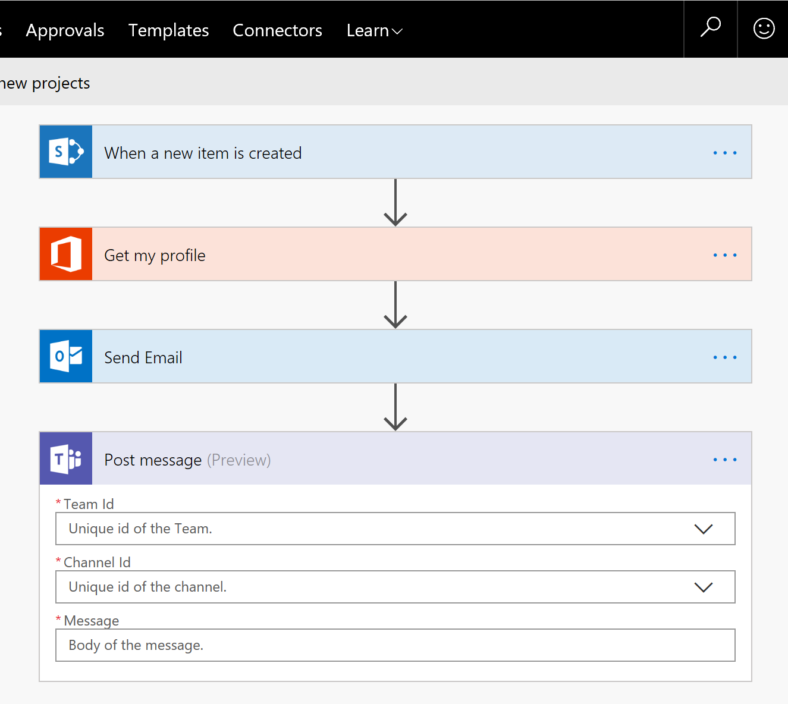
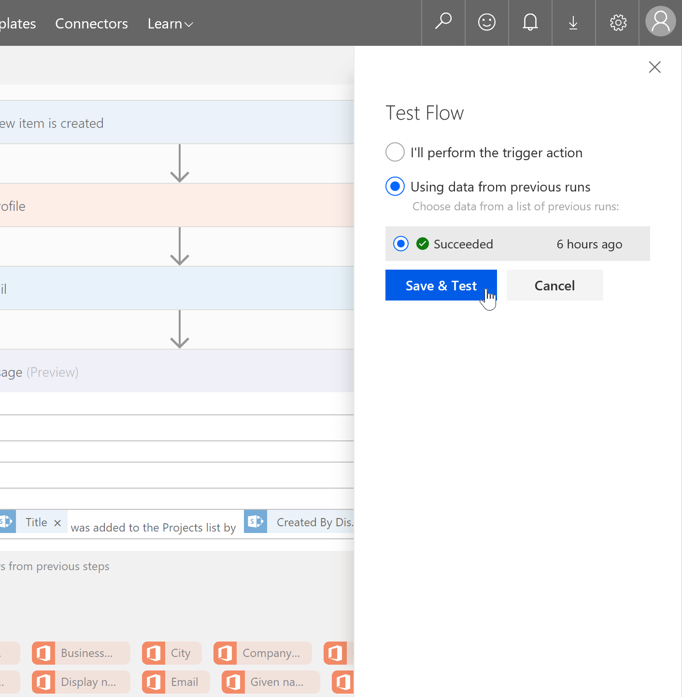

# Connect your flow to other services

Connect your flow to 200+ services available in Microsoft Flow and build an integrated experience to perform actions in the services. This article continues building the *Projects* list flow built in the previous article *Create your first flow*.

## Connect to Microsoft Teams

In this article, we will connect to Microsoft Teams and post a message to one of the channels.

> **Note:** While this article focusses on Microsoft Teams, you can connect to various other services as well in your flow.

### Edit the flow

1. Switch to the flow designer tab in your browser.

2. If you do not have the flow designer tab opened, then follow the steps to open the flow:
    * Browse to the *Projects* list.
    * Click on *Flow* and then *See your flows*.
    * If promoted, sign in with your Office 365 account.
    * Click on *Send an email for new projects* flow in the *My flows* tab.
    * Click on *Edit flow* to edit the flow.

3. Click on *+ New step* in the flow designer.

4. Click on *Add an action*.

5. This will open the actions list where you can search and browse for various actions available in Flow.

6. In the search box, type *Teams* to search for Teams based actions.

7. In the results, click on *Microsoft Teams* connector to filter the actions to just Teams.

8. In the available actions list, click on *Microsoft Teams - Post message*.
    > Click on the information icon to read more about the action and what it does.

    

9. As soon as the action is added, Flow will try to create the Teams connection. Once the connection is created successfully, you should see the action with the available inputs.

    

10. To see the connection information, click on the `...` button and check the *My connections* section to see the connection information the Teams action is using.

11. Enter the inputs for the Teams action.
    * Team Id: Pick a team from the picker.
    * Channel Id: Pick a channel from the picker.

12. In order to construct a message that includes the project information, we will need to interact with the dynamic conetent panel. In the *Message*, type the following in the same order as below:
    * First type the text: *A new project *
    * In the dynamic content list, search and pick the following property: *Title*
    * Then type the text: * was added to the Projects list by *
    * In the dynamic content list, search and pick the following property: *Created By DisplayName.*

    

13. Click *Save* on the command bar to save your flow.

## Test your flow

1. Click *Test* on the command bar.

2. Click on Using data from previous runs*. Since* we already had previous runs of this flow in the previous article, we can select the same data for this flow run as well.

    

3. Click on the flow run that says *Succeeded* and then click *Save & Test*.

4. Flow will now run and you should see the status of each action updated successfully in the designer.

5. As a result of this flow run, you should have received an email and a message should be posted on the selected Teams channel.

## Next steps

In the next topic, we will use the same flow and add ... .