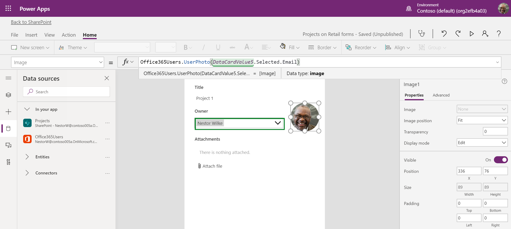
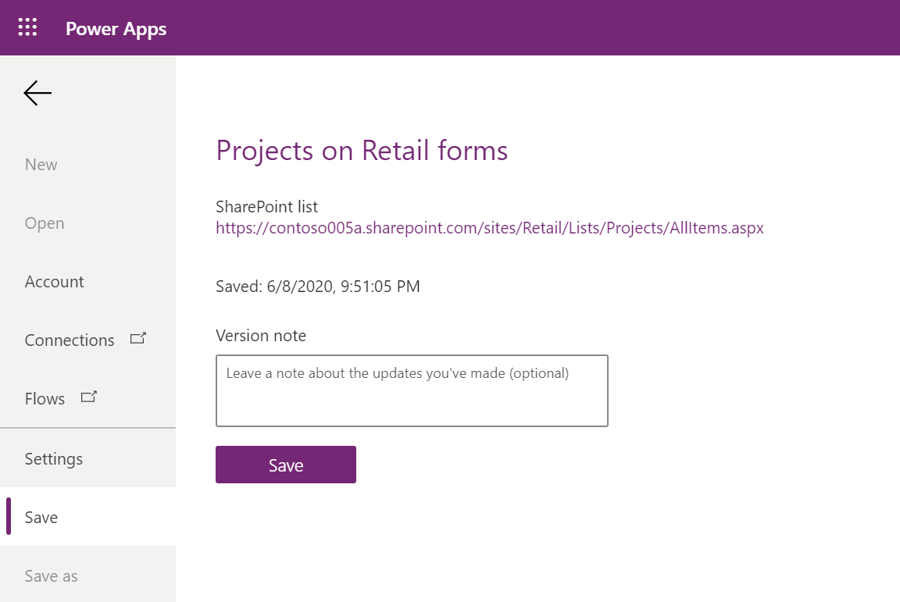
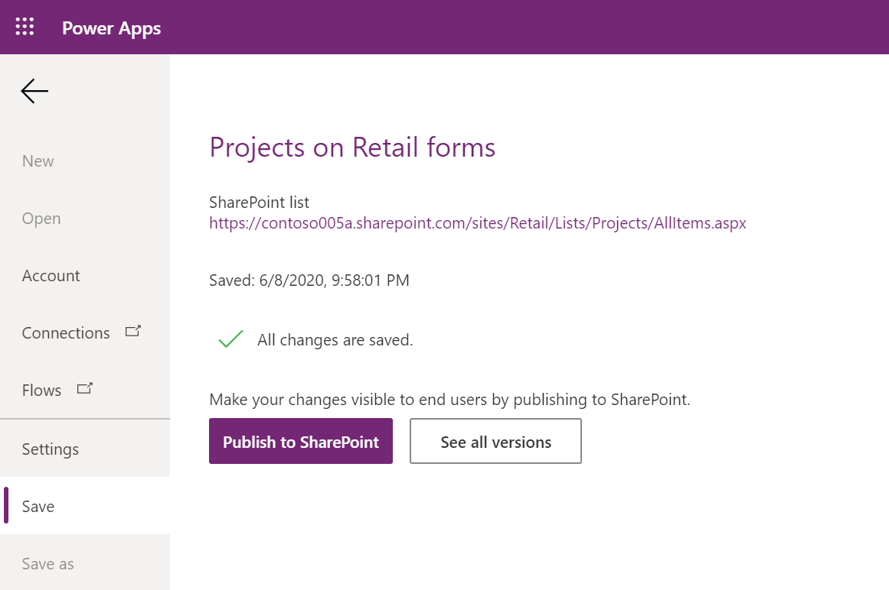

# Customize a form for a SharePoint list

Using Power Apps, you can easily customize a form for a SharePoint list that works best for your team or organization.

In this tutorial, you will create a custom form with a user profile photo, a read-only field, and a conditionally-visible field.

## Required setup

Before starting, make sure your SharePoint site is set up with the [required lists and libraries](../../get-started/set-up-sharepoint-site-lists-libraries.md).

## Create a custom form

1. In your SharePoint site, browse to the **Projects** list.

1. To create and manage flows for a list or a library, from the command bar, on the list or library page, select **Integrate** > **Power Apps**. More options appear:

   - Create an app
   - See all apps
   - Customize forms

    

1. Select **Customize forms**. The Power Apps studio appears and loads your form onto the canvas. If the **Welcome to Power Apps Studio** dialog box opens, select **Skip**.

    

### Add a user profile photo

1. On the **Insert** tab, select **Media** > **Image**. An [Image](https://docs.microsoft.com/powerapps/maker/canvas-apps/controls/control-image) control named **Image1** is added to the canvas and to the [Tree view](https://docs.microsoft.com/powerapps/maker/model-driven-apps/using-tree-view-on-form) on the left-hand panel.

    

1. To customize the appearance of the image, you can set its properties.
    
    1. When you select a control on the canvas, on the right-hand panel, the **Properties** pane associated with the control appears.

    

    1. Because the image is the profile photo of the owner of the selected item, we recommend you make it the same height as the **Owner_DataCard1** [data card](https://docs.microsoft.com/powerapps/maker/canvas-apps/working-with-cards).

    1. With **Image1** selected, in the [formula bar](https://docs.microsoft.com/powerapps/maker/canvas-apps/working-with-formulas), change the property to **Height**, and enter `Owner_DataCard1.Height` as the formula. **Image1** now has the same height as **Owner_DataCard1**.

    
         
1. Set the width of **Image1** to be the same as its height. In the formula bar, change the property to **Width**, and enter `Self.Height` as the formula.

    

1. Make **Image1** into a circle. In the **Properties** pane, enter a value that is half the height value in the **Border radius** property.

1. Place **Image1** on the canvas in your desired location. Adjust the widths and heights of other controls or data cards so they do not overlap with **Image1**.

    

1. To change the image of **Image1** from the sample image to the project owner's profile photo, you can use the Office 365 Users connector to retrieve the photo by the owner's email. First, [connect your custom form to the Office 365 Users connector](https://docs.microsoft.com/powerapps/maker/canvas-apps/connections/connection-office365-users).

1. To retrieve the project owner's profile photo by email, in the formula bar, change the property to **Image**, and enter `Office365Users.UserPhoto(DataCardValue5.Selected.Email)` as the formula. The user photo from the owner's Office 365 user profile appears in **Image1**. 

    

    When you change the project owner, **Image1** will update to the user photo of the new owner.

### Set a field to be view-only

To make the **Title** field view-only, follow these steps.

 > [!NOTE]
 > **Title** is a [predefined card](https://docs.microsoft.com/powerapps/maker/canvas-apps/controls/control-card), so it is locked by default, and needs to be unlocked.

1. Select **Title_DataCard1**, toggle the **Properties** pane to the **Advanced** pane, and select **Unlock to manage properties**.

    

    Alternatively, in the Tree view, right-click **Title_DataCard1**, and select **Unlock**.

1. Toggle back to the **Properties** pane, and select the **Display mode** field. The formula bar updates to display this property.

    

1. In the formula bar, enter `DisplayMode.View` as the formula.
    
    
    
    Alternatively, in the **Properties** pane, set the value of **Display** mode to **View**.

    **DataCardValue1** is now a view-only field.

### Set the visibility of a field based on a condition

To hide the **Attachments** field if the project owner is Nestor Wilke, follow these steps.

> [!NOTE]
> **Attachments** is a [predefined card](https://docs.microsoft.com/powerapps/maker/canvas-apps/controls/control-card), so it is locked by default, and needs to be unlocked.

1. Select **Attachments**, toggle the **Properties** pane to the **Advanced** pane, and select **Unlock to manage properties**.

    

    Alternatively, in the Tree view, right-click **Attachments_DataCard1**, and select **Unlock**.

1. Toggle back to the **Properties** pane, and select the **Visible** field. The formula bar updates to display this property.

    

1. In the formula bar, enter the following formula: `If(SharePointIntegration.Selected.Owner.DisplayName = "Nestor Wilke", false, true)`

    
    
    If the project owner is Nestor Wilke, then the **Attachments** data card is hidden. Otherwise, it is visible.

    You can write the same conditional logic in multiple ways. For more info, see [Operators and Identifiers in Power Apps](https://docs.microsoft.com/powerapps/maker/canvas-apps/functions/operators).

## Publish your custom form

1. On the **File** tab, select the **Save** tab, and then select **Save**.

    

    Alternatively, to save your app, press **Ctrl+S** while the canvas is visible.

1. After you save the app, select **Publish to SharePoint**.

    

    In the dialog box that appears, to confirm, select **Publish to SharePoint**.

    The version of the custom form that appears in SharePoint is the most recently published version.

1. In SharePoint, verify the intended functionality of your app.

## Next steps

Congratulations on creating your custom form.

In the next topic, we will create a standalone app using data from a SharePoint list.
