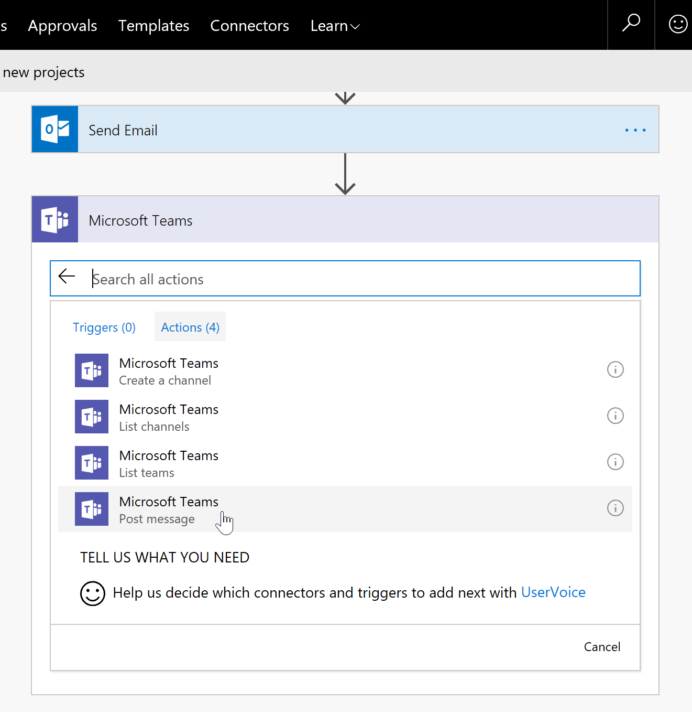

# Connect your flow to other services
Connect your flow to 200+ services available in Power Automate and build an integrated experience to perform actions in the services. This article continues building the *Projects* list flow built in the previous article *Create your first flow*.

## Connect to Microsoft Teams
In this article, we will connect to Microsoft Teams and post a message to one of the channels.

> [!NOTE] 
> While this article focuses on Microsoft Teams, you can also connect to various other services in your flow.

### Edit the flow
1. In your browser, switch to the **flow designer** tab.

2. If you do not have the flow designer tab opened, to open the flow, follow these steps:
    * Browse to the **Projects** list.
    * Select **Automate > Power Automate > See your flows**.
    * If prompted, sign in with your Microsoft 365 account.
    * In the **My flows** tab, select **Send a customized email when a new SharePoint list item is added** flow.
    * To edit the flow, in the flow details page, select **Edit** in the top command bar.

3. In the flow designer, select **+ New step**.

4. In the search box, to search for Teams-based actions, enter **Teams**.

5. In the results, to filter the actions to only Teams, select the **Microsoft Teams connector**.

    

6. In the available actions list, select **Microsoft Teams - Post message**.
    > To read more about the action and what it does, select the **i (information)** icon.

    

7. As soon as the action is added, Power Automate begins to create the Teams connection. After the connection is created successfully, the action with the available inputs appears.

    

8. To see the connection information, select the **...** (ellipsis) icon. To see the connection information the Teams action is using, check the **My connections** section.

9. For the Teams action, enter the inputs.
    * Team: From the picker, select a team.
    * Channel: From the picker, select a channel.

10. To construct a message that includes the project information, use the dynamic content panel. In the **Message**, enter the following in this same order:
    * Enter: **A new project**.
    * In the dynamic content list, search and select the following property: **Title**.
    * Enter: **was added to the Projects list by**.
    * In the dynamic content list, search and select the following property: **Created By DisplayName**.

    

11. To save your flow, on the command bar, select **Save**.

## Test your flow
1. On the command bar, select **Test**.

2. Select **Using data from previous runs**. Because you already had previous runs of this flow in the previous article, you can select the same data for this flow run as well.

    

3. Select the flow run identified as **Succeeded**, and then select **Save & Test**.

4. Power Automate runs, and the status of each action updated successfully in the designer appears.

5. As a result of this flow run, you receive an email, and a message is posted on the selected Teams channel.

## Next steps
Learn new skills and discover Power Automate with step-by-step guidance by exploring learning paths and modules available here: [Power Automate Learning Paths](https://docs.microsoft.com/en-us/learn/browse/?term=Power%20Automate&products=power-automate).
