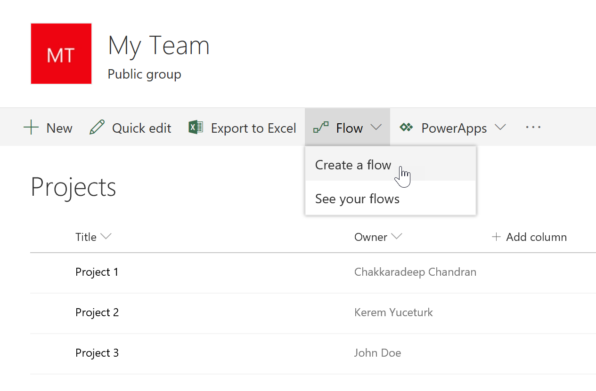
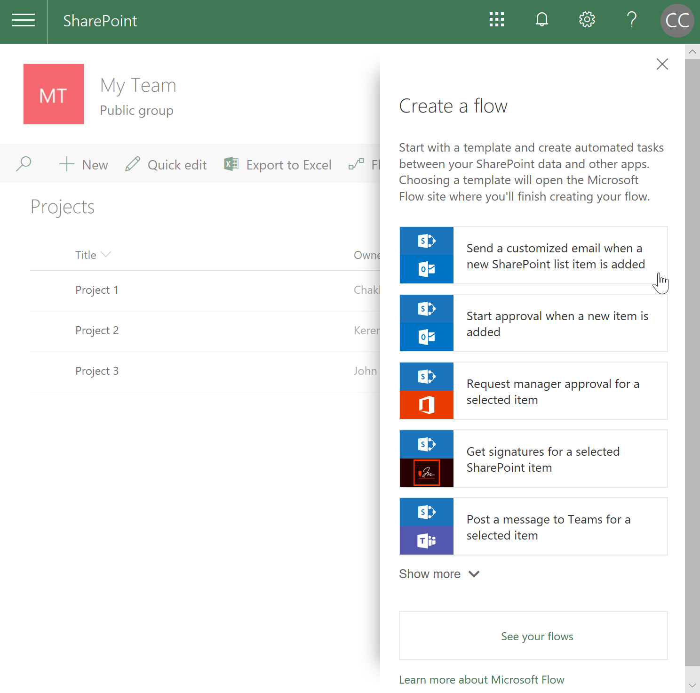
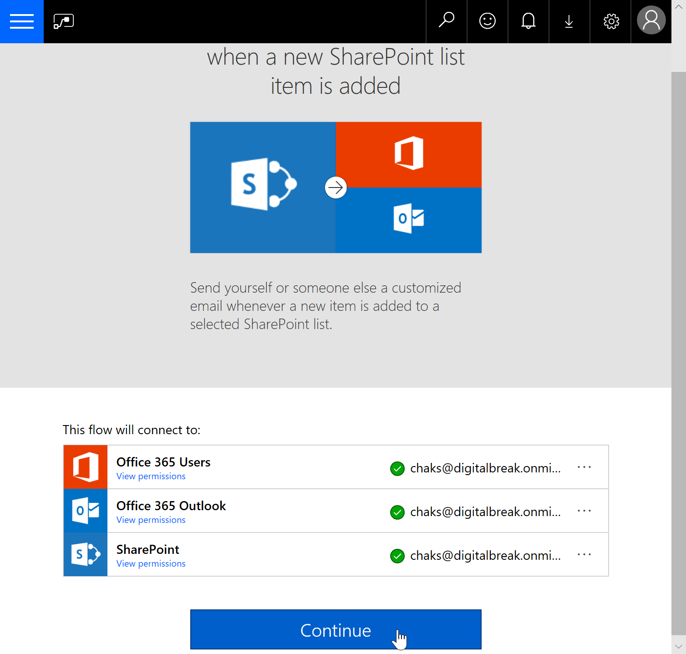
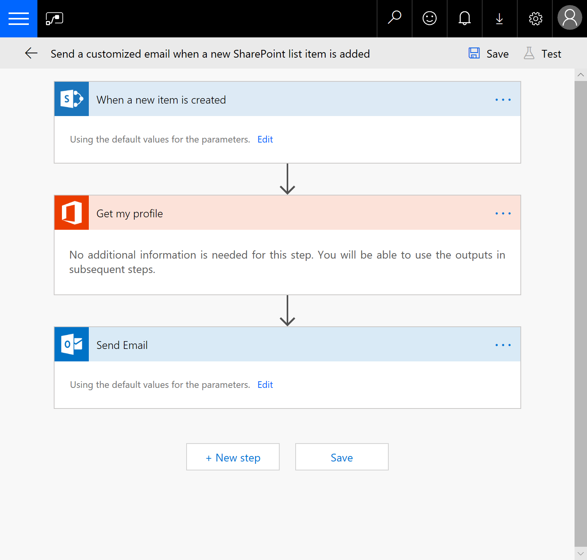
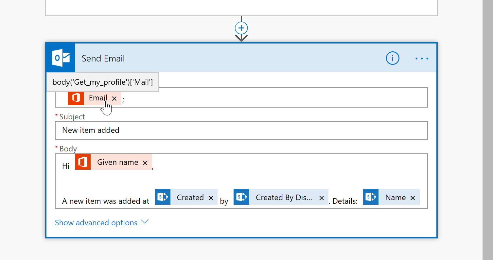
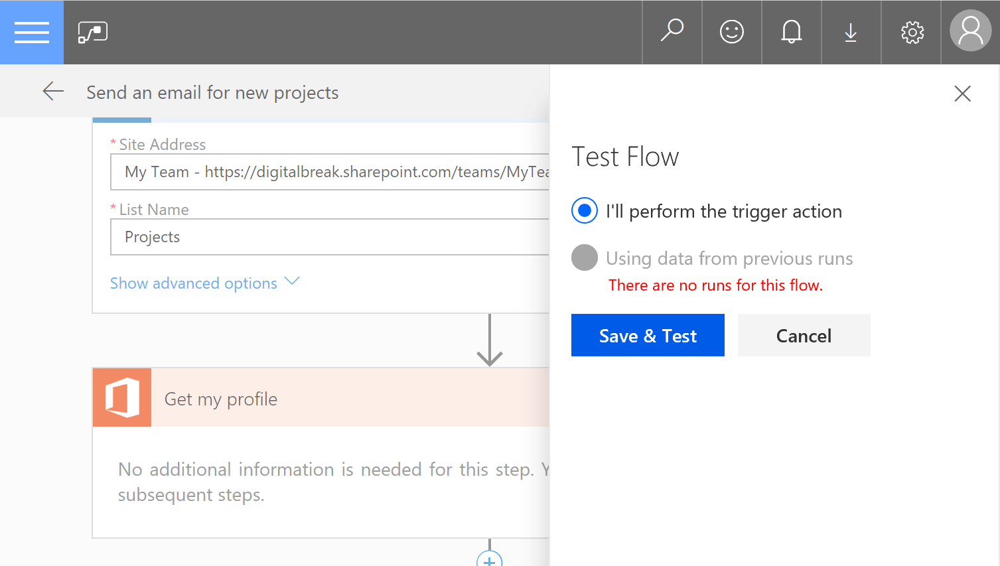
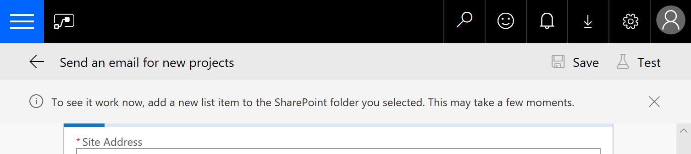
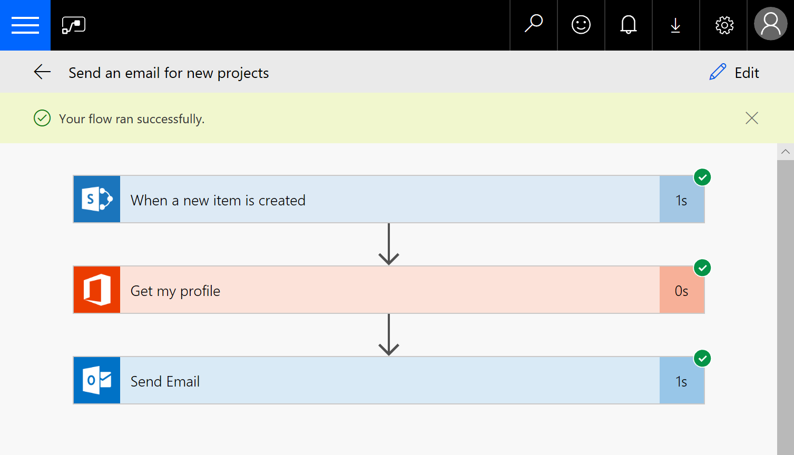
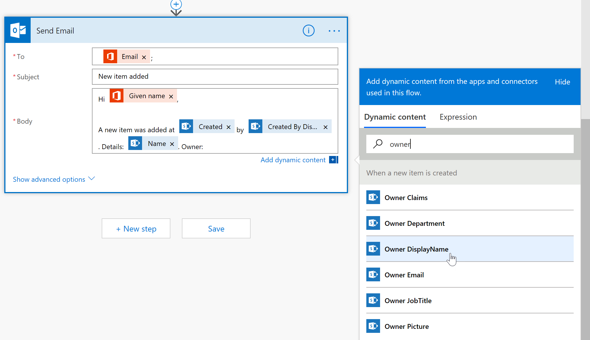
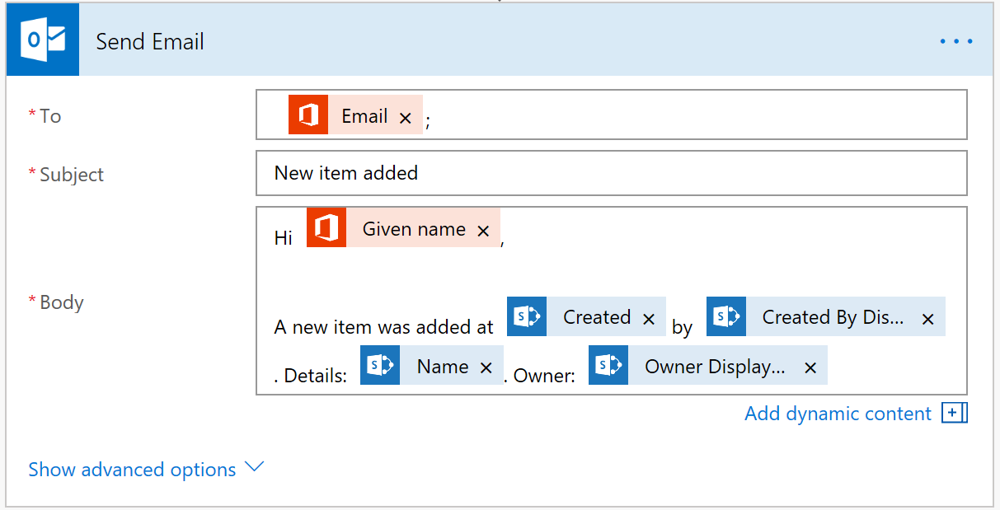

# Send an email when a new item is created or modified in a SharePoint list

Using Power Automate, you can easily automate day-to-day tasks or build repetitive tasks in SharePoint that help you stay productive.

In this tutorial, you will create a flow that sends an email when a new item is added or modified in a SharePoint list.

## Required setup

Before proceeding with these instructions, make sure your SharePoint site is set up with the [required lists and libraries](../../get-started/set-up-sharepoint-site-lists-libraries.md).

## Create a flow

1. In your SharePoint site, browse to the **Projects** list.
1. To create and manage flows for a list or a library, from the command bar, on the list or library page, select **Automate** > **Power Automate**. Selecting **Power Automate** expands to show you more options:

    * Create a flow
    * See your flows
    * Configure flows

    > [!NOTE]
    > If they are available for the list or library here, you may see other options such as **Set a reminder** and other flows.

    

1. Select **Create a flow**. In the **Create a flow** panel, you can explore various templates available for your list.

    

1. Select the template that reads:

    > [!NOTE]
    > Send a customized email when a new SharePoint list item is added.

    On a new browser tab, the **Power Automate** website appears and displays:
      * Template information
         * Name and description of the template.
      * Connection information
         * Various services this flow connect to.
         * The credentials those services will use to connect to.

1. Using the dropdowns, verify the connection information (**SharePoint Site Address** and **SharePoint List Name**) is accurate to ensure it uses your credentials.

    > [!NOTE]
    > A green checkmark icon indicates a connection to the service was succesfully made using your credentials.

    

1. To create the flow, select **Create Flow**. Any connections that require a connection are also attempted during this step. After you successfully create the flow, the flow details page appears where you can edit and modify the flow, if needed.

    > [!NOTE]
    > In this case, this flow that sends an email when new items are added to the list is now active, and runs whenever new items are added to the **Projects** list in the specified SharePoint site.

    

1. Click **Edit** in the top command bar to edit the flow in the flow designer.

    

1. To expand and view the configured properties, select the When the new item is created trigger. Note the input configured to the SharePoint site address and list name from where you created the flow.
1. In the **Send Email** action, to expand the action, select **Edit**. All the input is filled in with dynamic values from the **Get my profile** and **When the new item is created** actions.
1. Hover over the dynamic values to see what properties they reference. For example, hovering over **Email** shows that the property is read from the **Mail** property in **Get my profile**.

    

1. To save the flow, select **Save**.

## Test your flow

To test your flow, either add a new item in SharePoint list by adding a new item, or initiate the test run directly from the flow designer. To test the flow from the designer, follow these steps. Testing the flow from the designer helps you to quickly see the flow run as the flow is executed.

1. In the flow designer, on the top command bar, select **Test**.
1. In the **Test Flow** panel, select **I'll perform the trigger action**, and then select **Save & Test**.

    

    A message appears instructing you to add a new list item to the SharePoint list you selected.

    

1. You should have the browser tab with the **Projects** list opened already. If not, open a new browser tab, and browse to the **Projects** list.

    > [!NOTE]
    > Do not close the flow designer. Make sure you keep the flow designer browser tab open.

1. In the **Projects** list, on the command bar, select **New**, and add the following items, and then select **Save**:

    * Title: Project 4
    * Owner: Select a user from people picker

1. Switch to the flow designer tab. The flow run history appears. If all of your actions were executed successfully, a green checkmark icon appears aside every action.

    

1. Select the action to see the inputs and outputs used in the flow run. This is also a good place to see the actual values translated from those dynamic content properties used in that action.

    As a result of this flow, you receive an email regarding the new project information.

## Modify your flow

1. In the flow designer, to edit your flow, select **Edit**.
1. Select the **Send Email** action.
1. In the **Body** input, after the **Name** dynamic property, append the following string:

    * Owner:

1. While you are still editing the **Body** input, note the **dynamic content** list that appears aside the action.
1. In the **dynamic content** list, select values from the actions in your flow, (for example, in the **When the new item is created** trigger, the project owner information is available.
1. To add the owner information, in the **dynamic content** list, in the search box, search for **owner**.

    

1. In the results, select **Owner DisplayName**. As you can see, it also displays other information, such as email, job title, picture and more. Because the **Owner** is a **person** column in SharePoint, SharePoint passes along the person details as individual properties to the flow.

   The modified **Body** input appears like this with the included **Owner** info.

    

1. To test the flow, repeat these steps.

   You receive an email with the updated owner information in it.

## Next steps

Congratulations on creating your first flow!

In the next topic, we will use the same flow, and add the ability to interact with Microsoft Teams.
