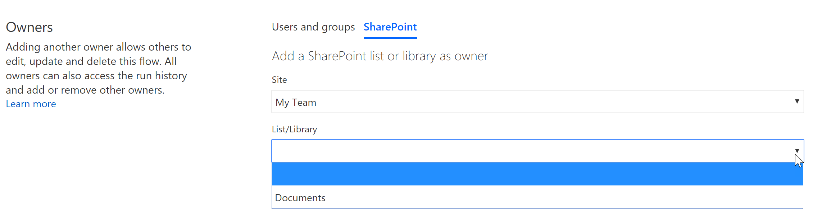
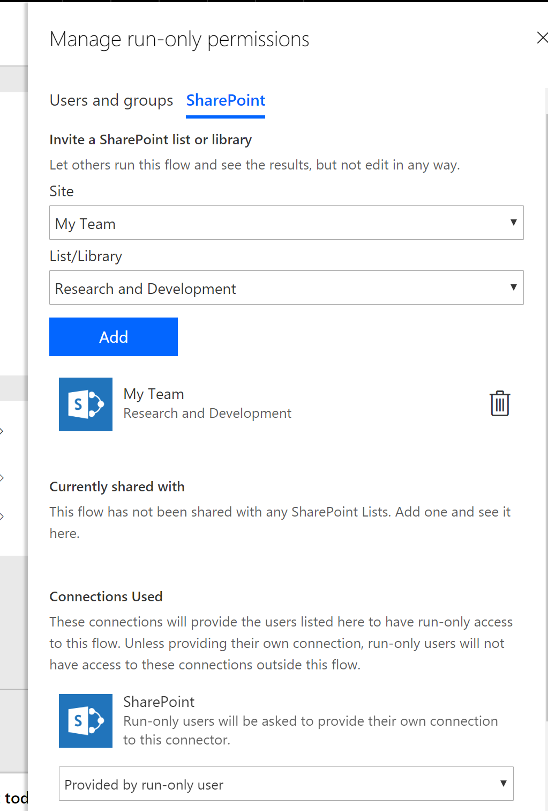
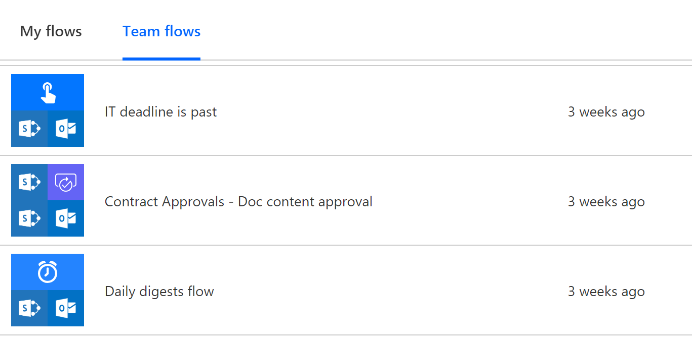

# Manage owners and users in your SharePoint list flows with Power Automate

Flows in Power Automate let you share your flows with others as owners or run-only users. Owners can modify flows, whereas run-only users can run or execute flows. Users' ability to run flows depends entirely on the trigger, specifically:

- For a selected item

- For a selected file

## Managing owners

To manage flow owners, go to your Power Automate site, and select the desired flow. Note the Owners card in the lower right. On that card, select **See all**.

Now you can add people as owners to that flow. Select the **Users and groups** tab, and enter names, email addresses, or user groups.

You can also add the SharePoint list as owners. This means that users who have edit permissions on that list automatically get owner access to the flow. This is a simple way to manage list flows as it helps you to easily share it with your team.

Select the **SharePoint** tab, select the **Site** from the dropdown, and then select the **list** from the dropdown. The site and list values depend on the trigger and actions you use in your flow. The appropriate sites and lists appear and are available for selection.

After you select **Add**, permissions are added to the flow, and these new owner(s) now appear.

## Managing run-only users

For triggers that support run-only users, below the **Owners** card, a **Manage run-only users** card appears. On the card, select **See all**.

Here, you can manage the run-only users or assign the users of the SharePoint list as run-only users. This means users who have read permissions to that list can run flows.

As an added bonus, you can also select the option for run-only users to provide their connection. This means that when the flow runs, the context of the user running the flow is passed instead of using the connection configured in the flow. This is very useful when you want items or documents created based on the user.

## Seeing your shared flows

After you share a flow, the flow becomes a Team flow. These flows appear under the **Team flows** tab on the Power Automate site.

