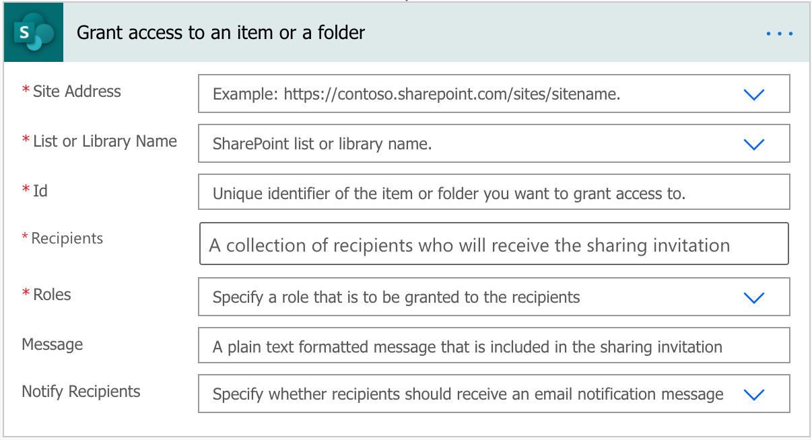
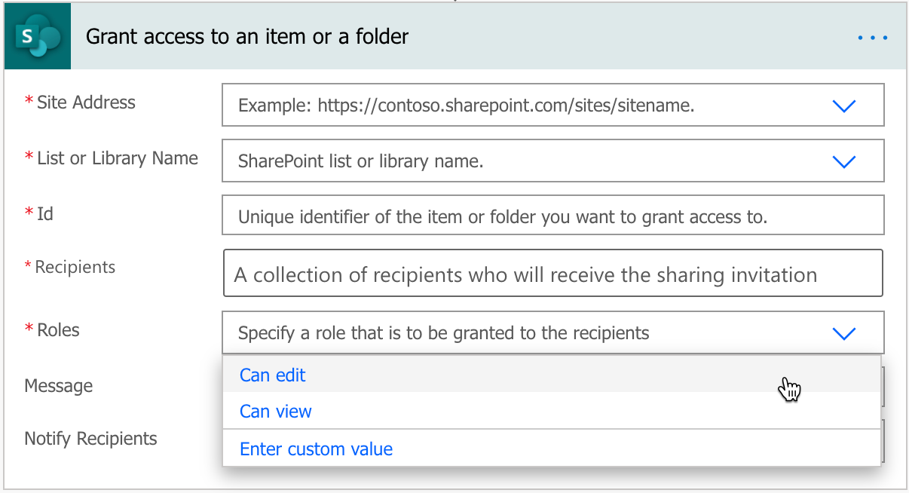
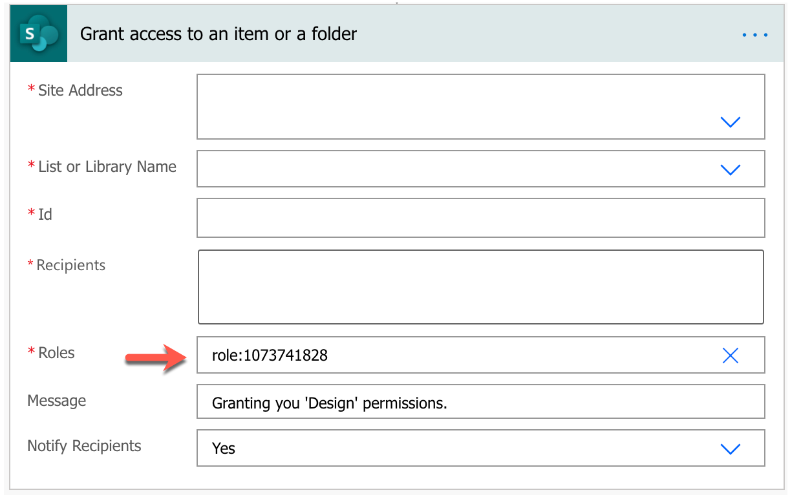
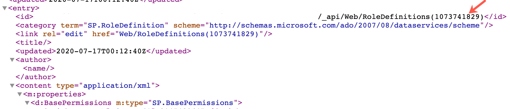
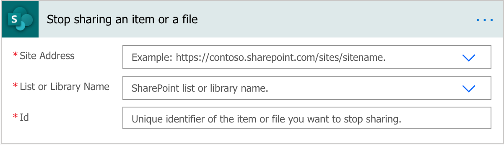

# Manage list item and file permissions with Power Automate flows
SharePoint connector in Power Automate provides the following actions to manage permissions of an individual list item in a list or a file in a document library. 
- Grant access to an item or a folder
- Create sharing link for a file or folder
- Stop sharing an item or a file

All of the above actions let you customize permissions for the item or a file to allow the right users to access that item or the file. To grant access or stop sharing, you will need to be a list owner of that list or library. That means, in your flow for these actions, you must connect to the list or library using a list owner user account.

## Grant access to an item or a folder
The 'Grant access to an item or a folder' action requires the following inputs:
- SharePoint site URL
- List or library name or identifier
- The item or the file identifier for which to grant access
- The recipients whom you want to grant access
- The permission role you want to grant



In the flow action, you can also include a message and choose to notify the recipients once they get access to the item or the file.  

> [!NOTE]
> 'Grant access to an item or a folder' does not support granting access to external users.

### Choosing a permission role to grant access
Depending on the user, you may want to grant them either access to edit or read. You can choose the right access in the Roles property. 



The permission roles map to [simplified standard SharePoint permission groups](https://docs.microsoft.com/en-us/sharepoint/modern-experience-sharing-permissions):
- Members
- Owners 

### Using custom-defined roles to grant access
In advanced scenarios where you need to specify a custom-defined permission role, you can do so in the flow action by entering a custom value for the *Roles* property in the following format:
```
roles:<role-id>
```



If you want to get the role id for the custom-defined role permission, you can do so by navigating to the SharePoint URL in your web browser and then search for that role.
```
https://<your-sharepoint-site>/_api/web/roledefinitions
```

For example:
```
https://contoso.microsoft.com/teams/itweb/_api/web/roledefinitions
```

You can find the role Id in the *category* property of an role item. 



## Grant access using sharing links
Instead of granting users access to files directly, you can provide access to a specific file using [shareable links](https://docs.microsoft.com/en-us/sharepoint/modern-experience-sharing-permissions#sharable-links). 

You can use the '[Create sharing link for a file or folder](https://docs.microsoft.com/en-us/sharepoint/dev/business-apps/power-automate/sharepoint-connector-actions-triggers#create-sharing-link-for-a-file-or-folder)' action to create shareable links for a given file. 

> [!NOTE]
> 'Create sharing link for a file or folder' only supports files or folders in a document library. List items are not supported yet.


When creating a shareable link using the action, you can specify:
- Link type
    - Type of sharing link - view and edit or view only 
- Link scope
    - Who gets access to the link - anyone with the link, including anonymous or people in your organization

## Stop sharing an item or a file
The 'Stop sharing an item or a file' action requires the following inputs:
- SharePoint site address
- List or library name or identifier
- The item or the file identifier for which to stop sharing



Applying this flow action will reset all permissions on that item or the file except for site owners. 