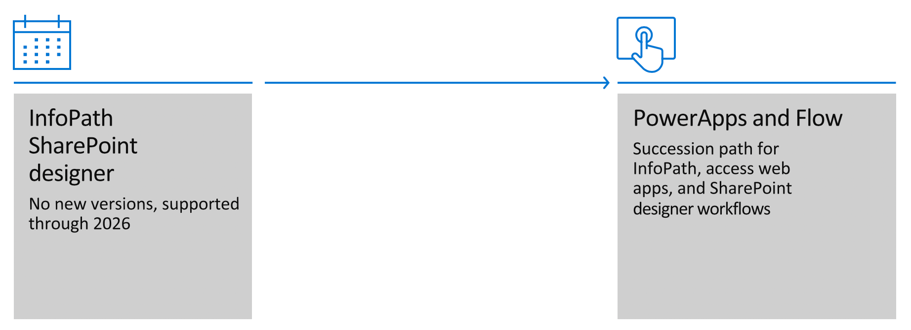

# Guidance: Migrate from classic workflows to Power Automate flows in SharePoint

## Current landscape

For business users building apps and process automations in SharePoint today and into the future, Microsoft **Power Apps** and *flows* within Microsoft **Power Automate** are your tools of choice. This natural transition is well underway as SharePoint evolves from InfoPath and SharePoint Designer workflows to the simplicity and versatility of Power Apps and flows within Power Automate.

Current landscape

This article specifically provides guidance about how to plan for transitioning from classic SharePoint Workflows to Power Automate flows.

## Classic workflows in SharePoint

Classic workflows in SharePoint constitutes two workflow systems namely

- SharePoint 2010 workflow ([deprecated in November 2020](https://support.microsoft.com/en-us/office/sharepoint-2010-workflow-retirement-1ca3fff8-9985-410a-85aa-8120f626965f))
- SharePoint 2013 workflow

While both workflow systems allow users to build and publish workflows in SharePoint, see the following key differences:

- SharePoint 2010 workflows, released along with SharePoint Server 2010, are hosted, and executed in SharePoint workflow runtime.
- SharePoint 2013 workflows, released along with SharePoint Server 2013, are hosted in SharePoint, and executed in Workflow Manager, that runs independently.

Users primarily use SharePoint Designer to author and publish workflows in SharePoint, while professional developers, looking to extend and build workflows, use Visual Studio to build and publish workflows in SharePoint.

> [!Important]
> After August 1, 2020, new Microsoft 365 customers can use SharePoint 2013 workflows or Power Automate. However, SharePoint 2013 workflows will follow a similar retirement path in the future, so it's highly recommended to use Power Automate or other supported solutions. If you want to learn more about the SharePoint 2013 workflow usage inside your tenant you can use the [Workflow 2013 Assessment tool](https://aka.ms/microsoft365assessmenttool). This tool will assess your tenant on SharePoint 2013 workflow usage and generates a Power BI report with the findings.

>[!Note]
>The SharePoint Migration Tool (SPMT) lets you migrate your SharePoint Server 2010 out of the box workflows to Power Automate.  [Learn more about migrating your SharePoint 2010 workflows with SPMT.](/sharepointmigration/spmt-workflow-overview)

## Modern workflows with Power Automate flows

Since the release of classic workflows, SharePoint and Microsoft 365 apps have evolved to provide compelling, flexible and more performant experiences. Modern experiences in SharePoint integrate with rest of the Microsoft 365 apps and services driving security, productivity, and collaboration.

[Power Automate](/power-automate/getting-started) helps users and businesses to create automated workflows between your favorite apps and services to get notifications, collect data, automate business policies and more.

> [!VIDEO https://www.youtube.com/embed/hCuxuUaGC6Y]

Using Microsoft Power Automate, SharePoint users can use the SharePoint Connector to create automations for when data changes in a list or a library. Users can build simple to complex workflows such as, but not limited to:

- Send an email when a new item is created in a list.
- Start approval when a new file is added in a library.

To create and author flows, users primarily use [Power Automate website](https://flow.microsoft.com/) while users can also [create flows from within SharePoint](https://support.microsoft.com/office/create-a-flow-for-a-list-or-library-in-sharepoint-or-onedrive-a9c3e03b-0654-46af-a254-20252e580d01?ui=en-us&rs=en-us&ad=us) or using the [Power Automate mobile app](/power-automate/mobile-create-flow).

To learn more about building workflows using Power Automate in SharePoint, start here: Business apps and Business process [Business apps and business process automation](../../introduction-to-sharepoint-business-process-integration.md).

## Pain points in moving between classic workflows in SharePoint and Power Automate flows

Many people feel there are significant gaps between SharePoint Designer (classic) workflows and Power Automate flows, but the list is not long. Of course, there are some workarounds you should consider in your planning as you move from classic workflows to Power Automate flows.

- **30 day run limit for flows** – SharePoint Designer workflows can run endlessly, but flows have a 30 day lifespan. Getting beyond this limitation means your flow will need to call itself in a re-entrant way to restart the clock ticking.
- **HTTP Connector** – If you make calls to SharePoint's REST API, then you can use  the ['Send HTTP Request to SharePoint'](../guidance/working-with-send-sp-http-request.md) action available in the SharePoint connector. Flow also has a generic HTTP connector (as an action), but it is a Premium connector. If you use HTTP calls extensively, you may want to create a “service account” user with a Power Automate license and run these flows with that user account. This also will make it easier to manage the set of flows you consider "enterprise" flows.
- **Reusable Flows** – Using some modular thinking, you can create a master flow which a flow per list or library can call to do the heavy lifting. (In some ways this is even preferable, as you can edit a flow which is used in many locations centrally.) Alternatively, you can use flow actions to discover all of the lists or libraries which match some criteria and run the flow on them all on a timer rather than based on events.
- **Workflow history storage** – Flows maintain a history in the context of the flow itself in the Power Automate dashboard. If you need tracking in your sites, you can have the flow log information in a list you create.
- **Impersonation** - In SharePoint 2010 workflows, you can add an impersonation step to act as a different user. This capability is not readily available in flows.

While these pain points do exist, you can see there are workarounds for each of them.

## Modern approvals with Power Automate flows

Approvals are the most common workflow scenario when it comes to automating business processes in SharePoint. Transitioning to Power Automate flows, approvals can be streamlined for data in SharePoint, Dynamics 365, forms, SQL, and so on. You can create approvals in your workflow, and view sent and received requests in a unified Actions center. Power Automate approvals enable users to customize flows and create approvals for the following types:

- [Single approvals](/power-automate/modern-approvals)
- [Sequential approvals](/power-automate/sequential-modern-approvals)
- [Parallel approvals](/power-automate/parallel-modern-approvals)

SharePoint approvals such as [page approvals](customize-page-approvals.md), [document approvals](require-doc-approval.md), and [hub association approvals](https://support.microsoft.com/office/set-up-your-sharepoint-hub-site-e2daed64-658c-4462-aeaf-7d1a92eba098#bkmk_managesiteassociationapprovals) are all integrated and powered by Power Automate flows, providing users the flexibility to customize the business process for each of the approval scenarios.

## Authoring classic workflows and flows

To fully understand the improvements of authoring workflows with flows in Power Automate and classic workflows using SharePoint Designer, users must first familiarize themselves with the workflow terminologies used by the workflow tools; that is, SharePoint Designer and Power Automate.

To author workflows, as outlined in the previous sections, users primarily use SharePoint Designer to author classic workflows and Power Automate website portal to author flows.

See the following tables that compare the workflow terminologies, triggers, and actions for most common workflow concepts and support.

While the following lists show some of the most common workflow capabilities, Power Automate offers many more features, and is actively updated with new features. We highly recommend visiting the following Power Automate websites for guided learning:

- [Microsoft SharePoint Connector in Power Automate](../sharepoint-connector-actions-triggers.md)
- [Learn Power Automate](/learn/browse/?products=power-automate&term=Power%20Automate&terms=Power%20Automate)
- [Power Automate Documentation](/power-automate)

### Workflow concepts

|                              Workflow concept                              |   SharePoint workflow    |            Power Automate            |
| :------------------------------------------------------------------------- | :----------------------- | :----------------------------------- |
| A condition that causes the workflow to run or execute                     | Start options and events | Trigger                              |
| Building blocks that allow users to customize workflow with business logic | Actions                  | Actions                              |
| Apply and perform conditional business logic in workflows                  | Conditions               | Conditions (available under Actions) |
| Get additional input from users when running manual workflows              | Initiation form          | Trigger Inputs                       |

### Workflow types

|   Workflow type    | SharePoint workflow | Power Automate flow |
| :----------------- | :------------------ | :------------------ |
| List workflows     | Yes                 | Yes                 |
| Library workflows  | Yes                 | Yes                 |
| Reusable workflows | Yes                 | Not available       |
| Site workflows     | Yes                 | Not available       |

### SharePoint integrations

|                      SharePoint integration                      | SharePoint workflow |       Power Automate flow       |
| :--------------------------------------------------------------- | :------------------ | :------------------------------ |
| Create a custom workflow from a list or library                  | Yes                 | Yes, only in Modern Experiences |
| Run or start a custom workflow for an item or a file or a folder | Yes                 | Yes, only in Modern Experiences |
| Create and respond to standard approval for an item or a file    | Yes                 | Yes                             |
| Create and respond to classic publishing page approvals          | Yes                 | Not available                   |
| Create and respond to modern page approvals                      | Not available       | Yes                             |
| Create and manage Hub Site association approval requests         | Not available       | Yes                             |

### List triggers

|            List trigger             | SharePoint workflow | Power Automate flow |
| :---------------------------------- | :------------------ | :------------------ |
| When an item is created             | Yes                 | Yes                 |
| When an item is modified            | Yes                 | Yes                 |
| When an item is created or modified | Not available       | Yes                 |
| Site workflows                      | Yes                 | Not available       |
| When an item is deleted             | Not available       | Yes                 |
| For a selected item                 | Yes                 | Yes                 |

### List actions

|           List action           | SharePoint workflow |           Power Automate flow           |
| :------------------------------ | :------------------ | :-------------------------------------- |
| Get items                       | Not available       | Yes                                     |
| Create an item                  | Yes                 | Yes                                     |
| Update an item                  | Yes                 | Yes                                     |
| Delete an item                  | Yes                 | Yes                                     |
| Copy a list item                | Yes                 | Yes, by reusing ‘Create an item' action |
| Get attachments                 | Not available       | Yes                                     |
| Get attachment content          | Not available       | Yes                                     |
| Add attachment                  | Not available       | Yes                                     |
| Delete attachment               | Not available       | Yes                                     |
| Set field value in current item | Yes                 | Yes, using ‘Update an item’ action      |
| Get changes for an item         | No                  | Yes                                     |

### File triggers

|                  List action                   |   SharePoint workflow    | Power Automate flow |
| :--------------------------------------------- | :----------------------- | :------------------ |
| When a file is created                         | Yes, using List triggers | Yes                 |
| When a file is created in a folder             | Not available            | Yes                 |
| When a file is modified                        | Yes, using List triggers | Yes                 |
| When a file is created or modified             | Not available            | Yes                 |
| When a file is created or modified in a folder | Not available            | Yes                 |
| When a file is deleted                         | Not available            | Yes                 |
| For a selected file                            | Yes, using List triggers | Yes                 |

### File actions

|               File action                |   SharePoint workflow    | Power Automate flow |
| :--------------------------------------- | :----------------------- | :------------------ |
| Get files                                | Not available            | Yes                 |
| Create file content                      | Not available            | Yes                 |
| Get file properties                      | Not available            | Yes                 |
| Create a file                            | Not available            | Yes                 |
| Create new folder                        | Not available            | Yes                 |
| Update file properties                   | Yes, using List triggers | Yes                 |
| Delete a file                            | Yes, using List triggers | Yes                 |
| Copy file                                | Not available            | Yes                 |
| Copy folder                              | Not available            | Yes                 |
| Move file                                | Not available            | Yes                 |
| Get changes for a file (properties only) | No                       | Yes                 |

### Document management actions

|          Document management action          | SharePoint workflow | Power Automate flow |
| :------------------------------------------- | :------------------ | :------------------ |
| Check in file                                | Yes                 | Yes                 |
| Check out file                               | Yes                 | Yes                 |
| Discard checkout                             | Yes                 | Yes                 |
| Delete drafts                                | Yes                 | Not available       |
| Wait for change in document check out status | Yes                 | Not available       |

### Permissions management actions

|      Permissions management action       | SharePoint workflow | Power Automate flow |
| :--------------------------------------- | :------------------ | :------------------ |
| Grant access to an item or a folder      | Yes                 | Yes                 |
| Stop sharing an item or a file           | Yes                 | Yes                 |
| Create sharing link for a file or folder | Not available       | Yes                 |

### Approval actions

|                      Approval action                       | SharePoint workflow | Power Automate flow |
| :--------------------------------------------------------- | :------------------ | :------------------ |
| Set content approval status of an item or a file or a page | Yes                 | Yes                 |
| Create and wait for approval for an item or a file         | Yes                 | Yes                 |
| Include attachments in approval requests                   | Not available       | Yes                 |
| Respond to approvals                                       | Yes                 | Yes                 |
| Create sequential approvals                                | Yes                 | Yes                 |
| Create parallel approvals                                  | Yes                 | Yes                 |
| Cancel approvals                                           | Yes                 | Yes                 |
| Reassign approvals                                         | Yes                 | Yes                 |
| Custom approval buttons                                    | Yes                 | Yes                 |
| Unified approval center                                    | Not available       | Yes                 |

### Workflow controls capabilities

|                 Workflow controls capability                 | SharePoint workflow |           Power Automate flow           |
| :----------------------------------------------------------- | :------------------ | :-------------------------------------- |
| Workflow primitives: Loops, do until, switch-case, parallels | Yes                 | Yes                                     |
| Workflow stage                                               | Yes                 | Yes, works only with Modern Permissions |
| Schedule-based flows                                         | Yes                 | Yes                                     |
| Variables                                                    | Yes                 | Yes                                     |
| Email designer and rich text editor                          | Not available       | Yes                                     |
| Versioning of workflows                                      | Not available       | Not available                           |
| Copy/paste actions                                           | Yes                 | Yes                                     |

## Workflow administration

|                 Workflow administration                  |                                        SharePoint workflow                                         |       Power Automate flow        |
| :------------------------------------------------------- | :------------------------------------------------------------------------------------------------- | :------------------------------- |
| Central location to view all workflows                   | Yes, only available to view for a given list or library                                            | Yes, 'My flows' lists user flows |
| Share workflows with list or library users               | Yes                                                                                                | Yes                              |
| Share workflows with users                               | Not available                                                                                      | Yes                              |
| Save a copy of workflow to create a copy of the workflow | Not available                                                                                      | Yes                              |
| Workflow versioning                                      | Not available                                                                                      | No                               |
| Create a workflow with elevated permissions              | Yes, by granting permissions to workflow app and then using App Step action and SharePoint Add-ins | Not available                    |
