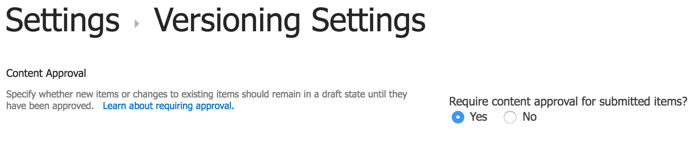
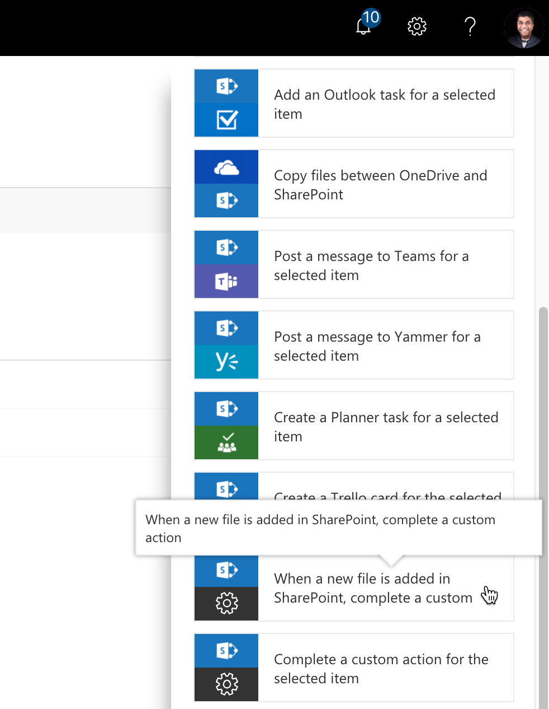
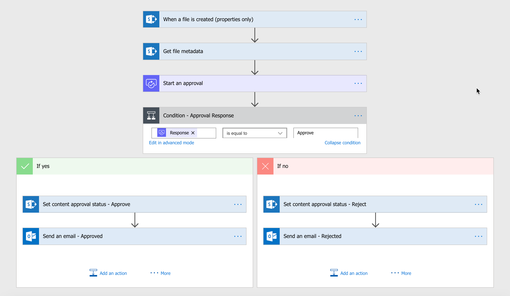
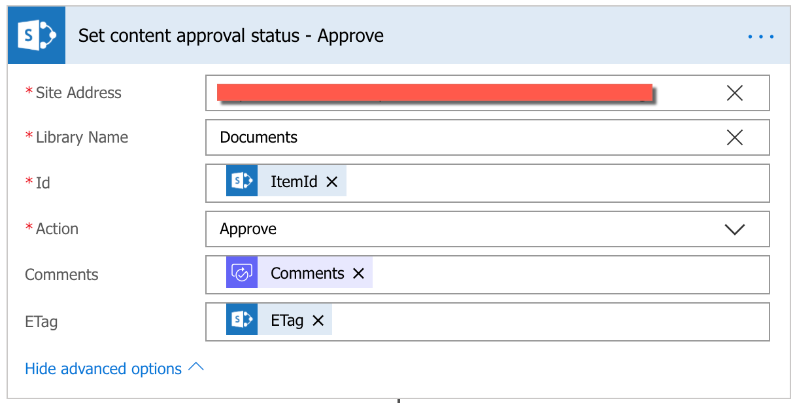
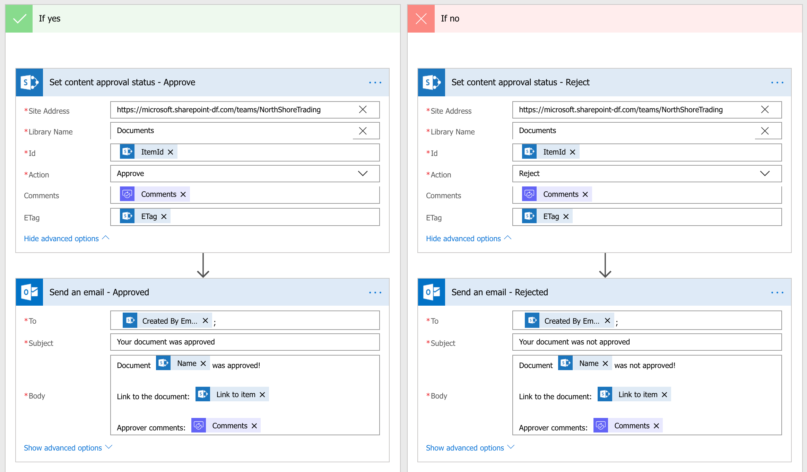

# Require approval of documents in SharePoint using Power Automate

Documents that contain sensitive information often require approvals. With the content approval feature in SharePoint, you can put a simple approval process for documents in a specific document library. Using this content approval process, documents pending approval will not be visible to users until they are approved.

Manage the content approval settings in the library settings page:

Settings > Versioning settings > Require content approval for submitted items

After this setting is enabled, when users upload documents to this specific library, the document’s **Approval Status** is either in:

- **Draft** (if minor and major versions are enabled) or
- **Pending** (if only the major version is enabled) state

You can always visit the document library to approve and reject documents but this exercise is tedious. It requires receiving notifications about the pending document(s), finding the appropriate document(s) for approval, then identifying approvers, and finally generating the command to approve/reject the document(s).

Alternatively, why not automate this approval process using a flow?

## Content approval flow in Power Automate

You can automate this entire content approval process using an approval flow. When approved, the content approval status of the document is automatically set to **Approved**; if rejected, the flow sets the content approval status of the document to **Rejected**.

To set the content approval status of the document, with the SharePoint connector, use the **Set content approval status** action in the flow.

The following actions occur:

1. Power Automate uses a SharePoint *trigger* when a new file is added to the library.
1. *Get file metadata* provides the *ETag* property (along with many others) required when dealing with content approvals.
    - ETag is a special identifier that identifies the specific version of that item pending approval.
1. Start an approval action:
    - Include people for approving the documents.
    - Approvers should be either **Site Owners** or **Site Members**.
    - If you are managing users in SharePoint groups, make sure approvers are part of the **Design** permission-level group.
1. If approval response is approved:
    - Set content approval status of the document to **Approved**.
    - Send an email to the document author regarding the approval along with any comments.
1. If approval response is not approved:
    - Set content approval status of the document to **Rejected**.
    - Send an email to the document author regarding the rejection along with any comments.

## Setting up the flow in Power Automate

Using the following template, create a flow in Power Automate.

1. In the SharePoint library, from the command bar, select **Integrate** > **Power Automate** > **Create a flow**.
1. Next, select the template: **When a new file is added in SharePoint, complete a custom action**.

1. Add the actions as described in the previous steps.

## Set content approval status action

The content approval action requires the following entries:

- SharePoint site
- Library name
- Identifier of the item (in this case, the document ID)
- Content approval action
- Comments

To see the *ETag*, expand **Show advanced options**.

> [!NOTE]
> While the content approval action help says that ETag is optional, it is required for documents and pages while it may be optional for list items.

You must ensure you enter the correct site and library name. However, you can get the rest of the values from the previous actions in the flow.

- Identifier
    - Using the *Id* property from the *trigger output*
- Comments
    - Using the *comments* property from the *approval response*
    - ETAG
- Using the *ETag* property from the *Get file metadata* action output

You can now use the content approval status action to approve and reject the document based on the approval response.

The end result is that:

1. After the flow is triggered, approvers get an email to approve/reject the document with the document link.
1. Approvers can now:
    - If your email client supports Outlook-actionable messages: Approve it within the email using actionable messages if your Outlook client supports it.
    - If your email client does not support Outlook-actionable messages: Select **Approve** or **Reject** that takes you to Power Automate site where you can approve or reject the document.
1. After approval or rejection:
    - Document creator receives an email with the approval status along with the approval comments.

This is an effective way to automate document approval in SharePoint using Power Automate! Use this procedure for list items and pages as well.

