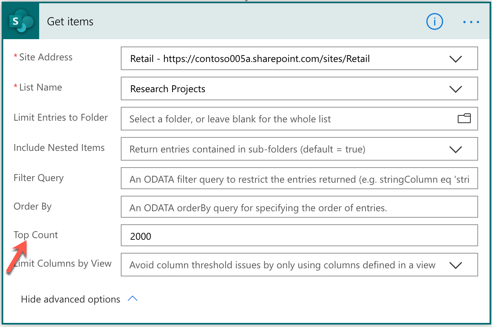
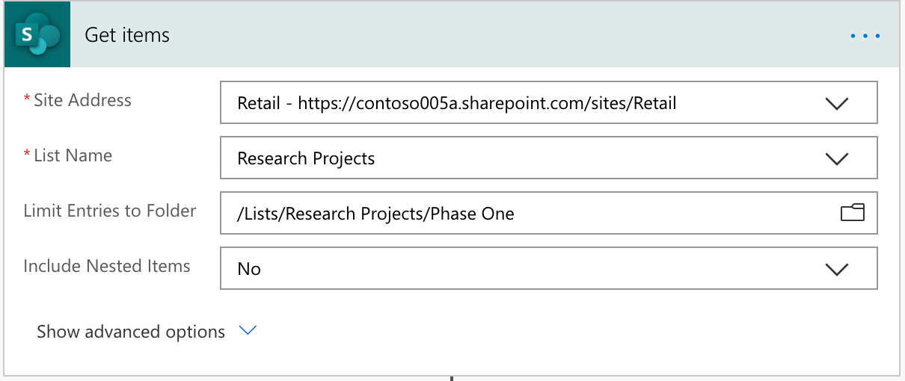
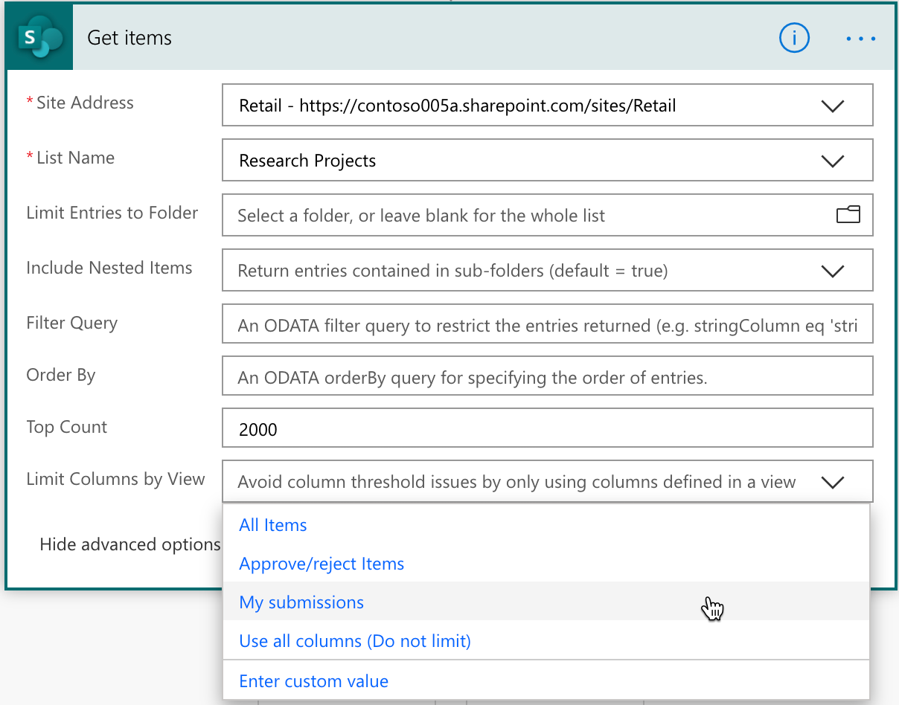
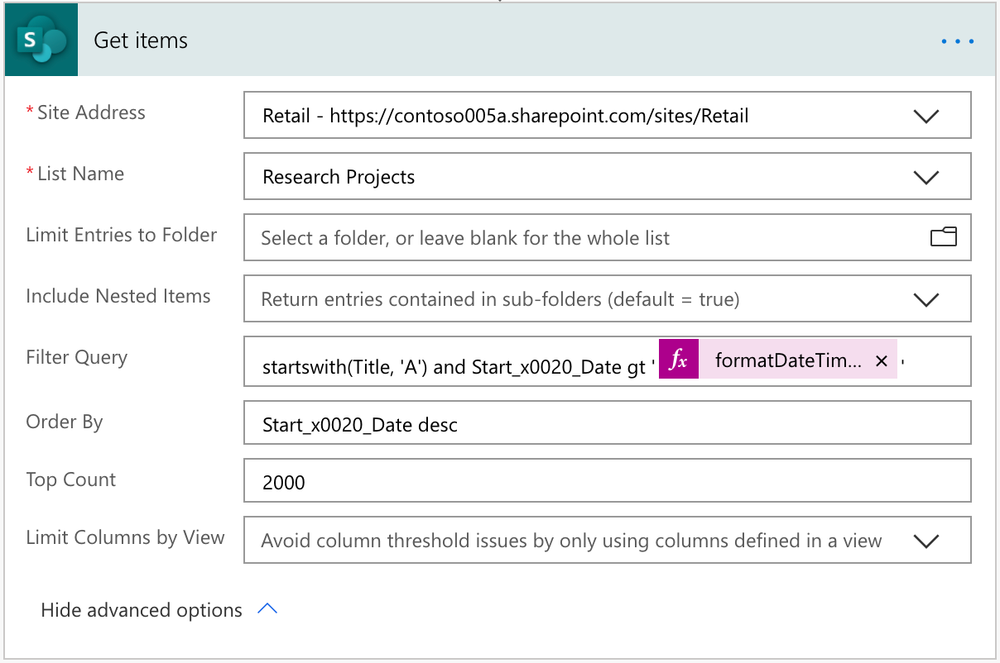

# In-depth analysis into **Get items** and **Get files** SharePoint actions for flows in Power Automate

The **Get items** and **Get files** SharePoint actions for flows in Power Automate let you get items from a list and a library, respectively. Though they are different actions, the capabilities for both the actions are same. This article describes how to work with these actions.

## Decide if you are working with lists or libraries

First, and of primary consideration, the **Get items** action only works with lists, whereas the **Get files** action only works with libraries.

## Item limits
The default item limit is 100 and items are paginated by default as well. 

If you are using the default options, and simply specifying the site address and list or library name, Power Automate returns 100 items from the list or library.

If you are working with large lists, you can increase this limit up to the list view threshold limit of 5,000.

To specify the number of items to be returned, expand the **Advanced options**, and specify the number in the **Top Count** action property.



If you go beyond 5,000 item limit, Power Automate fails and generates an error dialog.

## Limit items to a specific folder
By default, this action returns all items or files in the list or library, recursively, from all folders, if available. You can change this behavior by doing the following:
* To select a specific folder in the list or library, use _Limit Entries_ to Folder property. 
* To limit entries to that specific folder or within all sub-folders, use _Include Nested Items_ property.



## Limit columns returned by view
List views is a useful configuration where you can customize what columns to show along with any other conditions or groupings of list items. This is not only useful for users, but also for any other computation you want to do using that view data.

To retrieve the list items along with their columns, select the **Get items** and **Get files** actions. However, retrieving the columns retrieves all the columns. While this is useful, it could be excessive when you only need to work with a specific set of columns configured in a specific view.

To limit your column retrieval, in the **Get items** and **Get files** actions, expand **Advanced options**, select the **Limit columns by view** option. While retrieving list items, you can now limit the columns by view.



This option is useful in cases where you want to perform a set of operations on specific data, like in the previous example where you want a view for different events. In this case, working with food events, it would be optimal to limit the columns by the *Food Events*.

## Filter queries
This action also supports specifying filter queries so you can filter items on the server. Using filter queries are as functional as filtering the returned results in your flow in Power Automate.

We support the following OData filter queries in SharePoint that you can use:

- Filter by column name:

```
Location eq 'Midwest'
```

*Location* is the column name used with the operator equals (eq), and *Midwest* is the value of the column.

Other examples:

* Location eq 'Midwest' and Status eq 'Approved'
* startswith(Title, 'A')
* startswith(Title, 'A') and Start_x0020_Date gt 'formatDateTime(utcNow(),'yyyy-MM-dd')'
  * formatDateTime(utcNow(),'yyyy-MM-dd') is an expression.
* Country/Title eq 'New Zealand'
  * Country is a lookup column in the list and Title is a column in the referenced list. 



We support the following query methods and operators.

### Numeric comparisons
* lt
  * less than
* le
  * less than or equals
* gt
  * greater than
* ge
  * greater than or equals
* eq
  * equals
* ne
  * not equal

### String comparisons
* startsWith
* substringOf
* eq
* ne

### Date and time functions
* day()
* month()
* year()
* hour()
* minute()
* second()

## Order by query
To order items based off of a column either in ascending or descending order, you can also specify an order by query. For example:

* Start_x0020_Date desc
* Title asc

Spaces in the column name are replaced with `_x0020_` (0 is numeral zero).


The format is the column name followed by asc or desc depending on ascending or descending order, respectively.


