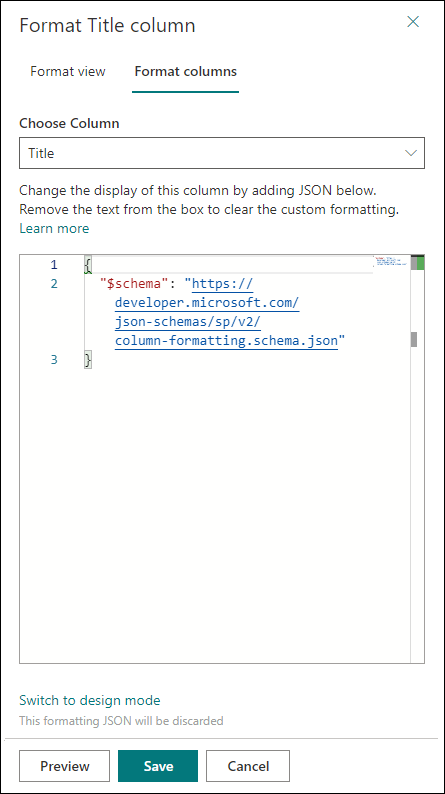
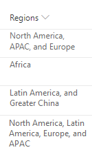

# Use column formatting to customize SharePoint

You can use column formatting to customize how fields in SharePoint lists and libraries are displayed. To do this, you construct a JSON object that describes the elements that are displayed when a field is included in a list view, and the styles to be applied to those elements. The column formatting does not change the data in the list item or file; it only changes how it’s displayed to users who browse the list. Anyone who can create and manage views in a list can use column formatting to configure how view fields are displayed. 

For example, a list with the fields Title, Effort, Assigned To, and Status with no customizations applied might look like this: 


A list with the appearance of the **Effort**, **Assigned To**, and **Status** fields customized via column formatting might look like this:


> [!TIP]
> Samples demonstrated in this article and numerous other community samples are available from a GitHub repository dedicated for open-sourced column formatting definitions. You can find these samples from the [sp-dev-column-formatting](https://github.com/SharePoint/sp-dev-column-formatting) repository at [SharePoint](https://github.com/SharePoint) GitHub organization.

## How is column formatting different than the Field Customizer?

Both column formatting and [SharePoint Framework Field Customizer](https://docs.microsoft.com/en-us/sharepoint/dev/spfx/extensions/get-started/building-simple-field-customizer) extensions enable you to customize how fields in SharePoint lists are displayed. The Field Customizer is more powerful because you can use it to write any code that you want to control how a field is displayed. 

Column formatting is more easily and broadly applied. However, it is less flexible, because it does not allow for custom code; it only allows for certain predefined elements and attributes. 

The following table compares column formatting and the Field Customizer.

| Field type        | Column formatting          | Field Customizer  |
| ------------- |:-------------| :-----|
| Conditional formatting based on item values and value ranges      | Supported | Supported |
| Action links       | Support for static hyperlinks that do not launch script      |  Support for any hyperlink, including those that invoke custom script   |
| Data visualizations | Support for simple visualizations that can be expressed using HTML and CSS      |   Support for arbitrary data visualizations  |

If you can accomplish your scenario by using column formatting, it’s typically quicker and easier to do that than to use a Field Customizer. Anyone who can create and manage views in a list can use column formatting to create and publish customizations. Use a Field Customizer for more advanced scenarios that column formatting does not support.

## Get started with column formatting

To open the column formatting pane, open the drop-down menu under a column. Under **Column Settings**, choose **Format this column**.

If no one has used column formatting on the column you selected, the pane will look like the following.



A field with no formatting specified uses the default rendering. To format a column, enter the column formatting JSON in the box.

To preview the formatting, select **Preview**. To commit your changes, select **Save**. When you save, anyone who views the list will see the customization that you applied.

The easiest way to use column formatting is to start from an example and edit it to apply to your specific field. The following sections contain examples that you can copy, paste, and edit for your scenarios. There are also several samples available in the [SharePoint/sp-dev-column-formatting repository](https://github.com/SharePoint/sp-dev-column-formatting).

## Display field values (basic)

The simplest column formatting is one that places the value of the field inside a `<div />` element. This example works for number, text, choice, and date fields:

```JSON
{
   "$schema": "https://developer.microsoft.com/json-schemas/sp/column-formatting.schema.json",
   "elmType": "div",
   "txtContent": "@currentField"
}
```

<br/>

Some field types require a bit of extra work to retrieve their values. Person fields are represented in the system as objects, and a person’s display name is contained within that object’s **title** property. This is the same example, modified to work with the person field:

```JSON
{
   "$schema": "https://developer.microsoft.com/json-schemas/sp/column-formatting.schema.json",
   "elmType": "div",
   "txtContent": "@currentField.title"
}
```

<br/>

Lookup fields are also represented as objects; the display text is stored in the **lookupValue** property. This example works with a lookup field:

```JSON
{
   "$schema": "https://developer.microsoft.com/json-schemas/sp/column-formatting.schema.json",
   "elmType": "div",
   "txtContent": "@currentField.lookupValue"
}
```

## Apply conditional formatting
You can use column formatting to apply styles, classes, and icons to fields, depending on the value inside those fields.

### Conditional formatting based on a number range (basic)

The following image shows an example of conditional formatting applied to a number range.


This example uses an Excel-style conditional expression (`=if`) to apply a class (`sp-field-severity--warning`) to the parent `<div />` element when the value in the current field is less than or equal to 70. This causes the field to be highlighted when the value is less than or equal to 70, and appear normally if it's greater than 70.

```JSON
{
  "$schema": "https://developer.microsoft.com/json-schemas/sp/column-formatting.schema.json",
  "elmType": "div",
  "attributes": {
    "class": "=if(@currentField <= 70,'sp-field-severity--warning', '')"
  },
  "children": [
    {
      "elmType": "span",
      "style": {
        "display": "inline-block",
        "padding": "0 4px"
      },
      "attributes": {
        "iconName": "=if(@currentField <= 70,'Error', '')"
      }
    },
    {
      "elmType": "span",
      "txtContent": "@currentField"
    }
  ]
}
```

### Conditional formatting based on the value in a text or choice field (advanced)

The following image shows an example of conditional formatting applied to a text or choice field:


You can apply conditional formatting to text or choice fields that might contain a fixed set of values. The following example applies different classes depending on whether the value of the field is Done, In Review, Has Issues, or another value. This example applies a CSS class (`sp-field-severity--low, sp-field-severity--good, sp-field-severity--warning, sp-field-severity--severeWarning, sp-field-severity--blocked`) to the  `<div />` based on the field's value. It then outputs a `<span />` element with an `IconName` attribute. This attribute automatically applies another CSS class to that `<span />` that shows an [Office UI Fabric](https://dev.office.com/fabric#/) icon inside that element. Finally, another `<span />` element is output that contains the value inside the field.

This pattern is useful when you want different values to map to different levels of urgency or severity. You can start from this example and edit it to specify your own field values and the styles and icons that should map to those values.

```JSON
{
  "$schema": "https://developer.microsoft.com/json-schemas/sp/column-formatting.schema.json",
  "elmType": "div",
  "attributes": {
    "class": "=if(@currentField == 'Done', 'sp-field-severity--good', if(@currentField == 'In progress', 'sp-field-severity--low', if(@currentField == 'In review', 'sp-field-severity--warning', if(@currentField == 'Has issues', 'sp-field-severity--severeWarning', 'sp-field-severity--blocked')))) + ' ms-fontColor-neutralSecondary'"
  },
  "children": [
    {
      "elmType": "span",
      "style": {
        "display": "inline-block",
        "padding": "0 4px"
      },
      "attributes": {
        "iconName": "=if(@currentField == 'Done', 'CheckMark', if(@currentField == 'In progress', 'Forward', if(@currentField == 'In review', 'Error', if(@currentField == 'Has issues', 'Warning', 'ErrorBadge'))))"
      }
    },
    {
      "elmType": "span",
      "txtContent": "@currentField"
    }
  ]
}
```

## Apply formatting based on date ranges

Because dates are often used to track deadlines and key project timelines, a common scenario is to apply formatting based on the value in a date/time field. To apply formatting based on the value in a date/time field, apply the following patterns.

### Formatting an item when a date column is before or after today's date (advanced)

The following image shows a field with conditional date formatting applied:


This example colors the current field red when the value inside an item's DueDate is before the current date/time. Unlike some of the previous examples, this example applies formatting to one field by looking at the value inside another field. Note that DueDate is referenced using the `[$FieldName]` syntax. FieldName is assumed to be the internal name of the field. This example also takes advantage of a special value that can be used in date/time fields - `@now`, which resolves to the current date/time, evaluated when the user loads the list view.

> [!NOTE]
> If you have spaces in the field name, those are defined as `_x0020_`. For example, a field named "Due Date" should be referenced as `$Due_x0020_Date`.

```JSON
{
  "$schema": "https://developer.microsoft.com/json-schemas/sp/column-formatting.schema.json",
  "elmType": "div",
  "debugMode": true,
  "txtContent": "@currentField",
  "style": {
    "color": "=if([$DueDate] <= @now, '#ff0000', '')"
  }
}
```

### Formatting items based on arbitrary dates (advanced)

To compare the value of a date/time field against a date that's not `@now`, follow the pattern in the following example. The following example colors the current field red if the due date was <= tomorrow. This is accomplished using date math. You can add milliseconds to any date and the result will be a new date. For example, to add a day to a date, you'd add (24\*60\*60\*1000 = 86,400,000). 

This example demonstrates an alternate syntax to express a conditional expression, using the ternary (`?`) operator inside an abstract syntax tree.

```JSON
{
   "$schema": "https://developer.microsoft.com/json-schemas/sp/column-formatting.schema.json",
   "elmType": "div",
   "txtContent": "@currentField",
   "style": {
      "color": {
         "operator": "?",
         "operands": [
            {
               "operator": "<=",
               "operands": [
                  "[$DueDate]",
                  {
                     "operator": "+",
                     "operands": [
                        "@now",
                        86400000
                     ]
                  }
               ]
            },
            "#ff0000",
            ""
         ]
      }
   }
}
```

<br/>


To compare a date/time field value against another date constant, use the `Date()` method to convert a string to a date. The following example colors the current field red if the value in the DueDate field is before 3/22/2017.

```JSON
{
   "$schema": "https://developer.microsoft.com/json-schemas/sp/column-formatting.schema.json",
   "elmType": "div",
   "txtContent": "@currentField",
   "style": {
      "color": {
         "operator": "?",
         "operands": [
            {
               "operator": "<=",
               "operands": [
                  "[$DueDate]",
                  {
                     "operator": "Date()",
                     "operands": [
                        "3/22/2017"
                     ]
                  }
               ]
            },
            "#ff0000",
            ""
         ]
      }
   }
}
```

## Create clickable actions

You can use column formatting to provide hyperlinks that go to other webpages, or start custom functionality. This functionality is limited to static links that can be paramaterized with values from fields in the list. You can't use column formatting to output links to protocols other than `http://`, `https://`, or `mailto:`.

### Turn field values into hyperlinks (basic)

This example shows how to turn a text field that contains stock ticker symbols into a hyperlink that targets the Yahoo Finance real-time quotes page for that stock ticker. The example uses a `+` operator that appends the current field value to the static hyperlink <a>http://finance.yahoo.com/quote/</a>. You can extend this pattern to any scenario in which you want users to view contextual information related to an item, or you want to start a business process on the current item, as long as the information or process can be accessed via a hyperlink parameterized with values from the list item.


```JSON
{
   "$schema": "https://developer.microsoft.com/json-schemas/sp/column-formatting.schema.json",
   "elmType": "a",
   "txtContent": "@currentField",
   "attributes": {
      "target": "_blank",
      "href": "='http://finance.yahoo.com/quote/' + @currentField"
   }
}
```

### Add an action button to a field (advanced)

The following image shows action buttons added to a field.


You can use column formatting to render quick action links next to fields. The following example, intended for a person field, renders two elements inside the parent `<div />` element:

- A `<span />` element that contains the person’s display name.
- An `<a />` element that opens a mailto: link that creates an email with a subject and body populated dynamically via item metadata. The `<a />` element is styled using the `ms-Icon`, `ms-Icon—Mail`, and `ms-QuickAction` [Fabric](https://developer.microsoft.com/en-us/fabric) classes to make it look like a clickable email icon. 

```JSON
{
    "$schema": "https://developer.microsoft.com/json-schemas/sp/column-formatting.schema.json",
    "elmType": "div",
    "children": [
        {
            "elmType": "span",
            "style": {
                "padding-right": "8px"
            },
            "txtContent": "@currentField.title"
        },
        {
            "elmType": "a",
            "attributes": {
                "iconName": "Mail",
                "class": "sp-field-quickAction",
                "href": {
                    "operator": "+",
                    "operands": [
                        "mailto:",
                        "@currentField.email",
                        "?subject=Task status&body=Hey, how is your task coming along?.\r\n---\r\n",
                        "@currentField.title",
                        "\r\nClick this link for more info. http://contoso.sharepoint.com/sites/ConferencePrep/Tasks/Prep/DispForm.aspx?ID=",
                        "[$ID]"
                    ]
                }
            }
        }
    ]
}
```

## Create simple data visualizations

Use column formatting to combine conditional and arithmetical operations to achieve basic data visualizations.

### Format a number column as a data bar (advanced)

The following image shows a number column formatted as a data bar.


This example applies `background-color` and `border-top` styles to create a data bar visualization of `@currentField`, which is a number field. The bars are sized differently for different values based on the way the `width` attribute is set - it's set to `100%` when the value is greater than 95, and `(@currentField * 100 / 95)%` otherwise. To fit this example to your number column, you can adjust the boundary condition (`20`) to match the maximum anticipated value inside the field, and change the equation to specify how much the bar should grow depending on the value inside the field.

```JSON
{
    "$schema": "https://developer.microsoft.com/json-schemas/sp/column-formatting.schema.json",
    "elmType": "div",
    "txtContent": "@currentField",
    "attributes": {
        "class": "sp-field-dataBars"
    },
    "style": {
        "width": "=if(@currentField > 95, '100%', toString(@currentField * 100 / 95) + '%')"
    }
}
```

### Show trending up/trending down icons (advanced)

The following image shows a list with trending up/trending down icons added:


This example relies on two number fields, `Before` and `After`, for which the values can be compared. It shows the appropriate trending icon next to the `After` field, depending on that field's value compared to the value in `Before`.  `sp-field-trending--up` is used when `After`'s value is higher; `sp-field-trending--down` is used when `After`'s value is lower.

```JSON
{
    "$schema": "https://developer.microsoft.com/json-schemas/sp/column-formatting.schema.json",
    "elmType": "div",
    "children": [
        {
            "elmType": "span",
            "attributes": {
                "class": {
                    "operator": "?",
                    "operands": [
                        {
                            "operator": ">",
                            "operands": [
                                "[$After]",
                                "[$Before]"
                            ]
                        },
                        "sp-field-trending--up",
                        "sp-field-trending--down"
                    ]
                },
                "iconName": {
                    "operator": "?",
                    "operands": [
                        {
                            "operator": ">",
                            "operands": [
                                "[$After]",
                                "[$Before]"
                            ]
                        },
                        "SortUp",
                        {
                            "operator": "?",
                            "operands": [
                                {
                                    "operator": "<",
                                    "operands": [
                                        "[$After]",
                                        "[$Before]"
                                    ]
                                },
                                "SortDown",
                                ""
                            ]
                        }
                    ]
                }
            }
        },
        {
            "elmType": "span",
            "txtContent": "[$After]"
        }
    ]
}
```

## Create a button to launch a Flow

The following screenshot shows a list with a Flow button added to the Action column:


You can use column formatting to create buttons that, when selected, run Flows on the corresponding list item.  If the Flow is configured to gather data from the end user before running, the Flow Launch Panel will be displayed after choosing the button.  Otherwise, the Flow will just run.

To use the sample below, you must substitute the ID of the Flow you want to run.  This ID is contained within the `customRowAction` attribute inside the `button` element.  To obtain a Flow's ID:

1. Choose Flow > See your flows in the SharePoint list where the Flow is configured.
2. Choose the Flow you want to run.
3. Copy the ID from the end of the URL.  

```JSON
{
    "$schema": "https://developer.microsoft.com/json-schemas/sp/column-formatting.schema.json",
    "elmType": "span",
    "style": {
        "color": "#0078d7"
    },
    "children": [
        {
            "elmType": "span",
            "attributes": {
                "iconName": "Flow"
            }
        },
        {
            "elmType": "button",
            "style": {
                "border": "none",
                "background-color": "transparent",
                "color": "#0078d7",
                "cursor": "pointer"
            },
            "txtContent": "Send to Manager",
            "customRowAction": {
                "action": "executeFlow",
                "actionParams": "{\"id\": \"183bedd4-6f2b-4264-855c-9dc7617b4dbe\"}"
            }
        }
    ]
}
```

## Formatting multi-value fields
You can use column formatting to apply styles to each member of a multi-value field of type Person, Lookup and Choice.

### Basic text formatting
The following image shows an example of multi-value field formatting applied to a Person field.


This example uses the `length` operator to detect the number of members of the field, and used `join` operator to concatenate the email addresses of all members. This example hides the button when no member is found, and takes care of plurals in the text.

```json
{
    "$schema": "https://developer.microsoft.com/json-schemas/sp/column-formatting.schema.json",
    "elmType": "a",
    "style": {
        "display": "=if(length(@currentField) > 0, 'flex', 'none')"
    },
    "attributes": {
        "href": {
            "operator": "+",
            "operands": [
                "mailto:",
                "=join(@currentField.email, ';')"
            ]
        }
    },
    "children": [
        {
            "elmType": "span",
            "style": {
                "display": "inline-block",
                "padding": "0 4px"
            },
            "attributes": {
                "iconName": "Mail"
            }
        },
        {
            "elmType": "span",
            "txtContent": {
                "operator": "+",
                "operands": [
                    "Send email to ",
                    {
                        "operator": "?",
                        "operands": [
                            "=length(@currentField) == 1",
                            "@currentField.title",
                            "='all ' + length(@currentField) + ' members'"
                        ]
                    }
                ]
            }
        }
    ]
}
```

### Simple HTML elements formatting
The following image shows an example of constructing a simple sentence from the values of a multi-value Lookup field.



This examples uses operator `loopIndex` and `length` to identify the last member of the field, and attribute `forEach` to duplicate HTML elements.

```json
{
    "$schema": "https://developer.microsoft.com/json-schemas/sp/column-formatting.schema.json",
    "elmType": "div",
    "style": {
        "display": "block"
    },
    "children": [
        {
            "elmType": "span",
            "forEach": "region in @currentField",
            "txtContent": {
               "operator": "?",
               "operands": [
                  "=loopIndex('region') == 0",
                  "[$region.lookupValue]",
                  {
                     "operator": "?",
                     "operands": [
                        "=loopIndex('region') + 1 == length(@currentField)",
                        "=', and ' + [$region.lookupValue]",
                        "=', ' + [$region.lookupValue]"
                     ]
                  }
               ]
            }
        }
    ]
}
```

### Complex HTML elements formatting
The following image shows an example of building a list of users with pictures, email addresses and a simple counter for the number of members at the top.


This examples uses operator `loopIndex` to control the margins all rows but the first one, and attribute `forEach` to build the list of members.

```json
{
    "$schema": "https://developer.microsoft.com/json-schemas/sp/column-formatting.schema.json",
    "elmType": "div",
    "style": {
        "min-height": "1.5em",
        "flex-direction": "column",
        "align-items": "start"
    },
    "children": [
        {
            "elmType": "div",
            "txtContent": "=length(@currentField)",
            "style": {
                "border-radius": "1.5em",
                "height": "1.5em",
                "min-width": "1.5em",
                "color": "white",
                "text-align": "center",
                "position": "absolute",
                "top": "0",
                "right": "1em",
                "background-color": "=if(length(@currentField) == 0, '#ddd', '#aaa'"
            }
        },
        {
            "elmType": "div",
            "forEach": "person in @currentField",
            "style": {
                "justify-content": "center",
                "margin-top": "=if(loopIndex('person') == 0, '0', '1em')"
            },
            "children": [
                {
                    "elmType": "div",
                    "style": {
                        "display": "flex",
                        "flex-direction": "row",
                        "justify-content": "center"
                    },
                    "children": [
                        {
                            "elmType": "img",
                            "attributes": {
                                "src": "=[$person.picture]"
                            },
                            "style": {
                                "width": "3em",
                                "height": "3em",
                                "border-radius": "3em"
                            }
                        },
                        {
                            "elmType": "a",
                            "attributes": {
                                "href": "='mailto:' + [$person.email]"
                            },
                            "style": {
                                "margin-left": "0.5em"
                            },
                            "children": [
                                {
                                    "elmType": "div",
                                    "txtContent": "[$person.title]",
                                    "style": {
                                        "font-size": "1.2em"
                                    }
                                },
                                {
                                    "elmType": "div",
                                    "txtContent": "[$person.email]",
                                    "style": {
                                        "color": "gray"
                                    }
                                }
                            ]
                        }
                    ]
                }
            ]
        }
    ]
}
```

## Supported column types

The following column types support column formatting:

* Single line of text 
* Number
* Choice
* Person or Group
* Yes/No
* Hyperlink 
* Picture
* Date/Time
* Lookup
* Title (in Lists)

The following are not currently supported:

* Managed Metadata
* Filename (in Document Libraries)
* Calculated
* Retention Label
* Currency

## Style guidelines

### Predefined classes

You can use the following predefined classes for several common scenarios.

| Class name | Screenshot |
| ------------- |:-------------|
| sp-field-customFormatBackground |Specifies the padding and margins for all classes that use backgrounds. |
| sp-field-severity--good | |
| sp-field-severity--low | |
| sp-field-severity--warning |  |
| sp-field-severity--severeWarning |  |
| sp-field-severity--blocked |  |
| sp-field-dataBars | |
| sp-field-trending--up | |
| sp-field-trending--down | |
| sp-field-quickAction | |

> [!NOTE]
> The icons shown above for the `sp-field-severity` classes are **NOT** part of the class. Only the background color is included. Icons can be added by using the `iconName` attribute.

In addition to the classes listed above, the classes (such as the theme color, typography, grid system, etc.) defined by the Office UI Fabric can be used. For details, see the [Fabric website](https://dev.office.com/fabric#/styles/colors). 

### Predefined icons

You can use predefined icons from Office UI Fabric. For details, see the [Fabric website](https://dev.office.com/fabric#/styles/icons). 

## Creating custom JSON

Creating custom column formatting JSON from scratch is simple if you understand the schema. To create your own custom column formatting:

1. [Download Visual Studio Code](https://code.visualstudio.com/Download). It's free and fast to download. 

2. In Visual Studio Code, create a new file, and save the empty file with a .json file extension.

3. Paste the following lines of code into your empty file.

   ```JSON
    {
    "$schema": "https://developer.microsoft.com/json-schemas/sp/column-formatting.schema.json"
    }
   ```

   You now have validation and autocomplete to create your JSON. You can start adding your JSON after the first line that defines the schema location. 

> [!TIP]
> At any point, select **Ctrl**+**Space** to have Visual Studio Code offer suggestions for properties and values. For more information, see [Editing JSON with Visual Studio Code](https://code.visualstudio.com/Docs/languages/json).

> [!TIP]
> SharePoint Patterns and Practices provides a free web part, [Column Formatter](https://github.com/SharePoint/sp-dev-solutions/blob/master/solutions/ColumnFormatter/docs/documentation/docs/getting-started.md), that can be used to edit and apply formats directly in the browser.

## Detailed syntax reference

### elmType

Specifies the type of element to create. Valid elements include:

- div
- span
- a
- img
- svg
- path
- button

Any other value will result in an error.

#### button elements

`Button` elements can be used to launch a specific action on the parent item.  Every `button` element has a requred property, `customRowAction`, that specifies an `action` that's taken when the button is clicked.  This action must be one of the following values:

- **defaultClick**: buttons with this action will do the same thing as clicking the list item in an uncustomized view.  Below is an example of a button that, when clicked, simulates a click on the item, which results in the details pane being opened.

```JSON
{
  "$schema": "https://developer.microsoft.com/json-schemas/sp/column-formatting.schema.json",
  "elmType": "button",
  "txtContent": "Open this item",
  "customRowAction": {
    "action": "defaultClick"
  }
}

```
- **share**:  Clicking the button will open the sharing dialog.  Below is an example of this type of button.

```JSON
{
  "$schema": "https://developer.microsoft.com/json-schemas/sp/column-formatting.schema.json",
  "elmType": "button",
  "txtContent": "Share this item",
  "customRowAction": {
    "action": "share"
  }
}

```
- **delete**: Clicking the button will open the delete confirmation dialog.
- **editProps**:  Clicking the button will open the item properties page in edit mode.
- **executeFlow**:  Clicking the button will launch the specified Flow, specified by ID inside the `actionParams` attribute.  For an example of this, see the [Create a button to launch a Flow](https://docs.microsoft.com/en-us/sharepoint/dev/declarative-customization/column-formatting#create-a-button-to-launch-a-flow) section in this document.

### txtContent

An optional property that specifies the text content of the element specified by `elmType`. The value of this property can either be a string (including special strings) or an Expression object. 

### style

An optional property that specifies style attributes to apply to the element specified by `elmType`. This is an object with name-value pairs that correspond to CSS names and values. The values of each property in the style object can either be a string (including special strings) or an Expression object. The following style attributes are allowed.

    'background-color'
    'fill'
    'background-image'
    'border'
    'border-bottom'
    'border-bottom-color'
    'border-bottom-style'
    'border-bottom-width'
    'border-color'
    'border-left'
    'border-left-color'
    'border-left-style'
    'border-left-width'
    'border-right'
    'border-right-color'
    'border-right-style'
    'border-right-width'
    'border-style'
    'border-top'
    'border-top-color'
    'border-top-style'
    'border-top-width'
    'border-width'
    'outline'
    'outline-color'
    'outline-style'
    'outline-width'
    'border-bottom-left-radius'
    'border-bottom-right-radius'
    'border-radius'
    'border-top-left-radius'
    'border-top-right-radius'
    'box-decoration-break'
    'box-shadow'
    'box-sizing'

    'overflow-x'
    'overflow-y'
    'overflow-style'
    'rotation'
    'rotation-point'

    'opacity'
    'cursor'

    'height'
    'max-height'
    'max-width'
    'min-height'
    'min-width'
    'width'

    'flex-grow'
    'flex-shrink'
    'flex-flow'
    'flex-direction'
    'flex-wrap'
    'flex'
    'justify-content'
    'align-items'
    
    'box-align'
    'box-direction'
    'box-flex'
    'box-flex-group'
    'box-lines'
    'box-ordinal-group'
    'box-orient'
    'box-pack'

    'font'
    'font-family'
    'font-size'
    'font-style'
    'font-variant'
    'font-weight'
    'font-size-adjust'
    'font-stretch'

    'grid-columns'
    'grid-rows'

    'margin'
    'margin-bottom'
    'margin-left'
    'margin-right'
    'margin-top'

    'column-count'
    'column-fill'
    'column-gap'
    'column-rule'
    'column-rule-color'
    'column-rule-style'
    'column-rule-width'
    'column-span'
    'column-width'
    'columns'

    'padding'
    'padding-bottom'
    'padding-left'
    'padding-right'
    'padding-top'

    'bottom'
    'clear'
    'clip'
    'display'
    'float'
    'left'
    'overflow'
    'position' 
    'right'
    'top'
    'visibility'
    'z-index'

    'border-collapse'
    'border-spacing'
    'caption-side'
    'empty-cells'
    'table-layout'

    'color'
    'direction'
    'letter-spacing'
    'line-height'
    'text-align'
    'text-decoration'
    'text-indent'
    'text-transform'
    'unicode-bidi'
    'vertical-align'
    'white-space'
    'word-spacing'
    'hanging-punctuation'
    'punctuation-trim'
    'text-align-last'
    'text-justify'
    'text-outline'
    'text-shadow'
    'text-wrap'
    'word-break'
    'word-wrap'

The following example shows the value of a style object. In this example, two style properties (`padding` and `background-color`) will be applied. The `padding` value is a hard-coded string value. The `background-color` value is an Expression that is evaluated to either red (`#ff0000`) or green (`#00ff00`) depending on whether the value of the current field (specified by `@currentField`) is less than 40. For more information, see the Expression object section. 

```JSON
{
   "$schema": "https://developer.microsoft.com/json-schemas/sp/column-formatting.schema.json",
   "padding": "4px",
   "background-color": {
      "operator": "?",
      "operands": [
         {
            "operator": "<",
            "operands": [
               "@currentField",
               40
            ]
         },
         "#ff0000",
         "#00ff00"
      ]
   }
}
```

### attributes

An optional property that specifies additional attributes to add to the element specified by `elmType`. This is an object with name-value pairs. Attribute names must be one of the following:

- href
- rel
- src
- class
- target
- title
- role
- iconName
- d
- aria

Any other attribute name will result in an error. Attribute values can either be Expression objects or strings. The following example adds two attributes (`target` and `href`) to the element specified by `elmType`. The `target` attribute is hard-coded to a string. The `href` attribute is an expression that will be evaluated at runtime to http://finance.yahoo.com/quote/ + the value of the current field (`@currentField`). 

```JSON
{
    "$schema": "https://developer.microsoft.com/json-schemas/sp/column-formatting.schema.json",
    "target": "_blank",
    "href": "='http://finance.yahoo.com/quote/' + @currentField"
}
```

### children

An optional property that specifies child elements of the element specified by `elmType`. The value is specified as an array of `elm` objects. There can be an arbitrary level of nesting. If an element has the `txtContent` property, the child properties are ignored. 

### debugMode

An optional property that is meant for debugging. It outputs error messages and logs warnings to the console. 

### forEach

An optional property that allows an element to duplicate itself for each member of a specific multi-value field. The value of `"forEach"` property should be in the format of either `"iteratorName in @currentField"` or `"iteratatorName in [$FieldName]"`.

`iteratorName` represents the name of iterator variable that is used to represent the current member of the multi-value field. The name of the iterator can be any combination of alphanumeric characters and underscore (`_`) that does not start with a digit.

The field used in the loop must be in a supported field type with multi-value option enabled: Person, Lookup, and Choice.

In the element with `forEach` or its childern elements, the iterator variable can be referred as if it is a new field. The index of the iterator can be accessed with `loopIndex` operator.

`forEach` cannot be applied to the root element, and will render no element if there is no value in the field.

See [here](#formatting-multi-value-fields) for examples.

### Expressions

Values for `txtContent`, style properties, and attribute properties can be expressed as expressions, so that they are evaluated at runtime based on the context of the current field (or row). Expression objects can be nested to contain other Expression objects. 

#### Excel-style expressions

All Excel-style expressions begin with an equal (`=`) sign.  

This simple conditional expression evaluates to `none` if `@me` is not equal to `[$Author.email]`, and evaluates to \`\` otherwise:
```JSON
=if(@me != [$Author.email], 'none', '') 
```

More complex if/else statements can be written like this:
```JSON
=if([$Sentiment] <= 0.3, 'sp-field-severity--blocked', if([$Sentiment] < 0.9,'sp-field-severity--warning','sp-field-severity--good')) 
```

Non-conditional operators that take one or two operands can be written like this:
```JSON
=[$foo] * -7 
```
```JSON
=sin(@currentField) 
```
```JSON
=toString(60 + (sin(6.2831853 * @currentField) * 60)) 
```

#### Abstract Syntax Tree expressions

The following example contains an Expression object that performs the following expression:

`(@currentField > 40) ? '100%' : (((@currentField * 2.5).toString() + '%')`

```JSON
{
   "$schema": "https://developer.microsoft.com/json-schemas/sp/column-formatting.schema.json",
   "operator": "?",
   "operands": [
      {
         "operator": ">",
         "operands": [
            "@currentField",
            "40"
         ]
      },
      "100%",
      {
         "operator": "+",
         "operands": [
            {
               "operator": "toString()",
               "operands": [
                  {
                     "operator": "*",
                     "operands": [
                        "@currentField",
                        2.5
                     ]
                  }
               ]
            },
            "%"
         ]
      }
   ]
}
```

### Operators

Operators specify the type of operation to perform. The following operators are valid values:

- \+
- \-
- /
- \*
- <
- \>
- ==
- !=
- <=
- \>=
- ||
- &&
- toString()
- Number()
- Date()
- cos
- sin
- ? 
- toLocaleString()
- toLocaleDateString()
- toLocaleTimeString()
- length
- join
- loopIndex

**Binary operators** - The following are the standard arithmetic binary operators that expect two operands: 

- \+
- \-
- /
- \*
- <
- \>
- <=
- \>= 

**Unary operators** - The following are standard unary operators that expect only one operand: 

- toString()
- Number()
- Date()
- cos
- sin
- toLocaleString()
- toLocaleDateString()
- toLocaleTimeString()
- length
- loopIndex

**Conditional operator** - The conditional operator is:

- ?

This is to achieve an expression equivalent to a ? b : c, where if the expression a evaluates to true, then the result is b, else the result is c.

**Multi-value field-related operators** - The following operators are only used in a context with multi-value field of type Person, Lookup, or Choice.

- length
- join
- loopIndex

`length`, when provided with a field name, returns the number of members in a multi-valued field. When a single-value field is provided, `length` will return 1 when there is a value in that field.

`join` concatenates values in a multi-value field with a specified separator. The first operand shall point to a value in a multi-value field, e.g. `"@currentField.lookupValue"`, `"[$AssignedTo.title]"`.  The second operand shall be a string literal that is the separator that joins the values together.

`loopIndex`, when provided with a name of iterator variable, returns the current index (starting from 0) of the iterator. The name of iterator must be provided as a string literal. `loopIndex` would only work within the element with respective `forEach` enabled or its children elements.

See [here](#formatting-multi-value-fields) for examples.

### operands

Specifies the parameters, or operands for an expression. This is an array of Expression objects or base values.

### Special string values

The values for `txtContent`, styles, and attributes can be either strings or Expression objects. A few special string patterns for retrieving values from the fields in the list and the user's context are supported.

#### "@currentField"

Will evaluate to the value of the current field. 

Some field types are represented as objects. To output a value from an object, refer to a particular property inside that object. For example, if the current field is a person/group field, specify `@currentField.title` to retrieve the person's name, which is normally displayed in list views. The following are the field types that are represented as objects with a list their properties.

> [!NOTE]
> The `@currentField.title` returns a person's name by default. However, if the person field's Show Field has been adjusted, it may change the value of the `title` property. For example, a person field with the Show Field configured as Department will have the person's department for the `title` property.

**People fields**

The people field object has the following properties (with example values):

```JSON
{
   "id": "122",
   "title": "Kalya Tucker",
   "email": "kaylat@contoso.com",
   "sip": "kaylat@contoso.com",
   "picture": "https://contoso.sharepoint.com/kaylat_contoso_com_MThumb.jpg?t=63576928822"
}
```

**Date/Time fields**

The value of Date/Time fields can be retrieved a few different ways, depending on the date format you'd like to display. The following methods for converting date values to specific formats are supported: 

* `toLocaleString()` - Displays a date type fully expanded with date and time.
* `toLocaleDateString()` - Displays a date type with just the date.
* `toLocaleTimeString()` - Displays a date type with just the time.

For example, the following JSON will display the current field (assuming it's a date field) as a date and time string.

```JSON
{
   "$schema": "https://developer.microsoft.com/json-schemas/sp/column-formatting.schema.json",
   "elmType": "div",
   "txtContent": {
        "operator": "toLocaleString()",
        "operands" : ["@currentField"]
    }
}
```

**Lookup fields**

The lookup field object has the following properties (with example values):

```JSON
{
   "lookupId": "100",
   "lookupValue": "North America",
}
```

<br/>

The following example shows how a lookup field might be used on a current field.

```JSON
{
   "$schema": "https://developer.microsoft.com/json-schemas/sp/column-formatting.schema.json",
   "elmType": "a",
   "txtContent": "@currentField.lookupValue",
   "attributes": {
      "href": {
         "operator": "+",
         "operands": [
            "https://contoso.sharepoint.com/teams/Discovery/Lists/Regions/DispForm.aspx?ID=",
            "@currentField.lookupId"
         ]
      },
      "target": "_blank"
   }
}
``` 

**Hyperlink fields**

The hyperlink field object has the following property (with example value):

```JSON
{
   "desc": "SharePoint Patterns and Practices",
}
```

<br/>

To reference the URL value, use `@currentField`.

The following example shows how a hyperlink field might be used on a current field.

```JSON
{
   "$schema": "https://developer.microsoft.com/json-schemas/sp/column-formatting.schema.json",
   "elmType": "a",
   "txtContent": "@currentField.desc",
   "attributes": {
      "href": "@currentField",
      "target": "_blank"
   }
}
``` 

#### "[$FieldName]" 

The column is formatted within the context of the entire row. You can use this context to reference the values of other fields within the same row by specifying the **internal name** of the field surrounded by square brackets and preceeded by a dollar sign: `[$InternalName]`. For example, to get the value of a field with an internal name of "MarchSales", use `[$MarchSales]`.

If the value of a field is an object, the object's properties can be accessed. For example, to access the "Title" property of a person field named "SalesLead", use "[$SalesLead.title]".

#### "@currentWeb"

This will evaluate to the absolute url for the site. This is equivalent to the `webAbsoluteUrl` value within the page context.

#### "@me"

This will evaluate to the email address of the current logged in user.

This field can be used to display the current user's email address, but more likely it will be used within conditions. The following is an example of setting the color for a person field to red when it is equal to the current logged in user and blue otherwise: 

```JSON
{
   "$schema": "https://developer.microsoft.com/json-schemas/sp/column-formatting.schema.json",
   "elmType": "div",
   "txtContent": "@currentField.title",
   "style": {
      "color": {
         "operator": "?",
         "operands": [
            {
               "operator": "==",
               "operands": [
                  "@me",
                  "@currentField.email"
               ]
            },
            "red",
            "blue"
         ]
      }
   }
}
```

#### "@now"

This will evaluate to the current date and time.

#### "@window.innerHeight"

This will evaluate to a number equal to the height of the browser window (in pixels) when the list was rendered.

#### "@window.innerWidth"

This will evaluate to a number equal to the width of the browser window (in pixels) when the list was rendered.

#### Thumnails

In a document library, there is a series of tokens that can be used to retrieve the URL to the thumbnail of a file, including:

- `@thumbnail.small`, `@thumbnail.medium`, and `@thumbnail.large` evaluate to the thumbnail URL in 3 different predefined sizes.
- `@thumbnail.<bounding size>` evaluates to the URL to the largest thumbnails that is not larger than the bounding size in both width and height. For example, `@thumbnail.150` evaluates to the URL to a thumbnail not larger than 150×150 pixels.
- `@thumbnail.<bounding width>x<bounding height>` evaluates to the URL to the largest thumbnail that is not larger than the bounding width and bounding height. For example, `@thumbnail.100x200` evaluates to the URL to a thumbnail not wider than 100 pixels and not higher than 200 pixels.

These tokens will yield no value on non-file items including folders.

> [!NOTE]
> The aspect ratio of thumbnail generated is the same as how the file looks like, changing the bounding sizes will not affect the aspect ratio of the thumbnail.

> [!TIP]
> Thumbnails are only available for a list of supported file formats. It means that sometimes the URL generated is not accessible due to lack of support on certain formats. However, if a valid thumbnail token is set as the _only_ `src` attribute of an `img` tag, we will take care of it and hide the image when it is not available.

```json
{
   "$schema": "https://developer.microsoft.com/json-schemas/sp/column-formatting.schema.json",
   "elmType": "img",
   "attributes": {
      "src": "@thumbnail.200x150",
      "alt": "='Thumbnail of file ' + [$FileLeafRef]"
   },
   "style": {
      "width": "100%",
      "max-width": "100%"
   }
}
```

## See also

- [Column formatting](https://support.office.com/en-us/article/Column-formatting-1f927342-2bed-4745-b727-ff8b7ff96b22?ui=en-US&rs=en-US&ad=US)
