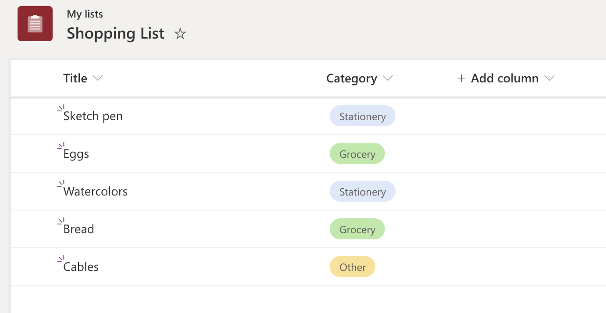

# Advanced formatting concepts

You can use some of the following features to make your view and column formatting more information rich and interactable.

## Create a button to launch a Flow

The following screenshot shows a list with a Flow button added to the Action column:


You can use column formatting to create buttons that, when selected, run Flows on the corresponding list item. For flows that are [solution-aware](/power-automate/overview-solution-flows), the Flow Launch Panel will be displayed after choosing the button and you must select Run Flow to start the flow. For flows that aren't solution-aware, The Flow Launch Panel will be displayed after choosing the button and the Flow will just run.

To use the sample below, you must substitute the ID of the Flow you want to run. This ID is contained within the `actionParams` property of the `customRowAction` attribute inside the `button` element.

To obtain the ID of a flow that is solution-aware:

1. Select **Flow > See your flows** in the SharePoint list where the Flow is configured.
1. If applicable, [switch to the environment](/power-platform/admin/working-with-environments#switch-the-environment) in which the Flow is hosted.
1. Select the Solutions area.
1. Select the solution in which the Flow was created.
1. Filter for Cloud flows and select the Flow you want to run.
1. Select Export > Get flow identifier.
1. Copy the ID.

To obtain the ID of a flow that isn't solution-aware:

1. Select **Flow > See your flows** in the SharePoint list where the Flow is configured.
1. Select the Flow you want to run.
1. Copy the ID from the end of the URL.

```JSON
{
  "$schema": "https://developer.microsoft.com/json-schemas/sp/v2/column-formatting.schema.json",
  "elmType": "button",
  "customRowAction": {
    "action": "executeFlow",
    "actionParams": "{\"id\": \"edf627d9-20f4-45ba-8bc9-4494bf2ff1be\"}"
  },
  "attributes": {
    "class": "ms-fontColor-themePrimary ms-fontColor-themeDarker--hover"
  },
  "style": {
    "border": "none",
    "background-color": "transparent",
    "cursor": "pointer"
  },
  "children": [
    {
      "elmType": "span",
      "attributes": {
        "iconName": "Flow"
      },
      "style": {
        "padding-right": "6px"
      }
    },
    {
      "elmType": "span",
      "txtContent": "Send to Manager"
    }
  ]
}
```

Additionally, you can use `headerText` and `runFlowButtonText` options within the `actionParams` property to customize portions of the Flow panel itself! See the [button elements](./formatting-syntax-reference.md#customrowaction) portion of the Detailed syntax reference for more details.

## Custom cards on hover

The following image shows a list with a custom hover added to a List:

On hover - Metadata on the column "Status" is made available in view formatting:


On hover - Metadata on the column "Status" is made available in column formatting:


You can use formatting to define custom call out that can be commissioned basis user-defined actions like click or hover.

This example uses `customCardProps`, `openOnEvent`, `directionalHint` and `isBeakVisible`:

```JSON
{
  "elmType": "div",
  "style": {
    "font-size": "12px"
  },
  "txtContent": "[$Status]",
  "customCardProps": {
    "formatter": {
      "elmType": "div",
      "txtContent": "Define your formatter options inside the customCardProps/formatter property"
    },
    "openOnEvent": "hover",
    "directionalHint": "bottomCenter",
    "isBeakVisible": true,
    "beakStyle" : {
      "backgroundColor": "white"
    }
  }
}
```

## Default cards on hover

Users can now have profile card or file hover card on formatters too, some of the things users can now do:

1. Profile card or File Hover card on any column
1. Profile card or Hover card with view formatting

Hover on a filename with formatting with default file card:


Hover on a person column with formatting with default Profile card:


Both the example uses defaultHoverField

```JSON
{
  "$schema": "https://developer.microsoft.com/json-schemas/sp/v2/column-formatting.schema.json",
  "elmType": "div",
  "children": [
    {
      "elmType": "img",
      "style": {
        "width": "32px",
        "height": "32px",
        "overflow": "hidden",
        "border-radius": "50%",
        "margin": "2px"
      },
      "attributes": {
        "src": "=getUserImage([$Editor.email], 's')",
        "title": "[$Editor.title]"
      }
    },
    {
      "elmType": "span",
      "style": {
        "vertical-align": "middle",
        "margin-left": "2px"
      },
      "txtContent": "[$Editor.title]"
    }
  ],
  "defaultHoverField": "[$Editor]"
}
```

## Column formatter reference

Users can refer to a column's formatter JSON inside another column/view formatter and use it along with other elements to build a custom column visualization. This can be done by using `columnFormatterReference` property.

The following image shows a list with a Gallery layout referencing the Category column formatter:




``` JSON
{
  "$schema": "https://developer.microsoft.com/json-schemas/sp/v2/tile-formatting.schema.json",
  "height": 127,
  "width": 254,
  "hideSelection": false,
  "formatter": {
    "elmType": "div",
    "attributes": {
      "class": "sp-card-container"
    },
    "children": [
      {
        "elmType": "button",
        "attributes": {
          "class": "sp-card-defaultClickButton"
        },
        "customRowAction": {
          "action": "defaultClick"
        }
      },
      {
        "elmType": "div",
        "attributes": {
          "class": "ms-bgColor-white sp-css-borderColor-neutralLight sp-card-borderHighlight sp-card-subContainer"
        },
        "children": [
          {
            "elmType": "div",
            "attributes": {
              "class": "sp-card-displayColumnContainer"
            },
            "children": [
              {
                "elmType": "p",
                "attributes": {
                  "class": "ms-fontColor-neutralSecondaryAlt sp-card-label"
                },
                "txtContent": "[!Title.DisplayName]"
              },
              {
                "elmType": "p",
                "attributes": {
                  "title": "[$Title]",
                  "class": "ms-fontColor-neutralPrimary sp-card-content sp-card-highlightedContent"
                },
                "txtContent": "=if ([$Title] == '', '–', [$Title])"
              }
            ]
          },
          {
            "elmType": "div",
            "attributes": {
              "class": "sp-card-lastTextColumnContainer"
            },
            "children": [
              {
                "elmType": "p",
                "attributes": {
                  "class": "ms-fontColor-neutralSecondaryAlt sp-card-label"
                },
                "txtContent": "[!Category.DisplayName]"
              },
              {
                "elmType": "div",
                "attributes": {
                  "class": "sp-card-content"
                },
                "style": {
                  "height": "32px",
                  "font-size":"12px"
                },
                "children": [
                  {
                    "columnFormatterReference": "[$Category]"
                  }
                ]
              }
            ]
          }
        ]
      }
    ]
  }
}
```

## Inline Editing

With inline editing, formatters have the ability to load field editors to edit field data on an item.
Users need to have edit permissions on the list item and the field type should belong to set of supported types for this feature to work.

A special json property `inlineEditField` is used with value as the field internal name __`[$FieldName]`__ at the target element in the json.

```json
{
  "elmType": "div",
  "inlineEditField": "[$FieldName]",
  "txtContent": "[$FieldName]"
}
```


This allows the users to edit items in-place, within the view, without navigating away to grid-based editing or to an item edit form.

### Supported Field Types

List of supported field types for inline editing:

- Single line text
- Multiline text (without RTF)
- Number
- DateTime
- Choice and MultiChoice
- User and Multiuser
- Lookup

### Hover Borders and Customizations

The inline editing adds a hover border on the elements to indicate these elements have an associated action. The default border is `neutralSecondary`, and on click, the editor appears with a `themePrimary` border. These border colors can be overridden via setting style on the same element with `inlineEditField` by using some special attributes - `--inline-editor-border-width`, `--inline-editor-border-style`, `--inline-editor-border-radius`, and `--inline-editor-border-color`.

```json
{
  "elmType": "div",
  "inlineEditField": "[$FieldName]",
  "txtContent": "[$FieldName]",
  "style": {
    "--inline-editor-border-color": "transparent transparent red transparent",
    "border-color": "gray",
    "border-width": "1px",
    "border-style": "solid"
  }
}
```

## Set multiple field values of an Item using customRowAction

With the new `setValue` and `customRowAction` properties, formatters can render action buttons that modify the item internally without opening editors or forms. `setValue` also allows setting multiple field values of the item at once.

The below JSON will set value of `FieldInternalName_1`, `FieldInternalName_2`, and `FieldInternalName_3`with the values provided:

```json
{
  "elmType": "div",
  "txtContent": "[$FieldName]",
  "customRowAction":{
    "action": "setValue",
    "actionInput": {
      "FieldInternalName_1": "FieldValue_1",
      "FieldInternalName_2": "FieldValue_2",
      "FieldInternalName_3": "=if([$Status] == 'Completed', 'yes', 'no')"
    }
  }
}
```

### Supported Field Types

- Single line text
- Multiline text (without RTF)
- Number
- DateTime
- Choice and MultiChoice
- User and Multiuser

### Value Field values in `actionInput`:

- Text values:
  - a valid string like `"Choice 1"`
  - value from other columns: `[$ColumnName]`
  - an [expression](./formatting-syntax-reference.md#expressions) such as:

      ```
      "if([$column]> 10, "Choice A", "Choice B")"
      ```

    or

      ```
      {operator: "+", operands" : ["Choice", "A"]}
      ```

- Number:
  - a valid number
  - value from other columns: `[$ColumnName]`
  - an [expression](./formatting-syntax-reference.md#expressions)
- Date values:
  - a date string
  - `@now` token
  - [expressions](./formatting-syntax-reference.md#expressions) that return a date using built-in date functions
  - `addDays` and `addMinutes`, two new functions to support [expressions](./formatting-syntax-reference.md#expressions) like seven days from today
  - an empty string `""` clears the field value
- Multi-Choice and Multi-Person:
  - Multi value fields are special, as they need an array value to save multiple values.
  - `appendTo`, `removeFrom`, and `replace`, three functions that can operate on multivalue fields.
    - `appendTo([$MultiChoiceField], 'MyValue')`
    - `removeFrom([$MultiUserField], @me)`: removes all occurrences that match the second parameter
    - `replace([$MultiChoiceField], 'Choice 1', 'Choice 3')`: replaces all occurrences of second parameter with third.
- Person field values:
  - user name or email
  - An empty string `""` clears the field value
  - an [expression](./formatting-syntax-reference.md#expressions) which returns these values

    > [!NOTE]
    > A query runs with the string value provided on people column and the first person in the returned results is used.
