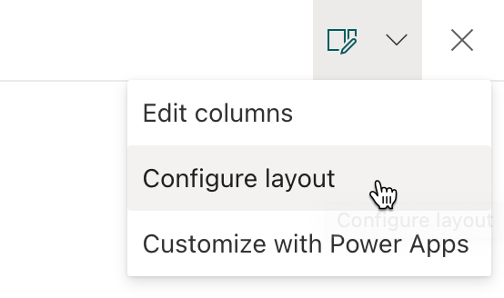
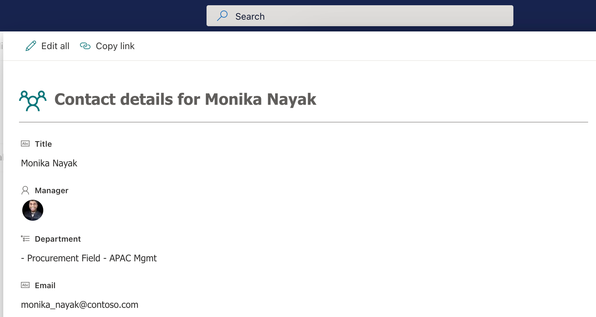
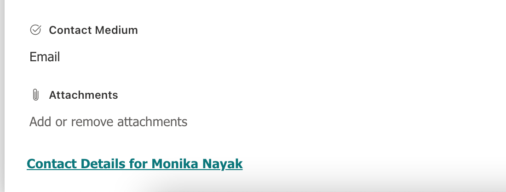
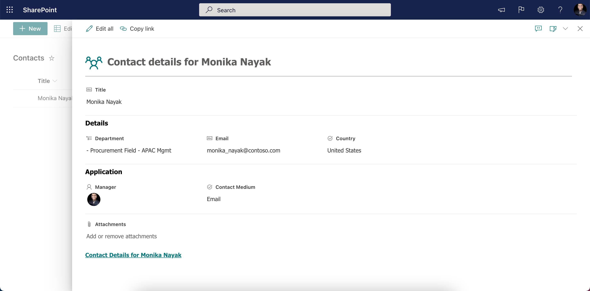

# Configure the list form

You can configure the list form in a list or library with a custom header, footer and the form body with one or more sections with fields in each of those sections. The form configuration does not change the data in the list item or file; it only changes how the form is displayed to users who browse the list or library. Anyone who can create and manage views in a list can use form configuration to configure the form with header, footer and body with sections.

To configure a form, you will use JSON formatters that you are already familiar with when formatting a [column](column-formatting.md) or a [view](view-formatting.md) in a list or library. Form configuration allows for certain predefined elements and attributes to build the custom header, footer and body with one or more sections.

## Get started

To configure the form in a list or library:

1. Go to the list or library for which you want to configure the form.
1. If you are in a list:

   - Open an item to view the item details in the display form.

1. If you are in a document library:

   - Select a file.
   - Select ...
   - Select More
   - Select Properties

1. At the top of the form, expand **Edit Form** icon and then select **Configure layout**

   

1. In the **Format** pane, you can choose to apply formatting to the following form sections:
   - Header
   - Body
   - Footer

## Configure custom header

1. To apply formatting to the header, select **Header** in the **Apply formatting to** dropdown.
1. Paste your custom header formatter in the JSON text input area.

    > [!NOTE]
    > Form configuration allows for certain [predefined elements and attributes](column-formatting.md#creating-custom-json) to build the custom header.

1. Below is an example of a custom header & JSON:

    

    ```JSON
    {
      "elmType": "div",
      "attributes": {
        "class": "ms-borderColor-neutralTertiary"
      },
      "style": {
        "width": "99%",
        "border-top-width": "0px",
        "border-bottom-width": "1px",
        "border-left-width": "0px",
        "border-right-width": "0px",
        "border-style": "solid",
        "margin-bottom": "16px"
      },
      "children": [
        {
          "elmType": "div",
          "style": {
            "display": "flex",
            "box-sizing": "border-box",
            "align-items": "center"
          },
          "children": [
            {
              "elmType": "div",
              "attributes": {
                "iconName": "Group",
                "class": "ms-fontSize-42 ms-fontWeight-regular ms-fontColor-themePrimary",
                "title": "Details"
              },
              "style": {
                "flex": "none",
                "padding": "0px",
                "padding-left": "0px",
                "height": "36px"
              }
            }
          ]
        },
        {
          "elmType": "div",
          "attributes": {
            "class": "ms-fontColor-neutralSecondary ms-fontWeight-bold ms-fontSize-24"
          },
          "style": {
            "box-sizing": "border-box",
            "width": "100%",
            "text-align": "left",
            "padding": "21px 12px",
            "overflow": "hidden"
          },
          "children": [
            {
              "elmType": "div",
              "txtContent": "='Contact details for ' + [$Title]"
            }
          ]
        }
      ]
    }
    ```

1. To preview your changes, click the **Preview** button.
1. To save your changes, click the **Save** button.
1. Close and open the form again to view the custom header.

## Configure custom footer

1. To apply formatting to the footer, in the **Format** pane, select **Footer** in the **Apply formatting to** dropdown.
1. Paste your custom footer formatter in the JSON text input area.

    > [!NOTE]
    > Form configuration allows for certain [predefined elements and attributes](column-formatting.md#creating-custom-json) to build the custom footer.

1. Below is an example of a custom footer & JSON:

    

    ```JSON
    {
        "elmType": "div",
        "style": {
            "width": "100%",
            "text-align": "left",
            "overflow": "hidden",
            "border-top-width": "1px"
        },
        "children": [
            {
                "elmType": "div",
                "style": {
                    "width": "100%",
                    "padding-top": "10px",
                    "height": "24px"
                },
                "children": [
                    {
                        "elmType": "a",
                        "txtContent": "='Contact Details for ' + [$Title]",
                        "attributes": {
                            "target": "_blank",
                            "href": "='https://aka.ms/contacts?email=' + [$Email]",
                            "class": "ms-fontColor-themePrimary ms-borderColor-themePrimary ms-fontWeight-semibold ms-fontSize-m ms-fontColor-neutralSecondary–hover ms-bgColor-themeLight–hover"
                        }
                    }
                ]
            }
        ]
    }
    ```

1. To preview your changes, click the **Preview** button.
1. To save your changes, click the **Save** button.
1. Close and open the form again to view the custom footer.

## Configure custom body with one or more sections

1. To apply formatting to the body, in the **Format** pane, select **Body** in the **Apply formatting to** dropdown.
1. Paste your custom body formatter in the JSON text input area.
1. Unlike the header and the footer, body configuration only allows defining one or more sections and adding one or more columns into each of those sections.

    - One or more sections can be defined for a body.
    - Each section can reference one or more columns in the list or library.
    - A column can be referenced only in one section.
    - If a column is referenced in multiple sections, the first section where the column is referenced will take the precedence.
    - A column not referenced in any of the sections will be automatically referenced in the last section.
    - New columns added will be automatically referenced in the last section.

1. Below is the JSON structure to get started with defining sections and referencing columns in the sections:

    ```JSON
    {
      "sections": [
        {
          //give a display name for the section
          "displayname": "",
          "fields": [
            //reference your fields here using their display name
            "Title"
          ]
        },
        {
          //give a display name for the section
          "displayname": "",
          "fields": [
            //reference your fields here using their display name
          ]
        }
      ]
    }
    ```

1. Below is an example of a custom body JSON with sections:

    ```JSON
    {
      "sections": [
        {
          "displayname": "",
          "fields": [
            "Title"
          ]
        },
        {
          "displayname": "Details",
          "fields": [
            "Department",
            "Email",
            "Country"
          ]
        },
        {
          "displayname": "Application",
          "fields": [
            "Application Id",
            "Approver",
            "Reviewer"
          ]
        }
      ]
    }
    ```

1. Once the body is customized with one or more sections, the list or library form will switch to a multi-column layout.

    > [!NOTE]
    > Configuring form body will switch your list or library form layout from single-column to a multi-column layout. We will add support for configuring the body with single-column layout in a future update.

    

1. To preview your changes, click the **Preview** button.
1. To save your changes, click the **Save** button.
1. Close and open the form again to view the custom body.
