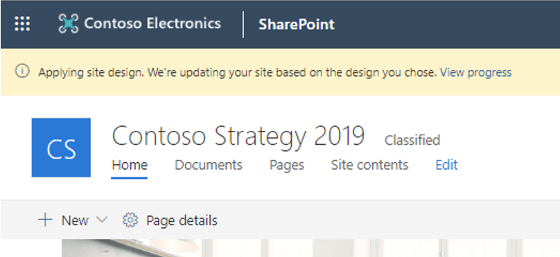
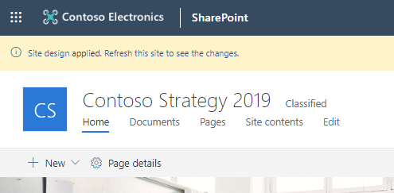
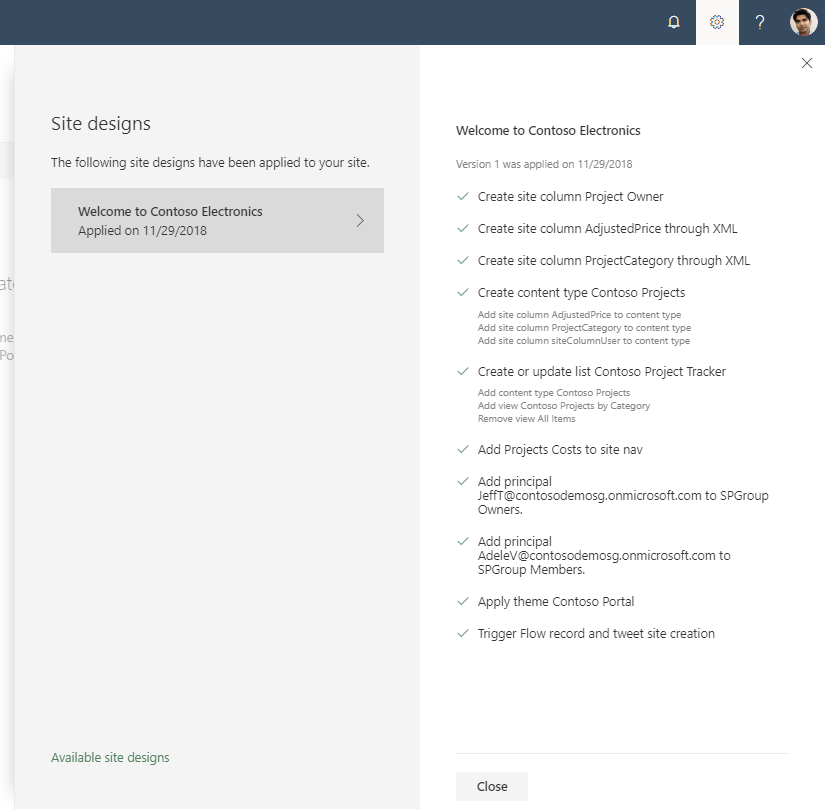

# SharePoint site design and site script overview

> [!NOTE]
> - Site designs and site scripts are currently only supported by SharePoint Online.
> - In previous versions of SharePoint, site templates were called site designs but will be referred to as site templates moving forward.
> - SharePoint has a new site template experience that will be available to all SharePoint user with permissions to create SharePoint sites.  [Learn more about the new site template experience](https://support.microsoft.com/office/apply-and-customize-sharepoint-site-templates-39382463-0e45-4d1b-be27-0e96aeec8398?ui=en-US&rs=en-US&ad=US).
> - As of today, the site template experience cannot be disabled.
> - Site template version history is not currently available for the new site template experience but will be included in future iterations.

Use site templates and site scripts to automate provisioning new or existing modern SharePoint sites that use your own custom configurations. 

When people in your organization create new SharePoint sites, you often need to ensure some level of consistency. For example, you may need proper branding and theming applied to each new site. You may also have detailed site provisioning scripts, such as using the PnP provisioning engine, that need to be applied each time a new site is created. 

This article describes how you can use site templates and site scripts to provide custom configurations to apply when new sites are created.

## How site templates work

Site templates can be used each time a new site is created to apply a consistent set of actions. They can also be applied to existing modern sites (group-connected Team and Communication sites). Most actions typically affect the site itself, such as setting the theme or creating lists. But a site template can also include other actions, such as recording the new site URL to a log, or sending a tweet.

You create site templates and register them in SharePoint to one of the modern template sites: the Team site or the Communication site. You can see how this works in the following steps.

1. Go to the SharePoint start page on your developer tenant. 

2. Choose **Create site**.

   You'll see the two modern template sites: **Team site** and **Communication site**.

3. Choose **Communication site**.

The Communication site has a **Choose a design** box, which comes with the following site templates:

- Topic
- Showcase
- Blank

These are the default site templates. For each site template, there is a title, description, and image.


Had you chosen the Team site template, it contains only one default site template named **Team site**. 

For more information about how you can change the default site templates, see [Customize a default site design](customize-default-site-design.md).

When a site template is selected, SharePoint creates the new site, and runs site scripts for the site design. The site scripts detail the work such as creating new lists or applying a theme. These script actions are run in the background. A notification bar will be displayed, which the site creator can click to view the status of the actions being applied. 



When the scripts are complete the notification bar message will change - allowing the site creator to either refresh the page to see the results of the applied scripts or to view the site script details.



The site template information panel can be invoked by a site owner at any time to see what site templates have been applied to the site (and their script details) as well as to apply new or updated site templates. 

When the actions in the scripts are completed, SharePoint displays detailed results of those actions in a progress pane.



> [!NOTE]
> Site templates can now be applied to previously created modern site collections. For more information, see the [REST API](site-design-rest-api.md) and [PowerShell](site-design-powershell.md) articles.

## Anatomy of a site script

Site scripts are JSON files that specify an ordered list of actions to run when creating the new site. The actions are run in the order listed. 

The following example is a script that has two top-level actions. First, it applies a theme that was previously created named **Contoso Explorers**. It then creates a **Customer Tracking** list.

```json
{
  "$schema": "https://developer.microsoft.com/json-schemas/sp/site-design-script-actions.schema.json",
  "actions": [
    {
      "verb": "applyTheme",
      "themeName": "Contoso Explorers"
    },
    {
      "verb": "createSPList",
      "listName": "Customer Tracking",
      "templateType": 100,
      "subactions": [
        {
          "verb": "setDescription",
          "description": "List of Customers and Orders"
        },
        {
          "verb": "addSPField",
          "fieldType": "Text",
          "displayName": "Customer Name",
          "isRequired": false,
          "addToDefaultView": true
        },
        {
          "verb": "addSPField",
          "fieldType": "Number",
          "displayName": "Requisition Total",
          "addToDefaultView": true,
          "isRequired": true
        },
        {
          "verb": "addSPField",
           "fieldType": "User",
          "displayName": "Contact",
          "addToDefaultView": true,
          "isRequired": true
        },
        {
          "verb": "addSPField",
          "fieldType": "Note",
          "displayName": "Meeting Notes",
          "isRequired": false
        }
      ]
    }
  ],
  "version": 1
}
```

<br/>

Each action in a site script is specified by a **verb** value in the JSON. In the previous script, the first action is specified by the **applyTheme** verb. Next, the **createSPList** verb creates the list. Notice that the **createSPList** verb contains its own set of verbs that run additional actions on only the list.

Available actions include:

- Creating a new list or library (or modifying the default one created with the site)
- Creating site columns, content types, and configuring other list settings
- Set site branding properties like navigation layout, header layout and header background
- Applying a theme
- Setting a site logo
- Adding links to quick launch or hub navigation
- Triggering a Power Automate flow
- Installing a deployed solution from the app catalog
- Setting regional settings for the site
- Adding principals (users and groups) to SharePoint roles
- Setting external sharing capability for the site

For a complete list of available actions and their parameters, see the [JSON schema](https://docs.microsoft.com/sharepoint/dev/declarative-customization/site-design-json-schema).

> [!NOTE]
> For libraries and lists, use the PowerShell command [Get-SPOSiteScriptFromList](https://docs.microsoft.com/powershell/module/sharepoint-online/Get-SPOSiteScriptFromList) to create the site script syntax from an existing SharePoint list. 

Site scripts can be run again on the same site after provisioning. Site scripts are non-destructive, so when they run again, they ensure that the site matches the configuration in the script. 

For example, if the site already has a list with the same name that the site script is creating, the site script will only add missing fields to the existing list. 

We'd previously capped the limit of site script actions to 30. This remains the limit for scripts applied synchronously using the [Invoke-SPOSiteDesign](https://docs.microsoft.com/powershell/module/sharepoint-online/Invoke-SPOSiteDesign)  command, but based on customer feedback and support for additional actions we have bumped this limit to 300 actions (or 100,000 characters) when the scripts are applied asynchronously (either through the UI or using the [Add-SPOSiteDesignTask](https://docs.microsoft.com/powershell/module/sharepoint-online/Add-SPOSiteDesignTask) command).

There is also a limit of 100 site scripts and 100 site templates per tenant.

## Using PowerShell or REST to work with site templates and site scripts

You can create site templates and site scripts by using PowerShell or the REST API. The following example creates a site script and a site template that uses the site script. 

<!-- The PowerShell example loads the script from a file, while the REST example has the script inline. -->

```powershell
C:\> Get-Content 'c:\scripts\site-script.json' `
     -Raw | `
     Add-SPOSiteScript `
    -Title "Contoso theme and list"

Id          : 2756067f-d818-4933-a514-2a2b2c50fb06
Title       : Contoso theme and list
Description :
Content     :
Version     : 0

C:\> Add-SPOSiteDesign `
  -Title "Contoso customer tracking" `
  -WebTemplate "64" `
  -SiteScripts "2756067f-d818-4933-a514-2a2b2c50fb06" `
  -Description "Creates customer list and applies standard theme"
```

<!-- 
```javascript
var site_script = {
  "$schema": "schema.json",
  "actions": [
    {
      "verb": "applyTheme",
      "themeName": "Contoso Explorers"
    },
    {
      "verb": "createSPList",
      "listName": "Customer Tracking",
      "templateType": 100,
      "subactions": [
        {
          "verb": "SetDescription",
          "description": "List of Customers and Orders"
        },
        {
          "verb": "addSPField",
          "fieldType": "Text",
          "displayName": "Customer Name",
          "isRequired": false,
          "addToDefaultView": true
        },
        {
          "verb": "addSPField",
          "fieldType": "Number",
          "displayName": "Requisition Total",
          "addToDefaultView": true,
          "isRequired": true
        },
        {
          "verb": "addSPField",
          "fieldType": "User",
          "displayName": "Contact",
          "addToDefaultView": true,
          "isRequired": true
        },
        {
          "verb": "addSPField",
          "fieldType": "Note",
          "displayName": "Meeting Notes",
          "isRequired": false
        }
      ]
    }
  ],
  "bindata": { },
  "version": 1
};

RestRequest("/_api/Microsoft.SharePoint.Utilities.WebTemplateExtensions.SiteScriptUtility.CreateSiteScript(Title=@title,Description=@desc)?@title='Contoso theme and list'&@desc='this script creates a list named customer tracking and sets the contoso explorers company theme'", site_script);

RestRequest("/_api/Microsoft.SharePoint.Utilities.WebTemplateExtensions.SiteScriptUtility.CreateSiteDesign",{
  info:{
    Title:"Contoso customer tracking", Description:"Creates customer list and applies standard theme",  SiteScriptIds:["607aed52-6d61-490a-b692-c0f58a6981a1"],  WebTemplate:"64"
   }
  });
```

-->

<br/>

In the previous example, the **Add-SPOSiteScript** cmdlet or **CreateSiteScript** REST API returns a site script id. This is used for the **SiteScripts** parameter in the subsequent call to the **Add-SPOSiteDesign** cmdlet or **CreateSiteDesign** REST API.

The **WebTemplate** parameter set to the value 64 indicates registering this site design with the Team site template. If you have disabled modern Group creation, then publish your site designs using WebTemplate 1 so that they display for the "Group-less" Team site template. The value 68 would indicate registering with the Communication site template. The **Title** and **Description** parameters are displayed when a user views site designs as they create a new Team site.

> [!NOTE]
> A site template can run multiple scripts. The script IDs are passed in an array, and they run in the order listed.

For step-by-step information about creating a site template, see [Get started creating site designs](get-started-create-site-design.md).

## PnP provisioning and customization using Power Automate

One action provided by site scripts is the ability to trigger a Power Automate flow. This allows you to specify any custom action that you need beyond the actions provided natively in site scripts.

If you use the PnP provisioning engine to automate site creation, you can use a Power Automate flow to integrate with site templates. You can maintain all your existing provisioning scripts as well as create new custom provisioning scripts by using this technique.

<br/>


The process works as follows:

1. The script instantiates your Power Automate flow using a URL with additional details. 

2. The flow sends a message to an Azure storage queue that you have configured. 

3. The message triggers a call to an Azure function that you have configured. 

4. The Azure function runs your custom script, such as the PnP provisioning engine, to apply your custom configurations. 

For a step-by-step tutorial about how to configure your own Power Automate flow with PnP provisioning, see [Build a complete site design using the PnP provisioning engine](site-design-pnp-provisioning.md).

## Scoping

You can configure site templates to only appear for specific groups or people in your organization. This is useful to ensure that people only see the site templates intended for them. For example, you might want the accounting department to only see site templates specifically for them. And the accounting site templates may not make sense to show to anyone else.

By default, a site template can be viewed by everyone when it is created. Scopes are applied by using the **Grant-SPOSiteDesignRights** cmdlet or the **GrantSiteDesignRights** REST API.  You can specify the scope by user or a mail-enabled security group. 

The following example shows how to add Nestor (a user at the fictional Contoso site) view rights on a site template.

```powershell
Grant-SPOSiteDesignRights `
  -Identity 44252d09-62c4-4913-9eb0-a2a8b8d7f863 `
  -Principals "nestorw@contoso.onmicrosoft.com" `
  -Rights View
```

<!--
```javascript
RestRequest("/_api/Microsoft.SharePoint.Utilities.WebTemplateExtensions.SiteScriptUtility.GrantSiteDesignRights", {id:"44252d09-62c4-4913-9eb0-a2a8b8d7f863", principalNames:["nestorw@contoso.onmicrosoft.com”], grantedRights:1});
```
-->

For more information about working with scopes, see [Scoping access to site designs](site-design-scoping.md).

## See also

- [Get started creating site template](get-started-create-site-design.md)
- [Apply a scope to your site design](site-design-scoping.md)
- [Site design JSON schema](site-design-json-schema.md)
- [PowerShell cmdlets for SharePoint site designs and site scripts](site-design-powershell.md)
- [Site design and site script REST API](site-design-rest-api.md)
- [Site design examples](https://github.com/SharePoint/sp-dev-site-scripts)
