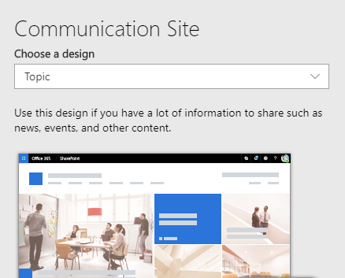

# SharePoint site design and site script overview

Use site designs and site scripts to automate provisioning new SharePoint sites using your own custom configurations. When people in your organization create new SharePoint sites, you often need to ensure some level of consistency. For example, you may need proper branding and theming applied to each new site. You may also have detailed site provisioning scripts, such as using the PnP provisioning engine, that need to be applied each time a new site is created. This article describes how you can use site designs and site scripts to provide custom configurations to apply when new sites are created.

## How site designs work

You create site designs and register them in SharePoint to one of the modern template sites; the team site, or communication site. Site designs appear in a drop down list when someone creates a new site from one of the templates. Each site design has a title, description, and will run one or more scripts to create the new site as specified in the design.



Once a site design is selected, SharePoint creates the new site, and then runs any scripts registered with the site design. The script performs actions such as creating new lists, or applying a theme. Each action is recorded in a local list. When the scripts are done, SharePoint displays the results from the list in a progress pane.


You can create a site design by using PowerShell, CSOM, or the REST API. Here's an example of creating a new site design for the purpose of applying company branding.

```
TBD Powershell example of creating site design for brand (show isdefault)
```

You can also make a site design the default for the team or communication site template. Then when someone chooses only the template, you can still apply a custom design. This is done by setting the **IsDefault** property to true as shown previously.

For more information, see [Get started creating site designs](get-started-create-site-design.md)

## Anatomy of a site script

Site scripts are JSON files that specify an ordered list of actions to run when creating the new site. The actions are run in the order listed. The following example is a script that has two top-level actions. First it applies a theme that was previously created named **Contoso Explorers**. Then it creates a **Customer Tracking** list.

```json
{
  "$schema": "schema.json",
  "actions": [
    {
      "verb": "applyTheme",
      "themeName": "Contoso Explorers"
    },
    {
      "verb": "createSPList",
      "listName": "Customer Tracking",
      "templateType": 100,
      "subactions": [
        {
          "verb": "SetDescription",
          "description": "List of Customers and Orders"
        },
        {
          "verb": "addSPField",
          "fieldType": "Text",
          "displayName": "Customer Name",
          "isRequired": false,
          "addToDefaultView": true
        },
        {
          "verb": "addSPField",
          "fieldType": "Number",
          "displayName": "Requisition Total",
          "addToDefaultView": true,
          "isRequired": true
        },
        {
          "verb": "addSPField",
          "fieldType": "User",
          "displayName": "Contact",
          "addToDefaultView": true,
          "isRequired": true
        },
        {
          "verb": "addSPField",
          "fieldType": "Note",
          "displayName": "Meeting Notes",
          "isRequired": false
        }
      ]
    }
  ],
  "bindata": { },
  "version": 1
}
```

Each action in a site script is specified by a **verb** value in the JSON. In the previous script the first action is specified by the **applyTheme** verb. Then the **createSPList** verb creates the list. Notice that the **createSPList** verb contains its own set of verbs which run additional actions on just the list.

Actions include:

- Creating a new list
- Applying a theme
- Creating a page
- Setting a site logo
- Adding navigation
- Triggering a Microsoft flow

You can create site scripts by using PowerShell, CSOM, or the REST API. Here's an example of how to create a site script that applies the Blue Yonder theme.

```
TBD PowerShell example create a script for blue yonder theme
```

For more information, see [Get started creating site designs](get-started-create-site-design.md)

Site scripts can be run again on the same site after provisioning. This can only be done programmatically. Site scripts are non-destructive, so when they run again, they ensure that the site matches the configuration in the script. For example, if the site already has a list with the same name that the site script is creating, the site script will only add missing fields to the existing list.

## PnP Provisioning and customization using Microsoft Flow

One action provided by site scripts is the ability to trigger a Microsoft flow. This allows you to specify any custom action you need beyond the actions provided natively in site scripts.

If you use the PnP provisioning engine to automate site creation, then you can use a Microsoft flow to integrate with site designs. You can continue maintaining all of your existing provisioning scripts as well as creating new customizations using this technique.


The process works as follows:

1. The script instantiates your Microsoft flow using a URL with additional details.
1. The flow sends a message to an Azure storage queue that you have configured.
1. The message triggers a call to an Azure function that you have configured.
1. The Azure function runs your custom script, such as the PnP provisioning engine, to apply your custom configurations.

For a step-by-step tutorial on how to configure your own Microsoft flow with PnP provisioning, see [Build a complete site design using the PnP provisioning engine](site-design-pnp-provisioning)

## Scoping

You can configure site designs to only appear for specific groups or people in your organization. This is useful to ensure that people only see the site designs intended for them. For example, you may want the accounting department to only see site designs specific for them. And the accounting site designs may not make sense to show to anyone else.

Scopes are applied when you register a site design. You can specify the scope by user, Office 365 group, or a mail-enabled security group. Here is an example of registering a site design for only the accounting Office 365 group:

```
TBD: PowerShell example register a scoped site design
```

For more information, see [Apply a scope to your site design](site-design-scopes.md).
