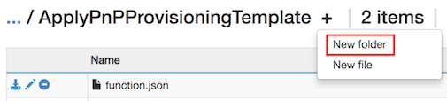

# Calling the PnP Provisioning Engine from a Site Script

> [!NOTE]
> Site designs and site scripts are currently in preview and are subject to change. They are not currently supported for us in production environments.

Site Designs offer a great way to standardize the look and feel of your site collections. But if you want to take this one step further, by for instance adding a footer to every page, you might notice that Site Designs do not offer you that option. With the PnP Provisioning engine you can hover create a template which allows you to provision an application customizer to a site. This application customizer then can register a footer on every page. In this article you will learn how to create a site design that applies a PnP Provisioning Template to a site which in turn will add an application customizer to render a footer.

We use the following components in our setup:

1. A Site Design and a Site Script
1. A Microsoft Flow
1. An Azure Storage Queue
1. An Azure Function
1. An SPFX Solution
1. A PnP Provisioning Template
1. A PnP PowerShell Script
1. An AppId and AppSecret with administration rights on your tenant.

We need all these component so we can trigger the PnP Provisioning code in a controller manner right after the site has been created and the Site Design is being applied.

# Setting up App Only Access to your tenant
This requires that you open 2 different pages on your tenant, one located in a normal site, the other located in your SharePoint Administration site.

1. Navigate to following URL in your tenant: https://[yourtenant].sharepoint.com/_layouts/appregnew.aspx (you can navigate to any site, but for now pick the root site)
1. Click both **Generate** buttons
1. Enter a title for your App, for instance "Site Provisioning"
1. Enter **localhost** as the App Domain
1. Enter **https://localhost** as the Redirect URI

    
1. Click **Create** and copy the values for **Client Id** and **Client Secret** as you will need them later

Now we will trust this app to have the appropriate access to your tenant:
1. Navigate to https://[yourtenant]-admin.sharepoint.com/_layouts/appinv.aspx (notice the -admin in the URL)
1. Paste in the Client Id you copied above into the **App Id** field and select **Lookup**
1. Paste the following XML in the **Permission Request XML** field:
    ```xml
    <AppPermissionRequests AllowAppOnlyPolicy="true" >
        <AppPermissionRequest Scope="http://sharepoint/content/tenant" Right="FullControl" />
    </AppPermissionRequests>
    ```
1. Select **Create**
1. You will receive a question if you want to trust this app. Confirm this by selecting **Trust It**


# Creating the Azure Storage Queue
In this scenario we will use an Azure Storage Queue to receive messages from a Microsoft Flow. Everytime a message shows up in the Storage Queue an Azure Function will get triggered to execute a PowerShell script. But let us set up the Storage Queue first:

1. Navigate to the Azure portal at https://portal.azure.com and log in.
1. Choose **+ New**
1. Select **Storage** from the Azure Marketplace listings and select **Storage account - blob, file, table, queue** in the Featured column
1. Provide values for the required fields as requested. Make sure to select **Pin to dashboard** for easy location later and click **Create**. The storage account is being created. This can take a few minutes.
1. Open the Storage Account after it has been created and navigate to **Queues** in the navigation
1. Choose **+ Queue** at the top of the main area of the screen.
1. Enter **pnpprovisioningqueue** as the name or enter your own following the naming standard that is enforced. Make a note of the queue name as you need this value later when creating the Azure Function.
1. Navigate to **Access Keys** and make note of the **Storage Account Name** and the **key1 Key value**, you will need those values in the next step where you create the flow.


# The Flow
In order to put a message on the queue we have to create a flow. 

1. Navigate to **https://flow.microsoft.com**, log in and create a new flow by clicking **Create from Blank** at the top.
1. Click **Search hundreds of connectors and triggers** to select your trigger
1. Search for **Request** and select **Request - When a HTTP Request is received**
1. Enter the following JSON as your request body:
    ```json
    {
        "type": "object",
        "properties": {
            "webUrl": {
                "type": "string"
            },
            "parameters": {
                "type": "object",
                "properties": {
                    "event": {
                        "type": "string"
                    },
                    "product": {
                        "type": "string"
                    }
                }
            }
        }
    }
    ``` 
1. Select **+ New Step** and select **Add an action**
1. Search for **Azure Queues** and select **Azure Queues - Put a message on a queue**
1. Enter a name for the connection, this can be anything descriptive
1. Enter the storage account name you copied in the previous section
1. Enter the storage shared key, which is the value of the **Key1 key value** of your storage account.
1. Click **Create**
1. Select **pnpprovisioningqueue** as the Queue Name.
1. In the body specified in step 4 we specified an incoming parameter called webUrl. We will put the value of that parameter on the queue. Click in the **message** field and select **webUrl** from the Dynamic Content picker.
1. Click **Save Flow**. This will generate the URL we will copy in the next step.
1. Click on the first step in your flow ('When an HTTP request is received') and copy the URL. We will need that to test and later on in our Site Design.
1. Save your flow.

Your flow should look like this:


# Testing the flow
In order to test your flow you have will have to make a post request. The easiest for that, if you are on a Windows PC, is to use PowerShell:

```powershell
$uri = "[the URI you copied in step 8 when creating the flow]"
$body = "{webUrl:'somesiteurl'}
Invoke-RestMethod -Uri $uri -Method Post -ContentType "application/json" -Body $body
```

If you now navigate to the main screen of your flow you will see a run history. If everything went okay it should say 'Succeeded'.
Now navigate to the queue you just created in Azure and click **Refresh**. There should be an entry showing that you correctly invoked the Flow.

# Provision the SPFX Solution
For this walkthrough we are going to use an existing SPFX solution which is available at https://github.com/SharePoint/sp-dev-fx-extensions/tree/master/samples/react-application-regions-footer

Follow the steps as provided in the README.MD available in that repository to build and provision your solution.

# Create a PnP Provisioning Template

Copy the following XML to a new file and save the file as FlowDemoTemplate.xml

```xml
<?xml version="1.0"?>
<pnp:Provisioning xmlns:pnp="http://schemas.dev.office.com/PnP/2017/05/ProvisioningSchema">
  <pnp:Preferences Generator="OfficeDevPnP.Core, Version=2.20.1711.0, Culture=neutral, PublicKeyToken=3751622786b357c2" />
  <pnp:Templates ID="CONTAINER-FLOWDEMO">
    <pnp:ProvisioningTemplate ID="TEMPLATE-FLOWDEMO" Version="1" BaseSiteTemplate="GROUP#0" Scope="RootSite">
      <pnp:CustomActions>
        <pnp:WebCustomActions>
          <pnp:CustomAction Name="spfx-react-app-customizer" Description="Custom action for Application Customizer" Location="ClientSideExtension.ApplicationCustomizer" Title="spfx-react-app-customizer" Sequence="0" Rights="" RegistrationType="None" ClientSideComponentId="67fd1d01-84e8-4fbf-85bd-4b80768c6080" ClientSideComponentProperties="{&quot;SourceTermSetName&quot;:&quot;Regions&quot;}" />
        </pnp:WebCustomActions>
      </pnp:CustomActions>
    </pnp:ProvisioningTemplate>
</pnp:Provisioning>
```

>Notice that the template adds a custom action to the the web it is being applied to. It refers to ClientSideComponentId which is the one coming from the SPFX Solution you provisioned earlier. If you run this demo with your own SPFX Solution you will have to change the ClientSideComponentId and optionally the ClientSideComponentProperties attribute values in the XML.

# Create the Azure Function

1. Navigate to the Azure Poral at https://portal.azure.com.
1. Search for 'Function App' and create a new Function App. In the **Storage** field select **Use existing** and select your previously created storage account. Set the other values as required.
1. After the function app has been created open it and select **Functions**, then select **New function**.
  
1. From the Language drop-down, select **PowerShell**.
1. Select **QueueTrigger - PowerShell**.
1. Name the function **ApplyPnPProvisioningTemplate** 
1. Enter the name of your queue you created in the previous steps.
1. Select **Create**
1. You will be presented with a Editor where you can enter PowerShell Cmdlets. We will now upload the PnP PowerShell module so we can use it in the Azure function.

## Uploading PnP PowerShell for your Azure Function
We first have to download the PnP PowerShell module so you can easy upload it later.

1. Create a temporary folder somewhere on your computer
1. Launch PowerShell and enter
    ```powershell
    Save-Module -Name SharePointPnPPowerShellOnline -Path [pathtoyourfolder]
    ```
1. The PowerShell module files will be downloaded to a folder inside the folder you just selected. 

Now it is time to upload those files so your Azure Function can make use of the module:

1. Navigate to the main page of your Function App and select **Platform Features**

    
1. Select **Advanced tools (Kudu)**

    
1. On the main Kudu page, select **Debug Console** and pick either **CMD** or **PowerShell**
1. In the upper part of the page you see a file explorer. Navigate to **site\wwwroot\\[nameofyourazurefunction]**
1. Create a new folder and call that folder **modules**
    
    
1. In that folder create another folder called **SharePointPnPPowerShellOnline** and navigate to the folder
1. In your File Explorer on your computer navigate to the folder where you downloaded all the PnP PowerShell Module files. Open the 
**SharePointPnPPowerShellOnline\2.20.1711.0** folder (notice that depending on when you follow this walkthrough the version number can be different).
1. Upload all files in that folder by dragging and dropping all the files from this folder into the folder in Kudu.
   

## Finishing the Azure Function
1. Navigate back to your Azure Function and expand the files tab to the right.

    

1. Select **Upload** and upload your provisioning template file you created earlier.
1. Replace the PowerShell script with the following

```powershell
$in = Get-Content $triggerInput -Raw
Write-Output "Incoming request for '$in'"
Connect-PnPOnline -AppId $env:SPO_AppId -AppSecret $env:SPO_AppSecret -Url $in
Write-Output "Connected to site"
Apply-PnPProvisioningTemplate -Path D:\home\site\wwwroot\ApplyPnPProvisioningTemplate\FlowDemoTemplate.xml
```

Notice that we are using 2 environment variables, one called ```SPO_AppId```, the other ```SPO_AppSecret```. In order to set those variables navigate to your main Function App page in your Azure Portal, select **Application Settings** and add two new Application Settings:

1. ```SPO_AppId```: set the value to the Client Id you copied in the first step when creating your app on your tenant.
2. ```SPO_AppSecret```: set the value to the Client Secret you copied in the first step when creating your app on your tenant.

# Creating the Site Design
Open PowerShell and make sure you have the Microsoft Office 365 Management Shell installed.

First connect to your tenant using Connect-SPOService:

```powershell
Connect-SPOService -Url https://[yourtenant]-admin.sharepoint.com
```

Now you can retrieve the existing Site Designs using 

```powershell
Get-SPOSiteDesign
```
In order to create a Site Design you first need to create a Site Script. Think of a Site Design as a container which refers to 1 or more Site Scripts. 
1. Copy the following JSON code to your clipboard and modify it. Set the url property to the value you copied when creating the flow. The URL looks alike :

    ```https://prod-27.westus.logic.azure.com:443/workflows/ef7434cf0d704dd48ef5fb6...oke?api-version=2016-06-01&sp=%2Ftriggers%2Fmanual%2Frun```


    ```json
    {
        "$schema": "schema.json",
        "actions": [
           {
                "verb": "triggerFlow",
                "url": "[paste the workflow trigger URL here]",
                "name": "Apply Template",
                "parameters": {
                    "event":"",
                    "product":""
                }
           }
        ],
        "bindata": {},
        "version": 1
    }
    ```

1. After modifying the JSON by inserting the correct URL to trigger your flow, select it all and copy it again to your clipboard
1. Open PowerShell and enter the following to copy the script into a variable and create the site script
    ```powershell
    $script = Get-Clipboard -Raw
    Add-SPOSiteScript -Title "Apply PnP Provisioning Template" -Content $script
    Get-SPOSiteScript
    ```
1. You should be presented with a list of one or more site scripts, including the site script you just created
1. Select the ID of the Site Script you just created and copy it to the clipboard
1. Create the Site Design:
    ```powershell
    Add-SPOSiteDesign -Title "Site with footer" -SiteScripts [Paste the ID of the Site Script here] -WebTemplate "64"
    ```

The Add-SPOSiteDesign will associate the site design with the Team Site. If you want to associate the design with a Communication Site use "68".
# Concluding
After you created your Storage Queue, you created the app Id for the app only access, you correctly created the Azure Function, you created the Site Design and triggered the correct Microsoft Flow from the Site Design, you are all good to go. 

Try creating a new site by navigating to your SharePoint Tenant. Select **SharePoint**, select **Create Site**, Select **Team Site**. Your newly created Site Design should show up as a possible design option. Create your site and notice the Site Design being applied after the site has been created. If you configured it all correctly you should see your flow being triggered. You can check the Run History of the flow if it was executed correctly. As it can take a bit before the PnP Provisioning Template has been applied, it can be that the footer does not show up immediately. Give it a minute and reload your site to check again.


