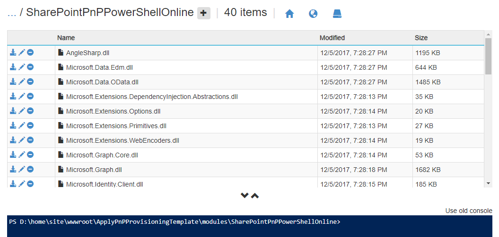

# Calling the PnP provisioning engine from a site script

Site designs offer a great way to standardize the look and feel of your site collections. However, you can't do some things with site designs, like add a footer to every page. You can use the PnP provisioning engine to create a template that you can use to provision an Application Customizer to a site. This Application Customizer can then update your page design, for example to register a footer on every page. 

This article describes how to create a site design that applies a PnP provisioning template to a site. The template will add an Application Customizer to render a footer.

The steps in this article use the following components:

- A site design and a site script
- Microsoft Flow
- Azure Queue storage
- An Azure Function
- A SharePoint Framework (SPFx) solution
- A PnP provisioning template
- A PnP PowerShell script
- An app ID and app secret with administrative rights on your tenant

You'll use these components to trigger the PnP provisioning code after you create the site and apply the site design.

## Set up app-only access to your tenant

To set up app-only access, you need to have two different pages on your tenant - one on the regular site, and the other on your SharePoint administration site.

1. Go to following URL in your tenant: `https://[yourtenant].sharepoint.com/_layouts/15/appregnew.aspx` (you can go to any site, but for now pick the root site).
1. Choose the **Generate** button next to the **Client Id** and **Client Secret** fields.
1. Enter a title for your app, such as "Site Provisioning".
1. In the **App Domain** box, enter **localhost**.
1. In the **Redirect URI** box, enter **https://localhost**.

    

1. Choose **Create**. 
1. Copy the values for **Client Id** and **Client Secret** - you will need them later.

Next, trust the app, so that it has the appropriate access to your tenant:

1. Go to `https://[yourtenant]-admin.sharepoint.com/_layouts/appinv.aspx` (notice the `-admin` in the URL).
1. In the **App Id** field, paste the **Client ID** that you copied, and choose **Lookup**.
1. In the **Permission Request XML** field, paste the following XML:

    ```xml
    <AppPermissionRequests AllowAppOnlyPolicy="true" >
        <AppPermissionRequest Scope="http://sharepoint/content/tenant" Right="FullControl" />
    </AppPermissionRequests>
    ```

1. Choose **Create**.
1. To confirm that you want to trust this app, choose **Trust It**.


## Create the Azure Queue storage

In this section, you will use Azure Queue storage to receive messages from Microsoft Flow. Every time a message shows up in the Queue storage, an Azure function is triggered to run a PowerShell script. 

To set up the Azure Queue storage:

1. Go to the [Azure portal](https://portal.azure.com) and sign in.
1. Choose **+ New**.
1. From the Azure Marketplace listings, select **Storage**, and in the Featured column, choose **Storage account - blob, file, table, queue**.
1. Provide values for the required fields. Select **Pin to dashboard**, and choose **Create**. It can take a few minutes for the storage account to be created.
1. Open the storage account and go to **Queues**.
1. Choose **+ Queue** at the top of the screen.
1. Enter **pnpprovisioningqueue** for the name, or enter your own value; be sure to follow the naming standard. Make note of the queue name; you will need this value when you create the Azure Function.
1. Go to **Access Keys** and note the **Storage Account Name** and the **key1 Key value**. You will need these values when you create the flow.


## Create the flow

To put a message in the queue, you need to create a flow. 

1. Go to the [Microsoft Flow](https://flow.microsoft.com) site, sign in, and choose **Create from Blank** at the top of the page.
1. Choose **Search hundreds of connectors and triggers** to select your trigger.
1. Search for **Request**, and select **Request - When a HTTP Request is received**.
1. Enter the following JSON as your request body:

    ```json
    {
        "type": "object",
        "properties": {
            "webUrl": {
                "type": "string"
            },
            "parameters": {
                "type": "object",
                "properties": {
                    "event": {
                        "type": "string"
                    },
                    "product": {
                        "type": "string"
                    }
                }
            }
        }
    }
    ``` 

1. Select **+ New Step** and choose **Add an action**.
1. Search for **Azure Queues** and select **Azure Queues - Put a message on a queue**.
1. Enter a descriptive name for the connection.
1. Enter the storage account name that you copied in the previous section.
1. Enter the storage shared key, which is the value of the **Key1 key value** field of your storage account.
1. Choose **Create**.
1. Select **pnpprovisioningqueue** for the queue name.
1. In the request body, you specified an incoming parameter called *webUrl*. To put the value of that field in the queue, click in the **message** field and select **webUrl** from the Dynamic Content picker.
1. Choose **Save Flow**. This will generate the URL that you will copy in the next step.
1. Choose the first step in your flow ('When an HTTP request is received') and copy the URL.
1. Save your flow.

Your flow should look like the following.


## Test the flow

To test your flow, you have to make a POST request. You can do this via PowerShell, as shown in the following example.

```powershell
$uri = "[the URI you copied in step 14 when creating the flow]"
$body = "{webUrl:'somesiteurl'}"
Invoke-RestMethod -Uri $uri -Method Post -ContentType "application/json" -Body $body
```

When you go to the main screen of your flow, you will see a run history. If your flow worked correctly, it will show `Succeeded`.
Now go to the queue you just created in Azure and choose **Refresh**. You should see an entry that shows that you correctly invoked the flow.

## Provision the SPFx solution

In this section, you'll use an existing SPFx solution, the [Regions Footer Application Customizer](https://github.com/SharePoint/sp-dev-fx-extensions/tree/master/samples/react-application-regions-footer). Follow the steps in the [Readme](https://github.com/SharePoint/sp-dev-fx-extensions/blob/master/samples/react-application-regions-footer/README.md) file in the sample repo to build and provision the solution.

## Create a PnP provisioning template

Copy the following provisioning template XML to a new file and save the file as FlowDemoTemplate.xml.

```xml
<?xml version="1.0"?>
<pnp:Provisioning xmlns:pnp="http://schemas.dev.office.com/PnP/2017/05/ProvisioningSchema">
  <pnp:Preferences Generator="OfficeDevPnP.Core, Version=2.20.1711.0, Culture=neutral, PublicKeyToken=3751622786b357c2" />
  <pnp:Templates ID="CONTAINER-FLOWDEMO">
    <pnp:ProvisioningTemplate ID="TEMPLATE-FLOWDEMO" Version="1" BaseSiteTemplate="GROUP#0" Scope="RootSite">
      <pnp:CustomActions>
        <pnp:WebCustomActions>
          <pnp:CustomAction Name="spfx-react-app-customizer" Description="Custom action for Application Customizer" Location="ClientSideExtension.ApplicationCustomizer" Title="spfx-react-app-customizer" Sequence="0" Rights="" RegistrationType="None" ClientSideComponentId="67fd1d01-84e8-4fbf-85bd-4b80768c6080" ClientSideComponentProperties="{&quot;SourceTermSetName&quot;:&quot;Regions&quot;}" />
        </pnp:WebCustomActions>
      </pnp:CustomActions>
    </pnp:ProvisioningTemplate>
  </pnp:Templates>
</pnp:Provisioning>
```

> [!NOTE]
> The provisioning template adds a custom action to a solution. The **ClientSideComponentId** is associated with the [Regions Footer Application Customizer](https://github.com/SharePoint/sp-dev-fx-extensions/tree/master/samples/react-application-regions-footer) that you provisioned earlier. If you run this demo with your own SPFx solution, change the **ClientSideComponentId** and optionally the **ClientSideComponentProperties** attribute values in the XML.

## Create the Azure Function

1. Go to the [Azure Portal](https://portal.azure.com).
1. Search for **Function App** and create a new function app. In the **Storage** field, select **Use existing**, and select the storage account that you created earlier. Set the other values as required.
1. Open the Function app and select **Functions** > **New function**.

    

1. From the Language drop-down box, select **PowerShell**.
1. Select **QueueTrigger - PowerShell**.
1. Name the function **ApplyPnPProvisioningTemplate**. 
1. Enter the name of the queue you created earlier.
1. Choose **Create**. An editor where you can enter PowerShell cmdlets will open. 

Next, you'll upload the PnP PowerShell module so that you can use it in the Azure Function.

## Upload the PnP PowerShell module for your Azure Function

You'll need to download the PnP PowerShell module so that you can upload it for your Azure Function.

1. Create a temporary folder on your computer.
1. Launch PowerShell and enter the following:
    ```powershell
    Save-Module -Name SharePointPnPPowerShellOnline -Path [pathtoyourfolder]
    ```

The PowerShell module files will download to a folder within the folder that you created. 

Next, upload the files so that your Azure Function can use the module.

1. Go to the main page of your Function App and select **Platform Features**.

    

1. Select **Advanced tools (Kudu)**.

    

1. On the main Kudu page, select **Debug Console** and pick either **CMD** or **PowerShell**.
1. Choose the file explorer on the upper part of the page, and go to **site\wwwroot\\[nameofyourazurefunction]**.
1. Create a new folder named **modules**.
    
    

1. In the modules folder, create another folder called **SharePointPnPPowerShellOnline** and go to that folder.
1. In File Explorer on your computer, go to the folder where you downloaded the PnP PowerShell module files. Open the 
**SharePointPnPPowerShellOnline\2.20.1711.0** folder (notice that the version number might be different).
1. Drag and drop all the files from this folder into the folder in Kudu to upload them.

   

## Finish the Azure Function

1. Go back to your Azure Function and expand the files tab to the right.

    

1. Select **Upload** and upload the provisioning template file that you created earlier.
1. Replace the PowerShell script with the following:

    ```powershell
    $in = Get-Content $triggerInput -Raw
    Write-Output "Incoming request for '$in'"
    Connect-PnPOnline -AppId $env:SPO_AppId -AppSecret $env:SPO_AppSecret -Url $in
    Write-Output "Connected to site"
    Apply-PnPProvisioningTemplate -Path D:\home\site\wwwroot\ApplyPnPProvisioningTemplate\FlowDemoTemplate.xml
    ```

Notice that you're using two environment variables: ```SPO_AppId```and ```SPO_AppSecret```. To set those variables, go to the main Function App page in the Azure Portal, select **Application Settings**, and add two new application settings:

1. `SPO_AppId` - Set the value to the Client ID you copied in the first step when you created your app on your tenant.
2. `SPO_AppSecret` - Set the value to the Client Secret that you copied in the first step when you created your app on your tenant.

## Create the site design

Open PowerShell and make sure that you have the [SharePoint Online Management Shell](https://www.microsoft.com/en-us/download/details.aspx?id=35588) installed.

Connect to your tenant using **Connect-SPOService**.

```powershell
Connect-SPOService -Url https://[yourtenant]-admin.sharepoint.com
```

Now you can get the existing site designs. 

```powershell
Get-SPOSiteDesign
```

To create a site design, you first need to create a site script. A site design is a container that refers to one or more site scripts.

1. Copy the following JSON code to your clipboard and modify it. Set the **url** property to the value you copied when you created the flow. The URL looks similar to the following:

    `https://prod-27.westus.logic.azure.com:443/workflows/ef7434cf0d704dd48ef5fb6...oke?api-version=2016-06-01&sp=%2Ftriggers%2Fmanual%2Frun`

    ```json
    {
        "$schema": "schema.json",
        "actions": [
        {
                "verb": "triggerFlow",
                "url": "[paste the workflow trigger URL here]",
                "name": "Apply Template",
                "parameters": {
                    "event":"",
                    "product":""
                }
        }
        ],
        "bindata": {},
        "version": 1
    }
    ```

1. Select the JSON again and copy it again to your clipboard.
1. Open PowerShell and enter the following to copy the script into a variable and create the site script:

    ```powershell
    $script = Get-Clipboard -Raw
    Add-SPOSiteScript -Title "Apply PnP Provisioning Template" -Content $script
    Get-SPOSiteScript
    ```

1. You will see a list of one or more site scripts, including the site script you just created. Select the ID of the site script that you created and copy it to the clipboard.
1. Use the following command to create the site design:

    ```powershell
    Add-SPOSiteDesign -Title "Site with footer" -SiteScripts [Paste the ID of the Site Script here] -WebTemplate "64"
    ```

The **Add-SPOSiteDesign** cmdlet associates the site design with the team site. If you want to associate the design with a communication site, use the value "68".

## Verify the results

After you created your Azure Queue storage, you created the app ID for app-only access, the Azure Function, and the site design. You then triggered the Microsoft Flow from the site design. 

To test the results, create a new site. In your SharePoint tenant, select **SharePoint** > **Create Site** > **Team Site**. Your new site design should show up as a design option. Notice that the site design is applied after the site is created. If you configured it correctly, your flow will be triggered. You can check the run history of the flow to verify that it ran correctly. Note that the footer might not show up immediately; if you don't see it, wait a minute and reload your site to check again.


