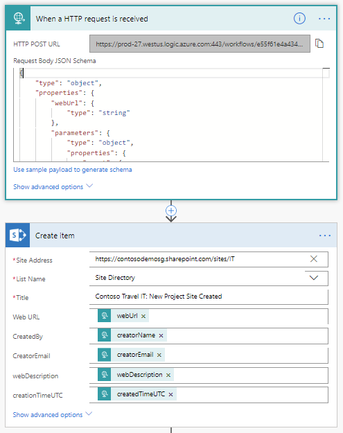

# Calling Microsoft Flow from a site script

Site designs are a powerful extensibility mechanism for customizing - and standardizing - the look and feel of your site collections. One of the script actions - **triggerFlow** - can be used to call custom solutions to apply configurations we don't support natively. Flow can also be used for business automation - in this case, used with site designs to track the creation of sites!

This article describes how to build a simple site directory using a site design and Microsoft Flow. Whenever a site is created using this site design, details of the site are captured and written to a list. 

The steps in this article illustrate the following components:

- A SharePoint list 
- A site design and a site script
- Microsoft Flow

You'll first create the SharePoint list and then it will be referenced in your Flow - which will be triggered by the site design which is applied after the site is created. 

## Create your site directory list

You need to first set up the list that will be used to record all the sites created using this site design. 

1. Select a site collection to host your list. 

2. Create a new list named "Site Directory"

3. Configure the following fields:

- webUrl (Hyperlink or Picture)
- webDescription (Single line of text)
- creatorName (Single line of text)
- creatorEmail (Single line of text)
- createdTimeUTC (Single line of text)


## Create the Flow

In order to capture the site creation event and create the corresponding list item, you need to create a Flow - which can then be referenced in your site design's site script: 

1. Go to the [Microsoft Flow](https://flow.microsoft.com) site, sign in, and choose **Create from Blank** at the top of the page. 

2. Choose **Search hundreds of connectors and triggers** to select your trigger.
 
3. Search for **Request**, and then choose **Request - When an HTTP Request is received**. 

4. Enter the following JSON as your request body:

  ```
  {
    "type": "object",
    "properties": {
        "webUrl": {
            "type": "string"
        },
        "parameters": {
            "type": "object",
            "properties": {
                "event": {
                    "type": "string"
                },
                "product": {
                    "type": "string"
                }
            }
        },
        "webDescription": {
            "type": "string"
        },
        "creatorName": {
            "type": "string"
        },
        "creatorEmail": {
            "type": "string"
        },
        "createdTimeUTC": {
            "type": "string"
        }
    }
}
```

5. Select **+ New Step**, and choose **Add an action**. 

6. Search for **Create item**, and select **SharePoint - Create item**.
 
7. Enter the site address where the list above was created.
 
8. Select the "Site Directory" list you created in the previous step.

9. Enter a value for the **Title** field - this will be the same value for each list item, for example "Contoso Travel: New Project Site Created". 

10. For each field in your list form, add the corresponding element from the Dynamic Content picker. When you are done your action should look something like this: 



11. Choose **Save Flow**. This generates the HTTP Post URL that you will need to copy for your site script triggerFlow action. 

14. Choose the first step in your flow ('When an HTTP request is received') and copy the URL. 

15. Save your flow.

## Create the site design

1. Open PowerShell and make sure that you have the latest [SharePoint Online Management Shell](https://www.microsoft.com/en-us/download/details.aspx?id=35588) installed.

2. Connect to your tenant using **Connect-SPOService**.

   ```powershell
    Connect-SPOService -Url https://[yourtenant]-admin.sharepoint.com
   ```

3. Now you can get the existing site designs. 

   ```powershell
    Get-SPOSiteDesign
   ```

<br/>

To create a site design, you first need to create a site script. A site design is a container that refers to one or more site scripts.

1. Copy the following JSON code to your clipboard and modify it. Set the `url` property to the value that you copied when you created the flow. The URL looks similar to the following:

    `https://prod-27.westus.logic.azure.com:443/workflows/ef7434cf0d704dd48ef5fb6...oke?api-version=2016-06-01&sp=%2Ftriggers%2Fmanual%2Frun`

   ```json
    {
        "$schema": "schema.json",
        "actions": [
        {
                "verb": "triggerFlow",
                "url": "[paste the workflow trigger URL here]",
                "name": "Record site creation event",
                "parameters": {
                    "event":"site creation",
                    "product":"SharePoint Online"
                }
        }
        ]
    }
   ```

2. Select the JSON again and copy it again to your clipboard. 

3. Open PowerShell and enter the following to copy the script into a variable and create the site script:

   ```powershell
    $script = Get-Clipboard -Raw
    Add-SPOSiteScript -Title "Site Script to record site creation event" -Content $script
    Get-SPOSiteScript
   ```

4. You will see a list of one or more site scripts, including the site script you just created. Select the ID of the site script that you created, and copy it to the clipboard. 

5. Use the following command to create the site design:

   ```powershell
    Add-SPOSiteDesign -Title "Record site creation" -Description "The creation of this site will be recorded in the site directory list" -SiteScripts [Paste the ID of the Site Script here] -WebTemplate "64"
   ```
> [!NOTE]
> The **Add-SPOSiteDesign** cmdlet associates the site design with the Team site. If you want to associate the design with a Communication site, use the value "68".

## Verify the results

To test the results, create a new site. In your SharePoint tenant, select **SharePoint** > **Create Site** > **Team Site**. 

Your new site design should show up as a design option. Notice that the site design is applied after the site is created. If you configured it correctly, your flow will be triggered. You can check the run history of the flow to verify that it ran correctly.


## See also

- [SharePoint site design and site script overview](site-design-overview.md)
- [Calling the PnP provisioning engine from a site script](site-design-pnp-provisioning.md)

