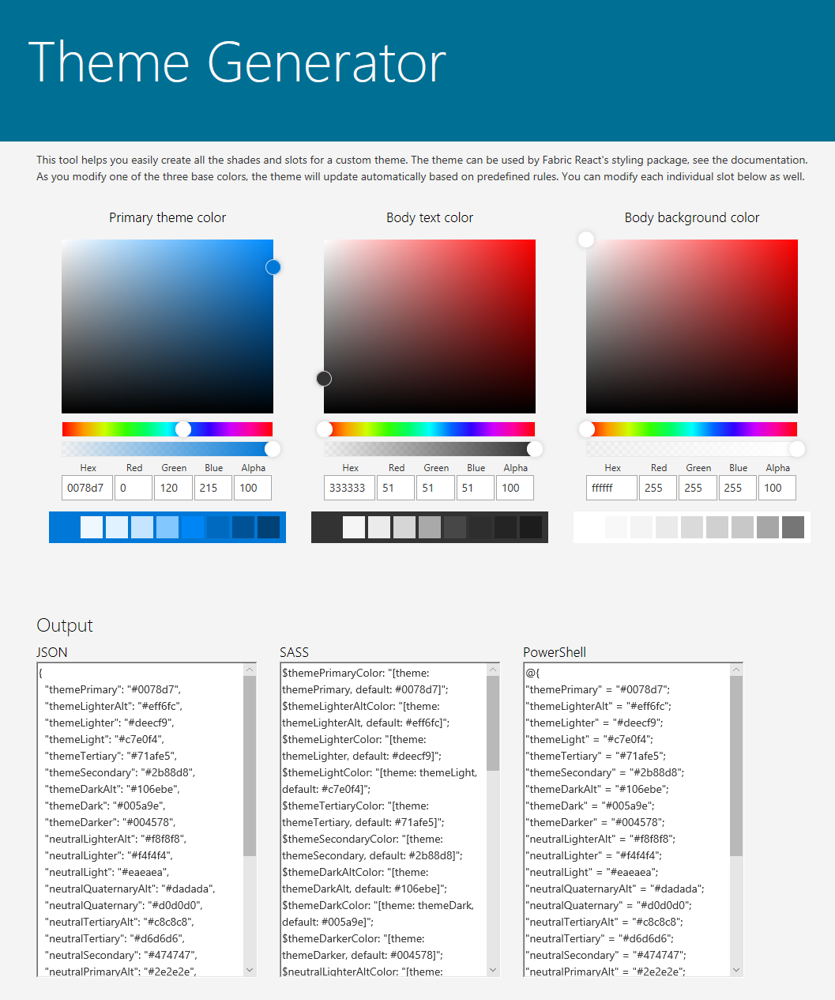

# SharePoint site theming: JSON schema

The new [SharePoint site theming](sharepoint-site-theming-overview.md) features use a JSON schema to store color settings and other information about each theme. Theme settings are stored in a JSON object that contains the following keys:

* __name__ &mdash; The name of the theme, which appears in the theme picker UI and is also used by administrators and developers to refer to the theme in PowerShell cmdlets or calls to the SharePoint REST API.
* __isInverted__ &mdash; This value should be false for light themes and true for dark themes; it controls whether SharePoint will use dark or light theme colors to render text on colored backgrounds.
* __backgroundImageUri__ &mdash; The URI of an optional background image for the theme (value can be blank if no background image).
* __theme__ &mdash; The RGB color settings for the theme, stored as a nested JSON object with the following keys:
    * themePrimary
    * themeLighterAlt
    * themeLighter
    * themeLight
    * themeTertiary
    * themeSecondary
    * themeDarkAlt
    * themeDark
    * themeDarker
    * neutralLighterAlt
    * neutralLighter
    * neutralLight
    * neutralQuaternaryAlt
    * neutralQuaternary
    * neutralTertiaryAlt
    * neutralTertiary
    * neutralSecondaryAlt
    * neutralSecondary
    * neutralPrimaryAlt
    * neutralPrimary
    * neutralDark
    * black
    * white
    * primaryBackground
    * primaryText
    * error

The colors in the _theme_ element are specified as 6-digit or 3-digit hexadecimal RGB string values.

The following is an example of a JSON object that defines a theme.

```json
{ 
    name: 'Blue', 
    isInverted: true, 
    backgroundImageUri: '', 
    theme: { 
        themePrimary: "#00bcf2", 
        themeLighterAlt: "#00090c", 
        themeLighter: "#001318", 
        themeLight: "#002630", 
        themeTertiary: "#005066", 
        themeSecondary: "#00abda", 
        themeDarkAlt: "#0ecbff", 
        themeDark: "#44d6ff", 
        themeDarker: "#6cdfff", 
        neutralLighterAlt: "#2e3340", 
        neutralLighter: "#353a49", 
        neutralLight: "#404759", 
        neutralQuaternaryAlt: "#474e62", 
        neutralQuaternary: "#4c546a", 
        neutralTertiaryAlt: "#646e8a", 
        neutralTertiary: "#c8c8c8", 
        neutralSecondaryAlt: "#d0d0d0", 
        neutralSecondary: "#dadada", 
        neutralPrimaryAlt: "#eaeaea", 
        neutralPrimary: "#ffffff", 
        neutralDark: "#f4f4f4", 
        black: "#f8f8f8", 
        white: "#262a35", 
        primaryBackground: "#262a35", 
        primaryText: "#ffffff", 
        error: "#ff5f5f" 
    } 
} 
```

<br/>

The SharePoint Framework includes eight built-in themes: six on light backgrounds, and two on dark backgrounds. You might find it useful to create a custom theme by starting from one of the built-in themes and adjusting it to suit your needs.

Another option is to use the [Theme Generator tool](https://developer.microsoft.com/en-us/fabric#/styles/themegenerator) to build a custom theme. It provides an interactive UI for selecting theme colors, and automatically generates the JSON, SASS, and PowerShell definitions for your custom theme:



The following is a summary of the built-in themes, including JSON definitions for the theme colors that you can use as a starting point for customization.

## Red theme

The following table shows the color palette used by the Red theme.

<table>
<tr>
<td style="color:white; background-color:#751b1e">themeDarker: #751b1e</td>
<td style="color:white; background-color:#000000">black: #000000</td>
</tr>
<tr>
<td style="color:white; background-color:#952226">themeDark: #952226</td>
<td style="color:white; background-color:#212121">neutralDark: #212121</td>
</tr>
<tr>
<td style="color:white; background-color:#c02b30">themeDarkAlt: #c02b30</td>
<td style="color:white; background-color:#333">neutralPrimary: #333</td>
</tr>
<tr>
<td rowspan="3" style="font-weight:bold; vertical-align:middle; color:white; background-color:#d13438">themePrimary: #d13438</td>
<td style="color:white; background-color:#3c3c3c">neutralPrimaryAlt: #3c3c3c</td>
</tr>
<tr>
<td style="color:white; background-color:#666666">neutralSecondary: #666666</td>
</tr>
<tr>
<td style="color:black; background-color:#a6a6a6">neutralTertiary: #a6a6a6</td>
</tr>
<tr>
<td style="color:white; background-color:#d6494d">themeSecondary: #d6494d</td>
<td style="color:black; background-color:#c8c8c8">neutralTertiaryAlt: #c8c8c8</td>
</tr>
<tr>
<td style="color:black; background-color:#ecaaac">themeTertiary: #ecaaac</td>
<td style="color:black; background-color:#eaeaea">neutralLight: #eaeaea</td>
</tr>
<tr>
<td style="color:black; background-color:#f6d6d8">themeLight: #f6d6d8</td>
<td style="color:black; background-color:#f4f4f4">neutralLighter: #f4f4f4</td></tr>
<tr>
<td style="color:black; background-color:#faebeb">themeLighter: #faebeb</td>
<td style="color:black; background-color:#f8f8f8">neutralLighterAlt: #f8f8f8</td>
</tr>
<tr>
<td style="color:black; background-color:#fdf5f5">themeLighterAlt: #fdf5f5</td>
<td style="color:black; background-color:#fff">white: #fff</td>
</tr>
</table>

<br/>

The following code shows how to define a dictionary in PowerShell for the Red theme's color palette.
```powershell
{ 
    themeDarker: '#751b1e', 
    themeDark: '#952226', 
    themeDarkAlt: '#c02b30', 
    themePrimary: '#d13438', 
    themeSecondary: '#d6494d', 
    themeTertiary: '#ecaaac', 
    themeLight: '#f6d6d8', 
    themeLighter: '#faebeb', 
    themeLighterAlt: '#fdf5f5', 
    black: '#000000', 
    neutralDark: '#212121', 
    neutralPrimary: '#333', 
    neutralPrimaryAlt: '#3c3c3c', 
    neutralSecondary: '#666666', 
    neutralTertiary: '#a6a6a6', 
    neutralTertiaryAlt: '#c8c8c8', 
    neutralLight: '#eaeaea', 
    neutralLighter: '#f4f4f4', 
    neutralLighterAlt: '#f8f8f8', 
    white: '#fff', 
    neutralQuaternaryAlt: '#dadada', 
    neutralQuaternary: '#d0d0d0', 
    neutralSecondaryAlt: '#767676', 
    primaryBackground: '#fff', 
    primaryText: '#333' 
}
```

<br/>

## Orange theme

The following table shows the color palette used by the Orange theme.

<table>
<tr>
<td style="color:white; background-color:#6f2d09">themeDarker: #6f2d09</td>
<td style="color:white; background-color:#000000">black: #000000</td>
</tr>
<tr>
<td style="color:white; background-color:#8d390b">themeDark: #8d390b</td>
<td style="color:white; background-color:#212121">neutralDark: #212121</td>
</tr>
<tr>
<td style="color:white; background-color:#b5490f">themeDarkAlt: #b5490f</td>
<td style="color:white; background-color:#333">neutralPrimary: #333</td>
</tr>
<tr>
<td rowspan="3" style="font-weight:bold; vertical-align:middle; color:white; background-color:#ca5010">themePrimary: #ca5010</td>
<td style="color:white; background-color:#3c3c3c">neutralPrimaryAlt: #3c3c3c</td>
</tr>
<tr>
<td style="color:white; background-color:#666666">neutralSecondary: #666666</td>
</tr>
<tr>
<td style="color:black; background-color:#a6a6a6">neutralTertiary: #a6a6a6</td>
</tr>
<tr>
<td style="color:white; background-color:#e55c12">themeSecondary: #e55c12</td>
<td style="color:black; background-color:#c8c8c8">neutralTertiaryAlt: #c8c8c8</td>
</tr>
<tr>
<td style="color:black; background-color:#f6b28d">themeTertiary: #f6b28d</td>
<td style="color:black; background-color:#eaeaea">neutralLight: #eaeaea</td>
</tr>
<tr>
<td style="color:black; background-color:#fbdac9">themeLight: #fbdac9</td>
<td style="color:black; background-color:#f4f4f4">neutralLighter: #f4f4f4</td>
</tr>
<tr>
<td style="color:black; background-color:#fdede4">themeLighter: #fdede4</td>
<td style="color:black; background-color:#f8f8f8">neutralLighterAlt: #f8f8f8</td>
</tr>
<tr>
<td style="color:black; background-color:#fef6f1">themeLighterAlt: #fef6f1</td>
<td style="color:black; background-color:#fff">white: #fff</td>
</tr>
</table>

<br/>

The following code shows how to define a dictionary in PowerShell for the Orange theme's color palette.

```powershell
{ 
    themeDarker: '#6f2d09', 
    themeDark: '#8d390b', 
    themeDarkAlt: '#b5490f', 
    themePrimary: '#ca5010', 
    themeSecondary: '#e55c12', 
    themeTertiary: '#f6b28d', 
    themeLight: '#fbdac9', 
    themeLighter: '#fdede4', 
    themeLighterAlt: '#fef6f1', 
    black: '#000000', 
    neutralDark: '#212121', 
    neutralPrimary: '#333', 
    neutralPrimaryAlt: '#3c3c3c', 
    neutralSecondary: '#666666', 
    neutralTertiary: '#a6a6a6', 
    neutralTertiaryAlt: '#c8c8c8', 
    neutralLight: '#eaeaea', 
    neutralLighter: '#f4f4f4', 
    neutralLighterAlt: '#f8f8f8', 
    white: '#fff', 
    neutralQuaternaryAlt: '#dadada', 
    neutralQuaternary: '#d0d0d0', 
    neutralSecondaryAlt: '#767676', 
    primaryBackground: '#fff', 
    primaryText: '#333' 
}
```

<br/>

## Green theme

The following table shows the color palette used by the Green theme.

<table>
<tr>
<td style="color:white; background-color:#094c23">themeDarker: #094c23</td>
<td style="color:white; background-color:#000000">black: #000000</td>
</tr>
<tr>
<td style="color:white; background-color:#0c602c">themeDark: #0c602c</td>
<td style="color:white; background-color:#212121">neutralDark: #212121</td>
</tr>
<tr>
<td style="color:white; background-color:#0f7c39">themeDarkAlt: #0f7c39</td>
<td style="color:white; background-color:#333">neutralPrimary: #333</td>
</tr>
<tr>
<td rowspan="3" style="font-weight:bold; vertical-align:middle; color:white; background-color:#10893e">themePrimary: #10893e</td>
<td style="color:white; background-color:#3c3c3c">neutralPrimaryAlt: #3c3c3c</td>
</tr>
<tr>
<td style="color:white; background-color:#666666">neutralSecondary: #666666</td>
</tr>
<tr>
<td style="color:black; background-color:#a6a6a6">neutralTertiary: #a6a6a6</td>
</tr>
<tr>
<td style="color:white; background-color:#14a94e">themeSecondary: #14a94e</td>
<td style="color:black; background-color:#c8c8c8">neutralTertiaryAlt: #c8c8c8</td>
</tr>
<tr>
<td style="color:black; background-color:#7aefa7">themeTertiary: #7aefa7</td>
<td style="color:black; background-color:#eaeaea">neutralLight: #eaeaea</td>
</tr>
<tr>
<td style="color:black; background-color:#bff7d5">themeLight: #bff7d5</td>
<td style="color:black; background-color:#f4f4f4">neutralLighter: #f4f4f4</td>
</tr>
<tr>
<td style="color:black; background-color:#dffbea">themeLighter: #dffbea</td>
<td style="color:black; background-color:#f8f8f8">neutralLighterAlt: #f8f8f8</td>
</tr>
<tr>
<td style="color:black; background-color:#effdf4">themeLighterAlt: #effdf4</td>
<td style="color:black; background-color:#fff">white: #fff</td>
</tr>
</table>

<br/>

The following code shows how to define a dictionary in PowerShell for the Green theme's color palette.

```powershell
{ 
    themePrimary: '#10893e', 
    themeLighterAlt: '#effdf4', 
    themeLighter: '#dffbea', 
    themeLight: '#bff7d5', 
    themeTertiary: '#7aefa7', 
    themeSecondary: '#14a94e', 
    themeDarkAlt: '#0f7c39', 
    themeDark: '#0c602c', 
    themeDarker: '#094c23', 
    neutralLighterAlt: '#f8f8f8', 
    neutralLighter: '#f4f4f4', 
    neutralLight: '#eaeaea', 
    neutralQuaternaryAlt: '#dadada', 
    neutralQuaternary: '#d0d0d0', 
    neutralTertiaryAlt: '#c8c8c8', 
    neutralTertiary: '#a6a6a6', 
    neutralSecondaryAlt: '#767676', 
    neutralSecondary: '#666666', 
    neutralPrimary: '#333', 
    neutralPrimaryAlt: '#3c3c3c', 
    neutralDark: '#212121', 
    black: '#000000', 
    white: '#fff', 
    primaryBackground: '#fff', 
    primaryText: '#333' 
}
```

<br/>

## Blue theme

The following table shows the color palette used by the Blue theme.

<table>
<tr>
<td style="color:white; background-color:#004578">themeDarker: #004578</td>
<td style="color:white; background-color:#000000">black: #000000</td>
</tr>
<tr>
<td style="color:white; background-color:#005a9e">themeDark: #005a9e</td>
<td style="color:white; background-color:#212121">neutralDark: #212121</td>
</tr>
<tr>
<td style="color:white; background-color:#106ebe">themeDarkAlt: #106ebe</td>
<td style="color:white; background-color:#333">neutralPrimary: #333</td>
</tr>
<tr>
<td rowspan="3" style="font-weight:bold; vertical-align:middle; color:white; background-color:#0078d7">themePrimary: #0078d7</td>
<td style="color:white; background-color:#3c3c3c">neutralPrimaryAlt: #3c3c3c</td>
</tr>
<tr>
<td style="color:white; background-color:#666666">neutralSecondary: #666666</td>
</tr>
<tr>
<td style="color:black; background-color:#a6a6a6">neutralTertiary: #a6a6a6</td>
</tr>
<tr>
<td style="color:white; background-color:#2b88d8">themeSecondary: #2b88d8</td>
<td style="color:black; background-color:#c8c8c8">neutralTertiaryAlt: #c8c8c8</td>
</tr>
<tr>
<td style="color:black; background-color:#71afe5">themeTertiary: #71afe5</td>
<td style="color:black; background-color:#eaeaea">neutralLight: #eaeaea</td>
</tr>
<tr>
<td style="color:black; background-color:#c7e0f4">themeLight: #c7e0f4</td>
<td style="color:black; background-color:#f4f4f4">neutralLighter: #f4f4f4</td>
</tr>
<tr>
<td style="color:black; background-color:#deecf9">themeLighter: #deecf9</td>
<td style="color:black; background-color:#f8f8f8">neutralLighterAlt: #f8f8f8</td>
</tr>
<tr>
<td style="color:black; background-color:#eff6fc">themeLighterAlt: #eff6fc</td>
<td style="color:black; background-color:#fff">white: #fff</td>
</tr>
</table>

<br/>

The following code shows how to define a dictionary in PowerShell for the Blue theme's color palette.

```powershell
{ 
    themePrimary: '#0078d7', 
    themeLighterAlt: '#eff6fc', 
    themeLighter: '#deecf9', 
    themeLight: '#c7e0f4', 
    themeTertiary: '#71afe5', 
    themeSecondary: '#2b88d8', 
    themeDarkAlt: '#106ebe', 
    themeDark: '#005a9e', 
    themeDarker: '#004578', 
    neutralLighterAlt: '#f8f8f8', 
    neutralLighter: '#f4f4f4', 
    neutralLight: '#eaeaea', 
    neutralQuaternaryAlt: '#dadada', 
    neutralQuaternary: '#d0d0d0', 
    neutralTertiaryAlt: '#c8c8c8', 
    neutralTertiary: '#a6a6a6', 
    neutralSecondaryAlt: '#767676', 
    neutralSecondary: '#666666', 
    neutralPrimary: '#333', 
    neutralPrimaryAlt: '#3c3c3c', 
    neutralDark: '#212121', 
    black: '#000000', 
    white: '#fff', 
    primaryBackground: '#fff', 
    primaryText: '#333' 
}
```

<br/>

## Purple theme

The following table shows the color palette used by the Purple theme.

<table>
<tr>
<td style="color:white; background-color:#27268a">themeDarker: #27268a</td>
<td style="color:white; background-color:#000000">black: #000000</td>
</tr>
<tr>
<td style="color:white; background-color:#3230b0">themeDark: #3230b0</td>
<td style="color:white; background-color:#212121">neutralDark: #212121</td>
</tr>
<tr>
<td style="color:white; background-color:#5250cf">themeDarkAlt: #5250cf</td>
<td style="color:white; background-color:#333">neutralPrimary: #333</td>
</tr>
<tr>
<td rowspan="3" style="font-weight:bold; vertical-align:middle; color:white; background-color:#6b69d6">themePrimary: #6b69d6</td>
<td style="color:white; background-color:#3c3c3c">neutralPrimaryAlt: #3c3c3c</td>
</tr>
<tr>
<td style="color:white; background-color:#666666">neutralSecondary: #666666</td>
</tr>
<tr>
<td style="color:black; background-color:#a6a6a6">neutralTertiary: #a6a6a6</td>
</tr>
<tr>
<td style="color:white; background-color:#7a78da">themeSecondary: #7a78da</td>
<td style="color:black; background-color:#c8c8c8">neutralTertiaryAlt: #c8c8c8</td>
</tr>
<tr>
<td style="color:black; background-color:#c1c0ee">themeTertiary: #c1c0ee</td>
<td style="color:black; background-color:#eaeaea">neutralLight: #eaeaea</td>
</tr>
<tr>
<td style="color:black; background-color:#e1e1f7">themeLight: #e1e1f7</td>
<td style="color:black; background-color:#f4f4f4">neutralLighter: #f4f4f4</td>
</tr>
<tr>
<td style="color:black; background-color:#f0f0fb">themeLighter: #f0f0fb</td>
<td style="color:black; background-color:#f8f8f8">neutralLighterAlt: #f8f8f8</td>
</tr>
<tr>
<td style="color:black; background-color:#f8f7fd">themeLighterAlt: #f8f7fd</td>
<td style="color:black; background-color:#fff">white: #fff</td>
</tr>
</table>

<br/>

The following code shows how to define a dictionary in PowerShell for the Purple theme's color palette.

```powershell
{ 
    themePrimary: '#6b69d6', 
    themeLighterAlt: '#f8f7fd', 
    themeLighter: '#f0f0fb', 
    themeLight: '#e1e1f7', 
    themeTertiary: '#c1c0ee', 
    themeSecondary: '#7a78da', 
    themeDarkAlt: '#5250cf', 
    themeDark: '#3230b0', 
    themeDarker: '#27268a', 
    neutralLighterAlt: '#f8f8f8', 
    neutralLighter: '#f4f4f4', 
    neutralLight: '#eaeaea', 
    neutralQuaternaryAlt: '#dadada', 
    neutralQuaternary: '#d0d0d0', 
    neutralTertiaryAlt: '#c8c8c8', 
    neutralTertiary: '#a6a6a6', 
    neutralSecondaryAlt: '#767676', 
    neutralSecondary: '#666666', 
    neutralPrimary: '#333', 
    neutralPrimaryAlt: '#3c3c3c', 
    neutralDark: '#212121', 
    black: '#000000', 
    white: '#fff', 
    primaryBackground: '#fff', 
    primaryText: '#333' 
}
```

<br/>

## Gray theme

The following table shows the color palette used by the Gray theme.

<table>
<tr>
<td style="color:white; background-color:#323130">themeDarker: #323130</td>
<td style="color:white; background-color:#000000">black: #000000</td>
</tr>
<tr>
<td style="color:white; background-color:#403e3d">themeDark: #403e3d</td>
<td style="color:white; background-color:#212121">neutralDark: #212121</td>
</tr>
<tr>
<td style="color:white; background-color:#53504e">themeDarkAlt: #53504e</td>
<td style="color:white; background-color:#333">neutralPrimary: #333</td>
</tr>
<tr>
<td rowspan="3" style="font-weight:bold; vertical-align:middle; color:white; background-color:#5d5a58">themePrimary: #5d5a58</td>
<td style="color:white; background-color:#3c3c3c">neutralPrimaryAlt: #3c3c3c</td>
</tr>
<tr>
<td style="color:white; background-color:#666666">neutralSecondary: #666666</td>
</tr>
<tr>
<td style="color:black; background-color:#a6a6a6">neutralTertiary: #a6a6a6</td>
</tr>
<tr>
<td style="color:white; background-color:#6d6a67">themeSecondary: #6d6a67</td>
<td style="color:black; background-color:#c8c8c8">neutralTertiaryAlt: #c8c8c8</td>
</tr>
<tr>
<td style="color:black; background-color:#bbb9b8">themeTertiary: #bbb9b8</td>
<td style="color:black; background-color:#eaeaea">neutralLight: #eaeaea</td>
</tr>
<tr>
<td style="color:black; background-color:#dfdedd">themeLight: #dfdedd</td>
<td style="color:black; background-color:#f4f4f4">neutralLighter: #f4f4f4</td>
</tr>
<tr>
<td style="color:black; background-color:#efeeee">themeLighter: #efeeee</td>
<td style="color:black; background-color:#f8f8f8">neutralLighterAlt: #f8f8f8</td>
</tr>
<tr>
<td style="color:black; background-color:#f7f7f7">themeLighterAlt: #f7f7f7</td>
<td style="color:black; background-color:#fff">white: #fff</td>
</tr>
</table>

<br/>

The following code shows how to define a dictionary in PowerShell for the Gray theme's color palette.

```powershell
{ 
    themePrimary: '#5d5a58', 
    themeLighterAlt: '#f7f7f7', 
    themeLighter: '#efeeee', 
    themeLight: '#dfdedd', 
    themeTertiary: '#bbb9b8', 
    themeSecondary: '#6d6a67', 
    themeDarkAlt: '#53504e', 
    themeDark: '#403e3d', 
    themeDarker: '#323130', 
    neutralLighterAlt: '#f8f8f8', 
    neutralLighter: '#f4f4f4', 
    neutralLight: '#eaeaea', 
    neutralQuaternaryAlt: '#dadada', 
    neutralQuaternary: '#d0d0d0', 
    neutralTertiaryAlt: '#c8c8c8', 
    neutralTertiary: '#a6a6a6', 
    neutralSecondaryAlt: '#767676', 
    neutralSecondary: '#666666', 
    neutralPrimary: '#333', 
    neutralPrimaryAlt: '#3c3c3c', 
    neutralDark: '#212121', 
    black: '#000000', 
    white: '#fff', 
    primaryBackground: '#fff', 
    primaryText: '#333' 
}
```

<br/>

## Dark Yellow theme

The following table shows the color palette used by the Dark Yellow theme.

<table>
<tr>
<td style="color:black; background-color:#fff171">themeDarker: #fff171</td>
<td style="color:black; background-color:#f8f8f8">black: #f8f8f8</td>
</tr>
<tr>
<td style="color:black; background-color:#ffed4b">themeDark: #ffed4b</td>
<td style="color:black; background-color:#f4f4f4">neutralDark: #f4f4f4</td>
</tr>
<tr>
<td style="color:black; background-color:#ffe817">themeDarkAlt: #ffe817</td>
<td style="color:black; background-color:#ffffff">neutralPrimary: #ffffff</td>
</tr>
<tr>
<td rowspan="3" style="font-weight:bold; vertical-align:middle; color:white; background-color:#fce100">themePrimary: #fce100</td>
<td style="color:black; background-color:#eaeaea">neutralPrimaryAlt: #eaeaea</td>
</tr>
<tr>
<td style="color:black; background-color:#dadada">neutralSecondary: #dadada</td>
</tr>
<tr>
<td style="color:black; background-color:#c8c8c8">neutralTertiary: #c8c8c8</td>
</tr>
<tr>
<td style="color:white; background-color:#e3cc00">themeSecondary: #e3cc00</td>
<td style="color:white; background-color:#6d6d6d">neutralTertiaryAlt: #6d6d6d</td>
</tr>
<tr>
<td style="color:white; background-color:#6a5f00">themeTertiary: #6a5f00</td>
<td style="color:white; background-color:#3f3f3f">neutralLight: #3f3f3f</td>
</tr>
<tr>
<td style="color:white; background-color:#322d00">themeLight: #322d00</td>
<td style="color:white; background-color:#313131">neutralLighter: #313131</td>
</tr>
<tr>
<td style="color:white; background-color:#191700">themeLighter: #191700</td>
<td style="color:white; background-color:#282828">neutralLighterAlt: #282828</td>
</tr>
<tr>
<td style="color:white; background-color:#0d0b00">themeLighterAlt: #0d0b00</td>
<td style="color:white; background-color:#1f1f1f">white: #1f1f1f</td>
</tr>
</table>

<br/>

The following code shows how to define a dictionary in PowerShell for the Dark Yellow theme's color palette.

```powershell
{ 
    themePrimary: '#fce100', 
    themeLighterAlt: '#0d0b00', 
    themeLighter: '#191700', 
    themeLight: '#322d00', 
    themeTertiary: '#6a5f00', 
    themeSecondary: '#e3cc00', 
    themeDarkAlt: '#ffe817', 
    themeDark: '#ffed4b', 
    themeDarker: '#fff171', 
    neutralLighterAlt: '#282828', 
    neutralLighter: '#313131', 
    neutralLight: '#3f3f3f', 
    neutralQuaternaryAlt: '#484848', 
    neutralQuaternary: '#4f4f4f', 
    neutralTertiaryAlt: '#6d6d6d', 
    neutralTertiary: '#c8c8c8', 
    neutralSecondaryAlt: '#d0d0d0', 
    neutralSecondary: '#dadada', 
    neutralPrimaryAlt: '#eaeaea', 
    neutralPrimary: '#ffffff', 
    neutralDark: '#f4f4f4', 
    black: '#f8f8f8', 
    white: '#1f1f1f', 
    primaryBackground: '#1f1f1f', 
    primaryText: '#ffffff', 
    error: '#ff5f5f' 
}
```

<br/>

## Dark Blue theme

The following table shows the color palette used by the Dark Blue theme.

<table>
<tr>
<td style="color:black; background-color:#6cdfff">themeDarker: #6cdfff</td>
<td style="color:black; background-color:#f8f8f8">black: #f8f8f8</td>
</tr>
<tr>
<td style="color:black; background-color:#44d6ff">themeDark: #44d6ff</td>
<td style="color:black; background-color:#f4f4f4">neutralDark: #f4f4f4</td>
</tr>
<tr>
<td style="color:black; background-color:#0ecbff">themeDarkAlt: #0ecbff</td>
<td style="color:black; background-color:#ffffff">neutralPrimary: #ffffff</td>
</tr>
<tr>
<td rowspan="3" style="font-weight:bold; vertical-align:middle; color:white; background-color:#00bcf2">themePrimary: #00bcf2</td>
<td style="color:black; background-color:#eaeaea">neutralPrimaryAlt: #eaeaea</td>
</tr>
<tr>
<td style="color:black; background-color:#dadada">neutralSecondary: #dadada</td>
</tr>
<tr>
<td style="color:black; background-color:#c8c8c8">neutralTertiary: #c8c8c8</td>
</tr>
<tr>
<td style="color:white; background-color:#00abda">themeSecondary: #00abda</td>
<td style="color:white; background-color:#646e8a">neutralTertiaryAlt: #646e8a</td>
</tr>
<tr>
<td style="color:white; background-color:#005066">themeTertiary: #005066</td>
<td style="color:white; background-color:#404759">neutralLight: #404759</td>
</tr>
<tr>
<td style="color:white; background-color:#002630">themeLight: #002630</td>
<td style="color:white; background-color:#353a49">neutralLighter: #353a49</td>
</tr>
<tr>
<td style="color:white; background-color:#001318">themeLighter: #001318</td>
<td style="color:white; background-color:#2e3340">neutralLighterAlt: #2e3340</td>
</tr>
<tr>
<td style="color:white; background-color:#00090c">themeLighterAlt: #00090c</td>
<td style="color:white; background-color:#262a35">white: #262a35</td>
</tr>
</table>

<br/>

The following code shows how to define a dictionary in PowerShell for the Dark Blue theme's color palette.

```powershell
{ 
    themePrimary: '#00bcf2', 
    themeLighterAlt: '#00090c', 
    themeLighter: '#001318', 
    themeLight: '#002630', 
    themeTertiary: '#005066', 
    themeSecondary: '#00abda', 
    themeDarkAlt: '#0ecbff', 
    themeDark: '#44d6ff', 
    themeDarker: '#6cdfff', 
    neutralLighterAlt: '#2e3340', 
    neutralLighter: '#353a49', 
    neutralLight: '#404759', 
    neutralQuaternaryAlt: '#474e62', 
    neutralQuaternary: '#4c546a', 
    neutralTertiaryAlt: '#646e8a', 
    neutralTertiary: '#c8c8c8', 
    neutralSecondaryAlt: '#d0d0d0', 
    neutralSecondary: '#dadada', 
    neutralPrimaryAlt: '#eaeaea', 
    neutralPrimary: '#ffffff', 
    neutralDark: '#f4f4f4', 
    black: '#f8f8f8', 
    white: '#262a35', 
    primaryBackground: '#262a35', 
    primaryText: '#ffffff', 
    error: '#ff5f5f' 
}
```

<br/>

## See also

* [SharePoint site theming overview](sharepoint-site-theming-overview.md)
* [SharePoint site theming: PowerShell cmdlets](sharepoint-site-theming-powershell.md)
* [SharePoint site theming: CSOM](sharepoint-site-theming-csom.md)
* [SharePoint site theming: REST API](sharepoint-site-theming-rest-api.md)
