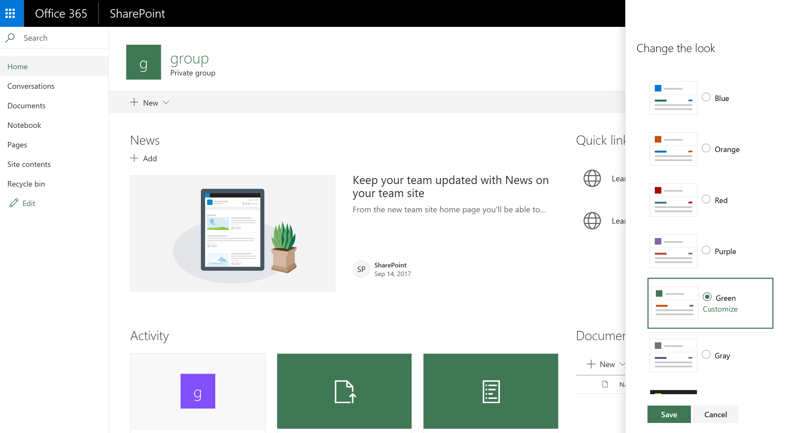

# SharePoint site theming

SharePoint site owners now have new options for applying custom styling and colors to sites, making it easier to define and manage themes across site collections. These new features include:

* You can define custom themes and make them available to site owners. Themes are defined in a [JSON schema](sharepoint-site-theming-json-schema.md) that stores color settings and related metadata for each theme.
* SharePoint themes include a simplified set of default themes, with six light themes and two dark themes presently available.
* You have complete control over which themes are available for use on pages within your sites. For example, you can define custom themes based on your organization's branding or identity, and make those the only available themes within your sites.
* All of these capabilities are available to administrators via [PowerShell commands](sharepoint-site-theming-powershell.md), or to developers via the SharePoint [Client Side Object Model (CSOM)](sharepoint-site-theming-csom.md) or the SharePoint [REST API](sharepoint-site-theming-rest-api.md).

For general information about working with themes to customize the look of your sites, see [Change the look of your SharePoint site](https://support.office.com/en-us/article/Change-the-look-of-your-SharePoint-site-06bbadc3-6b04-4a60-9d14-894f6a170818).

## Default themes

The following pre-defined themes are available by default:

* __Blue__
* __Orange__
* __Red__
* __Purple__
* __Green__
* __Gray__
* __Dark Yellow__ (inverted theme)
* __Dark Blue__ (inverted theme)

These themes have been designed for readability, so you might find them to be useful starting points for creating custom themes. See [SharePoint site theming: JSON schema](sharepoint-site-theming-json-schema.md) for more information about default themes.

## Selecting a modern theme

To select from the available themes for a SharePoint site, choose the __gear icon (⚙️)__ in the top right corner of the screen and then select __Change the look__. You'll be presented with a list of themes to choose from, which might include default themes and/or custom themes depending on how your site has been configured.

The following image shows how the default themes are presented in the theme picker dialog.

When you choose a theme in the list, those color settings are instantly applied to the page so that you can see what the selected theme will look like. The following image shows an example with the __Green__ default theme selected.

After you've found a theme that you'd like to use, click Save to save your selection, or click Cancel to revert to your current theme.

## Working with classic themes

You can still use the classic themes, by clicking on the link to _Classic change the look options_ beneath the modern themes listed under _Change the look_. There are some limitations when using classic themes with modern pages, however, because the modern SharePoint user interface differs from the classic UI.

When you select a classic theme, a modern theme will be generated from the settings in the classic theme including the isInverted flag, the background image, and the color settings for COntentAccent1, PageBackground, and BackgroundOverlay. If isInverted is set to True, neutral colors such as NeutralDark and NeutralLight will be reversed.

For the simplest experience, we recommend the use of modern themes with modern pages. If you need to use classic themes with modern pages, test your site carefully to verify that your content is readable and accessible.

## Additional resources

* [SharePoint site theming: JSON schema](sharepoint-site-theming-json-schema.md)
* [SharePoint site theming: PowerShell commands](sharepoint-site-theming-powershell.md)
* [SharePoint site theming: CSOM](sharepoint-site-theming-csom.md)
* [SharePoint site theming: REST API](sharepoint-site-theming-rest-api.md)
