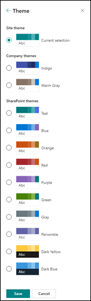

# SharePoint site theming

SharePoint site owners have new options for applying custom styles and colors to sites that make it easier to define and manage themes across site collections. 

These new features include:

* The ability to define custom themes and make them available to site owners. Themes are defined in a [JSON schema](sharepoint-site-theming-json-schema.md) that stores color settings and related metadata for each theme.
* An online [Theme Generator tool](https://developer.microsoft.com/en-us/fabric#/styles/themegenerator) that you can use to define new custom themes.
* A simplified set of default themes, with six light themes and two dark themes presently available.
* An updated color palette, with 12 light colors and 6 dark colors, as well as 16 supplementary themes.
* Control over which themes are available for use on pages within your sites. For example, you can define custom themes based on your organization's branding or identity, and make those the only available themes within your sites.

These capabilities are available to administrators via [PowerShell cmdlets](sharepoint-site-theming-powershell.md), and to developers via the [SharePoint client-side object model (CSOM)](sharepoint-site-theming-csom.md) or the [SharePoint REST API](sharepoint-site-theming-rest-api.md). For information on applying custom themes to individual site collections see [SharePoint site design and site script overview](https://docs.microsoft.com/en-us/sharepoint/dev/declarative-customization/site-design-overview)

For general information about working with themes to customize the look of your sites, see [Change the look of your SharePoint site](https://support.office.com/en-us/article/Change-the-look-of-your-SharePoint-site-06bbadc3-6b04-4a60-9d14-894f6a170818).

## Default themes

The following predefined themes are available by default:

* __Blue__
* __Orange__
* __Red__
* __Purple__
* __Green__
* __Gray__
* __Dark Yellow__ (inverted theme)
* __Dark Blue__ (inverted theme)

These themes have been designed for readability, so you might find them to be useful starting points for creating custom themes. For more information about default themes, see [SharePoint site theming: JSON schema](sharepoint-site-theming-json-schema.md).

In addition to the default themes, you can select from supplementary themes. The following customizations are available:

* __Light themes__: Gold, Teal, Dark Blue, Indigo, Plum, Warm Gray
* __Dark themes__: Red, Green, Purple, Gray

## Select a modern theme

<!-- Verify that it's okay to use the concept of "modern" themes/pages here? -->

To select from the available themes for a SharePoint site, choose the __gear icon (⚙️)__ in the top right corner of the screen, and then select __Change the look__. You'll be presented with a list of themes to choose from, which might include default themes and/or custom themes depending on how your site has been configured.

The following image shows how the default themes are presented in the theme picker dialog box.

When you choose a theme in the list, those color settings are instantly applied to the page so that you can see what the selected theme will look like.

After you've found a theme that you want to use, choose **Save** to save your selection, or choose **Cancel** to revert to your current theme.

## Work with classic themes

You can still use the classic themes by choosing the link to **Classic change the look options** under the modern themes listed under **Change the look**. Because the modern SharePoint UI differs from the classic UI, however, some limitations apply when you use classic themes with modern pages.

When you select a classic theme, a modern theme is generated from the settings in the classic theme, including the **isInverted** flag, the background image, and the color settings for **ContentAccent1**, **PageBackground**, and **BackgroundOverlay**. If **isInverted** is set to **True**, neutral colors such as **NeutralDark** and **NeutralLight** will be reversed.

For the simplest experience, we recommend that you use modern themes with modern pages. If you need to use classic themes with modern pages, test your site carefully to verify that your content is readable and accessible.

## Troubleshoot custom theme issues 

The modern site theming experience has been rolled out to classic site templates, too. While the new client-side theming architecture is more performant, if you have customizations on classic sites that aren’t rendering properly after you change the site’s theme, you can opt the site out of the new theming experience by disabling the feature. Please note, this opt-out only applies to classic sites where you have custom theme references that aren't rendering properly. By enabling this site-level opt-out you will disable the modern theming - and also lose the fast theming benefits it provides.

To do this, you must use a Windows PowerShell script with a CSOM (client-side object model) wrapper. We recommend using the PnP enable feature command:

1. Verify that you meet the following minimum requirements:  
    * You are a global administrator. 
    * You have read about [Execution Policies](https://technet.microsoft.com/library/dd347641.aspx).

2. Download the latest PnP PowerShell from https://github.com/SharePoint/PnP-PowerShell/releases.

3. Enter `Connect-PnPOnline -Url <SiteUrl> -Credentials getCredentials` (replacing `<SiteUrl>` with the url of the site you wish to opt out of).

4. Enter your credentials when prompted.

5. To opt out of the site, you need to enable a feature:

    * Enter `“Get-PnPFeature -Scope Site -Identity 5138468E-3D76-4F72-9DE4-E029F1245A7B”`
    * Verify that nothing is returned from the previous command (this confirms the feature isn’t enabled yet) 
    * Enter `“Enable-PnPFeature -Scope Site -Identity 5138468E-3D76-4F72-9DE4-E029F1245A7B”`
    * Enter `“Get-PnPFeature -Scope Site -Identity 5138468E-3D76-4F72-9DE4-E029F1245A7B”`

6. Verify that the following is returned: 

    `ClientSideThemingOptOut - 5138468e-3d76-4f72-9de4-e029f1245a7b`

7. For more information about Windows PowerShell, see [PowerShell](https://docs.microsoft.com/en-us/powershell/scripting/powershell-scripting?view=powershell-6).

## See also

* [SharePoint site theming: JSON schema](sharepoint-site-theming-json-schema.md)
* [SharePoint site theming: PowerShell cmdlets](sharepoint-site-theming-powershell.md)
* [SharePoint site theming: CSOM API](sharepoint-site-theming-csom.md)
* [SharePoint site theming: REST API](sharepoint-site-theming-rest-api.md)

