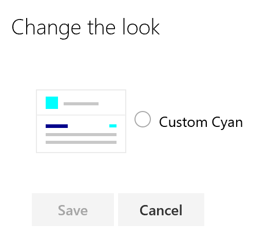

# SharePoint site theming: PowerShell commands

<!-- Global: We should refer to PowerShell "cmdlets" instead of "commands", to be consistent with the admin docs on TechNet. -->

SharePoint tenant administrators can use PowerShell commands to create, retrieve, and remove site themes. Developers can also use the SharePoint [REST API](sharepoint-site-theming-rest-api.md) to handle theme management tasks.

For information about how themes are defined and stored, see [JSON schema reference](sharepoint-site-theming-json-schema.md).

## Getting started

To run the PowerShell commands for theme management, you'll need to download and install the SharePoint Online Management Shell, and then connect to your SharePoint tenant from within the shell:

1. Download and install the [SharePoint Online Management Shell](https://www.microsoft.com/en-us/download/details.aspx?id=35588). If you already have a previous version of the shell installed, uninstall it first and then install the latest version.
2. After the shell is installed, follow the instructions at [Connect to SharePoint Online PowerShell](https://technet.microsoft.com/en-us/library/fp161372.aspx) to connect to your SharePoint tenant.

To verify your setup, try using the **Get-HideDefaultThemes** command to read the HideDefaultThemes setting. If the command runs and returns False with no errors, as shown in the following example, you're ready to proceed.

```powershell
c:\> Get-HideDefaultThemes
False
```
## Site theme commands

The following commands are available for managing site themes from PowerShell:

* **Add-SPOTheme** &mdash; Creates a new custom theme, or overwrites an existing theme to modify its settings.
* **Get-SPOTheme** &mdash; Retrieves settings for an existing theme.
* **Remove-SPOTheme** &mdash; Removes a theme from the theme gallery.
* **Set-HideDefaultThemes** &mdash; Specifies whether the default themes should be available.
* **Get-HideDefaultThemes** &mdash; Queries the current HideDefaultThemes setting.

## Add-SPOTheme

The **Add-SPOTheme** command creates a new theme or updates an existing theme. The color pallette settings are passed as a dictionary.

In the following example, a new theme named "Custom Cyan" is created, with color pallette settings that are various shades of cyan. Note that this example uses a ```HashToDictionary``` function to convert a hash table created with the ```@{}``` notation into a dictionary, as required by **Add-SPOTheme**.

```powershell
function HashToDictionary {
  Param ([Hashtable]$ht)
  $dictionary = New-Object "System.Collections.Generic.Dictionary``2[System.String,System.String]"
  foreach ($entry in $ht.GetEnumerator()) {
    $dictionary.Add($entry.Name, $entry.Value)
  }
  return $dictionary
}

$themepallette = HashToDictionary(
 @{
  "themePrimary" = "#00ffff";
  "themeLighterAlt" = "#f3fcfc";
  "themeLighter" = "#daffff";
  "themeLight" = "#affefe";
  "themeTertiary" = "#76ffff";
  "themeSecondary" = "#39ffff";
  "themeDarkAlt" = "#00c4c4";
  "themeDark" = "#009090";
  "themeDarker" = "#005252";
  "neutralLighterAlt" = "#f8f8f8";
  "neutralLighter" = "#f4f4f4";
  "neutralLight" = "#eaeaea";
  "neutralQuaternaryAlt" = "#dadada";
  "neutralQuaternary" = "#d0d0d0";
  "neutralTertiaryAlt" = "#c8c8c8";
  "neutralTertiary" = "#a6a6a6";
  "neutralSecondaryAlt" = "#767676";
  "neutralSecondary" = "#666666";
  "neutralPrimary" = "#333";
  "neutralPrimaryAlt" = "#3c3c3c";
  "neutralDark" = "#212121";
  "black" = "#000000";
  "white" = "#fff";
  "primaryBackground" = "#fff";
  "primaryText" = "#333"
 }
)

Add-SPOTheme -Name "Custom Cyan" -Palette $themepallette -IsInverted $false
```
If you want to update an existing theme (to modify some of its color settings, for example), use the same syntax as shown previously but add the *-Overwrite* flag to the **Add-SPOTheme** command.

```powershell
Add-SPOTheme -Name "Custom Cyan" -Palette $themepallette -IsInverted $false -Overwrite
```
Adding a theme does not apply the theme to any sites. It adds the theme to your tenant store, and then the theme will be available in the list of themes under the **Change the look** option for modern pages.

## Get-SPOTheme

The **Get-SPOTheme** command returns the settings for an existing theme. For example, here's how to use the **Get-SPOTheme** command to return the settings for the "Custom Cyan" theme created in the previous example.

```powershell
C:\> Get-SPOTheme -Name "Custom Cyan" | ConvertTo-Json
```
```json
{
    "Name":  "Custom Cyan",
    "Palette":  {
                    "themeLight":  "#affefe",
                    "themeTertiary":  "#76ffff",
                    "black":  "#000000",
                    "neutralSecondary":  "#666666",
                    "neutralTertiaryAlt":  "#c8c8c8",
                    "themeSecondary":  "#39ffff",
                    "themeDarker":  "#005252",
                    "primaryBackground":  "#fff",
                    "neutralQuaternary":  "#d0d0d0",
                    "neutralPrimaryAlt":  "#3c3c3c",
                    "neutralPrimary":  "#333",
                    "themeDark":  "#009090",
                    "themeLighter":  "#daffff",
                    "neutralTertiary":  "#a6a6a6",
                    "neutralQuaternaryAlt":  "#dadada",
                    "themeLighterAlt":  "#f3fcfc",
                    "white":  "#fff",
                    "neutralSecondaryAlt":  "#767676",
                    "neutralLighter":  "#f4f4f4",
                    "neutralLight":  "#eaeaea",
                    "neutralDark":  "#212121",
                    "themeDarkAlt":  "#00c4c4",
                    "neutralLighterAlt":  "#f8f8f8",
                    "primaryText":  "#333",
                    "themePrimary":  "#00ffff"
                },
    "IsInverted":  false
}
```
Note that this example uses the PowerShell _ConvertTo-Json_ filter to display the theme in JSON format.

To see all the themes currently available in the tenant store, use **Get-SPOTheme** with no arguments.

```powershell
c:\> Get-SPOTheme
Blue
Orange
Red
Purple
Green
Gray
Dark Yellow
Dark Blue
Custom Cyan
```
## Remove-SPOTheme

The **Remove-SPOTheme** command removes a theme from your tenant store. For example, this command removes the "Custom Cyan" theme that was used in the previous examples.

```powershell
c:\> Remove-SPOTheme -Name "Custom Cyan"
```
## Set-HideDefaultThemes

>[!NOTE] 
>This command will be renamed to ```Set-SPOHideDefaultThemes``` in a future release, for consistency with other SharePoint PowerShell commands.

The **Set-HideDefaultThemes** command is used to specify whether the default themes that come with SharePoint should be included in the theme picker list. For example, you might want to create custom themes for your sites and then remove the default themes, to ensure that all pages will use your custom themes.

Specify the setting as either _$true_ to hide the default themes, or _$false_ (the default setting) to allow use of the default themes. For example, this command hides the default themes.

```powershell
Set-HideDefaultThemes $true
```
After creating the "Custom Cyan" theme, hiding the default themes will leave only the one custom theme in the themes list under **Change the look**.



To restore the default themes to the theme picker list, use the following command.
```powershell
Set-HideDefaultThemes $false
```

## Get-HideDefaultThemes

>[!NOTE]
>This command will be renamed to ```Get-SPOHideDefaultThemes``` in a future release, for consistency with other SharePoint PowerShell commands.

The **Get-HideDefaultThemes** command retrieves the currrent **Set-HideDefaultThemes** setting. You might want to use this command in a PowerShell script to read the setting and then take different actions based on whether the default themes are hidden. This command does not have any parameters.

```powershell
c:\> Get-HideDefaultThemes
False
```

## See also

* [SharePoint site theming overview](sharepoint-site-theming-overview.md)
* [SharePoint site theming: JSON schema](sharepoint-site-theming-json-schema.md)
* [SharePoint site theming: CSOM](sharepoint-site-theming-csom.md)
* [SharePoint site theming: REST API](sharepoint-site-theming-rest-api.md)
* [SharePoint Online Management Shell](https://www.microsoft.com/en-us/download/details.aspx?id=35588)
* [Connect to SharePoint Online PowerShell](https://technet.microsoft.com/en-us/library/fp161372.aspx)
