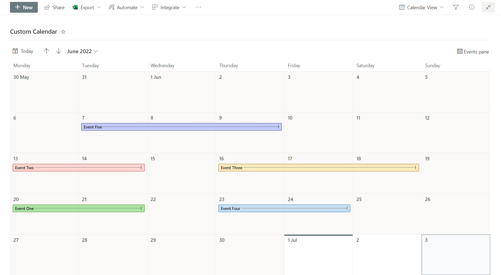
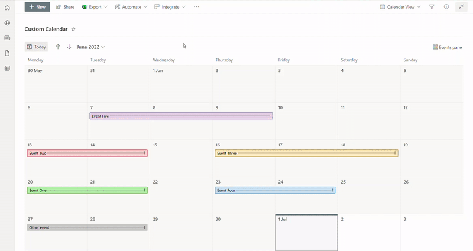

# Calendar view customizations

## Detailed syntax reference

### commandBarProps

Groups the command bar customization options. For details on `commandBarProps`, see [Command bar customization syntax reference](./view-commandbar-formatting.md)

## See also
- [Command bar customization syntax reference](./view-commandbar-formatting.md)

### List setup before creating a calendar view and applying a JSON formatting
Before creating a new calendar view, a list should include all the required columns to be used in any JSON formatting.
After creating a calendar view, if more columns are required, go to the [List Settings page](https://support.microsoft.com/en-us/office/edit-list-settings-4d35793b-246e-42a3-990c-563a83795b7f) to create and add them to a calendar view.

### Conditional view formatting based on a specific column

The following image shows an example of conditional formatting applied to a calendar view, based on a single choice column named **PROJECT**:



**Note**: before creating a new calendar view, make sure the PROJECT column is already existing to apply the JSON code illustrated below. Alternatively, go the [List Settings page](https://support.microsoft.com/en-us/office/edit-list-settings-4d35793b-246e-42a3-990c-563a83795b7f) to create and add the single choice PROJECT column to a calendar view. 

In this example, **PROJECT** column has the following options:
- Project A
- Project B
- Project C
- Project D
- Project E

The JSON code below makes use of SharePoint Online Modern UI classes to apply colors, borders and a hover effect through the [Excel-style expression syntax](./formatting-syntax-reference.md#excel-style-expressions):

```JSON
{
  "$schema": "https://developer.microsoft.com/json-schemas/sp/v2/calendar-formatting.schema.json",
  "additionalEventClass": "=if([$PROJECT] =='Project A' && @isSelected == false, 'sp-css-backgroundColor-successBackground50 sp-css-color-BlackText sp-css-borderColor-GreenText ms-bgColor-sharedGreenCyan10--hover ms-fontColor-white--hover', if([$PROJECT] =='Project A' && @isSelected == true, 'ms-bgColor-green sp-css-color-WhiteText', if([$PROJECT] =='Project B' && @isSelected == false, 'sp-css-backgroundColor-BgPeach sp-css-color-BlackText sp-css-borderColor-RedText ms-bgColor-sharedRed10--hover ms-fontColor-white--hover', if([$PROJECT] =='Project B' && @isSelected == true, 'sp-css-backgroundColor-redDark sp-css-color-WhiteText', if([$PROJECT] =='Project C' && @isSelected == false, 'sp-css-backgroundColor-BgGold sp-css-color-BlackText sp-css-borderColor-BrownText ms-bgColor-yellow--hover ms-fontColor-white--hover', if([$PROJECT] =='Project C' && @isSelected == true, 'ms-bgColor-sharedOrange10 sp-css-color-BlackText', if([$PROJECT] =='Project D' && @isSelected == false, 'ms-bgColor-communicationTint20 sp-css-color-BlackText sp-css-borderColor-BlueText ms-bgColor-sharedCyanBlue10--hover ms-fontColor-white--hover', if([$PROJECT] =='Project D' && @isSelected == true, 'sp-css-backgroundColor-BlueText sp-css-color-WhiteText', if([$PROJECT] =='Project E' && @isSelected == false, 'sp-css-backgroundColor-BgLilac sp-css-color-BlackText sp-css-borderColor-DarkPurpleText ms-bgColor-sharedBlueMagenta20--hover ms-fontColor-white--hover', if([$PROJECT] =='Project E' && @isSelected == true, 'sp-css-backgroundColor-BgPurple sp-css-color-WhiteText', if(@isSelected == false, 'sp-css-backgroundColor-neutralBackground20 sp-css-color-BlackText ms-bgColor-neutralTertiaryAlt--hover ms-fontColor-black--hover', 'sp-css-backgroundColor-neutralTertiary sp-css-color-WhiteText')))))))))))"
}
```
<br>

The gif image below shows the final result:



