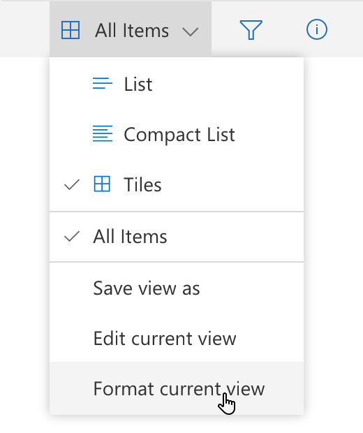
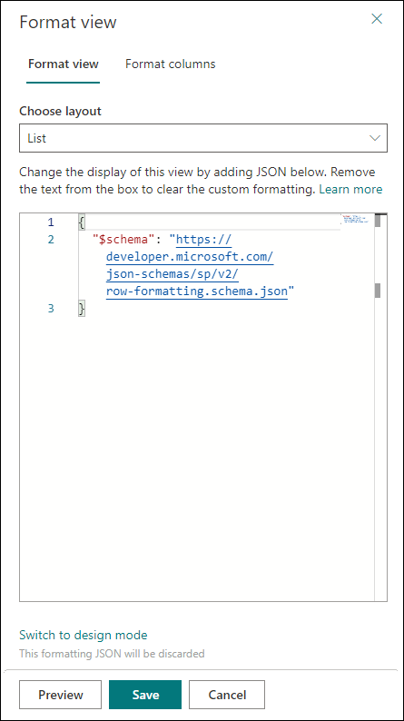
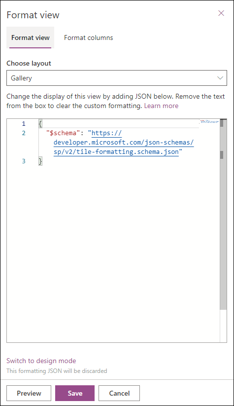

# Use view formatting to customize SharePoint

You can use view formatting to customize how items in SharePoint lists and libraries are displayed. To do this, you construct a JSON object that describes the elements that are displayed when an item is loaded in a view and any styles to be applied to those elements. View formatting does not change the data in list items; it only changes how they're displayed to users who browse the list. Anyone who can create and manage views in a list can use view formatting to configure how views are displayed.

> [!TIP]
> Samples demonstrated in this article and numerous other community samples are available from a GitHub repository dedicated for open-sourced list formatting definitions. You can find these samples in the [sp-dev-list-formatting](https://github.com/SharePoint/sp-dev-list-formatting) repository within the [SharePoint](https://github.com/SharePoint) GitHub organization.

> [!NOTE]
> View formatting is currently supported only in SharePoint Online.

## Get started with view formatting

To open the view formatting pane, open the view dropdown and choose **Format current view**.

The pane will look like the following depending on the current layout:

> [!NOTE]
> We have simplified the View formatting pane experience to separate out the List and Gallery layout formatting JSON. With this change, you do not need to add `tileProps` prop anymore.

To format rows in 'List' or 'Compact List' layout, select 'List' in 'Choose layout' dropdown in the formatting pane and use the `rowFormatter` or `additionalRowClass` properties. To format cards in 'Gallery' layout, select 'Gallery' in 'Choose layout' dropdown in the formatting pane and use the `formatter` property.

The easiest way to use view formatting is to start from an example and edit it to apply to your specific view. The following sections contain examples that you can copy, paste, and customize for your specific needs. There are also several samples available in the [SharePoint/sp-dev-list-formatting repository](https://github.com/SharePoint/sp-dev-list-formatting).

## Creating custom JSON

Creating custom view formatting JSON from scratch is simple if user understands the schema, Monaco Editor is integrated in the formatting pane with pre-filled JSON schema reference to assist in creation of view formatting, Monaco editor has validation and autocomplete to help in crafting right JSON. User can start adding JSON after the first line that defines the schema location.

> [!TIP]
> At any point, select **Ctrl**+**Space** for property/value suggestions.

> [!TIP]
> You can start from a HTML using [**formatter helper tool**](https://pnp.github.io/List-Formatting/tools/), which can convert HTML and CSS into formatter JSON with inline styles.

