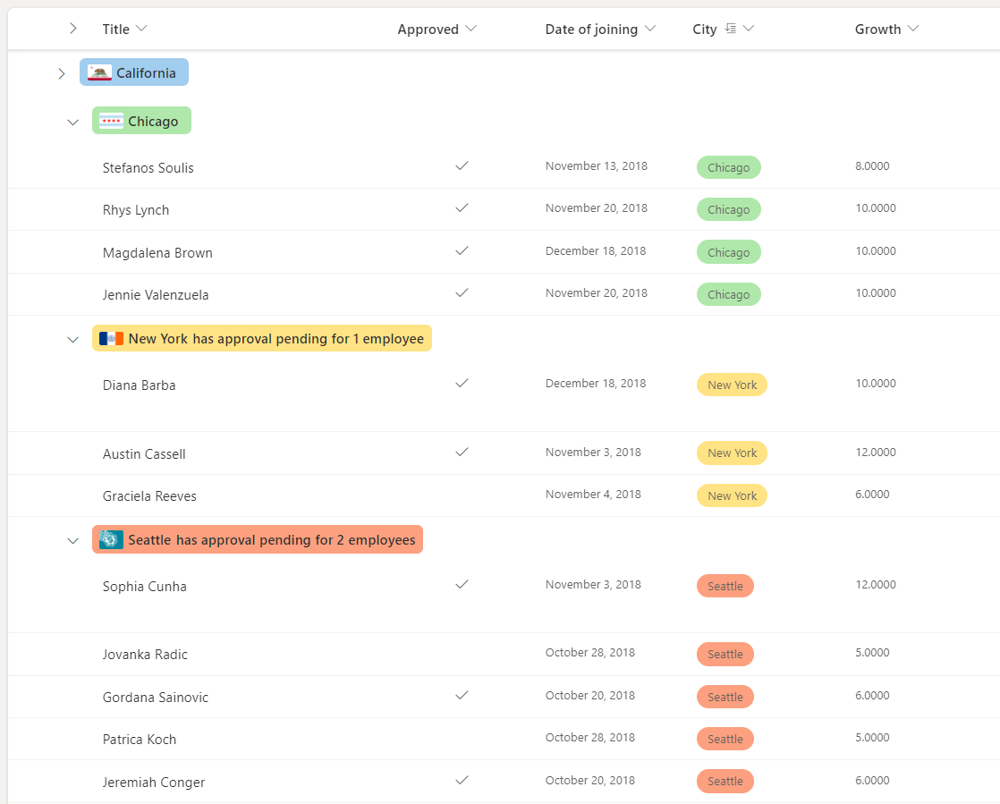
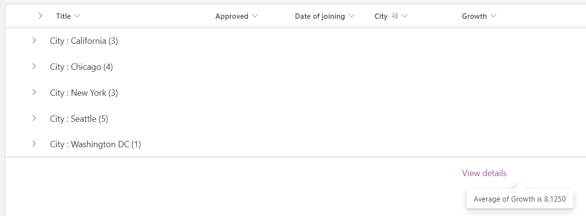

# Use view formatting to customize SharePoint

You can use view formatting to customize how items in SharePoint lists and libraries are displayed. To do this, you construct a JSON object that describes the elements that are displayed when an item is loaded in a view and any styles to be applied to those elements. View formatting does not change the data in list items; it only changes how they're displayed to users who browse the list. Anyone who can create and manage views in a list can use view formatting to configure how views are displayed.

> [!TIP]
> Samples demonstrated in this article and numerous other community samples are available from a GitHub repository dedicated for open-sourced list formatting definitions. You can find these samples in the [sp-dev-list-formatting](https://github.com/SharePoint/sp-dev-list-formatting) repository within the [SharePoint](https://github.com/SharePoint) GitHub organization.

> [!NOTE]
> View formatting is currently supported only in SharePoint Online.

## Get started with view formatting

To open the view formatting pane, open the view dropdown and choose **Format current view**. 

The pane will look like the following depending on the current layout:

 

> [!NOTE]
> We have simplified the View formatting pane experience to separate out the List and Gallery layout formatting JSON. With this change, you do not need to add `tileProps` prop anymore.

To format rows in 'List' or 'Compact List' layout, select 'List' in 'Choose layout' dropdown in the formatting pane and use the `rowFormatter` or `additionalRowClass` properties. To format cards in 'Gallery' layout, select 'Gallery' in 'Choose layout' dropdown in the formatting pane and use the `formatter` property.

The easiest way to use view formatting is to start from an example and edit it to apply to your specific view. The following sections contain examples that you can copy, paste, and customize for your specific needs. There are also several samples available in the [SharePoint/sp-dev-list-formatting repository](https://github.com/SharePoint/sp-dev-list-formatting).

## List layout customizations

### Apply conditional classes on rows

You can use **`additionalRowClass`** to apply one or more classes to the entire list row depending on the value of one or more fields in the row. These examples leave the content and structure of list rows intact.

For a list of recommended classes to use inside view formats, please see the [Style Guidelines section](https://docs.microsoft.com/sharepoint/dev/declarative-customization/column-formatting#style-guidelines) in the [Column Formatting reference document](https://docs.microsoft.com/sharepoint/dev/declarative-customization/column-formatting).

> [!TIP]
> Using the `additionalRowClass` property to apply classes to list rows will leave the formatting of individual columns in place. This allows you to combine view formats with column formatting for some powerful visualizations.

#### Example: Conditional classes based on a date field

The following image shows a list layout with a class applied based on the value of a date column:


This example applies the class `sp-field-severity--severeWarning` to a list row when the item's DueDate is before the current date/time:

```JSON
{
  "$schema": "https://developer.microsoft.com/json-schemas/sp/view-formatting.schema.json",
   "additionalRowClass": "=if([$DueDate] <= @now, 'sp-field-severity--severeWarning', '')"
}
```

#### Example: Conditional classes based on the value in a text or choice field

This example was adopted from a column formatting example, [Conditional formatting based on the value in a text or choice field](https://github.com/SharePoint/sp-dev-list-formatting/tree/master/column-samples/text-conditional-format), with some important differences to apply the concept to list rows. The column formatting example applies both an icon and a class to a column based on the value of `@currentField`. The `additionalRowClass` attribute in view formatting, however, only allows you to specify a class and not an icon. Additionally, since `@currentField` always resolves to the value of the `Title` field when referenced inside a view format, this sample refers to the `Status` field directly (by using the [$Field] syntax inside the additionalRowClass property to determine which class to apply to the row).

```JSON
{
  "$schema": "https://developer.microsoft.com/json-schemas/sp/view-formatting.schema.json",
  "additionalRowClass": "=if([$Status] == 'Done', 'sp-field-severity--good', if([$Status] == 'In progress', 'sp-field-severity--low' ,if([$Status] == 'In review','sp-field-severity--warning', if([$Status] == 'Has issues','sp-field-severity--blocked', ''))))"
}
```

You can find this sample with additional details here: [Conditional formatting based on choice field](https://github.com/SharePoint/sp-dev-list-formatting/tree/master/view-samples/text-conditional-format)

#### Example: Alternate Row Formatting based on Modulus

This example applies `% (Mod)` to a list row with alternate coloring the rows:

```JSON
{
  "$schema": "https://developer.microsoft.com/json-schemas/sp/view-formatting.schema.json",
  "additionalRowClass": "=if(@rowIndex%2==0,'ms-bgColor-themeLight','')"
}
```

### Build custom list rows

You can use **`rowFormatter`** to define a totally custom layout of field values inside a row using the same syntax used in [Column Formatting](column-formatting.md).

#### Example: Multi-line view style

The following image shows a list with a custom multi-line view style applied:


This example uses the `rowFormatter` element, which totally overrides the rendering of a list row. The `rowFormatter` in this example creates a bounding `<div />` box for every list row. Inside this bounding box, the `$Title` and `$Feedback` fields are displayed on separate lines. Under those fields, a `button` element is displayed that, when clicked, does the same thing as clicking the list row in an uncustomized view, which is opening the property form for the item. This `button` is displayed conditionally, when the value of the `$Assigned_x0020_To` field (assumed to be a person/group field) matches the current signed-in user:

```JSON
{
  "$schema": "https://developer.microsoft.com/json-schemas/sp/v2/row-formatting.schema.json",
  "hideSelection": true,
  "hideColumnHeader": true,
  "rowFormatter": {
    "elmType": "div",
    "attributes": {
      "class": "sp-row-card"
    },
    "children": [
      {
        "elmType": "div",
        "style": {
          "text-align": "left"
        },
        "children": [
          {
            "elmType": "div",
            "attributes": {
              "class": "sp-row-title"
            },
            "txtContent": "[$Title]"
          },
          {
            "elmType": "div",
            "attributes": {
              "class": "sp-row-listPadding"
            },
            "txtContent": "[$Feedback]"
          },
          {
            "elmType": "button",
            "customRowAction": {
              "action": "defaultClick"
            },
            "txtContent": "Give feedback",
            "attributes": {
              "class": "sp-row-button"
            },
            "style": {
              "display": {
                "operator": "?",
                "operands": [
                  {
                    "operator": "==",
                    "operands": [
                      "@me",
                      "[$Assigned_x0020_To.email]"
                    ]
                  },
                  "",
                  "none"
                ]
              }
            }
          }
        ]
      }
    ]
  }
}
```

You can find this sample with additional details here: [Multi-line view rendering](https://github.com/SharePoint/sp-dev-list-formatting/tree/master/view-samples/multi-line-view)

### Build custom group headers and footers

You can use `groupProps` to format group headers with flexibility to add grouped column's data, display name and item count. You can also add group aggregates in the group headers or format it directly in the group footers.

#### Example: Color coded group header

In the example below we have list with group headers formatted according to column metadata.


```JSON
{
  "$schema": "https://developer.microsoft.com/json-schemas/sp/v2/row-formatting.schema.json",
  "groupProps": {
    "headerFormatter": {
      "elmType": "div",
      "style": {
        "flex-wrap": "wrap",
        "display": "flex",
        "box-sizing": "border-box",
        "padding": "4px 8px 5px 8px",
        "border-radius": "6px",
        "align-items": "center",
        "white-space": "nowrap",
        "overflow": "hidden",
        "margin": "1px 4px 4px 1px"
      },
      "attributes": {
        "class": "=if(@group.fieldData == 'California', 'sp-css-backgroundColor-blueBackground37',
                    if(@group.fieldData == 'Chicago', 'sp-css-backgroundColor-successBackground50',
                    if(@group.fieldData == 'New York', 'sp-css-backgroundColor-warningBackground50',
                    if(@group.fieldData == 'Seattle', 'sp-css-backgroundColor-blockingBackground50',
                    if(@group.fieldData == 'Washington DC', 'sp-css-backgroundColor-errorBackground50',
                    'sp-field-borderAllRegular sp-field-borderAllSolid sp-css-borderColor-neutralSecondary'))))"
      },
      "children": [
        {
          "elmType": "img",
          "attributes": {
            "src": "=if(@group.fieldData == 'California', 'https://upload.wikimedia.org/wikipedia/commons/thumb/0/01/Flag_of_California.svg/1920px-Flag_of_California.svg.png',
                    if(@group.fieldData == 'Chicago', 'https://upload.wikimedia.org/wikipedia/commons/thumb/9/9b/Flag_of_Chicago%2C_Illinois.svg/1920px-Flag_of_Chicago%2C_Illinois.svg.png',
                    if(@group.fieldData == 'New York', 'https://upload.wikimedia.org/wikipedia/commons/thumb/b/ba/Flag_of_New_York_City.svg/2560px-Flag_of_New_York_City.svg.png',
                    if(@group.fieldData == 'Seattle', 'https://upload.wikimedia.org/wikipedia/en/thumb/6/6d/Flag_of_Seattle.svg/1920px-Flag_of_Seattle.svg.png',
                    if(@group.fieldData == 'Washington DC', 'https://upload.wikimedia.org/wikipedia/commons/thumb/d/d4/Flag_of_the_District_of_Columbia.svg/2560px-Flag_of_the_District_of_Columbia.svg.png',
                    ''))))"
          },
          "style": {
            "max-width": "24px",
            "max-height": "24px",
            "margin-top": "2px",
            "border-radius": "2px"
          }
        },
        {
          "elmType": "div",
          "children": [
            {
              "elmType": "span",
              "style": {
                "padding": "5px 5px 5px 5px",
                "font-weight": "500"
              },
              "txtContent": "@group.fieldData.displayValue"
            }
          ]
        },
        {
          "elmType": "div",
          "children": [
            {
              "elmType": "div",
              "style": {
                "display": "flex",
                "flex-direction": "row",
                "justify-content": "center"
              },
              "children": [
                {
                  "elmType": "div",
                  "txtContent": "='has ' + @group.count + if(@group.count > '1', ' employees', ' employee')",
                  "style": {
                    "padding": " ",
                    "font-weight": "500"
                  }
                }
              ]
            }
          ]
        }
      ]
    }
  }
}
```

#### Example: Color coded group header with aggregates

In the example below we have list with group headers formatted with group aggregates.


In this example the `hideFooter` for `groupProps` is set to `true` to hide the group footer and the `@aggregates` array is used to display a summary in the group header.

```JSON
{
  "$schema": "https://developer.microsoft.com/json-schemas/sp/v2/row-formatting.schema.json",
  "groupProps": {
    "hideFooter": true,
    "headerFormatter": {
      "elmType": "div",
      "style": {
        "flex-wrap": "wrap",
        "display": "flex",
        "box-sizing": "border-box",
        "padding": "4px 8px 5px 8px",
        "border-radius": "6px",
        "align-items": "center",
        "white-space": "nowrap",
        "overflow": "hidden",
        "margin": "1px 4px 4px 1px"
      },
      "attributes": {
        "class": "=if(@group.fieldData == 'California', 'sp-css-backgroundColor-blueBackground37',
                    if(@group.fieldData == 'Chicago', 'sp-css-backgroundColor-successBackground50',
                    if(@group.fieldData == 'New York', 'sp-css-backgroundColor-warningBackground50',
                    if(@group.fieldData == 'Seattle', 'sp-css-backgroundColor-blockingBackground50',
                    if(@group.fieldData == 'Washington DC', 'sp-css-backgroundColor-errorBackground50',
                    'sp-field-borderAllRegular sp-field-borderAllSolid sp-css-borderColor-neutralSecondary'))))"
      },
      "children": [
        {
          "elmType": "img",
          "attributes": {
            "src": "=if(@group.fieldData == 'California', 'https://upload.wikimedia.org/wikipedia/commons/thumb/0/01/Flag_of_California.svg/1920px-Flag_of_California.svg.png',
                    if(@group.fieldData == 'Chicago', 'https://upload.wikimedia.org/wikipedia/commons/thumb/9/9b/Flag_of_Chicago%2C_Illinois.svg/1920px-Flag_of_Chicago%2C_Illinois.svg.png',
                    if(@group.fieldData == 'New York', 'https://upload.wikimedia.org/wikipedia/commons/thumb/b/ba/Flag_of_New_York_City.svg/2560px-Flag_of_New_York_City.svg.png',
                    if(@group.fieldData == 'Seattle', 'https://upload.wikimedia.org/wikipedia/en/thumb/6/6d/Flag_of_Seattle.svg/1920px-Flag_of_Seattle.svg.png',
                    if(@group.fieldData == 'Washington DC', 'https://upload.wikimedia.org/wikipedia/commons/thumb/d/d4/Flag_of_the_District_of_Columbia.svg/2560px-Flag_of_the_District_of_Columbia.svg.png',
                    ''))))"
          },
          "style": {
            "max-width": "24px",
            "max-height": "24px",
            "margin-top": "2px",
            "border-radius": "2px"
          }
        },
        {
          "elmType": "div",
          "children": [
            {
              "elmType": "span",
              "style": {
                "padding": "5px 5px 5px 5px",
                "font-weight": "500"
              },
              "txtContent": "@group.fieldData.displayValue"
            }
          ]
        },
        {
          "elmType": "div",
          "forEach": "aggregate in @aggregates",
          "children": [
            {
              "elmType": "div",
              "style": {
                "display": "=if([$aggregate.columnDisplayName] == 'Approved' && Number([$aggregate.value]) < @group.count, 'flex', 'none')",
                "flex-direction": "row",
                "justify-content": "center"
              },
              "children": [
                {
                  "elmType": "div",
                  "txtContent": "='has approval pending for ' + Number(@group.count - Number([$aggregate.value])) + if(@group.count - Number([$aggregate.value]) > 1 , ' employees', ' employee')",
                  "style": {
                    "padding": " ",
                    "font-weight": "500"
                  }
                }
              ]
            }
          ]
        }
      ]
    }
  }
}

```

#### Example: Custom group footer

In the example below we have list with group footer formatted according to aggregate value.


In this example the `footerFormatter` for `groupProps` is set to format the group footer and the `@columnAggregate` is used to access column aggregate.

```JSON
{
  "$schema": "https://developer.microsoft.com/json-schemas/sp/v2/row-formatting.schema.json",
  "groupProps": {
    "hideFooter": false,
    "footerFormatter": {
      "elmType": "div",
      "children": [
        {
          "elmType": "div",
          "attributes": {
            "iconName": "=if(@columnAggregate.type == 'Average' && @columnAggregate.value < 10, 'SortDown', 'SortUp')"
          },
          "style": {
            "color": "=if(@columnAggregate.type == 'Average' && @columnAggregate.value < 10, '#d13438', '#107c10')",
            "font-weight": "600",
            "margin-top": "10px"
          }
        },
        {
          "elmType": "div",
          "style": {
            "color": "=if(@columnAggregate.type == 'Average' && @columnAggregate.value < 10, '#d13438', '#107c10')",
            "font-weight": "600",
            "margin-top": "10px",
            "font-family": "Segoe UI"
          },
          "txtContent": "=@columnAggregate.type + ': ' + @columnAggregate.value"
        }
      ]
    }
  }
}
```

### Build custom list footers

You can use `footerFormatter` to format list footer with access to column aggregates.

#### Example: Custom list footer

In the example below we have list with footer formatted according to aggregate value.


In this example the `footerFormatter` is set to format the list footer and the `@columnAggregate` is used to access column aggregate.

```JSON
{
  "$schema": "https://developer.microsoft.com/json-schemas/sp/v2/row-formatting.schema.json",
  "hideFooter": false,
  "footerFormatter": {
    "elmType": "div",
    "attributes": {
      "class": "ms-fontColor-themePrimary"
    },
    "customCardProps": {
      "formatter": {
        "elmType": "div",
        "children": [
          {
            "elmType": "div",
            "style": {
              "display": "flex"
            },
            "txtContent": "=@columnAggregate.type + ' of ' + @columnAggregate.columnDisplayName + ' is ' + @columnAggregate.value"
          }
        ],
        "style": {
          "height": "10px",
          "width": "auto",
          "cursor": "pointer",
          "font-size": "14px",
          "padding": "14px"
        }
      },
      "openOnEvent": "hover",
      "directionalHint": "bottomCenter",
      "isBeakVisible": true,
      "beakStyle": {
        "backgroundColor": "white"
      }
    },
    "txtContent": "View details",
    "style": {
      "text-decoration": "none",
      "cursor": "pointer",
      "font-size": "16px",
      "margin-top": "10px"
    }
  }
}
```

## Gallery layout customizations

### Build custom cards

You can use Gallery **`formatter`** to define a totally custom layout of field values inside a card using the same syntax used in [Column Formatting](column-formatting.md).

#### Example: Multi line custom card

The following image shows a customized card in Gallery layout:


```JSON
{
  "$schema": "https://developer.microsoft.com/json-schemas/sp/v2/tile-formatting.schema.json",
  "height": "250",
  "width": "350",
  "hideSelection": true,
  "formatter": {
    "elmType": "div",
    "style": {
      "display": "flex",
      "align-items": "stretch",
      "margin-bottom": "16px",
      "min-width": "150px",
      "flex-grow": "1",
      "justify-content": "space-around",
      "padding": "5px"
    },
    "children": [
      {
        "elmType": "div",
        "style": {
          "width": "95%",
          "height": "92%",
          "box-shadow": "0px 1.6px 3.6px 0 #00000024, 0px 0.3px 0.9px 0 #00000024",
          "overflow": "hidden",
          "border-radius": "2px",
          "padding-left": "16px",
          "padding-top": "16px"
        },
        "attributes": {
          "class": "ms-bgColor-neutralLighterAlt"
        },
        "children": [
          {
            "elmType": "div",
            "style": {
              "text-align": "left"
            },
            "children": [
              {
                "elmType": "div",
                "style": {
                  "color":"#333333",
                  "font-size": "16px",
                  "font-weight":"600",
                  "margin-bottom":"5px"
              },
                "txtContent": "[$Title]"
              },
              {
                "elmType": "div",
                "style": {
                  "color":"#333333",
                  "font-size": "14px",
                  "line-height":"1.8"
              },
                "attributes": {
                  "class": "sp-row-listPadding"
                },
                "txtContent": "[$Feedback]"
              },
              {
                "elmType": "button",
                "customRowAction": {
                  "action": "defaultClick"
                },
                "txtContent": "Give feedback",
                "attributes": {
                  "class": "sp-row-button"
                },
                "style": {
                  "display": {
                    "operator": "?",
                    "operands": [
                      {
                        "operator": "==",
                        "operands": [
                          "@me",
                          "[$Assigned_x0020_To.email]"
                        ]
                      },
                      "",
                      "none"
                    ]
                  }
                }
              }
            ]
          }
        ]
      }
    ]
  }

}
```

### Build custom group headers

You can use `groupProps` to format group headers with flexibility to add grouped column's data, display name and item count. You can also add group aggregates in the group headers.

#### Example: Color coded group header

In the example below we have gallery with group headers formatted according to column metadata.


Note that gallery card formatter is skipped in the below JSON for simplicity.

```JSON
{
  "$schema": "https://developer.microsoft.com/json-schemas/sp/v2/tile-formatting.schema.json",
  "height": 277,
  "width": 254,
  "hideSelection": false,
  "groupProps": {
    "headerFormatter": {
      "elmType": "div",
      "children": [
        {
          "elmType": "div",
          "style": {
            "flex-wrap": "wrap",
            "display": "flex",
            "box-sizing": "border-box",
            "padding": "4px 8px 5px 8px",
            "border-radius": "6px",
            "align-items": "center",
            "white-space": "nowrap",
            "overflow": "hidden",
            "margin": "1px 4px 4px 1px"
          },
          "attributes": {
            "class": "=if(@group.fieldData == 'California', 'sp-css-backgroundColor-blueBackground37',
                        if(@group.fieldData == 'Chicago', 'sp-css-backgroundColor-successBackground50',
                        if(@group.fieldData == 'New York', 'sp-css-backgroundColor-warningBackground50',
                        if(@group.fieldData == 'Seattle', 'sp-css-backgroundColor-blockingBackground50',
                        if(@group.fieldData == 'Washington DC', 'sp-css-backgroundColor-errorBackground50',
                        'sp-field-borderAllRegular sp-field-borderAllSolid sp-css-borderColor-neutralSecondary'))))"
          },
          "children": [
            {
              "elmType": "img",
              "attributes": {
                "src": "=if(@group.fieldData == 'California', 'https://upload.wikimedia.org/wikipedia/commons/thumb/0/01/Flag_of_California.svg/1920px-Flag_of_California.svg.png',
                    if(@group.fieldData == 'Chicago', 'https://upload.wikimedia.org/wikipedia/commons/thumb/9/9b/Flag_of_Chicago%2C_Illinois.svg/1920px-Flag_of_Chicago%2C_Illinois.svg.png',
                    if(@group.fieldData == 'New York', 'https://upload.wikimedia.org/wikipedia/commons/thumb/b/ba/Flag_of_New_York_City.svg/2560px-Flag_of_New_York_City.svg.png',
                    if(@group.fieldData == 'Seattle', 'https://upload.wikimedia.org/wikipedia/en/thumb/6/6d/Flag_of_Seattle.svg/1920px-Flag_of_Seattle.svg.png',
                    if(@group.fieldData == 'Washington DC', 'https://upload.wikimedia.org/wikipedia/commons/thumb/d/d4/Flag_of_the_District_of_Columbia.svg/2560px-Flag_of_the_District_of_Columbia.svg.png',
                    ''))))"
              },
              "style": {
                "max-width": "24px",
                "max-height": "24px",
                "margin-top": "2px",
                "border-radius": "2px"
              }
            },
            {
              "elmType": "div",
              "children": [
                {
                  "elmType": "span",
                  "style": {
                    "padding": "5px 5px 5px 5px",
                    "font-weight": "500"
                  },
                  "txtContent": {
                    "operator": "+",
                    "operands": [
                      "",
                      "@group.fieldData.displayValue"
                    ]
                  }
                }
              ]
            },
            {
              "elmType": "div",
              "children": [
                {
                  "elmType": "div",
                  "style": {
                    "display": "flex",
                    "flex-direction": "row",
                    "justify-content": "center"
                  },
                  "children": [
                    {
                      "elmType": "div",
                      "txtContent": "='has ' + @group.count + if(@group.count > '1', ' employees', ' employee')",
                      "style": {
                        "padding": " ",
                        "font-weight": "500"
                      }
                    }
                  ]
                }
              ]
            }
          ]
        }
      ]
    }
  }
}
```

#### Example: Color coded group header with aggregates

In the example below we have list with group headers formatted with group aggregates.


In this example the `@aggregates` array is used to display a summary in the group header using `headerFormatter` in `groupProps`. Note that gallery card formatter is skipped in the below JSON for simplicity.

```JSON
{
  "$schema": "https://developer.microsoft.com/json-schemas/sp/v2/tile-formatting.schema.json",
  "height": 277,
  "width": 254,
  "hideSelection": false,
  "fillHorizontally": true,
  "groupProps": {
    "headerFormatter": {
      "debugMode": true,
      "elmType": "div",
      "children": [
        {
          "elmType": "div",
          "style": {
            "flex-wrap": "wrap",
            "display": "flex",
            "box-sizing": "border-box",
            "padding": "4px 8px 5px 8px",
            "border-radius": "6px",
            "align-items": "center",
            "white-space": "nowrap",
            "overflow": "hidden",
            "margin": "1px 4px 4px 1px"
          },
          "attributes": {
            "class": "=if(@group.fieldData == 'California', 'sp-css-backgroundColor-blueBackground37',
                      if(@group.fieldData == 'Chicago', 'sp-css-backgroundColor-successBackground50',
                      if(@group.fieldData == 'New York', 'sp-css-backgroundColor-warningBackground50',
                      if(@group.fieldData == 'Seattle', 'sp-css-backgroundColor-blockingBackground50',
                      if(@group.fieldData == 'Washington DC', 'sp-css-backgroundColor-errorBackground50',
                      'sp-field-borderAllRegular sp-field-borderAllSolid sp-css-borderColor-neutralSecondary'))))"
          },
          "children": [
            {
              "elmType": "img",
              "attributes": {
                "src": "=if(@group.fieldData == 'California', 'https://upload.wikimedia.org/wikipedia/commons/thumb/0/01/Flag_of_California.svg/1920px-Flag_of_California.svg.png',
                        if(@group.fieldData == 'Chicago', 'https://upload.wikimedia.org/wikipedia/commons/thumb/9/9b/Flag_of_Chicago%2C_Illinois.svg/1920px-Flag_of_Chicago%2C_Illinois.svg.png',
                        if(@group.fieldData == 'New York', 'https://upload.wikimedia.org/wikipedia/commons/thumb/b/ba/Flag_of_New_York_City.svg/2560px-Flag_of_New_York_City.svg.png',
                        if(@group.fieldData == 'Seattle', 'https://upload.wikimedia.org/wikipedia/en/thumb/6/6d/Flag_of_Seattle.svg/1920px-Flag_of_Seattle.svg.png',
                        if(@group.fieldData == 'Washington DC', 'https://upload.wikimedia.org/wikipedia/commons/thumb/d/d4/Flag_of_the_District_of_Columbia.svg/2560px-Flag_of_the_District_of_Columbia.svg.png',
                        ''))))"
              },
              "style": {
                "max-width": "24px",
                "max-height": "24px",
                "margin-top": "2px",
                "border-radius": "2px"
              }
            },
            {
              "elmType": "div",
              "children": [
                {
                  "elmType": "span",
                  "style": {
                    "padding": "5px 5px 5px 5px",
                    "font-weight": "500"
                  },
                  "txtContent": "@group.fieldData.displayValue"
                }
              ]
            },
            {
              "elmType": "div",
              "forEach": "aggregate in @aggregates",
              "children": [
                {
                  "elmType": "div",
                  "style": {
                    "display": "=if([$aggregate.columnDisplayName] == 'Approved' && Number([$aggregate.value]) < @group.count, 'flex', 'none')",
                    "flex-direction": "row",
                    "justify-content": "center"
                  },
                  "children": [
                    {
                      "elmType": "div",
                      "txtContent": "='has approval pending for ' + Number(@group.count - Number([$aggregate.value])) + if(@group.count - Number([$aggregate.value]) > 1 , ' employees', ' employee')",
                      "style": {
                        "padding": " ",
                        "font-weight": "500"
                      }
                    }
                  ]
                }
              ]
            }
          ]
        }
      ]
    }
  }
}
```

## Creating custom JSON

Creating custom view formatting JSON from scratch is simple if user understands the schema, Monaco Editor is integrated in the formatting pane with pre-filled JSON schema reference to assist in creation of view formatting, Monaco editor has validation and autocomplete to help in crafting right JSON. User can start adding JSON after the first line that defines the schema location.

> [!TIP]
> At any point, select **Ctrl**+**Space** for property/value suggestions.

> [!TIP]
> You can start from a HTML using [**formatter helper tool**](https://pnp.github.io/sp-dev-list-formatting/tools/), which can convert HTML and CSS into formatter JSON with inline styles.

## Detailed syntax reference

### rowFormatter

Optional element. Specifies a JSON object that describes a list row format. The schema of this JSON object is identical to the schema of a column format. For details on this schema and its capabilities, see the [Column Format detailed syntax reference](https://docs.microsoft.com/sharepoint/dev/declarative-customization/column-formatting#detailed-syntax-reference). Only valid for 'List' and 'Compact List' layouts.

> [!NOTE]
> Using the `rowFormatter` property will override anything specified in the `additionalRowClass` property. They are mutually exclusive.

#### Differences in behavior between the rowFormatter element and column formatting

Despite sharing the same schema, there are some differences in behavior between elements inside a `rowFormatter` element and those same elements in a column formatting object.

- `@currentField` always resolves to the value of the `Title` field inside a `rowFormatter`.

### additionalRowClass

Optional element. Specifies a CSS class(es) that is applied to the entire row. Supports expressions. Only valid for 'List' and 'Compact List' layouts.

`additionalRowClass` only takes effect when there is no `rowFormatter` element specified. If a `rowFormatter` is specified, then `additionalRowClass` is ignored.

### hideSelection

Optional element. Specifies whether the ability to select rows in the view is disabled or not. _false_ is the default behavior inside a list view (meaning selection is visible and enabled). _true_ means that users will not be able to select list items. Valid in 'List', 'Compact List' and 'Gallery' layouts.

For list & compact list layout, `hideSelection` only takes effect when there's a `rowFormatter` element specified. If no `rowFormatter` is specified, then `hideSelection` is ignored.

### hideColumnHeader

Optional element. Specifies whether the column headers in the view are hidden or not. _false_ is the default behavior inside a list view (meaning column headers will be visible). _true_ means that the view will not display column headers. Only valid for 'List' and 'Compact List' layouts.

### height

Optional element. Defines the height of the card in pixels for 'Gallery' layout. Only valid for 'Gallery' layout.

### width

Optional element. Defines the width of the card in pixels for 'Gallery' layout. Can go from height/2 to 3 x height. Only valid for 'Gallery' layout.

### formatter

JSON object that defines the layout of cards for 'Gallery' layout. The schema of this JSON object is identical to the schema of a column format (and that of rowFormatter). For details on this schema and its capabilities, see the [Column Format detailed syntax reference](https://docs.microsoft.com/sharepoint/dev/declarative-customization/column-formatting#detailed-syntax-reference). Only valid for 'Gallery' layout.

### groupProps

Groups the group related customization options. Valid in 'List', 'Compact List' and 'Gallery' layouts.

### headerFormatter

JSON object that defines the format for group header. The schema of this JSON object is identical to the schema of a column format. For details on this schema and its capabilities, see the [Column Format detailed syntax reference](https://docs.microsoft.com/sharepoint/dev/declarative-customization/column-formatting#detailed-syntax-reference). Valid in 'List', 'Compact List' and 'Gallery' layouts.

### footerFormatter

JSON object that defines the format for group and list footer. The schema of this JSON object is identical to the schema of a column format (and that of rowFormatter). For details on this schema and its capabilities, see the [Column Format detailed syntax reference](https://docs.microsoft.com/sharepoint/dev/declarative-customization/column-formatting#detailed-syntax-reference). Valid in 'List' and 'Compact List' layouts.

### hideFooter

Optional element. Specifies whether the list footers or the group footers in the view are hidden or not. _false_ is the default behavior (meaning footer is visible). _true_ means that view will not display footers. Valid in 'List' and 'Compact List' layouts.

For list & compact list layout, `hideFooter` overrides the `footerFormatter`, if present.

### Special string values

The values for `txtContent`, styles, and attributes can be either strings or Expression objects. A few special string patterns for retrieving values from group and aggregate are supported.

#### "@group"

Provides access to the grouped column's data, display name and item count. Valid in 'List', 'Compact List' and 'Gallery' layouts. Available only inside `groupProps`.

The `@group` object has the following properties (with example values):

```JSON
{
    "fieldData": "California",
    "columnDisplayName": "City",
    "count": 3
}
```

You can also access sub properties for fields with rich data, e.g. People field, as mentioned under [Column Format special string values](https://docs.microsoft.com/sharepoint/dev/declarative-customization/column-formatting#special-string-values).

```JSON
{
  "fieldData": {
    "id": "122",
    "title": "Kalya Tucker",
    "email": "kaylat@contoso.com",
    "sip": "kaylat@contoso.com",
    "picture": "https://contoso.sharepoint.com/kaylat_contoso_com_MThumb.jpg?t=63576928822",
    "department": "Human Resources",
    "jobTitle": "HR Manager"
  },
  "columnDisplayName": "Author",
  "count": 5
}

```

#### "@columnAggregate"

Provides access to the aggregated column's value, display name and aggregate type. Valid in 'List' and 'Compact List' layouts. Available only inside `footerFormatter`.

The `@columnAggregate` object has the following properties (with example values):

```JSON
{
  "value": "3",
  "columnDisplayName": "Approved",
  "type": "Count"
}
```

#### "@aggregates"

Provides access to array of aggregated column's value, display name and aggregate type. Valid in 'List', 'Compact List' and 'Gallery' layouts. Available only inside `groupProps`.

The `@aggregates` object has the following properties (with example value), and can be iterated on using [Column Format foreach](https://docs.microsoft.com/sharepoint/dev/declarative-customization/column-formatting#foreach) property.

```JSON
[
  {
    "value": "3",
    "columnDisplayName": "Approved",
    "type": "Count"
  },
  {
    "value": "1.2",
    "columnDisplayName": "Growth",
    "type": "Average"
  },
  {
    "value": "0.33%",
    "columnDisplayName": "Rate of change",
    "type": "Variance"
  }
]
```
