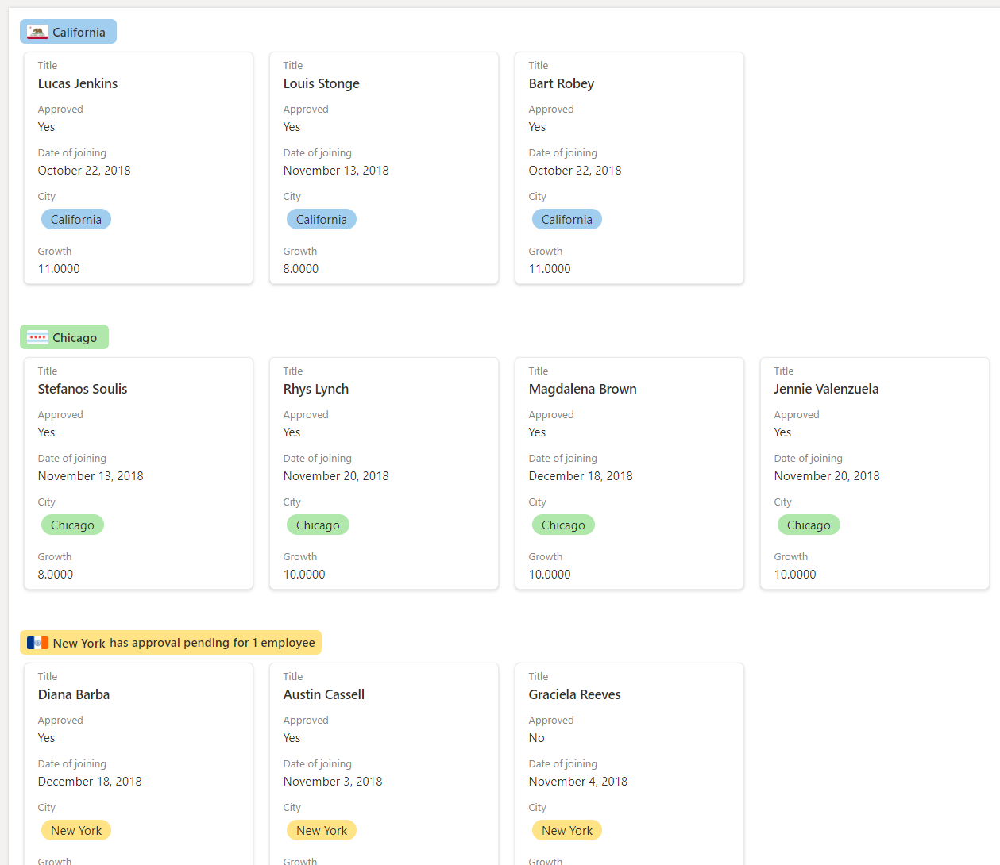

# Gallery layout customizations

## Build custom cards

You can use Gallery **`formatter`** to define a totally custom layout of field values inside a card using the same syntax used in [Column Formatting](column-formatting.md).

### Example: Multi line custom card

The following image shows a customized card in Gallery layout:


```JSON
{
  "$schema": "https://developer.microsoft.com/json-schemas/sp/v2/tile-formatting.schema.json",
  "height": "250",
  "width": "350",
  "hideSelection": true,
  "formatter": {
    "elmType": "div",
    "style": {
      "display": "flex",
      "align-items": "stretch",
      "margin-bottom": "16px",
      "min-width": "150px",
      "flex-grow": "1",
      "justify-content": "space-around",
      "padding": "5px"
    },
    "children": [
      {
        "elmType": "div",
        "style": {
          "width": "95%",
          "height": "92%",
          "box-shadow": "0px 1.6px 3.6px 0 #00000024, 0px 0.3px 0.9px 0 #00000024",
          "overflow": "hidden",
          "border-radius": "2px",
          "padding-left": "16px",
          "padding-top": "16px"
        },
        "attributes": {
          "class": "ms-bgColor-neutralLighterAlt"
        },
        "children": [
          {
            "elmType": "div",
            "style": {
              "text-align": "left"
            },
            "children": [
              {
                "elmType": "div",
                "style": {
                  "color":"#333333",
                  "font-size": "16px",
                  "font-weight":"600",
                  "margin-bottom":"5px"
              },
                "txtContent": "[$Title]"
              },
              {
                "elmType": "div",
                "style": {
                  "color":"#333333",
                  "font-size": "14px",
                  "line-height":"1.8"
              },
                "attributes": {
                  "class": "sp-row-listPadding"
                },
                "txtContent": "[$Feedback]"
              },
              {
                "elmType": "button",
                "customRowAction": {
                  "action": "defaultClick"
                },
                "txtContent": "Give feedback",
                "attributes": {
                  "class": "sp-row-button"
                },
                "style": {
                  "display": {
                    "operator": "?",
                    "operands": [
                      {
                        "operator": "==",
                        "operands": [
                          "@me",
                          "[$Assigned_x0020_To.email]"
                        ]
                      },
                      "",
                      "none"
                    ]
                  }
                }
              }
            ]
          }
        ]
      }
    ]
  }

}
```

## Build custom group headers

You can use `groupProps` to format group headers with flexibility to add grouped column's data, display name and item count. You can also add group aggregates in the group headers.

### Example: Color coded group header

In the example below we have gallery view with formatted group headers as per column metadata.


> [!NOTE]
> Gallery card formatter is skipped in the below JSON for simplicity.
> The example below also contains line breaks. These have been added to improve the readability of the code.

```JSON
{
  "$schema": "https://developer.microsoft.com/json-schemas/sp/v2/tile-formatting.schema.json",
  "height": 277,
  "width": 254,
  "hideSelection": false,
  "groupProps": {
    "headerFormatter": {
      "elmType": "div",
      "children": [
        {
          "elmType": "div",
          "style": {
            "flex-wrap": "wrap",
            "display": "flex",
            "box-sizing": "border-box",
            "padding": "4px 8px 5px 8px",
            "border-radius": "6px",
            "align-items": "center",
            "white-space": "nowrap",
            "overflow": "hidden",
            "margin": "1px 4px 4px 1px"
          },
          "attributes": {
            "class": "=if(@group.fieldData == 'California', 'sp-css-backgroundColor-blueBackground37',
                       if(@group.fieldData == 'Chicago', 'sp-css-backgroundColor-successBackground50',
                       if(@group.fieldData == 'New York', 'sp-css-backgroundColor-warningBackground50',
                       if(@group.fieldData == 'Seattle', 'sp-css-backgroundColor-blockingBackground50',
                       if(@group.fieldData == 'Washington DC', 'sp-css-backgroundColor-errorBackground50',
                       'sp-field-borderAllRegular sp-field-borderAllSolid sp-css-borderColor-neutralSecondary'))))"
          },
          "children": [
            {
              "elmType": "img",
              "attributes": {
                "src": "=if(@group.fieldData == 'California', 'https://upload.wikimedia.org/wikipedia/commons/thumb/0/01/Flag_of_California.svg/1920px-Flag_of_California.svg.png',
                         if(@group.fieldData == 'Chicago', 'https://upload.wikimedia.org/wikipedia/commons/thumb/9/9b/Flag_of_Chicago%2C_Illinois.svg/1920px-Flag_of_Chicago%2C_Illinois.svg.png',
                         if(@group.fieldData == 'New York', 'https://upload.wikimedia.org/wikipedia/commons/thumb/b/ba/Flag_of_New_York_City.svg/2560px-Flag_of_New_York_City.svg.png',
                         if(@group.fieldData == 'Seattle', 'https://upload.wikimedia.org/wikipedia/en/thumb/6/6d/Flag_of_Seattle.svg/1920px-Flag_of_Seattle.svg.png',
                         if(@group.fieldData == 'Washington DC', 'https://upload.wikimedia.org/wikipedia/commons/thumb/d/d4/Flag_of_the_District_of_Columbia.svg/2560px-Flag_of_the_District_of_Columbia.svg.png', '')))))"
              },
              "style": {
                "max-width": "24px",
                "max-height": "24px",
                "margin-top": "2px",
                "border-radius": "2px"
              }
            },
            {
              "elmType": "div",
              "children": [
                {
                  "elmType": "span",
                  "style": {
                    "padding": "5px 5px 5px 5px",
                    "font-weight": "500"
                  },
                  "txtContent": {
                    "operator": "+",
                    "operands": [
                      "",
                      "@group.fieldData.displayValue"
                    ]
                  }
                }
              ]
            },
            {
              "elmType": "div",
              "children": [
                {
                  "elmType": "div",
                  "style": {
                    "display": "flex",
                    "flex-direction": "row",
                    "justify-content": "center"
                  },
                  "children": [
                    {
                      "elmType": "div",
                      "txtContent": "='has ' + @group.count + if(@group.count > '1', ' employees', ' employee')",
                      "style": {
                        "font-weight": "500"
                      }
                    }
                  ]
                }
              ]
            }
          ]
        }
      ]
    }
  }
}
```

### Example: Color coded group header with aggregate

In the example below we have list with formatted group headers and group aggregates.



In this example the `@aggregates` array is used to display a summary in the group header using `headerFormatter` in `groupProps`.

> [!NOTE]
> Gallery card formatter is skipped in the below JSON for simplicity.
> The example below also contains line breaks. These have been added to improve the readability of the code.

```JSON
{
  "$schema": "https://developer.microsoft.com/json-schemas/sp/v2/tile-formatting.schema.json",
  "height": 277,
  "width": 254,
  "hideSelection": false,
  "fillHorizontally": true,
  "groupProps": {
    "headerFormatter": {
      "debugMode": true,
      "elmType": "div",
      "children": [
        {
          "elmType": "div",
          "style": {
            "flex-wrap": "wrap",
            "display": "flex",
            "box-sizing": "border-box",
            "padding": "4px 8px 5px 8px",
            "border-radius": "6px",
            "align-items": "center",
            "white-space": "nowrap",
            "overflow": "hidden",
            "margin": "1px 4px 4px 1px"
          },
          "attributes": {
            "class": "=if(@group.fieldData == 'California', 'sp-css-backgroundColor-blueBackground37',
                       if(@group.fieldData == 'Chicago', 'sp-css-backgroundColor-successBackground50',
                       if(@group.fieldData == 'New York', 'sp-css-backgroundColor-warningBackground50',
                       if(@group.fieldData == 'Seattle', 'sp-css-backgroundColor-blockingBackground50',
                       if(@group.fieldData == 'Washington DC', 'sp-css-backgroundColor-errorBackground50', 'sp-field-borderAllRegular sp-field-borderAllSolid sp-css-borderColor-neutralSecondary')))))"
          },
          "children": [
            {
              "elmType": "img",
              "attributes": {
                "src": "=if(@group.fieldData == 'California', 'https://upload.wikimedia.org/wikipedia/commons/thumb/0/01/Flag_of_California.svg/1920px-Flag_of_California.svg.png',
                         if(@group.fieldData == 'Chicago', 'https://upload.wikimedia.org/wikipedia/commons/thumb/9/9b/Flag_of_Chicago%2C_Illinois.svg/1920px-Flag_of_Chicago%2C_Illinois.svg.png',
                         if(@group.fieldData == 'New York', 'https://upload.wikimedia.org/wikipedia/commons/thumb/b/ba/Flag_of_New_York_City.svg/2560px-Flag_of_New_York_City.svg.png',
                         if(@group.fieldData == 'Seattle', 'https://upload.wikimedia.org/wikipedia/en/thumb/6/6d/Flag_of_Seattle.svg/1920px-Flag_of_Seattle.svg.png',
                         if(@group.fieldData == 'Washington DC', 'https://upload.wikimedia.org/wikipedia/commons/thumb/d/d4/Flag_of_the_District_of_Columbia.svg/2560px-Flag_of_the_District_of_Columbia.svg.png', '')))))"
              },
              "style": {
                "max-width": "24px",
                "max-height": "24px",
                "margin-top": "2px",
                "border-radius": "2px"
              }
            },
            {
              "elmType": "div",
              "children": [
                {
                  "elmType": "span",
                  "style": {
                    "padding": "5px 5px 5px 5px",
                    "font-weight": "500"
                  },
                  "txtContent": "@group.fieldData.displayValue"
                }
              ]
            },
            {
              "elmType": "div",
              "forEach": "aggregate in @aggregates",
              "children": [
                {
                  "elmType": "div",
                  "style": {
                    "display": "=if([$aggregate.columnDisplayName] == 'Approved' && Number([$aggregate.value]) < @group.count, 'flex', 'none')",
                    "flex-direction": "row",
                    "justify-content": "center"
                  },
                  "children": [
                    {
                      "elmType": "div",
                      "txtContent": "='has approval pending for ' + Number(@group.count - Number([$aggregate.value])) + if(@group.count - Number([$aggregate.value]) > 1 , ' employees', ' employee')",
                      "style": {
                        "font-weight": "500"
                      }
                    }
                  ]
                }
              ]
            }
          ]
        }
      ]
    }
  }
}
```

## Detailed syntax reference

### hideSelection

Optional element. Specifies whether the ability to select cards in the view is disabled or not. `false` is the default behavior inside a gallery view (meaning selection is visible and enabled). `true` means that users will not be able to select list items.
### fillHorizontally

Optional element. Specifies whether the cards in the row should be stretched horizontally to fill the row. `false` is the default behavior (meaning cards in a row are stacked without resizing until they overflow). `true` means cards in the row are stretched horizontally only if necessary to fill the row.

### height

Optional element. Defines the height of the card in pixels.

### width

Optional element. Defines the width of the card in pixels. Can go from height/2 to 3 x height.

### formatter

JSON object that defines the layout of cards. The schema of this JSON object is identical to the schema of a column format (and that of rowFormatter). For details on this schema and its capabilities, see the [Formatting syntax reference](./formatting-syntax-reference.md).

### groupProps

Groups the group related customization options. For details on `groupProps`, see [Group Customization syntax reference](./view-group-formatting.md)

### commandBarProps

Groups the command bar customization options. For details on `commandBarProps`, see [Command bar customization syntax reference](./view-commandbar-formatting.md)

## See also
- [Group customization syntax reference](./view-group-formatting.md)
- [Command bar customization syntax reference](./view-commandbar-formatting.md)
- [Advanced formatting concepts](./formatting-advanced.md)
- [Formatting syntax reference](./formatting-syntax-reference.md)