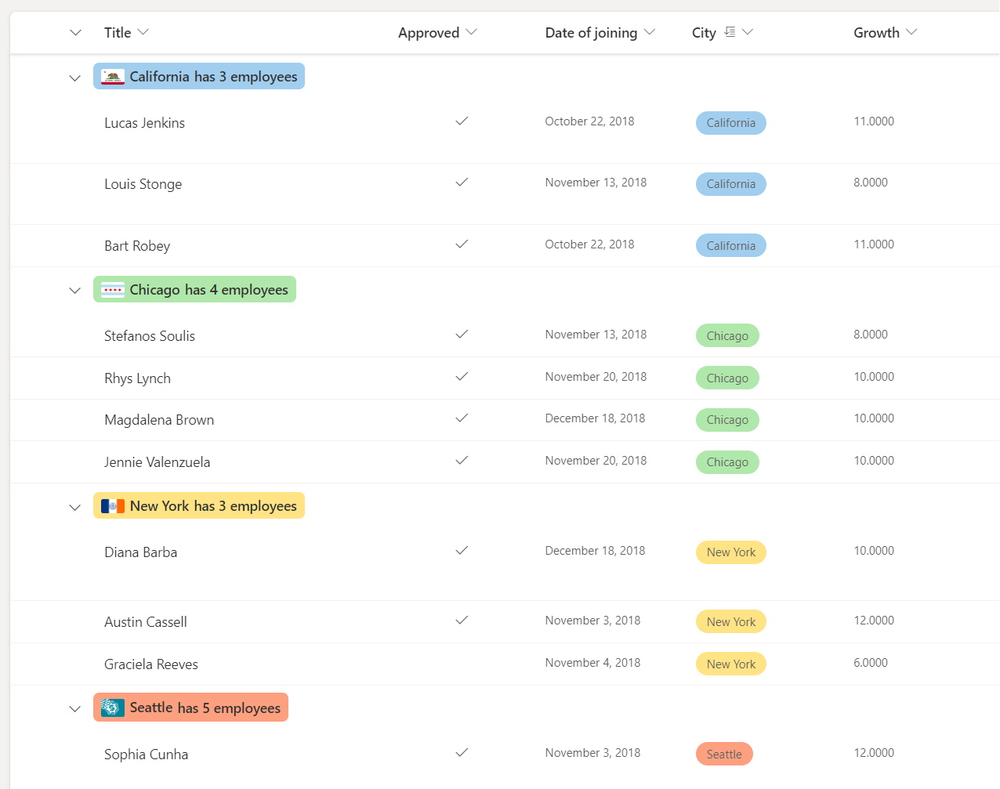
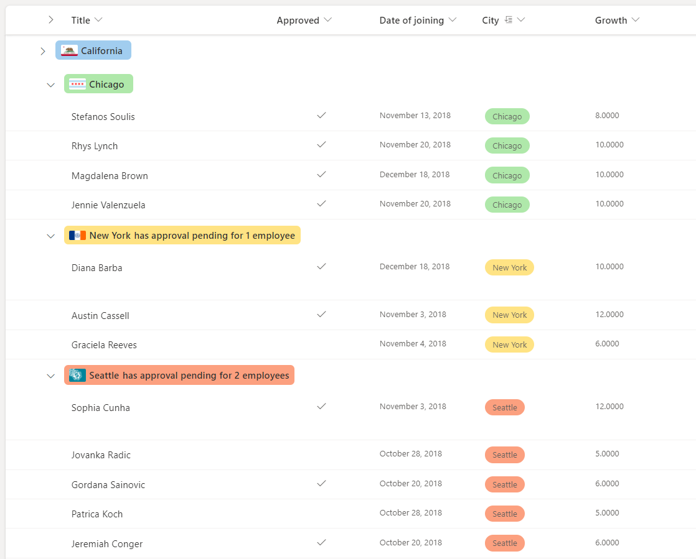
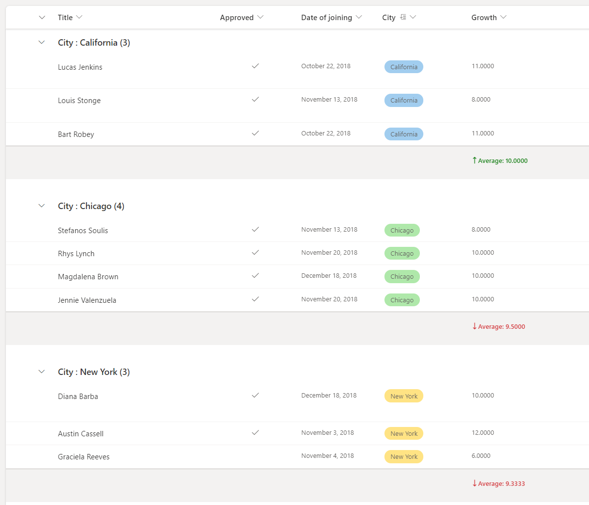
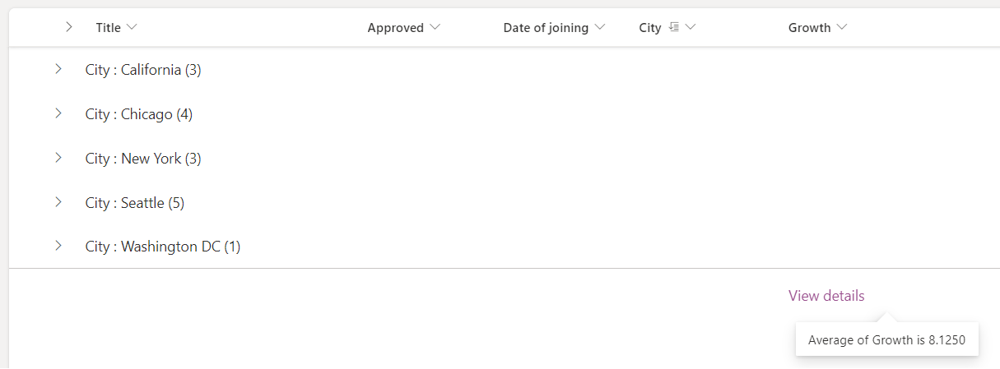

# List layout customizations

## Apply conditional classes on rows

You can use **`additionalRowClass`** to apply one or more classes to the entire list row depending on the value of one or more fields in the row. These examples leave the content and structure of list rows intact.

For a list of recommended classes to use inside view formats, please see the [Style guidelines](column-formatting.md#style-guidelines) in the [Use column formatting to customize SharePoint](column-formatting.md).

> [!TIP]
> Using the `additionalRowClass` property to apply classes to list rows will leave the formatting of individual columns in place. This allows you to combine view formats with column formatting for some powerful visualizations.

### Example: Conditional classes based on a date field

The following image shows a list layout with a class applied based on the value of a date column:


This example applies the class `sp-field-severity--severeWarning` to a list row when the item's DueDate is before the current date/time:

```JSON
{
  "$schema": "https://developer.microsoft.com/json-schemas/sp/view-formatting.schema.json",
   "additionalRowClass": "=if([$DueDate] <= @now, 'sp-field-severity--severeWarning', '')"
}
```

### Example: Conditional classes based on the value in a text or choice field

This example was adopted from a column formatting example, [Conditional formatting based on the value in a text or choice field](https://github.com/SharePoint/sp-dev-list-formatting/tree/master/column-samples/text-conditional-format), with some important differences to apply the concept to list rows. The column formatting example applies both an icon and a class to a column based on the value of `@currentField`. The `additionalRowClass` attribute in view formatting, however, only allows you to specify a class and not an icon. Additionally, since `@currentField` always resolves to the value of the `Title` field when referenced inside a view format, this sample refers to the `Status` field directly (by using the [$Field] syntax inside the additionalRowClass property to determine which class to apply to the row).

```JSON
{
  "$schema": "https://developer.microsoft.com/json-schemas/sp/view-formatting.schema.json",
  "additionalRowClass": "=if([$Status] == 'Done', 'sp-field-severity--good', if([$Status] == 'In progress', 'sp-field-severity--low' ,if([$Status] == 'In review','sp-field-severity--warning', if([$Status] == 'Has issues','sp-field-severity--blocked', ''))))"
}
```

You can find this sample with additional details here: [Conditional formatting based on choice field](https://github.com/SharePoint/sp-dev-list-formatting/tree/master/view-samples/text-conditional-format)

### Example: Alternate Row Formatting based on Modulus

This example applies `% (Mod)` to a list row with alternate coloring the rows:

```JSON
{
  "$schema": "https://developer.microsoft.com/json-schemas/sp/view-formatting.schema.json",
  "additionalRowClass": "=if(@rowIndex%2==0,'ms-bgColor-themeLight','')"
}
```

## Build custom list rows

You can use **`rowFormatter`** to define a totally custom layout of field values inside a row using the same syntax used in [Column Formatting](column-formatting.md).

### Example: Multi-line view style

The following image shows a list with a custom multi-line view style applied:


This example uses the `rowFormatter` element, which totally overrides the rendering of a list row. The `rowFormatter` in this example creates a bounding `<div />` box for every list row. Inside this bounding box, the `$Title` and `$Feedback` fields are displayed on separate lines. Under those fields, a `button` element is displayed that, when clicked, does the same thing as clicking the list row in an uncustomized view, which is opening the property form for the item. This `button` is displayed conditionally, when the value of the `$Assigned_x0020_To` field (assumed to be a person/group field) matches the current signed-in user:

```JSON
{
  "$schema": "https://developer.microsoft.com/json-schemas/sp/v2/row-formatting.schema.json",
  "hideSelection": true,
  "hideColumnHeader": true,
  "rowFormatter": {
    "elmType": "div",
    "attributes": {
      "class": "sp-row-card"
    },
    "children": [
      {
        "elmType": "div",
        "style": {
          "text-align": "left"
        },
        "children": [
          {
            "elmType": "div",
            "attributes": {
              "class": "sp-row-title"
            },
            "txtContent": "[$Title]"
          },
          {
            "elmType": "div",
            "attributes": {
              "class": "sp-row-listPadding"
            },
            "txtContent": "[$Feedback]"
          },
          {
            "elmType": "button",
            "customRowAction": {
              "action": "defaultClick"
            },
            "txtContent": "Give feedback",
            "attributes": {
              "class": "sp-row-button"
            },
            "style": {
              "display": {
                "operator": "?",
                "operands": [
                  {
                    "operator": "==",
                    "operands": [
                      "@me",
                      "[$Assigned_x0020_To.email]"
                    ]
                  },
                  "",
                  "none"
                ]
              }
            }
          }
        ]
      }
    ]
  }
}
```

You can find this sample with additional details here: [Multi-line view rendering](https://github.com/SharePoint/sp-dev-list-formatting/tree/master/view-samples/multi-line-view)

## Build custom group headers and footers

You can use `groupProps` to format group headers with flexibility to add grouped column's data, display name and item count. You can also add group aggregates in the group headers or format it directly in the group footers.

### Example: Color coded group header

In the example below we have list with group headers formatted according to column metadata.



In this example below, the `headerFormatter` for `groupProps` is used to format the group header and the `@group` is used to access group info.

> [!NOTE]
> The JSON below contains line breaks. These have been added to improve the readability of the code.

```JSON
{
  "$schema": "https://developer.microsoft.com/json-schemas/sp/v2/row-formatting.schema.json",
  "groupProps": {
    "headerFormatter": {
      "elmType": "div",
      "style": {
        "flex-wrap": "wrap",
        "display": "flex",
        "box-sizing": "border-box",
        "padding": "4px 8px 5px 8px",
        "border-radius": "6px",
        "align-items": "center",
        "white-space": "nowrap",
        "overflow": "hidden",
        "margin": "1px 4px 4px 1px"
      },
      "attributes": {
        "class": "=if(@group.fieldData == 'California', 'sp-css-backgroundColor-blueBackground37',
                   if(@group.fieldData == 'Chicago', 'sp-css-backgroundColor-successBackground50',
                   if(@group.fieldData == 'New York', 'sp-css-backgroundColor-warningBackground50',
                   if(@group.fieldData == 'Seattle', 'sp-css-backgroundColor-blockingBackground50',
                   if(@group.fieldData == 'Washington DC', 'sp-css-backgroundColor-errorBackground50',
                   'sp-field-borderAllRegular sp-field-borderAllSolid sp-css-borderColor-neutralSecondary')))))"
      },
      "children": [
        {
          "elmType": "img",
          "attributes": {
            "src": "=if(@group.fieldData == 'California', 'https://upload.wikimedia.org/wikipedia/commons/thumb/0/01/Flag_of_California.svg/1920px-Flag_of_California.svg.png',
                     if(@group.fieldData == 'Chicago', 'https://upload.wikimedia.org/wikipedia/commons/thumb/9/9b/Flag_of_Chicago%2C_Illinois.svg/1920px-Flag_of_Chicago%2C_Illinois.svg.png',
                     if(@group.fieldData == 'New York', 'https://upload.wikimedia.org/wikipedia/commons/thumb/b/ba/Flag_of_New_York_City.svg/2560px-Flag_of_New_York_City.svg.png',
                     if(@group.fieldData == 'Seattle', 'https://upload.wikimedia.org/wikipedia/en/thumb/6/6d/Flag_of_Seattle.svg/1920px-Flag_of_Seattle.svg.png',
                     if(@group.fieldData == 'Washington DC', 'https://upload.wikimedia.org/wikipedia/commons/thumb/d/d4/Flag_of_the_District_of_Columbia.svg/2560px-Flag_of_the_District_of_Columbia.svg.png', '')))))"
          },
          "style": {
            "max-width": "24px",
            "max-height": "24px",
            "margin-top": "2px",
            "border-radius": "2px"
          }
        },
        {
          "elmType": "div",
          "children": [
            {
              "elmType": "span",
              "style": {
                "padding": "5px 5px 5px 5px",
                "font-weight": "500"
              },
              "txtContent": "@group.fieldData.displayValue"
            }
          ]
        },
        {
          "elmType": "div",
          "children": [
            {
              "elmType": "div",
              "style": {
                "display": "flex",
                "flex-direction": "row",
                "justify-content": "center"
              },
              "children": [
                {
                  "elmType": "div",
                  "txtContent": "='has ' + @group.count + if(@group.count > '1', ' employees', ' employee')",
                  "style": {
                    "font-weight": "500"
                  }
                }
              ]
            }
          ]
        }
      ]
    }
  }
}
```

### Example: Color coded group header with aggregate

In the example below we have list with group headers formatted with group aggregates.



In this example the `hideFooter` for `groupProps` is set to `true` - to hide the group footer and the `@aggregates` array is used to display a summary in the group header.

> [!NOTE]
> The JSON below contains line breaks. These have been added to improve the readability of the code.

```JSON
{
  "$schema": "https://developer.microsoft.com/json-schemas/sp/v2/row-formatting.schema.json",
  "groupProps": {
    "hideFooter": true,
    "headerFormatter": {
      "elmType": "div",
      "style": {
        "flex-wrap": "wrap",
        "display": "flex",
        "box-sizing": "border-box",
        "padding": "4px 8px 5px 8px",
        "border-radius": "6px",
        "align-items": "center",
        "white-space": "nowrap",
        "overflow": "hidden",
        "margin": "1px 4px 4px 1px"
      },
      "attributes": {
        "class": "=if(@group.fieldData == 'California', 'sp-css-backgroundColor-blueBackground37',
                   if(@group.fieldData == 'Chicago', 'sp-css-backgroundColor-successBackground50',
                   if(@group.fieldData == 'New York', 'sp-css-backgroundColor-warningBackground50',
                   if(@group.fieldData == 'Seattle', 'sp-css-backgroundColor-blockingBackground50',
                   if(@group.fieldData == 'Washington DC', 'sp-css-backgroundColor-errorBackground50',
                   'sp-field-borderAllRegular sp-field-borderAllSolid sp-css-borderColor-neutralSecondary')))))"
      },
      "children": [
        {
          "elmType": "img",
          "attributes": {
            "src": "=if(@group.fieldData == 'California', 'https://upload.wikimedia.org/wikipedia/commons/thumb/0/01/Flag_of_California.svg/1920px-Flag_of_California.svg.png',
                     if(@group.fieldData == 'Chicago', 'https://upload.wikimedia.org/wikipedia/commons/thumb/9/9b/Flag_of_Chicago%2C_Illinois.svg/1920px-Flag_of_Chicago%2C_Illinois.svg.png',
                     if(@group.fieldData == 'New York', 'https://upload.wikimedia.org/wikipedia/commons/thumb/b/ba/Flag_of_New_York_City.svg/2560px-Flag_of_New_York_City.svg.png',
                     if(@group.fieldData == 'Seattle', 'https://upload.wikimedia.org/wikipedia/en/thumb/6/6d/Flag_of_Seattle.svg/1920px-Flag_of_Seattle.svg.png',
                     if(@group.fieldData == 'Washington DC', 'https://upload.wikimedia.org/wikipedia/commons/thumb/d/d4/Flag_of_the_District_of_Columbia.svg/2560px-Flag_of_the_District_of_Columbia.svg.png', '')))))"
          },
          "style": {
            "max-width": "24px",
            "max-height": "24px",
            "margin-top": "2px",
            "border-radius": "2px"
          }
        },
        {
          "elmType": "div",
          "children": [
            {
              "elmType": "span",
              "style": {
                "padding": "5px 5px 5px 5px",
                "font-weight": "500"
              },
              "txtContent": "@group.fieldData.displayValue"
            }
          ]
        },
        {
          "elmType": "div",
          "forEach": "aggregate in @aggregates",
          "children": [
            {
              "elmType": "div",
              "style": {
                "display": "=if([$aggregate.columnDisplayName] == 'Approved' && Number([$aggregate.value]) < @group.count, 'flex', 'none')",
                "flex-direction": "row",
                "justify-content": "center"
              },
              "children": [
                {
                  "elmType": "div",
                  "txtContent": "='has approval pending for ' + Number(@group.count - Number([$aggregate.value])) + if(@group.count - Number([$aggregate.value]) > 1 , ' employees', ' employee')",
                  "style": {
                    "font-weight": "500"
                  }
                }
              ]
            }
          ]
        }
      ]
    }
  }
}

```

### Example: Custom group footer

In the example below we have list with group footer formatted according to aggregate value.



In this example the `footerFormatter` for `groupProps` are used to format the group footer and the `@columnAggregate` is used to access column aggregate.

```JSON
{
  "$schema": "https://developer.microsoft.com/json-schemas/sp/v2/row-formatting.schema.json",
  "groupProps": {
    "hideFooter": false,
    "footerFormatter": {
      "elmType": "div",
      "children": [
        {
          "elmType": "div",
          "attributes": {
            "iconName": "=if(@columnAggregate.type == 'Average' && @columnAggregate.value < 10, 'SortDown', 'SortUp')"
          },
          "style": {
            "color": "=if(@columnAggregate.type == 'Average' && @columnAggregate.value < 10, '#d13438', '#107c10')",
            "font-weight": "600",
            "margin-top": "10px"
          }
        },
        {
          "elmType": "div",
          "style": {
            "color": "=if(@columnAggregate.type == 'Average' && @columnAggregate.value < 10, '#d13438', '#107c10')",
            "font-weight": "600",
            "margin-top": "10px",
            "font-family": "Segoe UI"
          },
          "txtContent": "=@columnAggregate.type + ': ' + @columnAggregate.value"
        }
      ]
    }
  }
}
```

## Build custom list footers

You can use `footerFormatter` to format list footer with access to column aggregates.

### Example: Custom list footer

In the example below we have list with formatted footer as per the aggregate value.



In this example the `footerFormatter` is set to format the list footer and the `@columnAggregate` is used to access column aggregate.

```JSON
{
  "$schema": "https://developer.microsoft.com/json-schemas/sp/v2/row-formatting.schema.json",
  "hideFooter": false,
  "footerFormatter": {
    "elmType": "div",
    "attributes": {
      "class": "ms-fontColor-themePrimary"
    },
    "customCardProps": {
      "formatter": {
        "elmType": "div",
        "children": [
          {
            "elmType": "div",
            "style": {
              "display": "flex"
            },
            "txtContent": "=@columnAggregate.type + ' of ' + @columnAggregate.columnDisplayName + ' is ' + @columnAggregate.value"
          }
        ],
        "style": {
          "height": "10px",
          "width": "auto",
          "cursor": "pointer",
          "font-size": "14px",
          "padding": "14px"
        }
      },
      "openOnEvent": "hover",
      "directionalHint": "bottomCenter",
      "isBeakVisible": true,
      "beakStyle": {
        "backgroundColor": "white"
      }
    },
    "txtContent": "View details",
    "style": {
      "text-decoration": "none",
      "cursor": "pointer",
      "font-size": "16px",
      "margin-top": "10px"
    }
  }
}
```

## Detailed syntax reference

### rowFormatter

Optional element. Specifies a JSON object that describes a list row format. The schema of this JSON object is identical to the schema of a column format. For details on this schema and its capabilities, see [Column Format Detailed syntax reference](column-formatting.md#detailed-syntax-reference). 

> [!NOTE]
> Using the `rowFormatter` property will override anything specified in the `additionalRowClass` property. They are mutually exclusive.

#### Differences in behavior between the rowFormatter element and column formatting

Despite sharing the same schema, there are some differences in behavior between elements inside a `rowFormatter` element and those same elements in a column formatting object.

- `@currentField` always resolves to the value of the `Title` field inside a `rowFormatter`.

### additionalRowClass

Optional element. Specifies a CSS class(es) that is applied to the entire row. Supports expressions. 

`additionalRowClass` only takes effect when there is no `rowFormatter` element specified. If a `rowFormatter` is specified, then `additionalRowClass` is ignored.

### hideSelection

Optional element. Specifies whether the ability to select rows in the view is disabled or not. `false` is the default behavior inside a list view (meaning selection is visible and enabled). `true` means that users will not be able to select list items.

### hideColumnHeader

Optional element. Specifies whether the column headers in the view are hidden or not. `false` is the default behavior inside a list view (meaning column headers will be visible). `true` means that the view will not display column headers. 

### groupProps

Groups the group related customization options. For details on `groupProps`, see [Group Customization syntax reference](view-group-formatting)