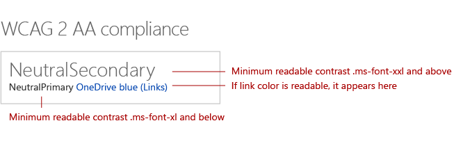

<!--Based on how rough this content is in it's current state, i'm going to pull it from this initial release so we can edit and better prepare. -->

# Accessibility in SharePoint web part design

Developing an equal experience that meets all users' unique visual, hearing, dexterity, cognitive, and speech needs is an important component of SharePoint web part design. Accessible design applies not only to people with disabilities, but also to potential situational impairments. Accessible design is good design.

## Accessibility guidelines

<!-- Make sure that this is an external resource that folks can access. Original link was to a OneNote file. -->
All Microsoft products must meet the requirements listed in the [Microsoft Accessibility Standards](https://microsoft.sharepoint.com/teams/msenable/Pages/MASDetails.aspx
"Link to Microsoft Accesssibility Standards").  

<!-- Fabric components are not designed to be accessible already? And, shouldn't components that aren't based on Fabric also be accessible? -->

If you're building a dialog box, file picker, or any other [Office UI Fabric](https://dev.office.com/fabric#/components) component, follow the guidance in this article to ensure that your content is accessible. 

<!-- Not sure why we have that link? It currently goes to the OneNote file. Where is the Common UI Controls content? Is that related to accessibility? [v-licapu] - I agree; we shouldn't be linking to this unless it's live to external audiences; even I can't access it. I moved it to within the comment: 
[Common UI Controls](https://microsoft.sharepoint.com/teams/STS/_layouts/OneNote.aspx?id=%2Fteams%2FSTS%2FShared%20Documents%2FSP%20Accessibility%2FAccessibility%20Guidance&wd=target%28Accessibility%20101.one%7C0005C142-938C-4411-B543-B9F4199E19B3%2FEverything%20you%20need%20to%20know%20about%20Accessibility%7CE099AFE3-8804-4E1F-BA50-99493AB8A3D0%2F%29 "Link to Common UI Controls") -->

## Accessibility testing

<!-- FYI, I added links. Can we assume that our target audience uses the Edge browser? -->

Test your web part first with [Narrator](https://support.microsoft.com/en-us/help/22798/windows-10-narrator-get-started) and Microsoft Edge, and then verify the accessibility experience with [JAWS](http://www.freedomscientific.com/Products/Blindness/JAWS).

Narrator and Microsoft Edge are standards compliant. When you test with that combination, you are more likely to find issues, and you can validate that your site meets accessibility standards. 

JAWS is the market leader in screen readers. JAWS includes features that can improve the accessibility of some websites that aren't as accessible in other screen readers. Therefore testing in JAWS might not ensure that your site meets all accessibility requirements. 
 
You might also want to test for whatever combination of browser and screen reader has the greatest market share for your website.

<!-- Delete? This doesn't seem like text that should be in externally published docs? 
When suppliers test with JAWS, we ask them to repro identified bugs with Narrator and Edge. In the case a bug does not repro with Narrator/Edge it is sent to Mary Smith who works with VFO for a Jaws specific fix. 
-->

## Keyboard navigation

<!-- Is this section telling people how to navigate via a keyboard, or how to design to optimize for keyboard navigation? If the former, . -->

For some users, navigating a site via keyboard is more accessible. Power users also often rely on keyboard navigation. Use keyboard shortcuts such as tabs to go controls on the page, and use arrow keys to navigate inside controls.

### Navigation between controls

Each control is a tab stop. Within a control, the following rules apply:

- In general, the first tab stop is the top left area of the control. The last tab stop is the bottom right control.
- For modal surfaces, the last tab stop should be the commit actions.
- For lists, the first tab stop should be the first item in the list, the next should be the commands, and then the navigation, settings, and so on.

<!-- We should make sure the content in the accessibility topic is accessibible. ;) Please describe the information that the image conveys; something like this (also consider making the image an actual screen shot, that might be more clear):

In the following image:
The first tab is the list item.
The second tab is the command.
The third tab is the navigation.
-->

*Figure 1. The tab stops on a SharePoint page*

### Navigation within a control

You can use arrow keys to move to items in a control, such as choices in a menu, commands in a command bar, or items in a list.

<!-- This image is not very clear. Do you need to have the "blank" list box on the left? -->

*Figure 2. Using arrow keys to navigate within a control*

### Selecting the current item

Use the space bar to select or deselect the item currently in focus in a control.

*Figure 3. Using the space bar to select an item in a list*

### Run a control

Select **Enter** or the return key to run a control.

*Figure 4. Selecting Enter to run a control*

### Leave a control

Select **Escape** to exit a control and return to the container.

*Figure 5. Selecting Escape to leave a control and return to the container*

### Go to the first or last item

Select **Home** or **End** to go directly to the first or last item in a list, menu, and so on.

*Figure 6. Selecting Home or End to go to the first or last item in a list*

## Screen reader navigation

Users who have vision impairments rely on screen readers to navigate the site UI. 

<!-- Narrator isn't a third-party product. This image needs more text/explanation; please also clarify the alt text. Is this section important, or can it be removed, given the previous mention of testing with Narrator and JAWS? Again, the intent/target audience for this information isn't clear - is it for the user, or the designer? Can you explain why this information is important from the designer's POV? -->

*Figure 7. Screen reader navigation of a SharePoint page*

## Alt text and transcripts

Use alt text to provide descriptions of images that can be consumed by screen readers. This is useful for vision-impaired users who cannot consume information visually. Make sure that your alt text is descriptive, keeping in mind that some readers are relying on a screen reader to access the information conveyed in the image. 

Don't rely only on color to convey meaning; rely on both color and shape.

To be fully compliant with accessibility standards, include alt text and a complete transcript of audio and video content on your site.

## Minimum readable contrast

A minimum level of contrast is essential to help users with vision impairments consume the content on the page. It is also important to aid readability in low light and glare situations. 

<!-- Convert this image into a table, for accessibility. ;) -->
<!-- -->

### Theme colors (Blue) and neutral colors

<table>
<tr>
<td style="color:white; background-color:#004578">themeDarker: #004578</td>
<td style="color:white; background-color:#000000">black: #000000</td>
</tr>
<tr>
<td style="color:white; background-color:#005a9e">themeDark: #005a9e</td>
<td style="color:white; background-color:#212121">neutralDark: #212121</td>
</tr>
<tr>
<td style="color:white; background-color:#106ebe">themeDarkAlt: #106ebe</td>
<td style="color:white; background-color:#333">neutralPrimary: #333</td>
</tr>
<tr>
<td rowspan="3" style="font-weight:bold; vertical-align:middle; color:white; background-color:#0078d7">themePrimary: #0078d7</td>
<td style="color:white; background-color:#3c3c3c">neutralPrimaryAlt: #3c3c3c</td>
</tr>
<tr>
<td style="color:white; background-color:#666666">neutralSecondary: #666666</td>
</tr>
<tr>
<td style="color:black; background-color:#a6a6a6">neutralTertiary: #a6a6a6</td>
</tr>
<tr>
<td style="color:white; background-color:#2b88d8">themeSecondary: #2b88d8</td>
<td style="color:black; background-color:#c8c8c8">neutralTertiaryAlt: #c8c8c8</td>
</tr>
<tr>
<td style="color:black; background-color:#71afe5">themeTertiary: #71afe5</td>
<td style="color:black; background-color:#eaeaea">neutralLight: #eaeaea</td>
</tr>
<tr>
<td style="color:black; background-color:#c7e0f4">themeLight: #c7e0f4</td>
<td style="color:black; background-color:#f4f4f4">neutralLighter: #f4f4f4</td>
</tr>
<tr>
<td style="color:black; background-color:#deecf9">themeLighter: #deecf9</td>
<td style="color:black; background-color:#f8f8f8">neutralLighterAlt: #f8f8f8</td>
</tr>
<tr>
<td style="color:black; background-color:#eff6fc">themeLighterAlt: #eff6fc</td>
<td style="color:black; background-color:#fff">white: #fff</td>
</tr>
</table>

### Alert colors

<table>
<tr>
<td style="color:white; background-color:#952226">themeDark: #952226</td>
</tr>
<tr>
<td style="color:black; background-color:#f6d6d8">themeLight: #f6d6d8</td>
</tr>
<tr>
<td style="color:white; background-color:#e55c12">themeSecondary: #e55c12</td>
</tr>
</table>

 

<table>
<tr>
<td style="color:white; background-color:#0f7c39">themeDarkAlt: #0f7c39</td>
</tr>
<tr>
<td style="color:black; background-color:#bff7d5">themeLight: #bff7d5</td>
</tr>
</table>

## High contrast

Use high contrast colors as a guide for color choices for components and states on the web. Windows computers only have the ability to detect whether a PC is running high contrast, or high contrast white. For this reason, use the default high contrast black setting for any high contrast, non-white theme.

<!-- In the left part of the image, I think the title should be "High Contrast Black". -->

*Figure 8. High contrast black and high contrast white settings*

