# Accessibility in SharePoint web part design

Developing an experience that meets all users' unique visual, hearing, dexterity, cognitive, and speech needs is an important component of SharePoint web part design. Accessible design applies not only to people with disabilities, but also to potential situational impairments. Accessible design is good design.

## Accessibility guidelines

All Microsoft products must meet the requirements listed in the [Microsoft Accessibility Standards](https://www.microsoft.com/en-us/accessibility).

## Making web parts accessible

The SharePoint Framework provides a structure to help make all web parts accessible. The web part container provides keyboard navigation defaults for the web part toolbar to edit, move, and delete the web part, a method to select the web part, and a keyboard short cut (Ctrl+P) to open the property pane. However, you still need to specify additional keyboard and screen reader navigation for the other aspects of the UI in the web part and in the property pane. 

In addition, many [Office UI Fabric components](https://developer.microsoft.com/en-us/fabric#/components) have built-in support for accessibility options, to make it quick to configure keyboard and screen reader navigation when you use the components in a web part.

The following image shows keyboard  navigation on a web part.

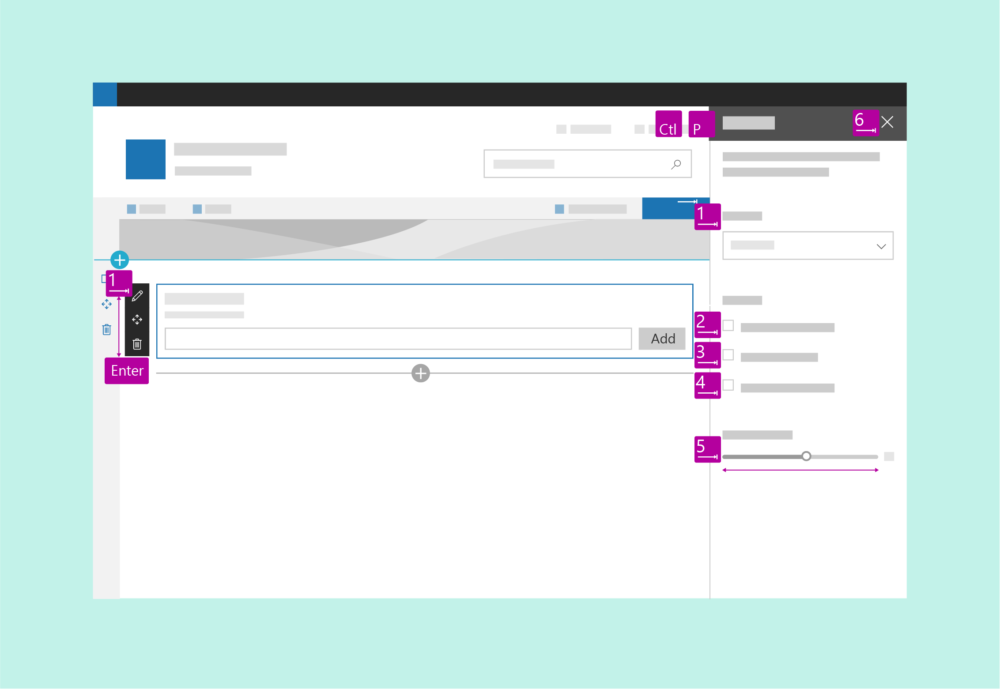

## Accessibility testing

Test your web part first with [Narrator](https://support.microsoft.com/en-us/help/22798/windows-10-narrator-get-started) and Microsoft Edge, and then verify the accessibility experience with [JAWS](http://www.freedomscientific.com/Products/Blindness/JAWS).

Narrator and Microsoft Edge are standards compliant. When you test with that combination, you are more likely to find issues, and you can validate that your site meets accessibility standards. 

JAWS is the market leader in screen readers. JAWS includes features that can improve the accessibility of some websites that aren't as accessible in other screen readers. Therefore, testing in JAWS might not ensure that your site meets all accessibility requirements. 
 
You might also want to test for whatever combination of browser and screen reader has the greatest market share for your website.

## Keyboard navigation

For some users, navigating a site via keyboard is more accessible. Power users also often rely on keyboard navigation. Make sure to design keyboard shortcuts such as tabs to go to controls on the page, and use arrow keys to navigate inside controls.

### Navigation between controls

Each control is a tab stop. Within a control, the following rules apply:

- In general, the first tab stop is the top left area of the control. The last tab stop is the bottom right control.
- For modal surfaces, the last tab stop should be the commit actions.
- For lists, the first tab stop should be the first item in the list, the next should be the commands, and then the navigation, settings, and so on.

<!-- We should make sure the content in the accessibility topic is accessibible. ;) Please describe the information that the image conveys; something like this (also consider making the image an actual screen shot, that might be more clear):

In the following image:
The first tab is the list item.
The second tab is the command.
The third tab is the navigation.
-->
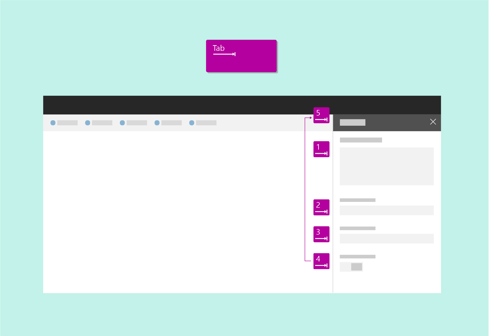

### Navigation within a control

You can use arrow keys to move to items in a control, such as choices in a menu, commands in a command bar, or items in a list.

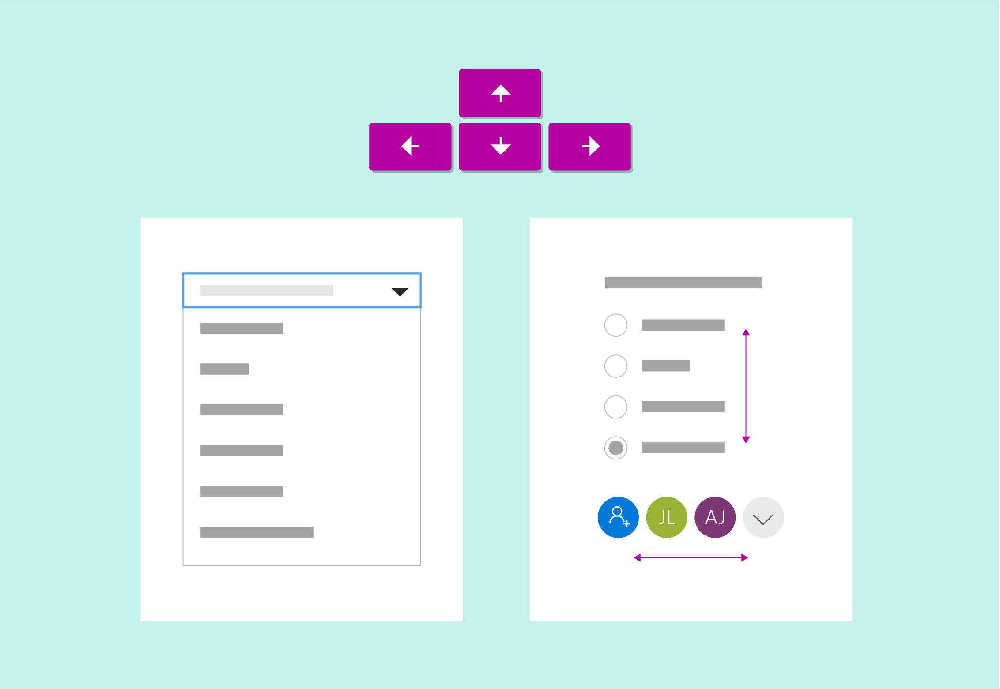

### Selecting the current item

Use the space bar to select or deselect the item currently in focus in a control.

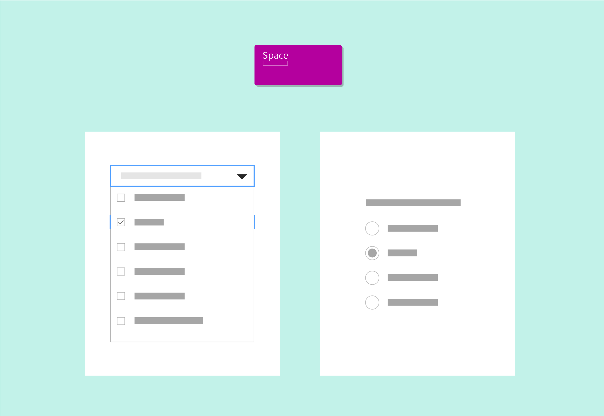

### Run a control

Press **Enter** or the return key to run a control.

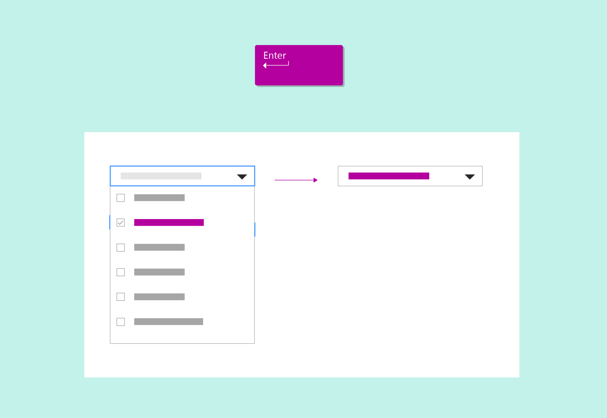

### Leave a control

Press **Escape** to exit a control and return to the container.

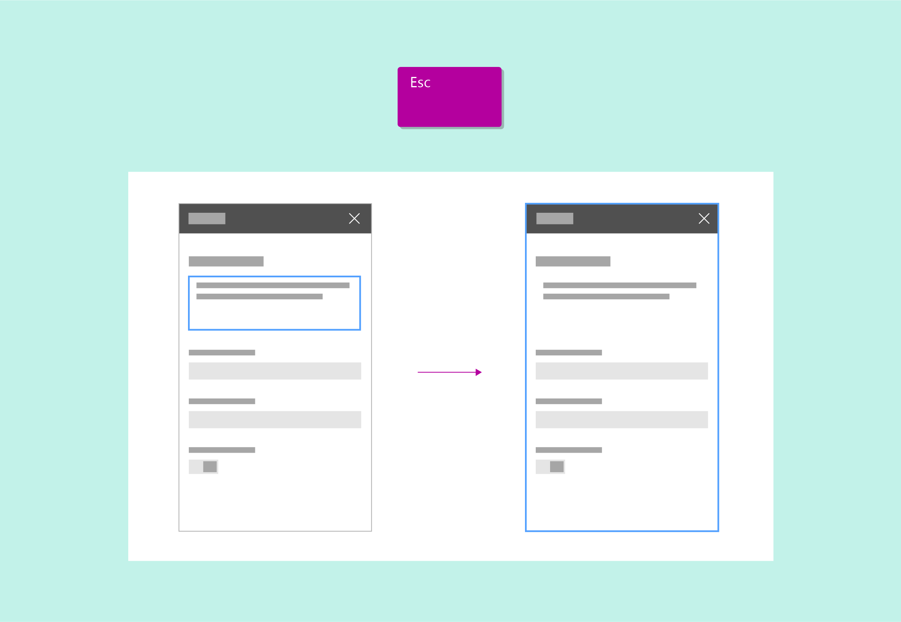

### Go to the first or last item

Press **Home** or **End** to go directly to the first or last item in a list, menu, and so on.

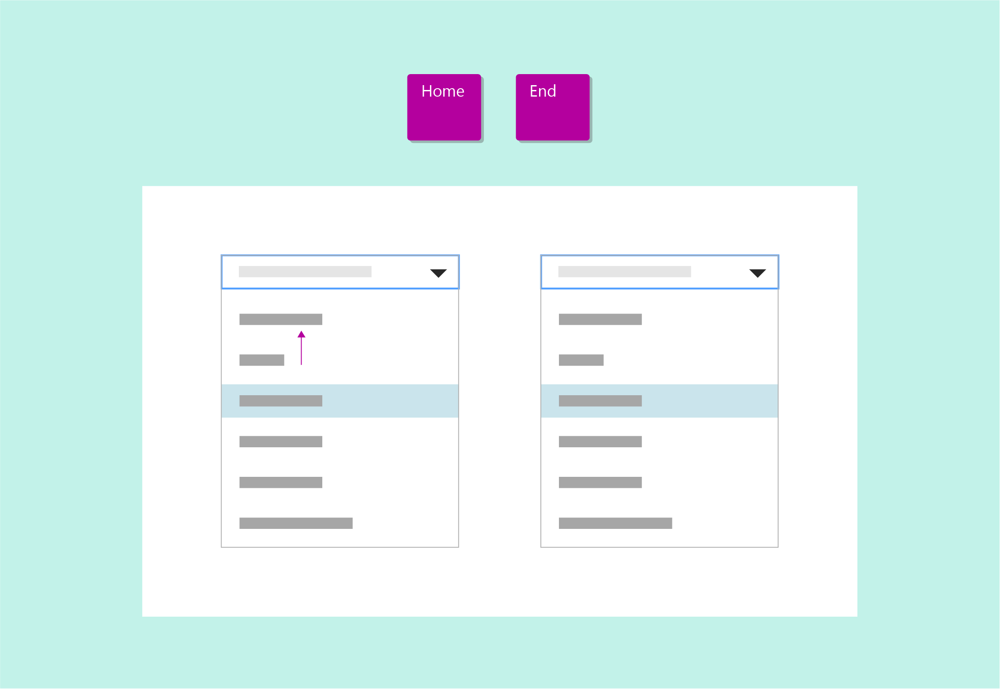

## Screen reader navigation

Users who have vision impairments rely on screen readers to navigate the site UI. When designing a web part, follow this example when thinking about keyboard navigation and how the screen reader conveys important actions or information to the user.

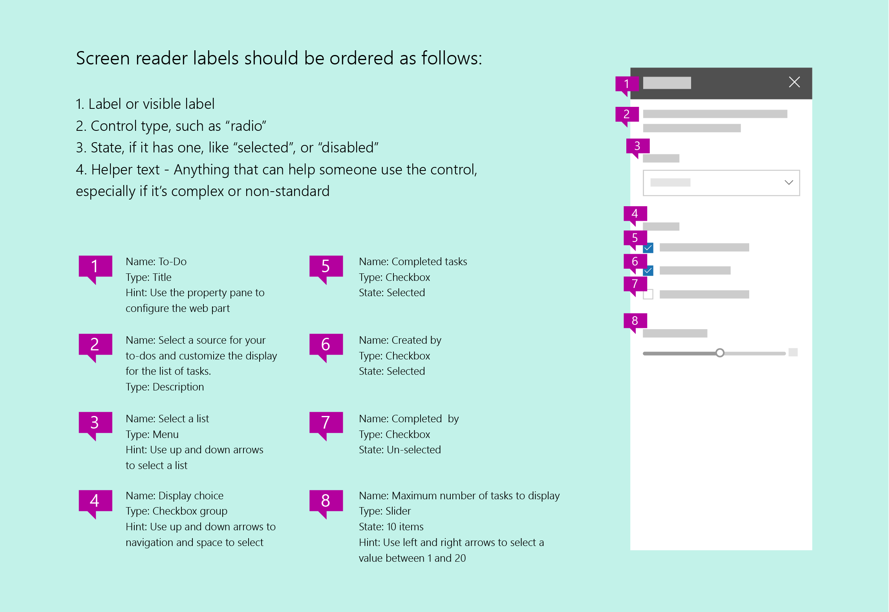

## Alt text and transcripts

Use alt text to provide descriptions of images that can be consumed by screen readers. This is useful for vision-impaired users who cannot consume information visually. Make sure that your alt text is descriptive, keeping in mind that some readers are relying on a screen reader to access the information conveyed in the image. 

Don't rely only on color to convey meaning; rely on both color and shape.

To be fully compliant with accessibility standards, include alt text and a complete transcript of audio and video content on your site.

## Minimum readable contrast

A minimum level of contrast is essential to help users with vision impairments consume the content on the page. It is also important to aid readability in low light and glare situations. 

The following image shows theme colors on the left and neutral colors on the right. 

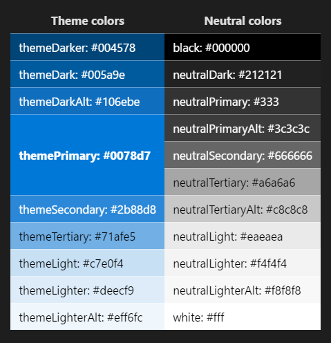

<!--I replaced this image because it doesn't even make sense; the text to the right of each box does not match what's in the box, and none are labeled "theme." 
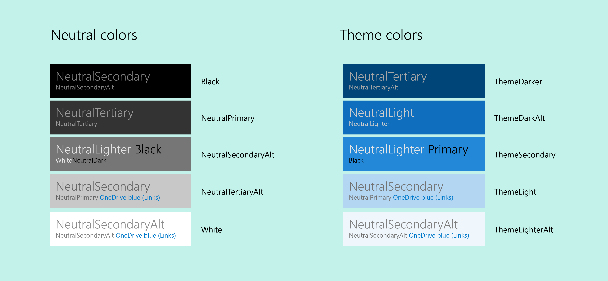-->

 

<table>
<tr>
    <th>Theme colors</th>
    <th>Neutral colors</th> 
  </tr>
<tr>
<td style="color:white; background-color:#004578">themeDarker: #004578</td>
<td style="color:white; background-color:#000000">black: #000000</td>
</tr>
<tr>
<td style="color:white; background-color:#005a9e">themeDark: #005a9e</td>
<td style="color:white; background-color:#212121">neutralDark: #212121</td>
</tr>
<tr>
<td style="color:white; background-color:#106ebe">themeDarkAlt: #106ebe</td>
<td style="color:white; background-color:#333">neutralPrimary: #333</td>
</tr>
<tr>
<td rowspan="3" style="font-weight:bold; vertical-align:middle; color:white; background-color:#0078d7">themePrimary: #0078d7</td>
<td style="color:white; background-color:#3c3c3c">neutralPrimaryAlt: #3c3c3c</td>
</tr>
<tr>
<td style="color:white; background-color:#666666">neutralSecondary: #666666</td>
</tr>
<tr>
<td style="color:black; background-color:#a6a6a6">neutralTertiary: #a6a6a6</td>
</tr>
<tr>
<td style="color:white; background-color:#2b88d8">themeSecondary: #2b88d8</td>
<td style="color:black; background-color:#c8c8c8">neutralTertiaryAlt: #c8c8c8</td>
</tr>
<tr>
<td style="color:black; background-color:#71afe5">themeTertiary: #71afe5</td>
<td style="color:black; background-color:#eaeaea">neutralLight: #eaeaea</td>
</tr>
<tr>
<td style="color:black; background-color:#c7e0f4">themeLight: #c7e0f4</td>
<td style="color:black; background-color:#f4f4f4">neutralLighter: #f4f4f4</td>
</tr>
<tr>
<td style="color:black; background-color:#deecf9">themeLighter: #deecf9</td>
<td style="color:black; background-color:#f8f8f8">neutralLighterAlt: #f8f8f8</td>
</tr>
<tr>
<td style="color:black; background-color:#eff6fc">themeLighterAlt: #eff6fc</td>
<td style="color:black; background-color:#fff">white: #fff</td>
</tr>
</table>

 

## High contrast

Use high contrast colors as a guide for color choices for components and states on the web. Windows computers only have the ability to detect whether a PC is running high contrast or high contrast white. For this reason, use the default high contrast black setting for any high contrast, non-white theme.

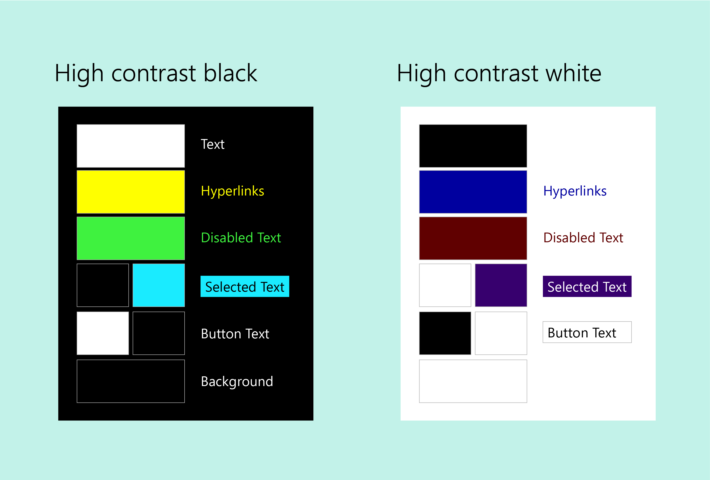

## See also

- [SharePoint themes and colors](themes-colors.md)
- [Design a web part](design-a-web-part.md)
- [Designing great SharePoint experiences](design-guidance-overview.md)

