# Authoring pages in a SharePoint site

Authoring pages in SharePoint is a simple process, but it does require some familiarity with the SharePoint environment, as well as an understanding of what and who you are designing the page for. A few basic principles, such as remembering to "Start simple" and "Build on what's working," are valuable things to consider as you start authoring. It's also a good idea to consistently remind yourself of your audience and the goals that you are trying to help them achieve.

<!-- Do we have content about the design principles that we can link to here? -->

The SharePoint page authoring experience has two modes: 

- **Edit**. Allows page authors to add and configure web parts to add content to a page.
- **Published**. Allows your team or audience to view content and interact with web parts. 

## Edit mode

When creating a new page, users have access to the authoring UI to add content to and customize the page content. 

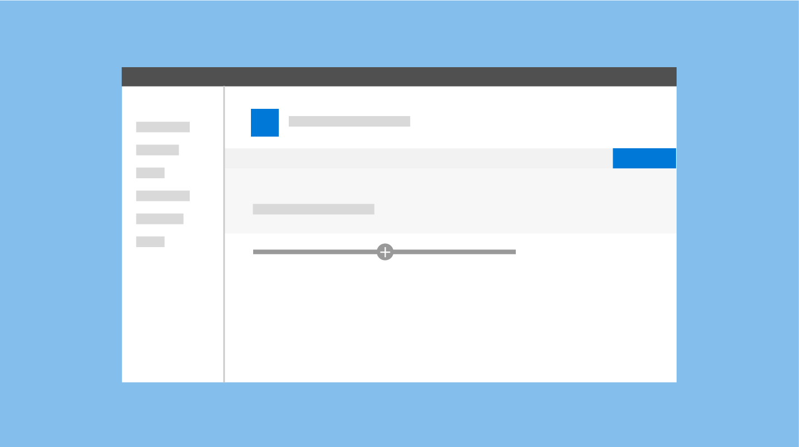

 

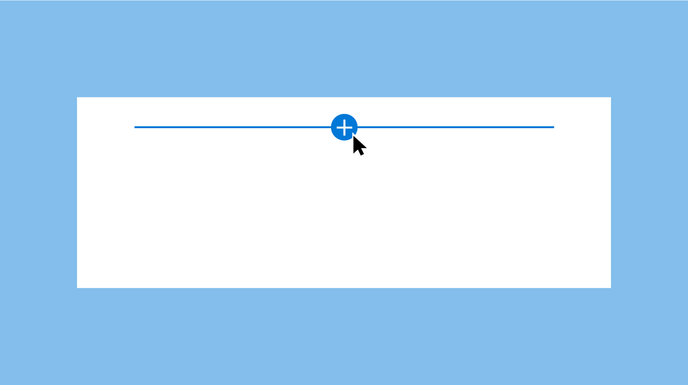

 

### Add hint and Toolbox

The add hint is a horizontal line with a plus icon that is visible when a web part is selected and on hover to indicate where page authors can add new web parts to their page. The Toolbox opens when a user selects the plus icon. The Toolbox contains all the web parts that can be added to a page.

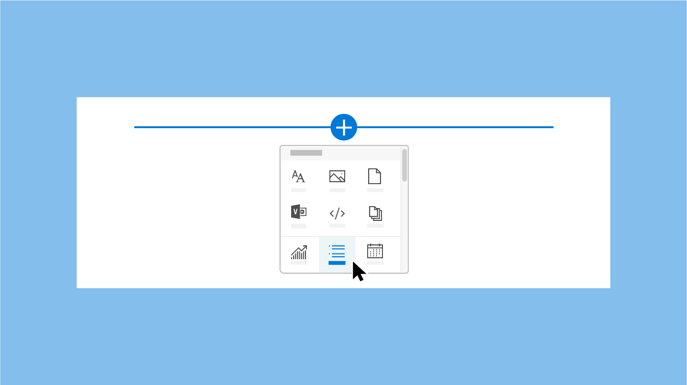

 

### Toolbar

A vertical toolbar and bounding box is part of the framework for every web part and is provided by the page. Each web part has an edit and delete action in the toolbar. 

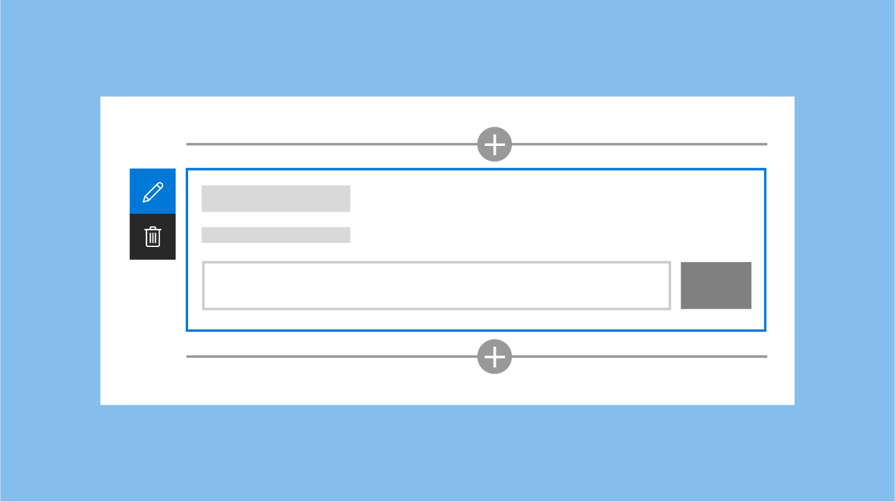

 

### Active and hover states

On hover/active, the hint bars are primary blue or the primary theme color for the site.

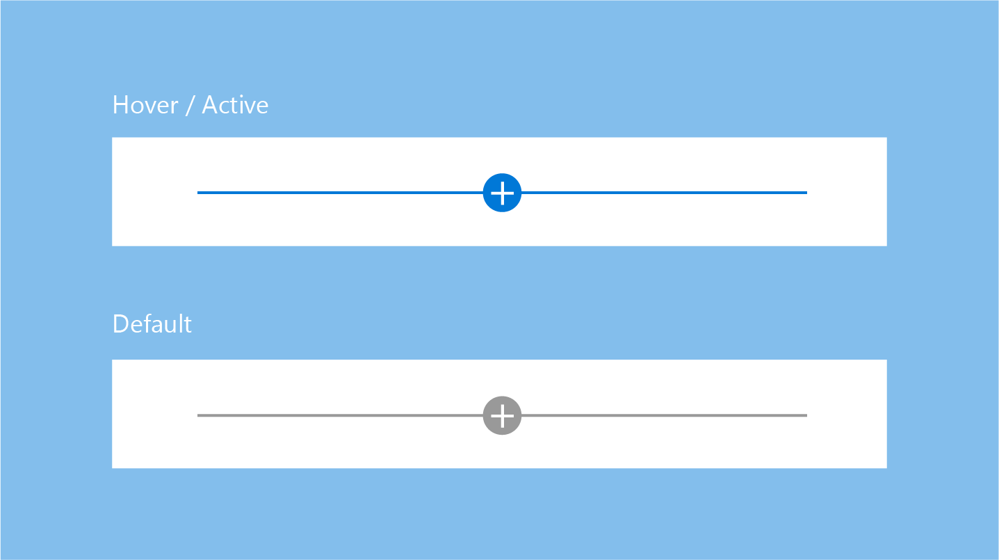

 

The bounding box for a web part is gray by default, but picks up the primary blue or primary theme color for the site on hover or when the web part is selected.

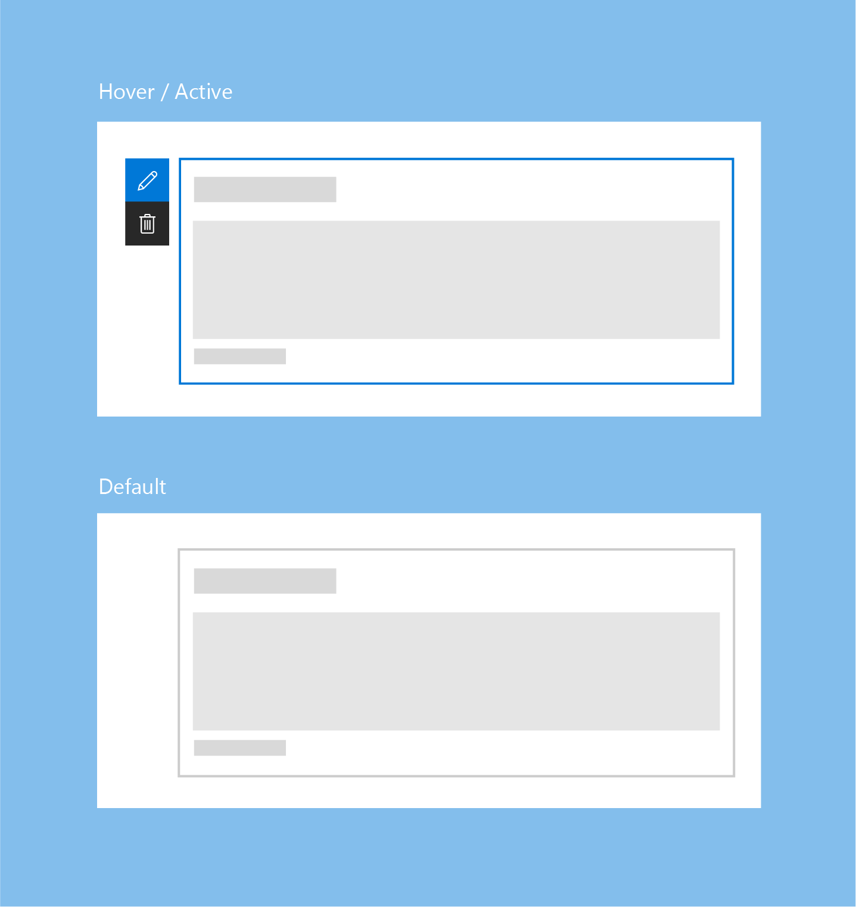

 

### Contextual edits

Design a WYSIWYG experience for web parts so that users can fill in information or add content that is displayed when published. This content should be entered on the page so that the user understands how it renders in the viewer. For example, titles and descriptions should be filled out where the text displays; new tasks should be added and modified in the context of the page.

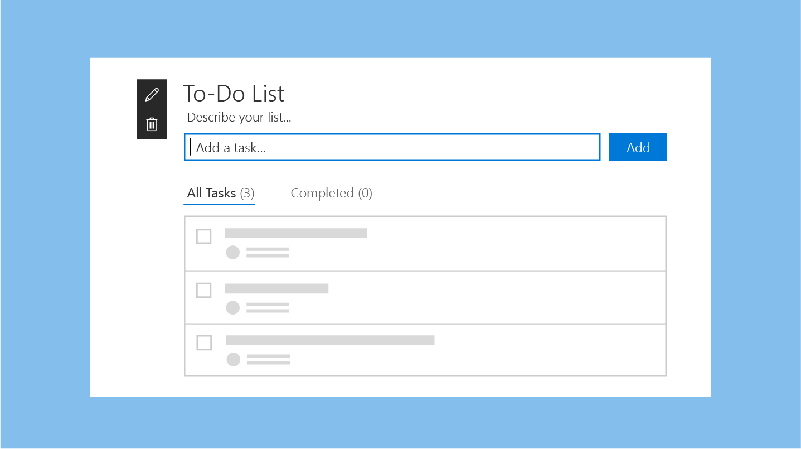

 

### Item-level edits

UI can change within the web part; for example, text can become a text field, or you can display UI to reorder items or to check off tasks in a web part. You can enable interactive functionality for web parts in edit mode, in read mode, or in both, depending on your design intent.

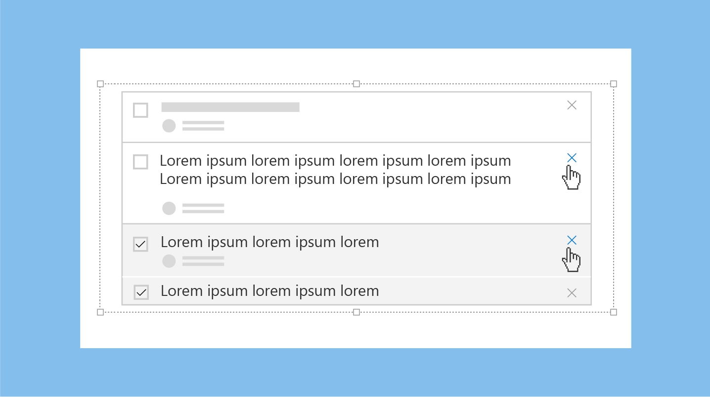

 

### Property panes

Property panes are invoked via the **Edit** icon on the toolbar. Property panes should primarily contain configuration settings that enable or disable features that either show on the page, or make a call to a service to display content. 

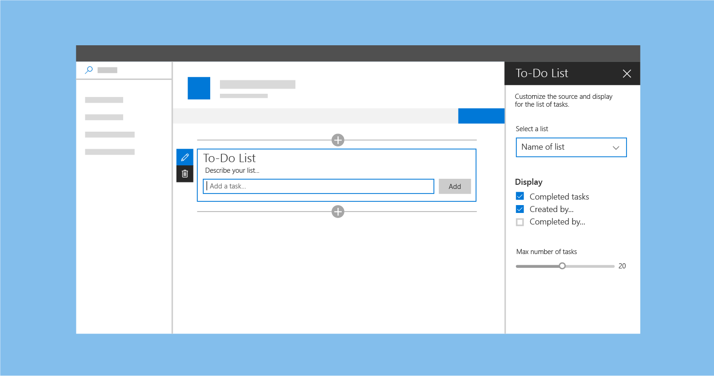

 

## Published mode

After the page is published, all editing UI is disabled for the viewer or reader of the page. To continue editing the page, the user selects the **Edit** button on the top right corner of the command bar.

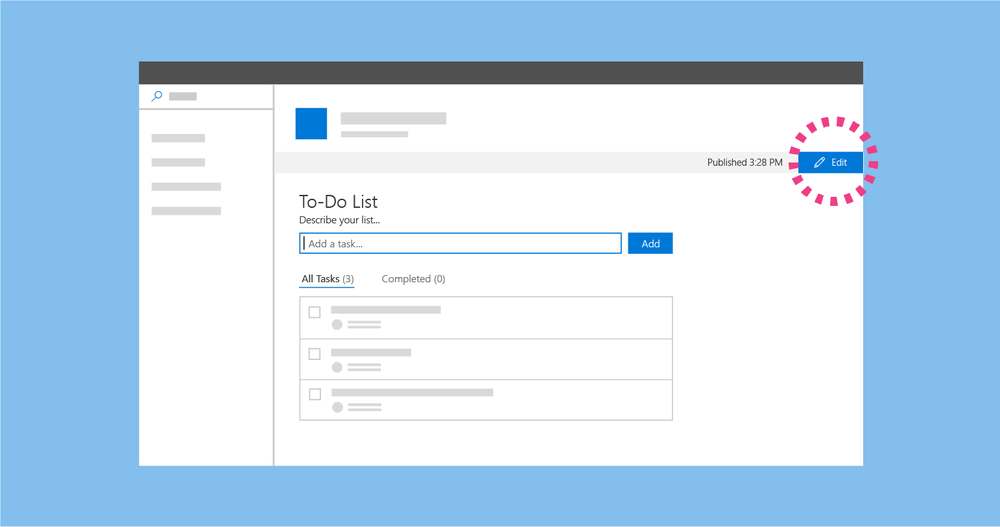

 

## Mobile view

All SharePoint pages are [responsive](grid-and-responsive-design.md) to allow the content of the page to be viewed on mobile devices. While designing a web part, it is important to understand how the new SharePoint site pages render across different devices.

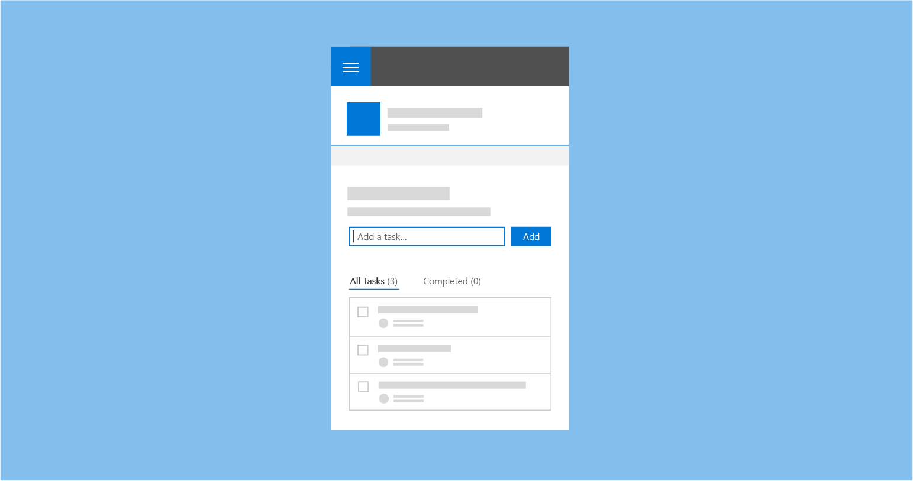

## See also

- [Designing great SharePoint experiences](design-guidance-overview.md)