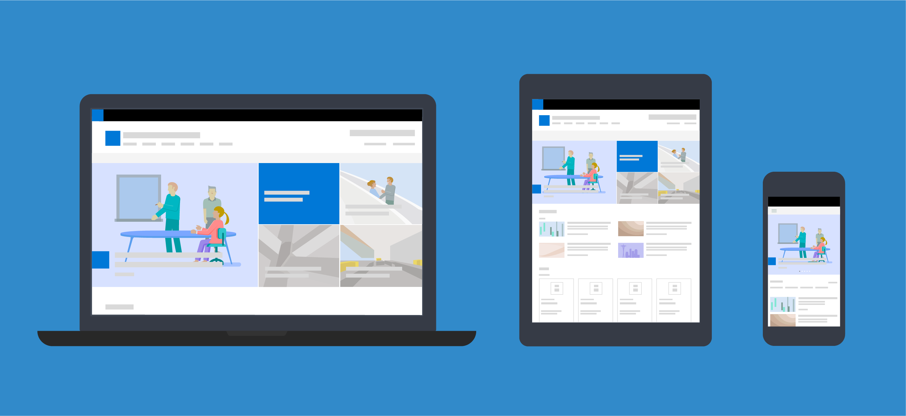

# Designing great SharePoint experiences

SharePoint is a platform that delivers content to more than 200,000 organizations and 190 million people worldwide. This SharePoint design guidance helps you create compelling SharePoint experiences and effectively communicate your brand and message to your audience. In addition, this guidance helps you better take advantage of the powerful tools in SharePoint while creating your own customized and optimized experiences. We welcome your feedback and input so that we can keep making improvements to this guidance.

<!-- Seems like you should tell them how you'd like to receive feedback - i.e. via issues in the repo? -->

## SharePoint design principles 

SharePoint builds on the design principles that shape the Office and Microsoft product families. These principles help the design stay true to our product goals and user needs.

### Optimistic and fast

SharePoint is encouraging, knowing people can achieve whatever they set their minds to when given the platform and the support they need. We're fast and agile, and we adjust our product experience based on feedback and input.

### Dynamic and alive

We thrive on the dynamism in the world and love the way that change can open new possibilities for people. We’re fearless about reinventing ourselves, continually changing for the better to meet the needs of the people and companies changing the world around us.

### Authentic and useful

Our passion is to help people achieve, and it has been for more than 30 years. We care about it in a way that no one else does. We understand the importance of our customers and make sure that SharePoint stays relevant and useful by staying authentic and true.

### Forward-thinking

We search for what’s possible beyond today’s way of getting things done. We’re energized by all that people are capable of achieving and seek to support and amplify it through our platform. We care about the needs of people not only today, but tomorrow—anticipating what and how they’ll want to achieve. So we build our technology around who they can be and what they can become.

### Accessible and optimized

Accessibility is developing an equal experience for all users that enables individuals to adjust their user experience to meet their unique visual, hearing, dexterity, cognitive, and speech needs. SharePoint believes strongly in providing accessible experiences for everyone, everywhere, and in optimizing our experiences to reflect the needs of all of our customers.

<!-- These seem like fairly high-level principles; it would be good to think about how to convey how these principles manifest in the design. Can you add a design example to each section that illustrate the principle? --> 

## See also

- [Overview of SharePoint Framework](../spfx/sharepoint-framework-overview.md)
