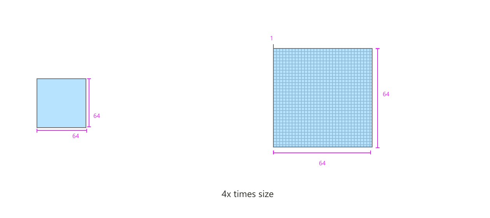

# Web part icons

Web Part icons are designed to be simple, representative, and symbolic. Every icon is reduced to a minimalistic style to represent the essential attribute. Icons will display in the toolbox within SharePoint pages and optionally in the store.

## Grid keyline shapes

Web parts cons are displayed at 32 x 32 px. Create icons at 100% to ensure pixels are accurate. 

## Layout

Icons should be designed inside of the 64 x 64 pixelcontainer area, to insure that the icons renders correctly.

## Shapes

Not all icons or logos are designed in a perfect square. Use this guide of basic shapes to understand how to unify different icon shapes within the grid and appear at a proportional size.

## Pixel clarity

Try to avoid any icon distortion by snapping your edges to the X and Y coordinates. Use whole numbers when possible. 

## Content Area 

The icon is the visual expression of your web part and its function. They can help communicate the core idea of your web part simply and boldly.

Web part icons can contain one color or full color. Most icons work best when using extremely simplified shapes, thin two-pixel lines similar to the Office UI Fabric icons. In some cases there may be a need to use a company brand icon or logo mark in full color. If there is a one color version of the icon available consider using this version first.

## Exporting your icons

Icons should be exported as SVGs. If they are one color cions they should be exported leveraging SVG extensions so they are theme dependent.  Icon dimensions are 64x64 px and should all have transparent backgrounds, also to ensure they are theme dependent. 

