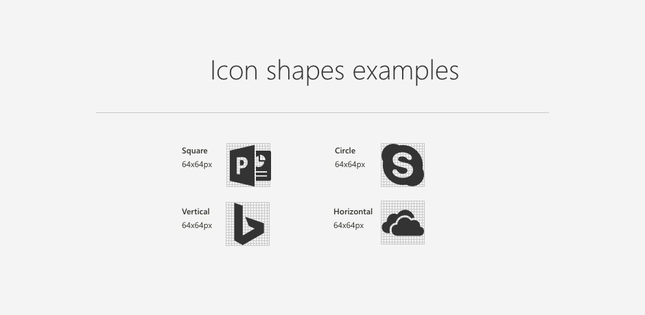
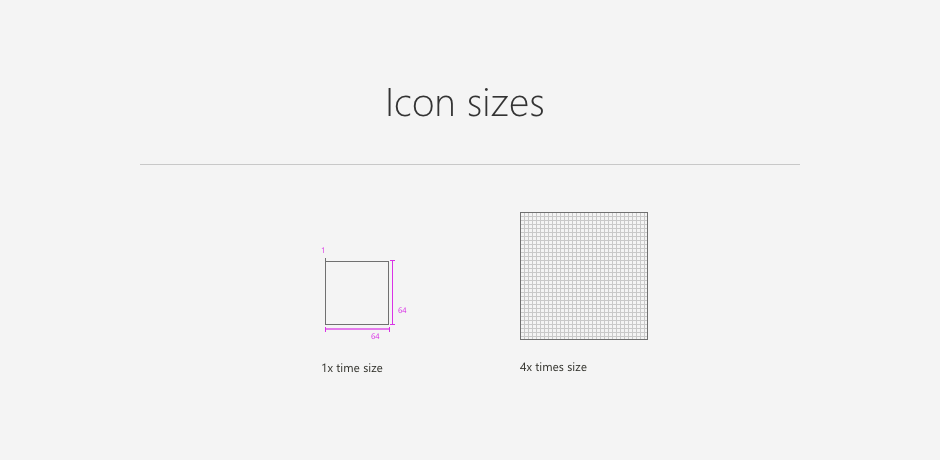
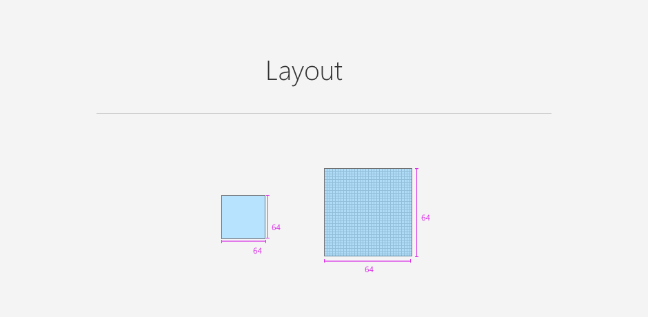
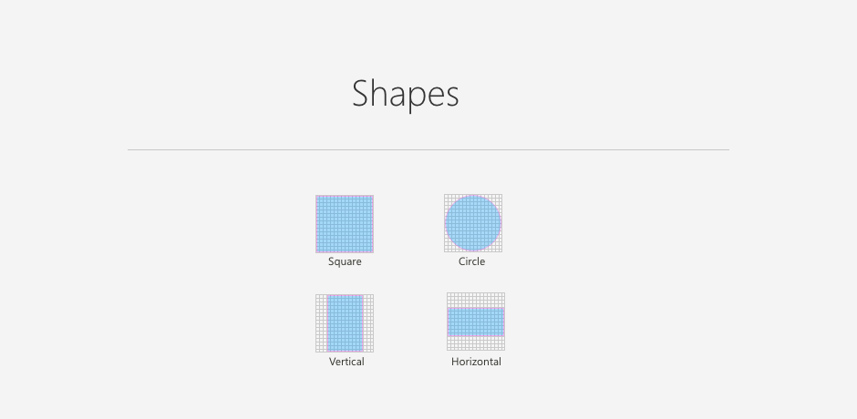
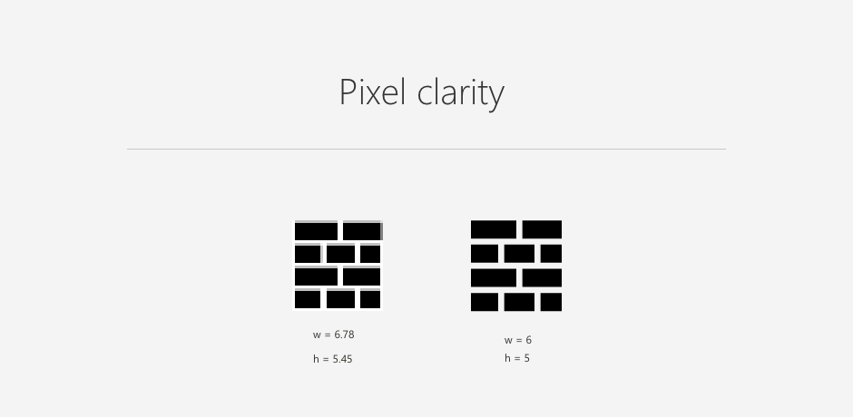
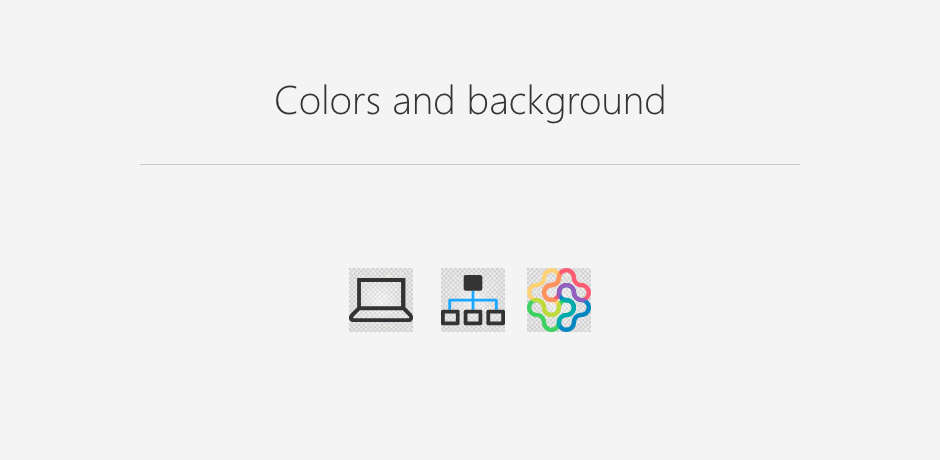

# Designing a SharePoint web part icon

Web part icons are designed to be simple, representative, and symbolic. Every icon is reduced to a minimalist style that represents the most essential attributes. Icons will display in the toolbox within SharePoint pages and optionally in the store. Examples of icon shapes are square, circle, veritical, and horizontal.

## Grid keyline shapes

Web part icons are displayed at 32x32 px but are designed at twice the size, or 64x64 px. Create icons at 100% to ensure that pixels are accurate. 

## Layout

Design icons within the 64x64 px container area. This ensures that the icon renders correctly. 

## Shapes

Not all icons or logos are designed in a perfect square. Use this guide of basic shapes to understand how to unify different icon shapes within the grid and have them appear at a proportional size. Make sure that the icon fills either the full width or full height of the grid, depending on its shape.

## Pixel clarity

Try to avoid any icon distortion by snapping your edges to the X and Y coordinates. Use whole numbers when possible. 

## Colors and backgrounds

The icon is the visual expression of your web part and its function. Icons can help communicate the core idea of your web part simply and boldly.

Web part icons can contain one color or be full color. Most icons work best when you use simplified shapes, thin two-pixel lines similar to the Office UI Fabric icons. In some cases, you might need to use a company brand icon or logo in full color. If a one-color version of the icon is available, consider using this version.

## Exporting your icons

Export icons as SVGs at 64x64 px with transparent backgrounds.

You can find the icon grid in the [SharePoint Design toolkit](https://developer.microsoft.com/en-us/fabric#/resources).

