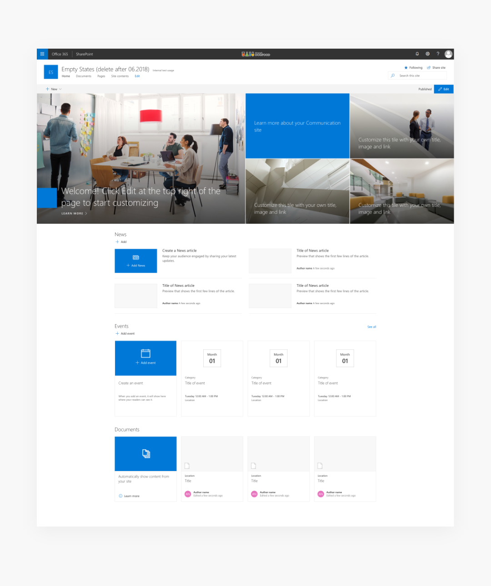
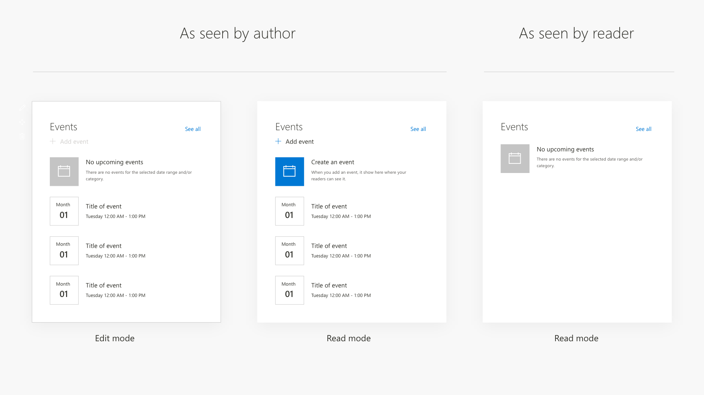
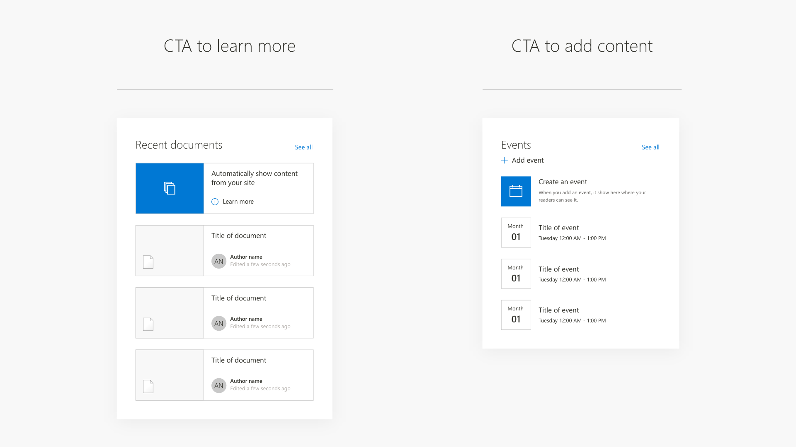
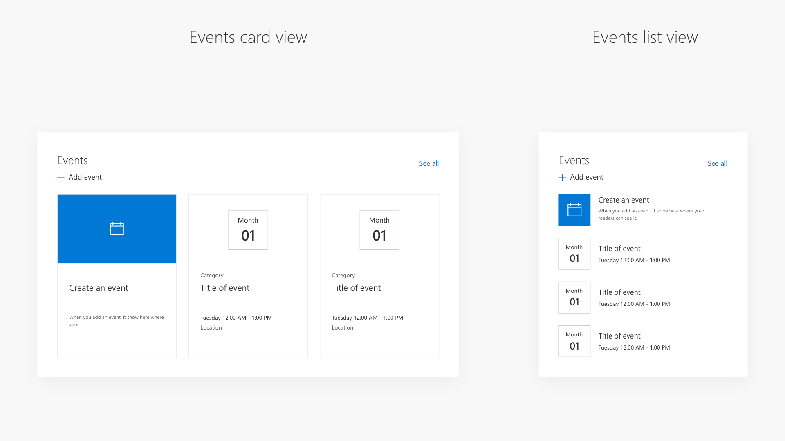
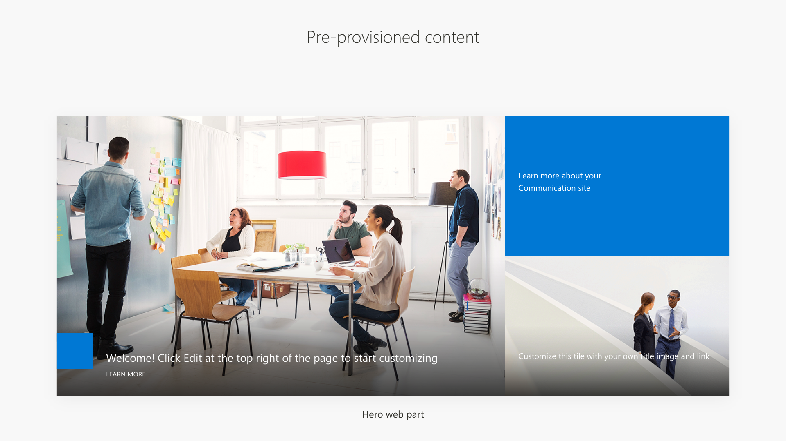

# Empty state of a web part

The empty state is a visual representation of a web part, pre-configured to a content source like a list or with placeholder content, such as images and text. For example, Highlighted content, Site activity, News, and Events web parts, have a content source set by default but no content to show for a newly created Communication site.

Example web parts featuring an empty state:

- Highlighted content
- News
- Site activity
- Events
- Hero
- Image gallery

Empty states are designed to convey the purpose, stucture and layout options of web parts before the web part is configured or content is added. The empty state is also a perfect way to illustrate the vertical rhythm and layout of a page which starts from a template. Empty states behave similar to fully configured web part, and reflow to accommodate available space and should support author-configured web part layouts. 

Empty states are different from placeholders in that the latter are meant to be displayed as a fallback when no content is added or to help the author configure the web part. [You can learn more on placeholders here.](https://docs.microsoft.com/en-us/sharepoint/dev/design/placeholders-and-fallbacks)

# Empty state and editing rights

Web parts with empty states can change interaction options and display text depending on the permission level and mode of the page. In the example below (left to right), there is empty state of Events web part when viewed by a person with editing rights in the edit mode and in the read mode. The last image shows a simplified empty state view for page readers with no editing rights with a messege appropoiate to thier permission level. 

Layout options for Events web part in empty state

# Interactions with an empty state

Empty states are designed primarily for people with editing rights and change interaction options based on the current page mode. Authors can manually add content to web parts in the read mode, such as adding a new event or new news post. The example below shows an empty state with multiple items, stacked vertically, where the first item acts as a CTA to learn more or create an event.

# Empty state with pre-provisioned content

The Hero web part is an example of an empty state with pre-provisioned content and text. The empty state is designed to help authors understand the options and the layout capabilites of the web part. The empty state in this case is a visual template for the web part.

