# SharePoint grid and responsive design
 
Responsive experiences seamlessly scale across devices to better display your content on a range of different screen sizes. Responsive design also eliminates the need to build multiple versions of your site pages to support different devices.  

The design guidance for responsive pages in the SharePoint authoring environment incorporates a responsive grid system that is based on [Office UI Fabric](https://developer.microsoft.com/en-us/fabric). This article describes the underlying page grid system and the breakpoints, or key screen sizes where the layout of the pages will change. 

## Page type grids 

Each page type in the SharePoint authoring experience can have its own rules for how it applies the Fabric responsive grid. This is to ensure that each page looks great, regardless of what device it's designed for, and that the experience is optimized for that environment. The basic grid in the SharePoint desktop experiences is a 12-column structure. The number of columns and gutter width adjust based on the screen width. 

The following sections show the basic grid structure applied across different types of SharePoint pages, to help you better understand how the grid adjusts to support the experience and device needs.

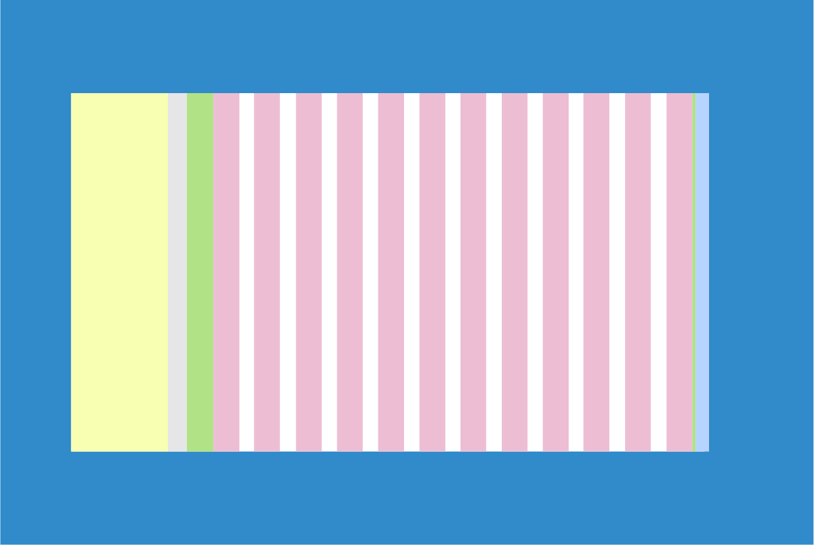

 

### Team sites

The content area for a team site is locked to the left. Team sites have a left navigation; therefore, the space that web parts occupy on the grid and the reflow behavior respects the space given to the navigation. The max width of the content area of a Team site is 1204 px and the minimum size is 320 px for mobile support.

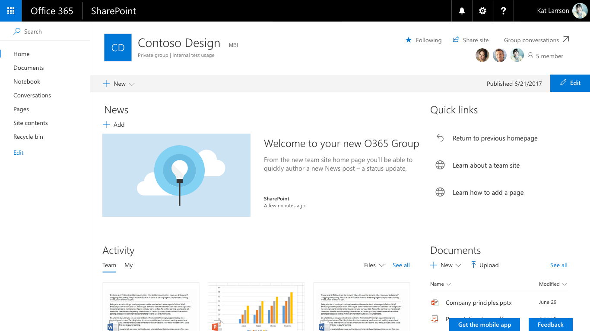

 

The following examples show how the grid adjusts between key breakpoints on a team site.

#### Small 320 x 568
The small size has a single centered column area, with 20 px margins left and right.

 

#### Medium 480 x 854
The medium size has 12 columns, with 16 px gutters.

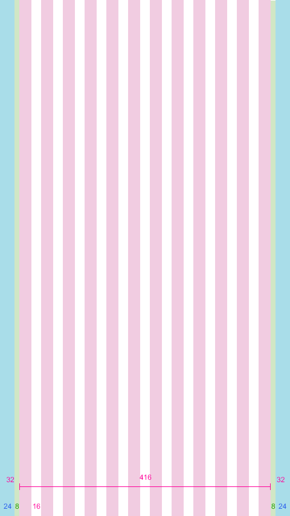

 

#### Large 640 x 1024
The large size has 12 columns, with 24 px gutters.

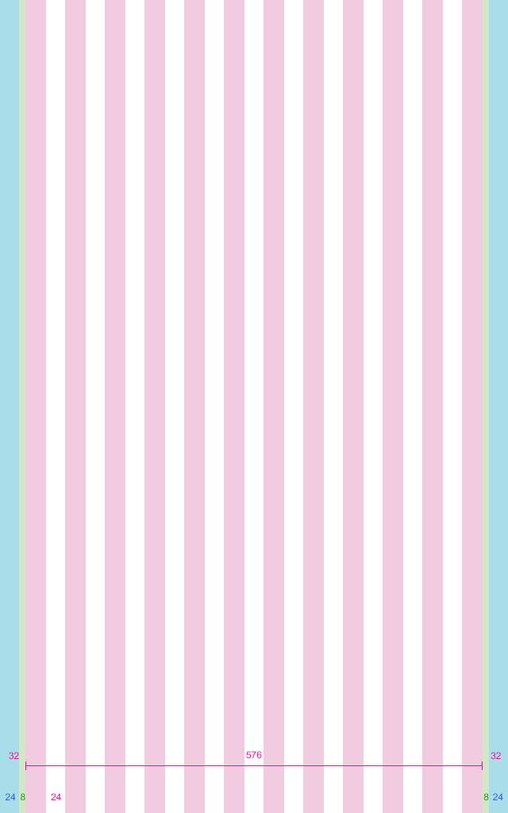

 

#### XL 1024 x 768
The XL size has 12 columns, with 24 px gutters.

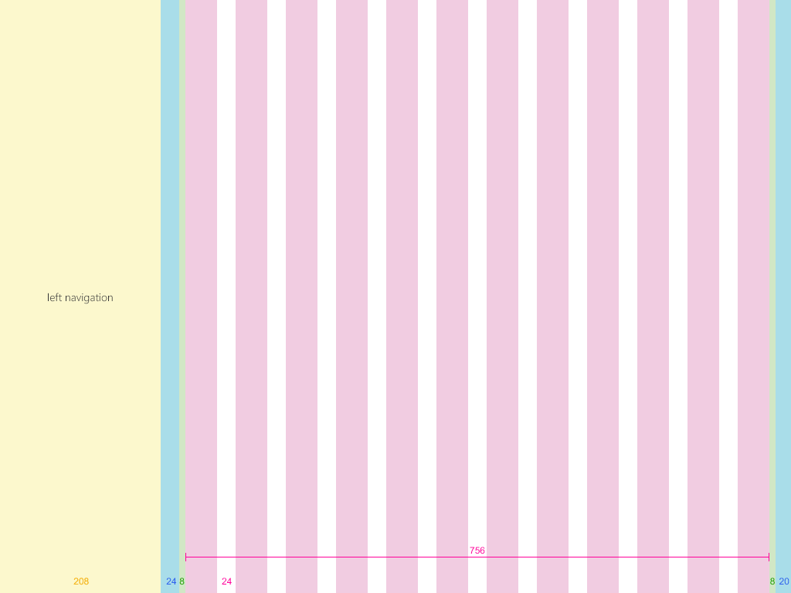

 

#### XXL 1366 x 768
The XXL size has 12 columns, with 32 px gutters.

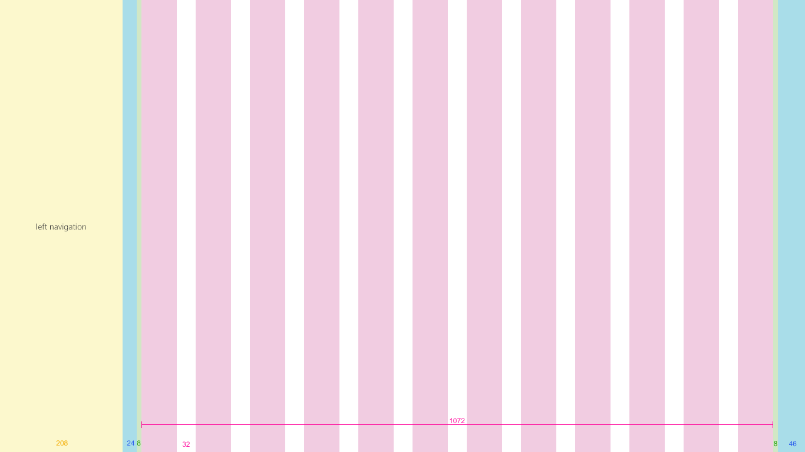

 

#### XXXL 1920 x 1080
The XXXL size has 12 columns, with 32 px gutters.

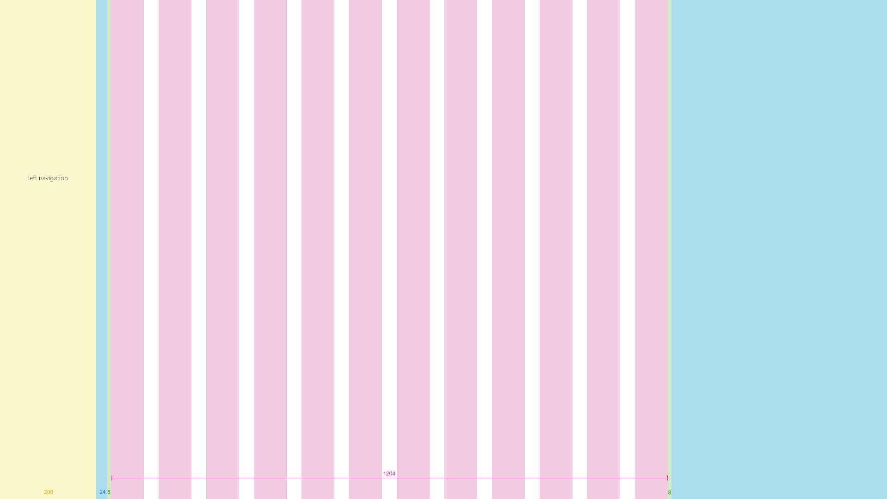

 

#### Team site multicolumn pages and web parts
Web parts scale horizontally depending on the page layout. The following example shows how the size of a web part adjusts to accommodate the left navigation.

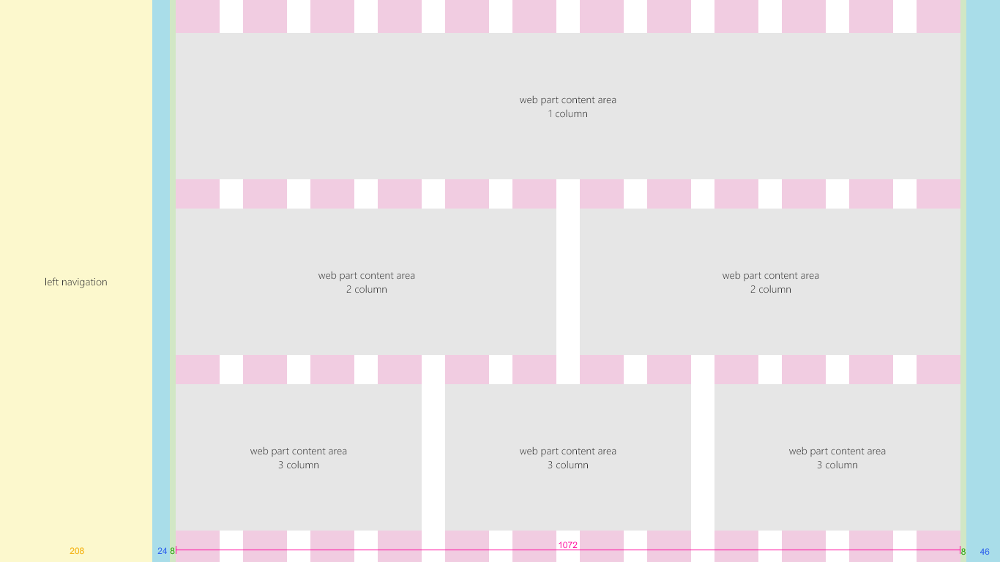

### Communication sites

Communication sites have a top navigation and a centered content area. The maximum width of the content area of a communication site is 1204 px, and the minimum size is 320 px for mobile support.

 

The following examples show how the grid adjusts between key breakpoints on a communication site.

#### Small 320 x 568
The small size has a single centered column area, with 20 px margins left and right.

 

#### Medium 480 x 854
The medium size has 12 columns, with 16 px gutters.

 

#### Large 640 x 1024
The large size has 12 columns, with 24 px gutters.

 

#### XL 1024 x 768
The XL size has 12 columns, with 24 px gutters.

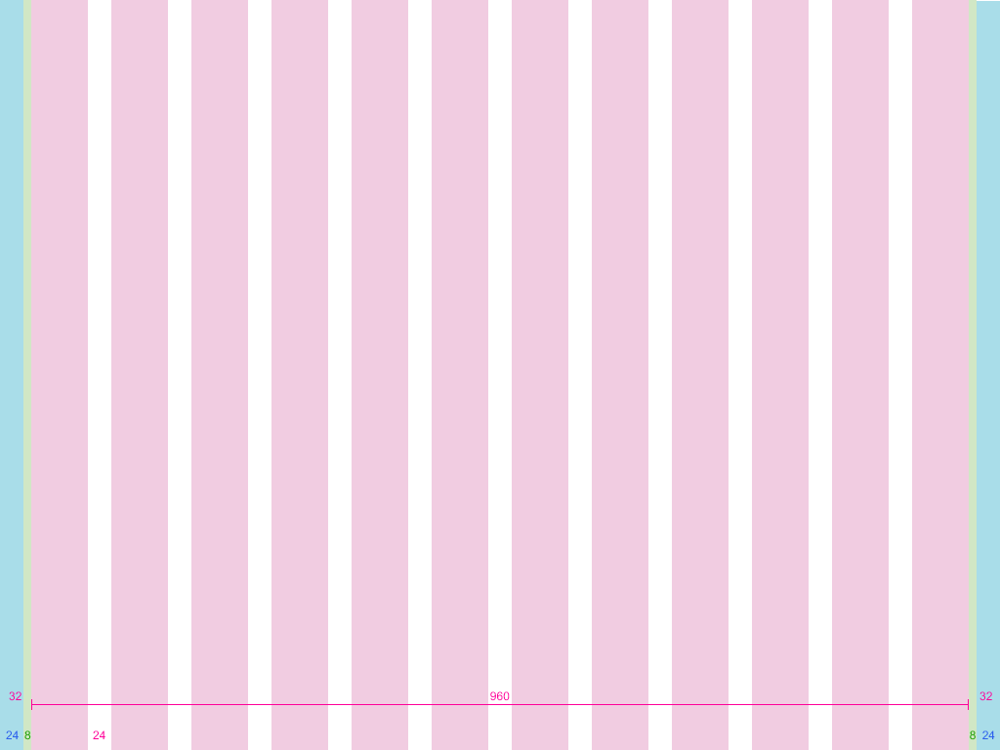

 

#### XXL 1366 x 768
The XXL size has 12 columns, with 32 px gutters.

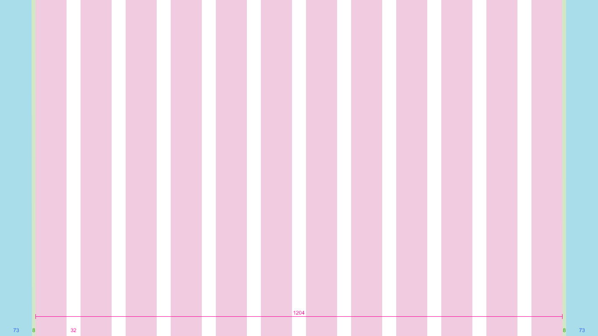

 

#### XXXL 1920 x 1080
The XXXL size has 12 columns, with 32 px gutters.

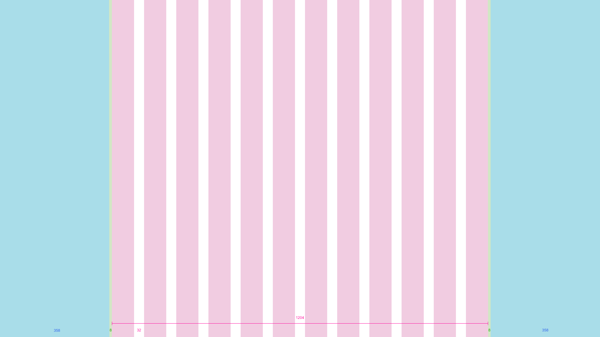

 

#### Communication site multicolumn pages and web parts
Web parts scale horizontally depending on the page layout. This example shows a communication site and web parts for single to three column layouts.

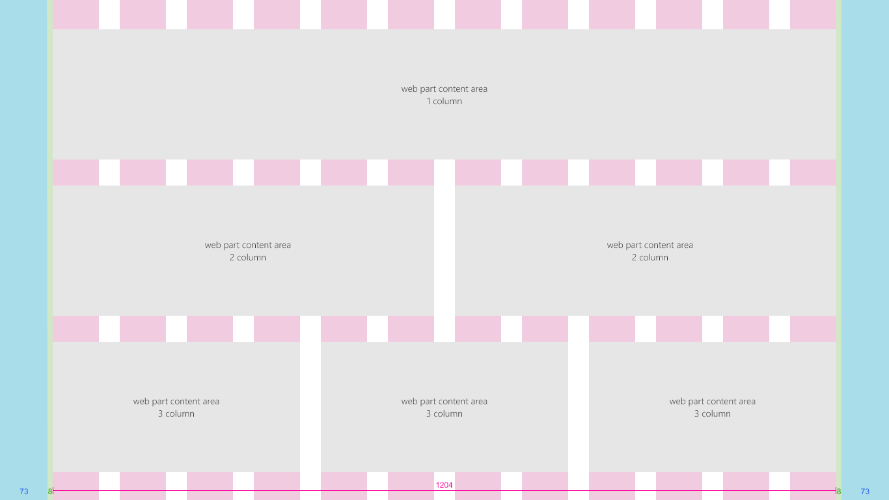

## Breakpoints 

To create a smooth flowing experience between screen sizes, the SharePoint UI should adapt layouts for the following breakpoint widths: 

- 320 px
- 1024 px
- 1366 px
- 1920 px
 
Within these breakpoints, you should take into consideration how your content shifts when the viewport size becomes optimized for the nearest breakpoint. Note that this diagram is for illustration only and is not pixel accurate.

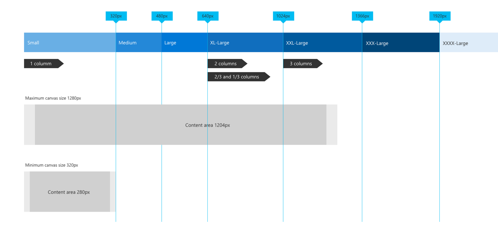

 

The responsive grid for both team sites and communication sites adjusts when going from large breakpoints to mobile breakpoints. This optimizes the site for the device and screen size. The following table describes the grid sizes at various breakpoints based on popular device sizes.

| Window width | Device                  | Breakpoint | Columns | Gutter | Max columns per section |
|:-------------|:------------------------|:-----------|:-------:|:------:|:-----------------------:|
| 320          | iPhone 5/SE,320x568     | Small      | 1       | N/A    | 1                       |
| 480          | 6" device               | Medium     | 1       | N/A    | 1                       |
| 640          | 8" device               | Large      | 12      | 16     | 2                       |
| 768          | iPad portrait 768x1024  | Large      | 12      | 24     | 2                       |
| 1024         | iPad landscape 1024x768 | X-Large    | 12      | 24     | 3                       |
| 1368         | Surface Pro 3 1368x912  | XX-Large   | 12      | 32     | 3                       |
| 1440         | Surface Pro 4 1440x960  | XX-Large   | 12      | 32     | 3                       |
| 1600         | Web 1600x900            | XX-Large   | 12      | 32     | 3                       |
| 1920         | Web 1920x1080           | XXX-Large  | 12      | 32     | 3                       |

 

## See also

- [Design toolkit and assets](https://developer.microsoft.com/en-us/fabric#/resources)
- [Designing great SharePoint experiences](design-guidance-overview.md)

