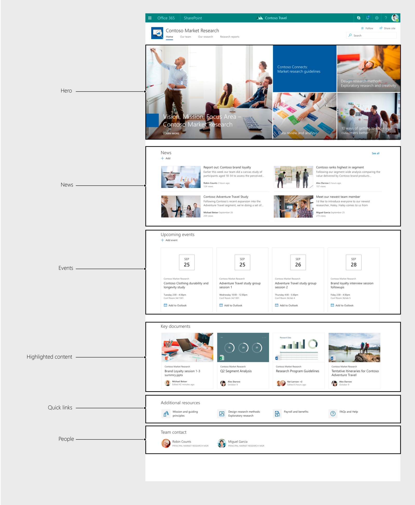
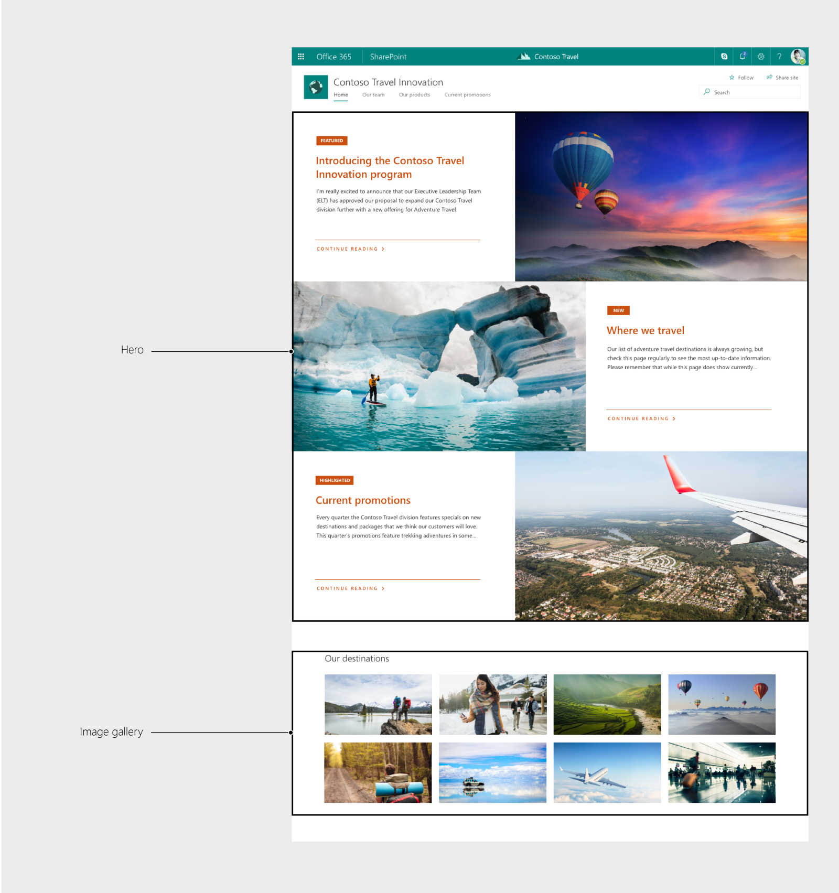
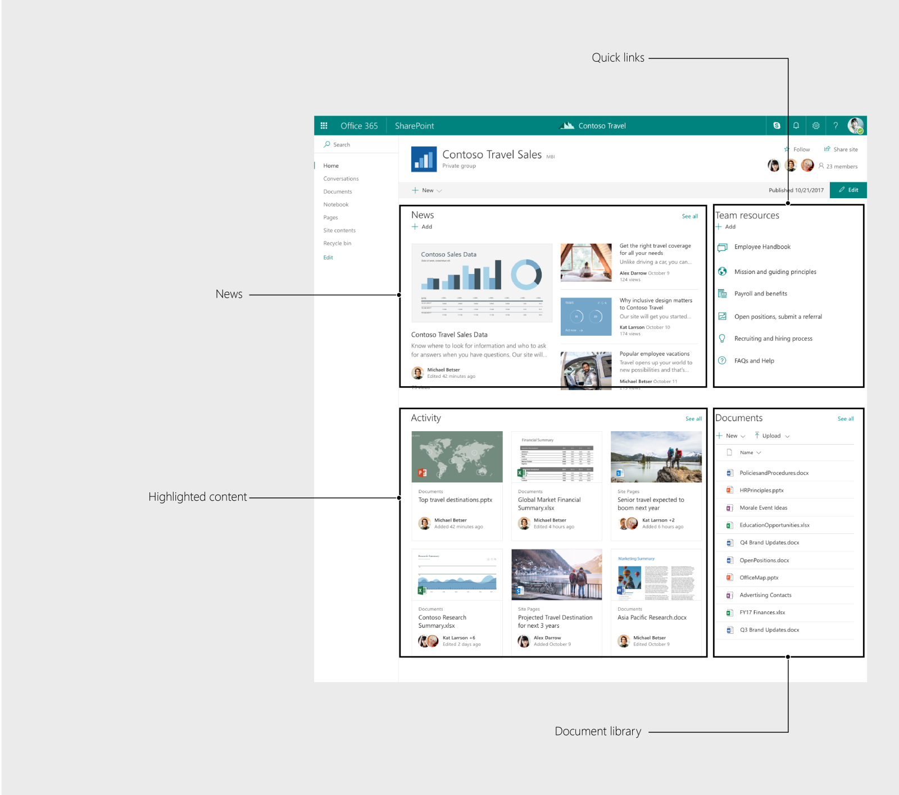

# Key web part examples

Web parts are the building blocks of your page. 

This is a visual overview of Communication site and Team site templates, highlighting how web parts work together to create a coherent overall design. Use these pages as reference when designing a SharePoint web part. It is important to consider how the web part will look and function when sitting next to other web parts on a page. Follow the patterns in this documentation and on the [Office UI Fabric site](https://developer.microsoft.com/en-us/fabric) to ensure consistency in layout and grid alignment, font size and hierarchy, commanding, empty states and more.

# Communication sites

The Topic design is used when you have a lot of information to share, such as news, events, report and other content. It is built from the Hero, News, Events, Highlighted content, Quick links and People web parts.

 

The Showcase design is used to feature a product, team or event. It is leverages the Hero and Image gallery web parts to show rich visual content.

 

# Team sites

The Team site design is the default layout for any new team. It features the News, Quick links, Highlighted content and Document library web parts.
 

These example site and web part designs have been added to the SharePoint toolkit and can be used as reference when designing web parts.
[SharePoint toolkit](https://developer.microsoft.com/en-us/fabric#/resources)
