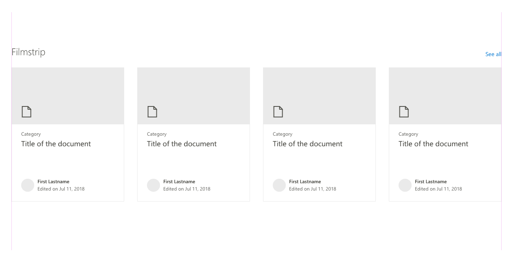
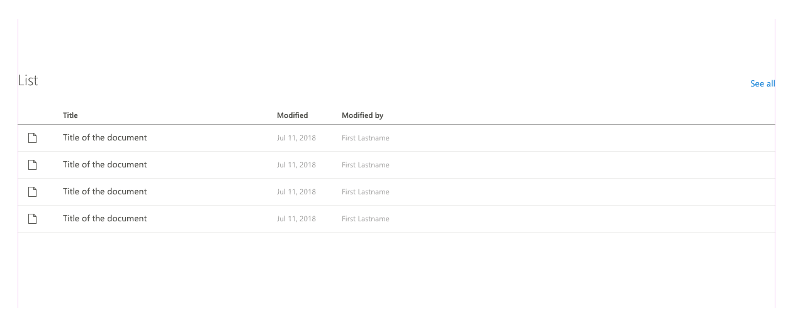

# SharPoint web part layouts

SharePoint uses a number of different layout types for web parts. The most common are grid, list, filmstrip, carousel, and compact. Each one of these five layouts serves a different purpose, depending on the layout, breakpoints, and content density of a page. 

When selecting a layout that works best for your web part, consider the type of content you are displaying. Is it highly visual or rich in text and data? Determine how much space is needed on the page for enough content to be displayed. Consider shortening long descriptions to optimize for displaying more itmes to the user. Remember that you can use the [property pane](reactive-and-nonreactive-web-parts.md) to let authors have control over how much content is displayed.

## Grid and filmstrip

Grid and filmstrip layouts are similar. They both use cards to showcase content. However, other rectangular content also works well in these layouts, such as images. The main difference between the two layouts is how they reflow based on varioius screen sizes or breakpoints.

### Grid layout

The grid reflows in rows and columns from top to bottom and can contain a few to many items at a time.

### Filmstrip layout

The filmstrip displays multiple items in a single row and caoursels to a new set of items.

## List

The list layout is useful for displaying a large amount of information in a compact way. When resized, the less important columns will be hidden as the page width gets smaller.

## Carousel

If you want to showcase content featuring attractive visuals, choose the carousel layout. This layout is designed to display visual content such as images or PowerPoint files in a one-by-one item carousel.

## Compact

The compact layout is designed to show content in a smaller format and works the best in a one-third column. This layout can support a small image or icon and a few rows of text for a title, description, and/or metadata.

## See also

- [SharePoint grid and responsive design](grid-and-responsive-design.md)
- [Designing great SharePoint experiences](design-guidance-overview.md)
