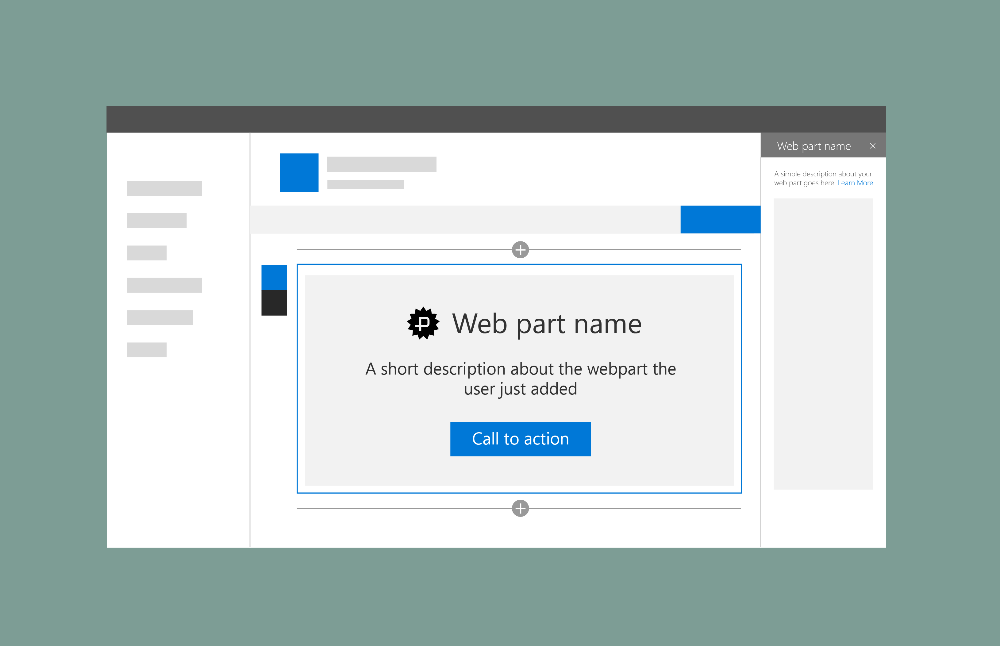

# Placeholders and fallbacks in SharePoint web parts

You can add placeholders to SharePoint web parts that can also be used as a fallback if an issue occurs loading content or data for a web part. The web part name and description are automatically added from the metadata submitted with the web part. You an add a button that  users can select to return to a state where they can configure the web part.

