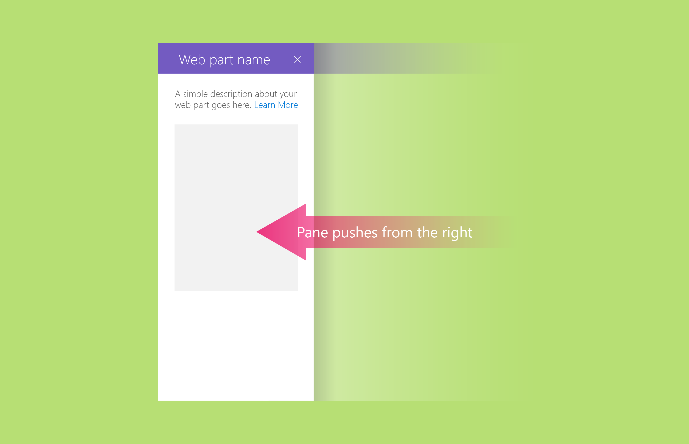
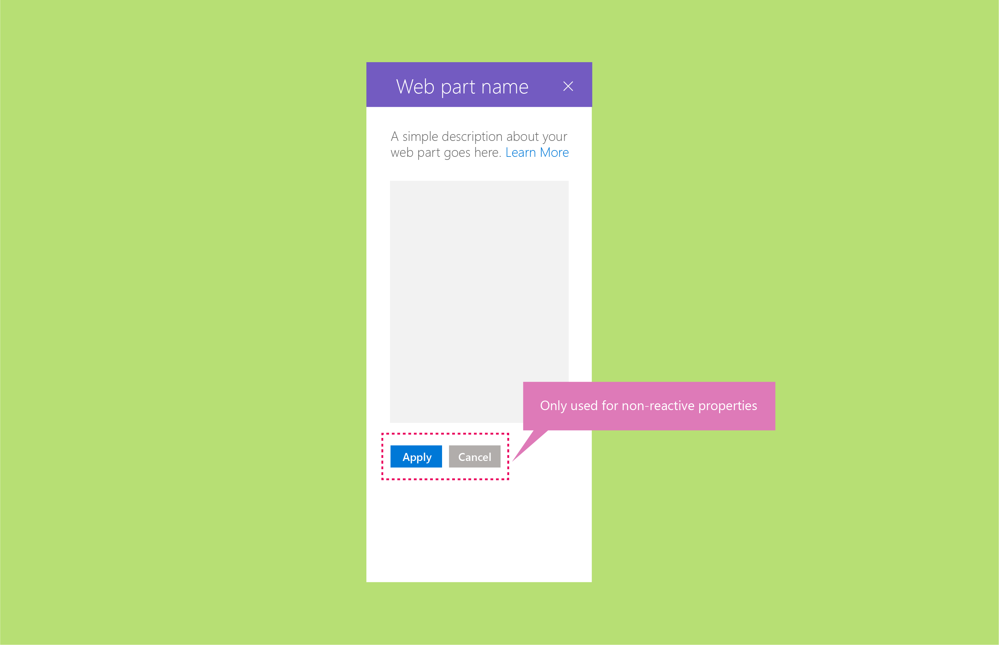
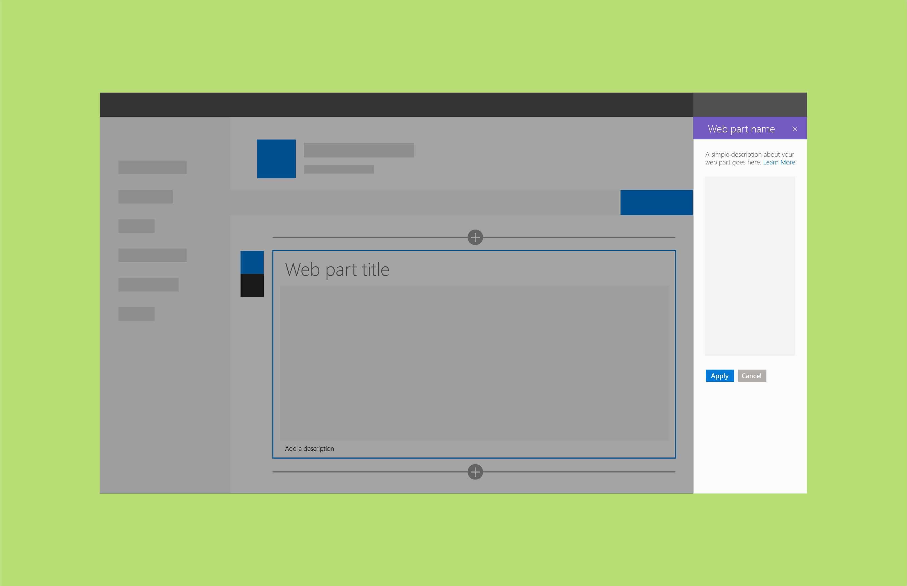
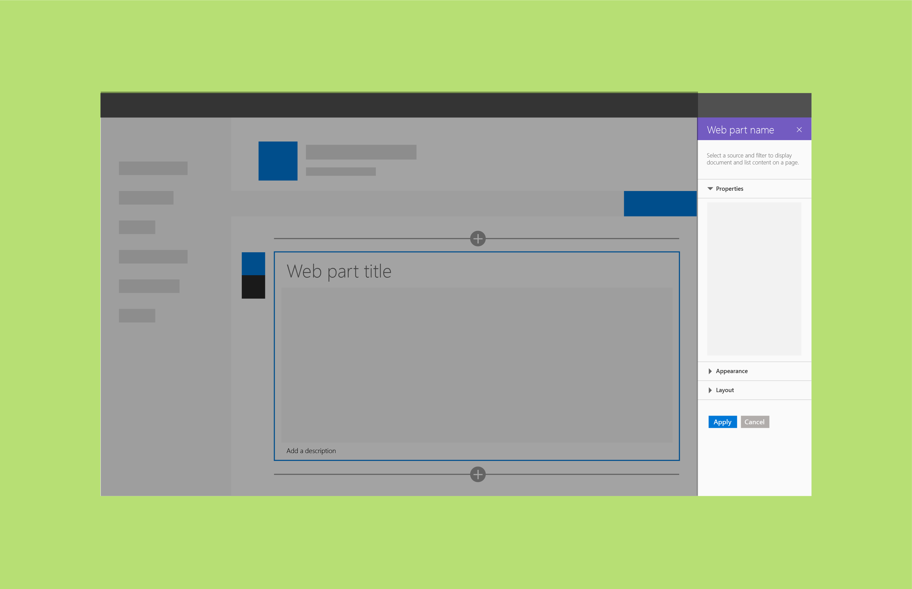
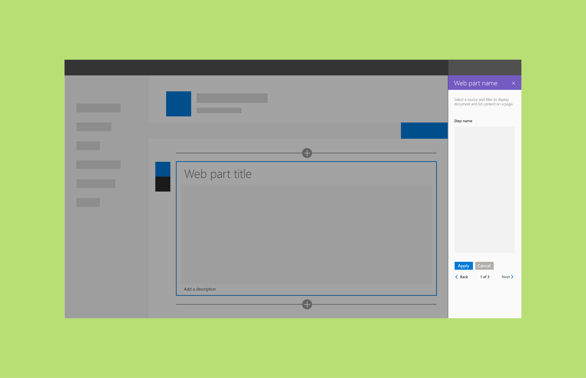

# Reactive and nonreactive SharePoint web parts

Reactive web parts are client-side only; nonreactive web parts have elements that require a server to operate. We recommend that you build your SharePoint web parts to be reactive, because that best fits the UX model and WYSIWYG principles for authoring. However, it might not be possible or cost-effective in all cases to build reactive web parts.

## Reactive web parts

Reactive web parts are fully client-side web parts. This means that each component configured in the property pane reflects the change made within the web part on the page. For example, for the To-Do List web part, unchecking “Completed Tasks” hides this view in the web part.

## Nonreactive web parts
Nonreactive web parts are not fully client-side; generally, one or more properties need to make a call to set/pull or store data on a server. For nonreactive web parts, you should enable the **Apply** button at the bottom of the property pane.

You can also customize the **Apply** button to be a more specific action. <!-- Is this a reference to an image? (design-wp-pp-non-reactive.png) -->

 

The following examples show nonreactive web parts in the context of the [three property pane structures](design-a-web-part.md).

**Single pane example**

 

**Accordion groups example**

 

**Steps pane example**

## See also

- [Designing great SharePoint experiences](design-guidance-overview.md)
