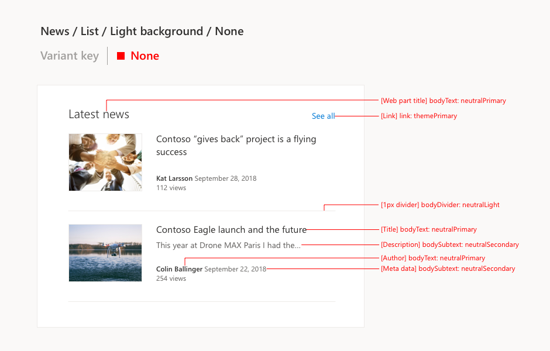
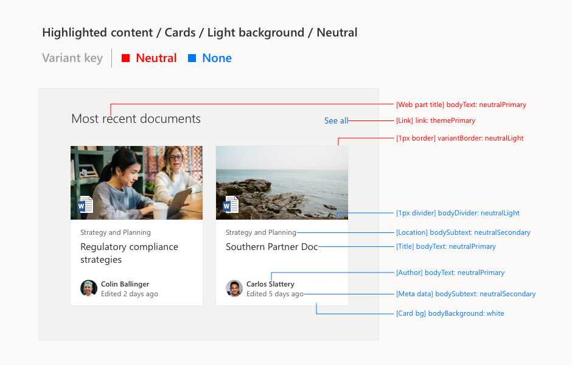

# Overview

When designing web parts for section backgrounds, you can use Fabric’s semantic slot system to guarantee accessibility and to enforce consistency across SharePoint sites. Semantic slots target customizations of specific page elements in order to align color usage and interaction patterns. They also allow you the flexibility to add assign multiple palette colors for your components to look great on all section backgrounds. This article will give you background on the concept of semantic slots and how to incorporate them into your web part designs. Before getting started, you should be familiar with [how to design a SharePoint web part](https://docs.microsoft.com/en-us/sharepoint/dev/design/design-a-web-part) in order to understand the basic structure of web parts. You should also be familiar with [themes and colors in SharePoint](https://docs.microsoft.com/en-us/sharepoint/dev/design/themes-colors).

## Section background

Section background is a feature that allows a SharePoint site administrator to apply a background color to a canvas section on a modern page. There are four background color options for light and dark themes: None, Neutral, Soft, Strong. Section backgrounds are defined by a Fabric palette color from a site's theme. With the introduction of the section background feature, semantic slots allow page elements to be accessible on various themes and section backgrounds.

## Variant vs. Section background

While reading Fabric theming documentation, you may have come across the terms "variant" and "section background.”
Variant is the Fabric word for themes generated from an existing theme (as opposed to a theme generated from raw colors). A variant will share the same set of colors as the original theme it was generated from, but will apply those colors differently. See [Fabric variant documentation](https://github.com/OfficeDev/office-ui-fabric-react/blob/master/packages/variants/README.md) for more detail.

Background is the SharePoint term for the feature which allows the user to apply a Fabric variant theme to a canvas section.

Both concepts share "Neutral", "Soft", and "Strong" options. You may talk about a "strong background" or a "strong variant" depending on who you're talking to. Background and variant are often used interchangeably, but the most useful thing to remember is that background will make sense to designers, while variant will make sense to Fabric developers.

## Semantic slots

A semantic slot is a theming slot that targets specific page elements. A Fabric palette color can be assigned to a specific page element without affecting other page elements using the same palette color. When designing for section backgrounds, you can assign a semantic slot a different Fabric color for each variant. A semantic slot can have up to eight different values to adapt to each section background option. This helps deliver consistent design patterns throughout various themes and section backgrounds.

For example, default text uses the "bodyText" semantic slot. On the None, Neutral, and Soft section backgrounds, bodyText is assigned neutralPrimary. On the Strong section background, the palette color of bodyText changes to white. Semantic slots can be assigned palette colors for all variants in dark themes as well.

In the table below, you can see all eight palette colors defined for the bodyText slot. 
  
<table>
<tr>
<td> </td>
<td> Light themes</td>
<td> Dark themes</td>
</tr>
<tr>
<td>None</td>
<td>neutralPrimary #333333</td>
<td>neutralPrimary #ffffff</td>
</tr>
<tr>
<td>Neutral</td>
<td style="background-color:red">neutralPrimary #333333</td>
<td>neutralPrimary #ffffff</td>
</tr>
<tr>
<td>Soft</td>
<td>neutralPrimary #333333</td>
<td>neutralPrimary #ffffff</td>
</tr>
<tr>
<td>Strong</td>
<td>white #ffffff</td>
<td>white #1f1f1f</td>
</tr>
</table>
 

! Note
The current semantic slot list is defined by commonly used design patterns in SharePoint. We want to avoid creating case-specific semantic slots. When designing a new web part, consider aligning to an existing design pattern. Fabric's policy is that semantic slots may never be removed from the list, so any additions are permanent.

## Identifying semantic slots in your designs

Semantic slots should be assigned based on the function of a page element. The name of a semantic slot can quickly tell you how it’s meant to be used. You can find all existing semantic slots and their use case examples in the [Fabric semantic colors documentation](https://github.com/OfficeDev/office-ui-fabric-react/blob/master/packages/styling/src/interfaces/ISemanticColors.ts).

Fabric palette colors should be referenced from your site theme’s color ramp. If your site is using a SharePoint out of the box theme, you can reference [SharePoint theme color ramps](https://fluentfabric.azurewebsites.net/#/color/products). If your site is using a custom theme, you can generate a unique color ramp using the [Fabric theme generator](https://developer.microsoft.com/en-us/fabric#/styles/themegenerator).

In this example, the semantic slots are referencing palette colors from the None variant. The palette color may change depending on which variant you are using. Typically the variant should correspond with the value of bodyBackground. For example, if the bodyBackground value is "neutralLighter,” your slots should pick up values from the Neutral variant. Fabric palette colors for each variant should correspond with the palette colors listed in the Fabric theme documentation. It is important to include the palette color the page element should be picking up in order to properly communicate your design to a developer.

## Web part designs with multiple variants

There are instances in which a web part design will use multiple variants. The most common design pattern that uses multiple variants is the card layout. In your designs, you should differentiate which page elements correspond to which variant.

In this example, all semantic slot redlines in blue are using palette colors defined by the None variant since they sit on the card background. All other content that isn’t on a card uses palette colors from the Neutral variant.
