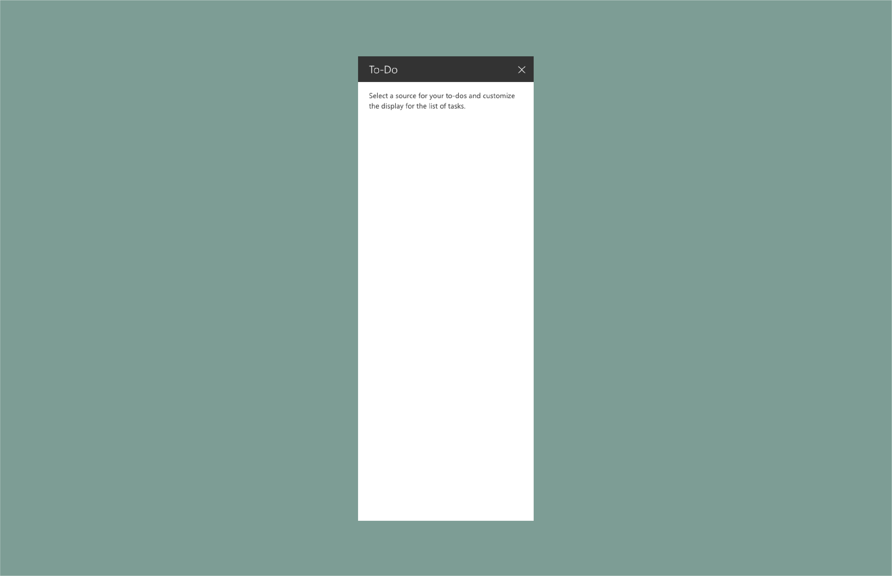
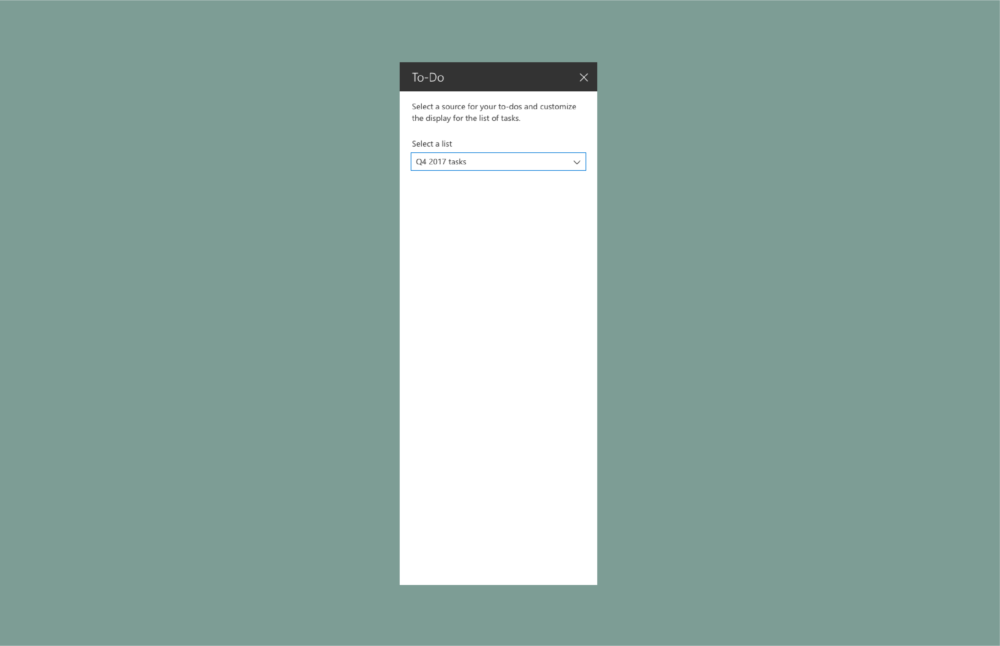
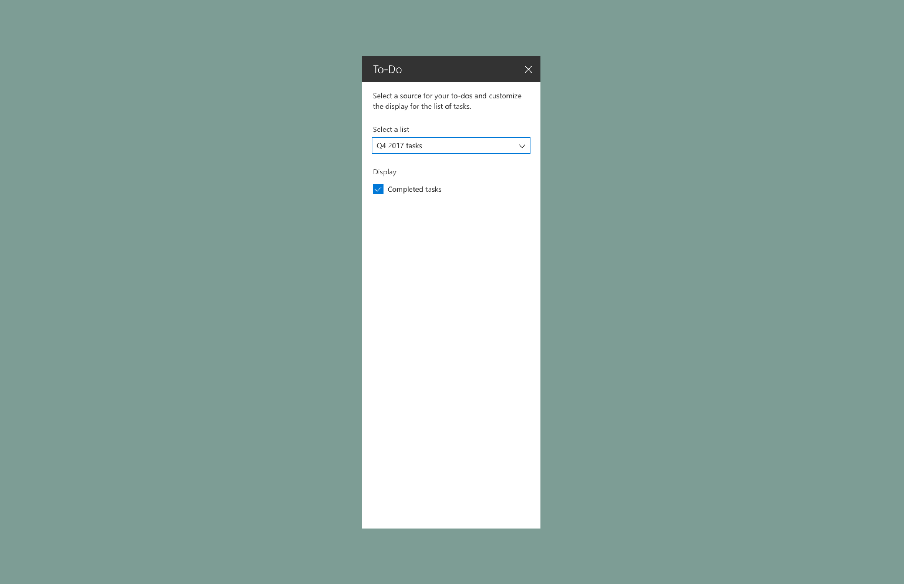
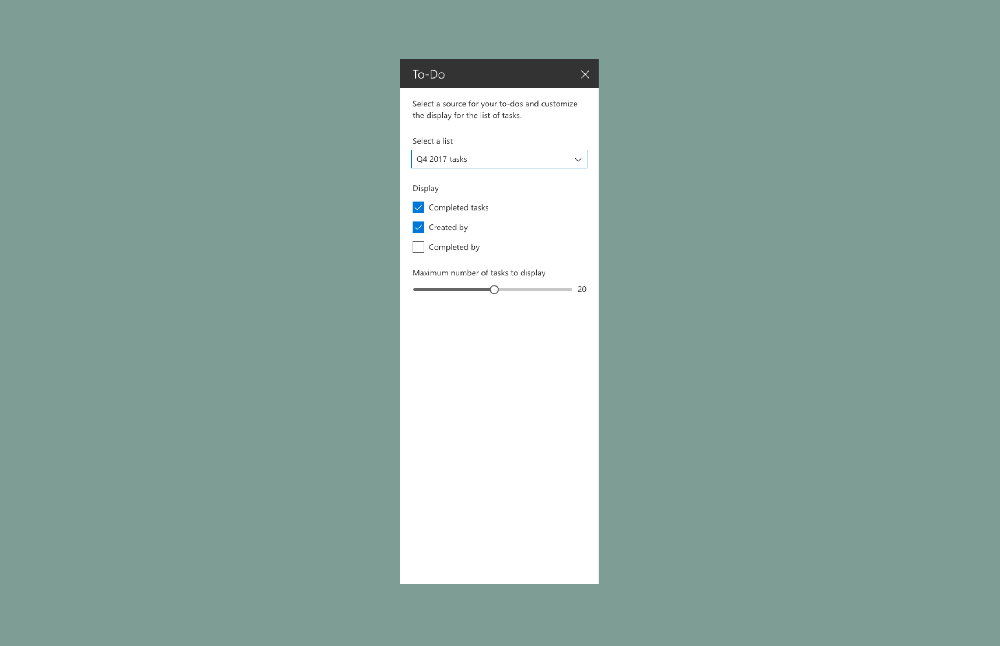
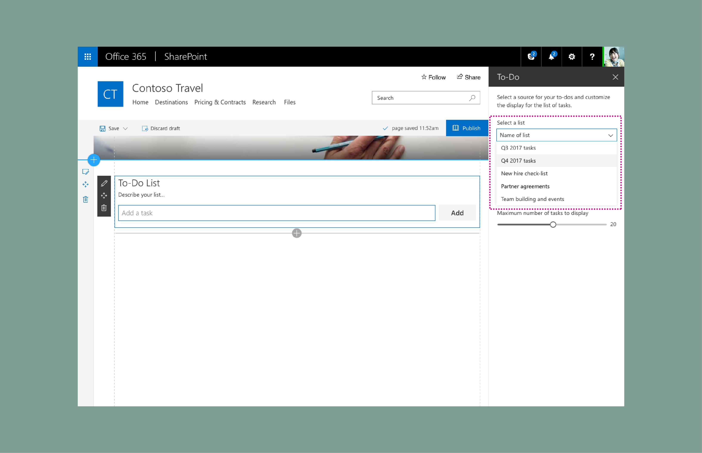
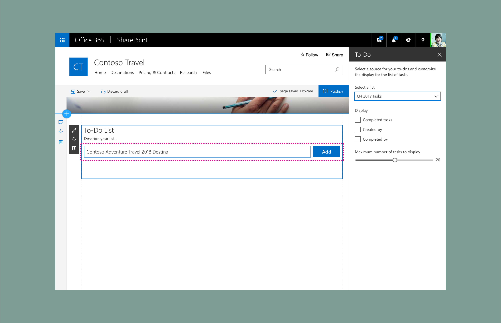
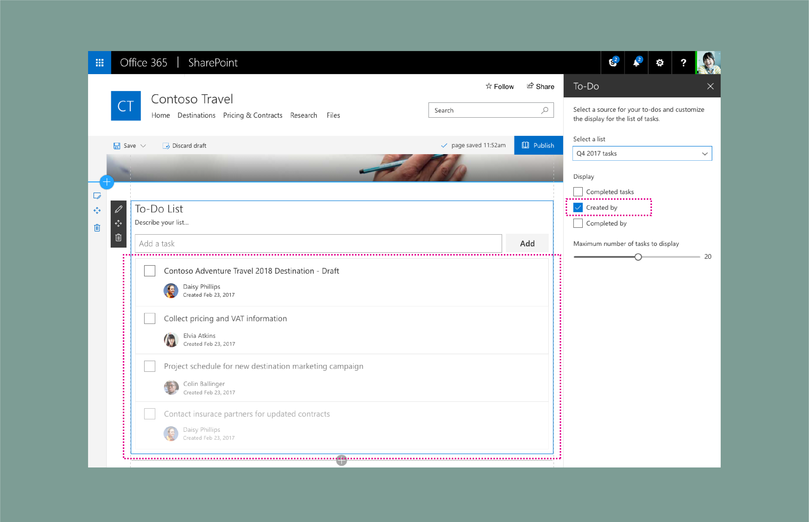
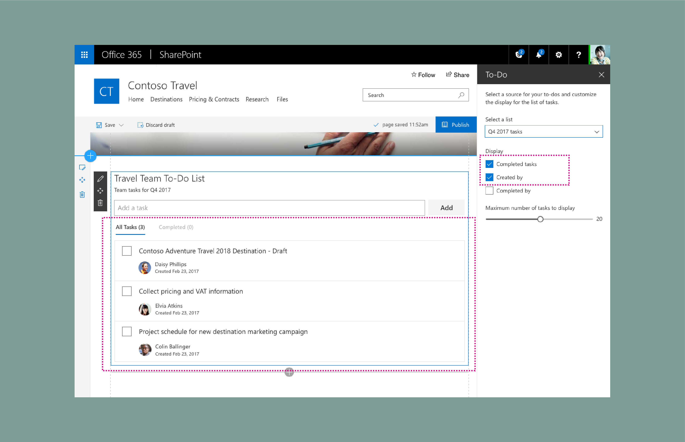
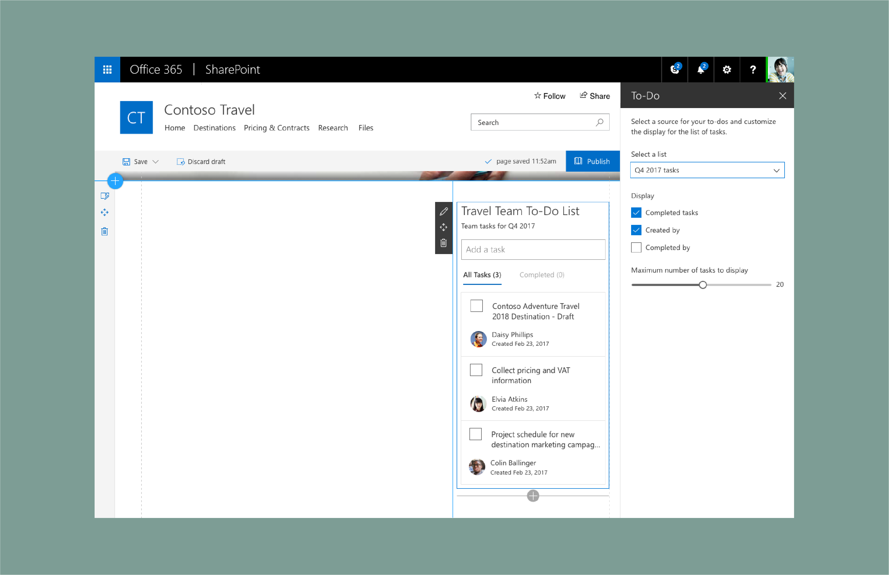
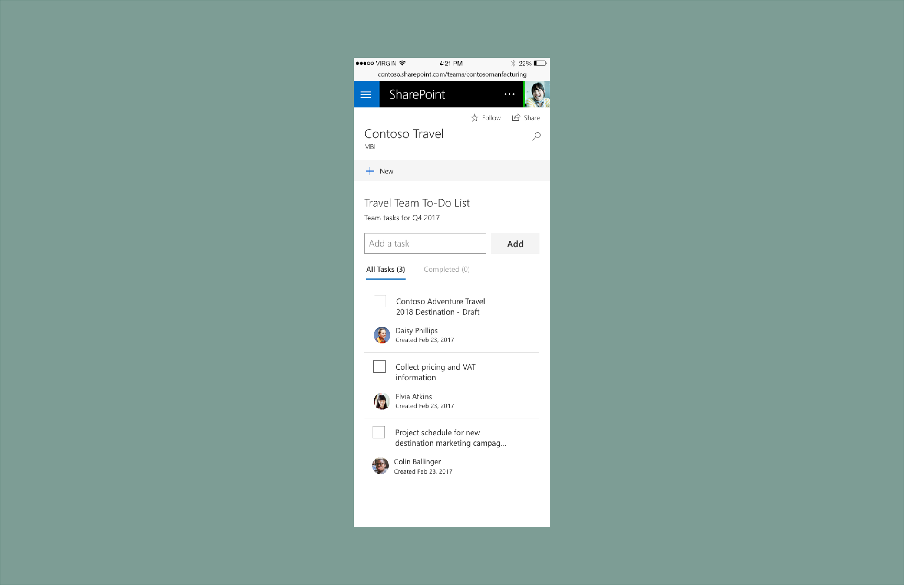

# SharePoint web part design showcase: Create a To-Do list property pane

This article describes how to create a To-Do list web part. This example uses the single pane [property pane type](design-a-web-part.md) and is [reactive](reactive-and-nonreactive-web-parts.md) and based on the [Office UI Fabric](https://developer.microsoft.com/en-us/fabric) responsive grid.

## Create a To-Do list web part

1. Add a description to help users understand more about the web part and its properties.

	In this example, the description is "Select a source for your to-dos and customize the display for the list of tasks."
	
	

	 

2. Add a Fabric [drop-down component](https://developer.microsoft.com/en-us/fabric#/components/dropdown) connected to a list.

	

	 

3. Add a Fabric [checkbox component](https://developer.microsoft.com/en-us/fabric#/components/checkbox) to display completed tasks.

	

	 

4. Add two more check boxes to control display options.

	

	 

5. Add a Fabric [slider](https://developer.microsoft.com/en-us/fabric#/components/slider) for the maximum number of items to display.

	

	 

6. Next, the author of the page selects a list or manually adds tasks to prepopulate the To-Do list web part.

	

	 

	

	 

	

	 

7. The web part shows an indicator of items loading onto the page.

	

	 

8. Items from the list load.

	

	 

	When the new tasks are loaded, they fade into view by using animation components from Office UI Fabric.

	

	 

9. The property pane controls the UI. Tasks with pivots enabled are displayed via the Display check boxes in the property pane. 

	

	 

## Responsive views

The following example shows the 2/3 column view of the web part.

 

The following example shows the 1/3 column view of the web part.

 

The following example shows the mobile (read-only) view of the web part.

 

## See also

- [Designing great SharePoint experiences](design-guidance-overview.md)
